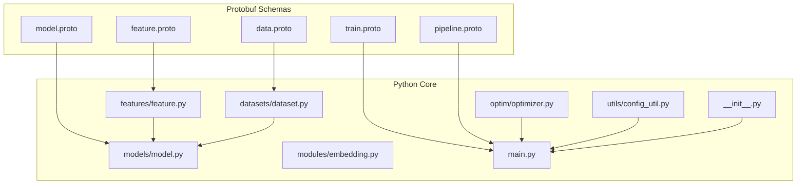
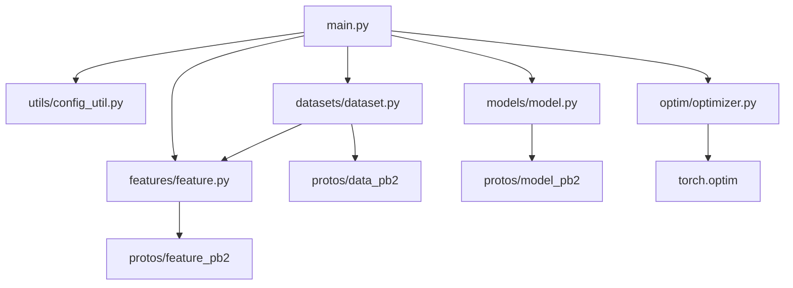

# API Reference and Complete Documentation

<cite>
**Referenced Files in This Document**
- [data.proto](file://tzrec/protos/data.proto)
- [feature.proto](file://tzrec/protos/feature.proto)
- [model.proto](file://tzrec/protos/model.proto)
- [train.proto](file://tzrec/protos/train.proto)
- [pipeline.proto](file://tzrec/protos/pipeline.proto)
- [__init__.py](file://tzrec/__init__.py)
- [main.py](file://tzrec/main.py)
- [model.py](file://tzrec/models/model.py)
- [feature.py](file://tzrec/features/feature.py)
- [dataset.py](file://tzrec/datasets/dataset.py)
- [config_util.py](file://tzrec/utils/config_util.py)
- [optimizer.py](file://tzrec/optim/optimizer.py)
- [embedding.py](file://tzrec/modules/embedding.py)
- [version.py](file://tzrec/version.py)
- [deepfm_criteo.config](file://examples/deepfm_criteo.config)
- [mmoe_taobao.config](file://examples/mmoe_taobao.config)
</cite>

## Table of Contents

1. [Introduction](#introduction)
1. [Project Structure](#project-structure)
1. [Core Components](#core-components)
1. [Architecture Overview](#architecture-overview)
1. [Detailed Component Analysis](#detailed-component-analysis)
1. [Dependency Analysis](#dependency-analysis)
1. [Performance Considerations](#performance-considerations)
1. [Troubleshooting Guide](#troubleshooting-guide)
1. [Conclusion](#conclusion)
1. [Appendices](#appendices)

## Introduction

This document provides a comprehensive API reference and complete documentation for TorchEasyRec. It covers:

- Protocol Buffer APIs for configuration schemas (data.proto, feature.proto, model.proto, train.proto, pipeline.proto)
- Public Python interfaces for models, features, datasets, optimizers, and utilities
- Function signatures, parameter types, return values, and exception handling
- Configuration schema documentation with validation rules and defaults
- Usage examples, common workflows, and integration scenarios
- API versioning, deprecation policies, and migration guidance

## Project Structure

TorchEasyRec organizes functionality into clearly separated layers:

- Protobuf configuration schemas define the declarative configuration model
- Python modules implement data loading, feature engineering, model construction, training, evaluation, and prediction
- Utilities provide configuration editing, checkpointing, distributed training, and export capabilities



**Diagram sources**

- \[data.proto\](file://tzrec/protos/data.proto#L1-L138)
- \[feature.proto\](file://tzrec/protos/feature.proto#L1-L957)
- \[model.proto\](file://tzrec/protos/model.proto#L1-L90)
- \[train.proto\](file://tzrec/protos/train.proto#L1-L62)
- \[pipeline.proto\](file://tzrec/protos/pipeline.proto#L1-L30)
- \[model.py\](file://tzrec/models/model.py#L1-L423)
- \[feature.py\](file://tzrec/features/feature.py#L1-L1268)
- \[dataset.py\](file://tzrec/datasets/dataset.py#L1-L733)
- \[optimizer.py\](file://tzrec/optim/optimizer.py#L1-L238)
- \[embedding.py\](file://tzrec/modules/embedding.py#L1-L1341)
- \[config_util.py\](file://tzrec/utils/config_util.py#L1-L299)
- \[main.py\](file://tzrec/main.py#L1-L1389)
- \[__init__.py\](file://tzrec/__init__.py#L1-L73)

**Section sources**

- \[data.proto\](file://tzrec/protos/data.proto#L1-L138)
- \[feature.proto\](file://tzrec/protos/feature.proto#L1-L957)
- \[model.proto\](file://tzrec/protos/model.proto#L1-L90)
- \[train.proto\](file://tzrec/protos/train.proto#L1-L62)
- \[pipeline.proto\](file://tzrec/protos/pipeline.proto#L1-L30)
- \[model.py\](file://tzrec/models/model.py#L1-L423)
- \[feature.py\](file://tzrec/features/feature.py#L1-L1268)
- \[dataset.py\](file://tzrec/datasets/dataset.py#L1-L733)
- \[optimizer.py\](file://tzrec/optim/optimizer.py#L1-L238)
- \[embedding.py\](file://tzrec/modules/embedding.py#L1-L1341)
- \[config_util.py\](file://tzrec/utils/config_util.py#L1-L299)
- \[main.py\](file://tzrec/main.py#L1-L1389)
- \[__init__.py\](file://tzrec/__init__.py#L1-L73)

## Core Components

This section documents the primary Python classes and functions exposed by TorchEasyRec’s public API.

- Models
  - BaseModel: Base class for all models with predict, loss, metric initialization, and training wrappers
  - TrainWrapper, PredictWrapper, ScriptWrapper, CombinedModelWrapper: Pipeline and inference helpers
- Features
  - BaseFeature: Base class for feature transformations; derived classes include IdFeature, RawFeature, ComboFeature, LookupFeature, MatchFeature, ExprFeature, OverlapFeature, TokenizeFeature, KvDotProduct, and CustomFeature
- Datasets
  - BaseDataset, BaseReader, BaseWriter: Data ingestion, batching, sampling, and writing
  - create_dataloader: Factory for DataLoader instances
- Optimizers
  - TZRecOptimizer: Wrapper around KeyedOptimizer supporting gradient accumulation and scaler
- Modules
  - EmbeddingGroup, EmbeddingGroupImpl, SequenceEmbeddingGroupImpl: Feature grouping and embedding lookup
- Utilities
  - config_util: Load/save configs, edit configs via JSON, and compatibility helpers
  - checkpoint_util, export_util, filesystem_util, logging_util, plan_util: Supporting utilities

Key entry points:

- train_and_evaluate: End-to-end training and evaluation loop
- evaluate: Standalone evaluation
- predict: Prediction workflow
- export: Model export

**Section sources**

- \[model.py\](file://tzrec/models/model.py#L1-L423)
- \[feature.py\](file://tzrec/features/feature.py#L1-L1268)
- \[dataset.py\](file://tzrec/datasets/dataset.py#L1-L733)
- \[optimizer.py\](file://tzrec/optim/optimizer.py#L1-L238)
- \[embedding.py\](file://tzrec/modules/embedding.py#L1-L1341)
- \[config_util.py\](file://tzrec/utils/config_util.py#L1-L299)
- \[main.py\](file://tzrec/main.py#L527-L800)

## Architecture Overview

The system follows a configuration-driven architecture:

- EasyRecConfig (pipeline.proto) orchestrates training, evaluation, export, data, features, and model configuration
- DataConfig drives dataset creation and batching
- FeatureConfigs define feature engineering pipelines
- ModelConfig selects and configures a model family and its internal structure
- TrainConfig controls optimization, logging, and checkpointing

```mermaid
sequenceDiagram
participant CLI as "CLI/Caller"
participant Main as "main.py"
participant Config as "config_util.py"
participant Data as "datasets/dataset.py"
participant Feat as "features/feature.py"
participant Mod as "models/model.py"
participant Opt as "optim/optimizer.py"
CLI->>Main : train_and_evaluate(pipeline_config_path)
Main->>Config : load_pipeline_config()
Config-->>Main : EasyRecConfig
Main->>Feat : create_features(feature_configs, data_config)
Feat-->>Main : List[BaseFeature]
Main->>Data : create_dataloader(data_config, features, input_path, mode)
Data-->>Main : DataLoader
Main->>Mod : _create_model(model_config, features, labels, sample_weights, sampler_type)
Mod-->>Main : BaseModel
Main->>Opt : build optimizer and schedulers
Opt-->>Main : Optimizer
Main->>Main : _train_and_evaluate(...)
Main-->>CLI : Training/Evaluation complete
```

**Diagram sources**

- \[pipeline.proto\](file://tzrec/protos/pipeline.proto#L11-L29)
- \[config_util.py\](file://tzrec/utils/config_util.py#L25-L48)
- \[dataset.py\](file://tzrec/datasets/dataset.py#L645-L733)
- \[feature.py\](file://tzrec/features/feature.py#L93-L111)
- \[model.py\](file://tzrec/models/model.py#L126-L158)
- \[optimizer.py\](file://tzrec/optim/optimizer.py#L26-L70)
- \[main.py\](file://tzrec/main.py#L527-L734)

## Detailed Component Analysis

### Protocol Buffers API Reference

#### data.proto

- Enums
  - DatasetType: OdpsDataset, ParquetDataset, CsvDataset, OdpsDatasetV1
  - FieldType: INT32, INT64, STRING, FLOAT, DOUBLE
  - FgMode: FG_NONE, FG_NORMAL, FG_DAG, FG_BUCKETIZE
- Messages
  - Field: input_name, optional input_type
  - DataConfig: batch_size, dataset_type, deprecated fg_encoded, fg_encoded_multival_sep, label_fields, num_workers, pin_memory, input_fields, delimiter, with_header, eval_batch_size, drop_remainder, fg_threads, is_orderby_partition, odps_data_quota_name, sample_mask_prob, negative_sample_mask_prob, force_base_data_group, sample_weight_fields, fg_mode, enable_hstu, shuffle, shuffle_buffer_size, odps_data_compression, sample_cost_field, batch_cost_size, sampler (oneof)
- Defaults and Validation
  - Defaults are defined inline; validation occurs at runtime when unsupported types are encountered

**Section sources**

- \[data.proto\](file://tzrec/protos/data.proto#L1-L138)

#### feature.proto

- Constraints and Evictions
  - ParameterConstraints: sharding_types, compute_kernels
  - Eviction policies: LFU_EvictionPolicy, LRU_EvictionPolicy, DistanceLFU_EvictionPolicy
  - ZeroCollisionHash: zch_size, eviction_interval, eviction_policy, threshold_filtering_func
- Dynamic Embeddings
  - DynamicEmbInitializerArgs: mode, mean, std_dev, lower, upper, value
  - DynamicEmbFrequencyAdmissionStrategy: threshold, initializer_args, counter_capacity, counter_bucket_capacity
  - DynamicEmbedding: initializer_args, eval_initializer_args, score_strategy, max_capacity, cache_load_factor, init_capacity_per_rank, init_table, admission_strategy
- Feature Types
  - IdFeature: feature_name, expression, embedding_name, embedding_dim, hash_bucket_size, num_buckets, vocab_list, vocab_dict, value_dim, pooling, default_value, separator, weighted, init_fn, use_mask, zch, vocab_file, asset_dir, dynamicemb, fg_encoded_default_value, default_bucketize_value, fg_value_type, trainable, stub_type, data_type, embedding_constraints, sequence_length, sequence_delim, sequence_fields
  - RawFeature: feature_name, expression, embedding_name, embedding_dim, boundaries, value_dim, normalizer, pooling, default_value, separator, init_fn, use_mask, fg_encoded_default_value, trainable, stub_type, data_type, dense_emb (AutoDisEmbedding or MLPEmbedding), embedding_constraints, sequence_length, sequence_delim, sequence_fields
  - ComboFeature, LookupFeature, MatchFeature, ExprFeature, OverlapFeature, TokenizeFeature, KvDotProduct, CustomFeature: similar structure with specialized fields
- Text Normalization
  - TextNormalizeOption: TEXT_LOWER2UPPER, TEXT_UPPER2LOWER, TEXT_SBC2DBC, TEXT_CHT2CHS, TEXT_FILTER, TEXT_SPLITCHRS, TEXT_REMOVE_SPACE
  - TextNormalizer: max_length, stop_char_file, norm_options
- Defaults and Validation
  - Many fields have defaults; invalid combinations raise runtime errors (e.g., unsupported dtype for fg-encoded features)

**Section sources**

- \[feature.proto\](file://tzrec/protos/feature.proto#L1-L957)

#### model.proto

- Enums
  - FeatureGroupType: DEEP, WIDE, SEQUENCE, JAGGED_SEQUENCE
- Messages
  - SeqGroupConfig: group_name, feature_names
  - FeatureGroupConfig: group_name, feature_names, group_type, sequence_groups, sequence_encoders
  - ModelConfig: feature_groups, model (oneof), num_class, losses, metrics, train_metrics, variational_dropout, kernel, use_pareto_loss_weight
- Supported Models (oneof)
  - Rank models: DLRM, DeepFM, WideAndDeep, DCNV1, DCNV2, xDeepFM, WuKong
  - Multi-task models: SimpleMultiTask, MMoE, DBMTL, PLE, DC2VR, DlrmHSTU
  - Matching models: DSSM, DSSMV2, DAT, HSTUMatch, MIND
  - Retrieval: TDM
  - Generative: RocketLaunching
- Defaults and Validation
  - num_class default 1; kernel default PYTORCH; use_pareto_loss_weight default false

**Section sources**

- \[model.proto\](file://tzrec/protos/model.proto#L1-L90)

#### train.proto

- Messages
  - GradScaler: init_scale, growth_factor, backoff_factor, growth_interval
  - TrainConfig: sparse_optimizer, dense_optimizer, num_steps, num_epochs, save_checkpoints_steps, fine_tune_checkpoint, fine_tune_ckpt_param_map, log_step_count_steps, is_profiling, use_tensorboard, save_checkpoints_epochs, tensorboard_summaries, cudnn_allow_tf32, cuda_matmul_allow_tf32, global_embedding_constraints, mixed_precision, grad_scaler, gradient_accumulation_steps
- Defaults and Validation
  - Many defaults defined; tensorboard_summaries validated against allowed values

**Section sources**

- \[train.proto\](file://tzrec/protos/train.proto#L1-L62)

#### pipeline.proto

- Messages
  - EasyRecConfig: train_input_path, eval_input_path, model_dir, train_config, eval_config, export_config, data_config, feature_configs, model_config
- Usage
  - Declarative configuration for end-to-end workflows

**Section sources**

- \[pipeline.proto\](file://tzrec/protos/pipeline.proto#L1-L30)

### Python API Reference

#### Models

- BaseModel
  - Methods: predict(batch), init_loss(), loss(predictions, batch), init_metric(), update_metric(predictions, batch, losses), compute_metric(), compute_train_metric(), sparse_parameters()
  - Properties: \_base_model_config, \_model_type, \_features, \_labels, \_model_config, \_metric_modules, \_loss_modules, \_train_metric_modules
- TrainWrapper
  - forward(batch): returns total_loss, losses, predictions, batch; supports mixed precision
- PredictWrapper
  - forward(batch): returns predictions; supports mixed precision and output column filtering
- ScriptWrapper
  - forward(data, device): converts dict to Batch and predicts
- CombinedModelWrapper
  - forward(data, device): combines sparse and dense parts

**Section sources**

- \[model.py\](file://tzrec/models/model.py#L39-L423)

#### Features

- BaseFeature
  - Methods: parse(input_data, is_training), side_inputs, parameter_constraints(emb_config), mc_module(device), emb_bag_config, emb_config, dense_emb_config
  - Properties: name, is_neg, data_group, feature_config, is_user_feat, value_dim, output_dim, is_sparse, is_sequence, is_grouped_sequence, is_weighted, has_embedding, pooling_type, num_embeddings
- Derived Features
  - IdFeature, RawFeature, ComboFeature, LookupFeature, MatchFeature, ExprFeature, OverlapFeature, TokenizeFeature, KvDotProduct, CustomFeature
- Exceptions
  - InvalidFgInputError: raised when feature inputs are missing or invalid

**Section sources**

- \[feature.py\](file://tzrec/features/feature.py#L375-L1268)

#### Datasets

- BaseDataset
  - Methods: launch_sampler_cluster(), get_sampler_cluster(), __iter__(), \_build_batch(input_data), sampled_batch_size
  - Properties: input_fields, get_worker_info()
- BaseReader
  - Methods: schema, to_batches(), \_slice_buff_data(), \_arrow_reader_iter(), num_files()
- BaseWriter
  - Methods: write(output_dict), close(), __del__()
- Factories
  - create_reader(), create_writer(), create_dataloader()

**Section sources**

- \[dataset.py\](file://tzrec/datasets/dataset.py#L149-L733)

#### Optimizers

- TZRecOptimizer
  - Methods: zero_grad(set_to_none), step(closure)
  - Supports gradient accumulation and GradScaler

**Section sources**

- \[optimizer.py\](file://tzrec/optim/optimizer.py#L26-L238)

#### Modules

- EmbeddingGroup
  - Methods: grouped_features_keys(), group_names(), group_dims(group_name), group_total_dim(group_name), group_feature_dims(group_name), group_type(group_name), has_group(group_name), forward(batch), predict(batch)
- EmbeddingGroupImpl
  - Methods: group_dims(group_name), group_feature_dims(group_name), group_total_dim(group_name), parameter_constraints(prefix)
- SequenceEmbeddingGroupImpl
  - Methods: group_dims(group_name), group_total_dim(group_name), all_group_total_dim()

**Section sources**

- \[embedding.py\](file://tzrec/modules/embedding.py#L139-L1341)

#### Utilities

- config_util
  - Functions: load_pipeline_config(path, allow_unknown_field), save_message(message, filepath), config_to_kwargs(config), which_msg(config, oneof_group), edit_config(pipeline_config, edit_config_json)
- Other utilities
  - checkpoint_util, export_util, filesystem_util, logging_util, plan_util

**Section sources**

- \[config_util.py\](file://tzrec/utils/config_util.py#L25-L299)

#### Entry Points

- train_and_evaluate(pipeline_config_path, train_input_path, eval_input_path, model_dir, continue_train, fine_tune_checkpoint, edit_config_json, ignore_restore_optimizer)
- evaluate(pipeline_config_path, checkpoint_path, eval_input_path, eval_result_filename)
- predict(pipeline_config_path, checkpoint_path, input_path, output_path, reserved_columns, batch_size, num_workers)
- export(pipeline_config_path, checkpoint_path, output_dir, output_format)

**Section sources**

- \[main.py\](file://tzrec/main.py#L527-L800)

### Usage Examples and Workflows

#### Example: DeepFM on Criteo

- Configuration highlights
  - data_config: batch_size, dataset_type, fg_mode, label_fields, num_workers
  - feature_configs: multiple id_feature and raw_feature entries
  - model_config: feature_groups (wide, fm, deep), deepfm with hidden_units, metrics and losses
- Execution
  - train_and_evaluate with EasyRecConfig path

**Section sources**

- \[deepfm_criteo.config\](file://examples/deepfm_criteo.config#L1-L397)
- \[main.py\](file://tzrec/main.py#L527-L734)

#### Example: MMoE on Taobao Multitask

- Configuration highlights
  - data_config: fg_mode DAG, multiple labels
  - feature_configs: user/item/context features with expressions and boundaries
  - model_config: mmoe with experts, task towers, metrics and losses per task
- Execution
  - train_and_evaluate with EasyRecConfig path

**Section sources**

- \[mmoe_taobao.config\](file://examples/mmoe_taobao.config#L1-L216)
- \[main.py\](file://tzrec/main.py#L527-L734)

### API Versioning, Deprecation, and Migration

- Version
  - Current version is defined in version.py
- Deprecations
  - data_config.fg_encoded is deprecated in favor of data_config.fg_mode
  - Compatibility helper maps legacy flags to new fg_mode
- Migration
  - Replace fg_encoded with fg_mode and adjust fg_threads usage accordingly
  - Update configs to use oneof samplers consistently

**Section sources**

- \[version.py\](file://tzrec/version.py#L12-L13)
- \[config_util.py\](file://tzrec/utils/config_util.py#L78-L92)

## Dependency Analysis

This section maps dependencies among core components and their relationships.



**Diagram sources**

- \[main.py\](file://tzrec/main.py#L1-L1389)
- \[config_util.py\](file://tzrec/utils/config_util.py#L1-L299)
- \[dataset.py\](file://tzrec/datasets/dataset.py#L1-L733)
- \[feature.py\](file://tzrec/features/feature.py#L1-L1268)
- \[model.py\](file://tzrec/models/model.py#L1-L423)
- \[optimizer.py\](file://tzrec/optim/optimizer.py#L1-L238)

**Section sources**

- \[main.py\](file://tzrec/main.py#L1-L1389)
- \[config_util.py\](file://tzrec/utils/config_util.py#L1-L299)
- \[dataset.py\](file://tzrec/datasets/dataset.py#L1-L733)
- \[feature.py\](file://tzrec/features/feature.py#L1-L1268)
- \[model.py\](file://tzrec/models/model.py#L1-L423)
- \[optimizer.py\](file://tzrec/optim/optimizer.py#L1-L238)

## Performance Considerations

- Mixed Precision
  - TrainWrapper and PredictWrapper support FP16/BF16 via mixed_precision
- Gradient Accumulation
  - TZRecOptimizer supports gradient_accumulation_steps
- TF32 Settings
  - Allow TF32 based on train_config flags
- Data Pipeline
  - num_workers, pin_memory, shuffle_buffer_size impact throughput
- Sampler Cost Balancing
  - batch_cost_size and sample_cost_field enable cost-aware batching

[No sources needed since this section provides general guidance]

## Troubleshooting Guide

Common issues and resolutions:

- Unsupported dtype in DataConfig.input_fields
  - Ensure columns match supported Arrow types
- Invalid feature inputs
  - InvalidFgInputError indicates missing or malformed feature side inputs
- Unknown tensorboard_summaries
  - edit_config validates against allowed values
- Missing checkpoint
  - RuntimeError raised when fine_tune_checkpoint does not exist
- Feature group configuration
  - Sequence groups and encoders must be paired correctly for DEEP groups

**Section sources**

- \[dataset.py\](file://tzrec/datasets/dataset.py#L270-L282)
- \[feature.py\](file://tzrec/features/feature.py#L722-L749)
- \[config_util.py\](file://tzrec/utils/config_util.py#L144-L299)
- \[main.py\](file://tzrec/main.py#L594-L602)
- \[embedding.py\](file://tzrec/modules/embedding.py#L272-L343)

## Conclusion

This reference consolidates TorchEasyRec’s Protocol Buffer schemas and Python APIs, enabling rapid development and deployment of recommendation systems. Use the provided configuration examples and workflows to bootstrap training, evaluation, and prediction pipelines. Adhere to deprecation notices and leverage utilities for robust configuration management and distributed training.

[No sources needed since this section summarizes without analyzing specific files]

## Appendices

### Appendix A: Configuration Editing Syntax

- edit_config supports dot notation and bracket selectors
- Supports range slicing and conditional selection within lists
- Type conversion and field clearing handled automatically

**Section sources**

- \[config_util.py\](file://tzrec/utils/config_util.py#L144-L299)

### Appendix B: Environment and Initialization Notes

- OMP_NUM_THREADS defaults to 1
- Logging level controlled by LOG_LEVEL environment variable
- Deterministic algorithms can be enabled via USE_DETERMINISTIC_ALGORITHMS

**Section sources**

- \[__init__.py\](file://tzrec/__init__.py#L25-L64)
