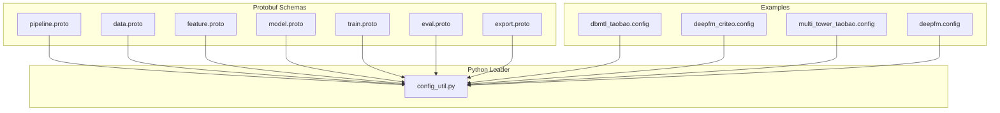
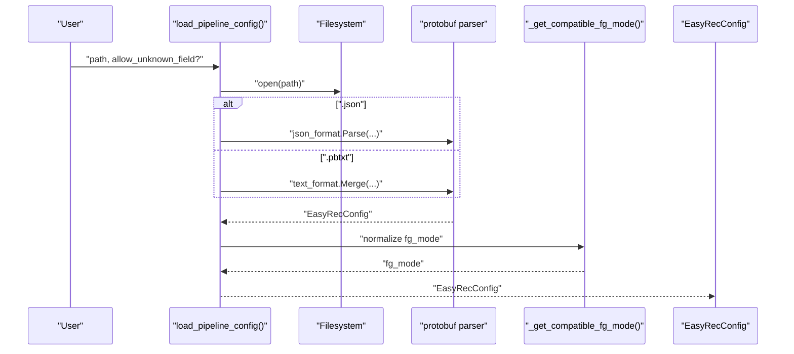
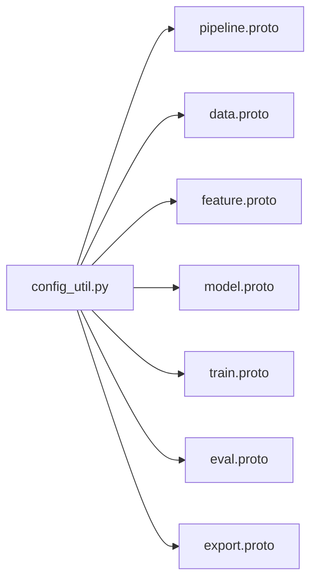

# Configuration Schemas and Validation

<cite>
**Referenced Files in This Document**
- [config_util.py](file://tzrec/utils/config_util.py)
- [pipeline.proto](file://tzrec/protos/pipeline.proto)
- [data.proto](file://tzrec/protos/data.proto)
- [feature.proto](file://tzrec/protos/feature.proto)
- [model.proto](file://tzrec/protos/model.proto)
- [train.proto](file://tzrec/protos/train.proto)
- [eval.proto](file://tzrec/protos/eval.proto)
- [export.proto](file://tzrec/protos/export.proto)
- [dbmtl_taobao.config](file://examples/dbmtl_taobao.config)
- [deepfm_criteo.config](file://examples/deepfm_criteo.config)
- [multi_tower_taobao.config](file://examples/multi_tower_taobao.config)
- [deepfm.config](file://experiments/deepfm/deepfm.config)
</cite>

## Table of Contents

1. [Introduction](#introduction)
1. [Project Structure](#project-structure)
1. [Core Components](#core-components)
1. [Architecture Overview](#architecture-overview)
1. [Detailed Component Analysis](#detailed-component-analysis)
1. [Dependency Analysis](#dependency-analysis)
1. [Performance Considerations](#performance-considerations)
1. [Troubleshooting Guide](#troubleshooting-guide)
1. [Conclusion](#conclusion)
1. [Appendices](#appendices)

## Introduction

This document describes TorchEasyRec’s configuration system with a focus on schema definitions, supported formats, validation rules, defaults, and practical examples. TorchEasyRec uses Protocol Buffers as the canonical schema definition language for configuration, with a Python loader that supports both text-format and JSON inputs. Configuration files define training, evaluation, export, data ingestion, feature engineering, and model architecture. This guide explains how to compose valid configurations, resolve defaults, and troubleshoot common schema mismatches.

## Project Structure

TorchEasyRec organizes configuration schemas in Protocol Buffer files under the protos package and provides a Python utility to load, validate, and manipulate configurations. Example configurations demonstrate real-world usage across training pipelines, feature engineering, and model definitions.

**Diagram sources**

- \[pipeline.proto\](file://tzrec/protos/pipeline.proto#L11-L29)
- \[data.proto\](file://tzrec/protos/data.proto#L43-L137)
- \[feature.proto\](file://tzrec/protos/feature.proto#L112-L180)
- \[model.proto\](file://tzrec/protos/model.proto#L40-L89)
- \[train.proto\](file://tzrec/protos/train.proto#L21-L61)
- \[eval.proto\](file://tzrec/protos/eval.proto#L4-L9)
- \[export.proto\](file://tzrec/protos/export.proto#L4-L13)
- \[config_util.py\](file://tzrec/utils/config_util.py#L25-L48)
- \[dbmtl_taobao.config\](file://examples/dbmtl_taobao.config#L1-L224)
- \[deepfm_criteo.config\](file://examples/deepfm_criteo.config#L1-L397)
- \[multi_tower_taobao.config\](file://examples/multi_tower_taobao.config#L1-L207)
- \[deepfm.config\](file://experiments/deepfm/deepfm.config#L1-L142)

**Section sources**

- \[config_util.py\](file://tzrec/utils/config_util.py#L25-L48)
- \[pipeline.proto\](file://tzrec/protos/pipeline.proto#L11-L29)

## Core Components

- EasyRecConfig: Top-level container holding training, evaluation, export, data, feature, and model configuration blocks.
- DataConfig: Defines dataset ingestion, batching, feature generation mode, workers, and sampling controls.
- FeatureConfig: Declares feature engineering specs for ID, raw, combo, lookup, match, expression, overlap, tokenize, KV dot product, and custom features.
- ModelConfig: Specifies feature groups, model family, losses, metrics, and training-time metrics.
- Train/Eval/Export Config: Control training schedule, evaluation cadence, and export policies.

Key defaults and constraints are defined in the protobuf files. The Python loader supports both text-format and JSON inputs and can ignore unknown fields to ease migration.

**Section sources**

- \[pipeline.proto\](file://tzrec/protos/pipeline.proto#L11-L29)
- \[data.proto\](file://tzrec/protos/data.proto#L43-L137)
- \[feature.proto\](file://tzrec/protos/feature.proto#L112-L180)
- \[model.proto\](file://tzrec/protos/model.proto#L40-L89)
- \[train.proto\](file://tzrec/protos/train.proto#L21-L61)
- \[eval.proto\](file://tzrec/protos/eval.proto#L4-L9)
- \[export.proto\](file://tzrec/protos/export.proto#L4-L13)
- \[config_util.py\](file://tzrec/utils/config_util.py#L25-L48)

## Architecture Overview

The configuration loading pipeline reads a file path, detects format (.pbtxt vs .json), parses into a typed protobuf object, and normalizes legacy fields. It then exposes helpers to convert to dicts, inspect oneof selections, and edit configs via dot-path expressions.

**Diagram sources**

- \[config_util.py\](file://tzrec/utils/config_util.py#L25-L48)
- \[data.proto\](file://tzrec/protos/data.proto#L78-L92)

**Section sources**

- \[config_util.py\](file://tzrec/utils/config_util.py#L25-L48)

## Detailed Component Analysis

### EasyRecConfig Schema

- Required fields: train_input_path, eval_input_path, model_dir.
- Optional blocks: train_config, eval_config, export_config, data_config, feature_configs (repeated), model_config.

Validation rules:

- At least one of train_config or eval_config should be present depending on intended workflow.
- model_dir must be writable and unique per experiment.
- data_config.dataset_type must be one of the defined enums.

Defaults:

- Many numeric fields in child messages carry explicit defaults in their respective protobuf files.

Common pitfalls:

- Omitting required fields leads to parse errors.
- Using deprecated fields (e.g., fg_encoded) triggers warnings; migrate to fg_mode.

**Section sources**

- \[pipeline.proto\](file://tzrec/protos/pipeline.proto#L11-L29)
- \[data.proto\](file://tzrec/protos/data.proto#L43-L137)

### DataConfig Schema

Enums and defaults:

- DatasetType: OdpsDataset, ParquetDataset, CsvDataset, OdpsDatasetV1.
- FgMode: FG_NONE, FG_NORMAL, FG_DAG, FG_BUCKETIZE.
- Defaults include batch_size, num_workers, pin_memory, delimiter, with_header, shuffle, shuffle_buffer_size, odps_data_compression, and fg_mode.

Validation rules:

- fg_mode and fg_encoded are mutually normalized; fg_encoded is deprecated.
- For CSV, input_fields ordering must match file layout; delimiter and with_header must match the dataset.
- For ODPS, odps_data_quota_name and partition ordering flags are honored.

Practical tips:

- Set fg_mode to FG_DAG when feature generation is handled by a DAG handler; otherwise FG_NORMAL or FG_NONE.
- For large datasets, increase num_workers and tune batch sizes.

**Section sources**

- \[data.proto\](file://tzrec/protos/data.proto#L6-L34)
- \[data.proto\](file://tzrec/protos/data.proto#L43-L137)
- \[config_util.py\](file://tzrec/utils/config_util.py#L78-L92)

### Feature Engineering (FeatureConfig)

Feature types and constraints:

- IdFeature: embedding_dim, hash_bucket_size or num_buckets, vocab_list/vocab_dict, default_value, separator, weighted, pooling, trainable, sequence_length, sequence_delim, sequence_fields, dynamic embedding, ZCH, and constraints.
- RawFeature: boundaries for bucketization, value_dim, normalizer expressions, pooling, and optional dense embedding variants.
- ComboFeature/LookupFeature/MatchFeature/ExprFeature/OverlapFeature/TokenizeFeature/KvDotProduct/CustomFeature: specialized fields for composite, lookup, matching, expression, overlap, tokenization, KV dot product, and custom operators.

Validation rules:

- Either hash_bucket_size or num_buckets must be set for ID features (unless using vocab_list/vocab_dict).
- boundaries must be sorted for RawFeature.
- sequence\_\* fields apply only when the feature is used as a sequence.
- dynamic embedding and ZCH require careful capacity planning.

Best practices:

- Prefer bucketized features for large vocabularies to reduce embedding table size.
- Use vocab_list/vocab_dict for controlled vocabularies and set default_bucketize_value when needed.

**Section sources**

- \[feature.proto\](file://tzrec/protos/feature.proto#L112-L180)
- \[feature.proto\](file://tzrec/protos/feature.proto#L182-L239)
- \[feature.proto\](file://tzrec/protos/feature.proto#L241-L301)
- \[feature.proto\](file://tzrec/protos/feature.proto#L303-L396)
- \[feature.proto\](file://tzrec/protos/feature.proto#L398-L490)
- \[feature.proto\](file://tzrec/protos/feature.proto#L492-L546)
- \[feature.proto\](file://tzrec/protos/feature.proto#L548-L606)
- \[feature.proto\](file://tzrec/protos/feature.proto#L635-L681)
- \[feature.proto\](file://tzrec/protos/feature.proto#L684-L742)
- \[feature.proto\](file://tzrec/protos/feature.proto#L744-L806)

### ModelConfig and Feature Groups

- FeatureGroupConfig: group_name, feature_names, group_type (DEEP/WIDE/SEQUENCE/JAGGED_SEQUENCE), sequence_groups, sequence_encoders.
- ModelConfig: repeated feature_groups, oneof model family (DLRM, DeepFM, MultiTower, MultiTowerDIN, MaskNet, WideAndDeep, DCNv1/v2, xDeepFM, WuKong, SimpleMultiTask, MMoE, DBMTL, PLE, DC2VR, DlrmHSTU, DSSM/DSSMv2, DAT, HSTUMatch, MIND, TDM, RocketLaunching), losses, metrics, train_metrics, variational_dropout, kernel, loss weighting flags.

Validation rules:

- group_type must match the intended model semantics.
- sequence_groups and encoders must align with declared sequence features.
- losses and metrics must match the model family and task type.

**Section sources**

- \[model.proto\](file://tzrec/protos/model.proto#L13-L32)
- \[model.proto\](file://tzrec/protos/model.proto#L40-L89)

### Training, Evaluation, and Export

- TrainConfig: sparse_optimizer, dense_optimizer, num_steps, num_epochs, checkpoint intervals, logging cadence, profiling flags, tensorboard settings, TF32 toggles, global embedding constraints, mixed precision, grad scaler, gradient accumulation.
- EvalConfig: num_steps, logging cadence.
- ExportConfig: exporter_type ("latest"|"best"), best_exporter_metric, metric_larger_is_better.

Validation rules:

- Optimizer blocks must be fully specified.
- Exporter metric must be present among configured metrics.

**Section sources**

- \[train.proto\](file://tzrec/protos/train.proto#L21-L61)
- \[eval.proto\](file://tzrec/protos/eval.proto#L4-L9)
- \[export.proto\](file://tzrec/protos/export.proto#L4-L13)

### Configuration Formats and Loading

- Protobuf text format (.pbtxt) and JSON are supported.
- Unknown fields can be ignored during parsing to ease migration.
- Legacy field fg_encoded is normalized to fg_mode with a deprecation warning.

Default resolution:

- Many fields carry explicit defaults in the protobuf files; missing optional fields fall back to defaults.

Environment-specific overrides and conditionals:

- The loader supports editing configs via dot-path expressions and type conversion; see edit_config for advanced override patterns.

**Section sources**

- \[config_util.py\](file://tzrec/utils/config_util.py#L25-L48)
- \[config_util.py\](file://tzrec/utils/config_util.py#L144-L299)
- \[data.proto\](file://tzrec/protos/data.proto#L78-L92)

### Complete Configuration Examples

#### Multi-Task Learning (DBMTL) on Taobao

- Demonstrates multi-task objectives with shared and task-specific towers, label relations, and losses/metrics per task.
- Uses ID and raw features with bucketization and embeddings.

**Section sources**

- \[dbmtl_taobao.config\](file://examples/dbmtl_taobao.config#L1-L224)

#### DeepFM on Criteo

- Wide and Deep feature groups, categorical buckets, continuous feature bucketization, and model-specific MLP layers.
- CSV dataset with tab delimiters and label fields.

**Section sources**

- \[deepfm_criteo.config\](file://examples/deepfm_criteo.config#L1-L397)

#### Multi-Tower on Taobao

- Separate user and item towers with shared final MLP, AUC metrics, and binary cross-entropy losses.
- Feature engineering with ID and raw features.

**Section sources**

- \[multi_tower_taobao.config\](file://examples/multi_tower_taobao.config#L1-L207)

#### DeepFM on MovieLens (CSV)

- CSV dataset ingestion, sequence feature groups, and pooling encoders for genre sequences.
- Wide and Deep groups with explicit sequence handling.

**Section sources**

- \[deepfm.config\](file://experiments/deepfm/deepfm.config#L1-L142)

## Dependency Analysis

The configuration system composes multiple protobuf messages into a cohesive pipeline. The loader depends on the protobuf runtime and delegates normalization for legacy fields.

**Diagram sources**

- \[config_util.py\](file://tzrec/utils/config_util.py#L20-L22)
- \[pipeline.proto\](file://tzrec/protos/pipeline.proto#L4-L9)

**Section sources**

- \[config_util.py\](file://tzrec/utils/config_util.py#L20-L22)

## Performance Considerations

- Batch sizing: Tune batch_size and eval_batch_size for GPU memory and throughput.
- Workers and shuffling: Increase num_workers and configure shuffle_buffer_size for data-heavy workloads.
- Feature generation: Use FG_DAG for offloaded feature generation to reduce CPU overhead.
- Mixed precision: Enable mixed_precision and grad_scaler for faster training when numerically stable.
- Embedding constraints: Apply sharding and compute kernel constraints to optimize embedding performance.

[No sources needed since this section provides general guidance]

## Troubleshooting Guide

Common configuration errors and resolutions:

- Unknown fields: Use allow_unknown_field during parsing to bypass unknown fields temporarily; avoid long-term reliance on this flag.
- Deprecated fg_encoded: Replace with fg_mode; the loader emits a deprecation warning and normalizes automatically.
- Missing required fields: Ensure train_input_path, eval_input_path, model_dir are set; verify dataset_type and label_fields.
- CSV schema mismatch: Align input_fields ordering and delimiter/with_header with the actual CSV layout.
- Sequence feature misconfiguration: Ensure sequence_groups and encoders match declared sequence features and lengths.
- Optimizer block incompleteness: Provide both sparse_optimizer and dense_optimizer with valid learning rate schedules.
- Metric/loss mismatch: Confirm that configured metrics and losses are supported by the chosen model family.

Validation and editing utilities:

- Use config_to_kwargs to inspect effective configuration as a dict.
- Use which_msg to determine the active model variant within a oneof.
- Use edit_config to programmatically override parameters via dot-path expressions and type conversion.

**Section sources**

- \[config_util.py\](file://tzrec/utils/config_util.py#L25-L48)
- \[config_util.py\](file://tzrec/utils/config_util.py#L66-L75)
- \[config_util.py\](file://tzrec/utils/config_util.py#L144-L299)

## Conclusion

TorchEasyRec’s configuration system centers on a strongly-typed Protocol Buffer schema with robust defaults and a flexible Python loader supporting both text and JSON formats. By adhering to schema constraints, leveraging defaults, and using the provided utilities, users can construct reliable training pipelines, feature engineering setups, and model architectures. The examples included here illustrate common patterns and provide a foundation for building modular, maintainable configurations.

[No sources needed since this section summarizes without analyzing specific files]

## Appendices

### Configuration Inheritance and Overrides

- Environment-specific overrides: Use edit_config to override parameters via dot-path expressions. It supports indexing, slicing, and conditional selection within repeated fields.
- Conditional updates: Conditions like a[condition] enable targeted updates across lists; type conversion ensures compatibility with target types.

**Section sources**

- \[config_util.py\](file://tzrec/utils/config_util.py#L144-L299)

### Best Practices for Configuration Organization

- Modularize: Split large configs into smaller feature groups and reuse common optimizer blocks.
- Versioning: Track configuration changes alongside model checkpoints; keep a changelog of significant schema updates.
- Defaults-first: Prefer defaults from protobuf files; override only when necessary.
- Validation: Validate CSV layouts and feature schemas before training; use small eval batches to catch issues early.

[No sources needed since this section provides general guidance]
