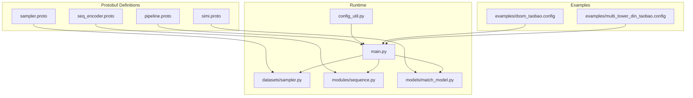
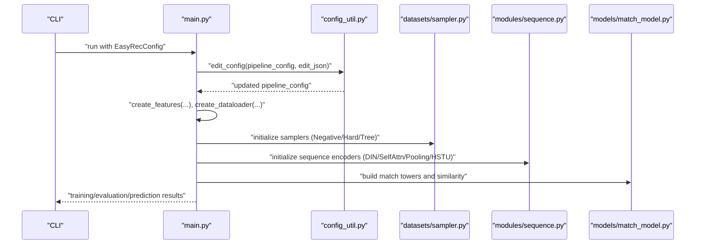
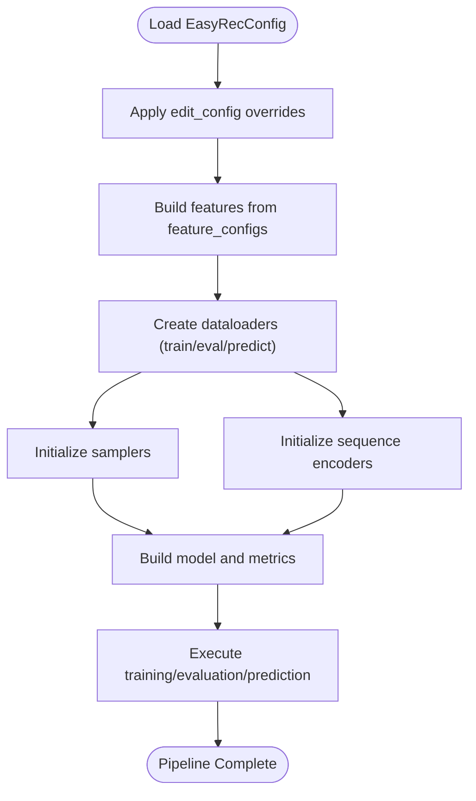
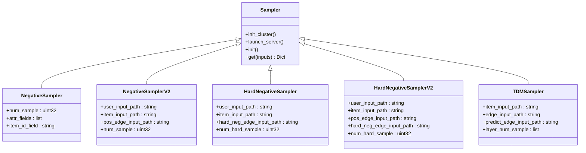
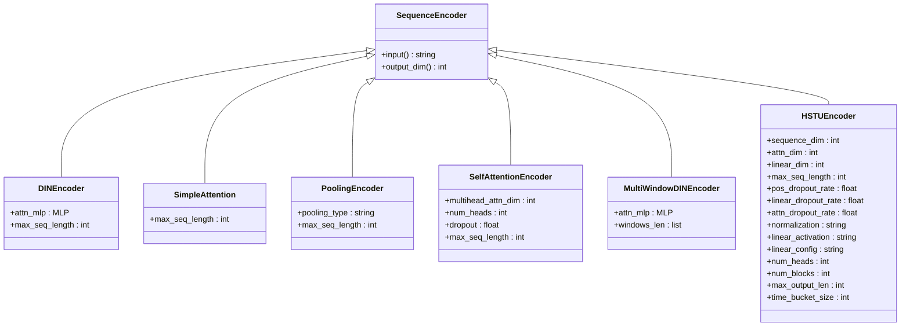
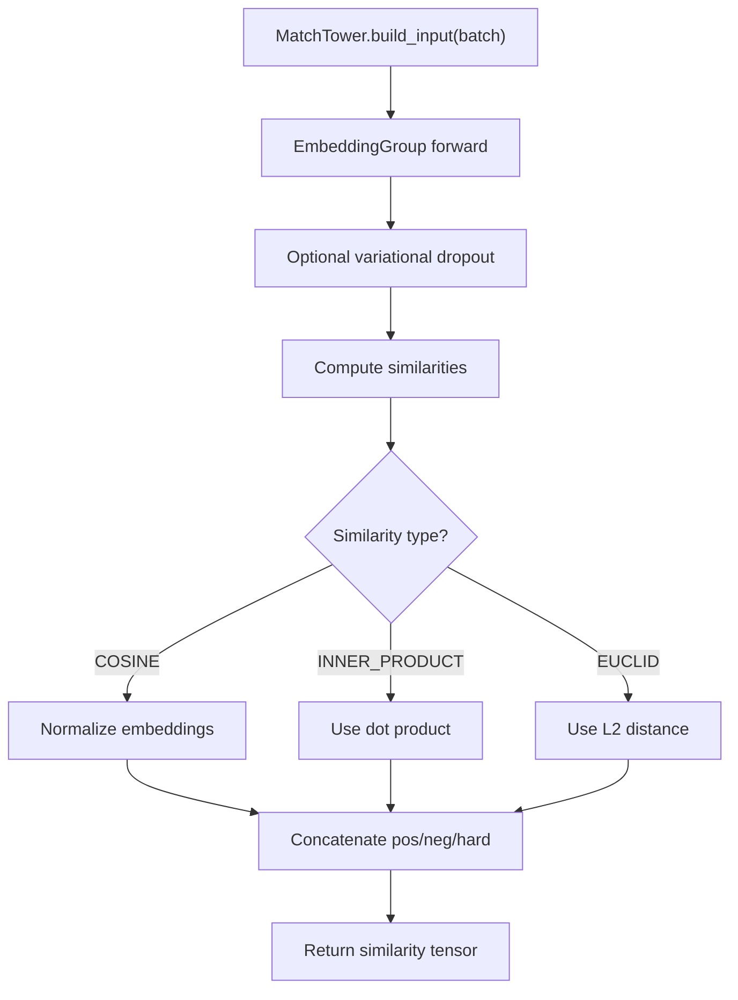
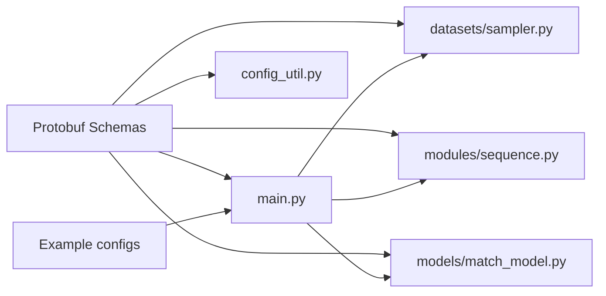

# Advanced Configuration API

<cite>
**Referenced Files in This Document**
- [pipeline.proto](file://tzrec/protos/pipeline.proto)
- [sampler.proto](file://tzrec/protos/sampler.proto)
- [seq_encoder.proto](file://tzrec/protos/seq_encoder.proto)
- [simi.proto](file://tzrec/protos/simi.proto)
- [config_util.py](file://tzrec/utils/config_util.py)
- [main.py](file://tzrec/main.py)
- [sampler.py](file://tzrec/datasets/sampler.py)
- [sequence.py](file://tzrec/modules/sequence.py)
- [match_model.py](file://tzrec/models/match_model.py)
- [dssm_taobao.config](file://examples/dssm_taobao.config)
- [multi_tower_din_taobao.config](file://examples/multi_tower_din_taobao.config)
</cite>

## Table of Contents

1. [Introduction](#introduction)
1. [Project Structure](#project-structure)
1. [Core Components](#core-components)
1. [Architecture Overview](#architecture-overview)
1. [Detailed Component Analysis](#detailed-component-analysis)
1. [Dependency Analysis](#dependency-analysis)
1. [Performance Considerations](#performance-considerations)
1. [Troubleshooting Guide](#troubleshooting-guide)
1. [Conclusion](#conclusion)
1. [Appendices](#appendices)

## Introduction

This document provides comprehensive guidance for configuring advanced machine learning workflows in the TorchEasyRec ecosystem. It focuses on:

- Pipeline orchestration for multi-stage, conditional, and complex recommendation workflows
- Sampling strategies including negative sampling, hard negative mining, and tree-structured sampling
- Sequence encoders for temporal feature processing, attention mechanisms, and sequence modeling
- Similarity computation configurations for matching models and retrieval systems

It synthesizes protocol buffers (protobuf) definitions, configuration examples, and implementation details to help both practitioners and engineers configure robust, scalable recommendation systems.

## Project Structure

The Advanced Configuration API spans several layers:

- Protobuf definitions define the schema for pipeline, sampling, sequence encoders, and similarity
- Configuration files encode end-to-end workflows for training, evaluation, and serving
- Runtime code builds datasets, features, models, and executes training/evaluation/prediction loops

**Diagram sources**

- \[pipeline.proto\](file://tzrec/protos/pipeline.proto#L11-L29)
- \[sampler.proto\](file://tzrec/protos/sampler.proto#L1-L142)
- \[seq_encoder.proto\](file://tzrec/protos/seq_encoder.proto#L1-L108)
- \[simi.proto\](file://tzrec/protos/simi.proto#L1-L9)
- \[config_util.py\](file://tzrec/utils/config_util.py#L223-L298)
- \[main.py\](file://tzrec/main.py#L571-L1084)
- \[sampler.py\](file://tzrec/datasets/sampler.py#L1-L200)
- \[sequence.py\](file://tzrec/modules/sequence.py#L54-L200)
- \[match_model.py\](file://tzrec/models/match_model.py#L110-L200)
- \[dssm_taobao.config\](file://examples/dssm_taobao.config#L1-L267)
- \[multi_tower_din_taobao.config\](file://examples/multi_tower_din_taobao.config#L1-L244)

**Section sources**

- \[pipeline.proto\](file://tzrec/protos/pipeline.proto#L11-L29)
- \[main.py\](file://tzrec/main.py#L571-L1084)

## Core Components

This section outlines the primary configuration components and their roles in orchestrating recommendation pipelines.

- Pipeline configuration

  - Defines training, evaluation, export, data, feature, and model configuration blocks
  - Supports editing via command-line JSON overrides

- Sampling strategies

  - NegativeSampler: weighted random sampling from item catalog
  - NegativeSamplerV2: separates user/item/edge inputs
  - HardNegativeSampler/HardNegativeSamplerV2: incorporates edges for hard negatives
  - TDMSampler: hierarchical tree sampling for taxonomy-aware retrieval

- Sequence encoders

  - DINEncoder: attention-based target-aware aggregation
  - SimpleAttention: lightweight attention
  - PoolingEncoder: mean/sum pooling
  - SelfAttentionEncoder: multi-head attention
  - MultiWindowDINEncoder: windowed attention across time scales
  - HSTUEncoder: temporal and positional encoding with transformer blocks

- Similarity computation

  - Enumerations for cosine, inner product, and Euclidean similarity
  - MatchTower computes user/item embeddings and similarity matrices

**Section sources**

- \[pipeline.proto\](file://tzrec/protos/pipeline.proto#L11-L29)
- \[sampler.proto\](file://tzrec/protos/sampler.proto#L1-L142)
- \[seq_encoder.proto\](file://tzrec/protos/seq_encoder.proto#L1-L108)
- \[simi.proto\](file://tzrec/protos/simi.proto#L1-L9)
- \[config_util.py\](file://tzrec/utils/config_util.py#L223-L298)
- \[sequence.py\](file://tzrec/modules/sequence.py#L54-L200)
- \[match_model.py\](file://tzrec/models/match_model.py#L110-L200)

## Architecture Overview

The runtime composes a pipeline from protobuf-defined configuration:

- Parse EasyRecConfig
- Build features and dataset loaders
- Initialize samplers and sequence encoders
- Construct models and metrics
- Execute training/evaluation/prediction loops

**Diagram sources**

- \[main.py\](file://tzrec/main.py#L571-L1084)
- \[config_util.py\](file://tzrec/utils/config_util.py#L223-L298)
- \[sampler.py\](file://tzrec/datasets/sampler.py#L1-L200)
- \[sequence.py\](file://tzrec/modules/sequence.py#L54-L200)
- \[match_model.py\](file://tzrec/models/match_model.py#L110-L200)

## Detailed Component Analysis

### Pipeline Orchestration

- Configuration composition

  - EasyRecConfig aggregates train, eval, export, data, feature, and model blocks
  - Feature groups define input sets and sequence encoders
  - Model blocks specify towers and similarity settings

- Runtime orchestration

  - Features are built from feature_configs
  - Dataloaders are created with data_config and feature groups
  - Editable configuration allows overriding fields at runtime

**Diagram sources**

- \[pipeline.proto\](file://tzrec/protos/pipeline.proto#L11-L29)
- \[config_util.py\](file://tzrec/utils/config_util.py#L223-L298)
- \[main.py\](file://tzrec/main.py#L571-L1084)

**Section sources**

- \[pipeline.proto\](file://tzrec/protos/pipeline.proto#L11-L29)
- \[config_util.py\](file://tzrec/utils/config_util.py#L223-L298)
- \[main.py\](file://tzrec/main.py#L571-L1084)

### Sampling Strategies

- NegativeSampler

  - Sample items not in batch with weighted random selection
  - Supports attribute fields and delimiter configuration

- NegativeSamplerV2

  - Separates user/item/edge inputs for richer negative sampling

- HardNegativeSampler/HardNegativeSamplerV2

  - Incorporate edges representing negative signals
  - Combine easy negatives with hard negatives for robust training

- TDMSampler

  - Hierarchical sampling along tree edges
  - Configurable per-layer sample counts and retention probabilities

**Diagram sources**

- \[sampler.proto\](file://tzrec/protos/sampler.proto#L1-L142)
- \[sampler.py\](file://tzrec/datasets/sampler.py#L569-L707)
- \[sampler.py\](file://tzrec/datasets/sampler.py#L768-L1021)

**Section sources**

- \[sampler.proto\](file://tzrec/protos/sampler.proto#L1-L142)
- \[sampler.py\](file://tzrec/datasets/sampler.py#L569-L707)
- \[sampler.py\](file://tzrec/datasets/sampler.py#L768-L1021)

### Sequence Encoders

- DINEncoder

  - Target-aware attention using concatenated query and sequence features
  - Configurable maximum sequence length

- SimpleAttention

  - Lightweight attention scoring between query and sequence

- PoolingEncoder

  - Mean or sum pooling over sequence dimension

- SelfAttentionEncoder

  - Multi-head self-attention with configurable dropout and sequence length

- MultiWindowDINEncoder

  - Windowed attention across multiple time windows

- HSTUEncoder

  - Temporal and positional encoding with transformer blocks, time buckets, and relative bias

**Diagram sources**

- \[seq_encoder.proto\](file://tzrec/protos/seq_encoder.proto#L1-L108)
- \[sequence.py\](file://tzrec/modules/sequence.py#L54-L200)

**Section sources**

- \[seq_encoder.proto\](file://tzrec/protos/seq_encoder.proto#L1-L108)
- \[sequence.py\](file://tzrec/modules/sequence.py#L54-L200)

### Similarity Computation

- Similarity enumeration supports:

  - COSINE
  - INNER_PRODUCT
  - EUCLID

- MatchTower computes:

  - User and item embeddings
  - Similarity matrix combining positive, negative, and hard negative samples
  - Optional normalization for cosine similarity

**Diagram sources**

- \[simi.proto\](file://tzrec/protos/simi.proto#L1-L9)
- \[match_model.py\](file://tzrec/models/match_model.py#L110-L200)

**Section sources**

- \[simi.proto\](file://tzrec/protos/simi.proto#L1-L9)
- \[match_model.py\](file://tzrec/models/match_model.py#L110-L200)

## Dependency Analysis

The following diagram highlights key dependencies among components:

**Diagram sources**

- \[pipeline.proto\](file://tzrec/protos/pipeline.proto#L11-L29)
- \[sampler.proto\](file://tzrec/protos/sampler.proto#L1-L142)
- \[seq_encoder.proto\](file://tzrec/protos/seq_encoder.proto#L1-L108)
- \[simi.proto\](file://tzrec/protos/simi.proto#L1-L9)
- \[main.py\](file://tzrec/main.py#L571-L1084)
- \[config_util.py\](file://tzrec/utils/config_util.py#L223-L298)
- \[sampler.py\](file://tzrec/datasets/sampler.py#L1-L200)
- \[sequence.py\](file://tzrec/modules/sequence.py#L54-L200)
- \[match_model.py\](file://tzrec/models/match_model.py#L110-L200)

**Section sources**

- \[main.py\](file://tzrec/main.py#L571-L1084)
- \[config_util.py\](file://tzrec/utils/config_util.py#L223-L298)

## Performance Considerations

- Efficient sampling

  - Use NegativeSamplerV2 and HardNegativeSampler variants to reduce noise and improve signal quality
  - Configure num_sample and num_hard_sample appropriately to balance recall and throughput

- Sequence modeling

  - Limit max_seq_length to reduce memory footprint
  - Prefer SelfAttentionEncoder with moderate num_heads and dropout for long sequences

- Similarity computation

  - Normalize embeddings for cosine similarity to stabilize gradients
  - Use in-batch negatives judiciously to avoid excessive recomputation

- Data loading

  - Tune batch_size and num_workers in data_config for optimal throughput
  - Leverage feature group DAG mode for complex feature transformations

[No sources needed since this section provides general guidance]

## Troubleshooting Guide

- Configuration editing

  - Use edit_config to override nested fields via JSON; ensure types match protobuf definitions

- Feature group DAG mode

  - Verify feature inputs align with DAG expectations; stub_type features require special handling

- Sampler initialization

  - Ensure GL server info is exchanged in distributed settings; confirm free ports and network connectivity

- Sequence encoder constraints

  - Query dimension must not exceed sequence dimension for DINEncoder
  - HSTUEncoder requires appropriate positional/time bucket configuration

**Section sources**

- \[config_util.py\](file://tzrec/utils/config_util.py#L223-L298)
- \[main.py\](file://tzrec/main.py#L571-L1084)
- \[sampler.py\](file://tzrec/datasets/sampler.py#L81-L127)
- \[sequence.py\](file://tzrec/modules/sequence.py#L70-L134)

## Conclusion

The Advanced Configuration API enables flexible, high-performance recommendation pipelines by composing:

- Modular protobuf-driven configuration
- Robust sampling strategies
- Expressive sequence encoders
- Pluggable similarity computation

By leveraging the provided schemas, examples, and runtime components, teams can design multi-stage, conditionally executed workflows tailored to complex recommendation scenarios.

[No sources needed since this section summarizes without analyzing specific files]

## Appendices

### Configuration Examples Index

- DSSM with pooling encoder for sequence modeling
- Multi-tower DIN with attention encoder for sequence modeling

**Section sources**

- \[dssm_taobao.config\](file://examples/dssm_taobao.config#L1-L267)
- \[multi_tower_din_taobao.config\](file://examples/multi_tower_din_taobao.config#L1-L244)
