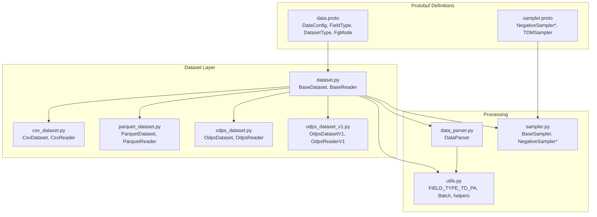
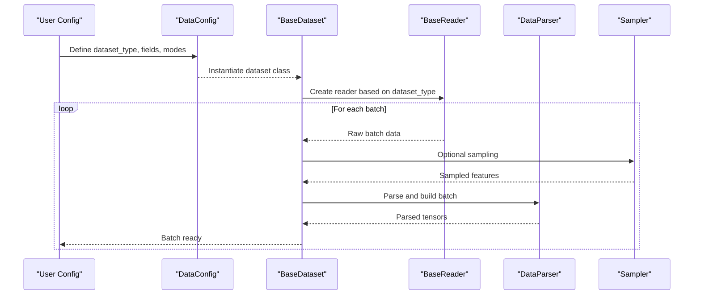
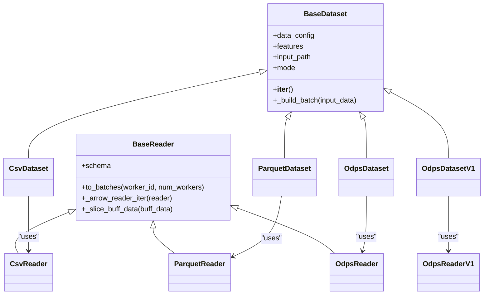
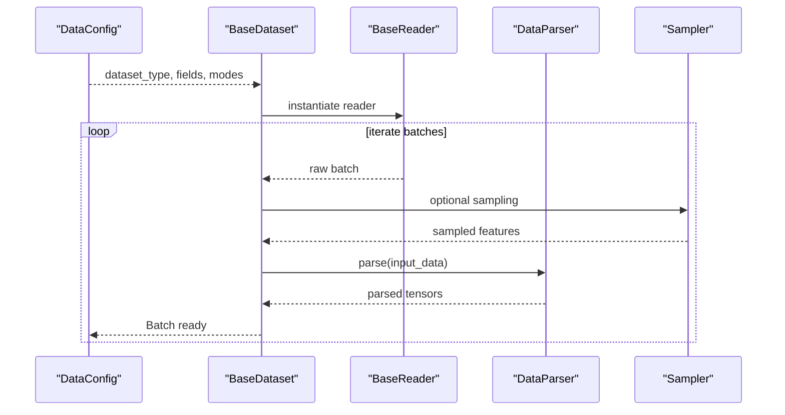
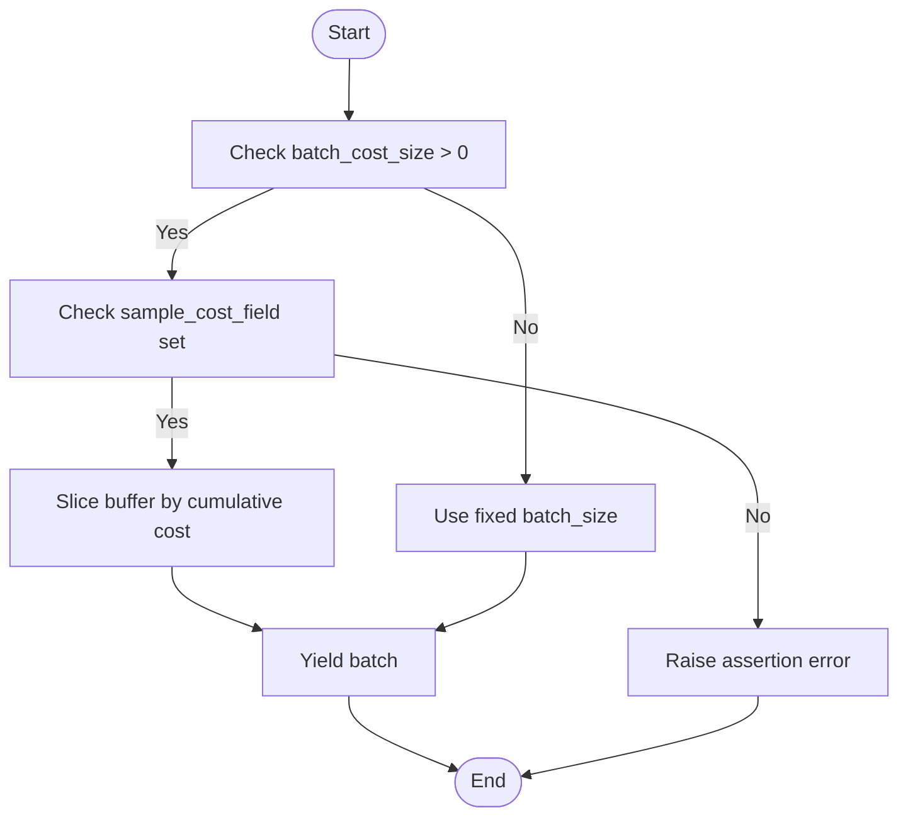
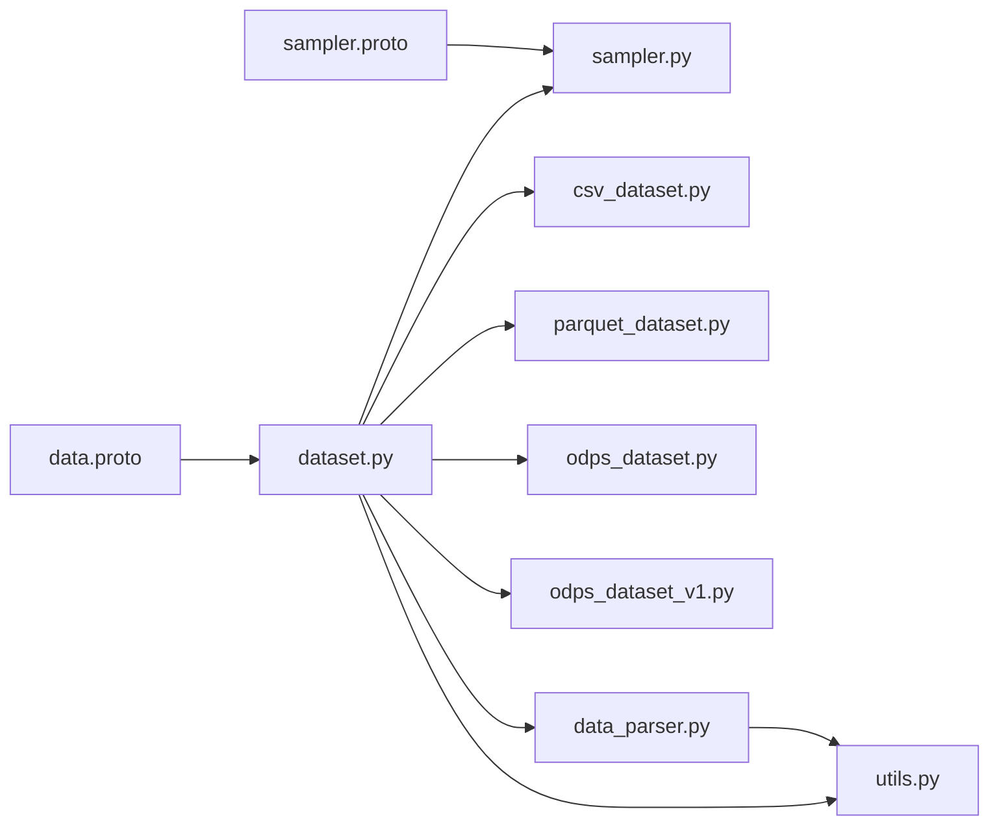

# Data Configuration API

<cite>
**Referenced Files in This Document**
- [data.proto](file://tzrec/protos/data.proto)
- [sampler.proto](file://tzrec/protos/sampler.proto)
- [dataset.py](file://tzrec/datasets/dataset.py)
- [csv_dataset.py](file://tzrec/datasets/csv_dataset.py)
- [parquet_dataset.py](file://tzrec/datasets/parquet_dataset.py)
- [odps_dataset.py](file://tzrec/datasets/odps_dataset.py)
- [odps_dataset_v1.py](file://tzrec/datasets/odps_dataset_v1.py)
- [data_parser.py](file://tzrec/datasets/data_parser.py)
- [utils.py](file://tzrec/datasets/utils.py)
- [sampler.py](file://tzrec/datasets/sampler.py)
- [deepfm_criteo.config](file://examples/deepfm_criteo.config)
- [multi_tower_taobao.config](file://examples/multi_tower_taobao.config)
</cite>

## Table of Contents

1. [Introduction](#introduction)
1. [Project Structure](#project-structure)
1. [Core Components](#core-components)
1. [Architecture Overview](#architecture-overview)
1. [Detailed Component Analysis](#detailed-component-analysis)
1. [Dependency Analysis](#dependency-analysis)
1. [Performance Considerations](#performance-considerations)
1. [Troubleshooting Guide](#troubleshooting-guide)
1. [Conclusion](#conclusion)
1. [Appendices](#appendices)

## Introduction

This document provides comprehensive documentation for the Data Configuration API, focusing on the DataConfig message and related field definitions. It explains data source types (OdpsDataset, ParquetDataset, CsvDataset, OdpsDatasetV1), field types (INT32, INT64, STRING, FLOAT, DOUBLE), and feature generation modes (FG_NONE, FG_NORMAL, FG_DAG, FG_BUCKETIZE). It also covers batch size configuration, data loading parameters, memory management settings, and sampling strategies. The document details field definitions, data type specifications, validation rules, and configuration examples, and clarifies the relationship between DataConfig and dataset readers, including CSV parsing options, partition ordering, and compression settings. Finally, it addresses performance optimization parameters such as shuffle buffer size and cost-based sampling.

## Project Structure

The Data Configuration API is defined in protocol buffers and implemented across dataset readers and parsers. The key components include:

- Protocol buffer definitions for DataConfig, FieldType, DatasetType, FgMode, and sampler configurations
- Dataset classes for CSV, Parquet, and MaxCompute (Odps) data sources
- A unified BaseDataset and BaseReader infrastructure
- Data parsing and batching logic
- Sampling strategies integrated via GraphLearn

**Diagram sources**

- \[data.proto\](file://tzrec/protos/data.proto#L43-L137)
- \[sampler.proto\](file://tzrec/protos/sampler.proto#L4-L141)
- \[dataset.py\](file://tzrec/datasets/dataset.py#L149-L732)
- \[csv_dataset.py\](file://tzrec/datasets/csv_dataset.py#L31-L206)
- \[parquet_dataset.py\](file://tzrec/datasets/parquet_dataset.py#L98-L303)
- \[odps_dataset.py\](file://tzrec/datasets/odps_dataset.py#L302-L660)
- \[odps_dataset_v1.py\](file://tzrec/datasets/odps_dataset_v1.py#L65-L184)
- \[data_parser.py\](file://tzrec/datasets/data_parser.py#L56-L952)
- \[utils.py\](file://tzrec/datasets/utils.py#L34-L516)
- \[sampler.py\](file://tzrec/datasets/sampler.py#L219-L1054)

**Section sources**

- \[data.proto\](file://tzrec/protos/data.proto#L1-L138)
- \[sampler.proto\](file://tzrec/protos/sampler.proto#L1-L142)
- \[dataset.py\](file://tzrec/datasets/dataset.py#L1-L733)

## Core Components

This section documents the DataConfig message and related enums and messages, including their fields, defaults, and usage semantics.

- DatasetType

  - OdpsDataset = 1
  - ParquetDataset = 2
  - CsvDataset = 3
  - OdpsDatasetV1 = 4

- FieldType

  - INT32 = 0
  - INT64 = 1
  - STRING = 2
  - FLOAT = 4
  - DOUBLE = 5

- FgMode

  - FG_NONE = 1: Input data is feature generate encoded; no FG is performed
  - FG_NORMAL = 2: Input data is raw feature; Python runs feature generation
  - FG_DAG = 3: Input data is raw feature; FG DAG handler runs feature generation
  - FG_BUCKETIZE = 4: Input is after feature generation but before bucketization; only bucketization is performed

- Field message

  - input_name: Required string
  - input_type: Optional FieldType; only needed for CsvDataset when value dtype cannot be inferred (all values in the column are null)

- DataConfig message

  - batch_size: Optional uint32; default 1024
  - dataset_type: Required DatasetType; default OdpsDataset
  - fg_encoded: Optional bool; deprecated; default true
  - fg_encoded_multival_sep: Optional string; default '\\x03'
  - label_fields: Repeated string
  - num_workers: Optional uint32; default 8
  - pin_memory: Optional bool; default true
  - input_fields: Repeated Field; order must match CSV columns when using CsvDataset
  - delimiter: Optional string; default ','
  - with_header: Optional bool; default false
  - eval_batch_size: Optional uint32
  - drop_remainder: Optional bool; default false
  - fg_threads: Optional uint32; default 1
  - is_orderby_partition: Optional bool; default false (used by OdpsDataset)
  - odps_data_quota_name: Optional string; default "pay-as-you-go"
  - sample_mask_prob: Optional float; default 0.0
  - negative_sample_mask_prob: Optional float; default 0.0
  - force_base_data_group: Optional bool; default false
  - sample_weight_fields: Repeated string
  - fg_mode: Optional FgMode; default FG_NONE
  - enable_hstu: Optional bool; default false
  - shuffle: Optional bool; default false
  - shuffle_buffer_size: Optional uint32; default 32
  - odps_data_compression: Optional string; default "LZ4_FRAME"
  - sample_cost_field: Optional string
  - batch_cost_size: Optional uint64
  - sampler: Oneof; supports NegativeSampler, NegativeSamplerV2, HardNegativeSampler, HardNegativeSamplerV2, TDMSampler

Validation and behavior notes:

- For CsvDataset, if a column's dtype cannot be inferred, specify input_type in Field
- For OdpsDataset, is_orderby_partition controls reading data ordered by table partitions
- odps_data_compression accepts LZ4_FRAME, ZSTD, UNCOMPRESSED
- sample_mask_prob and negative_sample_mask_prob enable masking during training
- shuffle_buffer_size controls the internal shuffle buffer size for better performance
- sample_cost_field and batch_cost_size enable cost-aware batching

**Section sources**

- \[data.proto\](file://tzrec/protos/data.proto#L6-L137)
- \[utils.py\](file://tzrec/datasets/utils.py#L34-L40)

## Architecture Overview

The Data Configuration API orchestrates data ingestion, parsing, and batching through a layered architecture:

- DataConfig drives dataset selection and reader instantiation
- BaseDataset manages feature parsing, sampling, and batching
- BaseReader handles data streaming and batching logic
- DataParser converts raw data into tensors and batches
- Samplers integrate with GraphLearn for negative sampling and TDM sampling

**Diagram sources**

- \[dataset.py\](file://tzrec/datasets/dataset.py#L645-L732)
- \[data_parser.py\](file://tzrec/datasets/data_parser.py#L178-L260)
- \[sampler.py\](file://tzrec/datasets/sampler.py#L397-L462)

**Section sources**

- \[dataset.py\](file://tzrec/datasets/dataset.py#L149-L732)
- \[data_parser.py\](file://tzrec/datasets/data_parser.py#L56-L260)
- \[sampler.py\](file://tzrec/datasets/sampler.py#L219-L462)

## Detailed Component Analysis

### DataConfig Message and Field Definitions

- Field message
  - input_name: Identifies the column name in the dataset
  - input_type: FieldType override for CsvDataset when inference fails
- DataConfig fields and defaults
  - batch_size: Controls training batch size; eval uses eval_batch_size when present
  - dataset_type: Selects reader implementation
  - fg_mode: Controls feature generation pipeline
  - input_fields: Defines schema for CSV and enables type casting
  - delimiter, with_header: CSV-specific parsing options
  - shuffle, shuffle_buffer_size: Enables and configures shuffling
  - odps_data_compression: Compression setting for MaxCompute storage API
  - sample_cost_field, batch_cost_size: Cost-aware batching
  - sampler: Oneof for negative sampling strategies

Validation rules:

- For CsvDataset, if a column has all-null values, specify input_type in Field
- For OdpsDataset, is_orderby_partition requires partition specification
- odps_data_compression must be one of LZ4_FRAME, ZSTD, UNCOMPRESSED
- When using batch_cost_size, sample_cost_field must be set

Configuration examples:

- Training with MaxCompute and FG_NONE
  - See \[deepfm_criteo.config\](file://examples/deepfm_criteo.config#L24-L30)
- Training with FG_DAG
  - See \[multi_tower_taobao.config\](file://examples/multi_tower_taobao.config#L23-L29)

**Section sources**

- \[data.proto\](file://tzrec/protos/data.proto#L36-L137)
- \[csv_dataset.py\](file://tzrec/datasets/csv_dataset.py#L40-L75)
- \[odps_dataset.py\](file://tzrec/datasets/odps_dataset.py#L335-L410)
- \[deepfm_criteo.config\](file://examples/deepfm_criteo.config#L24-L30)
- \[multi_tower_taobao.config\](file://examples/multi_tower_taobao.config#L23-L29)

### Dataset Readers and Relationship to DataConfig

- CsvDataset/CsvReader
  - Uses PyArrow CSV dataset with configurable delimiter and column types
  - Supports with_header=false with explicit column_names
  - Applies shuffle and shuffle_buffer_size during iteration
- ParquetDataset/ParquetReader
  - Uses PyArrow Parquet with row-group aware slicing
  - Supports rebalancing across workers and dropping redundant batches
- OdpsDataset/OdpsReader
  - Uses MaxCompute Storage API with configurable compression and quota
  - Supports is_orderby_partition for ordered reads across partitions
- OdpsDatasetV1/OdpsReaderV1
  - Legacy reader using common_io for table scanning

Key mappings:

- DataConfig.dataset_type -> Dataset class selection
- DataConfig.input_fields -> Reader schema and column selection
- DataConfig.delimiter, DataConfig.with_header -> CsvReader configuration
- DataConfig.odps_data_compression -> OdpsReader compression
- DataConfig.is_orderby_partition -> OdpsReader partition ordering

**Section sources**

- \[csv_dataset.py\](file://tzrec/datasets/csv_dataset.py#L31-L166)
- \[parquet_dataset.py\](file://tzrec/datasets/parquet_dataset.py#L98-L261)
- \[odps_dataset.py\](file://tzrec/datasets/odps_dataset.py#L302-L495)
- \[odps_dataset_v1.py\](file://tzrec/datasets/odps_dataset_v1.py#L65-L184)
- \[dataset.py\](file://tzrec/datasets/dataset.py#L581-L618)

### Data Parsing and Feature Generation Modes

- DataParser
  - Determines feature_input_names based on fg_mode
  - Supports FG_NONE, FG_NORMAL, FG_DAG, FG_BUCKETIZE
  - Converts parsed data into Batch tensors
- Feature generation modes
  - FG_NONE: No feature generation; expects pre-encoded features
  - FG_NORMAL: Python-based feature generation using feature definitions
  - FG_DAG: Uses pyfg.FgArrowHandler for DAG-based feature generation
  - FG_BUCKETIZE: Performs only bucketization for pre-generated features

Behavioral notes:

- fg_threads controls the number of threads for DAG-based feature generation
- force_base_data_group pads sequences and dense features to a common batch size
- enable_hstu integrates with HSTU-specific sequence processing

**Section sources**

- \[data_parser.py\](file://tzrec/datasets/data_parser.py#L56-L177)
- \[data_parser.py\](file://tzrec/datasets/data_parser.py#L178-L384)
- \[dataset.py\](file://tzrec/datasets/dataset.py#L185-L197)

### Sampling Strategies and Cost-Based Batching

- Samplers
  - NegativeSampler, NegativeSamplerV2, HardNegativeSampler, HardNegativeSamplerV2, TDMSampler
  - Integrated via DataConfig.sampler oneof
- Cost-based batching
  - sample_cost_field and batch_cost_size enable per-batch cost limiting
  - Reader slices batches based on cumulative cost when enabled

Implementation highlights:

- BaseSampler initializes GraphLearn clients and clusters
- Sampling results are concatenated into the batch
- TDMSampler expands batches with positive and negative samples

**Section sources**

- \[sampler.proto\](file://tzrec/protos/sampler.proto#L4-L141)
- \[sampler.py\](file://tzrec/datasets/sampler.py#L219-L462)
- \[dataset.py\](file://tzrec/datasets/dataset.py#L444-L500)
- \[utils.py\](file://tzrec/datasets/utils.py#L444-L500)

### Class Diagram: Dataset and Reader Hierarchy

**Diagram sources**

- \[dataset.py\](file://tzrec/datasets/dataset.py#L149-L618)
- \[csv_dataset.py\](file://tzrec/datasets/csv_dataset.py#L31-L166)
- \[parquet_dataset.py\](file://tzrec/datasets/parquet_dataset.py#L98-L261)
- \[odps_dataset.py\](file://tzrec/datasets/odps_dataset.py#L302-L495)
- \[odps_dataset_v1.py\](file://tzrec/datasets/odps_dataset_v1.py#L65-L184)

### Sequence Diagram: Data Loading and Parsing

**Diagram sources**

- \[dataset.py\](file://tzrec/datasets/dataset.py#L309-L419)
- \[data_parser.py\](file://tzrec/datasets/data_parser.py#L178-L260)
- \[sampler.py\](file://tzrec/datasets/sampler.py#L442-L456)

### Flowchart: Cost-Based Batching Logic

**Diagram sources**

- \[dataset.py\](file://tzrec/datasets/dataset.py#L464-L469)
- \[dataset.py\](file://tzrec/datasets/dataset.py#L485-L500)

## Dependency Analysis

The Data Configuration API exhibits clear separation of concerns:

- Protobuf definitions decouple configuration from implementation
- Dataset classes encapsulate reader creation and iteration
- DataParser centralizes feature generation and tensor conversion
- Samplers integrate with external systems (GraphLearn) for advanced sampling

**Diagram sources**

- \[data.proto\](file://tzrec/protos/data.proto#L1-L138)
- \[sampler.proto\](file://tzrec/protos/sampler.proto#L1-L142)
- \[dataset.py\](file://tzrec/datasets/dataset.py#L1-L733)
- \[csv_dataset.py\](file://tzrec/datasets/csv_dataset.py#L1-L207)
- \[parquet_dataset.py\](file://tzrec/datasets/parquet_dataset.py#L1-L304)
- \[odps_dataset.py\](file://tzrec/datasets/odps_dataset.py#L1-L661)
- \[odps_dataset_v1.py\](file://tzrec/datasets/odps_dataset_v1.py#L1-L185)
- \[data_parser.py\](file://tzrec/datasets/data_parser.py#L1-L953)
- \[utils.py\](file://tzrec/datasets/utils.py#L1-L517)
- \[sampler.py\](file://tzrec/datasets/sampler.py#L1-L1055)

**Section sources**

- \[data.proto\](file://tzrec/protos/data.proto#L1-L138)
- \[sampler.proto\](file://tzrec/protos/sampler.proto#L1-L142)
- \[dataset.py\](file://tzrec/datasets/dataset.py#L1-L733)

## Performance Considerations

- Batch sizing
  - Increase batch_size for throughput; consider eval_batch_size for evaluation
  - Use force_base_data_group to align shapes for tiled inference modes
- Shuffling
  - Enable shuffle for training; tune shuffle_buffer_size for better mixing
- Memory management
  - pin_memory improves GPU transfer speed; disabled during prediction
  - num_workers affects parallelism; ensure sufficient files for multi-file datasets
- Cost-aware batching
  - Use sample_cost_field and batch_cost_size to balance compute costs per batch
- Compression
  - For MaxCompute, choose appropriate compression (LZ4_FRAME, ZSTD) to trade off CPU vs bandwidth
- Feature generation
  - FG_DAG leverages pyfg for optimized feature generation; adjust fg_threads accordingly

[No sources needed since this section provides general guidance]

## Troubleshooting Guide

Common issues and resolutions:

- CSV dtype inference failures
  - Symptom: Schema mismatch or cast errors
  - Fix: Specify FieldType in Field.input_type for problematic columns
- MaxCompute partition ordering
  - Symptom: Out-of-order reads
  - Fix: Set is_orderby_partition=true and ensure partition specification
- Cost-based batching assertion
  - Symptom: Assertion error when enabling batch_cost_size
  - Fix: Set sample_cost_field alongside batch_cost_size
- Shuffle buffer behavior
  - Symptom: Insufficient mixing
  - Fix: Increase shuffle_buffer_size; ensure shuffle=true in training mode
- Pin memory during prediction
  - Symptom: Unexpected pinning behavior
  - Fix: pin_memory is automatically disabled during prediction

**Section sources**

- \[csv_dataset.py\](file://tzrec/datasets/csv_dataset.py#L53-L60)
- \[odps_dataset.py\](file://tzrec/datasets/odps_dataset.py#L441-L444)
- \[dataset.py\](file://tzrec/datasets/dataset.py#L464-L469)
- \[dataset.py\](file://tzrec/datasets/dataset.py#L721-L727)

## Conclusion

The Data Configuration API provides a robust, extensible framework for configuring data ingestion across multiple sources and formats. By leveraging DataConfig, dataset readers, and parsers, users can efficiently manage feature generation, sampling, and batching tailored to their training and evaluation needs. Proper configuration of batch sizes, shuffling, compression, and cost-aware batching ensures optimal performance and resource utilization.

[No sources needed since this section summarizes without analyzing specific files]

## Appendices

### Configuration Examples

- Training with MaxCompute and FG_NONE
  - Reference: \[deepfm_criteo.config\](file://examples/deepfm_criteo.config#L24-L30)
- Training with FG_DAG
  - Reference: \[multi_tower_taobao.config\](file://examples/multi_tower_taobao.config#L23-L29)

**Section sources**

- \[deepfm_criteo.config\](file://examples/deepfm_criteo.config#L24-L30)
- \[multi_tower_taobao.config\](file://examples/multi_tower_taobao.config#L23-L29)
