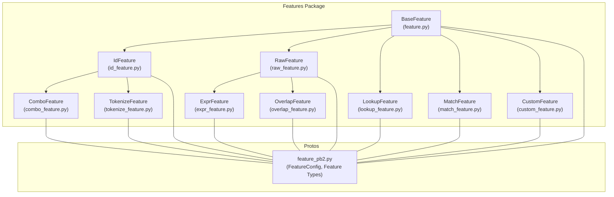
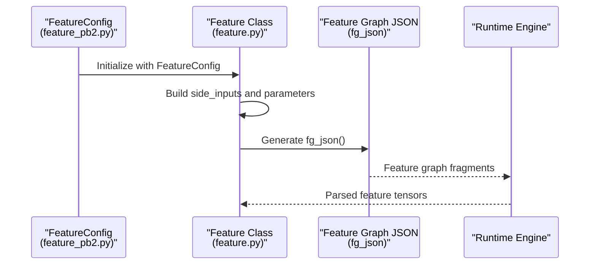
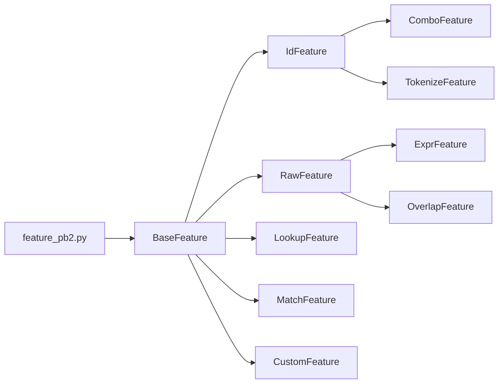

# Feature Configuration API

<cite>
**Referenced Files in This Document**
- [feature.py](file://tzrec/features/feature.py)
- [id_feature.py](file://tzrec/features/id_feature.py)
- [raw_feature.py](file://tzrec/features/raw_feature.py)
- [combo_feature.py](file://tzrec/features/combo_feature.py)
- [lookup_feature.py](file://tzrec/features/lookup_feature.py)
- [match_feature.py](file://tzrec/features/match_feature.py)
- [expr_feature.py](file://tzrec/features/expr_feature.py)
- [overlap_feature.py](file://tzrec/features/overlap_feature.py)
- [tokenize_feature.py](file://tzrec/features/tokenize_feature.py)
- [custom_feature.py](file://tzrec/features/custom_feature.py)
- [feature_pb2.py](file://tzrec/protos/feature_pb2.py)
- [deepfm_criteo.config](file://examples/deepfm_criteo.config)
- [dssm_taobao.config](file://examples/dssm_taobao.config)
</cite>

## Table of Contents

1. [Introduction](#introduction)
1. [Project Structure](#project-structure)
1. [Core Components](#core-components)
1. [Architecture Overview](#architecture-overview)
1. [Detailed Component Analysis](#detailed-component-analysis)
1. [Dependency Analysis](#dependency-analysis)
1. [Performance Considerations](#performance-considerations)
1. [Troubleshooting Guide](#troubleshooting-guide)
1. [Conclusion](#conclusion)
1. [Appendices](#appendices)

## Introduction

This document describes the Feature Configuration API used to define and configure features for machine learning models. It covers all feature types, their configuration parameters, transformations, embeddings, sequence processing, and custom feature definitions. Practical configuration examples are included, along with validation rules, error handling, and performance considerations.

## Project Structure

The feature configuration system is implemented in the features package and backed by protocol buffers. The base class defines shared behavior, while specialized classes implement type-specific logic. Protocol buffer definitions describe the schema for each feature type and their parameters.

**Diagram sources**

- \[feature.py\](file://tzrec/features/feature.py#L375-L800)
- \[id_feature.py\](file://tzrec/features/id_feature.py#L22-L141)
- \[raw_feature.py\](file://tzrec/features/raw_feature.py#L20-L100)
- \[combo_feature.py\](file://tzrec/features/combo_feature.py#L24-L107)
- \[lookup_feature.py\](file://tzrec/features/lookup_feature.py#L24-L205)
- \[match_feature.py\](file://tzrec/features/match_feature.py#L24-L190)
- \[expr_feature.py\](file://tzrec/features/expr_feature.py#L21-L73)
- \[overlap_feature.py\](file://tzrec/features/overlap_feature.py#L21-L83)
- \[tokenize_feature.py\](file://tzrec/features/tokenize_feature.py#L30-L162)
- \[custom_feature.py\](file://tzrec/features/custom_feature.py#L28-L195)
- \[feature_pb2.py\](file://tzrec/protos/feature_pb2.py#L18-L102)

**Section sources**

- \[feature.py\](file://tzrec/features/feature.py#L375-L800)
- \[feature_pb2.py\](file://tzrec/protos/feature_pb2.py#L18-L102)

## Core Components

- BaseFeature: Provides shared functionality for parsing, embedding configuration, sequence handling, and side inputs. It also exposes properties for output dimension, embedding bag/config, and managed collision hashing.
- Type-specific features: Implement type-specific parsing, value dimensions, embedding behavior, and feature graph (fg) JSON generation.

Key capabilities:

- Parsing input data into sparse, dense, or sequence formats.
- Configuring embeddings (sparse and dense) with pooling, data type, and trainable flags.
- Managing sequence features and grouped sequences.
- Building feature graph JSON for runtime feature computation.

**Section sources**

- \[feature.py\](file://tzrec/features/feature.py#L375-L800)

## Architecture Overview

The feature configuration API centers around FeatureConfig messages and feature classes. Each feature class translates its configuration into a feature graph JSON fragment consumed by the runtime feature engine.

**Diagram sources**

- \[feature.py\](file://tzrec/features/feature.py#L777-L800)
- \[feature_pb2.py\](file://tzrec/protos/feature_pb2.py#L97-L102)

## Detailed Component Analysis

### BaseFeature

BaseFeature encapsulates:

- Parsing logic for sparse, dense, and sequence features.
- Embedding configuration construction (bag and non-bag).
- Managed collision hashing (ZCH) integration.
- Side inputs resolution and grouped sequence handling.
- Parameter constraints for embedding sharding and compute kernels.

Important properties and methods:

- value_dim, output_dim, is_sparse, is_sequence, is_grouped_sequence, is_weighted
- emb_bag_config, emb_config, dense_emb_config
- parameter_constraints
- side_inputs, inputs
- parse(input_data, is_training)

Validation and error handling:

- InvalidFgInputError raised when required side inputs are missing.
- Runtime errors for masked fg-encoded defaults.
- Assertion failures for unsupported pooling types and data types.

**Section sources**

- \[feature.py\](file://tzrec/features/feature.py#L375-L800)

### IdFeature

Purpose: Converts categorical identifiers into embeddings via hash buckets, vocabulary lists/dicts, or ZCH/dynamic embeddings.

Key parameters:

- feature_name, expression, embedding_name, embedding_dim, embedding_constraints
- hash_bucket_size, num_buckets, vocab_list, vocab_dict, vocab_file, asset_dir
- default_value, separator, weighted, use_mask, fg_value_type, default_bucketize_value
- pooling, trainable, data_type (FP32/FP16)
- sequence\_\* for grouped sequences

Value and output dimensions:

- value_dim: configurable or defaults per type and sequence.
- output_dim equals embedding_dim for sparse embeddings.

Embedding behavior:

- Supports ZCH and dynamic embeddings with capacity limits.
- Vocabulary-backed features derive num_embeddings from vocab size.

Feature graph JSON:

- feature_type: id_feature
- value_type: string for hashed/vocab-backed features.
- value_dim controlled by configuration.

Practical example references:

- \[examples/deepfm_criteo.config\](file://examples/deepfm_criteo.config#L97-L172)

**Section sources**

- \[id_feature.py\](file://tzrec/features/id_feature.py#L22-L141)
- \[feature_pb2.py\](file://tzrec/protos/feature_pb2.py#L59-L102)

### RawFeature

Purpose: Processes continuous or bucketized numeric features with optional normalization and binning.

Key parameters:

- feature_name, expression, embedding_name, embedding_dim
- boundaries (for bucketization), normalizer (e.g., mean/std), pooling
- value_dim, separator, default_value, use_mask, trainable, data_type
- dense embedding options: AutoDisEmbedding or MLPEmbedding

Value and output dimensions:

- value_dim defaults to 1; can be >1 with separator.
- output_dim equals embedding_dim if sparse embedding is enabled; otherwise equals value_dim.

Feature graph JSON:

- feature_type: raw_feature
- boundaries and normalizer included when configured.

Practical example references:

- \[examples/deepfm_criteo.config\](file://examples/deepfm_criteo.config#L31-L95)

**Section sources**

- \[raw_feature.py\](file://tzrec/features/raw_feature.py#L20-L100)
- \[feature_pb2.py\](file://tzrec/protos/feature_pb2.py#L63-L102)

### ComboFeature

Purpose: Creates composite categorical features by combining multiple source fields.

Key parameters:

- Same as IdFeature plus expression array for multiple inputs.
- value_dim controls output composition.

Behavior:

- Inherits negative sampling behavior for cross-negative data groups.
- Uses the same embedding and vocabulary mechanisms as IdFeature.

Feature graph JSON:

- feature_type: combo_feature
- value_dim included.

Practical example references:

- \[examples/deepfm_criteo.config\](file://examples/deepfm_criteo.config#L97-L172)

**Section sources**

- \[combo_feature.py\](file://tzrec/features/combo_feature.py#L24-L107)
- \[feature_pb2.py\](file://tzrec/protos/feature_pb2.py#L65-L102)

### LookupFeature

Purpose: Performs keyed lookups against maps and combines values with combiners.

Key parameters:

- map, key, default_value, need_discrete, need_key, combiner (sum/product/mean)
- value_dim, value_separator, separator, normalizer
- Hashing/vocabulary/dynamic embedding options similar to IdFeature.

Behavior:

- For multi-dimensional values, generates a stub raw feature and a lookup feature.
- Discrete mode forces string-type hashing/vocab for keys.

Feature graph JSON:

- feature_type: lookup_feature
- May include a secondary raw feature when value_dim > 1.

Practical example references:

- \[examples/dssm_taobao.config\](file://examples/dssm_taobao.config#L171-L200)

**Section sources**

- \[lookup_feature.py\](file://tzrec/features/lookup_feature.py#L24-L205)
- \[feature_pb2.py\](file://tzrec/protos/feature_pb2.py#L70-L102)

### MatchFeature

Purpose: Matches nested map structures against primary and secondary keys to compute hit indicators or counts.

Key parameters:

- nested_map, pkey (primary key), skey (secondary key), show_pkey, show_skey
- need_discrete, default_value, normalizer, separator
- Hashing/vocabulary/dynamic embedding options.

Behavior:

- Supports wildcard ALL for pkey or skey to enable multi-hit matching.
- Discrete mode for hashing/vocab-backed matching.

Feature graph JSON:

- feature_type: match_feature
- matchType: hit or multihit depending on wildcards.

Practical example references:

- \[examples/dssm_taobao.config\](file://examples/dssm_taobao.config#L171-L200)

**Section sources**

- \[match_feature.py\](file://tzrec/features/match_feature.py#L24-L190)
- \[feature_pb2.py\](file://tzrec/protos/feature_pb2.py#L73-L102)

### ExprFeature

Purpose: Evaluates expressions over variables to produce numeric features with optional bucketization.

Key parameters:

- expression, variables, fill_missing, boundaries, value_dim
- default_value, separator, trainable, data_type

Behavior:

- Variables resolve to side inputs.
- Supports boundary bucketization and normalization.

Feature graph JSON:

- feature_type: expr_feature

Practical example references:

- \[examples/dssm_taobao.config\](file://examples/dssm_taobao.config#L171-L200)

**Section sources**

- \[expr_feature.py\](file://tzrec/features/expr_feature.py#L21-L73)
- \[feature_pb2.py\](file://tzrec/protos/feature_pb2.py#L77-L102)

### OverlapFeature

Purpose: Computes overlap scores between two text fields using a specified method.

Key parameters:

- query, title, method (e.g., Jaccard, cosine), normalizer, separator
- boundaries, default_value, trainable, data_type

Behavior:

- Produces a single scalar per sample.
- Optional bucketization via boundaries.

Feature graph JSON:

- feature_type: overlap_feature

Practical example references:

- \[examples/dssm_taobao.config\](file://examples/dssm_taobao.config#L171-L200)

**Section sources**

- \[overlap_feature.py\](file://tzrec/features/overlap_feature.py#L21-L83)
- \[feature_pb2.py\](file://tzrec/protos/feature_pb2.py#L80-L102)

### TokenizeFeature

Purpose: Tokenizes text using BPE or SentencePiece and converts tokens to word IDs.

Key parameters:

- expression, text_normalizer (optional), tokenizer_type (bpe/sentencepiece)
- vocab_file, asset_dir, default_value, pooling, embedding_dim
- sequence\_\* for grouped sequences

Behavior:

- Optionally applies text normalization (lower/upper, SBC/DBC, filter, split-chars, remove-space).
- Builds a two-stage feature graph: text normalization followed by tokenization.

Feature graph JSON:

- feature_type: tokenize_feature
- May include a preceding text_normalizer stage.

Practical example references:

- \[examples/dssm_taobao.config\](file://examples/dssm_taobao.config#L171-L200)

**Section sources**

- \[tokenize_feature.py\](file://tzrec/features/tokenize_feature.py#L30-L162)
- \[feature_pb2.py\](file://tzrec/protos/feature_pb2.py#L83-L102)

### CustomFeature

Purpose: Integrates custom operators/libraries for feature computation.

Key parameters:

- operator_name, operator_lib_file, operator_params, is_op_thread_safe
- expression (array of inputs), boundaries, normalizer
- Hashing/vocabulary/dynamic embedding options

Behavior:

- Loads operator library (official or custom) and passes operator_params.
- Supports sequence grouping and embedding configuration.

Feature graph JSON:

- feature_type: custom_feature
- Includes operator params as key-value pairs.

Practical example references:

- \[examples/dssm_taobao.config\](file://examples/dssm_taobao.config#L171-L200)

**Section sources**

- \[custom_feature.py\](file://tzrec/features/custom_feature.py#L28-L195)
- \[feature_pb2.py\](file://tzrec/protos/feature_pb2.py#L91-L102)

## Dependency Analysis

Feature classes depend on:

- BaseFeature for shared parsing, embedding, and side-input logic.
- Protobuf FeatureConfig messages for schema validation and parameter access.
- PyArrow for parsing and data conversion.
- TorchRec for embedding configurations and managed collision hashing.
- pyfg for feature graph runtime.

**Diagram sources**

- \[feature_pb2.py\](file://tzrec/protos/feature_pb2.py#L18-L102)
- \[feature.py\](file://tzrec/features/feature.py#L375-L800)
- \[id_feature.py\](file://tzrec/features/id_feature.py#L22-L141)
- \[raw_feature.py\](file://tzrec/features/raw_feature.py#L20-L100)
- \[combo_feature.py\](file://tzrec/features/combo_feature.py#L24-L107)
- \[lookup_feature.py\](file://tzrec/features/lookup_feature.py#L24-L205)
- \[match_feature.py\](file://tzrec/features/match_feature.py#L24-L190)
- \[expr_feature.py\](file://tzrec/features/expr_feature.py#L21-L73)
- \[overlap_feature.py\](file://tzrec/features/overlap_feature.py#L21-L83)
- \[tokenize_feature.py\](file://tzrec/features/tokenize_feature.py#L30-L162)
- \[custom_feature.py\](file://tzrec/features/custom_feature.py#L28-L195)

**Section sources**

- \[feature.py\](file://tzrec/features/feature.py#L375-L800)
- \[feature_pb2.py\](file://tzrec/protos/feature_pb2.py#L18-L102)

## Performance Considerations

- Embedding data types: FP32 vs FP16 trade memory for precision; FP16 reduces memory footprint.
- Pooling: SUM vs MEAN affects gradient behavior and downstream model performance.
- Hashing vs vocabulary: Hash buckets reduce memory but may increase collisions; vocab-backed features offer deterministic mapping.
- Dynamic embeddings: Enable adaptive capacity and frequency-based admission strategies for hot features.
- Managed collision hashing (ZCH): Reduces collisions with eviction policies (LRU/LFU/DistanceLFU).
- Sequence features: Control sequence_length and delimiter to balance memory and compute.
- Normalization and bucketization: Reduce distribution skew and improve convergence; choose appropriate boundaries.
- Tokenization: Pre-tokenize and cache vocabularies; consider tokenizer_type and normalization options.

[No sources needed since this section provides general guidance]

## Troubleshooting Guide

Common validation and error scenarios:

- Missing side inputs: InvalidFgInputError raised when required inputs are absent.
- Masked fg-encoded defaults: Runtime error if fg_encoded_default_value is not set when use_mask is true.
- Unsupported pooling/data types: Assertions for pooling type and embedding data type.
- Sequence configuration: Ensure sequence_length and delimiter are set appropriately for grouped sequences.

Operational tips:

- Verify feature_name uniqueness across groups.
- Confirm expression syntax matches side input format (e.g., user:field).
- For vocabulary-backed features, ensure vocab_file exists and is accessible.
- For tokenization, confirm tokenizer_type and vocab_file correctness.

**Section sources**

- \[feature.py\](file://tzrec/features/feature.py#L722-L750)
- \[feature.py\](file://tzrec/features/feature.py#L448-L458)
- \[feature.py\](file://tzrec/features/feature.py#L564-L569)

## Conclusion

The Feature Configuration API provides a unified, extensible framework for defining features across diverse modalities (categorical, numeric, textual, structured). By leveraging BaseFeature’s shared infrastructure and protobuf-backed schemas, users can compose complex feature graphs, apply embeddings and normalization, and integrate custom operators. Proper configuration ensures robust training and inference performance.

[No sources needed since this section summarizes without analyzing specific files]

## Appendices

### Field Specifications and Data Type Mappings

- FeatureConfig: One-of selection among feature types (IdFeature, RawFeature, ComboFeature, LookupFeature, MatchFeature, ExprFeature, OverlapFeature, TokenizeFeature, CustomFeature, SequenceFeature, KvDotProduct, BoolMaskFeature, and sequence variants).
- Embedding data_type: FP32 or FP16.
- Pooling: SUM or MEAN.
- Separator defaults: ASCII unit separator for multi-value fields.

**Section sources**

- \[feature_pb2.py\](file://tzrec/protos/feature_pb2.py#L97-L102)
- \[feature.py\](file://tzrec/features/feature.py#L564-L569)
- \[feature.py\](file://tzrec/features/feature.py#L341-L351)

### Configuration Examples and Use Cases

- Criteo DeepFM: Numeric features (RawFeature) and categorical features (IdFeature) with bucket sizes and embeddings.
- Taobao DSSM: User/item features, price bucketization, and sequence features with grouped sequences.

**Section sources**

- \[deepfm_criteo.config\](file://examples/deepfm_criteo.config#L31-L172)
- \[dssm_taobao.config\](file://examples/dssm_taobao.config#L42-L200)
