# Model Architecture API

<cite>
**Referenced Files in This Document**
- [model.py](file://tzrec/models/model.py)
- [rank_model.py](file://tzrec/models/rank_model.py)
- [multi_task_rank.py](file://tzrec/models/multi_task_rank.py)
- [multi_tower.py](file://tzrec/models/multi_tower.py)
- [mmoe.py](file://tzrec/models/mmoe.py)
- [task_tower.py](file://tzrec/modules/task_tower.py)
- [mlp.py](file://tzrec/modules/mlp.py)
- [utils.py](file://tzrec/modules/utils.py)
- [model.proto](file://tzrec/protos/model.proto)
- [module.proto](file://tzrec/protos/module.proto)
- [load_class.py](file://tzrec/utils/load_class.py)
</cite>

## Table of Contents

1. [Introduction](#introduction)
1. [Project Structure](#project-structure)
1. [Core Components](#core-components)
1. [Architecture Overview](#architecture-overview)
1. [Detailed Component Analysis](#detailed-component-analysis)
1. [Dependency Analysis](#dependency-analysis)
1. [Performance Considerations](#performance-considerations)
1. [Troubleshooting Guide](#troubleshooting-guide)
1. [Conclusion](#conclusion)
1. [Appendices](#appendices)

## Introduction

This document describes the Model Architecture API of the system, focusing on model definitions, module configurations, and tower structures. It explains base model configurations, module hierarchies, and task-specific tower implementations. It also covers model factory patterns, module composition, architectural parameters, configuration examples for different model types, module stacking patterns, tower customization options, parameter sharing strategies, and architectural optimization techniques.

## Project Structure

The Model Architecture API centers around:

- A base model abstraction that defines the contract for prediction, loss computation, and metrics.
- Concrete model families (ranking, multi-task, multi-tower) built on top of shared modules.
- Reusable building blocks (MLP, task towers, embedding groups) configured via protocol buffers.
- Factory mechanisms that register and instantiate model classes dynamically.

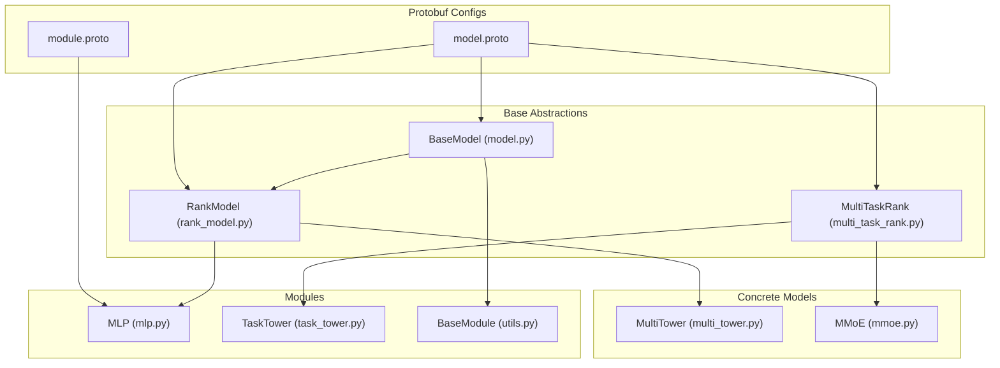

**Diagram sources**

- \[model.py\](file://tzrec/models/model.py#L39-L216)
- \[rank_model.py\](file://tzrec/models/rank_model.py#L56-L133)
- \[multi_task_rank.py\](file://tzrec/models/multi_task_rank.py#L25-L96)
- \[multi_tower.py\](file://tzrec/models/multi_tower.py#L25-L86)
- \[mmoe.py\](file://tzrec/models/mmoe.py#L26-L87)
- \[mlp.py\](file://tzrec/modules/mlp.py#L86-L178)
- \[task_tower.py\](file://tzrec/modules/task_tower.py#L21-L94)
- \[utils.py\](file://tzrec/modules/utils.py#L21-L74)
- \[model.proto\](file://tzrec/protos/model.proto#L40-L89)
- \[module.proto\](file://tzrec/protos/module.proto#L4-L17)

**Section sources**

- \[model.py\](file://tzrec/models/model.py#L39-L216)
- \[rank_model.py\](file://tzrec/models/rank_model.py#L56-L133)
- \[multi_task_rank.py\](file://tzrec/models/multi_task_rank.py#L25-L96)
- \[multi_tower.py\](file://tzrec/models/multi_tower.py#L25-L86)
- \[mmoe.py\](file://tzrec/models/mmoe.py#L26-L87)
- \[mlp.py\](file://tzrec/modules/mlp.py#L86-L178)
- \[task_tower.py\](file://tzrec/modules/task_tower.py#L21-L94)
- \[utils.py\](file://tzrec/modules/utils.py#L21-L74)
- \[model.proto\](file://tzrec/protos/model.proto#L40-L89)
- \[module.proto\](file://tzrec/protos/module.proto#L4-L17)

## Core Components

- BaseModel: Defines the model interface (predict, loss, metrics), manages feature groups, and exposes helpers for sparse parameter separation and metric accumulation.
- RankModel: Adds ranking-specific input building, loss/metric initialization, and prediction conversion logic based on configured losses.
- MultiTaskRank: Extends RankModel for multi-task scenarios, supporting per-task weighting, task-space indicators, and Pareto-efficient multi-task loss when enabled.
- MultiTower: Implements a multi-tower architecture where each feature group feeds an independent MLP tower, concatenated and optionally passed through a final MLP before the output head.
- MMoE: Implements a multi-gate mixture-of-experts architecture with task-specific towers.
- MLP: A configurable multi-layer perceptron with support for batch/layer norm, activations, and dropout.
- TaskTower: A general-purpose task tower with an optional MLP backbone and a final linear head.
- BaseModule: Provides kernel selection, inference mode propagation, and utility functions for module attributes.

Key architectural parameters:

- ModelConfig: Declares feature groups, model family, number of classes, losses, metrics, training metrics, variational dropout, kernel selection, and Pareto multi-task loss toggle.
- MLP config: Hidden units, dropout ratios, activation, normalization (batch/layer), bias, and dimensionality.
- TaskTower config: Input feature dimension, number of classes, and optional MLP backbone.

**Section sources**

- \[model.py\](file://tzrec/models/model.py#L39-L216)
- \[rank_model.py\](file://tzrec/models/rank_model.py#L56-L133)
- \[multi_task_rank.py\](file://tzrec/models/multi_task_rank.py#L25-L96)
- \[multi_tower.py\](file://tzrec/models/multi_tower.py#L25-L86)
- \[mmoe.py\](file://tzrec/models/mmoe.py#L26-L87)
- \[mlp.py\](file://tzrec/modules/mlp.py#L86-L178)
- \[task_tower.py\](file://tzrec/modules/task_tower.py#L21-L94)
- \[utils.py\](file://tzrec/modules/utils.py#L21-L74)
- \[model.proto\](file://tzrec/protos/model.proto#L40-L89)
- \[module.proto\](file://tzrec/protos/module.proto#L4-L17)

## Architecture Overview

The Model Architecture API follows a layered design:

- Protobuf definitions describe model families, feature groups, and module configurations.
- BaseModel and RankModel define the runtime behavior and lifecycle hooks.
- Concrete models compose modules (MLP, embedding groups, task towers) to implement specific architectures.
- Factory registration enables dynamic instantiation of model classes from configuration.

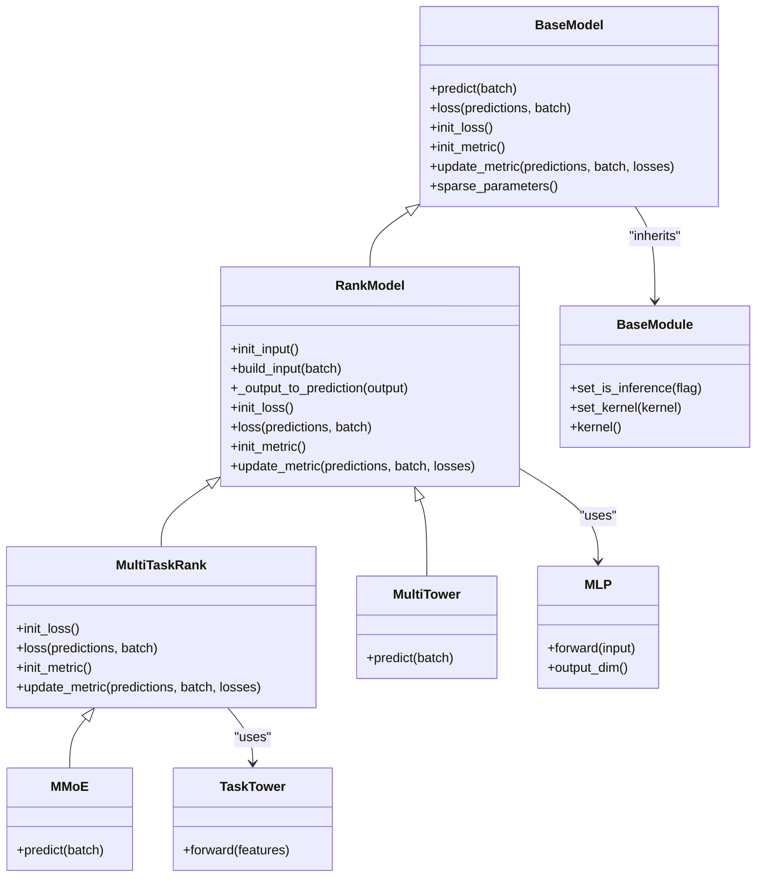

**Diagram sources**

- \[model.py\](file://tzrec/models/model.py#L39-L216)
- \[rank_model.py\](file://tzrec/models/rank_model.py#L56-L133)
- \[multi_task_rank.py\](file://tzrec/models/multi_task_rank.py#L25-L96)
- \[multi_tower.py\](file://tzrec/models/multi_tower.py#L25-L86)
- \[mmoe.py\](file://tzrec/models/mmoe.py#L26-L87)
- \[mlp.py\](file://tzrec/modules/mlp.py#L86-L178)
- \[task_tower.py\](file://tzrec/modules/task_tower.py#L21-L94)
- \[utils.py\](file://tzrec/modules/utils.py#L21-L74)

## Detailed Component Analysis

### BaseModel and Wrappers

- BaseModel encapsulates the model configuration, feature list, label names, and metric/loss registries. It provides sparse parameter separation for embedding collections and supports metric accumulation and computation.
- TrainWrapper wraps a model to compute predictions and losses in training, with optional mixed precision and Pareto-efficient multi-task loss.
- PredictWrapper handles inference with optional output column filtering and device-aware transfer.
- ScriptWrapper builds a Batch from raw tensors and runs predict for JIT scripting.
- CombinedModelWrapper orchestrates sparse/dense parts for hybrid inference.

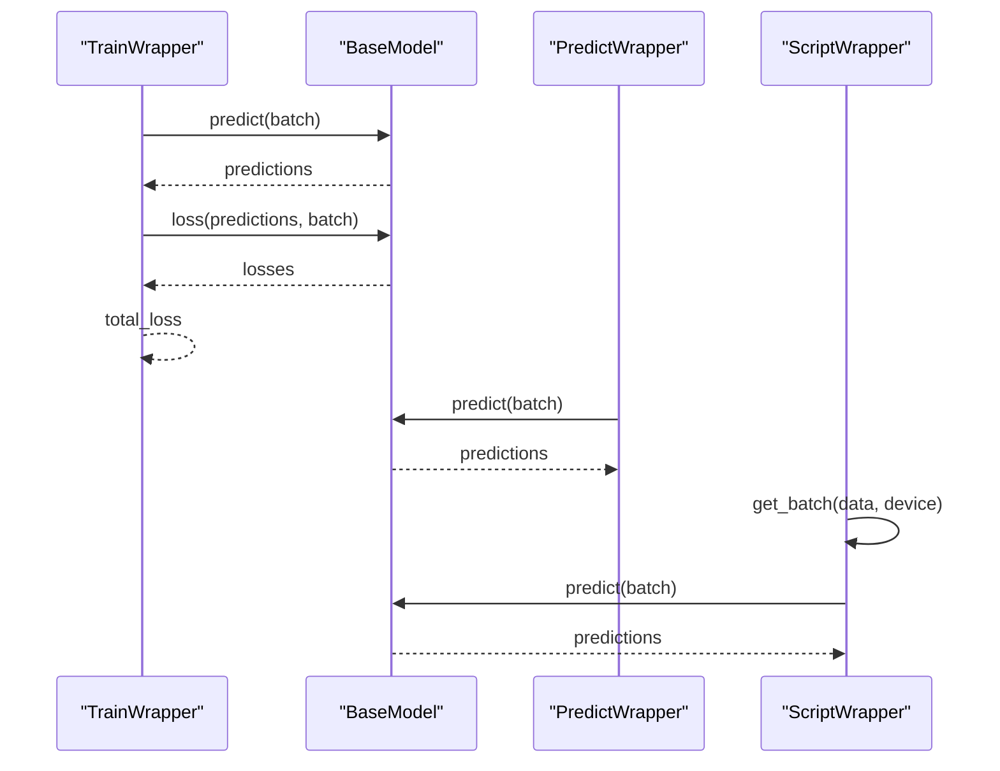

**Diagram sources**

- \[model.py\](file://tzrec/models/model.py#L181-L390)

**Section sources**

- \[model.py\](file://tzrec/models/model.py#L39-L216)
- \[model.py\](file://tzrec/models/model.py#L181-L390)

### RankModel: Ranking Pipeline

- Initializes embedding groups from feature groups and optional variational dropout per group.
- Builds input feature dictionaries and injects variational dropout losses into the loss collection.
- Converts model outputs to predictions according to configured loss types (binary, softmax, L2).
- Initializes and computes per-task losses and metrics, with support for weighted samples and decayed training metrics.

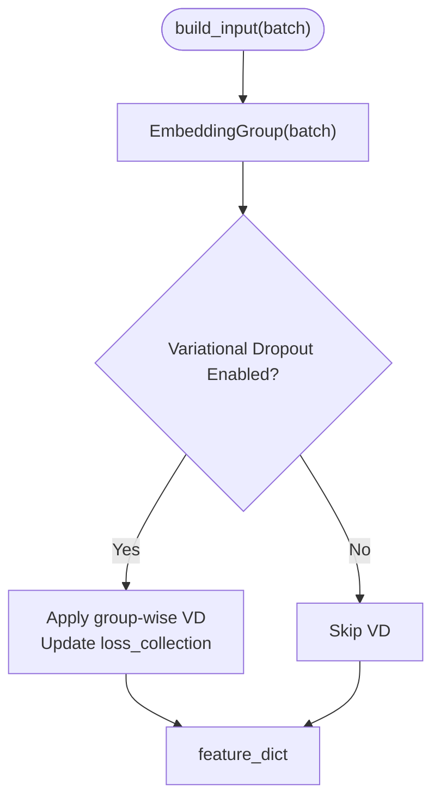

**Diagram sources**

- \[rank_model.py\](file://tzrec/models/rank_model.py#L115-L132)

**Section sources**

- \[rank_model.py\](file://tzrec/models/rank_model.py#L56-L133)
- \[rank_model.py\](file://tzrec/models/rank_model.py#L134-L284)
- \[rank_model.py\](file://tzrec/models/rank_model.py#L286-L513)

### MultiTaskRank: Multi-Task Extensions

- Supports per-task loss/metric initialization with optional sample weights and task-space indicators.
- Computes weighted losses per task and aggregates them.
- Propagates Pareto-efficient multi-task loss initialization when enabled.

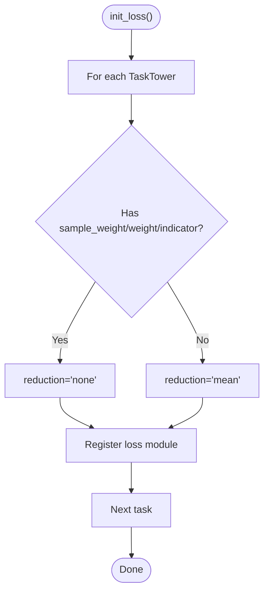

**Diagram sources**

- \[multi_task_rank.py\](file://tzrec/models/multi_task_rank.py#L80-L96)

**Section sources**

- \[multi_task_rank.py\](file://tzrec/models/multi_task_rank.py#L25-L96)
- \[multi_task_rank.py\](file://tzrec/models/multi_task_rank.py#L97-L162)
- \[multi_task_rank.py\](file://tzrec/models/multi_task_rank.py#L163-L221)

### MultiTower: Multi-Tower Architecture

- Initializes MLP towers per feature group, concatenates their outputs, optionally applies a final MLP, and projects to the number of classes.
- Uses the embedding group to resolve feature group dimensions and construct MLPs from protobuf configs.

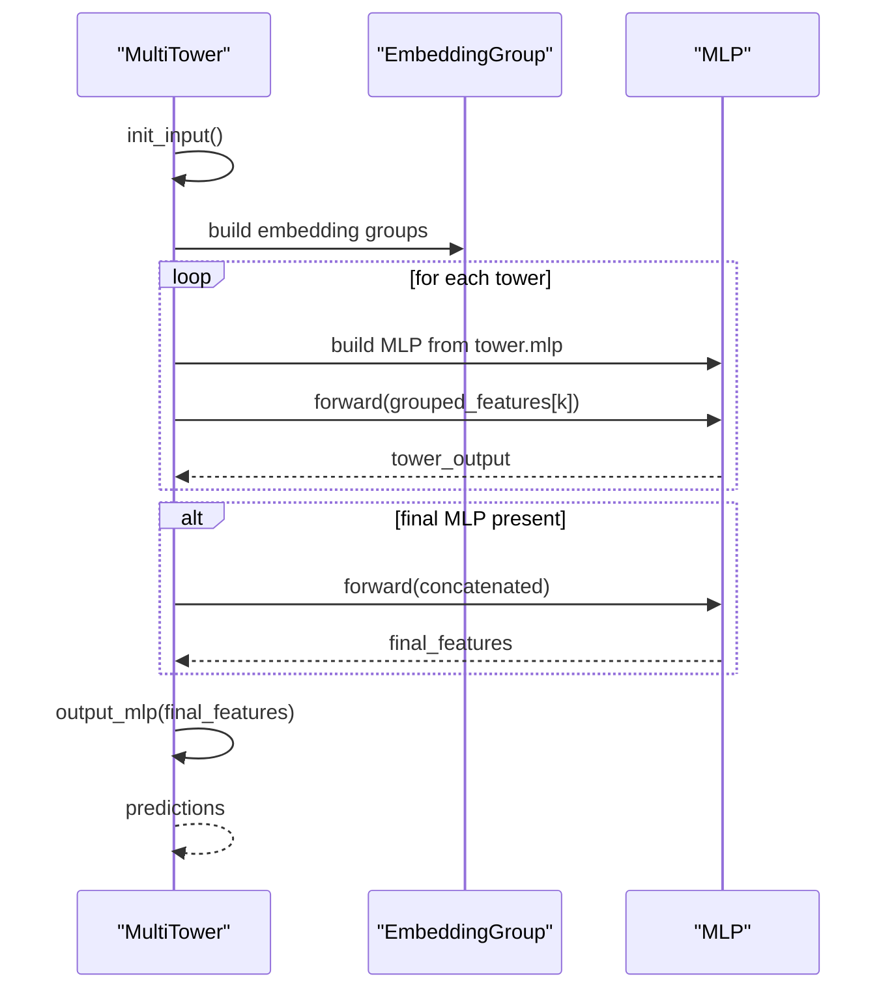

**Diagram sources**

- \[multi_tower.py\](file://tzrec/models/multi_tower.py#L35-L86)

**Section sources**

- \[multi_tower.py\](file://tzrec/models/multi_tower.py#L25-L86)

### MMoE: Multi-Gate Mixture-of-Experts

- Builds a single embedding group input and passes it through an MMoE module with configurable experts and gates.
- Constructs task-specific towers from per-task configurations and produces per-task predictions.

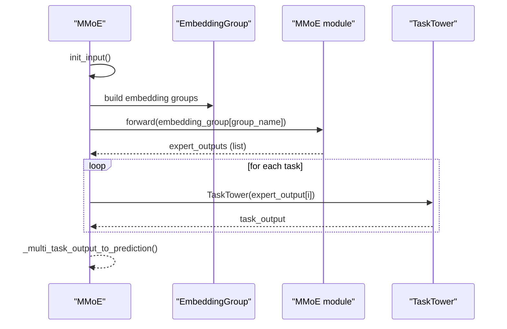

**Diagram sources**

- \[mmoe.py\](file://tzrec/models/mmoe.py#L36-L87)

**Section sources**

- \[mmoe.py\](file://tzrec/models/mmoe.py#L26-L87)

### MLP: Module Composition

- MLP composes a stack of Perceptrons with optional batch/layer normalization, activation, and dropout.
- Supports returning intermediate hidden features for inspection or advanced designs.

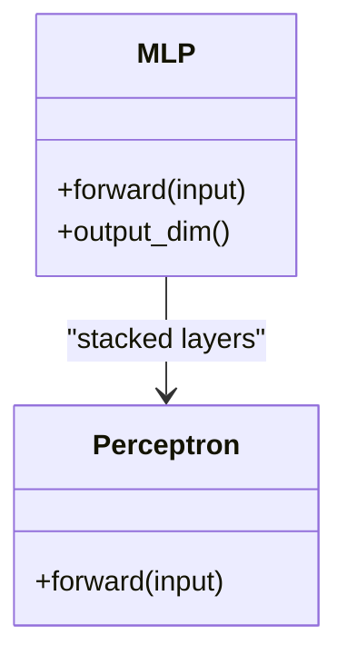

**Diagram sources**

- \[mlp.py\](file://tzrec/modules/mlp.py#L86-L178)

**Section sources**

- \[mlp.py\](file://tzrec/modules/mlp.py#L21-L84)
- \[mlp.py\](file://tzrec/modules/mlp.py#L86-L178)

### TaskTower: Tower Structures

- TaskTower: A flexible task tower with optional MLP backbone and a final linear head sized by number of classes.
- FusionMTLTower: A fusion-based multi-task tower combining user/item embeddings with an optional MLP and a multi-output linear head split by task.

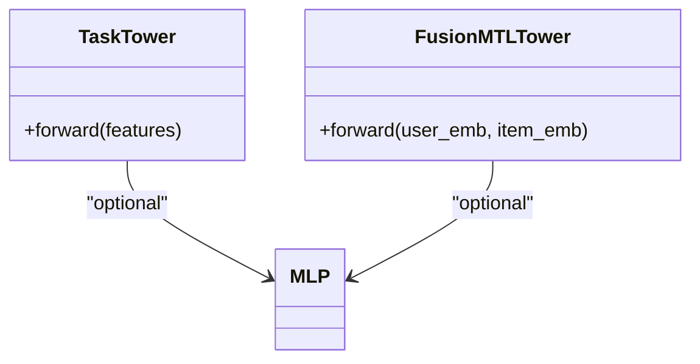

**Diagram sources**

- \[task_tower.py\](file://tzrec/modules/task_tower.py#L21-L94)

**Section sources**

- \[task_tower.py\](file://tzrec/modules/task_tower.py#L21-L94)

### Model Factory Pattern and Registration

- BaseModel uses a registry meta-class to register model subclasses by name.
- The meta-class provides a creation method to instantiate registered classes dynamically from configuration-driven names.

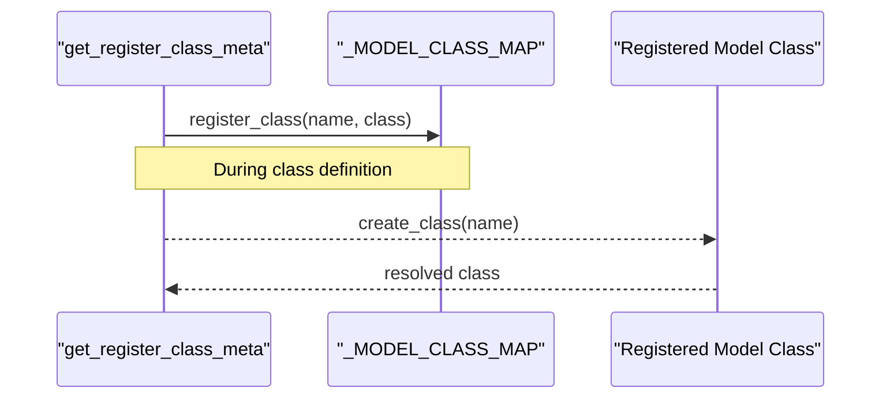

**Diagram sources**

- \[model.py\](file://tzrec/models/model.py#L35-L36)
- \[load_class.py\](file://tzrec/utils/load_class.py#L117-L145)

**Section sources**

- \[model.py\](file://tzrec/models/model.py#L35-L36)
- \[load_class.py\](file://tzrec/utils/load_class.py#L102-L153)

## Dependency Analysis

- Protobuf ModelConfig enumerates supported model families and carries feature groups, losses, metrics, and kernel selection.
- Module configs (e.g., MLP) are defined in module.proto and consumed by models to configure MLP stacks.
- Models depend on BaseModule for kernel selection and inference mode propagation.
- RankModel composes EmbeddingGroup to build input feature dictionaries and optionally injects variational dropout losses.
- MultiTaskRank composes TaskTower instances per task and aggregates per-task losses and metrics.

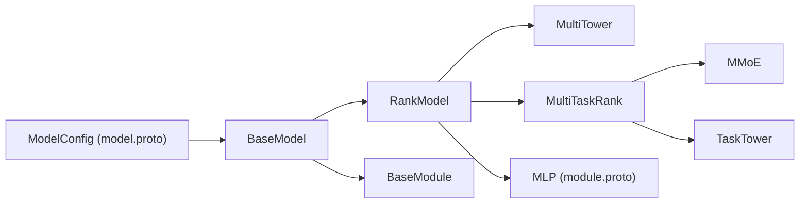

**Diagram sources**

- \[model.proto\](file://tzrec/protos/model.proto#L40-L89)
- \[module.proto\](file://tzrec/protos/module.proto#L4-L17)
- \[model.py\](file://tzrec/models/model.py#L39-L216)
- \[rank_model.py\](file://tzrec/models/rank_model.py#L56-L133)
- \[multi_task_rank.py\](file://tzrec/models/multi_task_rank.py#L25-L96)
- \[multi_tower.py\](file://tzrec/models/multi_tower.py#L25-L86)
- \[mmoe.py\](file://tzrec/models/mmoe.py#L26-L87)
- \[task_tower.py\](file://tzrec/modules/task_tower.py#L21-L94)
- \[utils.py\](file://tzrec/modules/utils.py#L21-L74)

**Section sources**

- \[model.proto\](file://tzrec/protos/model.proto#L40-L89)
- \[module.proto\](file://tzrec/protos/module.proto#L4-L17)
- \[model.py\](file://tzrec/models/model.py#L39-L216)
- \[rank_model.py\](file://tzrec/models/rank_model.py#L56-L133)
- \[multi_task_rank.py\](file://tzrec/models/multi_task_rank.py#L25-L96)
- \[multi_tower.py\](file://tzrec/models/multi_tower.py#L25-L86)
- \[mmoe.py\](file://tzrec/models/mmoe.py#L26-L87)
- \[task_tower.py\](file://tzrec/modules/task_tower.py#L21-L94)
- \[utils.py\](file://tzrec/modules/utils.py#L21-L74)

## Performance Considerations

- Mixed precision: TrainWrapper and PredictWrapper support autocast with FP16 or BF16 to reduce memory bandwidth and improve throughput.
- Kernel selection: BaseModule exposes kernel selection for modules, enabling Triton/PyTorch/CUDA kernels depending on configuration.
- Variational dropout: Optional group-wise variational dropout can regularize embeddings and is integrated into the loss collection.
- Parameter separation: BaseModel.sparse_parameters separates trainable and frozen embedding parameters, enabling efficient optimizer setups.
- MLP stacking: MLP supports returning hidden features for inspection and can be tuned with dropout and normalization to balance capacity and stability.

[No sources needed since this section provides general guidance]

## Troubleshooting Guide

- Unknown activation in Perceptron: Ensure activation strings match supported values; otherwise, a ValueError is raised.
- Conflicting embedding sharing: When merging embedding configs, mismatches in vocabulary size, embedding dimension, or initialization lead to assertion failures.
- Unsupported loss/metric: RankModel raises NotImplementedError or ValueError for unsupported loss/metric types; verify ModelConfig and task tower configurations.
- Mixed precision configuration: TrainWrapper/PredictWrapper expect "FP16" or "BF16"; invalid values raise errors.

**Section sources**

- \[mlp.py\](file://tzrec/modules/mlp.py#L52-L77)
- \[embedding.py\](file://tzrec/modules/embedding.py#L546-L555)
- \[rank_model.py\](file://tzrec/models/rank_model.py#L167-L168)
- \[model.py\](file://tzrec/models/model.py#L246-L248)
- \[model.py\](file://tzrec/models/model.py#L310-L311)

## Conclusion

The Model Architecture API provides a robust, modular framework for designing and composing neural architectures. BaseModel and RankModel establish a consistent lifecycle and configuration-driven behavior, while MultiTower and MMoE demonstrate distinct composition patterns. MLP and TaskTower offer flexible building blocks, and Protobuf configs ensure declarative specification. The factory pattern and kernel/attribute propagation simplify deployment and optimization.

[No sources needed since this section summarizes without analyzing specific files]

## Appendices

### Configuration Examples and Patterns

- Model families: ModelConfig supports multiple families (e.g., MultiTower, MMoE, DBMTL, PLE, DSSM variants, TDM, RocketLaunching). Choose one via the oneof field.
- Feature groups: FeatureGroupConfig defines named groups with feature lists, sequence groups, and encoders; used by RankModel to build embedding groups.
- MLP stacks: MLP config specifies hidden_units, dropout_ratio, activation, normalization, and bias; consumed by MultiTower and TaskTower.
- Task towers: TaskTower configures per-task MLP backbones and class counts; FusionMTLTower supports fused multi-task outputs.
- Variational dropout: Optional regularization per feature group controlled by ModelConfig.variational_dropout.
- Kernel selection: ModelConfig.kernel selects Triton/PyTorch/CUDA kernels globally.

**Section sources**

- \[model.proto\](file://tzrec/protos/model.proto#L40-L89)
- \[module.proto\](file://tzrec/protos/module.proto#L4-L17)
- \[rank_model.py\](file://tzrec/models/rank_model.py#L84-L114)
- \[multi_tower.py\](file://tzrec/models/multi_tower.py#L45-L63)
- \[task_tower.py\](file://tzrec/modules/task_tower.py#L30-L51)
- \[mmoe.py\](file://tzrec/models/mmoe.py#L49-L66)

### Architectural Parameters and Optimization Techniques

- Parameter sharing: EmbeddingGroup merges compatible embedding configs; mismatches trigger assertions to prevent unsafe sharing.
- Mixed precision: TrainWrapper/PredictWrapper enable autocast with FP16/BF16 for speed/memory gains.
- Kernel selection: BaseModule.set_kernel propagates kernel choices to submodules for backend acceleration.
- Sparse parameter separation: BaseModel.sparse_parameters distinguishes trainable/frozen embeddings for efficient optimization.
- Pareto multi-task loss: When enabled, MultiTaskRank initializes Pareto-efficient weighting for multi-task losses.

**Section sources**

- \[embedding.py\](file://tzrec/modules/embedding.py#L546-L555)
- \[model.py\](file://tzrec/models/model.py#L140-L179)
- \[model.py\](file://tzrec/models/model.py#L222-L284)
- \[multi_task_rank.py\](file://tzrec/models/multi_task_rank.py#L46-L56)
