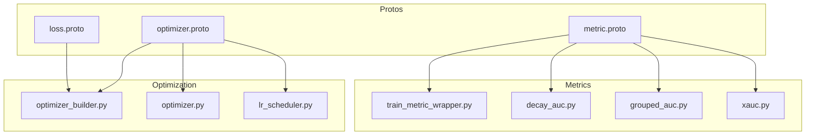
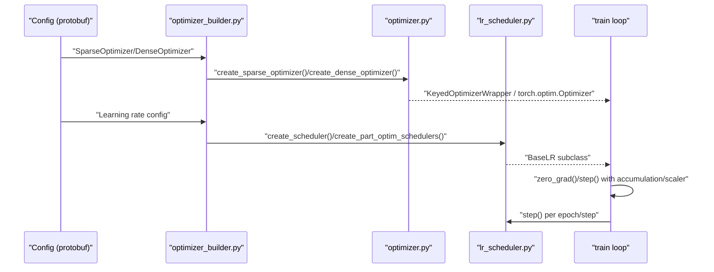
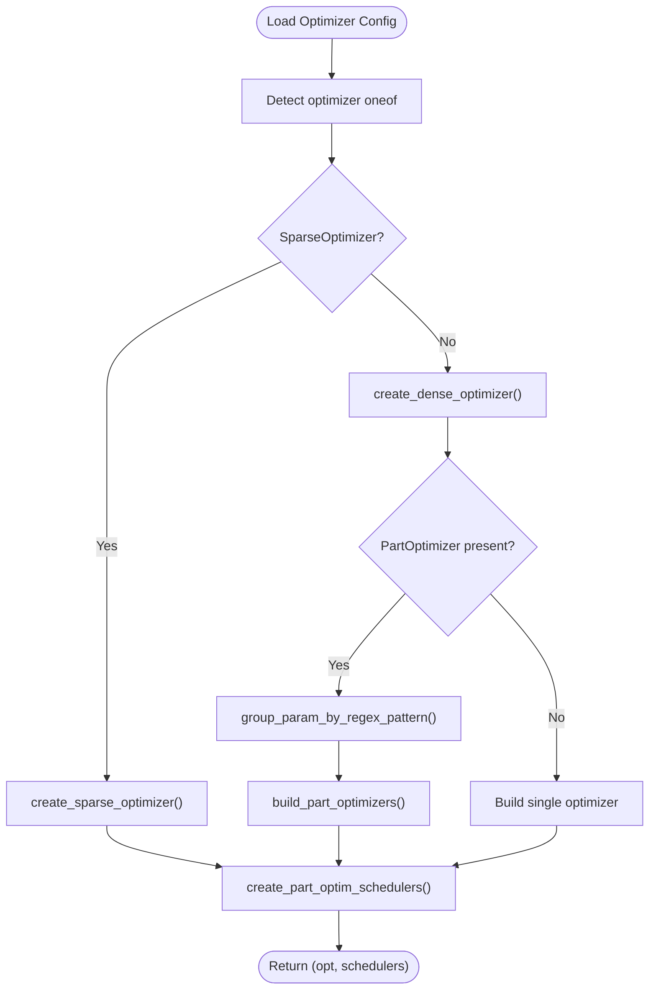
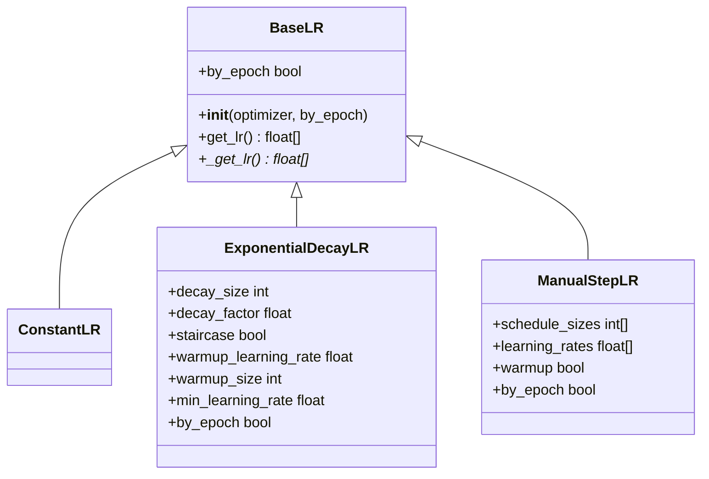
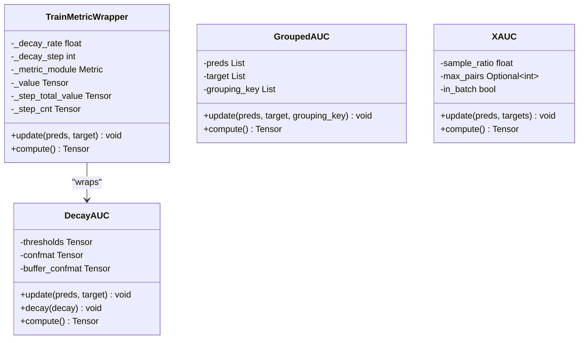
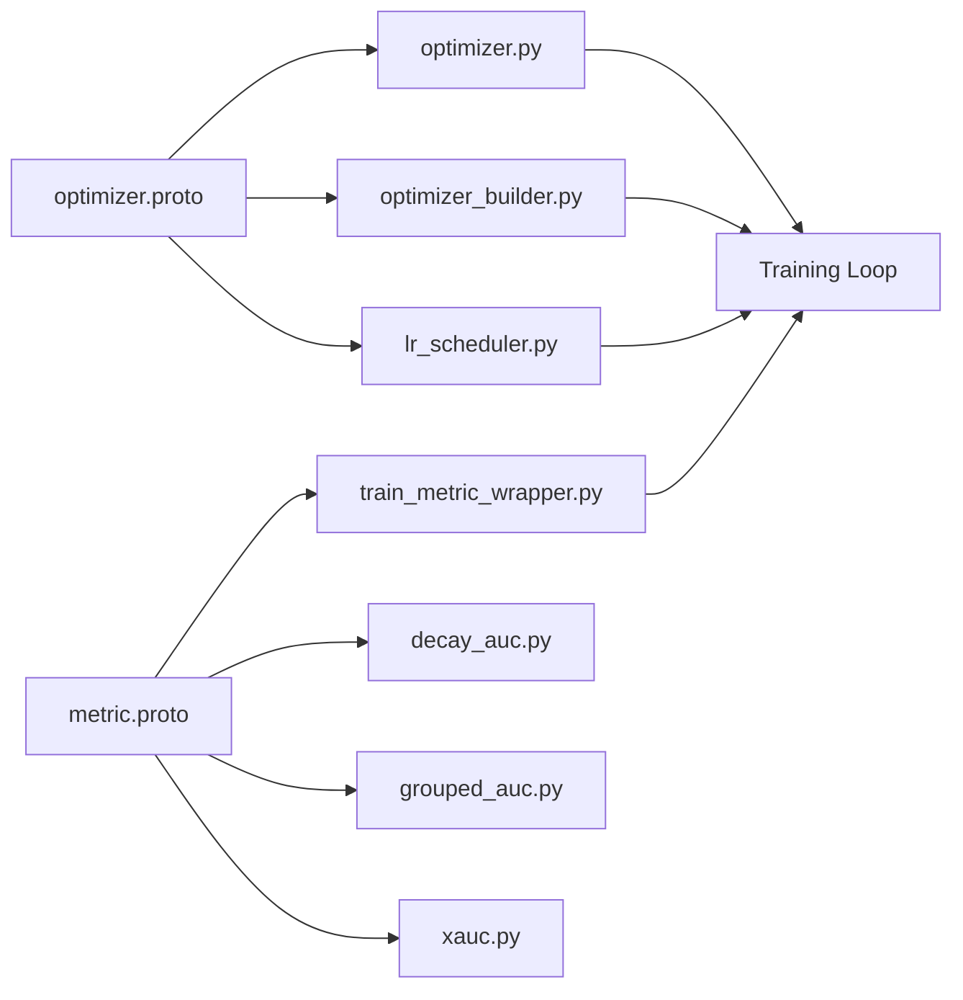

# Optimization and Metrics API

<cite>
**Referenced Files in This Document**
- [optimizer.py](file://tzrec/optim/optimizer.py)
- [optimizer_builder.py](file://tzrec/optim/optimizer_builder.py)
- [lr_scheduler.py](file://tzrec/optim/lr_scheduler.py)
- [train_metric_wrapper.py](file://tzrec/metrics/train_metric_wrapper.py)
- [decay_auc.py](file://tzrec/metrics/decay_auc.py)
- [grouped_auc.py](file://tzrec/metrics/grouped_auc.py)
- [xauc.py](file://tzrec/metrics/xauc.py)
- [optimizer.proto](file://tzrec/protos/optimizer.proto)
- [metric.proto](file://tzrec/protos/metric.proto)
- [loss.proto](file://tzrec/protos/loss.proto)
</cite>

## Table of Contents

1. [Introduction](#introduction)
1. [Project Structure](#project-structure)
1. [Core Components](#core-components)
1. [Architecture Overview](#architecture-overview)
1. [Detailed Component Analysis](#detailed-component-analysis)
1. [Dependency Analysis](#dependency-analysis)
1. [Performance Considerations](#performance-considerations)
1. [Troubleshooting Guide](#troubleshooting-guide)
1. [Conclusion](#conclusion)

## Introduction

This document explains the Optimization and Metrics configuration APIs in the repository. It covers:

- Optimizer configurations for sparse embeddings and dense parameters, including Adam, SGD, and custom fused optimizers.
- Learning-rate scheduling strategies and per-parameter partitioning.
- Loss function configurations for recommendation tasks and multi-task learning.
- Metric definitions for evaluation, performance tracking, and A/B testing, including decayed, grouped, and XAUC variants.
- Practical configuration examples and guidance on tuning optimization parameters and interpreting metrics for reliable convergence and monitoring.

## Project Structure

The optimization and metrics subsystems are organized around:

- Protobuf schemas defining configuration contracts for optimizers, schedulers, losses, and metrics.
- Builders and wrappers that translate configuration into PyTorch optimizers, schedulers, and metric computations.
- Specialized metric implementations for training and evaluation.

**Diagram sources**

- \[optimizer.proto\](file://tzrec/protos/optimizer.proto#L1-L191)
- \[metric.proto\](file://tzrec/protos/metric.proto#L1-L77)
- \[loss.proto\](file://tzrec/protos/loss.proto#L1-L33)
- \[optimizer_builder.py\](file://tzrec/optim/optimizer_builder.py#L1-L234)
- \[optimizer.py\](file://tzrec/optim/optimizer.py#L1-L238)
- \[lr_scheduler.py\](file://tzrec/optim/lr_scheduler.py#L1-L160)
- \[train_metric_wrapper.py\](file://tzrec/metrics/train_metric_wrapper.py#L1-L63)
- \[decay_auc.py\](file://tzrec/metrics/decay_auc.py#L1-L61)
- \[grouped_auc.py\](file://tzrec/metrics/grouped_auc.py#L1-L126)
- \[xauc.py\](file://tzrec/metrics/xauc.py#L1-L174)

**Section sources**

- \[optimizer.proto\](file://tzrec/protos/optimizer.proto#L1-L191)
- \[metric.proto\](file://tzrec/protos/metric.proto#L1-L77)
- \[loss.proto\](file://tzrec/protos/loss.proto#L1-L33)
- \[optimizer_builder.py\](file://tzrec/optim/optimizer_builder.py#L1-L234)
- \[optimizer.py\](file://tzrec/optim/optimizer.py#L1-L238)
- \[lr_scheduler.py\](file://tzrec/optim/lr_scheduler.py#L1-L160)
- \[train_metric_wrapper.py\](file://tzrec/metrics/train_metric_wrapper.py#L1-L63)
- \[decay_auc.py\](file://tzrec/metrics/decay_auc.py#L1-L61)
- \[grouped_auc.py\](file://tzrec/metrics/grouped_auc.py#L1-L126)
- \[xauc.py\](file://tzrec/metrics/xauc.py#L1-L174)

## Core Components

- Optimizer builder and wrappers:
  - Sparse and dense optimizer creation from protobuf configs.
  - Per-parameter partitioning with regex-based grouping.
  - Learning-rate scheduler creation and per-partition schedulers.
- Learning-rate schedulers:
  - Constant, exponential decay with warmup and staircase, and manual step schedules.
- Metrics:
  - Training wrapper with decaying aggregation.
  - AUC variants: standard, grouped, and XAUC with in-batch and sampling modes.
- Losses:
  - Binary cross-entropy, softmax cross-entropy, L2 loss, JRC, and binary focal loss.

**Section sources**

- \[optimizer_builder.py\](file://tzrec/optim/optimizer_builder.py#L30-L234)
- \[lr_scheduler.py\](file://tzrec/optim/lr_scheduler.py#L26-L160)
- \[train_metric_wrapper.py\](file://tzrec/metrics/train_metric_wrapper.py#L20-L63)
- \[decay_auc.py\](file://tzrec/metrics/decay_auc.py#L24-L61)
- \[grouped_auc.py\](file://tzrec/metrics/grouped_auc.py#L22-L126)
- \[xauc.py\](file://tzrec/metrics/xauc.py#L74-L174)
- \[optimizer.proto\](file://tzrec/protos/optimizer.proto#L4-L56)
- \[metric.proto\](file://tzrec/protos/metric.proto#L4-L77)
- \[loss.proto\](file://tzrec/protos/loss.proto#L4-L33)

## Architecture Overview

The optimization and metrics pipeline translates configuration into runtime objects and integrates with training loops.

**Diagram sources**

- \[optimizer_builder.py\](file://tzrec/optim/optimizer_builder.py#L30-L190)
- \[optimizer.py\](file://tzrec/optim/optimizer.py#L26-L70)
- \[lr_scheduler.py\](file://tzrec/optim/lr_scheduler.py#L26-L51)

## Detailed Component Analysis

### Optimizer Builder and Wrappers

- Sparse optimizer creation supports fused variants (SGD, Adagrad, Adam, LARS, LAMB, partial-rowwise variants) and maps protobuf fields to underlying optimizers.
- Dense optimizer creation supports standard torch.optim variants (SGD, Adagrad, Adam, AdamW) with field normalization (e.g., beta1/beta2 to betas tuple).
- Adagrad initial accumulator value is supported via an environment variable patch applied to the embedding state initialization.
- Per-parameter partitioning allows applying different optimizers and schedulers to regex-matched parameter groups.
- Learning-rate schedulers are created from protobuf configs and can be attached to either full or partitioned optimizers.

**Diagram sources**

- \[optimizer_builder.py\](file://tzrec/optim/optimizer_builder.py#L30-L234)
- \[optimizer.py\](file://tzrec/optim/optimizer.py#L75-L238)

**Section sources**

- \[optimizer_builder.py\](file://tzrec/optim/optimizer_builder.py#L30-L234)
- \[optimizer.py\](file://tzrec/optim/optimizer.py#L26-L70)
- \[optimizer.proto\](file://tzrec/protos/optimizer.proto#L4-L56)

### Learning-Rate Schedulers

- BaseLR extends torch’s LRScheduler and adds freezing behavior when base learning rate is zero.
- Available schedulers:
  - ConstantLR: fixed learning rate.
  - ExponentialDecayLR: supports warmup, staircase decay, and minimum learning rate.
  - ManualStepLR: piecewise constant schedule with optional warmup.
- Schedulers can be created per optimizer or per parameter partition.

**Diagram sources**

- \[lr_scheduler.py\](file://tzrec/optim/lr_scheduler.py#L26-L160)

**Section sources**

- \[lr_scheduler.py\](file://tzrec/optim/lr_scheduler.py#L26-L160)
- \[optimizer.proto\](file://tzrec/protos/optimizer.proto#L15-L19)

### Metrics for Evaluation and Monitoring

- TrainMetricWrapper aggregates metric values with exponential decay during training and exposes a stable moving average for logging and checkpointing.
- DecayAUC maintains a confusion-matrix buffer and decays it periodically to stabilize training-time AUC reporting.
- GroupedAUC computes group-aware AUC across distributed workers by aligning samples per group id.
- XAUC supports two computation modes:
  - Sampling mode: randomly samples pairs from all evaluations for stability on large datasets.
  - In-batch mode: computes pair-wise comparisons within each batch for speed and memory efficiency.

**Diagram sources**

- \[train_metric_wrapper.py\](file://tzrec/metrics/train_metric_wrapper.py#L20-L63)
- \[decay_auc.py\](file://tzrec/metrics/decay_auc.py#L24-L61)
- \[grouped_auc.py\](file://tzrec/metrics/grouped_auc.py#L22-L126)
- \[xauc.py\](file://tzrec/metrics/xauc.py#L74-L174)

**Section sources**

- \[train_metric_wrapper.py\](file://tzrec/metrics/train_metric_wrapper.py#L20-L63)
- \[decay_auc.py\](file://tzrec/metrics/decay_auc.py#L24-L61)
- \[grouped_auc.py\](file://tzrec/metrics/grouped_auc.py#L22-L126)
- \[xauc.py\](file://tzrec/metrics/xauc.py#L74-L174)
- \[metric.proto\](file://tzrec/protos/metric.proto#L4-L77)

### Loss Functions for Recommendation Tasks

- BinaryCrossEntropy: standard logistic loss for binary ranking or click-through prediction.
- SoftmaxCrossEntropy: multi-class classification with optional label smoothing.
- L2Loss: regression loss suitable for regression heads.
- JRCLoss: session-based contrastive loss with configurable alpha.
- BinaryFocalLoss: robust loss for class-imbalanced binary tasks with gamma and alpha parameters.

These are configured via the LossConfig protobuf and selected in model training code.

**Section sources**

- \[loss.proto\](file://tzrec/protos/loss.proto#L4-L33)

## Dependency Analysis

- Optimizer builder depends on:
  - Protobuf optimizer definitions for field mapping.
  - torch and torchrec optimizers for dense and sparse training.
  - Environment variables for embedding state initialization (Adagrad momentum1).
- Learning-rate schedulers depend on torch’s LRScheduler and are registered via a metaclass mechanism.
- Metrics depend on torchmetrics and optionally distributed communication primitives for grouped metrics.
- TrainMetricWrapper depends on DecayAUC and generic torchmetrics.Metric.

**Diagram sources**

- \[optimizer.proto\](file://tzrec/protos/optimizer.proto#L1-L191)
- \[metric.proto\](file://tzrec/protos/metric.proto#L1-L77)
- \[optimizer_builder.py\](file://tzrec/optim/optimizer_builder.py#L1-L234)
- \[optimizer.py\](file://tzrec/optim/optimizer.py#L1-L238)
- \[lr_scheduler.py\](file://tzrec/optim/lr_scheduler.py#L1-L160)
- \[train_metric_wrapper.py\](file://tzrec/metrics/train_metric_wrapper.py#L1-L63)
- \[decay_auc.py\](file://tzrec/metrics/decay_auc.py#L1-L61)
- \[grouped_auc.py\](file://tzrec/metrics/grouped_auc.py#L1-L126)
- \[xauc.py\](file://tzrec/metrics/xauc.py#L1-L174)

**Section sources**

- \[optimizer_builder.py\](file://tzrec/optim/optimizer_builder.py#L1-L234)
- \[optimizer.py\](file://tzrec/optim/optimizer.py#L1-L238)
- \[lr_scheduler.py\](file://tzrec/optim/lr_scheduler.py#L1-L160)
- \[train_metric_wrapper.py\](file://tzrec/metrics/train_metric_wrapper.py#L1-L63)
- \[decay_auc.py\](file://tzrec/metrics/decay_auc.py#L1-L61)
- \[grouped_auc.py\](file://tzrec/metrics/grouped_auc.py#L1-L126)
- \[xauc.py\](file://tzrec/metrics/xauc.py#L1-L174)
- \[optimizer.proto\](file://tzrec/protos/optimizer.proto#L1-L191)
- \[metric.proto\](file://tzrec/protos/metric.proto#L1-L77)
- \[loss.proto\](file://tzrec/protos/loss.proto#L1-L33)

## Performance Considerations

- Gradient accumulation and mixed precision:
  - The optimizer wrapper conditionally steps the optimizer based on accumulation steps and supports gradient scaling when present.
- Embedding optimizer state initialization:
  - Adagrad momentum1 can be initialized with a specific value via an environment variable, affecting early convergence for sparse embeddings.
- Learning-rate scheduling:
  - Warmup reduces early instability; staircase decay reduces oscillation; manual steps enable staged optimization.
- Metric computation:
  - DecayAUC and TrainMetricWrapper reduce noisy reporting by averaging recent metric values.
  - XAUC in-batch mode trades accuracy for speed and memory efficiency; sampling mode improves accuracy at higher computational cost.

**Section sources**

- \[optimizer.py\](file://tzrec/optim/optimizer.py#L48-L69)
- \[optimizer.py\](file://tzrec/optim/optimizer.py#L75-L238)
- \[lr_scheduler.py\](file://tzrec/optim/lr_scheduler.py#L76-L117)
- \[train_metric_wrapper.py\](file://tzrec/metrics/train_metric_wrapper.py#L42-L59)
- \[xauc.py\](file://tzrec/metrics/xauc.py#L118-L174)

## Troubleshooting Guide

- Adagrad momentum1 initialization:
  - If embedding states appear uninitialized or unstable, verify the environment variable for momentum1 initial value is set appropriately before optimizer construction.
- Per-parameter partitioning:
  - Ensure regex patterns in PartOptimizer cover intended parameters; unmatched parameters are logged and grouped separately.
- Learning-rate scheduler freezing:
  - When base learning rate is zero, the scheduler freezes to zero; confirm optimizer base learning rates are non-zero if scheduling is expected.
- Distributed grouped AUC:
  - Grouping keys must be mapped consistently across ranks; ensure WORLD_SIZE and RANK are set and grouping_key modulo WORLD_SIZE distributes samples evenly.
- XAUC memory usage:
  - Sampling mode requires careful selection of sample_ratio or max_pairs to avoid excessive memory consumption; in-batch mode is recommended for very large datasets.

**Section sources**

- \[optimizer_builder.py\](file://tzrec/optim/optimizer_builder.py#L192-L234)
- \[lr_scheduler.py\](file://tzrec/optim/lr_scheduler.py#L37-L41)
- \[grouped_auc.py\](file://tzrec/metrics/grouped_auc.py#L44-L95)
- \[xauc.py\](file://tzrec/metrics/xauc.py#L111-L117)

## Conclusion

The Optimization and Metrics APIs provide a flexible, configuration-driven framework for training recommendation models:

- Optimizers and schedulers are defined via protobuf and built into efficient PyTorch objects with support for sparse embeddings, per-parameter partitioning, and advanced initialization.
- Metrics offer robust evaluation and monitoring capabilities, including decayed training metrics, grouped AUC for fairness, and XAUC for large-scale ranking.
- Proper configuration of optimization parameters and metrics ensures stable convergence and reliable performance tracking for production deployments.
