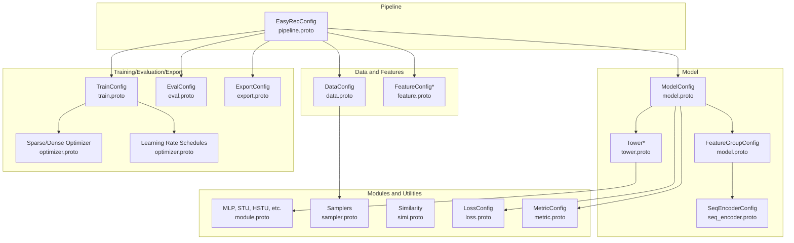
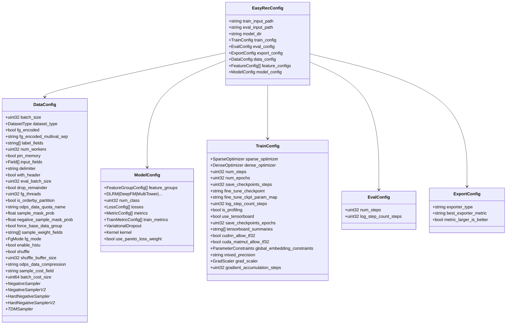
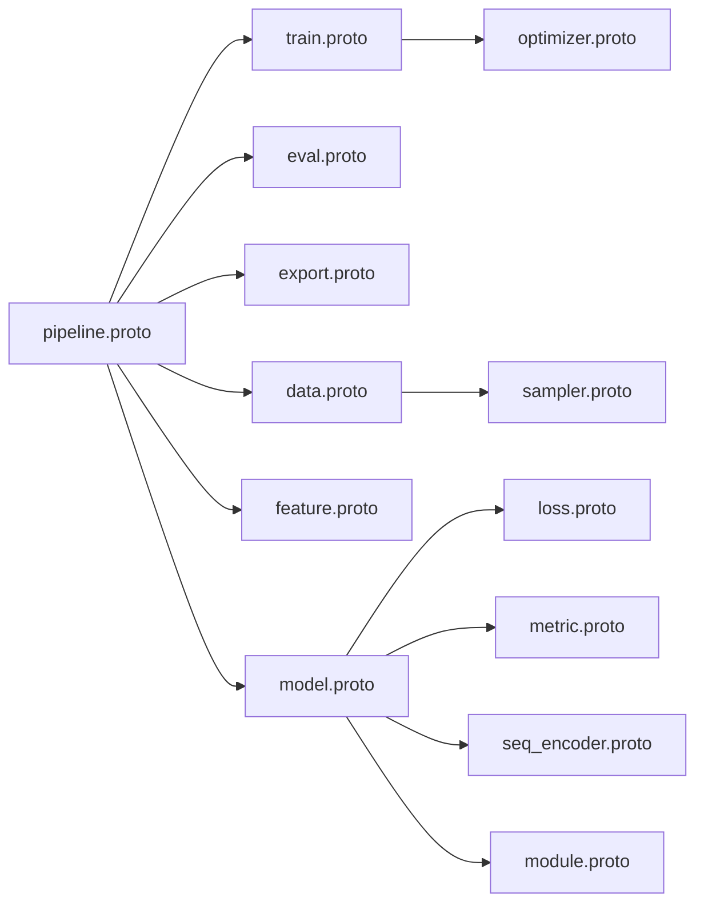

# Protocol Buffers API Reference

<cite>
**Referenced Files in This Document**
- [data.proto](file://tzrec/protos/data.proto)
- [feature.proto](file://tzrec/protos/feature.proto)
- [model.proto](file://tzrec/protos/model.proto)
- [train.proto](file://tzrec/protos/train.proto)
- [pipeline.proto](file://tzrec/protos/pipeline.proto)
- [eval.proto](file://tzrec/protos/eval.proto)
- [export.proto](file://tzrec/protos/export.proto)
- [optimizer.proto](file://tzrec/protos/optimizer.proto)
- [module.proto](file://tzrec/protos/module.proto)
- [sampler.proto](file://tzrec/protos/sampler.proto)
- [seq_encoder.proto](file://tzrec/protos/seq_encoder.proto)
- [simi.proto](file://tzrec/protos/simi.proto)
- [tower.proto](file://tzrec/protos/tower.proto)
- [loss.proto](file://tzrec/protos/loss.proto)
- [metric.proto](file://tzrec/protos/metric.proto)
</cite>

## Table of Contents

1. [Introduction](#introduction)
1. [Project Structure](#project-structure)
1. [Core Components](#core-components)
1. [Architecture Overview](#architecture-overview)
1. [Detailed Component Analysis](#detailed-component-analysis)
1. [Dependency Analysis](#dependency-analysis)
1. [Performance Considerations](#performance-considerations)
1. [Troubleshooting Guide](#troubleshooting-guide)
1. [Conclusion](#conclusion)
1. [Appendices](#appendices)

## Introduction

This document provides a comprehensive Protocol Buffers API reference for TorchEasyRec’s configuration system. It documents all .proto files, their messages, fields, defaults, validation rules, and relationships. It also explains how the generated Python bindings integrate with the framework, outlines configuration inheritance and validation hierarchies, and offers migration guidance for schema changes.

## Project Structure

TorchEasyRec organizes its configuration schema under the package namespace tzrec.protos. The primary configuration entry point is a pipeline-level message that composes data, feature, model, train, eval, and export configurations. Supporting modules define reusable building blocks such as optimizers, modules, samplers, sequence encoders, similarity measures, towers, loss functions, and metrics.

**Diagram sources**

- \[pipeline.proto\](file://tzrec/protos/pipeline.proto#L11-L29)
- \[data.proto\](file://tzrec/protos/data.proto#L43-L137)
- \[feature.proto\](file://tzrec/protos/feature.proto#L112-L180)
- \[model.proto\](file://tzrec/protos/model.proto#L26-L89)
- \[train.proto\](file://tzrec/protos/train.proto#L21-L61)
- \[eval.proto\](file://tzrec/protos/eval.proto#L4-L9)
- \[export.proto\](file://tzrec/protos/export.proto#L4-L13)
- \[module.proto\](file://tzrec/protos/module.proto#L4-L286)
- \[sampler.proto\](file://tzrec/protos/sampler.proto#L4-L141)
- \[seq_encoder.proto\](file://tzrec/protos/seq_encoder.proto#L98-L107)
- \[simi.proto\](file://tzrec/protos/simi.proto#L4-L8)
- \[tower.proto\](file://tzrec/protos/tower.proto#L8-L197)
- \[loss.proto\](file://tzrec/protos/loss.proto#L4-L32)
- \[metric.proto\](file://tzrec/protos/metric.proto#L48-L76)

**Section sources**

- \[pipeline.proto\](file://tzrec/protos/pipeline.proto#L1-L30)

## Core Components

This section summarizes the primary configuration messages and their roles.

- Pipeline configuration
  - EasyRecConfig: Top-level container holding paths and composed configurations for training, evaluation, export, data, features, and model.
- Data configuration
  - DataConfig: Defines dataset type, batching, FG mode, sampling, shuffling, and negative sampling strategies.
- Feature configuration
  - FeatureConfig family: IdFeature, RawFeature, ComboFeature, LookupFeature, MatchFeature, ExprFeature, OverlapFeature, TokenizeFeature, KvDotProduct, CustomFeature, plus auxiliary structures (ZeroCollisionHash, DynamicEmbedding, etc.).
- Model configuration
  - ModelConfig: Composes feature groups, sequence encoders, towers, and task-specific configurations; selects among supported model variants.
- Training configuration
  - TrainConfig: Embedding/dense optimizers, scheduling, logging, mixed precision, gradient accumulation, and checkpointing controls.
- Evaluation and export
  - EvalConfig: Evaluation steps and logging cadence.
  - ExportConfig: Export policy and metric selection for best-export determination.
- Modules and utilities
  - MLP, STU/HSTU, MaskNetModule, Cross/CIN/xDeepFM components, etc.
  - Samplers: NegativeSampler, NegativeSamplerV2, HardNegativeSampler, HardNegativeSamplerV2, TDMSampler.
  - Similarity: COSINE, INNER_PRODUCT, EUCLID.
  - Losses and Metrics: BinaryCrossEntropy, SoftmaxCrossEntropy, L2Loss, JRCLoss, BinaryFocalLoss, AUC, MulticlassAUC, RecallAtK, MAE, MSE, Accuracy, GroupedAUC, XAUC, GroupedXAUC.

**Section sources**

- \[pipeline.proto\](file://tzrec/protos/pipeline.proto#L11-L29)
- \[data.proto\](file://tzrec/protos/data.proto#L43-L137)
- \[feature.proto\](file://tzrec/protos/feature.proto#L112-L800)
- \[model.proto\](file://tzrec/protos/model.proto#L26-L89)
- \[train.proto\](file://tzrec/protos/train.proto#L21-L61)
- \[eval.proto\](file://tzrec/protos/eval.proto#L4-L9)
- \[export.proto\](file://tzrec/protos/export.proto#L4-L13)
- \[module.proto\](file://tzrec/protos/module.proto#L4-L286)
- \[sampler.proto\](file://tzrec/protos/sampler.proto#L4-L141)
- \[simi.proto\](file://tzrec/protos/simi.proto#L4-L8)
- \[loss.proto\](file://tzrec/protos/loss.proto#L4-L32)
- \[metric.proto\](file://tzrec/protos/metric.proto#L48-L76)

## Architecture Overview

The configuration architecture is layered and composable. The pipeline aggregates domain-specific configurations, which in turn reference shared modules and utilities. OneOf constructs enforce mutual exclusivity for mutually exclusive choices (e.g., optimizer variants, sequence encoders, loss types, metric types).

**Diagram sources**

- \[pipeline.proto\](file://tzrec/protos/pipeline.proto#L11-L29)
- \[data.proto\](file://tzrec/protos/data.proto#L43-L137)
- \[model.proto\](file://tzrec/protos/model.proto#L40-L89)
- \[train.proto\](file://tzrec/protos/train.proto#L21-L61)
- \[eval.proto\](file://tzrec/protos/eval.proto#L4-L9)
- \[export.proto\](file://tzrec/protos/export.proto#L4-L13)

## Detailed Component Analysis

### Data Configuration (data.proto)

- Purpose: Define dataset ingestion, batching, FG mode, sampling, and I/O characteristics.
- Key enums and messages:
  - DatasetType: OdpsDataset, ParquetDataset, CsvDataset, OdpsDatasetV1
  - FieldType: INT32, INT64, STRING, FLOAT, DOUBLE
  - FgMode: FG_NONE, FG_NORMAL, FG_DAG, FG_BUCKETIZE
  - Field: input_name, optional input_type
  - DataConfig: comprehensive set of fields controlling batch sizes, workers, memory pinning, CSV delimiters, headers, evaluation batch size, drop_remainder, FG threads, partition ordering, ODPS quota/compression, masking probabilities, base data grouping, sample weights, FG mode, HSTU enable, shuffling, shuffle buffer size, sample cost field, batch cost size, and oneof sampler selection among NegativeSampler, NegativeSamplerV2, HardNegativeSampler, HardNegativeSamplerV2, TDMSampler.
- Validation and defaults:
  - Defaults are explicitly annotated in the .proto (e.g., batch_size=1024, fg_mode=FG_NONE, shuffle=false, shuffle_buffer_size=32).
  - Deprecated fields retained for compatibility (e.g., fg_encoded).
  - FG mode affects downstream FG DAG behavior and bucketization expectations.
- Example usage patterns:
  - CSV ingestion with explicit FieldType when inference fails.
  - ODPS with compression and partition ordering for large-scale reads.
  - Enabling HSTU and appropriate FG mode for sequence-heavy workloads.

**Section sources**

- \[data.proto\](file://tzrec/protos/data.proto#L6-L137)

### Feature Configuration Family (feature.proto)

- Purpose: Define feature engineering and embedding configurations for ID, raw numeric, combo, lookup, match, expression, overlap, tokenized, KV dot-product, and custom features.
- Core messages:
  - IdFeature: feature_name, expression, embedding_name, embedding_dim, hash_bucket_size, num_buckets, vocab_list/vocab_dict, value_dim, pooling, default_value, separator, weighted, init_fn, use_mask, ZCH, vocab_file, asset_dir, dynamicemb, fg_encoded_default_value, default_bucketize_value, fg_value_type, trainable, stub_type, data_type, constraints, sequence_length, sequence_delim, sequence_fields.
  - RawFeature: similar structure with boundaries, value_dim, normalizer, and optional dense embedding options (AutoDisEmbedding, MLPEmbedding).
  - ComboFeature: combo expressions, vocabularies, and similar options.
  - LookupFeature: map/key inputs, boundaries, hash/num_buckets, vocab_list/vocab_dict, combiner, need_discrete/need_key, normalizer, value_dim, value_separator, and dense embedding options.
  - MatchFeature: nested_map/pkey/skey, boundaries, hash/num_buckets, vocabularies, pooling/combiner-like semantics, normalizer, value_dim, and dense embedding options.
  - ExprFeature: expression with variables, boundaries, fill_missing, pooling, and dense embedding options.
  - OverlapFeature: query/title inputs, method, boundaries, normalizer, pooling, and dense embedding options.
  - TokenizeFeature: expression, embedding_dim, text_normalizer, vocab_file, asset_dir, pooling, default_value, tokenizer_type, and dense embedding options.
  - KvDotProduct: query/document expressions, boundaries, kv_delimiter, normalizer, pooling, default_value, and dense embedding options.
  - CustomFeature: operator_name/operator_lib_file/operator_params, is_op_thread_safe, expression list, embedding_name/dim, boundaries/hash/num_buckets/vocabularies, pooling/default_value/separator/normalizer/init_fn/value_dim/use_mask/ZCH/vocab_file/asset_dir/dynamicemb.
- Auxiliary structures:
  - ZeroCollisionHash: zch_size, eviction_interval, eviction_policy (oneof: LFU_EvictionPolicy, LRU_EvictionPolicy, DistanceLFU_EvictionPolicy), threshold_filtering_func.
  - DynamicEmbedding: initializer_args/eval_initializer_args, score_strategy, max_capacity, cache_load_factor, init_capacity_per_rank, init_table, admission_strategy (DynamicEmbFrequencyAdmissionStrategy).
  - ParameterConstraints: sharding_types, compute_kernels.
- Validation and defaults:
  - Many fields carry explicit defaults (e.g., pooling="sum", separator="\\x1d", fg_value_type, data_type="FP32").
  - Sequence-related fields apply only when used as sequences (sequence_length, sequence_delim, sequence_fields).
  - Dynamic embedding and ZCH enable adaptive and collision-aware embedding management.
- Example usage patterns:
  - ID features with vocabularies and bucketization.
  - Numeric features with normalization and boundary discretization.
  - Sequence features with pooling and attention encoders.

**Section sources**

- \[feature.proto\](file://tzrec/protos/feature.proto#L112-L800)

### Model Configuration (model.proto)

- Purpose: Compose feature groups, sequence encoders, towers, and tasks; select model architecture; define losses and metrics.
- Key messages:
  - FeatureGroupType: DEEP, WIDE, SEQUENCE, JAGGED_SEQUENCE
  - SeqGroupConfig: group_name, feature_names
  - FeatureGroupConfig: group_name, feature_names, group_type, sequence_groups, sequence_encoders
  - ModelConfig: feature_groups, oneof model variant (DLRM, DeepFM, MultiTower, MultiTowerDIN, MaskNet, WideAndDeep, DCN v1/v2, xDeepFM, WuKong, SimpleMultiTask, MMoE, DBMTL, PLE, DC2VR, DlrmHSTU, DSSM, DSSM v2, DAT, HSTUMatch, MIND, TDM, RocketLaunching), num_class, losses, metrics, train_metrics, variational_dropout, kernel, use_pareto_loss_weight.
- Validation and defaults:
  - group_type defaults to DEEP.
  - kernel defaults to PYTORCH.
  - num_class defaults to 1.
- Example usage patterns:
  - Multi-tower architectures with separate feature groups.
  - Sequence encoders integrated into feature groups.
  - Multi-task setups with task-specific towers and losses.

**Section sources**

- \[model.proto\](file://tzrec/protos/model.proto#L13-L89)

### Training Configuration (train.proto)

- Purpose: Configure optimizers, schedulers, logging, mixed precision, gradient scaling, and checkpointing.
- Messages:
  - GradScaler: init_scale, growth_factor, backoff_factor, growth_interval
  - TrainConfig: sparse_optimizer (oneof fused optimizers), dense_optimizer (oneof dense optimizers), num_steps, num_epochs, save_checkpoints_steps, fine_tune_checkpoint, fine_tune_ckpt_param_map, log_step_count_steps, is_profiling, use_tensorboard, save_checkpoints_epochs, tensorboard_summaries, cudnn_allow_tf32, cuda_matmul_allow_tf32, global_embedding_constraints, mixed_precision, grad_scaler, gradient_accumulation_steps.
- Validation and defaults:
  - Defaults for logging cadence, TF32 toggles, and scaler parameters are provided.
- Example usage patterns:
  - Mixed precision with dynamic grad scaling.
  - Separate sparse and dense optimizers for embedding vs. dense parameters.
  - TensorBoard summaries and profiling toggles.

**Section sources**

- \[train.proto\](file://tzrec/protos/train.proto#L7-L61)

### Evaluation and Export Configurations (eval.proto, export.proto)

- EvalConfig: num_steps, log_step_count_steps
- ExportConfig: exporter_type ("latest"|"best"), best_exporter_metric, metric_larger_is_better
- Validation and defaults:
  - exporter_type defaults to "latest".
  - best_exporter_metric defaults to "auc".
  - metric_larger_is_better defaults to true.

**Section sources**

- \[eval.proto\](file://tzrec/protos/eval.proto#L4-L9)
- \[export.proto\](file://tzrec/protos/export.proto#L4-L13)

### Optimizer and Learning Rate Schedules (optimizer.proto)

- Purpose: Define optimizer families and learning rate schedules for both sparse and dense parameters.
- Messages:
  - SparseOptimizer/DenseOptimizer: oneof optimizer (fused SGD/Adagrad/Adam/LARS/LAMB, partial-row-wise variants, row-wise Adagrad), oneof learning_rate (ConstantLR, ExponentialDecayLR, ManualStepLR), and optional PartOptimizer for regex-based parameter partitioning.
  - WeightDecayMode: NONE, L2, DECOUPLE
  - FusedSGD/Adagrad/Adam/LARS/LAMB/PartialRowWise variants: learning rate, momentum/beta1/beta2, weight_decay, gradient clipping, max_gradient, initial_accumulator_value, eps, amsgrad, fused flags.
  - SGD/Adagrad/Adam/AdamW: lr, momentum/dampening, weight_decay, nesterov, fused, eps, amsgrad.
  - ConstantLR: no fields.
  - ExponentialDecayLR: decay_size, decay_factor, staircase, warmup_learning_rate, warmup_size, min_learning_rate, by_epoch.
  - ManualStepLR: schedule_sizes, learning_rates, warmup, by_epoch.
- Validation and defaults:
  - Many optimizers default to small learning rates and conservative defaults (e.g., lr=0.002).
  - Weight decay modes default to NONE or L2 depending on variant.
- Example usage patterns:
  - Fused optimizers for embedding tables.
  - AdamW with decoupled weight decay for dense parameters.
  - Step-based or exponential decay schedules with warmup.

**Section sources**

- \[optimizer.proto\](file://tzrec/protos/optimizer.proto#L4-L191)

### Modules and Utilities (module.proto)

- Purpose: Provide reusable building blocks for model components.
- Messages:
  - MLP: hidden_units, dropout_ratio, activation, use_bn, bias, use_ln
  - ExtractionNetwork: network_name, expert_num_per_task, share_num, task_expert_net, share_expert_net
  - VariationalDropout: regularization_lambda, embedding_wise_variational_dropout
  - B2ICapsule: max_k, max_seq_len, high_dim, num_iters, routing_logits_scale/stddev, squash_pow, const_caps_num, routing_init_method
  - MaskBlock: reduction_ratio, aggregation_dim, hidden_dim
  - MaskNetModule: n_mask_blocks, mask_block, top_mlp, use_parallel
  - Cross/CrossV2/CIN: cross_num, low_rank, cin_layer_size
  - WuKongLayer: lcb_feature_num, fmb_feature_num, compressed_feature_num, feature_num_mlp
  - GRActionEncoder/GRSimpleActionEncoder: action_embedding_dim, action_weights, watchtime_to_action_thresholds/watchtime_to_action_weights, embedding_init_std
  - GRContentEncoder/GRSliceContentEncoder/GRPadContentEncoder/GRMLPContentEncoder: content encoders
  - GRContextualizedMLP/GRSimpleContextualizedMLP/GRParameterizedContextualizedMLP: contextual MLP variants
  - GRContextualPreprocessor/GRContextualInterleavePreprocessor: input preprocessors
  - GROutputPostprocessor/GRL2NormPostprocessor/GRLayerNormPostprocessor/GRTimestampLayerNormPostprocessor: output postprocessors
  - STU: embedding_dim, num_heads, hidden_dim, attention_dim, output_dropout_ratio, max_attn_len, attn_alpha, use_group_norm, recompute flags, sort_by_length, contextual_seq_len
  - GRPositionalEncoder: num_position_buckets, num_time_buckets, use_time_encoding, time_bucket_fn, time_bucket_increments
  - HSTU: stu, input_dropout_ratio, attn_num_layers, positional_encoder, input_preprocessor, output_postprocessor
- Validation and defaults:
  - Many numeric defaults are provided (e.g., dropout ratios, layer sizes, activation defaults).
- Example usage patterns:
  - MLP stacks for towers and contextual networks.
  - Capsule-based interest modeling.
  - HSTU for contextual sequence modeling.

**Section sources**

- \[module.proto\](file://tzrec/protos/module.proto#L4-L286)

### Samplers (sampler.proto)

- Purpose: Define negative and hard negative sampling strategies for training.
- Messages:
  - NegativeSampler: input_path, num_sample, attr_fields, item_id_field, attr_delimiter, num_eval_sample, field_delimiter, item_id_delim
  - NegativeSamplerV2: user_input_path, item_input_path, pos_edge_input_path, num_sample, attr_fields, item_id_field, user_id_field, attr_delimiter, num_eval_sample, field_delimiter
  - HardNegativeSampler: user_input_path, item_input_path, hard_neg_edge_input_path, num_sample, num_hard_sample, attr_fields, item_id_field, user_id_field, attr_delimiter, num_eval_sample, field_delimiter
  - HardNegativeSamplerV2: user_input_path, item_input_path, pos_edge_input_path, hard_neg_edge_input_path, num_sample, num_hard_sample, attr_fields, item_id_field, user_id_field, attr_delimiter, num_eval_sample, field_delimiter
  - TDMSampler: item_input_path, edge_input_path, predict_edge_input_path, attr_fields, item_id_field, layer_num_sample, attr_delimiter, num_eval_sample, field_delimiter, remain_ratio, probability_type
- Validation and defaults:
  - Defaults for delimiters and evaluation sample counts are provided.
- Example usage patterns:
  - Graph-based negative sampling with edges.
  - Tree-based sampling for hierarchical retrieval.

**Section sources**

- \[sampler.proto\](file://tzrec/protos/sampler.proto#L4-L141)

### Sequence Encoders (seq_encoder.proto)

- Purpose: Encode sequential features for model consumption.
- Messages:
  - DINEncoder: name, input, attn_mlp, max_seq_length
  - SimpleAttention: name, input, max_seq_length
  - PoolingEncoder: name, input, pooling_type, max_seq_length
  - SelfAttentionEncoder: name, input, multihead_attn_dim, num_heads, dropout, max_seq_length
  - MultiWindowDINEncoder: name, input, attn_mlp, windows_len
  - HSTUEncoder: name, input, sequence_dim, attn_dim, linear_dim, max_seq_length, pos_dropout_rate, linear_dropout_rate, attn_dropout_rate, normalization, linear_activation, linear_config, num_heads, num_blocks, max_output_len, time_bucket_size
  - SeqEncoderConfig: oneof seq_module (DINEncoder, SimpleAttention, PoolingEncoder, MultiWindowDINEncoder, HSTUEncoder, SelfAttentionEncoder)
- Validation and defaults:
  - Defaults for sequence lengths and attention parameters are provided.
- Example usage patterns:
  - DIN-style attention for user-item interactions.
  - Self-attention for long-range dependencies.
  - HSTU for contextualized sequence modeling.

**Section sources**

- \[seq_encoder.proto\](file://tzrec/protos/seq_encoder.proto#L6-L107)

### Similarity Measures (simi.proto)

- Enum Similarity: COSINE, INNER_PRODUCT, EUCLID
- Example usage patterns:
  - Similarity-based matching or retrieval scoring.

**Section sources**

- \[simi.proto\](file://tzrec/protos/simi.proto#L4-L8)

### Towers and Task Structures (tower.proto)

- Purpose: Define task towers and fusion strategies.
- Messages:
  - Tower: input feature group, MLP
  - HSTUMatchTower: input feature group, HSTUEncoder
  - DINTower: input feature group, attention MLP
  - TaskTower: tower_name, label_name, metrics, train_metrics, losses, num_class, optional MLP, weight, sample_weight_name, task_space_indicator_label, in/out task space weights, pareto_min_loss_weight
  - BayesTaskTower: similar to TaskTower with relation_tower_names and relation_mlp
  - InterventionTaskTower: similar to TaskTower with intervention_tower_names, low_rank_dim, dropout_ratio
  - FusionSubTaskConfig: task_name, label_name, task_bitmask, losses, num_class, metrics, train_metrics
  - FusionMTLTower: optional MLP, task_configs
  - MultiWindowDINTower: windows_len, attention MLP
  - DATTower: input, augment_input, MLP
  - MINDUserTower: input, history_input, user_mlp, hist_seq_mlp, user_seq_combine, capsule_config, concat_mlp
  - MINDItemTower: input, MLP
- Validation and defaults:
  - Weights default to 1.0; num_class defaults to 1; combine method defaults to SUM.
- Example usage patterns:
  - Multi-task towers with task-specific losses and metrics.
  - Fusion MTL with sub-task configurations.
  - MIND user/item towers with capsule-based interest modeling.

**Section sources**

- \[tower.proto\](file://tzrec/protos/tower.proto#L8-L197)

### Loss Functions (loss.proto)

- Messages:
  - LossConfig: oneof loss (BinaryCrossEntropy, SoftmaxCrossEntropy, L2Loss, JRCLoss, BinaryFocalLoss)
  - BinaryCrossEntropy: no fields
  - SoftmaxCrossEntropy: label_smoothing
  - L2Loss: no fields
  - JRCLoss: session_name, alpha
  - BinaryFocalLoss: gamma, alpha
- Validation and defaults:
  - Label smoothing defaults to 0.0; alpha defaults to 0.5; gamma defaults to 2.0; alpha defaults to 0.5.
- Example usage patterns:
  - Binary cross-entropy for binary classification.
  - Softmax cross-entropy with label smoothing for multi-class.
  - Focal loss for imbalanced classes.

**Section sources**

- \[loss.proto\](file://tzrec/protos/loss.proto#L4-L32)

### Metrics (metric.proto)

- Messages:
  - AUC: thresholds
  - MulticlassAUC: thresholds, average ("macro"|"weighted")
  - RecallAtK: top_k
  - MeanAbsoluteError, MeanSquaredError: no fields
  - Accuracy: threshold, top_k
  - GroupedAUC: grouping_key
  - XAUC: sample_ratio, max_pairs, in_batch
  - GroupedXAUC: grouping_key, max_pairs_per_group
  - MetricConfig: oneof metric (AUC, MulticlassAUC, RecallAtK, MAE, MSE, Accuracy, GroupedAUC, XAUC, GroupedXAUC)
  - TrainMetricConfig: oneof metric subset (AUC, RecallAtK, MAE, MSE, Accuracy, XAUC), decay_rate, decay_step
- Validation and defaults:
  - thresholds default to 200; average defaults to "macro"; top_k defaults to 5; threshold defaults to 0.5; decay_rate defaults to 0.90; decay_step defaults to 100.
- Example usage patterns:
  - AUC/MulticlassAUC for ranking quality.
  - Recall@K for top-K retrieval.
  - XAUC for exposure-unbiased ranking.

**Section sources**

- \[metric.proto\](file://tzrec/protos/metric.proto#L4-L76)

## Dependency Analysis

- Package-level imports:
  - model.proto imports models/\*, loss.proto, metric.proto, seq_encoder.proto, module.proto.
  - data.proto imports sampler.proto.
  - optimizer.proto defines standalone optimizers and learning rate schedules.
  - pipeline.proto composes train.proto, eval.proto, export.proto, data.proto, feature.proto, model.proto.
- Coupling and cohesion:
  - OneOf constructs reduce coupling by enforcing single-selection semantics across mutually exclusive options.
  - Reusable modules (MLP, STU/HSTU, samplers) are referenced widely, increasing cohesion within shared components.
- External dependencies:
  - Google protobuf Struct is used in CustomFeature for operator parameters.
- Potential circular dependencies:
  - None observed; imports are acyclic.

**Diagram sources**

- \[pipeline.proto\](file://tzrec/protos/pipeline.proto#L4-L9)
- \[model.proto\](file://tzrec/protos/model.proto#L4-L11)
- \[data.proto\](file://tzrec/protos/data.proto#L4-L1)
- \[optimizer.proto\](file://tzrec/protos/optimizer.proto#L1-L2)
- \[sampler.proto\](file://tzrec/protos/sampler.proto#L1-L2)

**Section sources**

- \[pipeline.proto\](file://tzrec/protos/pipeline.proto#L4-L9)
- \[model.proto\](file://tzrec/protos/model.proto#L4-L11)
- \[data.proto\](file://tzrec/protos/data.proto#L4-L1)
- \[optimizer.proto\](file://tzrec/protos/optimizer.proto#L1-L2)
- \[sampler.proto\](file://tzrec/protos/sampler.proto#L1-L2)

## Performance Considerations

- Mixed precision and gradient scaling:
  - Enable mixed_precision and configure GradScaler for numerical stability and throughput.
- Optimizer selection:
  - Prefer fused optimizers for embedding tables; use AdamW for dense parameters with decoupled weight decay.
- Data pipeline:
  - Tune batch_size, num_workers, pin_memory, shuffle_buffer_size for throughput.
  - Use appropriate FG mode and compression for large datasets.
- Sequence modeling:
  - Choose efficient encoders (SelfAttention vs. HSTU) based on sequence length and hardware.
- Logging and profiling:
  - Use tensorboard_summaries and is_profiling judiciously to avoid overhead.

[No sources needed since this section provides general guidance]

## Troubleshooting Guide

- Common validation errors:
  - Missing required fields in DataConfig (e.g., dataset_type) or ModelConfig (e.g., model oneof).
  - Incorrect sampler selection; ensure only one sampler is set in the DataConfig oneof.
  - Sequence encoders require compatible sequence lengths and feature dimensions.
- Migration and compatibility:
  - Deprecated fields (e.g., fg_encoded in DataConfig) should be migrated to fg_mode.
  - When upgrading model variants, ensure feature groups and towers align with the new architecture.
- Debugging tips:
  - Verify optimizer and learning rate schedule combinations.
  - Confirm metric and loss selections match task types (binary vs. multi-class).
  - Check tensorboard_summaries and logging cadence for visibility.

**Section sources**

- \[data.proto\](file://tzrec/protos/data.proto#L43-L137)
- \[model.proto\](file://tzrec/protos/model.proto#L40-L89)
- \[optimizer.proto\](file://tzrec/protos/optimizer.proto#L4-L191)
- \[metric.proto\](file://tzrec/protos/metric.proto#L48-L76)
- \[loss.proto\](file://tzrec/protos/loss.proto#L4-L32)

## Conclusion

TorchEasyRec’s Protocol Buffers configuration system provides a robust, extensible schema for defining data ingestion, feature engineering, model composition, training, evaluation, and export. The use of oneof constructs, defaults, and modular components enables flexible and maintainable configurations. By following the guidelines and examples in this reference, users can construct accurate and performant configurations tailored to their tasks.

[No sources needed since this section summarizes without analyzing specific files]

## Appendices

### Generated Python Bindings Integration

- Generation:
  - Protobuf compiler generates pb2.py and pyi stub files under tzrec/protos/.
- Usage:
  - Import generated modules (e.g., data_pb2, feature_pb2) to instantiate and manipulate configuration objects in Python.
  - Use the generated classes to serialize/deserialize configurations and integrate with framework components.
- Notes:
  - Type hints and stubs improve IDE support and static analysis.
  - Keep generated files alongside source to ensure consistent imports.

**Section sources**

- \[data.proto\](file://tzrec/protos/data.proto#L1-L2)
- \[feature.proto\](file://tzrec/protos/feature.proto#L1-L2)
- \[model.proto\](file://tzrec/protos/model.proto#L1-L2)
- \[train.proto\](file://tzrec/protos/train.proto#L1-L2)
- \[pipeline.proto\](file://tzrec/protos/pipeline.proto#L1-L2)
- \[eval.proto\](file://tzrec/protos/eval.proto#L1-L2)
- \[export.proto\](file://tzrec/protos/export.proto#L1-L2)
- \[optimizer.proto\](file://tzrec/protos/optimizer.proto#L1-L2)
- \[module.proto\](file://tzrec/protos/module.proto#L1-L2)
- \[sampler.proto\](file://tzrec/protos/sampler.proto#L1-L2)
- \[seq_encoder.proto\](file://tzrec/protos/seq_encoder.proto#L1-L2)
- \[simi.proto\](file://tzrec/protos/simi.proto#L1-L2)
- \[tower.proto\](file://tzrec/protos/tower.proto#L1-L2)
- \[loss.proto\](file://tzrec/protos/loss.proto#L1-L2)
- \[metric.proto\](file://tzrec/protos/metric.proto#L1-L2)

### Configuration Examples (Usage Patterns)

- Data ingestion:
  - CSV dataset with explicit FieldType and header handling.
  - ODPS dataset with compression and partition ordering.
- Feature engineering:
  - ID features with vocabularies and bucketization.
  - Numeric features with normalization and boundaries.
  - Sequence features with attention encoders.
- Model composition:
  - Multi-tower architecture with DEEP/WIDE/SEQUENCE groups.
  - Multi-task setup with TaskTower and task-specific losses.
- Training:
  - Mixed precision with dynamic grad scaling.
  - Separate sparse and dense optimizers.
- Evaluation and export:
  - Best-export selection by AUC.
  - Periodic checkpointing and TensorBoard logging.

**Section sources**

- \[data.proto\](file://tzrec/protos/data.proto#L43-L137)
- \[feature.proto\](file://tzrec/protos/feature.proto#L112-L800)
- \[model.proto\](file://tzrec/protos/model.proto#L26-L89)
- \[train.proto\](file://tzrec/protos/train.proto#L21-L61)
- \[eval.proto\](file://tzrec/protos/eval.proto#L4-L9)
- \[export.proto\](file://tzrec/protos/export.proto#L4-L13)

### Migration and Version Compatibility

- Deprecated fields:
  - Replace fg_encoded with fg_mode and adjust FG DAG behavior accordingly.
- Model variants:
  - When switching models, update feature groups and towers to match supported inputs.
- Oneof changes:
  - Ensure only one member is set in oneof fields (e.g., sampler, model, loss, metric).
- Backward compatibility:
  - Defaults in .proto files help maintain compatibility across minor updates.

**Section sources**

- \[data.proto\](file://tzrec/protos/data.proto#L50-L54)
- \[model.proto\](file://tzrec/protos/model.proto#L44-L72)
- \[loss.proto\](file://tzrec/protos/loss.proto#L5-L11)
- \[metric.proto\](file://tzrec/protos/metric.proto#L49-L59)
