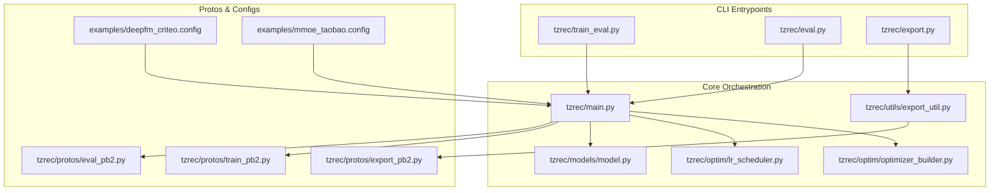
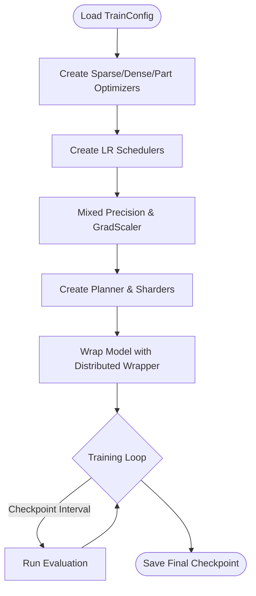
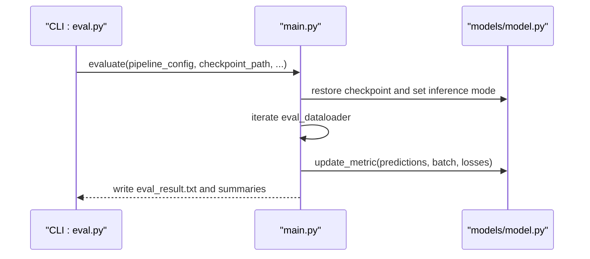
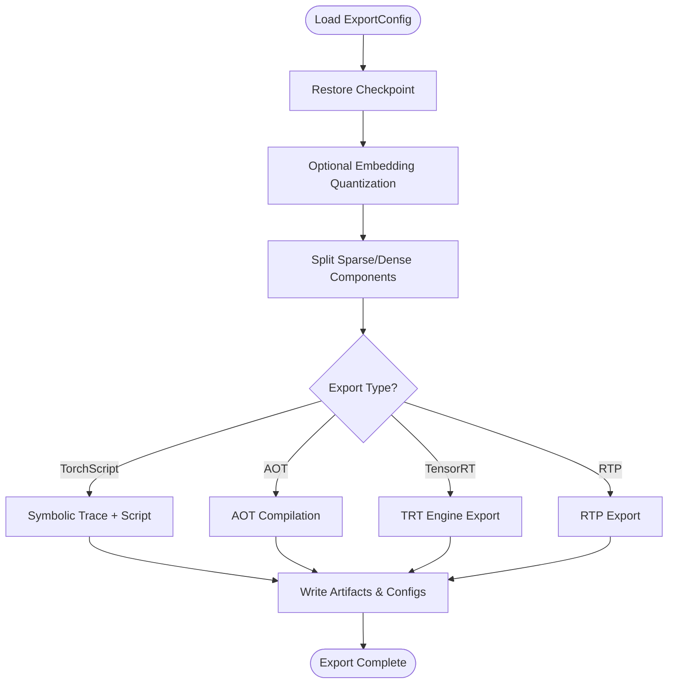
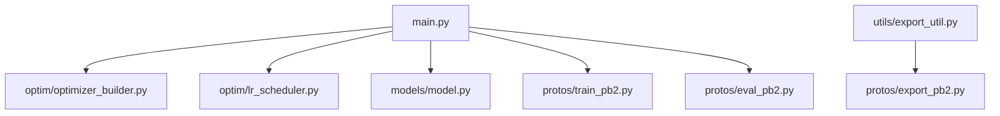

# Training and Evaluation API

<cite>
**Referenced Files in This Document**
- [main.py](file://tzrec/main.py)
- [train_eval.py](file://tzrec/train_eval.py)
- [eval.py](file://tzrec/eval.py)
- [export.py](file://tzrec/export.py)
- [optimizer_builder.py](file://tzrec/optim/optimizer_builder.py)
- [lr_scheduler.py](file://tzrec/optim/lr_scheduler.py)
- [export_util.py](file://tzrec/utils/export_util.py)
- [model.py](file://tzrec/models/model.py)
- [train_pb2.py](file://tzrec/protos/train_pb2.py)
- [eval_pb2.py](file://tzrec/protos/eval_pb2.py)
- [export_pb2.py](file://tzrec/protos/export_pb2.py)
- [deepfm_criteo.config](file://examples/deepfm_criteo.config)
- [mmoe_taobao.config](file://examples/mmoe_taobao.config)
- [train.md](file://docs/source/usage/train.md)
- [eval.md](file://docs/source/usage/eval.md)
- [export.md](file://docs/source/usage/export.md)
</cite>

## Table of Contents

1. [Introduction](#introduction)
1. [Project Structure](#project-structure)
1. [Core Components](#core-components)
1. [Architecture Overview](#architecture-overview)
1. [Detailed Component Analysis](#detailed-component-analysis)
1. [Dependency Analysis](#dependency-analysis)
1. [Performance Considerations](#performance-considerations)
1. [Troubleshooting Guide](#troubleshooting-guide)
1. [Conclusion](#conclusion)
1. [Appendices](#appendices)

## Introduction

This document explains the Training, Evaluation, and Export configuration APIs in the TorchEasyRec codebase. It covers:

- Training configurations: optimizer settings, learning rate scheduling, gradient clipping, gradient accumulation, mixed precision, profiling, and distributed training parameters.
- Evaluation configurations: metric definitions, evaluation frequency, and performance monitoring settings.
- Export configurations: model serialization, TorchScript compilation, and serving preparation.
  It also documents integration between training, evaluation, and export phases and provides configuration examples for typical scenarios.

## Project Structure

The training, evaluation, and export entry points are thin CLI wrappers that delegate to the centralized training and evaluation orchestration in the main module. Exporting is handled by a dedicated export utility.



**Diagram sources**

- \[train_eval.py\](file://tzrec/train_eval.py#L16-L72)
- \[eval.py\](file://tzrec/eval.py#L16-L50)
- \[export.py\](file://tzrec/export.py#L16-L50)
- \[main.py\](file://tzrec/main.py#L527-L734)
- \[optimizer_builder.py\](file://tzrec/optim/optimizer_builder.py#L30-L149)
- \[lr_scheduler.py\](file://tzrec/optim/lr_scheduler.py#L26-L159)
- \[model.py\](file://tzrec/models/model.py#L39-L200)
- \[export_util.py\](file://tzrec/utils/export_util.py#L75-L106)
- \[train_pb2.py\](file://tzrec/protos/train_pb2.py#L19-L29)
- \[eval_pb2.py\](file://tzrec/protos/eval_pb2.py#L17-L25)
- \[export_pb2.py\](file://tzrec/protos/export_pb2.py#L17-L25)
- \[deepfm_criteo.config\](file://examples/deepfm_criteo.config#L1-L397)
- \[mmoe_taobao.config\](file://examples/mmoe_taobao.config#L1-L216)

**Section sources**

- \[train_eval.py\](file://tzrec/train_eval.py#L16-L72)
- \[eval.py\](file://tzrec/eval.py#L16-L50)
- \[export.py\](file://tzrec/export.py#L16-L50)
- \[main.py\](file://tzrec/main.py#L527-L734)
- \[optimizer_builder.py\](file://tzrec/optim/optimizer_builder.py#L30-L149)
- \[lr_scheduler.py\](file://tzrec/optim/lr_scheduler.py#L26-L159)
- \[model.py\](file://tzrec/models/model.py#L39-L200)
- \[export_util.py\](file://tzrec/utils/export_util.py#L75-L106)
- \[train_pb2.py\](file://tzrec/protos/train_pb2.py#L19-L29)
- \[eval_pb2.py\](file://tzrec/protos/eval_pb2.py#L17-L25)
- \[export_pb2.py\](file://tzrec/protos/export_pb2.py#L17-L25)
- \[deepfm_criteo.config\](file://examples/deepfm_criteo.config#L1-L397)
- \[mmoe_taobao.config\](file://examples/mmoe_taobao.config#L1-L216)

## Core Components

- Training orchestration: builds features, data loaders, model, distributed wrapper, optimizers, schedulers, and runs training loops with periodic evaluation and checkpointing.
- Evaluation orchestration: restores a model checkpoint and evaluates on the evaluation dataset, aggregating metrics and optionally writing summaries.
- Export orchestration: loads a checkpoint, traces/scrips the model, splits sparse/dense components, applies optional quantization, and writes serialized artifacts and configs.

Key responsibilities:

- Optimizer/Scheduler creation and distribution-aware application.
- Distributed training plan and sharding.
- Logging and TensorBoard summaries.
- Export variants: TorchScript, AOT, TensorRT, and RTP.

**Section sources**

- \[main.py\](file://tzrec/main.py#L527-L734)
- \[main.py\](file://tzrec/main.py#L161-L225)
- \[main.py\](file://tzrec/main.py#L310-L525)
- \[optimizer_builder.py\](file://tzrec/optim/optimizer_builder.py#L30-L149)
- \[lr_scheduler.py\](file://tzrec/optim/lr_scheduler.py#L26-L159)
- \[export_util.py\](file://tzrec/utils/export_util.py#L75-L106)

## Architecture Overview

End-to-end workflow across training, evaluation, and export.

```mermaid
sequenceDiagram
participant CLI_Train as "CLI : train_eval.py"
participant Main as "main.py"
participant Opt as "optimizer_builder.py"
participant LRS as "lr_scheduler.py"
participant Model as "models/model.py"
participant FS as "filesystem_util.py"
CLI_Train->>Main : train_and_evaluate(pipeline_config, ...)
Main->>Opt : create sparse/dense/part optimizers
Main->>LRS : create schedulers per optimizer
Main->>Model : build model and wrap for DMP
Main->>Main : train loop with checkpoints and eval
Main-->>CLI_Train : finished
```

**Diagram sources**

- \[train_eval.py\](file://tzrec/train_eval.py#L63-L72)
- \[main.py\](file://tzrec/main.py#L527-L734)
- \[optimizer_builder.py\](file://tzrec/optim/optimizer_builder.py#L30-L149)
- \[lr_scheduler.py\](file://tzrec/optim/lr_scheduler.py#L26-L159)
- \[model.py\](file://tzrec/models/model.py#L39-L200)

## Detailed Component Analysis

### Training Configuration API

Training configuration is defined via the pipeline config’s TrainConfig and is consumed by the training orchestrator.

- Optimizers
  - Sparse optimizer: for embedding parameters; supports SGD, Adagrad, Adam, LARS_SGD, LAMB, PartialRowWise variants, RowWiseAdagrad.
  - Dense optimizer: for non-embedding parameters; supports SGD, Adagrad, Adam, AdamW.
  - Part optimizers: regex-based grouping of dense parameters with separate optimizers/schedulers.
- Learning Rate Scheduling
  - Built from optimizer configs; supports constant, exponential decay, manual step schedules; can schedule by epoch or step.
- Gradient Management
  - Gradient accumulation steps for effective larger batch sizes.
  - Optional GradScaler for FP16/BF16 mixed precision.
- Distributed Training
  - Planner and sharders drive model sharding and parallelism.
  - Applies optimizer-in-backward for sparse/frozen parameters.
- Logging and Profiling
  - TensorBoard summaries for loss, learning rate, gradients, parameters, global gradient norm.
  - Optional profiling trace saved to TensorBoard.



**Diagram sources**

- \[main.py\](file://tzrec/main.py#L621-L696)
- \[optimizer_builder.py\](file://tzrec/optim/optimizer_builder.py#L30-L149)
- \[lr_scheduler.py\](file://tzrec/optim/lr_scheduler.py#L26-L159)
- \[train_pb2.py\](file://tzrec/protos/train_pb2.py#L19-L29)

**Section sources**

- \[main.py\](file://tzrec/main.py#L621-L696)
- \[optimizer_builder.py\](file://tzrec/optim/optimizer_builder.py#L30-L149)
- \[lr_scheduler.py\](file://tzrec/optim/lr_scheduler.py#L26-L159)
- \[train_pb2.py\](file://tzrec/protos/train_pb2.py#L19-L29)
- \[train.md\](file://docs/source/usage/train.md#L29-L107)

### Evaluation Configuration API

Evaluation reads EvalConfig and executes a forward pass over the evaluation dataset, updating metrics and optionally writing results and TensorBoard summaries.

- Metrics
  - Metrics are initialized and updated during evaluation; computed at the end.
- Frequency
  - Controlled by num_steps; defaults to full dataset if unset.
- Monitoring
  - Logs progress and writes eval_result.txt with global_step and metric values.



**Diagram sources**

- \[eval.py\](file://tzrec/eval.py#L45-L50)
- \[main.py\](file://tzrec/main.py#L739-L807)
- \[main.py\](file://tzrec/main.py#L161-L225)
- \[eval_pb2.py\](file://tzrec/protos/eval_pb2.py#L17-L25)

**Section sources**

- \[eval.py\](file://tzrec/eval.py#L45-L50)
- \[main.py\](file://tzrec/main.py#L739-L807)
- \[main.py\](file://tzrec/main.py#L161-L225)
- \[eval_pb2.py\](file://tzrec/protos/eval_pb2.py#L17-L25)
- \[eval.md\](file://docs/source/usage/eval.md#L23-L34)

### Export Configuration API

Export prepares the model for serving by serializing weights, tracing/graph building, and packaging artifacts.

- Export Types
  - TorchScript: traced and scripted model.
  - AOT: Ahead-of-Time compiled artifacts.
  - TensorRT: split sparse/dense and TRT engine export.
  - RTP: specialized export for Alibaba Processor platform.
- Quantization
  - Optional embedding quantization for non-sequence and sequence embeddings.
- Serving Preparation
  - Saves pipeline.config, feature group JSON, accelerator configs, and assets.



**Diagram sources**

- \[export_util.py\](file://tzrec/utils/export_util.py#L75-L106)
- \[export_util.py\](file://tzrec/utils/export_util.py#L108-L238)
- \[export_util.py\](file://tzrec/utils/export_util.py#L596-L807)
- \[export_pb2.py\](file://tzrec/protos/export_pb2.py#L17-L25)
- \[export.md\](file://docs/source/usage/export.md#L3-L17)

**Section sources**

- \[export_util.py\](file://tzrec/utils/export_util.py#L75-L106)
- \[export_util.py\](file://tzrec/utils/export_util.py#L108-L238)
- \[export_util.py\](file://tzrec/utils/export_util.py#L596-L807)
- \[export_pb2.py\](file://tzrec/protos/export_pb2.py#L17-L25)
- \[export.md\](file://docs/source/usage/export.md#L3-L17)

### Configuration Examples

- Single-task training with explicit optimizer and LR scheduling

  - Example: \[deepfm_criteo.config\](file://examples/deepfm_criteo.config#L1-L397)
  - Demonstrates sparse/dense optimizer configs, constant LR, and epoch-based training.

- Multi-task training with task-specific metrics and losses

  - Example: \[mmoe_taobao.config\](file://examples/mmoe_taobao.config#L1-L216)
  - Demonstrates multi-task towers with distinct metrics and losses.

- Training command-line usage

  - Reference: \[train.md\](file://docs/source/usage/train.md#L1-L28)

- Evaluation command-line usage

  - Reference: \[eval.md\](file://docs/source/usage/eval.md#L1-L22)

- Export command-line usage and export_config

  - Reference: \[export.md\](file://docs/source/usage/export.md#L1-L46)

**Section sources**

- \[deepfm_criteo.config\](file://examples/deepfm_criteo.config#L1-L397)
- \[mmoe_taobao.config\](file://examples/mmoe_taobao.config#L1-L216)
- \[train.md\](file://docs/source/usage/train.md#L1-L28)
- \[eval.md\](file://docs/source/usage/eval.md#L1-L22)
- \[export.md\](file://docs/source/usage/export.md#L1-L46)

## Dependency Analysis

Key internal dependencies among training, evaluation, and export:



**Diagram sources**

- \[main.py\](file://tzrec/main.py#L527-L734)
- \[optimizer_builder.py\](file://tzrec/optim/optimizer_builder.py#L30-L149)
- \[lr_scheduler.py\](file://tzrec/optim/lr_scheduler.py#L26-L159)
- \[model.py\](file://tzrec/models/model.py#L39-L200)
- \[export_util.py\](file://tzrec/utils/export_util.py#L75-L106)
- \[train_pb2.py\](file://tzrec/protos/train_pb2.py#L19-L29)
- \[eval_pb2.py\](file://tzrec/protos/eval_pb2.py#L17-L25)
- \[export_pb2.py\](file://tzrec/protos/export_pb2.py#L17-L25)

**Section sources**

- \[main.py\](file://tzrec/main.py#L527-L734)
- \[optimizer_builder.py\](file://tzrec/optim/optimizer_builder.py#L30-L149)
- \[lr_scheduler.py\](file://tzrec/optim/lr_scheduler.py#L26-L159)
- \[model.py\](file://tzrec/models/model.py#L39-L200)
- \[export_util.py\](file://tzrec/utils/export_util.py#L75-L106)
- \[train_pb2.py\](file://tzrec/protos/train_pb2.py#L19-L29)
- \[eval_pb2.py\](file://tzrec/protos/eval_pb2.py#L17-L25)
- \[export_pb2.py\](file://tzrec/protos/export_pb2.py#L17-L25)

## Performance Considerations

- Mixed precision and GradScaler
  - Enable BF16/FP16 mixed precision and configure GradScaler for stability.
- TF32 toggles
  - cudnn_allow_tf32 and cuda_matmul_allow_tf32 can improve throughput depending on hardware.
- Gradient accumulation
  - Use gradient_accumulation_steps to simulate larger batches when memory is constrained.
- TensorBoard summaries
  - Limit expensive histograms/grad norms for long runs; keep defaults for lightweight monitoring.
- Distributed training
  - Adjust bandwidth-related environment variables and storage reserve to fit cluster constraints.

[No sources needed since this section provides general guidance]

## Troubleshooting Guide

- Training fails due to conflicting num_steps and num_epochs
  - The training loop asserts that only one of num_steps or num_epochs is set.
  - Fix: set exactly one of them in TrainConfig.
- Checkpoint restoration issues
  - When resuming training, ensure the optimizer is primed with a dummy step before restoring optimizer state.
  - Use ignore_restore_optimizer to skip optimizer state loading if needed.
- Export requires a checkpoint path
  - Export currently requires a checkpoint path; ensure it is provided.
- Export on multi-GPU
  - Export enforces WORLD_SIZE=1 for now; set WORLD_SIZE=1 before exporting.
- Quantization and RTP compatibility
  - Certain quantization modes and RTP require specific feature configurations; adjust feature group JSON accordingly.

**Section sources**

- \[main.py\](file://tzrec/main.py#L331-L334)
- \[main.py\](file://tzrec/main.py#L400-L414)
- \[export_util.py\](file://tzrec/utils/export_util.py#L156-L158)
- \[export_util.py\](file://tzrec/utils/export_util.py#L122-L127)

## Conclusion

The TorchEasyRec training, evaluation, and export APIs are configured declaratively via protobuf-based pipeline configs and orchestrated centrally. The system supports flexible optimizer and scheduler setups, distributed training with automatic sharding, comprehensive evaluation metrics, and multiple export formats for production serving. By tuning TrainConfig, EvalConfig, and ExportConfig, practitioners can adapt the framework to diverse training scenarios and deployment needs.

[No sources needed since this section summarizes without analyzing specific files]

## Appendices

### API Surface Summary

- Training API

  - Entrypoint: \[train_eval.py\](file://tzrec/train_eval.py#L63-L72)
  - Orchestrator: \[main.py\](file://tzrec/main.py#L527-L734)
  - Optimizers: \[optimizer_builder.py\](file://tzrec/optim/optimizer_builder.py#L30-L149)
  - LR Schedulers: \[lr_scheduler.py\](file://tzrec/optim/lr_scheduler.py#L26-L159)
  - TrainConfig fields: \[train_pb2.py\](file://tzrec/protos/train_pb2.py#L19-L29)
  - Usage guide: \[train.md\](file://docs/source/usage/train.md#L29-L107)

- Evaluation API

  - Entrypoint: \[eval.py\](file://tzrec/eval.py#L45-L50)
  - Orchestrator: \[main.py\](file://tzrec/main.py#L739-L807)
  - EvalConfig fields: \[eval_pb2.py\](file://tzrec/protos/eval_pb2.py#L17-L25)
  - Usage guide: \[eval.md\](file://docs/source/usage/eval.md#L23-L34)

- Export API

  - Entrypoint: \[export.py\](file://tzrec/export.py#L45-L50)
  - Orchestrator: \[export_util.py\](file://tzrec/utils/export_util.py#L75-L106)
  - ExportConfig fields: \[export_pb2.py\](file://tzrec/protos/export_pb2.py#L17-L25)
  - Usage guide: \[export.md\](file://docs/source/usage/export.md#L3-L17)

**Section sources**

- \[train_eval.py\](file://tzrec/train_eval.py#L63-L72)
- \[eval.py\](file://tzrec/eval.py#L45-L50)
- \[export.py\](file://tzrec/export.py#L45-L50)
- \[main.py\](file://tzrec/main.py#L527-L734)
- \[main.py\](file://tzrec/main.py#L739-L807)
- \[export_util.py\](file://tzrec/utils/export_util.py#L75-L106)
- \[optimizer_builder.py\](file://tzrec/optim/optimizer_builder.py#L30-L149)
- \[lr_scheduler.py\](file://tzrec/optim/lr_scheduler.py#L26-L159)
- \[train_pb2.py\](file://tzrec/protos/train_pb2.py#L19-L29)
- \[eval_pb2.py\](file://tzrec/protos/eval_pb2.py#L17-L25)
- \[export_pb2.py\](file://tzrec/protos/export_pb2.py#L17-L25)
- \[train.md\](file://docs/source/usage/train.md#L29-L107)
- \[eval.md\](file://docs/source/usage/eval.md#L23-L34)
- \[export.md\](file://docs/source/usage/export.md#L3-L17)
