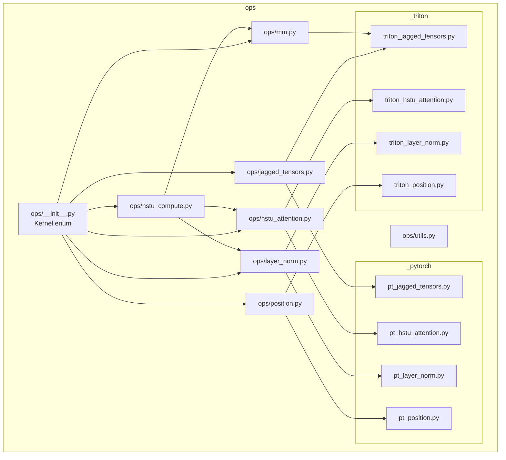
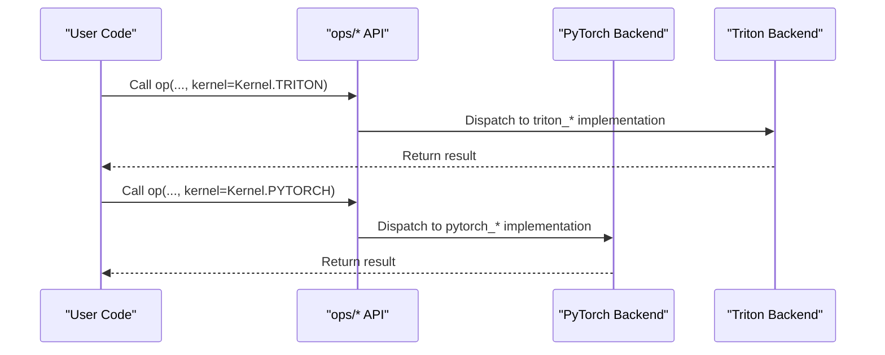
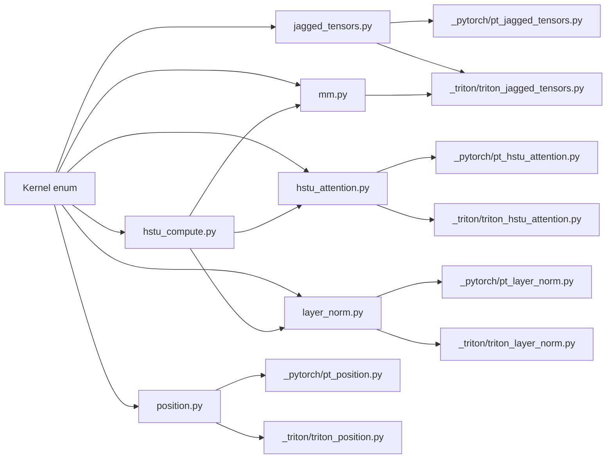

# Custom Operations and Kernels

<cite>
**Referenced Files in This Document**
- [ops/__init__.py](file://tzrec/ops/__init__.py)
- [ops/jagged_tensors.py](file://tzrec/ops/jagged_tensors.py)
- [ops/mm.py](file://tzrec/ops/mm.py)
- [ops/hstu_attention.py](file://tzrec/ops/hstu_attention.py)
- [ops/hstu_compute.py](file://tzrec/ops/hstu_compute.py)
- [ops/layer_norm.py](file://tzrec/ops/layer_norm.py)
- [ops/position.py](file://tzrec/ops/position.py)
- [ops/utils.py](file://tzrec/ops/utils.py)
- [ops/_pytorch/pt_jagged_tensors.py](file://tzrec/ops/_pytorch/pt_jagged_tensors.py)
- [ops/_triton/triton_jagged_tensors.py](file://tzrec/ops/_triton/triton_jagged_tensors.py)
- [ops/_pytorch/pt_hstu_attention.py](file://tzrec/ops/_pytorch/pt_hstu_attention.py)
- [ops/_triton/triton_hstu_attention.py](file://tzrec/ops/_triton/triton_hstu_attention.py)
- [ops/_pytorch/pt_layer_norm.py](file://tzrec/ops/_pytorch/pt_layer_norm.py)
- [ops/_triton/triton_layer_norm.py](file://tzrec/ops/_triton/triton_layer_norm.py)
- [ops/_pytorch/pt_position.py](file://tzrec/ops/_pytorch/pt_position.py)
- [ops/_triton/triton_position.py](file://tzrec/ops/_triton/triton_position.py)
</cite>

## Table of Contents

1. [Introduction](#introduction)
1. [Project Structure](#project-structure)
1. [Core Components](#core-components)
1. [Architecture Overview](#architecture-overview)
1. [Detailed Component Analysis](#detailed-component-analysis)
1. [Dependency Analysis](#dependency-analysis)
1. [Performance Considerations](#performance-considerations)
1. [Troubleshooting Guide](#troubleshooting-guide)
1. [Conclusion](#conclusion)

## Introduction

This document provides comprehensive API documentation for TorchEasyRec’s custom operations and kernel implementations. It covers:

- JaggedTensors for sparse tensor operations
- Matrix multiplication kernels for optimized GEMM operations
- HSTU attention mechanisms for hierarchical self-training units
- HSTU computation modules for sequence processing
- LayerNorm implementations for normalization
- Positional encoding modules for transformer-like architectures

Each operation includes function signatures, tensor shape specifications, device compatibility, performance characteristics, and guidance on Triton and PyTorch backend selection. Usage examples, benchmarks, memory management, numerical stability, and debugging techniques are also provided.

## Project Structure

The custom operations are organized under the ops package with a unified front-end API and two backend implementations:

- PyTorch native implementations under ops/\_pytorch
- Triton-based kernels under ops/\_triton

A small Kernel enumeration defines the available backends.

**Diagram sources**

- \[ops/__init__.py\](file://tzrec/ops/__init__.py#L15-L22)
- \[ops/jagged_tensors.py\](file://tzrec/ops/jagged_tensors.py#L21-L27)
- \[ops/mm.py\](file://tzrec/ops/mm.py#L18-L26)
- \[ops/hstu_attention.py\](file://tzrec/ops/hstu_attention.py#L21-L26)
- \[ops/hstu_compute.py\](file://tzrec/ops/hstu_compute.py#L22-L29)
- \[ops/layer_norm.py\](file://tzrec/ops/layer_norm.py#L20-L26)
- \[ops/position.py\](file://tzrec/ops/position.py#L21-L26)
- \[ops/\_pytorch/pt_jagged_tensors.py\](file://tzrec/ops/\_pytorch/pt_jagged_tensors.py#L19-L23)
- \[ops/\_triton/triton_jagged_tensors.py\](file://tzrec/ops/\_triton/triton_jagged_tensors.py#L20-L27)
- \[ops/\_pytorch/pt_hstu_attention.py\](file://tzrec/ops/\_pytorch/pt_hstu_attention.py#L18-L20)
- \[ops/\_triton/triton_hstu_attention.py\](file://tzrec/ops/\_triton/triton_hstu_attention.py#L20-L26)
- \[ops/\_pytorch/pt_layer_norm.py\](file://tzrec/ops/\_pytorch/pt_layer_norm.py#L19-L20)
- \[ops/\_triton/triton_layer_norm.py\](file://tzrec/ops/\_triton/triton_layer_norm.py#L20-L26)
- \[ops/\_pytorch/pt_position.py\](file://tzrec/ops/\_pytorch/pt_position.py#L19-L25)
- \[ops/\_triton/triton_position.py\](file://tzrec/ops/\_triton/triton_position.py#L20-L30)

**Section sources**

- \[ops/__init__.py\](file://tzrec/ops/__init__.py#L15-L22)

## Core Components

This section summarizes the primary APIs and their roles.

- Kernel enumeration

  - Purpose: Select backend implementation (TRITON, PYTORCH, CUDA).
  - Usage: Pass kernel=Kernel.TRITON or Kernel.PYTORCH to operations.

- JaggedTensors

  - concat_2D_jagged(values_left, values_right, max_len_left, max_len_right, offsets_left=None, offsets_right=None, kernel=Kernel.PYTORCH)
  - split_2D_jagged(max_seq_len, values, total_len_left=None, total_len_right=None, max_len_left=None, max_len_right=None, offsets_left=None, offsets_right=None, kernel=Kernel.PYTORCH)
  - jagged_dense_bmm_broadcast_add(max_seq_len, seq_offsets, jagged, dense, bias, kernel=Kernel.PYTORCH)

- Matrix multiplication

  - addmm(input, mat1, mat2, kernel=Kernel.PYTORCH)

- HSTU Attention

  - hstu_mha(max_seq_len, alpha, q, k, v, seq_offsets, causal=True, dropout_pr=0.0, training=True, num_targets=None, max_attn_len=0, contextual_seq_len=0, sort_by_length=False, kernel=Kernel.PYTORCH, enable_tma=False)
  - delta_hstu_mha(max_seq_len, alpha, delta_q, k, v, seq_offsets, num_targets=None, max_attn_len=0, contextual_seq_len=0, kernel=Kernel.PYTORCH, enable_tma=False)

- HSTU Compute

  - hstu_compute_uqvk(x, norm_weight, norm_bias, norm_eps, num_heads, attn_dim, hidden_dim, uvqk_weight, uvqk_bias, kernel=Kernel.PYTORCH)
  - hstu_compute_output(attn, u, x, norm_weight, norm_bias, norm_eps, output_weight, num_heads, linear_dim, dropout_ratio, training, concat_ux, group_norm, recompute_y_in_backward, kernel=Kernel.PYTORCH)
  - hstu_preprocess_and_attention(..., kernel=Kernel.PYTORCH, enable_tma=False)

- LayerNorm

  - layer_norm(x, weight, bias, eps=1e-5, kernel=Kernel.PYTORCH)
  - rms_norm(x, weight, eps=1e-5, kernel=Kernel.PYTORCH)
  - swish_layer_norm(x, weight, bias, eps=1e-5, kernel=Kernel.PYTORCH)

- Positional Encoding

  - add_positional_embeddings(alpha, max_seq_len, position_embeddings_weight, seq_offsets, seq_lengths, seq_embeddings, num_targets=None, interleave_targets=False, kernel=Kernel.PYTORCH)
  - add_timestamp_positional_embeddings(alpha, max_seq_len, max_contextual_seq_len, position_embeddings_weight, timestamp_embeddings_weight, seq_offsets, seq_lengths, seq_embeddings, timestamps, num_targets=None, interleave_targets=False, time_bucket_fn="sqrt", time_bucket_increments=60.0, kernel=Kernel.PYTORCH)

Device compatibility and backend selection:

- PyTorch backends accept CPU/GPU tensors depending on operation.
- Triton backends require CUDA tensors and enforce stricter constraints (e.g., contiguous tensors, specific kernel flags).

**Section sources**

- \[ops/__init__.py\](file://tzrec/ops/__init__.py#L15-L22)
- \[ops/jagged_tensors.py\](file://tzrec/ops/jagged_tensors.py#L29-L167)
- \[ops/mm.py\](file://tzrec/ops/mm.py#L21-L33)
- \[ops/hstu_attention.py\](file://tzrec/ops/hstu_attention.py#L29-L170)
- \[ops/hstu_compute.py\](file://tzrec/ops/hstu_compute.py#L31-L225)
- \[ops/layer_norm.py\](file://tzrec/ops/layer_norm.py#L28-L110)
- \[ops/position.py\](file://tzrec/ops/position.py#L45-L142)

## Architecture Overview

The operations follow a consistent pattern:

- Front-end API validates shapes and dispatches to selected backend
- PyTorch backend uses native torch ops and fbgemm for sparse/dense conversions
- Triton backend uses custom kernels with autotuning and fused operations

**Diagram sources**

- \[ops/jagged_tensors.py\](file://tzrec/ops/jagged_tensors.py#L45-L64)
- \[ops/mm.py\](file://tzrec/ops/mm.py#L27-L32)
- \[ops/hstu_attention.py\](file://tzrec/ops/hstu_attention.py#L72-L104)
- \[ops/hstu_compute.py\](file://tzrec/ops/hstu_compute.py#L90-L127)
- \[ops/layer_norm.py\](file://tzrec/ops/layer_norm.py#L35-L54)
- \[ops/position.py\](file://tzrec/ops/position.py#L68-L87)

## Detailed Component Analysis

### JaggedTensors

- concat_2D_jagged

  - Purpose: Concatenate two jagged tensors along the sequence dimension with optional dense prefix alignment.
  - Shapes:
    - values_left: (L1, D)
    - values_right: (L2, D)
    - offsets_left, offsets_right: optional, define jagged boundaries
    - Output: (L1+L2, D)
  - Device: PyTorch supports CPU/GPU; Triton requires CUDA.
  - Backend behavior:
    - PyTorch: Uses fbgemm conversions and masking.
    - Triton: Fused concatenation with configurable prefix handling.
  - Notes: Shape checks ensure matching feature dimension D and compatible offsets.

- split_2D_jagged

  - Purpose: Split a jagged tensor into two parts based on offsets or max lengths.
  - Shapes:
    - values: (L, D)
    - Outputs: (L1, D), (L2, D)
  - Backend behavior:
    - PyTorch: Padded dense conversion and masking.
    - Triton: Fused split with configurable prefix-to-right mapping.

- jagged_dense_bmm_broadcast_add

  - Purpose: Compute out = jagged @ dense + bias with broadcasting over batch.
  - Shapes:
    - jagged: (sum_B(M_i), K)
    - dense: (B, K, N)
    - bias: (B, N)
    - Output: (sum_B(M_i), N)
  - Backend behavior:
    - PyTorch: Uses fbgemm conversions and dense_to_jagged.
    - Triton: Autotuned 3D GEMM kernel with block sizes and TF32 support.

Usage example (conceptual):

- Concat two sequences with offsets and then apply a linear transform via addmm.
- Split concatenated sequences back into left/right segments for downstream processing.

Performance characteristics:

- Triton kernels auto-tune block sizes and stages based on max_seq_len and dimensions.
- Memory: Triton kernels minimize redundant loads by using block pointers and TMA where supported.

Numerical stability:

- PyTorch path converts to float32 for accumulation; Triton kernels use float32 accumulators internally.

Debugging tips:

- Verify offsets length equals B+1 and that max_len aligns with actual lengths.
- For Triton, ensure tensors are contiguous and on CUDA.

**Section sources**

- \[ops/jagged_tensors.py\](file://tzrec/ops/jagged_tensors.py#L29-L167)
- \[ops/\_pytorch/pt_jagged_tensors.py\](file://tzrec/ops/\_pytorch/pt_jagged_tensors.py#L62-L175)
- \[ops/\_triton/triton_jagged_tensors.py\](file://tzrec/ops/\_triton/triton_jagged_tensors.py#L352-L800)

### Matrix Multiplication (GEMM)

- addmm
  - Purpose: Compute input + mat1 @ mat2 with optional Triton acceleration.
  - Shapes:
    - input: (M, N)
    - mat1: (M, K)
    - mat2: (K, N)
    - Output: (M, N)
  - Backend behavior:
    - PyTorch: torch.addmm
    - Triton: Custom kernel with autotuning; AMD path falls back to PyTorch for now.

Usage example (conceptual):

- Replace torch.addmm with addmm(kernel=Kernel.TRITON) for large matrices in HSTU compute.

Performance characteristics:

- Triton kernel autotunes BLOCK_M/N/K and number of warps/stages.
- TF32 support enabled when available.

Numerical stability:

- PyTorch path preserves dtype; Triton uses float32 accumulation.

**Section sources**

- \[ops/mm.py\](file://tzrec/ops/mm.py#L21-L33)
- \[ops/hstu_compute.py\](file://tzrec/ops/hstu_compute.py#L50-L55)

### HSTU Attention Mechanisms

- hstu_mha

  - Purpose: Multi-head attention over jagged sequences with causal masking and optional target-aware windows.
  - Shapes:
    - q, k, v: (L, H, D)
    - seq_offsets: (B+1,)
    - Output: (L, H, V)
  - Backend behavior:
    - PyTorch: Padded dense attention with einsum and masking.
    - Triton: Autotuned attention kernel with block-scan and TMA support; strict CUDA and contiguous requirements.

- delta_hstu_mha

  - Purpose: Cached attention for incremental decoding where only the new delta positions are computed against full keys/values.
  - Shapes:
    - delta_q: (B * delta_size, H, D)
    - k, v: (L, H, D)
    - Output: (B * delta_size, H, V)
  - Backend behavior:
    - PyTorch: Reshapes and computes attention over padded full sequences.
    - Triton: Optimized delta attention with masked windows and target-aware logic.

Usage example (conceptual):

- Preprocess embeddings with HSTU compute, then run attention with causal masking and optional contextual window.

Performance characteristics:

- Triton attention autotunes BLOCK_M/N and matrix instruction dimensions; supports TMA for efficient loading.
- Masking logic handles causal, max_attn_len, contextual_seq_len, and multiple targets.

Numerical stability:

- Sigmoid-based scaling by max_seq_len; masking zeros out invalid positions.

**Section sources**

- \[ops/hstu_attention.py\](file://tzrec/ops/hstu_attention.py#L29-L170)
- \[ops/\_pytorch/pt_hstu_attention.py\](file://tzrec/ops/\_pytorch/pt_hstu_attention.py#L120-L226)
- \[ops/\_triton/triton_hstu_attention.py\](file://tzrec/ops/\_triton/triton_hstu_attention.py#L46-L244)

### HSTU Computation Modules

- hstu_compute_uqvk

  - Purpose: Compute U, Q, K, V projections from input x via LayerNorm and linear projection.
  - Shapes:
    - x: (N, D_in)
    - uvqk_weight: (D_in, 2*H*(hidden_dim + attn_dim))
    - uvqk_bias: (...,)
    - Outputs: u, q, k, v with shapes derived from splits.
  - Backend behavior:
    - Uses layer_norm and addmm; on ROCm (AMD), falls back to PyTorch addmm for Triton parity.

- hstu_compute_output

  - Purpose: Combine attention output with gating (U) and residual connections; optional dropout and group norm.
  - Shapes:
    - attn: (L, H, V)
    - u: (L, H, hidden_dim)
    - x: (N, D_in)
    - output_weight: (...,)
    - Output: (...,)

- hstu_preprocess_and_attention

  - Purpose: End-to-end preprocessing and attention with optional Triton fusion.
  - Backend behavior:
    - Triton path fuses norm, projection, and attention into a single kernel for latency reduction.

Usage example (conceptual):

- Run hstu_preprocess_and_attention to obtain U and attention output, then feed into MLP or residual branches.

Performance characteristics:

- Triton fused kernel reduces memory bandwidth and kernel launch overhead.
- Recompute flags enable memory-speed trade-offs in backward pass.

**Section sources**

- \[ops/hstu_compute.py\](file://tzrec/ops/hstu_compute.py#L31-L225)

### LayerNorm Implementations

- layer_norm

  - Purpose: Standard layer normalization with optional learnable weight/bias.
  - Shapes:
    - x: (N, D)
    - weight, bias: (D,)
    - Output: (N, D)

- rms_norm

  - Purpose: Root mean square normalization.
  - Shapes:
    - x: (N, D)
    - weight: (D,)
    - Output: (N, D)

- swish_layer_norm

  - Purpose: Swish activation applied after layer-normalized features.
  - Shapes:
    - x: (N, D)
    - weight, bias: (D,)
    - Output: (N, D)

Backend behavior:

- PyTorch: Uses functional layer_norm/rms_norm with dtype promotion.
- Triton: Fused kernel computes mean, rstd, and optional weight/bias scaling; supports swish variant.

Usage example (conceptual):

- Replace torch.nn.LayerNorm with layer_norm(kernel=Kernel.TRITON) for improved throughput on GPU.

Performance characteristics:

- Triton kernel autotunes BLOCK_D and num_warps; supports parallel reduction for gradients.

**Section sources**

- \[ops/layer_norm.py\](file://tzrec/ops/layer_norm.py#L28-L110)
- \[ops/\_pytorch/pt_layer_norm.py\](file://tzrec/ops/\_pytorch/pt_layer_norm.py#L22-L75)
- \[ops/\_triton/triton_layer_norm.py\](file://tzrec/ops/\_triton/triton_layer_norm.py#L28-L800)

### Positional Encoding Modules

- add_positional_embeddings

  - Purpose: Add dense positional embeddings to jagged sequences with clamping to vocabulary size.
  - Shapes:
    - seq_embeddings: (L, D)
    - position_embeddings_weight: (K, D)
    - seq_offsets: (B+1,)
    - Output: (L, D)

- add_timestamp_positional_embeddings

  - Purpose: Combine position and timestamp buckets with configurable bucket function.
  - Shapes:
    - seq_embeddings: (L, D)
    - timestamps: (L,) or padded to (B, max_seq_len)
    - position_embeddings_weight: (Kp, D)
    - timestamp_embeddings_weight: (Kt, D)
    - Output: (L, D)

Backend behavior:

- PyTorch: Uses fbgemm elementwise add and index_select.
- Triton: Fused kernel with autotuning; stores position and timestamp indices for backward reduction.

Usage example (conceptual):

- Apply positional embeddings before attention; optionally add timestamp buckets for temporal signals.

Performance characteristics:

- Triton kernel supports BLOCK_N autotuning and scales with feature dimension.

**Section sources**

- \[ops/position.py\](file://tzrec/ops/position.py#L45-L142)
- \[ops/\_pytorch/pt_position.py\](file://tzrec/ops/\_pytorch/pt_position.py#L27-L145)
- \[ops/\_triton/triton_position.py\](file://tzrec/ops/\_triton/triton_position.py#L53-L715)

## Dependency Analysis

Key dependencies and relationships:

- ops/__init__.py defines Kernel enum used across all operations.
- Front-end APIs import backend modules dynamically based on kernel selection.
- Utilities (ops/utils.py) provide autotune helpers and contiguity enforcement for Triton.

**Diagram sources**

- \[ops/__init__.py\](file://tzrec/ops/__init__.py#L15-L22)
- \[ops/jagged_tensors.py\](file://tzrec/ops/jagged_tensors.py#L21-L27)
- \[ops/mm.py\](file://tzrec/ops/mm.py#L18-L26)
- \[ops/hstu_attention.py\](file://tzrec/ops/hstu_attention.py#L21-L26)
- \[ops/hstu_compute.py\](file://tzrec/ops/hstu_compute.py#L22-L29)
- \[ops/layer_norm.py\](file://tzrec/ops/layer_norm.py#L20-L26)
- \[ops/position.py\](file://tzrec/ops/position.py#L21-L26)

**Section sources**

- \[ops/utils.py\](file://tzrec/ops/utils.py)

## Performance Considerations

- Triton autotuning

  - Many kernels expose autotune configs for BLOCK_M/N/K, num_stages/warps, and matrix instruction dims.
  - Use appropriate max_seq_len quantization keys to select tuned configs.

- Memory layout

  - Triton backends require contiguous tensors; use switch_to_contiguous_if_needed where applicable.
  - Prefer column-major layouts for GEMM-friendly access patterns.

- Data type

  - Some kernels promote to float32 for accumulation; preserve original dtype on output.

- Device placement

  - Triton requires CUDA tensors; PyTorch backends support CPU/GPU depending on operation.

- Recompute and fusion

  - HSTU fused kernels reduce memory traffic; recompute flags trade compute for memory in backward.

[No sources needed since this section provides general guidance]

## Troubleshooting Guide

Common issues and resolutions:

- Shape mismatches

  - Verify that feature dimensions match across concatenated/split tensors and that offsets align with batch size plus one.

- Device errors

  - Ensure tensors are on CUDA for Triton kernels; check assertions for CPU tensors in Triton paths.

- Contiguity

  - Use contiguous tensors for Triton kernels; some kernels explicitly enforce contiguity.

- Numerical instability

  - Pay attention to scaling factors (e.g., dividing by max_seq_len) and masking to avoid NaN propagation.

- Autotune failures

  - Large feature dimensions may exceed fused kernel limits; fall back to PyTorch or adjust BLOCK_D.

- Debugging techniques

  - Wrap operations with torch.no_grad for inference profiling.
  - Use torch.cuda.amp for mixed precision where supported.
  - Inspect intermediate shapes and masks in PyTorch implementations for correctness.

**Section sources**

- \[ops/jagged_tensors.py\](file://tzrec/ops/jagged_tensors.py#L38-L99)
- \[ops/hstu_attention.py\](file://tzrec/ops/hstu_attention.py#L57-L71)
- \[ops/layer_norm.py\](file://tzrec/ops/layer_norm.py#L35-L44)
- \[ops/\_triton/triton_layer_norm.py\](file://tzrec/ops/\_triton/triton_layer_norm.py#L334-L378)

## Conclusion

TorchEasyRec’s custom operations provide high-performance, fused kernels for sparse sequences, attention, normalization, and positional encodings. The unified API allows seamless switching between PyTorch and Triton backends, enabling optimal performance across diverse hardware and workloads. By following the shape specifications, device requirements, and optimization guidelines outlined here, developers can integrate these operations effectively and achieve significant speedups in recommendation and sequence modeling tasks.
