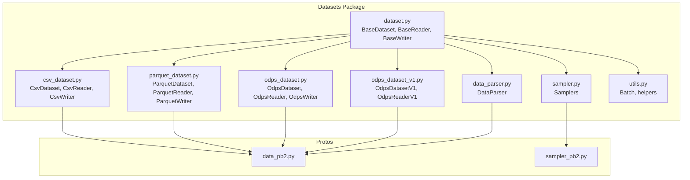
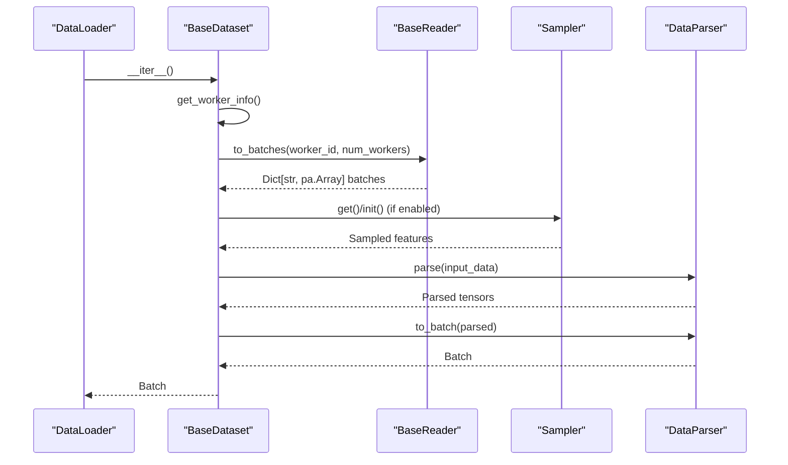
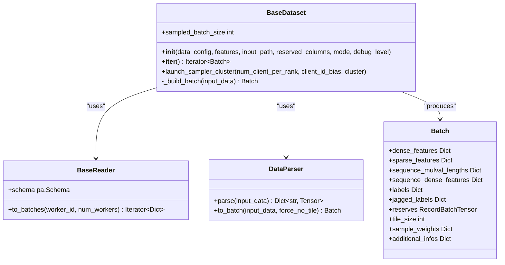
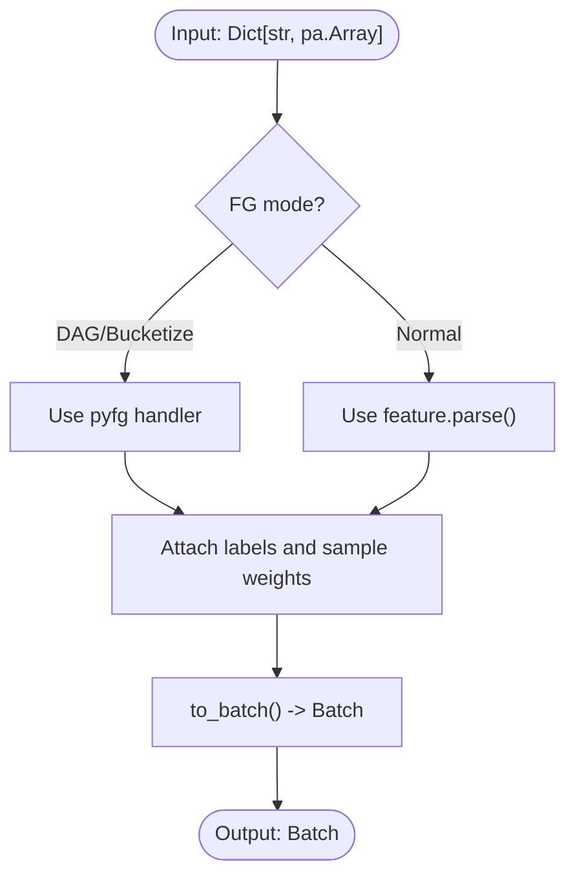
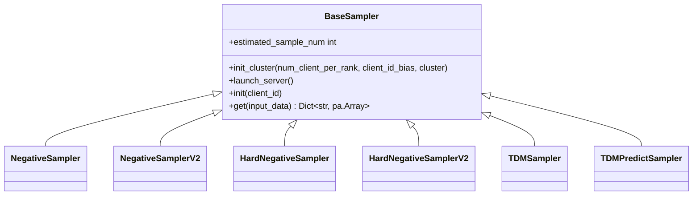
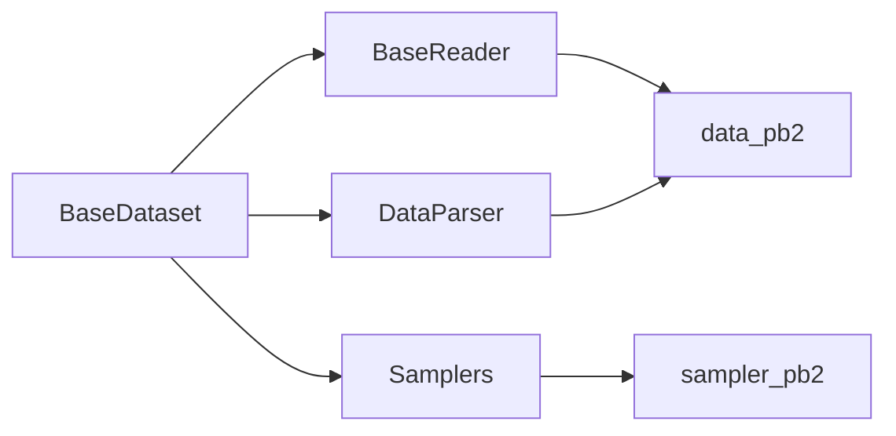

# Dataset and Data Loading Classes

<cite>
**Referenced Files in This Document**
- [dataset.py](file://tzrec/datasets/dataset.py)
- [csv_dataset.py](file://tzrec/datasets/csv_dataset.py)
- [parquet_dataset.py](file://tzrec/datasets/parquet_dataset.py)
- [odps_dataset.py](file://tzrec/datasets/odps_dataset.py)
- [odps_dataset_v1.py](file://tzrec/datasets/odps_dataset_v1.py)
- [data_parser.py](file://tzrec/datasets/data_parser.py)
- [sampler.py](file://tzrec/datasets/sampler.py)
- [utils.py](file://tzrec/datasets/utils.py)
- [data_pb2.py](file://tzrec/protos/data_pb2.py)
- [sampler_pb2.py](file://tzrec/protos/sampler_pb2.py)
- [deepfm_criteo.config](file://examples/deepfm_criteo.config)
</cite>

## Table of Contents

1. [Introduction](#introduction)
1. [Project Structure](#project-structure)
1. [Core Components](#core-components)
1. [Architecture Overview](#architecture-overview)
1. [Detailed Component Analysis](#detailed-component-analysis)
1. [Dependency Analysis](#dependency-analysis)
1. [Performance Considerations](#performance-considerations)
1. [Troubleshooting Guide](#troubleshooting-guide)
1. [Conclusion](#conclusion)
1. [Appendices](#appendices)

## Introduction

This document provides comprehensive API documentation for TorchEasyRec’s dataset and data loading subsystem. It covers the BaseDataset abstract class (built on PyTorch’s IterableDataset), concrete dataset implementations for CSV, Parquet, and Alibaba Cloud ODPS, the DataParser for transforming raw records into PyTorch-Rec tensors, and Sampler classes for negative sampling and hierarchical tree-based sampling. It also documents data configuration schemas, parsing options, memory management, distributed data loading, caching strategies, and debugging capabilities. Usage examples and performance optimization techniques are included for each dataset type.

## Project Structure

The dataset and data loading functionality resides primarily under the tzrec/datasets package, with supporting protocol buffers under tzrec/protos and example configurations under examples/.

**Diagram sources**

- \[dataset.py\](file://tzrec/datasets/dataset.py#L149-L733)
- \[csv_dataset.py\](file://tzrec/datasets/csv_dataset.py#L31-L207)
- \[parquet_dataset.py\](file://tzrec/datasets/parquet_dataset.py#L98-L304)
- \[odps_dataset.py\](file://tzrec/datasets/odps_dataset.py#L302-L661)
- \[odps_dataset_v1.py\](file://tzrec/datasets/odps_dataset_v1.py#L65-L185)
- \[data_parser.py\](file://tzrec/datasets/data_parser.py#L56-L953)
- \[sampler.py\](file://tzrec/datasets/sampler.py#L219-L1055)
- \[utils.py\](file://tzrec/datasets/utils.py#L43-L517)
- \[data_pb2.py\](file://tzrec/protos/data_pb2.py)
- \[sampler_pb2.py\](file://tzrec/protos/sampler_pb2.py)

**Section sources**

- \[dataset.py\](file://tzrec/datasets/dataset.py#L1-L733)
- \[csv_dataset.py\](file://tzrec/datasets/csv_dataset.py#L1-L207)
- \[parquet_dataset.py\](file://tzrec/datasets/parquet_dataset.py#L1-L304)
- \[odps_dataset.py\](file://tzrec/datasets/odps_dataset.py#L1-L661)
- \[odps_dataset_v1.py\](file://tzrec/datasets/odps_dataset_v1.py#L1-L185)
- \[data_parser.py\](file://tzrec/datasets/data_parser.py#L1-L953)
- \[sampler.py\](file://tzrec/datasets/sampler.py#L1-L1055)
- \[utils.py\](file://tzrec/datasets/utils.py#L1-L517)

## Core Components

- BaseDataset: Abstract iterable dataset that orchestrates reading, sampling, parsing, batching, and distributed worker coordination. Exposes __iter__(), internal \_build_batch(), and sampled_batch_size property.
- BaseReader: Abstract reader interface for file/table sources, providing schema introspection and batch iteration with optional shuffling and cost-aware slicing.
- BaseWriter: Abstract writer interface for output sinks.
- DataParser: Transforms raw PyArrow arrays into PyTorch tensors and torchrec data structures (KeyedTensor, KeyedJaggedTensor, JaggedTensor), supports feature groups, weighted features, and sequence features.
- Samplers: Distributed negative sampling and hierarchical tree-based sampling (TDM) integrated via GraphLearn.

Key method signatures:

- BaseDataset.__iter__() -> Iterator[Batch]
- BaseDataset.\_build_batch(input_data: Dict[str, pa.Array]) -> Batch
- BaseReader.to_batches(worker_id: int = 0, num_workers: int = 1) -> Iterator\[Dict[str, pa.Array]\]
- DataParser.parse(input_data: Dict[str, pa.Array]) -> Dict[str, torch.Tensor]
- DataParser.to_batch(input_data: Dict[str, torch.Tensor], force_no_tile: bool = False) -> Batch
- Sampler.get(input_data: Dict[str, pa.Array]) -> Dict[str, pa.Array] or Tuple\[Dict[str, pa.Array], Dict[str, pa.Array]\]

**Section sources**

- \[dataset.py\](file://tzrec/datasets/dataset.py#L149-L428)
- \[utils.py\](file://tzrec/datasets/utils.py#L110-L317)
- \[data_parser.py\](file://tzrec/datasets/data_parser.py#L178-L475)
- \[sampler.py\](file://tzrec/datasets/sampler.py#L442-L750)

## Architecture Overview

The data pipeline integrates dataset readers, samplers, and parsers into a single IterableDataset that yields Batch objects consumed by DataLoader.

**Diagram sources**

- \[dataset.py\](file://tzrec/datasets/dataset.py#L309-L419)
- \[data_parser.py\](file://tzrec/datasets/data_parser.py#L178-L475)
- \[sampler.py\](file://tzrec/datasets/sampler.py#L442-L750)

## Detailed Component Analysis

### BaseDataset

- Responsibilities:
  - Initialize DataParser, select input fields, configure batch sizes per mode, manage sampler lifecycle.
  - Coordinate distributed workers and optionally launch sampler servers.
  - Convert raw batches to Batch objects via DataParser and optional sampling.
- Key APIs:
  - __init__(data_config, features, input_path, reserved_columns, mode, debug_level)
  - __iter__() -> Iterator[Batch]
  - \_build_batch(input_data: Dict[str, pa.Array]) -> Batch
  - launch_sampler_cluster(num_client_per_rank, client_id_bias, cluster)
  - sampled_batch_size property
- Distributed behavior:
  - Uses torch.utils.data.get_worker_info() and torch.distributed to compute worker indices and world size.
  - Supports reusing sampler clusters across train/eval.

**Diagram sources**

- \[dataset.py\](file://tzrec/datasets/dataset.py#L149-L428)
- \[utils.py\](file://tzrec/datasets/utils.py#L110-L191)
- \[data_parser.py\](file://tzrec/datasets/data_parser.py#L178-L475)

**Section sources**

- \[dataset.py\](file://tzrec/datasets/dataset.py#L149-L428)
- \[utils.py\](file://tzrec/datasets/utils.py#L110-L191)

### CSV Dataset and Reader

- CsvDataset: Wraps CsvReader, sets up column names/types, header handling, delimiter, and cost-aware batching.
- CsvReader: Uses PyArrow dataset CSV format, supports ordered column selection, shuffling, and block-size tuning.
- CsvWriter: Writes CSV outputs per rank with partitioned files.

Key configuration options:

- with_header: bool
- delimiter: str
- input_fields[].input_type mapped to PyArrow types
- drop_remainder: bool
- shuffle: bool
- shuffle_buffer_size: int
- sample_cost_field: str
- batch_cost_size: int

Usage example (conceptual):

- Set dataset_type to CsvDataset in DataConfig.
- Define input_fields with input_type for each column.
- Configure delimiter and with_header accordingly.

**Section sources**

- \[csv_dataset.py\](file://tzrec/datasets/csv_dataset.py#L31-L207)
- \[data_pb2.py\](file://tzrec/protos/data_pb2.py)

### Parquet Dataset and Reader

- ParquetDataset: Wraps ParquetReader, supports column selection and cost-aware batching.
- ParquetReader: Uses PyArrow Parquet, computes per-file metadata, rebalances rows across workers, and slices efficiently.
- ParquetWriter: Writes Parquet outputs per rank.

Key configuration options:

- drop_remainder: bool
- shuffle: bool
- shuffle_buffer_size: int
- drop_redundant_bs_eq_one: bool
- rebalance: bool
- sample_cost_field: str
- batch_cost_size: int

Optimization tips:

- Enable rebalance to distribute rows evenly across workers.
- Use batch_cost_size with sample_cost_field to cap per-batch resource usage.

**Section sources**

- \[parquet_dataset.py\](file://tzrec/datasets/parquet_dataset.py#L98-L304)
- \[utils.py\](file://tzrec/datasets/utils.py#L444-L501)

### ODPS Dataset (Storage API) and Reader

- OdpsDataset: Wraps OdpsReader, initializes GraphLearn clients, manages read sessions, and supports ordered partition reads.
- OdpsReader: Creates Storage API read sessions per partition, handles retries, compression, and worker slicing.
- OdpsWriter: Creates tables/partitions and writes via Storage API write sessions.

Key configuration options:

- is_orderby_partition: bool
- odps_data_quota_name: str
- odps_data_compression: str
- drop_redundant_bs_eq_one: bool
- sample_cost_field: str
- batch_cost_size: int

Environment prerequisites:

- ODPS credentials via config file or ECS metadata.
- STORAGE_API_QUOTA_NAME environment variable.

**Section sources**

- \[odps_dataset.py\](file://tzrec/datasets/odps_dataset.py#L302-L661)
- \[utils.py\](file://tzrec/datasets/utils.py#L444-L501)

### ODPS Dataset V1 (common-io)

- OdpsDatasetV1: Alternative implementation using common-io for reading ODPS tables.
- OdpsReaderV1: Reads table slices per worker and yields batches.

**Section sources**

- \[odps_dataset_v1.py\](file://tzrec/datasets/odps_dataset_v1.py#L65-L185)

### DataParser

- Responsibilities:
  - Parse raw PyArrow arrays into PyTorch tensors.
  - Support feature groups, weighted features, sequence features, and dense/sparse/sequence variants.
  - Build Batch objects with KeyedTensor/KeyedJaggedTensor/JaggedTensor.
- Key APIs:
  - parse(input_data: Dict[str, pa.Array]) -> Dict[str, torch.Tensor]
  - to_batch(input_data: Dict[str, torch.Tensor], force_no_tile: bool) -> Batch
- Debugging:
  - dump_parsed_inputs(input_data) returns a PyArrow array of formatted feature strings for inspection.

**Diagram sources**

- \[data_parser.py\](file://tzrec/datasets/data_parser.py#L178-L475)

**Section sources**

- \[data_parser.py\](file://tzrec/datasets/data_parser.py#L56-L953)
- \[utils.py\](file://tzrec/datasets/utils.py#L110-L317)

### Samplers

- NegativeSampler/NegativeSamplerV2: Weighted random negative sampling from item/user graphs.
- HardNegativeSampler/HardNegativeSamplerV2: Combines random negatives with hard negatives from edges.
- TDMSampler: Hierarchical tree-based sampling (positive ancestors + layered negatives).
- TDMPredictSampler: Tree-based sampling optimized for prediction.

Key APIs:

- BaseSampler.init_cluster(num_client_per_rank, client_id_bias, cluster)
- BaseSampler.launch_server()
- BaseSampler.init(client_id)
- Sampler.get(input_data: Dict[str, pa.Array]) -> Dict[str, pa.Array] or Tuple\[Dict[str, pa.Array], Dict[str, pa.Array]\]

**Diagram sources**

- \[sampler.py\](file://tzrec/datasets/sampler.py#L219-L1055)

**Section sources**

- \[sampler.py\](file://tzrec/datasets/sampler.py#L219-L1055)

## Dependency Analysis

- Dataset-to-Reader: BaseDataset composes a BaseReader (CsvReader, ParquetReader, OdpsReader).
- Dataset-to-Parser: BaseDataset uses DataParser to transform raw arrays to tensors and Batch.
- Dataset-to-Sampler: BaseDataset optionally launches and uses Samplers for negative/hierarchical sampling.
- Protobuf integration: data_pb2 defines DataConfig and dataset_type; sampler_pb2 defines sampler configurations.

**Diagram sources**

- \[dataset.py\](file://tzrec/datasets/dataset.py#L149-L733)
- \[data_parser.py\](file://tzrec/datasets/data_parser.py#L56-L953)
- \[sampler.py\](file://tzrec/datasets/sampler.py#L219-L1055)
- \[data_pb2.py\](file://tzrec/protos/data_pb2.py)
- \[sampler_pb2.py\](file://tzrec/protos/sampler_pb2.py)

**Section sources**

- \[dataset.py\](file://tzrec/datasets/dataset.py#L149-L733)
- \[data_parser.py\](file://tzrec/datasets/data_parser.py#L56-L953)
- \[sampler.py\](file://tzrec/datasets/sampler.py#L219-L1055)

## Performance Considerations

- Worker sizing:
  - DataLoader num_workers is adjusted based on dataset file counts and WORLD_SIZE to avoid under-utilization.
  - Persistent workers enabled for throughput.
- Cost-aware batching:
  - sample_cost_field and batch_cost_size enable per-batch resource limits for readers.
- Memory management:
  - Pinning disabled during predict mode; Batch supports pin_memory() and to(device).
  - Arrow arrays are chunked and combined efficiently; optional shuffle buffers.
- Distributed fairness:
  - ParquetReader rebalancing ensures even row distribution across workers.
  - ODPS session slicing prevents train/eval deadlocks with drop_redundant_bs_eq_one.
- Sampling overhead:
  - GraphLearn sampler servers launched per rank; client IDs offset to avoid conflicts.

[No sources needed since this section provides general guidance]

## Troubleshooting Guide

Common issues and remedies:

- No CSV files found: Verify input_path glob expansion and with_header configuration.
- Unsupported column types: Ensure input_fields[].input_type maps to supported PyArrow types.
- ODPS session errors: Confirm credentials and STORAGE_API_QUOTA_NAME; check read/write session lifecycles.
- Hanging during train/eval: Enable drop_redundant_bs_eq_one for Parquet/Odps readers.
- Sampler timeouts: Allow initial warm-up sleep in NegativeSamplerV2/TDMSampler init.
- Debugging parsed inputs: Use DataParser.dump_parsed_inputs() to inspect feature strings in predict mode.

**Section sources**

- \[csv_dataset.py\](file://tzrec/datasets/csv_dataset.py#L126-L131)
- \[parquet_dataset.py\](file://tzrec/datasets/parquet_dataset.py#L176-L181)
- \[odps_dataset.py\](file://tzrec/datasets/odps_dataset.py#L417-L471)
- \[utils.py\](file://tzrec/datasets/utils.py#L444-L501)
- \[data_parser.py\](file://tzrec/datasets/data_parser.py#L831-L900)

## Conclusion

TorchEasyRec’s dataset stack provides a robust, distributed, and extensible framework for loading structured data from CSV, Parquet, and ODPS, transforming them into efficient tensor batches, and integrating advanced sampling strategies. The modular design allows easy extension to new data sources and sampling modes while maintaining strong performance and reliability guarantees.

[No sources needed since this section summarizes without analyzing specific files]

## Appendices

### API Reference Tables

- BaseDataset

  - Methods: __init__, __iter__, \_build_batch, launch_sampler_cluster, sampled_batch_size
  - Properties: input_fields
  - Notes: Manages sampler lifecycle and worker coordination.

- BaseReader

  - Methods: __init__, schema (property), to_batches, num_files
  - Options: drop_remainder, shuffle, shuffle_buffer_size, sample_cost_field, batch_cost_size

- DataParser

  - Methods: __init__, parse, to_batch, dump_parsed_inputs
  - Behavior: Feature grouping, weighted features, sequence flattening, tile_size handling

- Samplers

  - BaseSampler: init_cluster, launch_server, init, get, estimated_sample_num
  - Derived: NegativeSampler, NegativeSamplerV2, HardNegativeSampler, HardNegativeSamplerV2, TDMSampler, TDMPredictSampler

**Section sources**

- \[dataset.py\](file://tzrec/datasets/dataset.py#L149-L428)
- \[utils.py\](file://tzrec/datasets/utils.py#L110-L317)
- \[data_parser.py\](file://tzrec/datasets/data_parser.py#L56-L953)
- \[sampler.py\](file://tzrec/datasets/sampler.py#L219-L1055)

### Usage Examples

- CSV dataset example

  - Configure DataConfig with dataset_type = CsvDataset, input_fields with input_type, delimiter, with_header.
  - Use create_dataloader to construct a DataLoader backed by CsvDataset.

- Parquet dataset example

  - Configure DataConfig with dataset_type = ParquetDataset, optionally enable rebalance and drop_redundant_bs_eq_one.
  - Use create_dataloader with appropriate num_workers.

- ODPS dataset example

  - Configure DataConfig with dataset_type = OdpsDataset, set odps_data_quota_name and compression.
  - Ensure ODPS credentials are available via environment or config file.

- Example configuration (Criteo DeepFM)

  - Demonstrates DataConfig with batch_size, dataset_type, label_fields, and num_workers.

**Section sources**

- \[csv_dataset.py\](file://tzrec/datasets/csv_dataset.py#L31-L76)
- \[parquet_dataset.py\](file://tzrec/datasets/parquet_dataset.py#L98-L128)
- \[odps_dataset.py\](file://tzrec/datasets/odps_dataset.py#L302-L333)
- \[deepfm_criteo.config\](file://examples/deepfm_criteo.config#L24-L30)
