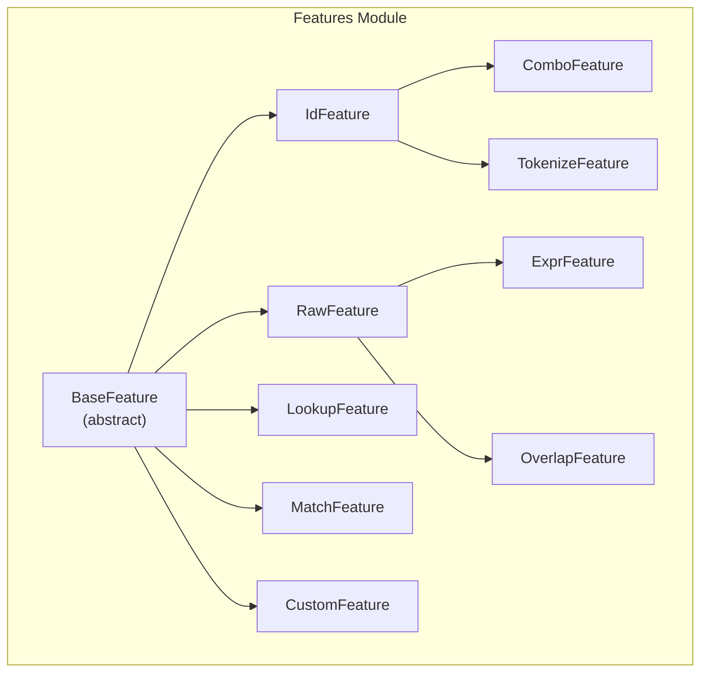
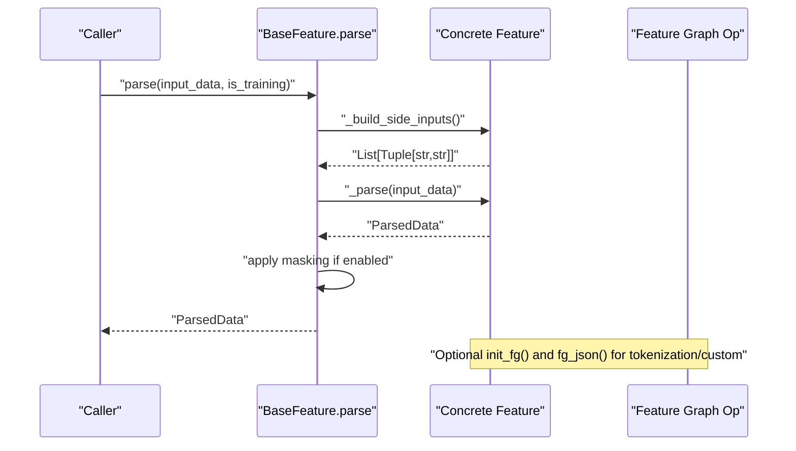
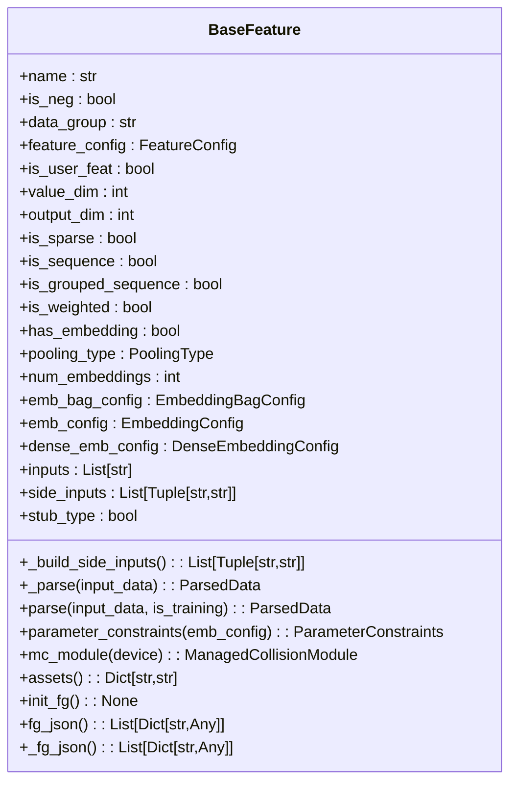
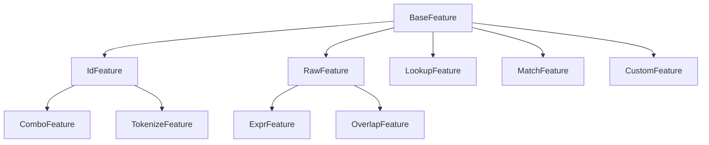

# Feature Processing Classes

<cite>
**Referenced Files in This Document**
- [feature.py](file://tzrec/features/feature.py)
- [id_feature.py](file://tzrec/features/id_feature.py)
- [raw_feature.py](file://tzrec/features/raw_feature.py)
- [combo_feature.py](file://tzrec/features/combo_feature.py)
- [expr_feature.py](file://tzrec/features/expr_feature.py)
- [lookup_feature.py](file://tzrec/features/lookup_feature.py)
- [match_feature.py](file://tzrec/features/match_feature.py)
- [overlap_feature.py](file://tzrec/features/overlap_feature.py)
- [tokenize_feature.py](file://tzrec/features/tokenize_feature.py)
- [custom_feature.py](file://tzrec/features/custom_feature.py)
- [feature.proto](file://tzrec/protos/feature.proto)
</cite>

## Table of Contents

1. [Introduction](#introduction)
1. [Project Structure](#project-structure)
1. [Core Components](#core-components)
1. [Architecture Overview](#architecture-overview)
1. [Detailed Component Analysis](#detailed-component-analysis)
1. [Dependency Analysis](#dependency-analysis)
1. [Performance Considerations](#performance-considerations)
1. [Troubleshooting Guide](#troubleshooting-guide)
1. [Conclusion](#conclusion)

## Introduction

This document provides comprehensive API documentation for TorchEasyRec’s feature processing classes. It focuses on the BaseFeature abstract class and its concrete implementations for transforming raw inputs into embeddings suitable for downstream ranking or retrieval models. The coverage includes method interfaces, configuration schemas, normalization and sequence handling, usage patterns, and debugging capabilities.

## Project Structure

The feature processing subsystem resides under tzrec/features and is defined by a shared base class and specialized subclasses. Protobuf schemas define feature configurations and constraints.

**Diagram sources**

- \[feature.py\](file://tzrec/features/feature.py#L375-L800)
- \[id_feature.py\](file://tzrec/features/id_feature.py#L22-L141)
- \[raw_feature.py\](file://tzrec/features/raw_feature.py#L20-L100)
- \[combo_feature.py\](file://tzrec/features/combo_feature.py#L24-L107)
- \[expr_feature.py\](file://tzrec/features/expr_feature.py#L21-L73)
- \[lookup_feature.py\](file://tzrec/features/lookup_feature.py#L24-L205)
- \[match_feature.py\](file://tzrec/features/match_feature.py#L24-L190)
- \[overlap_feature.py\](file://tzrec/features/overlap_feature.py#L21-L83)
- \[tokenize_feature.py\](file://tzrec/features/tokenize_feature.py#L30-L162)
- \[custom_feature.py\](file://tzrec/features/custom_feature.py#L28-L195)

**Section sources**

- \[feature.py\](file://tzrec/features/feature.py#L375-L800)
- \[feature.proto\](file://tzrec/protos/feature.proto#L112-L957)

## Core Components

This section documents the BaseFeature abstract class and its core interfaces, followed by each concrete feature implementation.

### BaseFeature (abstract)

BaseFeature defines the contract for all feature processors. It encapsulates configuration parsing, input resolution, embedding configuration construction, and feature graph (FG) JSON generation.

Key interfaces and properties:

- Constructor parameters:
  - feature_config: FeatureConfig
  - fg_mode: FgMode
  - fg_encoded_multival_sep: Optional[str]
  - is_sequence: bool
  - sequence_name: Optional[str]
  - sequence_delim: Optional[str]
  - sequence_length: Optional[int]
  - sequence_pk: Optional[str]
- Properties:
  - name: str
  - is_neg: bool
  - data_group: str
  - feature_config: FeatureConfig
  - is_user_feat: bool
  - value_dim: int (abstract)
  - output_dim: int (abstract)
  - is_sparse: bool
  - is_sequence: bool
  - is_grouped_sequence: bool
  - is_weighted: bool
  - has_embedding: bool
  - pooling_type: PoolingType
  - num_embeddings: int (abstract)
  - emb_bag_config: Optional[EmbeddingBagConfig]
  - emb_config: Optional[EmbeddingConfig]
  - dense_emb_config: Optional[DenseEmbeddingConfig]
  - inputs: List[str]
  - side_inputs: List\[Tuple[str, str]\]
  - stub_type: bool
- Methods:
  - \_build_side_inputs(): Optional\[List\[Tuple[str, str]\]\] (abstract)
  - \_parse(input_data: Dict[str, pa.Array]) -> ParsedData (abstract)
  - parse(input_data: Dict[str, pa.Array], is_training: bool = False) -> ParsedData
  - parameter_constraints(emb_config: Optional[BaseEmbeddingConfig]) -> Optional[ParameterConstraints]
  - mc_module(device: torch.device) -> Optional[ManagedCollisionModule]
  - assets() -> Dict[str, str] (optional override)
  - init_fg() -> None (optional override)
  - fg_json() -> List\[Dict[str, Any]\] (optional override)
  - \_fg_json() -> List\[Dict[str, Any]\] (abstract)

Notes:

- BaseFeature integrates with PyArrow for parsing and with TorchRec embedding configs.
- It supports both sparse and dense embeddings, including managed collision hashing and dynamic embeddings.
- Sequence features are supported via grouped sequences and per-feature sequence flags.

**Section sources**

- \[feature.py\](file://tzrec/features/feature.py#L375-L800)
- \[feature.proto\](file://tzrec/protos/feature.proto#L6-L13)

### IdFeature

Purpose: Discrete categorical embeddings for ID-like features.

Key properties and methods:

- value_dim: int
  - Returns configured value_dim or 1 for sequences, else 0.
- output_dim: int
  - Returns embedding_dim.
- is_sparse: bool
  - Always True for IdFeature.
- num_embeddings: int
  - Determined by zch, dynamicemb, hash_bucket_size, num_buckets, vocab_list/dict, vocab_file, or raises error otherwise.
- \_build_side_inputs(): Optional\[List\[Tuple[str, str]\]\]
  - Uses expression if present.
- \_fg_json(): List\[Dict[str, Any]\]
  - Emits id_feature with default_value, expression, value_type, separator, hash_bucket_size/vocab\_\* entries, weighted flag, value_dim, fg_value_type, stub_type, and sequence_fields.
- assets(): Dict[str, str]
  - Returns vocab_file if present.

Configuration highlights (subset):

- feature_name, embedding_name, embedding_dim, hash_bucket_size, num_buckets, vocab_list, vocab_dict, value_dim, pooling, default_value, separator, weighted, init_fn, use_mask, zch, vocab_file, asset_dir, dynamicemb, fg_encoded_default_value, default_bucketize_value, fg_value_type, trainable, stub_type, data_type, embedding_constraints, sequence_length, sequence_delim, sequence_fields.

Usage pattern:

- Single-field categorical ID with optional weighting and bucketization.
- Supports grouped sequences via sequence_fields.

**Section sources**

- \[id_feature.py\](file://tzrec/features/id_feature.py#L22-L141)
- \[feature.proto\](file://tzrec/protos/feature.proto#L112-L180)

### RawFeature

Purpose: Continuous numerical features with optional binning and dense embeddings.

Key properties and methods:

- value_dim: int
  - Returns configured value_dim or 1.
- output_dim: int
  - Returns embedding_dim if has_embedding else value_dim.
- is_sparse: bool
  - True when boundaries are provided; otherwise False.
- num_embeddings: int
  - Boundaries + 1.
- \_dense_emb_type: Optional[str]
  - Returns autodis or mlp if configured and not sequence.
- \_build_side_inputs(): Optional\[List\[Tuple[str, str]\]\]
  - Uses expression if present.
- \_fg_json(): List\[Dict[str, Any]\]
  - Emits raw_feature with default_value, expression, value_type, value_dim, separator, normalizer, boundaries, stub_type, and sequence_fields.

Configuration highlights (subset):

- feature_name, embedding_name, embedding_dim, boundaries, value_dim, normalizer, pooling, default_value, separator, init_fn, use_mask, fg_encoded_default_value, trainable, stub_type, data_type, autodis/mlp, embedding_constraints, sequence_length, sequence_delim, sequence_fields.

Usage pattern:

- Numeric features with optional normalization and binning.
- Supports dense embeddings (AutoDis/MLP) for non-sequence features.

**Section sources**

- \[raw_feature.py\](file://tzrec/features/raw_feature.py#L20-L100)
- \[feature.proto\](file://tzrec/protos/feature.proto#L182-L239)

### ComboFeature

Purpose: Feature combinations for cross-product or composite keys.

Key properties and methods:

- Overrides is_neg setter to route data_group to cross-negative.
- num_embeddings: int
  - Similar logic to IdFeature.
- \_build_side_inputs(): Optional\[List\[Tuple[str, str]\]\]
  - Uses expression list if present.
- \_fg_json(): List\[Dict[str, Any]\]
  - Emits combo_feature with default_value, expression list, value_type, separator, hash_bucket_size/vocab\_\*, stub_type, and sequence_fields.

Configuration highlights (subset):

- feature_name, embedding_name, embedding_dim, hash_bucket_size, vocab_list, vocab_dict, value_dim, pooling, default_value, separator, init_fn, use_mask, zch, vocab_file, asset_dir, dynamicemb, fg_encoded_default_value, default_bucketize_value, trainable, stub_type, data_type, embedding_constraints, sequence_length, sequence_delim, sequence_fields.

Usage pattern:

- Combine multiple fields into a single ID feature for embedding.

**Section sources**

- \[combo_feature.py\](file://tzrec/features/combo_feature.py#L24-L107)
- \[feature.proto\](file://tzrec/protos/feature.proto#L241-L301)

### ExprFeature

Purpose: Expression-based features computed from variables.

Key properties and methods:

- Overrides is_neg setter to route data_group to cross-negative.
- \_build_side_inputs(): Optional\[List\[Tuple[str, str]\]\]
  - Uses variables list if present.
- \_fg_json(): List\[Dict[str, Any]\]
  - Emits expr_feature with default_value, expression, variables, value_type, separator, fill_missing, boundaries, value_dim, stub_type, and sequence_fields.

Configuration highlights (subset):

- feature_name, embedding_name, embedding_dim, expression, variables, value_dim, pooling, default_value, separator, init_fn, use_mask, fg_encoded_default_value, trainable, stub_type, data_type, autodis/mlp, embedding_constraints, sequence_length, sequence_delim, sequence_fields.

Usage pattern:

- Compute derived numeric features from existing fields using expressions.

**Section sources**

- \[expr_feature.py\](file://tzrec/features/expr_feature.py#L21-L73)
- \[feature.proto\](file://tzrec/protos/feature.proto#L492-L546)

### LookupFeature

Purpose: Lookup values from a map keyed by another field; supports discrete or dense outputs.

Key properties and methods:

- value_dim: int
  - Returns configured value_dim or 1.
- output_dim: int
  - Returns embedding_dim if has_embedding else max(value_dim, 1).
- is_sparse: bool
  - True if zch/dynamicemb/hash_bucket_size/num_buckets/vocab_list/dict/vocab_file/boundaries configured.
- num_embeddings: int
  - Similar logic to IdFeature; falls back to boundaries + 1.
- \_dense_emb_type: Optional[str]
  - Returns autodis or mlp if configured.
- \_build_side_inputs(): Optional\[List\[Tuple[str, str]\]\]
  - Uses map and key if present.
- \_fg_json(): List\[Dict[str, Any]\]
  - Emits lookup_feature with map, key, default_value, value_type, needDiscrete, needKey, combiner, separator/normalizer/hash_bucket_size/num_buckets/vocab\_\*/boundaries, fg_value_type, stub_type, and sequence_fields.
  - For multi-dimensional values (>1), generates a stub raw_feature to parse values and re-expresses the lookup feature accordingly.

Configuration highlights (subset):

- feature_name, embedding_name, embedding_dim, map, key, combiner, value_dim, value_separator, need_discrete, need_key, boundaries, normalizer, pooling, default_value, separator, init_fn, use_mask, zch, vocab_file, asset_dir, dynamicemb, fg_encoded_default_value, default_bucketize_value, fg_value_type, trainable, stub_type, data_type, autodis/mlp, embedding_constraints, sequence_length, sequence_delim, sequence_fields.

Usage pattern:

- Retrieve numeric or discrete values from a map keyed by another field; supports normalization and binning.

**Section sources**

- \[lookup_feature.py\](file://tzrec/features/lookup_feature.py#L24-L205)
- \[feature.proto\](file://tzrec/protos/feature.proto#L303-L396)

### MatchFeature

Purpose: Candidate generation and matching against nested maps with optional wildcard keys.

Key properties and methods:

- Constructor initializes wildcard flags for pkey/skey.
- value_dim: int
  - Returns configured value_dim or 1.
- output_dim: int
  - Returns embedding_dim if has_embedding else 1.
- is_sparse: bool
  - True if zch/dynamicemb/hash_bucket_size/num_buckets/vocab_list/dict/vocab_file/boundaries configured.
- num_embeddings: int
  - Similar logic to IdFeature; falls back to boundaries + 1.
- \_dense_emb_type: Optional[str]
  - Returns autodis or mlp if configured.
- \_build_side_inputs(): Optional\[List\[Tuple[str, str]\]\]
  - Uses nested_map, pkey, skey; ignores "ALL".
- \_fg_json(): List\[Dict[str, Any]\]
  - Emits match_feature with nested_map, pkey, skey, matchType ("hit" or "multihit"), default_value, value_type, needDiscrete, show_pkey, show_skey, separator/normalizer/hash_bucket_size/num_buckets/vocab\_\*/boundaries, fg_value_type, stub_type, and sequence_fields.

Configuration highlights (subset):

- feature_name, embedding_name, embedding_dim, nested_map, pkey, skey, need_discrete, show_pkey, show_skey, boundaries, normalizer, pooling, default_value, separator, init_fn, use_mask, zch, vocab_file, asset_dir, dynamicemb, fg_encoded_default_value, default_bucketize_value, fg_value_type, trainable, stub_type, data_type, autodis/mlp, embedding_constraints, sequence_length, sequence_delim, sequence_fields.

Usage pattern:

- Match hierarchical categories/brands against user contexts; supports wildcard matching.

**Section sources**

- \[match_feature.py\](file://tzrec/features/match_feature.py#L24-L190)
- \[feature.proto\](file://tzrec/protos/feature.proto#L398-L490)

### OverlapFeature

Purpose: Set operation features between two text sequences.

Key properties and methods:

- value_dim: int
  - Fixed at 1.
- output_dim: int
  - Returns embedding_dim if has_embedding else 1.
- \_build_side_inputs(): Optional\[List\[Tuple[str, str]\]\]
  - Uses query and title fields.
- \_fg_json(): List\[Dict[str, Any]\]
  - Emits overlap_feature with query, title, method, value_type, separator, normalizer, boundaries, stub_type, and sequence_fields.

Configuration highlights (subset):

- feature_name, embedding_name, embedding_dim, query, title, method, boundaries, normalizer, pooling, default_value, separator, init_fn, use_mask, fg_encoded_default_value, trainable, stub_type, data_type, autodis/mlp, embedding_constraints, sequence_length, sequence_delim, sequence_fields.

Usage pattern:

- Compute overlap ratios or containment indicators between query and title.

**Section sources**

- \[overlap_feature.py\](file://tzrec/features/overlap_feature.py#L21-L83)
- \[feature.proto\](file://tzrec/protos/feature.proto#L548-L606)

### TokenizeFeature

Purpose: Text tokenization with optional text normalization.

Key properties and methods:

- Inherits from IdFeature.
- num_embeddings: int
  - Requires vocab_file; resolves via FG op to get vocab_size.
- value_dim: int
  - Fixed at 0 (sequence of token IDs).
- vocab_file: str
  - Resolves asset_dir if present.
- stop_char_file: str
  - Resolves asset_dir if present.
- init_fg(): None
  - Initializes FG and creates tokenizer op from fg_json().
- \_fg_json(): List\[Dict[str, Any]\]
  - Optionally emits a text_normalizer stub feature, then a tokenize_feature with vocab_file, tokenizer_type, output_type, output_delim, and sequence_fields.
- assets(): Dict[str, str]
  - Returns vocab_file and optional stop_char_file.

Configuration highlights (subset):

- feature_name, embedding_name, embedding_dim, expression, text_normalizer (max_length, stop_char_file, norm_options), vocab_file, asset_dir, pooling, default_value, tokenizer_type, init_fn, use_mask, fg_encoded_default_value, trainable, stub_type, data_type, embedding_constraints, sequence_length, sequence_delim, sequence_fields.

Usage pattern:

- Tokenize text fields using BPE or SentencePiece; optionally apply normalization.

**Section sources**

- \[tokenize_feature.py\](file://tzrec/features/tokenize_feature.py#L30-L162)
- \[feature.proto\](file://tzrec/protos/feature.proto#L635-L681)

### CustomFeature

Purpose: Custom operator features with pluggable libraries.

Key properties and methods:

- value_dim: int
  - Returns configured value_dim or 1.
- output_dim: int
  - Returns embedding_dim if has_embedding else max(value_dim, 1).
- is_sparse: bool
  - True if zch/dynamicemb/hash_bucket_size/num_buckets/vocab_list/dict/vocab_file/boundaries configured.
- num_embeddings: int
  - Similar logic to IdFeature; falls back to boundaries + 1.
- \_dense_emb_type: Optional[str]
  - Returns autodis or mlp if configured.
- \_build_side_inputs(): Optional\[List\[Tuple[str, str]\]\]
  - Uses expression list if present.
- fg_json(): List\[Dict[str, Any]\]
  - Emits custom_feature with operator_name, operator_lib_file, is_op_thread_safe, expression list, operator_params, default_value, separator/normalizer/hash_bucket_size/num_buckets/vocab\_\*/boundaries, value_dim, stub_type, and sequence_fields.
- operator_lib_file: str
  - Resolves pyfg/lib path and asset_dir if present.
- assets(): Dict[str, str]
  - Returns operator_lib_file.

Configuration highlights (subset):

- feature_name, operator_name, operator_lib_file, operator_params, is_op_thread_safe, expression, embedding_name, embedding_dim, boundaries, normalizer, pooling, default_value, separator, init_fn, use_mask, zch, vocab_file, asset_dir, dynamicemb, fg_encoded_default_value, default_bucketize_value, trainable, stub_type, data_type, autodis/mlp, embedding_constraints, sequence_length, sequence_delim, sequence_fields.

Usage pattern:

- Apply custom operators via shared libraries; supports normalization and binning.

**Section sources**

- \[custom_feature.py\](file://tzrec/features/custom_feature.py#L28-L195)
- \[feature.proto\](file://tzrec/protos/feature.proto#L744-L828)

## Architecture Overview

The feature processing pipeline transforms raw inputs into embeddings through a series of steps:

- Resolve side inputs and grouped sequences.
- Parse inputs using PyArrow-backed parsers.
- Build embedding configurations (sparse or dense).
- Optionally initialize FG ops for tokenization or custom operators.
- Emit feature graph JSON for downstream compilation.

**Diagram sources**

- \[feature.py\](file://tzrec/features/feature.py#L788-L800)
- \[tokenize_feature.py\](file://tzrec/features/tokenize_feature.py#L88-L95)
- \[custom_feature.py\](file://tzrec/features/custom_feature.py#L114-L169)

## Detailed Component Analysis

### BaseFeature Class Diagram

**Diagram sources**

- \[feature.py\](file://tzrec/features/feature.py#L375-L800)

### Feature Configuration Schemas

Below are the key configuration fields for each feature type. These fields are defined in the protobuf schema and influence runtime behavior and embedding configuration.

- IdFeature

  - Required: feature_name, expression, embedding_dim
  - Optional: embedding_name, hash_bucket_size, num_buckets, vocab_list, vocab_dict, value_dim, pooling, default_value, separator, weighted, init_fn, use_mask, zch, vocab_file, asset_dir, dynamicemb, fg_encoded_default_value, default_bucketize_value, fg_value_type, trainable, stub_type, data_type, embedding_constraints, sequence_length, sequence_delim, sequence_fields

- RawFeature

  - Required: feature_name, expression
  - Optional: embedding_name, embedding_dim, boundaries, value_dim, normalizer, pooling, default_value, separator, init_fn, use_mask, fg_encoded_default_value, trainable, stub_type, data_type, autodis/mlp, embedding_constraints, sequence_length, sequence_delim, sequence_fields

- ComboFeature

  - Required: feature_name, expression[]
  - Optional: embedding_name, embedding_dim, hash_bucket_size, vocab_list, vocab_dict, value_dim, pooling, default_value, separator, init_fn, use_mask, zch, vocab_file, asset_dir, dynamicemb, fg_encoded_default_value, default_bucketize_value, trainable, stub_type, data_type, embedding_constraints, sequence_length, sequence_delim, sequence_fields

- LookupFeature

  - Required: feature_name, map, key
  - Optional: embedding_name, embedding_dim, boundaries, hash_bucket_size, num_buckets, vocab_list, vocab_dict, pooling, combiner, default_value, separator, need_discrete, need_key, normalizer, init_fn, value_dim, value_separator, use_mask, zch, vocab_file, asset_dir, dynamicemb, fg_encoded_default_value, default_bucketize_value, fg_value_type, trainable, stub_type, data_type, autodis/mlp, embedding_constraints, sequence_length, sequence_delim, sequence_fields

- MatchFeature

  - Required: feature_name, nested_map, pkey, skey
  - Optional: embedding_name, embedding_dim, boundaries, hash_bucket_size, num_buckets, vocab_list, vocab_dict, pooling, default_value, separator, need_discrete, show_pkey, show_skey, normalizer, init_fn, value_dim, use_mask, zch, vocab_file, asset_dir, dynamicemb, fg_encoded_default_value, default_bucketize_value, fg_value_type, trainable, stub_type, data_type, autodis/mlp, embedding_constraints, sequence_length, sequence_delim, sequence_fields

- ExprFeature

  - Required: feature_name, expression, variables[]
  - Optional: embedding_name, embedding_dim, boundaries, value_dim, pooling, default_value, separator, init_fn, use_mask, fill_missing, fg_encoded_default_value, trainable, stub_type, data_type, autodis/mlp, embedding_constraints, sequence_length, sequence_delim, sequence_fields

- OverlapFeature

  - Required: feature_name, query, title, method
  - Optional: embedding_name, embedding_dim, boundaries, normalizer, pooling, default_value, separator, init_fn, use_mask, fg_encoded_default_value, trainable, stub_type, data_type, autodis/mlp, embedding_constraints, sequence_length, sequence_delim, sequence_fields

- TokenizeFeature

  - Required: feature_name, expression, vocab_file, embedding_dim, tokenizer_type
  - Optional: embedding_name, text_normalizer, asset_dir, pooling, default_value, init_fn, use_mask, fg_encoded_default_value, trainable, stub_type, data_type, embedding_constraints, sequence_length, sequence_delim, sequence_fields

- CustomFeature

  - Required: feature_name, operator_name, operator_lib_file, expression[]
  - Optional: embedding_name, embedding_dim, boundaries, hash_bucket_size, num_buckets, vocab_list, vocab_dict, pooling, default_value, separator, normalizer, init_fn, use_mask, zch, vocab_file, asset_dir, dynamicemb, fg_encoded_default_value, default_bucketize_value, trainable, stub_type, data_type, autodis/mlp, embedding_constraints, sequence_length, sequence_delim, sequence_fields

**Section sources**

- \[feature.proto\](file://tzrec/protos/feature.proto#L112-L957)

### Normalization Options

Normalization is supported for several features via the normalizer field. Supported methods include log10, zscore, minmax, and expression-based transformations. These are applied during feature graph preprocessing.

- RawFeature, LookupFeature, MatchFeature, ExprFeature, OverlapFeature, CustomFeature support normalizer.
- TokenizeFeature applies text normalization via TextNormalizer.

**Section sources**

- \[feature.proto\](file://tzrec/protos/feature.proto#L195-L200)
- \[feature.proto\](file://tzrec/protos/feature.proto#L337-L342)
- \[feature.proto\](file://tzrec/protos/feature.proto#L436-L441)
- \[feature.proto\](file://tzrec/protos/feature.proto#L567-L568)
- \[feature.proto\](file://tzrec/protos/feature.proto#L777-L782)
- \[feature.proto\](file://tzrec/protos/feature.proto#L626-L633)

### Sequence Handling

Sequence features are supported both as grouped sequences and per-feature flags:

- Grouped sequences: Defined via SequenceFeature with sequence_name, sequence_length, sequence_delim, and sequence_pk; sub-features use sequence_fields to select inputs.
- Per-feature sequences: Enabled by setting is_sequence and related parameters; value_dim defaults to 1 for sequences in IdFeature.

Key behaviors:

- Grouped sequence prefixing for inputs based on sequence_fields and feature type.
- Sequence-aware side input resolution and embedding configuration.

**Section sources**

- \[feature.proto\](file://tzrec/protos/feature.proto#L898-L957)
- \[feature.py\](file://tzrec/features/feature.py#L425-L438)
- \[id_feature.py\](file://tzrec/features/id_feature.py#L46-L50)
- \[lookup_feature.py\](file://tzrec/features/lookup_feature.py#L187-L192)

### Encoding, Decoding, and Debugging Capabilities

- Encoding:
  - FG JSON emission via \_fg_json() enables downstream compilation and execution.
  - TokenizeFeature and CustomFeature initialize FG ops to resolve vocab sizes and operator libraries.
- Decoding:
  - ParsedData instances carry feature values and lengths for embedding lookup.
  - Sequence features maintain offsets and lengths for ragged tensors.
- Debugging:
  - Assets reporting via assets() helps locate vocab files and operator libraries.
  - Masking and default values aid in diagnosing missing or invalid inputs.

**Section sources**

- \[feature.py\](file://tzrec/features/feature.py#L788-L800)
- \[tokenize_feature.py\](file://tzrec/features/tokenize_feature.py#L156-L162)
- \[custom_feature.py\](file://tzrec/features/custom_feature.py#L190-L195)

## Dependency Analysis

Feature classes inherit from BaseFeature and leverage:

- TorchRec embedding configs for sparse and dense embeddings.
- PyArrow for efficient parsing of sparse, dense, and sequence features.
- Managed Collision Hash (MCH) modules for sparse embeddings with eviction policies.
- Dynamic embedding support for adaptive capacity.

**Diagram sources**

- \[feature.py\](file://tzrec/features/feature.py#L375-L800)
- \[id_feature.py\](file://tzrec/features/id_feature.py#L22-L141)
- \[raw_feature.py\](file://tzrec/features/raw_feature.py#L20-L100)
- \[combo_feature.py\](file://tzrec/features/combo_feature.py#L24-L107)
- \[expr_feature.py\](file://tzrec/features/expr_feature.py#L21-L73)
- \[lookup_feature.py\](file://tzrec/features/lookup_feature.py#L24-L205)
- \[match_feature.py\](file://tzrec/features/match_feature.py#L24-L190)
- \[overlap_feature.py\](file://tzrec/features/overlap_feature.py#L21-L83)
- \[tokenize_feature.py\](file://tzrec/features/tokenize_feature.py#L30-L162)
- \[custom_feature.py\](file://tzrec/features/custom_feature.py#L28-L195)

**Section sources**

- \[feature.py\](file://tzrec/features/feature.py#L354-L367)

## Performance Considerations

- Prefer sparse embeddings for high-cardinality categorical features to reduce memory footprint.
- Use boundary-based binning for RawFeature to cap embedding sizes while preserving signal.
- Enable managed collision hashing for sparse embeddings with large vocabularies to improve eviction efficiency.
- For TokenizeFeature, pre-compute vocab sizes and avoid frequent re-initialization of FG ops.
- Sequence features require careful handling of offsets and lengths; ensure consistent sequence_delim and sequence_length.

## Troubleshooting Guide

Common issues and resolutions:

- Missing vocabulary or bucket size:
  - IdFeature, ComboFeature, LookupFeature, MatchFeature require explicit vocabulary or bucket configuration; otherwise, errors are raised during num_embeddings computation.
- Masking and default values:
  - When use_mask is enabled, fg_encoded_default_value must be provided for FG_NONE mode to handle nulls.
- Sequence mismatches:
  - Ensure sequence_fields align with grouped sequence inputs; verify sequence_delim and sequence_length.
- Operator and tokenizer libraries:
  - Verify operator_lib_file path resolution and vocab_file presence for TokenizeFeature.

**Section sources**

- \[id_feature.py\](file://tzrec/features/id_feature.py#L82-L87)
- \[lookup_feature.py\](file://tzrec/features/lookup_feature.py#L95-L99)
- \[match_feature.py\](file://tzrec/features/match_feature.py#L97-L99)
- \[feature.py\](file://tzrec/features/feature.py#L453-L458)
- \[tokenize_feature.py\](file://tzrec/features/tokenize_feature.py#L53-L56)

## Conclusion

TorchEasyRec’s feature processing framework provides a robust, extensible foundation for transforming heterogeneous inputs into embeddings. BaseFeature centralizes parsing, configuration, and embedding setup, while specialized features address common use cases: categorical IDs, continuous numerics, combinations, lookups, matches, overlaps, tokenization, and custom operators. Proper configuration of normalization, sequences, and embeddings ensures efficient and accurate model training and inference.
