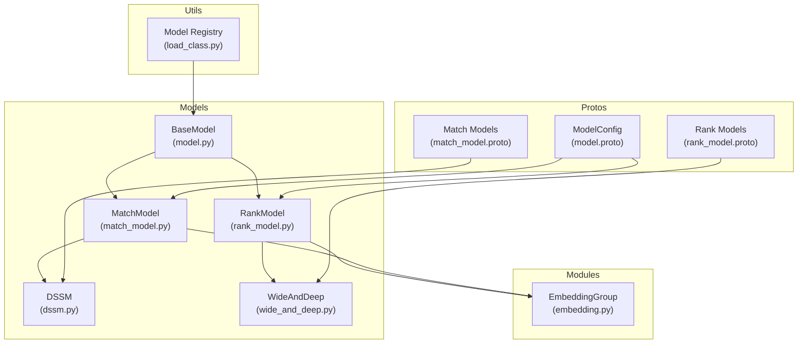
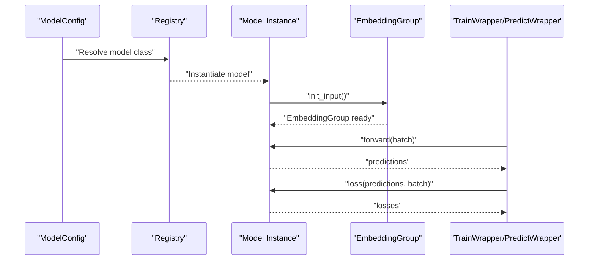
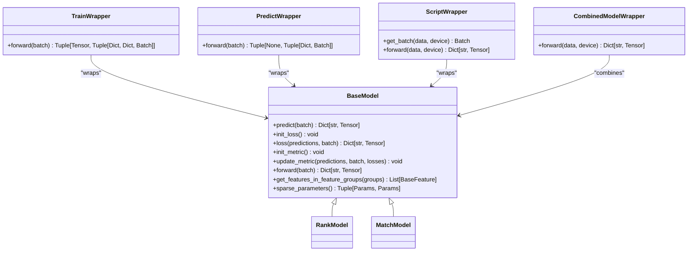
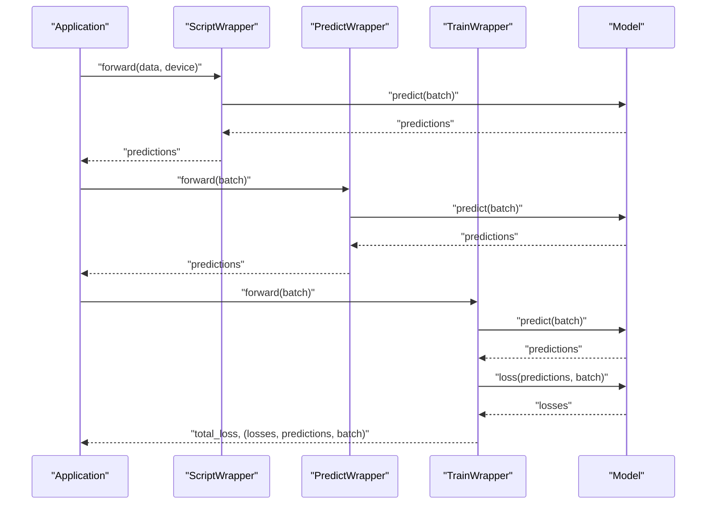
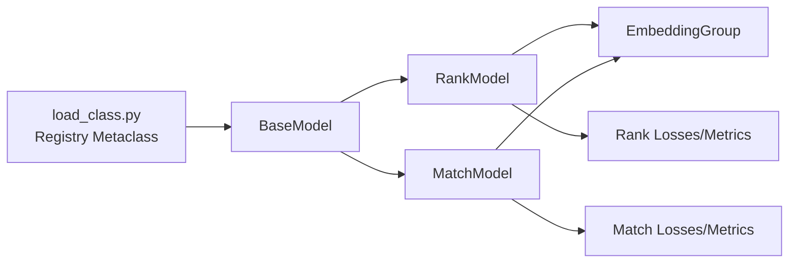

# Model Classes and Architecture

<cite>
**Referenced Files in This Document**
- [model.py](file://tzrec/models/model.py)
- [rank_model.py](file://tzrec/models/rank_model.py)
- [match_model.py](file://tzrec/models/match_model.py)
- [load_class.py](file://tzrec/utils/load_class.py)
- [model.proto](file://tzrec/protos/model.proto)
- [rank_model.proto](file://tzrec/protos/models/rank_model.proto)
- [match_model.proto](file://tzrec/protos/models/match_model.proto)
- [embedding.py](file://tzrec/modules/embedding.py)
- [dssm.py](file://tzrec/models/dssm.py)
- [wide_and_deep.py](file://tzrec/models/wide_and_deep.py)
</cite>

## Table of Contents

1. [Introduction](#introduction)
1. [Project Structure](#project-structure)
1. [Core Components](#core-components)
1. [Architecture Overview](#architecture-overview)
1. [Detailed Component Analysis](#detailed-component-analysis)
1. [Dependency Analysis](#dependency-analysis)
1. [Performance Considerations](#performance-considerations)
1. [Troubleshooting Guide](#troubleshooting-guide)
1. [Conclusion](#conclusion)
1. [Appendices](#appendices)

## Introduction

This document provides comprehensive API documentation for TorchEasyRec’s model classes and architecture. It focuses on the base model abstractions, the factory pattern and model registration system, the RankModel and MatchModel subclasses, their interfaces, forward passes, and loss computation. It also covers ModelConfig protobuf integration, initialization patterns, and serialization-related wrappers. Usage examples demonstrate model instantiation, configuration, and integration with training pipelines. Finally, it addresses checkpointing, state management, and performance optimization techniques.

## Project Structure

The model layer is organized around a base class hierarchy and a set of concrete models. Protobuf definitions describe configuration structures. A registration mechanism enables dynamic model creation from configuration.

**Diagram sources**

- \[model.py\](file://tzrec/models/model.py#L39-L423)
- \[rank_model.py\](file://tzrec/models/rank_model.py#L56-L513)
- \[match_model.py\](file://tzrec/models/match_model.py#L225-L500)
- \[dssm.py\](file://tzrec/models/dssm.py#L86-L156)
- \[wide_and_deep.py\](file://tzrec/models/wide_and_deep.py#L25-L89)
- \[model.proto\](file://tzrec/protos/model.proto#L40-L90)
- \[rank_model.proto\](file://tzrec/protos/models/rank_model.proto#L8-L80)
- \[match_model.proto\](file://tzrec/protos/models/match_model.proto#L9-L81)
- \[embedding.py\](file://tzrec/modules/embedding.py#L139-L200)
- \[load_class.py\](file://tzrec/utils/load_class.py#L117-L145)

**Section sources**

- \[model.py\](file://tzrec/models/model.py#L39-L423)
- \[model.proto\](file://tzrec/protos/model.proto#L40-L90)

## Core Components

- BaseModel: Defines the abstract interface for models, including predict, init_loss, loss, init_metric, update_metric, and forward. Provides helpers for selecting features by groups, sparse parameter separation, and shared loss/metric bookkeeping.
- RankModel: Extends BaseModel for ranking tasks. Implements input building via EmbeddingGroup, prediction conversion to logits/probabilities depending on loss type, and multi-loss/multi-metric initialization and updates.
- MatchModel: Extends BaseModel for matching tasks. Implements similarity computation (inner product or with sampler), cross-entropy loss for matching, and recall@K metrics.
- Wrappers: TrainWrapper, PredictWrapper, ScriptWrapper, CombinedModelWrapper encapsulate training/inference loops and JIT scripting for production deployment.

Key APIs:

- BaseModel.forward(batch) -> Dict[str, Tensor]
- BaseModel.predict(batch) -> Dict[str, Tensor] (abstract)
- BaseModel.init_loss() -> None (abstract)
- BaseModel.loss(predictions, batch) -> Dict[str, Tensor] (abstract)
- BaseModel.init_metric() -> None (abstract)
- BaseModel.update_metric(predictions, batch, losses) -> None (abstract)
- RankModel.build_input(batch) -> Dict[str, Tensor]
- RankModel.\_output_to_prediction(output, suffix="") -> Dict[str, Tensor]
- MatchModel.sim(user_emb, item_emb, hard_neg_indices) -> Tensor
- MatchModel.predict(batch) -> Dict[str, Tensor] (matching-specific)

**Section sources**

- \[model.py\](file://tzrec/models/model.py#L39-L423)
- \[rank_model.py\](file://tzrec/models/rank_model.py#L56-L513)
- \[match_model.py\](file://tzrec/models/match_model.py#L225-L500)

## Architecture Overview

The architecture follows a layered design:

- Configuration layer: ModelConfig and model-specific protos define model structure, feature groups, losses, metrics, and optional variational dropout.
- Model layer: BaseModel and subclasses implement the computation graph and training/inference logic.
- Feature embedding layer: EmbeddingGroup builds per-group embeddings and supports optional variational dropout per group.
- Pipeline layer: Wrappers orchestrate training and inference, including mixed precision and JIT scripting.

**Diagram sources**

- \[model.proto\](file://tzrec/protos/model.proto#L40-L90)
- \[load_class.py\](file://tzrec/utils/load_class.py#L117-L145)
- \[model.py\](file://tzrec/models/model.py#L222-L346)
- \[embedding.py\](file://tzrec/modules/embedding.py#L139-L200)

## Detailed Component Analysis

### BaseModel and Factory Pattern

BaseModel defines the contract and shared utilities:

- Abstract methods: predict, init_loss, loss, init_metric, update_metric.
- Shared helpers: forward delegates to predict, get_features_in_feature_groups, sparse_parameters, and loss/metric bookkeeping helpers.
- Registration: A metaclass registers all model subclasses into a global map for dynamic instantiation.

Factory and registration:

- get_register_class_meta creates a metaclass that registers subclasses into a class map.
- create_class(name) retrieves a registered class by name.

**Diagram sources**

- \[model.py\](file://tzrec/models/model.py#L39-L423)

**Section sources**

- \[model.py\](file://tzrec/models/model.py#L39-L423)
- \[load_class.py\](file://tzrec/utils/load_class.py#L117-L145)

### RankModel

RankModel specializes in classification/regression ranking:

- Input building: EmbeddingGroup and optional group-wise variational dropout.
- Prediction conversion: Converts raw logits to probabilities/logits based on configured loss type.
- Loss computation: Supports BCE, Focal Loss, Softmax CE, JRC, and L2; optionally weighted by sample weights.
- Metrics: AUC, multiclass AUC, MAE, MSE, Accuracy, GroupedAUC, XAUC, GroupedXAUC; includes dedicated loss metrics and decayed training metrics.

Key methods:

- init_input(): Builds EmbeddingGroup and optional variational dropout per group.
- build_input(batch): Returns grouped dense tensors with optional variational dropout losses.
- \_output_to_prediction(output, suffix=""): Produces logits/probs/y depending on loss type.
- init_loss()/loss(): Initializes and computes per-loss values; merges variational dropout losses.
- init_metric()/update_metric()/update_train_metric(): Initializes and updates metrics; supports grouped and decayed variants.

Usage example outline:

- Instantiate a model subclass (e.g., WideAndDeep) with ModelConfig and features.
- Call model.predict(batch) during inference or model.loss(...) during training.
- Use TrainWrapper for training loop orchestration.

**Section sources**

- \[rank_model.py\](file://tzrec/models/rank_model.py#L56-L513)
- \[wide_and_deep.py\](file://tzrec/models/wide_and_deep.py#L25-L89)

### MatchModel

MatchModel specializes in learning user/item embeddings and computing similarities:

- Towers: MatchTower and MatchTowerWoEG implement per-tower embedding extraction with optional variational dropout.
- Similarity: Inner product or sampler-based similarity; supports hard negatives and in-batch negatives.
- Loss: Softmax cross-entropy against constructed labels (arange or zeros depending on sampling strategy).
- Metrics: Recall@K for matching scenarios.

Key methods:

- MatchTower.init_input()/build_input(): Build per-tower embeddings and optional variational dropout losses.
- MatchModel.sim(user_emb, item_emb, hard_neg_indices): Compute similarities.
- MatchModel.predict(batch): Forward user and item towers, compute similarity matrix.
- MatchModel.init_loss()/loss(): Initialize and compute cross-entropy loss; supports sample weights.
- init_metric()/update_metric()/update_train_metric(): Initialize and update recall@K metrics.

Usage example outline:

- Define DSSM/HSTUMatch/MIND configurations in ModelConfig.
- Instantiate DSSM with user and item towers; call model.predict(batch) to get similarity scores.
- Use sampler_type and in_batch_negative flags to configure negative sampling.

**Section sources**

- \[match_model.py\](file://tzrec/models/match_model.py#L110-L500)
- \[dssm.py\](file://tzrec/models/dssm.py#L86-L156)

### ModelConfig Protobuf Integration

ModelConfig is the central configuration:

- Feature groups: Named groups of features with types (DEEP/WIDE/SEQUENCE/JAGGED_SEQUENCE).
- Model selection: oneof model selects a concrete model definition (DLRM, DeepFM, MultiTower, DSSM, etc.).
- num_class: Number of classes for classification tasks.
- losses, metrics, train_metrics: Repeated entries define training objectives and evaluation measures.
- Variational dropout: Optional configuration applied per feature group.
- Kernel: Execution backend selection.
- use_pareto_loss_weight: Enables Pareto-efficient multi-task weighting.

Model-specific protos:

- Rank models: WideAndDeep, DeepFM, MultiTower, MultiTowerDIN, DLRM, MaskNet, DCN, xDeepFM, WuKong.
- Match models: DSSM, HSTUMatch, DSSMV2, TDM, DAT, MIND.

**Section sources**

- \[model.proto\](file://tzrec/protos/model.proto#L40-L90)
- \[rank_model.proto\](file://tzrec/protos/models/rank_model.proto#L8-L80)
- \[match_model.proto\](file://tzrec/protos/models/match_model.proto#L9-L81)

### Embedding Strategies and Initialization Patterns

- EmbeddingGroup: Builds per-group embeddings from features, supports sequence encoders, and validates feature group integrity.
- Variational Dropout: Optional regularization applied per feature group to embedding dimensions.
- Wide & Deep: Wide pathway aggregates per-feature contributions; Deep pathway processes concatenated deep features through MLPs; optional final fusion MLP.

**Section sources**

- \[embedding.py\](file://tzrec/modules/embedding.py#L139-L200)
- \[rank_model.py\](file://tzrec/models/rank_model.py#L84-L132)
- \[wide_and_deep.py\](file://tzrec/models/wide_and_deep.py#L43-L88)

### Serialization and Export Wrappers

- ScriptWrapper: Converts raw input dicts to Batch and runs predict for JIT scripting.
- PredictWrapper: Runs predict and returns CPU-detached predictions; supports output column filtering and target repeat interleaving key preservation.
- TrainWrapper: Runs predict and loss, aggregates total loss, and supports mixed precision and Pareto-efficient multi-task weighting.
- CombinedModelWrapper: Composes sparse and dense parts for hybrid inference.

**Diagram sources**

- \[model.py\](file://tzrec/models/model.py#L222-L346)

**Section sources**

- \[model.py\](file://tzrec/models/model.py#L222-L346)

## Dependency Analysis

- BaseModel depends on BaseModule, DataParser, Batch, BaseFeature, and torchmetrics for metric management.
- RankModel depends on EmbeddingGroup, VariationalDropout, and various loss/metric implementations.
- MatchModel depends on EmbeddingGroup, VariationalDropout, and similarity computation utilities.
- Registry metaclass ensures all model subclasses are discoverable for dynamic instantiation.

**Diagram sources**

- \[load_class.py\](file://tzrec/utils/load_class.py#L117-L145)
- \[model.py\](file://tzrec/models/model.py#L39-L423)
- \[rank_model.py\](file://tzrec/models/rank_model.py#L56-L513)
- \[match_model.py\](file://tzrec/models/match_model.py#L225-L500)
- \[embedding.py\](file://tzrec/modules/embedding.py#L139-L200)

**Section sources**

- \[load_class.py\](file://tzrec/utils/load_class.py#L117-L145)
- \[model.py\](file://tzrec/models/model.py#L39-L423)

## Performance Considerations

- Mixed Precision: TrainWrapper and PredictWrapper support FP16/BF16 autocast for reduced memory and improved throughput.
- Sparse Parameter Separation: BaseModel.sparse_parameters separates trainable/frozen embeddings for efficient optimizer updates.
- Variational Dropout: Optional regularization with per-group losses; can improve generalization at minimal inference cost.
- Kernel Selection: ModelConfig.kernel allows choosing execution backend.
- Pareto Multi-Task Weighting: TrainWrapper conditionally uses Pareto-efficient weighting when enabled by the model.

[No sources needed since this section provides general guidance]

## Troubleshooting Guide

- Unknown model class: Ensure auto_import is called so that register_class is invoked for all model modules. The registry will raise an explicit error if a class is not registered.
- Feature group mismatch: EmbeddingGroup enforces that features within a group belong to a single data group; misconfiguration raises a clear error.
- Unsupported loss/metric: RankModel and MatchModel restrict supported loss/metric types per task; ensure configuration aligns with supported enums.
- Negative sampling flags: MatchModel relies on sampler_type and in_batch_negative; incorrect flags can lead to unexpected label construction.

**Section sources**

- \[load_class.py\](file://tzrec/utils/load_class.py#L53-L100)
- \[embedding.py\](file://tzrec/modules/embedding.py#L190-L195)
- \[rank_model.py\](file://tzrec/models/rank_model.py#L182-L213)
- \[match_model.py\](file://tzrec/models/match_model.py#L265-L301)

## Conclusion

TorchEasyRec’s model layer provides a robust, extensible framework for ranking and matching tasks. The BaseModel abstraction, combined with RankModel and MatchModel specializations, offers a consistent API for training and inference. The protobuf-based configuration and dynamic model registry enable flexible model composition. Wrappers streamline production deployment with JIT scripting and mixed precision. Proper configuration of feature groups, losses, and metrics, along with awareness of sparse parameter handling and negative sampling, ensures reliable and performant models.

[No sources needed since this section summarizes without analyzing specific files]

## Appendices

### API Reference: Method Signatures

- BaseModel.forward(batch: Batch) -> Dict[str, torch.Tensor]
- BaseModel.predict(batch: Batch) -> Dict[str, torch.Tensor] (abstract)
- BaseModel.init_loss() -> None (abstract)
- BaseModel.loss(predictions: Dict[str, torch.Tensor], batch: Batch) -> Dict[str, torch.Tensor] (abstract)
- BaseModel.init_metric() -> None (abstract)
- BaseModel.update_metric(predictions: Dict[str, torch.Tensor], batch: Batch, losses: Optional\[Dict[str, torch.Tensor]\]) -> None (abstract)
- RankModel.build_input(batch: Batch) -> Dict[str, torch.Tensor]
- RankModel.\_output_to_prediction(output: torch.Tensor, suffix: str = "") -> Dict[str, torch.Tensor]
- MatchModel.sim(user_emb: torch.Tensor, item_emb: torch.Tensor, hard_neg_indices: Optional[torch.Tensor]) -> torch.Tensor
- MatchModel.predict(batch: Batch) -> Dict[str, torch.Tensor]

**Section sources**

- \[model.py\](file://tzrec/models/model.py#L181-L183)
- \[rank_model.py\](file://tzrec/models/rank_model.py#L115-L132)
- \[match_model.py\](file://tzrec/models/match_model.py#L253-L263)

### Usage Examples Outline

- Instantiation: Load ModelConfig from proto; auto_import to register models; instantiate via registry create_class or subclass constructor.
- Training: Wrap model with TrainWrapper; iterate batches; call forward to get total_loss and detach predictions/losses for logging.
- Inference: Wrap model with PredictWrapper or ScriptWrapper; convert inputs to Batch or raw dict; run forward and collect predictions.
- Matching: Configure DSSM/HSTUMatch/MIND with user/item towers; set similarity and temperature; call predict to obtain similarity scores.

**Section sources**

- \[load_class.py\](file://tzrec/utils/load_class.py#L53-L100)
- \[model.py\](file://tzrec/models/model.py#L222-L346)
- \[dssm.py\](file://tzrec/models/dssm.py#L86-L156)
- \[wide_and_deep.py\](file://tzrec/models/wide_and_deep.py#L25-L89)
