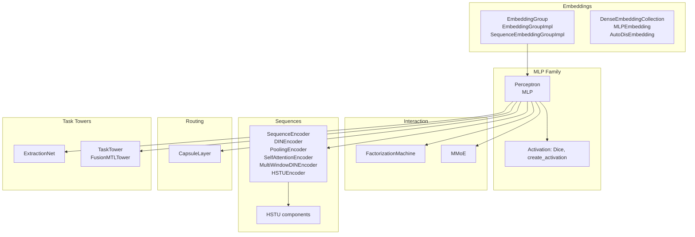
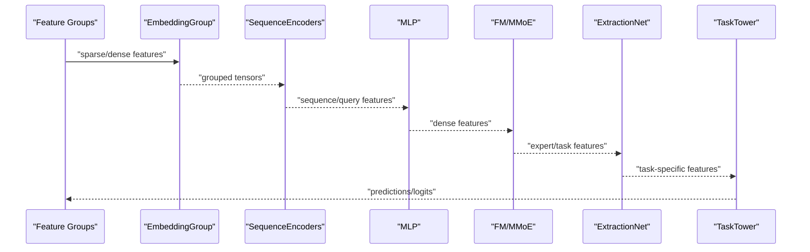
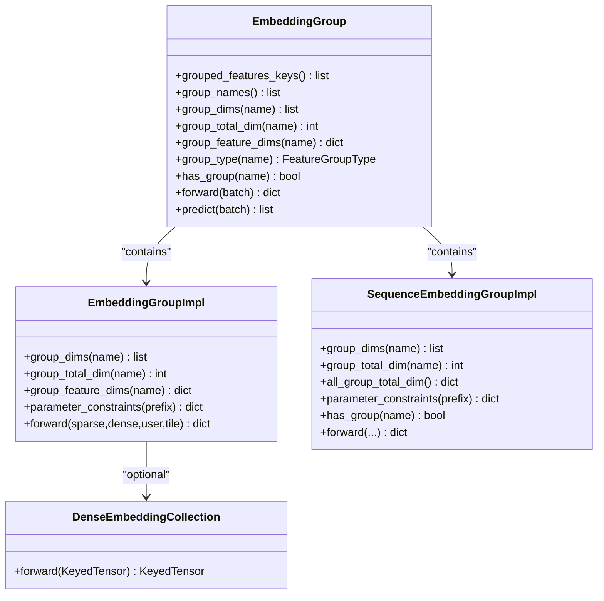
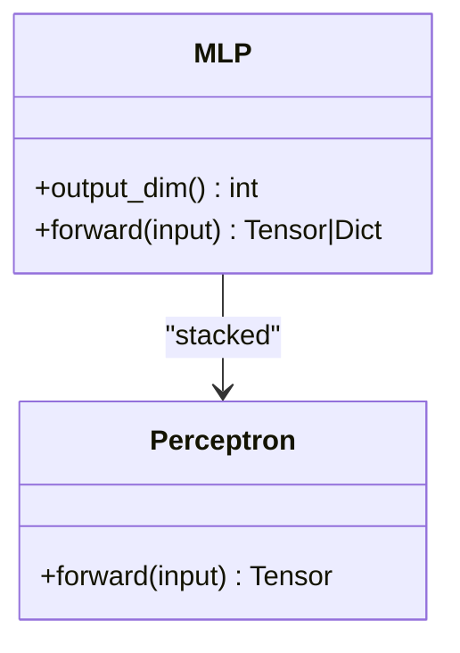
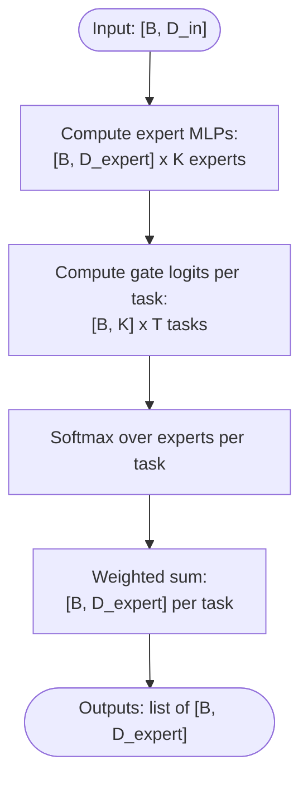
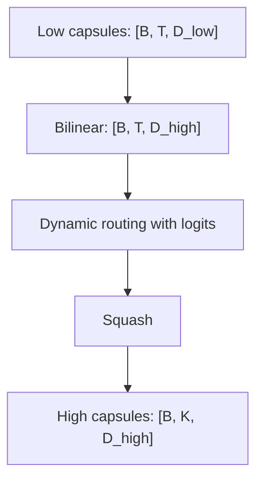
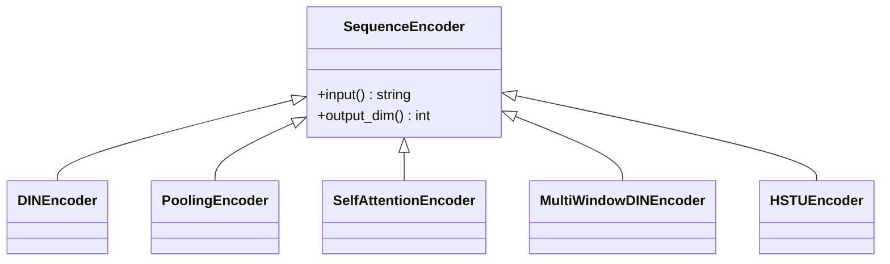
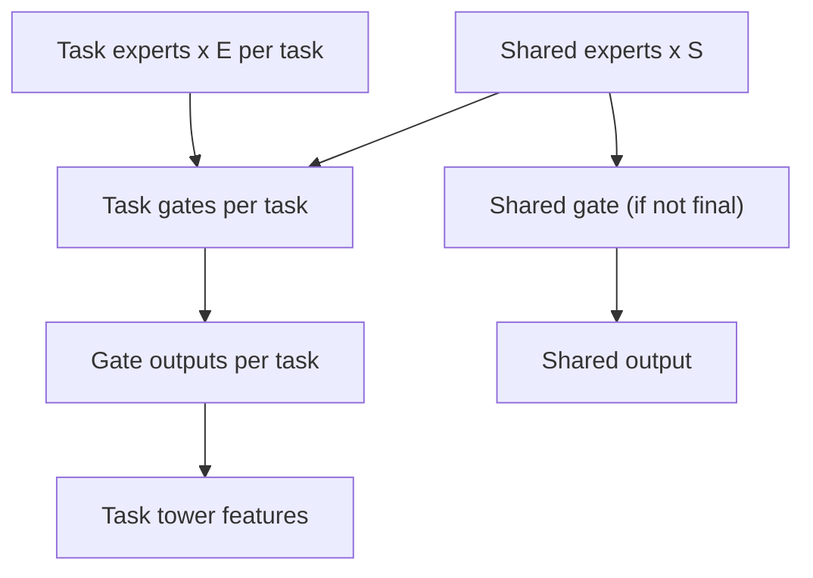
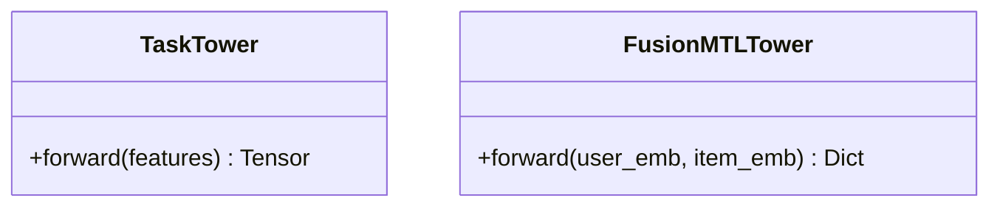
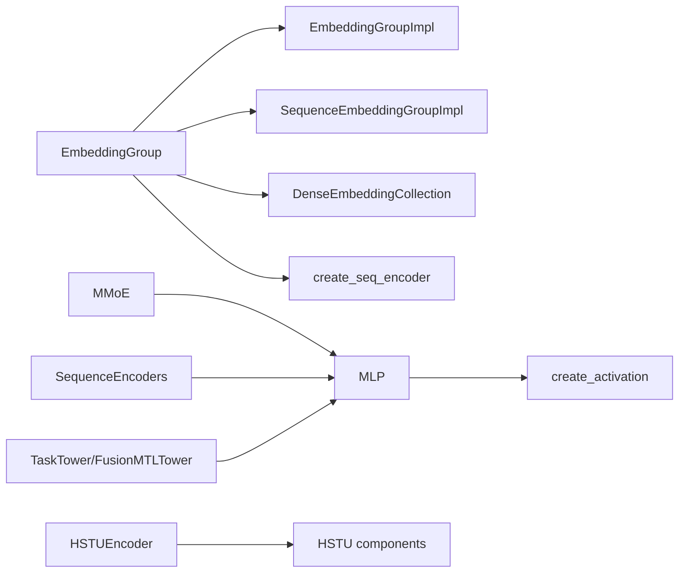

# Neural Network Module Classes

<cite>
**Referenced Files in This Document**
- [embedding.py](file://tzrec/modules/embedding.py)
- [dense_embedding_collection.py](file://tzrec/modules/dense_embedding_collection.py)
- [mlp.py](file://tzrec/modules/mlp.py)
- [fm.py](file://tzrec/modules/fm.py)
- [mmoe.py](file://tzrec/modules/mmoe.py)
- [capsule.py](file://tzrec/modules/capsule.py)
- [sequence.py](file://tzrec/modules/sequence.py)
- [extraction_net.py](file://tzrec/modules/extraction_net.py)
- [task_tower.py](file://tzrec/modules/task_tower.py)
- [activation.py](file://tzrec/modules/activation.py)
- [utils.py](file://tzrec/modules/utils.py)
- [hstu.py](file://tzrec/modules/hstu.py)
</cite>

## Table of Contents

1. [Introduction](#introduction)
1. [Project Structure](#project-structure)
1. [Core Components](#core-components)
1. [Architecture Overview](#architecture-overview)
1. [Detailed Component Analysis](#detailed-component-analysis)
1. [Dependency Analysis](#dependency-analysis)
1. [Performance Considerations](#performance-considerations)
1. [Troubleshooting Guide](#troubleshooting-guide)
1. [Conclusion](#conclusion)

## Introduction

This document provides comprehensive API documentation for TorchEasyRec’s neural network module classes. It focuses on embedding modules for various embedding strategies and collections, MLP modules for multi-layer perceptrons, FM modules for factorization machines, MMOE modules for mixture-of-experts architectures, capsule modules for dynamic routing, sequence modules for temporal modeling, extraction net modules for feature extraction, and task tower modules for multi-task learning. For each module, we describe class hierarchies, constructor parameters, forward method signatures, parameter initialization patterns, configuration options, regularization techniques, optimization settings, usage examples, module composition, gradient flow, and performance optimization techniques.

## Project Structure

The neural network modules reside under the modules directory. They are organized by functionality:

- Embedding and dense embedding collections
- MLP and activation utilities
- Factorization machine
- MMOE and task towers
- Sequence encoders and HSTU
- Capsule routing
- Utilities and base module abstractions

**Diagram sources**

- \[embedding.py\](file://tzrec/modules/embedding.py#L139-L1341)
- \[dense_embedding_collection.py\](file://tzrec/modules/dense_embedding_collection.py#L347-L431)
- \[mlp.py\](file://tzrec/modules/mlp.py#L21-L178)
- \[activation.py\](file://tzrec/modules/activation.py#L22-L95)
- \[fm.py\](file://tzrec/modules/fm.py#L17-L43)
- \[mmoe.py\](file://tzrec/modules/mmoe.py#L21-L78)
- \[sequence.py\](file://tzrec/modules/sequence.py#L54-L605)
- \[hstu.py\](file://tzrec/modules/hstu.py#L22-L200)
- \[capsule.py\](file://tzrec/modules/capsule.py#L65-L232)
- \[extraction_net.py\](file://tzrec/modules/extraction_net.py#L20-L140)
- \[task_tower.py\](file://tzrec/modules/task_tower.py#L21-L94)

**Section sources**

- \[embedding.py\](file://tzrec/modules/embedding.py#L1-L1341)
- \[dense_embedding_collection.py\](file://tzrec/modules/dense_embedding_collection.py#L1-L431)
- \[mlp.py\](file://tzrec/modules/mlp.py#L1-L178)
- \[activation.py\](file://tzrec/modules/activation.py#L1-L95)
- \[fm.py\](file://tzrec/modules/fm.py#L1-L43)
- \[mmoe.py\](file://tzrec/modules/mmoe.py#L1-L78)
- \[sequence.py\](file://tzrec/modules/sequence.py#L1-L605)
- \[hstu.py\](file://tzrec/modules/hstu.py#L1-L200)
- \[capsule.py\](file://tzrec/modules/capsule.py#L1-L232)
- \[extraction_net.py\](file://tzrec/modules/extraction_net.py#L1-L140)
- \[task_tower.py\](file://tzrec/modules/task_tower.py#L1-L94)

## Core Components

This section summarizes the primary modules and their roles.

- EmbeddingGroup and EmbeddingGroupImpl: Build embedding collections for feature groups, supporting sparse, dense, managed collision, and input-tile modes. They compute per-feature output dimensions and total group dimensions, and return grouped tensors keyed by group names.
- SequenceEmbeddingGroupImpl: Handles sequence features with pooling, multi-value sequence lengths, and optional managed collision. Produces query, sequence, and sequence_length tensors per group.
- DenseEmbeddingCollection: Applies dense feature embeddings via MLP or AutoDis strategies, merging configurations with compatible settings.
- MLP and Perceptron: Stacked linear layers with optional batch/layer norm, activations, and dropout. Supports returning intermediate hidden features.
- FactorizationMachine: Learns second-order feature interactions from embedded features.
- MMoE: Mixture-of-Experts with task-specific gates and optional expert/gate MLPs.
- SequenceEncoders: DINEncoder, PoolingEncoder, SelfAttentionEncoder, MultiWindowDINEncoder, HSTUEncoder for temporal modeling.
- CapsuleLayer: Dynamic routing between low and high capsules with configurable routing logits and squash.
- ExtractionNet: Hierarchical expert gating across tasks and shared experts.
- TaskTower and FusionMTLTower: Final prediction heads for single/multi-task scenarios.

**Section sources**

- \[embedding.py\](file://tzrec/modules/embedding.py#L139-L1341)
- \[dense_embedding_collection.py\](file://tzrec/modules/dense_embedding_collection.py#L347-L431)
- \[mlp.py\](file://tzrec/modules/mlp.py#L21-L178)
- \[fm.py\](file://tzrec/modules/fm.py#L17-L43)
- \[mmoe.py\](file://tzrec/modules/mmoe.py#L21-L78)
- \[sequence.py\](file://tzrec/modules/sequence.py#L54-L605)
- \[capsule.py\](file://tzrec/modules/capsule.py#L65-L232)
- \[extraction_net.py\](file://tzrec/modules/extraction_net.py#L20-L140)
- \[task_tower.py\](file://tzrec/modules/task_tower.py#L21-L94)

## Architecture Overview

The embedding front-end aggregates sparse and dense features into grouped tensors. Sequence encoders transform sequential inputs. MLP stacks process features, optionally with normalization and activation. Interaction modules (FM, MMOE) capture feature interactions. ExtractionNet and TaskTower finalize predictions for single or multi-task learning.

**Diagram sources**

- \[embedding.py\](file://tzrec/modules/embedding.py#L407-L496)
- \[sequence.py\](file://tzrec/modules/sequence.py#L580-L605)
- \[mlp.py\](file://tzrec/modules/mlp.py#L86-L178)
- \[fm.py\](file://tzrec/modules/fm.py#L17-L43)
- \[mmoe.py\](file://tzrec/modules/mmoe.py#L21-L78)
- \[extraction_net.py\](file://tzrec/modules/extraction_net.py#L20-L140)
- \[task_tower.py\](file://tzrec/modules/task_tower.py#L21-L94)

## Detailed Component Analysis

### Embedding Modules

- EmbeddingGroup

  - Purpose: Orchestrates embedding lookup for feature groups, supports sparse, dense, managed collision, and input-tile modes. Builds per-group feature dimensions and total dimensions, and returns grouped tensors.
  - Constructor parameters:
    - features: list of BaseFeature
    - feature_groups: list of FeatureGroupConfig
    - wide_embedding_dim: optional int
    - wide_init_fn: optional str
    - device: optional torch.device
  - Methods:
    - grouped_features_keys(): list of grouped feature keys
    - group_names(): list of group names
    - group_dims(group_name): list of per-feature output dims
    - group_total_dim(group_name): total output dimension
    - group_feature_dims(group_name): per-feature dim mapping
    - group_type(group_name): FeatureGroupType
    - has_group(group_name): existence check
    - forward(batch): returns dict of group_name to embedded tensor
    - predict(batch): returns ordered list of grouped embeddings
  - Notes:
    - Supports sequence groups with sequence encoders and validates configuration consistency.
    - Integrates dense embedding via DenseEmbeddingCollection when configured.
  - Example usage:
    - Configure feature groups with sparse/dense features and optional sequence encoders. Call forward with a Batch to obtain grouped embeddings.

- EmbeddingGroupImpl

  - Purpose: Implements embedding lookup for a single embedding implementation key. Manages EmbeddingBagCollection, ManagedCollisionEmbeddingBagCollection, and DenseEmbeddingCollection.
  - Constructor parameters:
    - features: list of BaseFeature
    - feature_groups: list of FeatureGroupConfig
    - wide_embedding_dim: optional int
    - wide_init_fn: optional str
    - device: optional torch.device
  - Methods:
    - group_dims(group_name), group_total_dim(group_name), group_feature_dims(group_name)
    - parameter_constraints(prefix=""): returns embedding parameter constraints
    - forward(sparse_feature, dense_feature, sparse_feature_user, tile_size=-1)
  - Notes:
    - Handles input-tile-emb for user-side features.
    - Supports managed collision modules and parameter constraints.

- SequenceEmbeddingGroupImpl

  - Purpose: Embeds sequence features with pooling, multi-value sequence lengths, and optional managed collision. Produces query, sequence, and sequence_length tensors.
  - Constructor parameters:
    - features: list of BaseFeature
    - feature_groups: list of FeatureGroupConfig or SeqGroupConfig
    - device: optional torch.device
  - Methods:
    - group_dims(group_name), group_total_dim(group_name), all_group_total_dim()
    - parameter_constraints(prefix=""): returns embedding parameter constraints
    - has_group(group_name), forward(...)
  - Notes:
    - Supports jagged sequences and multi-value sparse sequences with pooling reduction.
    - Integrates input-tile logic for user-side features.

- DenseEmbeddingCollection

  - Purpose: Applies dense feature embeddings via MLP or AutoDis strategies, merging compatible configurations.
  - Constructor parameters:
    - emb_dense_configs: list of DenseEmbeddingConfig
    - device: optional torch.device
    - raw_dense_feature_to_dim: optional dict of raw dense features to dims
  - Methods:
    - forward(dense_feature: KeyedTensor) -> KeyedTensor
  - Notes:
    - Supports MLPDenseEmbeddingConfig and AutoDisEmbeddingConfig.
    - Splits parameters for export compatibility in shared embedding models.

**Diagram sources**

- \[embedding.py\](file://tzrec/modules/embedding.py#L139-L1341)
- \[dense_embedding_collection.py\](file://tzrec/modules/dense_embedding_collection.py#L347-L431)

**Section sources**

- \[embedding.py\](file://tzrec/modules/embedding.py#L139-L1341)
- \[dense_embedding_collection.py\](file://tzrec/modules/dense_embedding_collection.py#L347-L431)

### MLP Modules

- Perceptron

  - Purpose: Linear transformation followed by optional batch norm, layer norm, activation, and dropout.
  - Constructor parameters:
    - in_features, out_features, activation, use_bn, bias, dropout_ratio, use_ln, dim
  - Notes:
    - Cannot use both batch norm and layer norm simultaneously.
    - Supports 2D and 3D inputs with transpose wrappers when needed.

- MLP

  - Purpose: Stacked Perceptrons with optional intermediate hidden feature outputs.
  - Constructor parameters:
    - in_features, hidden_units, bias, activation, use_bn, dropout_ratio, use_ln, dim, return_hidden_layer_feature
  - Methods:
    - output_dim() -> int
    - forward(input) -> Union\[Dict[str, torch.Tensor], torch.Tensor\]

**Diagram sources**

- \[mlp.py\](file://tzrec/modules/mlp.py#L21-L178)
- \[activation.py\](file://tzrec/modules/activation.py#L63-L95)

**Section sources**

- \[mlp.py\](file://tzrec/modules/mlp.py#L21-L178)
- \[activation.py\](file://tzrec/modules/activation.py#L22-L95)

### Factorization Machine (FM)

- FactorizationMachine
  - Purpose: Computes second-order feature interactions from embedded features.
  - Forward signature: forward(feature: torch.Tensor) -> torch.Tensor
  - Input shape: [B, N, D]; Output shape: [B, D]

**Section sources**

- \[fm.py\](file://tzrec/modules/fm.py#L17-L43)

### MMOE (Mixture-of-Experts)

- MMoE
  - Purpose: Expert ensembles with task-specific gating.
  - Constructor parameters:
    - in_features, expert_mlp (dict), num_expert, num_task, gate_mlp (optional)
  - Methods:
    - output_dim() -> int
    - forward(input: torch.Tensor) -> List[torch.Tensor]

**Diagram sources**

- \[mmoe.py\](file://tzrec/modules/mmoe.py#L21-L78)

**Section sources**

- \[mmoe.py\](file://tzrec/modules/mmoe.py#L21-L78)

### Capsule Modules (Dynamic Routing)

- CapsuleLayer
  - Purpose: Dynamic routing between low and high capsules with configurable routing logits and squash.
  - Constructor parameters:
    - capsule_config (B2ICapsule), input_dim (int)
  - Methods:
    - squash(inputs) -> Tensor
    - dynamic_routing(inputs, seq_mask, capsule_mask, num_iters) -> Tensor
    - forward(inputs, seq_len) -> Tuple[Tensor, Tensor]
  - Notes:
    - Routing logits initialized with normal or zeros.
    - Squash applies normalization with configurable power.

**Diagram sources**

- \[capsule.py\](file://tzrec/modules/capsule.py#L65-L232)

**Section sources**

- \[capsule.py\](file://tzrec/modules/capsule.py#L65-L232)

### Sequence Modules

- SequenceEncoder (base)
  - Methods: input(), output_dim() -> int
- DINEncoder
  - Purpose: Attention-based sequence encoding with query-aware context.
  - Constructor parameters: sequence_dim, query_dim, input, attn_mlp, max_seq_length
  - Forward: expects keys "{input}.query", "{input}.sequence", "{input}.sequence_length"
- PoolingEncoder
  - Purpose: Mean/Sum pooling over sequence dimension.
  - Constructor parameters: sequence_dim, input, pooling_type, max_seq_length
- SelfAttentionEncoder
  - Purpose: Multi-head attention with masked attention.
  - Constructor parameters: sequence_dim, input, multihead_attn_dim, num_heads, dropout, max_seq_length
- MultiWindowDINEncoder
  - Purpose: Multi-window DIN with time buckets.
  - Constructor parameters: sequence_dim, query_dim, input, windows_len, attn_mlp
- HSTUEncoder
  - Purpose: HSTU-based sequential transduction with relative time/position bias.
  - Constructor parameters: sequence_dim, attn_dim, linear_dim, input, max_seq_length, plus multiple tuning knobs
  - Forward: expects sequence and sequence_length; returns jagged or dense embeddings depending on training mode.

**Diagram sources**

- \[sequence.py\](file://tzrec/modules/sequence.py#L54-L605)
- \[hstu.py\](file://tzrec/modules/hstu.py#L22-L200)

**Section sources**

- \[sequence.py\](file://tzrec/modules/sequence.py#L54-L605)
- \[hstu.py\](file://tzrec/modules/hstu.py#L22-L200)

### Extraction Net Modules

- ExtractionNet
  - Purpose: Hierarchical expert gating across tasks and shared experts; supports final flag for downstream gating.
  - Constructor parameters:
    - in_extraction_networks: list of input dims per extraction network
    - in_shared_expert: shared expert input dim
    - network_name, share_num, expert_num_per_task
    - share_expert_net, task_expert_net
    - final_flag: bool
  - Methods:
    - output_dim() -> List[int]
    - forward(extraction_network_fea: List[Tensor], shared_expert_fea: Tensor) -> Tuple\[List[Tensor], Optional[Tensor]\]

**Diagram sources**

- \[extraction_net.py\](file://tzrec/modules/extraction_net.py#L20-L140)

**Section sources**

- \[extraction_net.py\](file://tzrec/modules/extraction_net.py#L20-L140)

### Task Tower Modules

- TaskTower
  - Purpose: Single-task prediction head with optional MLP tower.
  - Constructor parameters:
    - tower_feature_in: int, num_class: int, mlp: optional dict
  - Forward: optional MLP -> Linear(num_class)
- FusionMTLTower
  - Purpose: Multi-task fusion using element-wise multiplication of user/item embeddings.
  - Constructor parameters:
    - tower_feature_in: int, mlp: optional dict, task_configs: list of task dicts
  - Forward: user_emb * item_emb -> optional MLP -> Linear -> split by task num_classes

**Diagram sources**

- \[task_tower.py\](file://tzrec/modules/task_tower.py#L21-L94)

**Section sources**

- \[task_tower.py\](file://tzrec/modules/task_tower.py#L21-L94)

## Dependency Analysis

- EmbeddingGroup depends on:
  - EmbeddingGroupImpl for sparse/dense embedding collections
  - SequenceEmbeddingGroupImpl for sequence features
  - DenseEmbeddingCollection for dense feature embeddings
  - Sequence encoders created via create_seq_encoder
- MLP depends on activation utilities (Dice, create_activation)
- MMoE depends on MLP for expert/gate networks
- Sequence encoders depend on MLP for attention modules
- HSTUEncoder depends on HSTU components for sequential transduction
- TaskTower/FusionMTLTower depend on MLP for optional towers

**Diagram sources**

- \[embedding.py\](file://tzrec/modules/embedding.py#L230-L243)
- \[sequence.py\](file://tzrec/modules/sequence.py#L580-L605)
- \[mlp.py\](file://tzrec/modules/mlp.py#L86-L178)
- \[activation.py\](file://tzrec/modules/activation.py#L63-L95)
- \[mmoe.py\](file://tzrec/modules/mmoe.py#L21-L78)
- \[hstu.py\](file://tzrec/modules/hstu.py#L22-L200)
- \[task_tower.py\](file://tzrec/modules/task_tower.py#L21-L94)

**Section sources**

- \[embedding.py\](file://tzrec/modules/embedding.py#L230-L243)
- \[sequence.py\](file://tzrec/modules/sequence.py#L580-L605)
- \[mlp.py\](file://tzrec/modules/mlp.py#L86-L178)
- \[activation.py\](file://tzrec/modules/activation.py#L63-L95)
- \[mmoe.py\](file://tzrec/modules/mmoe.py#L21-L78)
- \[hstu.py\](file://tzrec/modules/hstu.py#L22-L200)
- \[task_tower.py\](file://tzrec/modules/task_tower.py#L21-L94)

## Performance Considerations

- Embedding memory and compute:
  - Prefer managed collision modules for high-frequency collisions.
  - Use input-tile and input-tile-emb modes to reduce memory footprint during training/inference.
  - DenseEmbeddingCollection merges compatible configs to minimize parameter overhead.
- Sequence modeling:
  - Use pooling or attention encoders judiciously; attention adds compute cost.
  - Limit max_seq_length to reduce attention mask size.
- MLP and normalization:
  - BatchNorm/LayerNorm can improve convergence; choose one to avoid redundancy.
  - Dropout reduces overfitting but may slow convergence.
- Routing and gating:
  - CapsuleLayer routing iterations and squash power influence stability and performance.
  - MMoE gating softmax can be expensive; tune num_expert and num_task accordingly.
- Export and deployment:
  - DenseEmbeddingCollection splits parameters for export compatibility.
  - BaseModule supports kernel selection and inference flags for optimized execution.

[No sources needed since this section provides general guidance]

## Troubleshooting Guide

- Sequence configuration errors:
  - Ensure sequence_groups and sequence_encoders are consistently configured for DEEP groups.
  - Validate that each sequence_group has a unique group_name when multiple groups exist.
- Embedding configuration mismatches:
  - When sharing embeddings across groups, ensure identical embedding_dim, pooling, and initialization functions.
- Dense feature placement:
  - Dense features in WIDE groups are not supported; place them in DEEP groups.
- Normalization conflicts:
  - Do not enable both batch norm and layer norm in Perceptron simultaneously.
- Sequence pooling:
  - For mean pooling, handle zero-length sequences by clamping minimum length to avoid NaN propagation.

**Section sources**

- \[embedding.py\](file://tzrec/modules/embedding.py#L272-L343)
- \[embedding.py\](file://tzrec/modules/embedding.py#L648-L740)
- \[mlp.py\](file://tzrec/modules/mlp.py#L52-L55)

## Conclusion

TorchEasyRec’s neural network modules provide a modular, composable framework for building embedding front-ends, sequence encoders, interaction layers, and multi-task prediction heads. By leveraging embedding collections, MLP stacks, FM/MMoE, capsule routing, and sequence encoders, practitioners can assemble robust recommendation and ranking models. Proper configuration of embeddings, normalization, regularization, and sequence modeling is essential for performance and stability.
