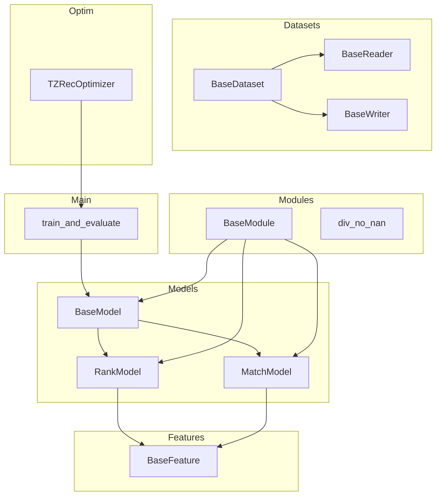
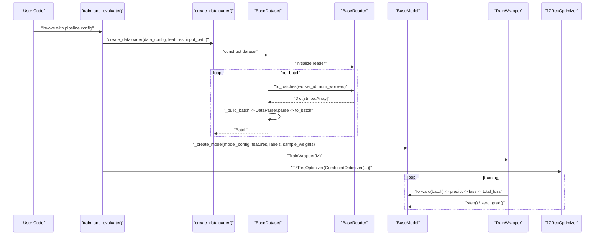
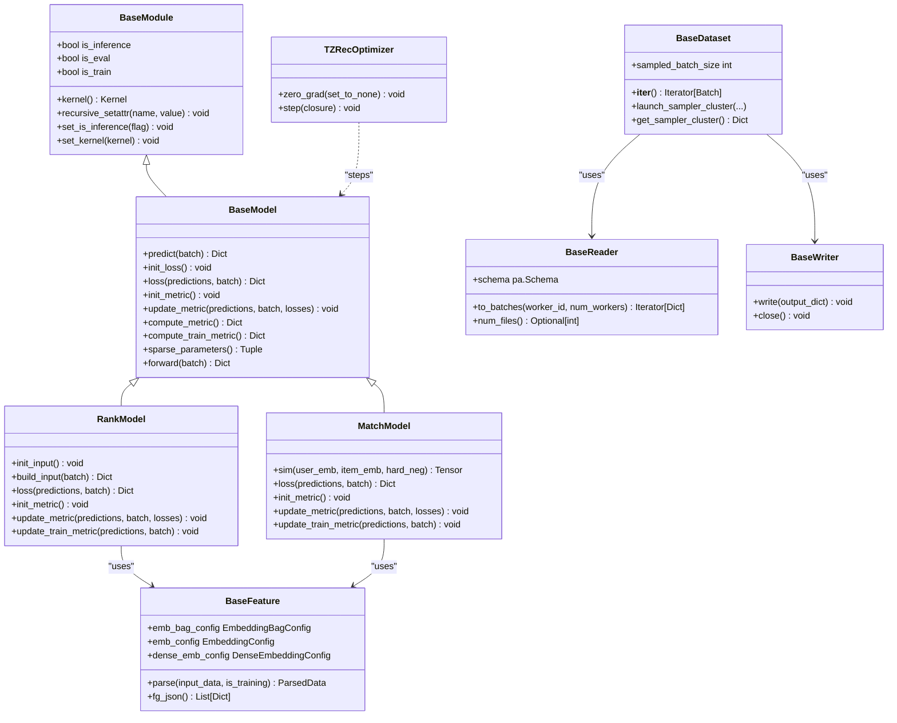

# Python Classes and Methods Reference

<cite>
**Referenced Files in This Document**
- [tzrec/__init__.py](file://tzrec/__init__.py)
- [tzrec/main.py](file://tzrec/main.py)
- [tzrec/models/model.py](file://tzrec/models/model.py)
- [tzrec/models/rank_model.py](file://tzrec/models/rank_model.py)
- [tzrec/models/match_model.py](file://tzrec/models/match_model.py)
- [tzrec/features/feature.py](file://tzrec/features/feature.py)
- [tzrec/datasets/dataset.py](file://tzrec/datasets/dataset.py)
- [tzrec/optim/optimizer.py](file://tzrec/optim/optimizer.py)
- [tzrec/modules/utils.py](file://tzrec/modules/utils.py)
</cite>

## Table of Contents

1. [Introduction](#introduction)
1. [Project Structure](#project-structure)
1. [Core Components](#core-components)
1. [Architecture Overview](#architecture-overview)
1. [Detailed Component Analysis](#detailed-component-analysis)
1. [Dependency Analysis](#dependency-analysis)
1. [Performance Considerations](#performance-considerations)
1. [Troubleshooting Guide](#troubleshooting-guide)
1. [Conclusion](#conclusion)

## Introduction

This document provides a comprehensive Python API reference for TorchEasyRec’s core classes and methods. It covers the Model base classes (BaseModel, RankModel, MatchModel), Feature base classes, Dataset readers, Optimizer wrappers, and utility classes. For each major class, you will find:

- Complete method signatures with parameter types, return values, and exceptions
- Inheritance hierarchies, abstract methods, and interface contracts
- Usage examples demonstrating instantiation, configuration, and operation patterns
- Public properties, magic methods, and special behaviors
- Error handling patterns, validation rules, and common usage pitfalls
- Thread safety considerations, memory management, and performance characteristics

## Project Structure

TorchEasyRec organizes functionality into cohesive modules:

- models: Base model abstractions and concrete model implementations
- features: Feature parsing, vocabulary handling, and embedding configurations
- datasets: Dataset readers, samplers, and batching utilities
- optim: Optimizer wrappers and helpers for distributed and sparse training
- modules: Shared utilities and foundational building blocks
- main: Orchestration of training, evaluation, and export workflows

**Diagram sources**

- \[tzrec/models/model.py\](file://tzrec/models/model.py#L39-L423)
- \[tzrec/models/rank_model.py\](file://tzrec/models/rank_model.py#L56-L513)
- \[tzrec/models/match_model.py\](file://tzrec/models/match_model.py#L225-L500)
- \[tzrec/features/feature.py\](file://tzrec/features/feature.py#L375-L1268)
- \[tzrec/datasets/dataset.py\](file://tzrec/datasets/dataset.py#L149-L733)
- \[tzrec/optim/optimizer.py\](file://tzrec/optim/optimizer.py#L26-L238)
- \[tzrec/modules/utils.py\](file://tzrec/modules/utils.py#L21-L135)
- \[tzrec/main.py\](file://tzrec/main.py#L126-L158)

**Section sources**

- \[tzrec/__init__.py\](file://tzrec/__init__.py#L1-L73)
- \[tzrec/main.py\](file://tzrec/main.py#L1-L120)

## Core Components

This section summarizes the primary classes and their roles.

- BaseModel: Abstract base for all models; defines predict, loss, init_loss, init_metric, update_metric, compute_metric, compute_train_metric, sparse_parameters, and forward.
- RankModel: Ranking-specific model that builds embeddings, handles classification/regression losses, and computes ranking metrics.
- MatchModel: Matching model for learning user/item embeddings and computing similarities; supports in-batch negatives and hard negatives.
- BaseFeature: Abstraction for feature parsing, vocabulary handling, embedding configs, and FG (feature generation) integration.
- BaseDataset, BaseReader, BaseWriter: Dataset orchestration, input reading, and output writing with support for sampling and batching.
- TZRecOptimizer: Wrapper around KeyedOptimizer to support gradient accumulation and GradScaler.
- BaseModule: Shared base for modules with kernel selection, inference flags, and traversal utilities.

**Section sources**

- \[tzrec/models/model.py\](file://tzrec/models/model.py#L39-L423)
- \[tzrec/models/rank_model.py\](file://tzrec/models/rank_model.py#L56-L513)
- \[tzrec/models/match_model.py\](file://tzrec/models/match_model.py#L225-L500)
- \[tzrec/features/feature.py\](file://tzrec/features/feature.py#L375-L1268)
- \[tzrec/datasets/dataset.py\](file://tzrec/datasets/dataset.py#L149-L733)
- \[tzrec/optim/optimizer.py\](file://tzrec/optim/optimizer.py#L26-L238)
- \[tzrec/modules/utils.py\](file://tzrec/modules/utils.py#L21-L135)

## Architecture Overview

The training and evaluation pipeline integrates datasets, models, and optimizers with distributed sharding and mixed precision.

**Diagram sources**

- \[tzrec/main.py\](file://tzrec/main.py#L527-L734)
- \[tzrec/datasets/dataset.py\](file://tzrec/datasets/dataset.py#L645-L733)
- \[tzrec/models/model.py\](file://tzrec/models/model.py#L222-L284)
- \[tzrec/optim/optimizer.py\](file://tzrec/optim/optimizer.py#L26-L69)

## Detailed Component Analysis

### BaseModel

- Purpose: Defines the model contract for prediction, loss computation, metric initialization/update, and sparse parameter separation.
- Key methods:
  - predict(batch) -> Dict\[str, Tensor\]: Compute predictions from a Batch.
  - init_loss() -> None: Initialize loss modules.
  - loss(predictions, batch) -> Dict\[str, Tensor\]: Compute per-loss tensors.
  - init_metric() -> None: Initialize metric modules.
  - update_metric(predictions, batch, losses=None) -> None: Update metric states.
  - compute_metric() -> Dict\[str, Tensor\]: Aggregate and reset metrics.
  - compute_train_metric() -> Dict\[str, Tensor\]: Compute training metrics without resetting.
  - sparse_parameters() -> Tuple\[Iterable[Parameter], Iterable[Parameter]\]: Separate trainable vs frozen parameters for sparse embeddings.
  - forward(batch) -> Dict\[str, Tensor\]: Alias to predict.
- Properties and attributes:
  - \_base_model_config, \_model_type, \_features, \_labels, \_sample_weights, \_metric_modules, \_loss_modules, \_train_metric_modules.
- Special behaviors:
  - Uses torchrec embedding interfaces to detect sparse parameters and separate trainable/frozen sets.
  - Provides MeanMetric tracking for loss values via internal helpers.

Usage example pattern:

- Instantiate a concrete model (e.g., RankModel) with model_config, features, labels, optional sample_weights.
- Wrap with TrainWrapper for training and PredictWrapper for inference.
- Call forward(batch) to get predictions; loss(predictions, batch) to compute losses; update_metric(...) to update metrics.

Thread safety and memory:

- Metrics are reset after compute_metric(); ensure single-threaded access to metric modules during aggregation.
- Mixed precision autocast is handled by wrapper modules; ensure device alignment.

**Section sources**

- \[tzrec/models/model.py\](file://tzrec/models/model.py#L39-L216)
- \[tzrec/models/model.py\](file://tzrec/models/model.py#L222-L423)

### RankModel

- Purpose: Implements ranking tasks with embedding groups, optional variational dropout, and multiple loss/metric types.
- Key methods:
  - init_input() -> None: Build EmbeddingGroup and optional group-wise variational dropout modules.
  - build_input(batch) -> Dict\[str, Tensor\]: Apply embedding group and optional variational dropout to feature groups.
  - \_output_to_prediction_impl(output, loss_cfg, num_class, suffix) -> Dict\[str, Tensor\]: Convert raw logits to probabilities/probs/logits/y depending on loss type.
  - \_init_loss_impl(loss_cfg, num_class, reduction, suffix) -> None: Register loss modules (BCEWithLogits, BinaryFocalLoss, CrossEntropy, JRCLoss, MSELoss).
  - init_loss() -> None: Initialize losses based on model config.
  - \_loss_impl(predictions, batch, label, loss_weight, loss_cfg, num_class, suffix) -> Dict\[str, Tensor\]: Compute per-loss tensors with optional sample weights.
  - loss(predictions, batch) -> Dict\[str, Tensor\]: Aggregate all losses and any variational dropout penalties.
  - \_init_metric_impl(metric_cfg, num_class, suffix) -> None: Register torchmetrics or custom metrics (AUROC variants, MAE, MSE, Accuracy, GroupedAUC, XAUC).
  - \_init_train_metric_impl(metric_cfg, num_class, suffix) -> None: Register DecayAUC and other training metrics.
  - init_metric() -> None: Initialize metrics and loss-based means.
  - \_update_metric_impl(predictions, batch, label, metric_cfg, num_class, suffix) -> None: Update metrics with grouping keys for grouped metrics.
  - update_metric(predictions, batch, losses=None) -> None: Update standard and loss-based metrics.
  - update_train_metric(predictions, batch) -> None: Update training metrics.
- Properties and attributes:
  - \_num_class, \_label_name, \_sample_weight_name, \_loss_collection, embedding_group, group_variational_dropouts.
- Validation rules:
  - num_class assertions for BCE/BinaryFocalLoss (must be 1), SoftmaxCrossEntropy (must be >1), JRCLoss (must be 2).
  - Sample weights normalization via div_no_nan.

Usage example pattern:

- Configure model with losses and metrics; call init_loss() and init_metric().
- For each batch, call build_input(batch), predict(batch), loss(predictions, batch), and update_metric(...).

Common pitfalls:

- Incorrect num_class for loss types leads to assertion errors.
- Ensure sample weights are present when configured; otherwise, reduction defaults to mean.

**Section sources**

- \[tzrec/models/rank_model.py\](file://tzrec/models/rank_model.py#L56-L513)
- \[tzrec/modules/utils.py\](file://tzrec/modules/utils.py#L94-L126)

### MatchModel

- Purpose: Implements matching models for user/item embeddings and similarity computation, supporting in-batch negatives and hard negatives.
- Key methods:
  - sim(user_emb, item_emb, hard_neg_indices=None) -> Tensor: Compute similarities; supports in-batch or sampler-based similarity matrices.
  - \_init_loss_impl(loss_cfg, suffix) -> None: Enforces softmax cross-entropy for matching.
  - init_loss() -> None: Single loss constraint enforced.
  - \_loss_impl(predictions, batch, label, loss_cfg, suffix) -> Dict\[str, Tensor\]: Compute CE loss with integer labels (range or zeros).
  - loss(predictions, batch) -> Dict\[str, Tensor\]: Aggregate losses and any auxiliary losses.
  - \_init_metric_impl(metric_cfg, suffix) -> None: Registers Recall@K metric.
  - \_init_train_metric_impl(metric_cfg, suffix) -> None: Registers training Recall@K with decay wrapper.
  - init_metric() -> None: Initialize metrics and loss-based means.
  - \_update_metric_impl(predictions, batch, label, metric_cfg, suffix) -> None: Update Recall@K with boolean masks (eye or zero-th column).
  - update_metric(predictions, batch, losses=None) -> None: Update standard and loss-based metrics.
  - update_train_metric(predictions, batch) -> None: Update training metrics.
- Supporting classes:
  - MatchTower: Builds embedding groups per tower (user/item) with optional variational dropout.
  - MatchTowerWoEG: Tower without shared embedding group (for shared embeddings).
  - TowerWrapper, TowerWoEGWrapper: JIT-friendly wrappers for user/item towers.
- Properties and attributes:
  - \_num_class, \_label_name, \_sample_weight, \_in_batch_negative, \_loss_collection, sampler_type.

Usage example pattern:

- Configure model with in-batch negative flag and sampler type.
- Build user and item towers; compute embeddings; call sim(user_emb, item_emb) and loss(...), update_metric(...).

Common pitfalls:

- Only softmax cross-entropy is supported for matching.
- Ensure sampler_type and hard negatives are aligned with sim() logic.

**Section sources**

- \[tzrec/models/match_model.py\](file://tzrec/models/match_model.py#L225-L500)

### BaseFeature

- Purpose: Abstraction for feature parsing, vocabulary handling, embedding configs, and FG integration.
- Key methods:
  - parse(input_data, is_training=False) -> ParsedData: Parse raw Arrow arrays into structured feature data; applies masking for training.
  - \_parse(input_data) -> ParsedData: Internal parsing logic for FG_NONE and FG_NORMAL modes.
  - init_fg(): Initialize FG arrow handler for normal mode.
  - fg_json() -> List\[Dict\]: Generate FG JSON config for feature DAG.
  - fg_encoded_default_value() -> Optional\[Union\[List[int], List[float]\]\]: Resolve default values for FG-encoded inputs.
  - assets() -> Dict\[str, str\]: Asset file paths for external resources.
  - Parameter constraints: Build embedding constraints and dynamic embedding constraints.
- Properties:
  - name, is_neg, data_group, feature_config, is_user_feat, value_dim, output_dim, is_sparse, is_sequence, is_grouped_sequence, is_weighted, has_embedding, pooling_type, num_embeddings, emb_bag_config, emb_config, dense_emb_config, mc_module.
- Validation rules:
  - Side inputs must be valid tuples with sides in ["user","item","context","feature","const"].
  - Default bucketize value must be less than vocab list length when set.
  - Vocab dict indices should start from 2 unless default_bucketize_value is set.

Usage example pattern:

- Create features from FeatureConfigs; optionally copy assets; generate FG JSON for DAG; parse batches via DataParser.

Common pitfalls:

- Missing side inputs raise InvalidFgInputError.
- Unsupported Arrow dtypes cause ValueError during schema validation.

**Section sources**

- \[tzrec/features/feature.py\](file://tzrec/features/feature.py#L375-L1268)

### BaseDataset, BaseReader, BaseWriter

- Purpose: Provide dataset orchestration, input reading, and output writing with sampling, batching, and cost-aware slicing.
- Key methods:
  - BaseDataset:
    - __iter__() -> Iterator\[Batch\]: Worker-aware iteration; launches sampler if configured; yields parsed batches.
    - \_build_batch(input_data) -> Batch: Applies sampler (TDMSampler, HSTU-aware), masks, and DataParser; constructs Batch.
    - sampled_batch_size -> int: Effective batch size including sampled rows.
    - launch_sampler_cluster(...), get_sampler_cluster() -> Optional[Dict].
  - BaseReader:
    - schema -> pa.Schema: Table schema.
    - to_batches(worker_id, num_workers) -> Iterator\[Dict[str, pa.Array]\]: Buffered, shuffled, cost-aware batching.
    - num_files() -> Optional\[int\]: Number of files for file-based readers.
  - BaseWriter:
    - write(output_dict) -> None: Write a batch.
    - close() -> None: Commit and finalize.
- Validation rules:
  - Unsupported Arrow dtypes raise ValueError.
  - When batch_cost_size is set, sample_cost_field must be provided.

Usage example pattern:

- Create reader from input path; construct dataset; wrap with DataLoader; iterate batches; handle reserved columns in predict mode.

Common pitfalls:

- Insufficient number of files for distributed workers raises ValueError.
- Unset writer_type or reader_type leads to assertion errors.

**Section sources**

- \[tzrec/datasets/dataset.py\](file://tzrec/datasets/dataset.py#L149-L733)

### TZRecOptimizer

- Purpose: Wraps KeyedOptimizer to support gradient accumulation and GradScaler.
- Key methods:
  - zero_grad(set_to_none=False) -> None: Zeros gradients respecting accumulation steps.
  - step(closure=None) -> None: Steps optimizer every N steps when accumulation is enabled; uses GradScaler if provided.
- Environment and helpers:
  - apply_split_helper: Patch for FBGEMM split helper to support initial momentum1 state for Adagrad.

Usage example pattern:

- Build CombinedOptimizer; wrap with TZRecOptimizer(grad_scaler, gradient_accumulation_steps); call step() every N steps.

Common pitfalls:

- Misconfigured gradient_accumulation_steps can lead to skipped updates or excessive updates.

**Section sources**

- \[tzrec/optim/optimizer.py\](file://tzrec/optim/optimizer.py#L26-L238)

### BaseModule

- Purpose: Shared base for modules with kernel selection, inference flags, and recursive attribute propagation.
- Key methods:
  - kernel() -> Kernel: Get effective kernel type.
  - recursive_setattr(name, value) -> None: Propagate attribute to submodules.
  - set_is_inference(is_inference) -> None: Set inference mode recursively.
  - set_kernel(kernel) -> None: Set kernel type recursively.
  - is_inference, is_eval, is_train -> bool: Convenience properties.
- Utilities:
  - div_no_nan(input, other, ...) -> Tensor: Safe division avoiding NaN/Inf.
  - init_linear_xavier_weights_zero_bias(m) -> None: Xavier init for Linear layers.

Usage example pattern:

- Derive from BaseModule; set kernel and inference flags; propagate settings to children.

Common pitfalls:

- Kernel selection affects Triton/CUDA kernels; ensure compatibility.

**Section sources**

- \[tzrec/modules/utils.py\](file://tzrec/modules/utils.py#L21-L135)

## Dependency Analysis

This section maps key dependencies among core components.

**Diagram sources**

- \[tzrec/modules/utils.py\](file://tzrec/modules/utils.py#L21-L74)
- \[tzrec/models/model.py\](file://tzrec/models/model.py#L39-L216)
- \[tzrec/models/rank_model.py\](file://tzrec/models/rank_model.py#L56-L180)
- \[tzrec/models/match_model.py\](file://tzrec/models/match_model.py#L225-L365)
- \[tzrec/features/feature.py\](file://tzrec/features/feature.py#L375-L500)
- \[tzrec/datasets/dataset.py\](file://tzrec/datasets/dataset.py#L149-L240)
- \[tzrec/optim/optimizer.py\](file://tzrec/optim/optimizer.py#L26-L69)

**Section sources**

- \[tzrec/models/model.py\](file://tzrec/models/model.py#L39-L216)
- \[tzrec/models/rank_model.py\](file://tzrec/models/rank_model.py#L56-L180)
- \[tzrec/models/match_model.py\](file://tzrec/models/match_model.py#L225-L365)
- \[tzrec/features/feature.py\](file://tzrec/features/feature.py#L375-L500)
- \[tzrec/datasets/dataset.py\](file://tzrec/datasets/dataset.py#L149-L240)
- \[tzrec/optim/optimizer.py\](file://tzrec/optim/optimizer.py#L26-L69)

## Performance Considerations

- Mixed precision: TrainWrapper/PredictWrapper enable autocast with FP16/BF16 when configured; improves throughput with minimal accuracy impact.
- Gradient accumulation: TZRecOptimizer supports accumulating gradients over N steps to simulate larger effective batch sizes.
- Distributed sharding: DistributedModelParallel shards model parameters and optimizer states; planner and sharders optimize placement.
- Sampling overhead: Samplers (e.g., TDMSampler, HSTU-aware) increase batch size; ensure sufficient workers and balanced data distribution.
- Memory: FG parsing and embedding lookups allocate temporary tensors; monitor GPU/CPU memory usage during training.
- Kernel selection: BaseModule allows switching kernels (e.g., Triton) to optimize compute kernels.

[No sources needed since this section provides general guidance]

## Troubleshooting Guide

- InvalidFgInputError: Ensure side inputs are provided and valid; check feature side_inputs construction.
- Unsupported Arrow dtype: Verify schema matches supported types; adjust data or preprocessing.
- Missing checkpoint path: train_and_evaluate raises runtime error if fine-tune checkpoint does not exist.
- Sampler configuration mismatch: Ensure sampler_type and hard negatives align with model’s sim() and loss() logic.
- Mixed precision autocast errors: Confirm device type and dtype compatibility; disable mixed precision if unsupported.
- Gradient accumulation: If steps appear skipped, verify gradient_accumulation_steps and step() invocation frequency.

**Section sources**

- \[tzrec/features/feature.py\](file://tzrec/features/feature.py#L728-L741)
- \[tzrec/datasets/dataset.py\](file://tzrec/datasets/dataset.py#L278-L281)
- \[tzrec/main.py\](file://tzrec/main.py#L599-L602)
- \[tzrec/models/match_model.py\](file://tzrec/models/match_model.py#L253-L264)
- \[tzrec/optim/optimizer.py\](file://tzrec/optim/optimizer.py#L56-L68)

## Conclusion

TorchEasyRec provides a modular, distributed training framework centered around BaseModel abstractions, robust feature parsing, efficient dataset ingestion with sampling, and optimized optimizer wrappers. By leveraging BaseModule utilities, mixed precision, and distributed sharding, users can scale ranking and matching workloads effectively. The API reference above should serve as a practical guide to instantiate, configure, and operate these components safely and efficiently.
