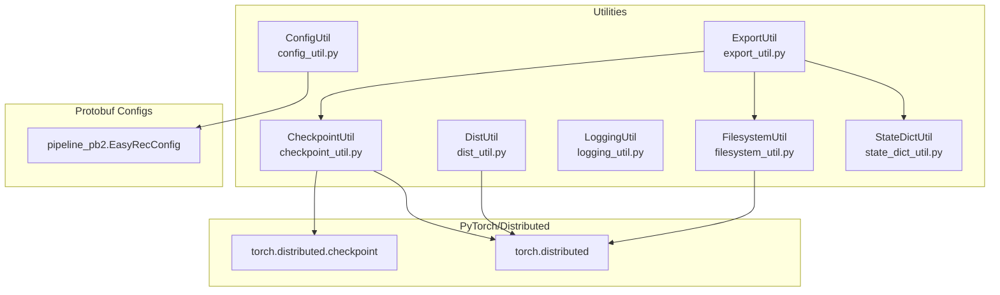
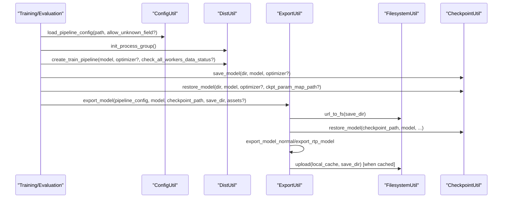
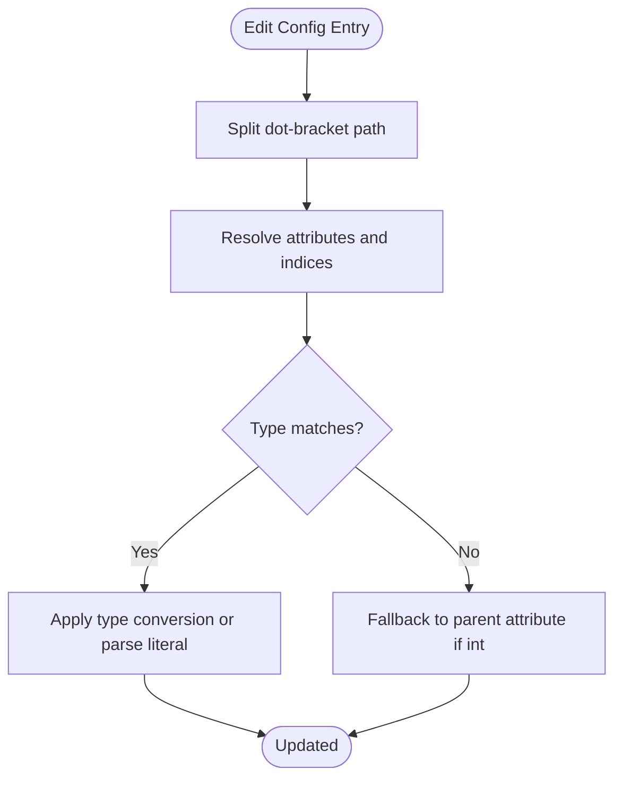
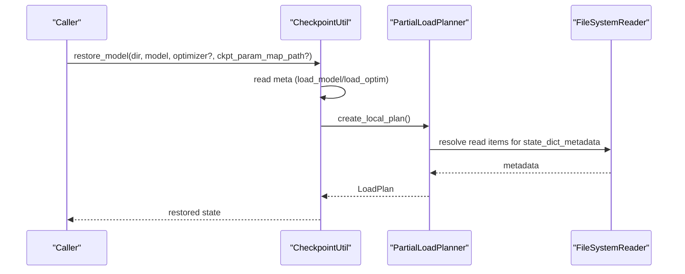
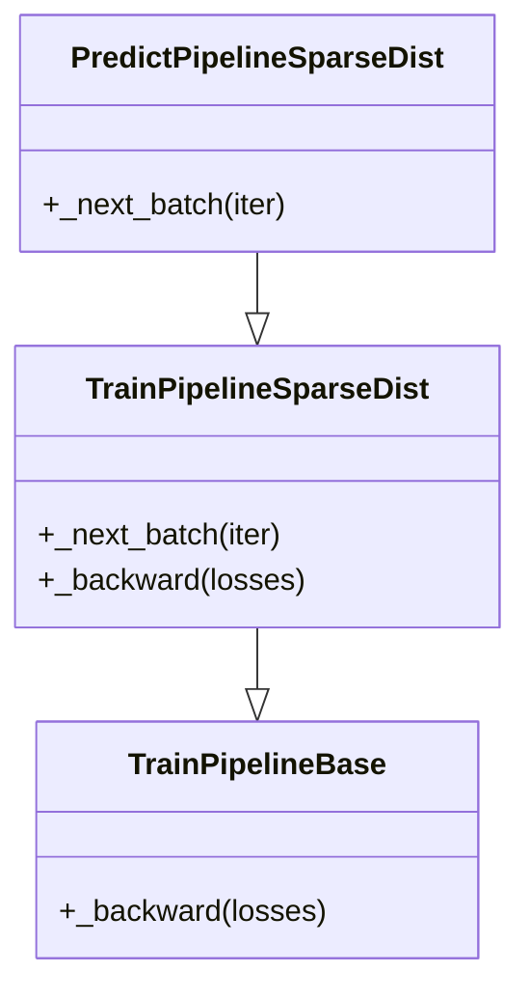
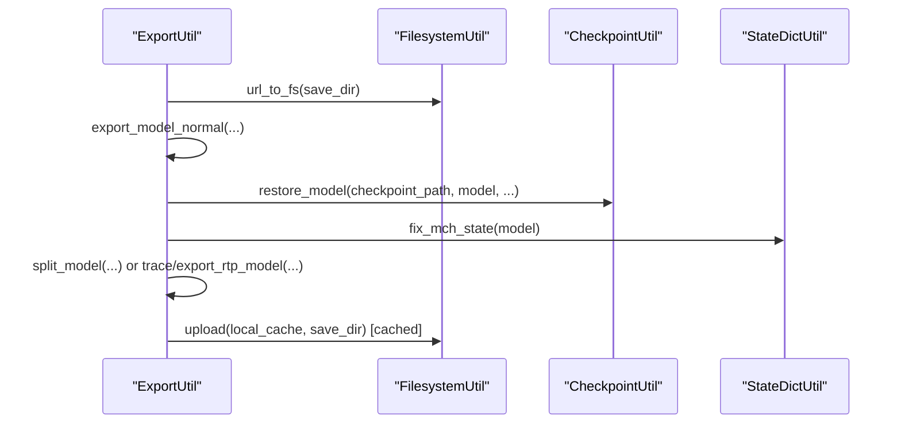
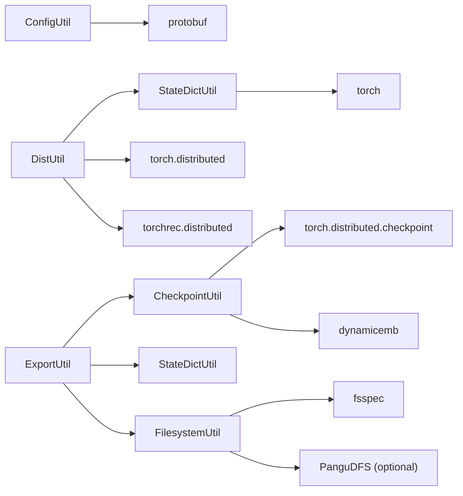

# Utility and Helper Classes

<cite>
**Referenced Files in This Document**
- [config_util.py](file://tzrec/utils/config_util.py)
- [checkpoint_util.py](file://tzrec/utils/checkpoint_util.py)
- [dist_util.py](file://tzrec/utils/dist_util.py)
- [logging_util.py](file://tzrec/utils/logging_util.py)
- [export_util.py](file://tzrec/utils/export_util.py)
- [filesystem_util.py](file://tzrec/utils/filesystem_util.py)
- [state_dict_util.py](file://tzrec/utils/state_dict_util.py)
- [multi_tower_taobao.config](file://examples/multi_tower_taobao.config)
- [config_util_test.py](file://tzrec/utils/config_util_test.py)
- [checkpoint_util_test.py](file://tzrec/utils/checkpoint_util_test.py)
- [filesystem_util_test.py](file://tzrec/utils/filesystem_util_test.py)
</cite>

## Table of Contents

1. [Introduction](#introduction)
1. [Project Structure](#project-structure)
1. [Core Components](#core-components)
1. [Architecture Overview](#architecture-overview)
1. [Detailed Component Analysis](#detailed-component-analysis)
1. [Dependency Analysis](#dependency-analysis)
1. [Performance Considerations](#performance-considerations)
1. [Troubleshooting Guide](#troubleshooting-guide)
1. [Conclusion](#conclusion)

## Introduction

This document provides comprehensive API documentation for TorchEasyRec’s utility and helper classes focused on configuration management, distributed training, logging, model export, filesystem integration, and state handling. It covers public APIs, method signatures, parameters, return values, usage patterns, error handling, performance considerations, and best practices derived from the source code and tests.

## Project Structure

The utilities are located under tzrec/utils and integrate with the broader training, evaluation, export, and serving pipeline. They are used across training, export, and prediction flows and interact with Protocol Buffers, PyTorch distributed checkpointing, filesystem abstractions, and logging infrastructure.

**Diagram sources**

- \[config_util.py\](file://tzrec/utils/config_util.py#L25-L48)
- \[checkpoint_util.py\](file://tzrec/utils/checkpoint_util.py#L19-L30)
- \[export_util.py\](file://tzrec/utils/export_util.py#L60-L72)
- \[filesystem_util.py\](file://tzrec/utils/filesystem_util.py#L36-L49)
- \[dist_util.py\](file://tzrec/utils/dist_util.py#L18-L49)

**Section sources**

- \[config_util.py\](file://tzrec/utils/config_util.py#L1-L299)
- \[checkpoint_util.py\](file://tzrec/utils/checkpoint_util.py#L1-L389)
- \[dist_util.py\](file://tzrec/utils/dist_util.py#L1-L346)
- \[logging_util.py\](file://tzrec/utils/logging_util.py#L1-L46)
- \[export_util.py\](file://tzrec/utils/export_util.py#L1-L1070)
- \[filesystem_util.py\](file://tzrec/utils/filesystem_util.py#L1-L277)
- \[state_dict_util.py\](file://tzrec/utils/state_dict_util.py#L1-L60)

## Core Components

- ConfigUtil: Loads and manipulates Protocol Buffer pipeline configurations, supports JSON/text formats, editing via dot-bracket notation, and compatibility handling for legacy fields.
- CheckpointUtil: Manages distributed model checkpoints, partial and remapped restores, best-checkpoint selection, and parameter listing.
- DistUtil: Initializes distributed process groups, wraps training pipelines, and adapts sparse embedding input distribution for managed collision modules.
- LoggingUtil: Provides a structured logger and progress logger with iteration throughput reporting.
- ExportUtil: Exports models to multiple targets (AOT/TRT/standard), handles RTP-specific export, quantization, splitting sparse/dense subgraphs, and saving assets.
- FilesystemUtil: Provides filesystem abstraction via fsspec and optional Pangu DFS integration, with monkey-patched IO and registration hooks.
- StateDictUtil: Fixes meta-device buffers and initializes parameters/buffers for meta devices.

**Section sources**

- \[config_util.py\](file://tzrec/utils/config_util.py#L25-L299)
- \[checkpoint_util.py\](file://tzrec/utils/checkpoint_util.py#L38-L389)
- \[dist_util.py\](file://tzrec/utils/dist_util.py#L53-L346)
- \[logging_util.py\](file://tzrec/utils/logging_util.py#L16-L46)
- \[export_util.py\](file://tzrec/utils/export_util.py#L75-L1070)
- \[filesystem_util.py\](file://tzrec/utils/filesystem_util.py#L36-L277)
- \[state_dict_util.py\](file://tzrec/utils/state_dict_util.py#L17-L60)

## Architecture Overview

The utilities orchestrate configuration loading, distributed training, checkpointing, exporting, and filesystem operations. ExportUtil depends on CheckpointUtil, FilesystemUtil, and StateDictUtil to produce optimized artifacts.

**Diagram sources**

- \[export_util.py\](file://tzrec/utils/export_util.py#L75-L106)
- \[checkpoint_util.py\](file://tzrec/utils/checkpoint_util.py#L323-L350)
- \[filesystem_util.py\](file://tzrec/utils/filesystem_util.py#L36-L49)
- \[dist_util.py\](file://tzrec/utils/dist_util.py#L53-L71)

## Detailed Component Analysis

### ConfigUtil

- Purpose: Load Protocol Buffer pipeline configurations from JSON or text format, edit parameters via dot-bracket notation, convert messages to dicts, and maintain compatibility for legacy fields.
- Key APIs:
  - load_pipeline_config(pipeline_config_path: str, allow_unknown_field: bool = False) -> EasyRecConfig
  - save_message(message: Message, filepath: str) -> None
  - config_to_kwargs(config: Message) -> Dict[str, Any]
  - which_msg(config: Message, oneof_group: str) -> str
  - edit_config(pipeline_config: EasyRecConfig, edit_config_json: Dict[str, Any]) -> EasyRecConfig
- Notable behaviors:
  - Supports JSON and text formats; unknown fields can be ignored when requested.
  - Compatibility conversion for fg_encoded to fg_mode.
  - edit_config supports indexing, slicing, and filtering via bracket expressions and dot paths.
- Usage examples:
  - Load a config from a text file and edit optimizer learning rate and feature buckets.
  - Convert a loaded config to a Python dict for inspection or templating.
- Error handling:
  - edit_config raises assertion errors for invalid conditions and type mismatches; allows fallback to parent attribute resolution when possible.
- Performance considerations:
  - Parsing large configs is I/O bound; prefer keeping configs minimal and avoiding unknown fields.

**Diagram sources**

- \[config_util.py\](file://tzrec/utils/config_util.py#L144-L299)

**Section sources**

- \[config_util.py\](file://tzrec/utils/config_util.py#L25-L299)
- \[config_util_test.py\](file://tzrec/utils/config_util_test.py#L17-L42)
- \[multi_tower_taobao.config\](file://examples/multi_tower_taobao.config#L1-L200)

### CheckpointUtil

- Purpose: Save and restore distributed model checkpoints, select best checkpoint based on metrics, list distributed parameters, and support partial and remapped restores.
- Key APIs:
  - PartialLoadPlanner(flatten_state_dict: bool = True, flatten_sharded_tensors: bool = True, ckpt_param_map_path: Optional[str] = None)
    - create_local_plan() -> LoadPlan
  - latest_checkpoint(model_dir: str) -> Tuple\[Optional[str], int\]
  - best_checkpoint(model_dir: str, export_config: ExportConfig, eval_result_filename: str = TRAIN_EVAL_RESULT_FILENAME) -> Tuple\[Optional[str], int\]
  - restore_model(checkpoint_dir: str, model: nn.Module, optimizer: Optional[optim.Optimizer] = None, ckpt_param_map_path: Optional[str] = None) -> None
  - save_model(checkpoint_dir: str, model: nn.Module, optimizer: Optional[optim.Optimizer] = None) -> None
  - list_distcp_param(checkpoint_dir: str) -> List[str]
- Notable behaviors:
  - Remaps embedding collection keys and supports EC list/dict migration.
  - Reads meta flags to conditionally load model/optimizer.
  - Supports dynamic embedding dumps/restores when available.
  - Best checkpoint selection reads eval logs and sorts by metric.
- Usage examples:
  - Save a checkpoint after training; restore on another model with remapping; list distributed parameters.
  - Find best checkpoint by metric and export.
- Error handling:
  - Raises runtime errors when checkpoint directories are missing or best metric step lacks a matching checkpoint.
- Performance considerations:
  - Distributed checkpointing leverages sharded tensors and DTensor; ensure metadata presence for accurate parameter listing.

**Diagram sources**

- \[checkpoint_util.py\](file://tzrec/utils/checkpoint_util.py#L242-L321)
- \[checkpoint_util.py\](file://tzrec/utils/checkpoint_util.py#L38-L124)

**Section sources**

- \[checkpoint_util.py\](file://tzrec/utils/checkpoint_util.py#L38-L389)
- \[checkpoint_util_test.py\](file://tzrec/utils/checkpoint_util_test.py#L172-L294)

### DistUtil

- Purpose: Initialize distributed process groups, wrap models with distributed sharding, and customize training/prediction pipelines for sparse modules.
- Key APIs:
  - init_process_group() -> Tuple[torch.device, str]
  - get_dist_object_pg(world_size: Optional[int] = None) -> Optional[dist.ProcessGroup]
  - DistributedModelParallel(module, env, device, plan, sharders, init_data_parallel, init_parameters, data_parallel_wrapper) -> \_DistributedModelParallel
  - create_train_pipeline(model, optimizer, check_all_workers_data_status) -> TrainPipeline
  - TrainPipelineBase, TrainPipelineSparseDist, PredictPipelineSparseDist
- Notable behaviors:
  - Patches managed collision embedding input_dist to handle feature ordering and mean pooling callbacks.
  - Custom backward support for gradient scaling and accumulation steps.
  - Pipeline checks all workers’ data availability when enabled.
- Usage examples:
  - Initialize process group, create DMP model, and construct a sparse-aware training pipeline.
- Error handling:
  - Uses assertions and warnings for unsupported configurations; ensures proper device initialization.
- Performance considerations:
  - Properly sized world sizes and backends improve communication efficiency.

**Diagram sources**

- \[dist_util.py\](file://tzrec/utils/dist_util.py#L202-L302)

**Section sources**

- \[dist_util.py\](file://tzrec/utils/dist_util.py#L53-L346)

### LoggingUtil

- Purpose: Provide a logger named “tzrec” and a progress logger that reports iteration counts and throughput.
- Key APIs:
  - logger: logging.Logger
  - ProgressLogger(desc: str, start_n: int = -1, mininterval: float = 1, miniters: int = 0)
    - set_description(desc: str) -> None
    - log(n: int, suffix: str = "") -> None
- Usage examples:
  - Log training iterations with per-second throughput.
- Notes:
  - Logger level is set to INFO by default.

**Section sources**

- \[logging_util.py\](file://tzrec/utils/logging_util.py#L16-L46)

### ExportUtil

- Purpose: Export trained models to various formats (AOT/TRT/standard), optionally for RTP, with quantization, splitting sparse/dense subgraphs, and saving assets.
- Key APIs:
  - export_model(pipeline_config: EasyRecConfig, model: BaseModule, checkpoint_path: Optional[str], save_dir: str, assets: Optional\[List[str]\] = None) -> None
  - export_model_normal(...) -> None
  - export_rtp_model(...) -> None
  - split_model(data: Dict[str, torch.Tensor], model: BaseModule, save_dir: str) -> Tuple\[nn.Module, nn.Module, Dict[str, Any]\]
- Notable behaviors:
  - Supports cloud save with local cache and upload.
  - Quantizes embeddings when configured.
  - RTP export patches FBGEMM ops and sequences; validates constraints.
  - Saves feature configs, fg.json, pipeline.config, and model accuracy configs.
- Usage examples:
  - Export a standard scripted model with traced graph and assets.
  - Export RTP model with sparse/dense splits and embedding tensors.
- Error handling:
  - Raises runtime errors for missing dependencies or unsupported ops.
- Performance considerations:
  - Batch size limits for certain export modes; quantization reduces memory footprint.

**Diagram sources**

- \[export_util.py\](file://tzrec/utils/export_util.py#L75-L106)
- \[export_util.py\](file://tzrec/utils/export_util.py#L108-L239)
- \[export_util.py\](file://tzrec/utils/export_util.py#L596-L934)

**Section sources**

- \[export_util.py\](file://tzrec/utils/export_util.py#L75-L1070)

### FilesystemUtil

- Purpose: Abstract filesystem operations via fsspec and optionally integrate Pangu DFS, with monkey-patched IO functions and registration hooks.
- Key APIs:
  - url_to_fs(path) -> Tuple\[Optional[FileSystem], str\]
  - apply_monkeypatch() -> None
  - remove_monkeypatch() -> None
  - register_external_filesystem() -> None
  - PanguGFile (TensorBoard-compatible wrapper)
- Notable behaviors:
  - Caches fsspec filesystem instances by protocol.
  - Applies monkeypatches to built-in IO functions for transparent remote/local access.
  - Registers external filesystems and applies monkeypatches when enabled.
- Usage examples:
  - Enable fsspec globally to read/write remote paths seamlessly.
  - Register Pangu DFS and use it via gfile.
- Error handling:
  - Retries on Pangu DFS write failures; raises exceptions on repeated errors.
- Performance considerations:
  - Monkeypatching affects all IO; ensure appropriate environments and caches.

**Section sources**

- \[filesystem_util.py\](file://tzrec/utils/filesystem_util.py#L36-L277)
- \[filesystem_util_test.py\](file://tzrec/utils/filesystem_util_test.py#L21-L73)

### StateDictUtil

- Purpose: Fix meta-device buffers and initialize parameters/buffers for meta devices.
- Key APIs:
  - fix_mch_state(model: nn.Module) -> None
  - init_parameters(module: nn.Module, device: torch.device) -> None
- Notable behaviors:
  - Ensures MCHManagedCollisionModule buffers are materialized.
  - Allocates and resets parameters/buffers on target device when encountering meta tensors.
- Usage examples:
  - Call fix_mch_state before export to avoid meta tensor issues.
  - Initialize parameters on CPU/GPU before tracing/export.

**Section sources**

- \[state_dict_util.py\](file://tzrec/utils/state_dict_util.py#L17-L60)

## Dependency Analysis

- ConfigUtil depends on protobuf JSON/text parsers and logging.
- CheckpointUtil depends on torch.distributed.checkpoint and dynamic embedding utilities.
- DistUtil depends on torch.distributed and torchrec distributed components.
- ExportUtil depends on CheckpointUtil, FilesystemUtil, StateDictUtil, and accelerator utilities.
- FilesystemUtil depends on fsspec and optional Pangu DFS client.
- StateDictUtil depends on torch and torchrec MC modules.

**Diagram sources**

- \[config_util.py\](file://tzrec/utils/config_util.py#L17-L22)
- \[checkpoint_util.py\](file://tzrec/utils/checkpoint_util.py#L19-L35)
- \[dist_util.py\](file://tzrec/utils/dist_util.py#L18-L49)
- \[export_util.py\](file://tzrec/utils/export_util.py#L46-L72)
- \[filesystem_util.py\](file://tzrec/utils/filesystem_util.py#L19-L21)
- \[state_dict_util.py\](file://tzrec/utils/state_dict_util.py#L12-L14)

**Section sources**

- \[config_util.py\](file://tzrec/utils/config_util.py#L1-L299)
- \[checkpoint_util.py\](file://tzrec/utils/checkpoint_util.py#L1-L389)
- \[dist_util.py\](file://tzrec/utils/dist_util.py#L1-L346)
- \[export_util.py\](file://tzrec/utils/export_util.py#L1-L1070)
- \[filesystem_util.py\](file://tzrec/utils/filesystem_util.py#L1-L277)
- \[state_dict_util.py\](file://tzrec/utils/state_dict_util.py#L1-L60)

## Performance Considerations

- ConfigUtil: Keep configs minimal; avoid unknown fields to reduce parsing overhead.
- CheckpointUtil: Use distributed checkpointing for large models; ensure metadata presence for efficient parameter listing.
- DistUtil: Choose NCCL on CUDA and GLOO on CPU; tune world size and process group timeouts.
- ExportUtil: Limit batch size for CUDA export to prevent compilation OOM; enable quantization to reduce memory.
- FilesystemUtil: Use local cache directories for remote exports to minimize network overhead; leverage fsspec caching.
- StateDictUtil: Initialize parameters on target device early to avoid repeated allocations during tracing.

## Troubleshooting Guide

- ConfigUtil edit_config fails:
  - Verify bracket expressions and operators; ensure types are convertible or fallback to parent attributes.
- CheckpointUtil restore_model errors:
  - Confirm checkpoint directories exist; ensure meta flags align with intended load behavior; check best checkpoint step existence.
- ExportUtil RTP errors:
  - Ensure FBGEMM ops are patched; validate sequence constraints; confirm batch size limits.
- FilesystemUtil IO failures:
  - Enable USE_FSSPEC and apply monkeypatch; verify credentials and network connectivity; retry Pangu DFS writes.
- DistUtil pipeline hangs:
  - Enable check_all_workers_data_status to synchronize batch availability across workers.

**Section sources**

- \[config_util.py\](file://tzrec/utils/config_util.py#L144-L299)
- \[checkpoint_util.py\](file://tzrec/utils/checkpoint_util.py#L242-L389)
- \[export_util.py\](file://tzrec/utils/export_util.py#L596-L934)
- \[filesystem_util.py\](file://tzrec/utils/filesystem_util.py#L128-L277)
- \[dist_util.py\](file://tzrec/utils/dist_util.py#L243-L302)

## Conclusion

These utilities provide a cohesive toolkit for managing configurations, distributed training, checkpointing, exporting, filesystem access, and state handling in TorchEasyRec. By leveraging their APIs and following the usage patterns and best practices outlined above, developers can streamline training, export, and deployment workflows while maintaining robustness and performance.
