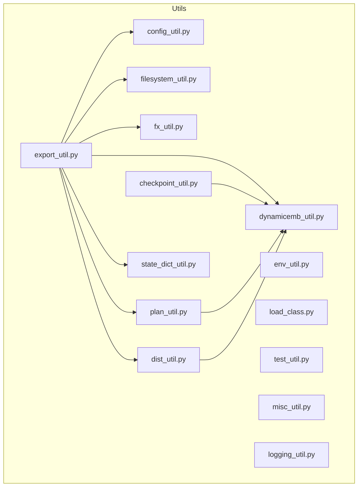
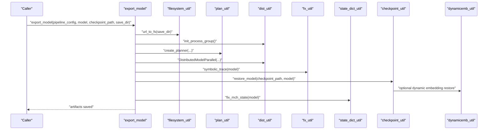
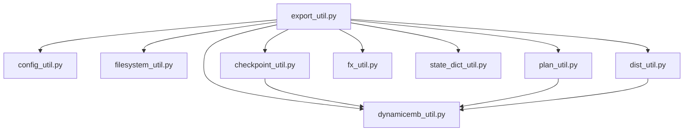

# Utility Functions and Helper APIs

<cite>
**Referenced Files in This Document**
- [config_util.py](file://tzrec/utils/config_util.py)
- [checkpoint_util.py](file://tzrec/utils/checkpoint_util.py)
- [dist_util.py](file://tzrec/utils/dist_util.py)
- [export_util.py](file://tzrec/utils/export_util.py)
- [filesystem_util.py](file://tzrec/utils/filesystem_util.py)
- [misc_util.py](file://tzrec/utils/misc_util.py)
- [logging_util.py](file://tzrec/utils/logging_util.py)
- [env_util.py](file://tzrec/utils/env_util.py)
- [state_dict_util.py](file://tzrec/utils/state_dict_util.py)
- [dynamicemb_util.py](file://tzrec/utils/dynamicemb_util.py)
- [fx_util.py](file://tzrec/utils/fx_util.py)
- [load_class.py](file://tzrec/utils/load_class.py)
- [test_util.py](file://tzrec/utils/test_util.py)
- [plan_util.py](file://tzrec/utils/plan_util.py)
</cite>

## Table of Contents

1. [Introduction](#introduction)
1. [Project Structure](#project-structure)
1. [Core Components](#core-components)
1. [Architecture Overview](#architecture-overview)
1. [Detailed Component Analysis](#detailed-component-analysis)
1. [Dependency Analysis](#dependency-analysis)
1. [Performance Considerations](#performance-considerations)
1. [Troubleshooting Guide](#troubleshooting-guide)
1. [Conclusion](#conclusion)
1. [Appendices](#appendices)

## Introduction

This document provides a comprehensive API reference for TorchEasyRec’s utility modules and helper APIs. It focuses on configuration loading and editing, checkpoint management, distributed training utilities, export operations, filesystem abstraction, environment flags, state initialization, dynamic embeddings, FX tracing helpers, class loading, testing utilities, and sharding/planning helpers. For each utility, we describe function signatures, parameters, return values, side effects, usage examples, error handling patterns, logging integration, and integration points with core framework components. Guidance is also included for extending these utilities and creating custom helpers.

## Project Structure

The utility modules live under the tzrec/utils package and are organized by domain:

- Configuration and proto manipulation
- Checkpoint serialization/deserialization
- Distributed training and pipelines
- Model export and acceleration
- Filesystem abstraction and external storage
- Environment flags and flags-driven behavior
- State initialization and fixes
- Dynamic embeddings integration
- FX tracing helpers
- Class loading and registration
- Testing utilities
- Planning and sharding

**Diagram sources**

- \[config_util.py\](file://tzrec/utils/config_util.py#L25-L48)
- \[checkpoint_util.py\](file://tzrec/utils/checkpoint_util.py#L242-L321)
- \[dist_util.py\](file://tzrec/utils/dist_util.py#L154-L183)
- \[export_util.py\](file://tzrec/utils/export_util.py#L75-L106)
- \[filesystem_util.py\](file://tzrec/utils/filesystem_util.py#L36-L49)
- \[plan_util.py\](file://tzrec/utils/plan_util.py#L88-L190)
- \[fx_util.py\](file://tzrec/utils/fx_util.py#L19-L46)
- \[state_dict_util.py\](file://tzrec/utils/state_dict_util.py#L17-L59)
- \[dynamicemb_util.py\](file://tzrec/utils/dynamicemb_util.py#L50-L73)

**Section sources**

- \[config_util.py\](file://tzrec/utils/config_util.py#L25-L48)
- \[checkpoint_util.py\](file://tzrec/utils/checkpoint_util.py#L242-L321)
- \[dist_util.py\](file://tzrec/utils/dist_util.py#L154-L183)
- \[export_util.py\](file://tzrec/utils/export_util.py#L75-L106)
- \[filesystem_util.py\](file://tzrec/utils/filesystem_util.py#L36-L49)
- \[plan_util.py\](file://tzrec/utils/plan_util.py#L88-L190)
- \[fx_util.py\](file://tzrec/utils/fx_util.py#L19-L46)
- \[state_dict_util.py\](file://tzrec/utils/state_dict_util.py#L17-L59)
- \[dynamicemb_util.py\](file://tzrec/utils/dynamicemb_util.py#L50-L73)

## Core Components

Below are the primary utility APIs grouped by module with concise descriptions and usage guidance.

- Configuration Utilities

  - load_pipeline_config: Loads EasyRecConfig from JSON or textproto, with compatibility handling for legacy fields.
  - save_message: Writes a proto message to text format.
  - config_to_kwargs: Converts a proto message to a Python dict.
  - which_msg: Determines the active message type within a oneof group.
  - edit_config: Applies edits to a pipeline config via dot-bracket notation and type conversion.

- Checkpoint Utilities

  - PartialLoadPlanner: Custom load planner supporting partial restores and parameter remapping.
  - latest_checkpoint: Finds the most recent checkpoint in a directory.
  - best_checkpoint: Selects the best checkpoint based on metrics stored in eval logs.
  - restore_model: Restores model and optimizer states, optionally dynamic embeddings.
  - save_model: Saves model, optimizer, and dynamic embeddings states; persists sharding plan metadata.
  - list_distcp_param: Lists distributed checkpoint parameter names and shapes.

- Distributed Training Utilities

  - init_process_group: Initializes process group and selects backend/device.
  - get_dist_object_pg: Creates a process group for object broadcast/gather.
  - DistributedModelParallel: Custom entry point to model parallelism with controlled initialization.
  - TrainPipelineBase/TrainPipelineSparseDist/PredictPipelineSparseDist: Pipelines with gradient scaler support and worker data synchronization.
  - create_train_pipeline: Factory that chooses pipeline variant based on model composition.

- Export Utilities

  - export_model/export_model_normal/export_rtp_model: Export entry points supporting normal and RTP targets; handles quantization, tracing, scripting, and saving artifacts.
  - split_model: Separates sparse and dense parts for export.
  - Additional helpers: Feature-to-embedding mapping, pruning unused parameters/buffers, and RTP-specific graph transformations.

- Filesystem Utilities

  - url_to_fs: Parses URL and returns filesystem and relative path.
  - apply_monkeypatch/remove_monkeypatch: Patch built-in IO to use fsspec-backed filesystems.
  - register_external_filesystem: Registers Pangu DFS and enables fsspec monkeypatch.

- Environment Utilities

  - use_hash_node_id/use_rtp/enable_tma/force_load_sharding_plan: Flags controlling hashing, RTP export, Triton TMA, and plan loading behavior.

- State Initialization and Fixes

  - fix_mch_state: Ensures managed collision module buffers are properly initialized.
  - init_parameters: Allocates and resets parameters/buffers for meta-device initialization.

- Dynamic Embeddings

  - Dynamic embedding constraints, sharders, storage estimators, and planner overrides when dynamic embeddings are available.

- FX Tracing Helpers

  - symbolic_trace: TorchFX tracing with special leaf modules excluded.
  - fx wrappers: Arange, optional unwrapping, int casting, numel, keyed tensor marking, tensor marking, sequence tensor marking, and sequence length marking.

- Class Loading and Registration

  - auto_import: Auto-imports modules from predefined directories and optionally user-provided paths.
  - register_class/get_register_class_meta: Registry and factory for classes.
  - load_by_path: Resolves a callable/class/module from a dotted path.

- Testing Utilities

  - create_test_module/create_test_model: Builds traced/scripted/AOT-inductor variants for tests.
  - hypothesis_settings: CI-aware Hypothesis settings.
  - Comparison helpers: Dict/list/DataFrame equality checks.
  - GPU capability checks and dtype selection helpers.

- Planning and Sharding

  - create_planner: Constructs an embedding sharding planner with topology, constraints, and storage reservation.
  - get_default_sharders: Returns sharders, including dynamic embedding sharders when available.
  - EmbeddingStorageEstimator/EmbeddingEnumerator: Enhanced enumerators and estimators for storage and performance.

**Section sources**

- \[config_util.py\](file://tzrec/utils/config_util.py#L25-L48)
- \[checkpoint_util.py\](file://tzrec/utils/checkpoint_util.py#L38-L123)
- \[dist_util.py\](file://tzrec/utils/dist_util.py#L53-L71)
- \[export_util.py\](file://tzrec/utils/export_util.py#L75-L106)
- \[filesystem_util.py\](file://tzrec/utils/filesystem_util.py#L36-L49)
- \[env_util.py\](file://tzrec/utils/env_util.py#L19-L57)
- \[state_dict_util.py\](file://tzrec/utils/state_dict_util.py#L17-L59)
- \[dynamicemb_util.py\](file://tzrec/utils/dynamicemb_util.py#L50-L73)
- \[fx_util.py\](file://tzrec/utils/fx_util.py#L19-L124)
- \[load_class.py\](file://tzrec/utils/load_class.py#L53-L171)
- \[test_util.py\](file://tzrec/utils/test_util.py#L56-L215)
- \[plan_util.py\](file://tzrec/utils/plan_util.py#L88-L190)

## Architecture Overview

The utilities integrate across configuration, training, export, and deployment stages. Export orchestrates tracing, quantization, and artifact generation, relying on filesystem abstraction, FX helpers, and planning utilities. Checkpoint utilities coordinate with dynamic embeddings and distributed checkpoint readers/writers. Distributed utilities wrap TorchRec components to support pipelines and sharded models.

**Diagram sources**

- \[export_util.py\](file://tzrec/utils/export_util.py#L75-L106)
- \[filesystem_util.py\](file://tzrec/utils/filesystem_util.py#L36-L49)
- \[plan_util.py\](file://tzrec/utils/plan_util.py#L88-L190)
- \[dist_util.py\](file://tzrec/utils/dist_util.py#L53-L71)
- \[fx_util.py\](file://tzrec/utils/fx_util.py#L19-L46)
- \[state_dict_util.py\](file://tzrec/utils/state_dict_util.py#L17-L34)
- \[checkpoint_util.py\](file://tzrec/utils/checkpoint_util.py#L242-L321)
- \[dynamicemb_util.py\](file://tzrec/utils/dynamicemb_util.py#L50-L73)

## Detailed Component Analysis

### Configuration Utilities

- load_pipeline_config(pipeline_config_path, allow_unknown_field=False) -> EasyRecConfig
  - Reads JSON or textproto pipeline config; sets compatible fg_mode.
  - Side effects: Logs warnings for deprecated fields.
  - Example usage: Load a pipeline config for training or export.
- save_message(message, filepath) -> None
  - Writes proto message to text format; ensures directory exists.
- config_to_kwargs(config) -> Dict[str, Any]
  - Converts proto to dict with defaults and original field names.
- which_msg(config, oneof_group) -> str
  - Returns the name of the active message in a oneof group.
- edit_config(pipeline_config, edit_config_json) -> EasyRecConfig
  - Applies edits via dot-bracket paths; supports indexing, slicing, and conditionals; performs type conversions and scalar/text parsing.

Usage example (conceptual):

- Edit a learning rate in a nested optimizer section using bracket selectors and save the updated config.

Error handling:

- Unknown fields are ignored when allow_unknown_field is True; otherwise, parsing errors propagate.

Logging:

- Deprecation warning for legacy fg_encoded field.

Integration:

- Used by export and training pipelines to parse and modify configurations.

**Section sources**

- \[config_util.py\](file://tzrec/utils/config_util.py#L25-L48)
- \[config_util.py\](file://tzrec/utils/config_util.py#L51-L63)
- \[config_util.py\](file://tzrec/utils/config_util.py#L66-L70)
- \[config_util.py\](file://tzrec/utils/config_util.py#L73-L75)
- \[config_util.py\](file://tzrec/utils/config_util.py#L144-L299)

### Checkpoint Utilities

- PartialLoadPlanner(flatten_state_dict=True, flatten_sharded_tensors=True, ckpt_param_map_path=None)
  - Supports parameter remapping and compatibility mapping for embedding collections.
- latest_checkpoint(model_dir) -> Tuple\[Optional[str], int\]
  - Finds the latest checkpoint and extracts step; handles legacy optimizer/model subdirs.
- best_checkpoint(model_dir, export_config, eval_result_filename) -> Tuple\[Optional[str], int\]
  - Selects best checkpoint by metric; falls back to latest if no eval results.
- restore_model(checkpoint_dir, model, optimizer=None, ckpt_param_map_path=None) -> None
  - Restores model and optimizer states; optionally dynamic embeddings; logs warnings for missing components.
- save_model(checkpoint_dir, model, optimizer=None) -> None
  - Saves model and optimizer states; dumps dynamic embeddings; writes plan metadata.
- list_distcp_param(checkpoint_dir) -> List[str]
  - Lists distributed checkpoint parameter names and shapes.

Usage examples (conceptual):

- Restore a model from a checkpoint directory and continue training.
- Save a checkpoint after an evaluation epoch.
- Inspect distributed checkpoint parameters for debugging.

Error handling:

- Raises runtime errors for missing directories or checkpoints.
- Gracefully warns when optimizer or dynamic embedding directories are absent.

Logging:

- Logs restore/save progress and warnings for skipped states.

Integration:

- Used by training loops and export to manage model persistence and dynamic embeddings.

**Section sources**

- \[checkpoint_util.py\](file://tzrec/utils/checkpoint_util.py#L38-L123)
- \[checkpoint_util.py\](file://tzrec/utils/checkpoint_util.py#L147-L173)
- \[checkpoint_util.py\](file://tzrec/utils/checkpoint_util.py#L176-L239)
- \[checkpoint_util.py\](file://tzrec/utils/checkpoint_util.py#L242-L321)
- \[checkpoint_util.py\](file://tzrec/utils/checkpoint_util.py#L323-L350)
- \[checkpoint_util.py\](file://tzrec/utils/checkpoint_util.py#L366-L389)

### Distributed Training Utilities

- init_process_group() -> Tuple[torch.device, str]
  - Initializes process group; selects CUDA backend if available, else gloo; sets device.
- get_dist_object_pg(world_size=None) -> Optional[dist.ProcessGroup]
  - Creates a process group for object broadcast/gather.
- DistributedModelParallel(module, env=None, device=None, plan=None, sharders=None, init_data_parallel=True, init_parameters=True, data_parallel_wrapper=None)
  - Entry point to model parallelism; initializes modules to un-initialized input_dist for MC EBC.
- TrainPipelineBase/\_backward(losses) -> None
  - Backward pass with gradient scaler support.
- TrainPipelineSparseDist(model, optimizer, device, execute_all_batches=True, apply_jit=False, context_type, pipeline_postproc=False, custom_model_fwd=None, dmp_collection_sync_interval_batches=None, enqueue_batch_after_forward=False, check_all_workers_data_status=False)
  - Pipeline with data synchronization across workers.
- PredictPipelineSparseDist
  - Predict pipeline variant to avoid hangs by generating dummy batches.
- create_train_pipeline(model, optimizer=None, check_all_workers_data_status=False) -> TrainPipeline
  - Chooses pipeline variant depending on presence of sparse modules.

Usage examples (conceptual):

- Initialize distributed training and wrap a model with DMP.
- Create a pipeline for training or prediction with proper data synchronization.

Error handling:

- Data synchronization drops remainder batches when workers have inconsistent availability.

Logging:

- Logs pipeline steps and worker status.

Integration:

- Used by training and export pipelines to orchestrate distributed execution.

**Section sources**

- \[dist_util.py\](file://tzrec/utils/dist_util.py#L53-L71)
- \[dist_util.py\](file://tzrec/utils/dist_util.py#L74-L84)
- \[dist_util.py\](file://tzrec/utils/dist_util.py#L154-L183)
- \[dist_util.py\](file://tzrec/utils/dist_util.py#L202-L207)
- \[dist_util.py\](file://tzrec/utils/dist_util.py#L209-L272)
- \[dist_util.py\](file://tzrec/utils/dist_util.py#L274-L301)
- \[dist_util.py\](file://tzrec/utils/dist_util.py#L304-L346)

### Export Utilities

- export_model(pipeline_config, model, checkpoint_path, save_dir, assets=None) -> None
  - Dispatches to export_model_normal or export_rtp_model based on environment flags; handles filesystem uploads.
- export_model_normal(pipeline_config, model, checkpoint_path, save_dir, assets=None, \*\*kwargs) -> None
  - Normal export path: restores model, quantizes embeddings if requested, traces/symbols, saves artifacts, and writes configs.
- export_rtp_model(pipeline_config, model, checkpoint_path, save_dir, assets=None, use_local_cache_dir=False, \*\*kwargs) -> None
  - RTP export path: builds sharded model, traces with leaf modules, splits sparse/dense, saves parameters, and writes metadata.
- split_model(data, model, save_dir)
  - Splits model into sparse and dense parts for export.

Usage examples (conceptual):

- Export a trained model for serving with optional quantization and acceleration.
- Export for RTP with sharded parameters and feature-to-embedding mapping.

Error handling:

- Validates checkpoint path existence; raises errors for unsupported features or missing artifacts.

Logging:

- Logs model outputs shapes, export progress, and warnings for environment mismatches.

Integration:

- Uses config_util, filesystem_util, fx_util, plan_util, dist_util, state_dict_util, and dynamicemb_util.

**Section sources**

- \[export_util.py\](file://tzrec/utils/export_util.py#L75-L106)
- \[export_util.py\](file://tzrec/utils/export_util.py#L108-L238)
- \[export_util.py\](file://tzrec/utils/export_util.py#L596-L800)

### Filesystem Utilities

- url_to_fs(path) -> Tuple\[Optional[FileSystem], str\]
  - Parses URL and returns filesystem and relative path.
- apply_monkeypatch()/remove_monkeypatch() -> None
  - Patches built-in IO functions to use fsspec-backed filesystems.
- register_external_filesystem() -> None
  - Registers Pangu DFS and enables fsspec monkeypatch.

Usage examples (conceptual):

- Write/read artifacts to/from remote filesystems transparently.
- Enable fsspec globally for all IO operations.

Error handling:

- Graceful fallback to native filesystem when protocol is not recognized.

Logging:

- Logs upload/download progress when using local cache.

Integration:

- Used by export to upload artifacts to remote storage.

**Section sources**

- \[filesystem_util.py\](file://tzrec/utils/filesystem_util.py#L36-L49)
- \[filesystem_util.py\](file://tzrec/utils/filesystem_util.py#L128-L151)
- \[filesystem_util.py\](file://tzrec/utils/filesystem_util.py#L262-L277)

### Environment Utilities

- use_hash_node_id() -> bool
- use_rtp() -> bool
- enable_tma() -> bool
- force_load_sharding_plan() -> bool

Usage examples (conceptual):

- Enable RTP export and related flags for online inference.
- Force loading sharding plan from checkpoints.

Error handling:

- Logs warnings when incompatible hardware/software versions are detected.

**Section sources**

- \[env_util.py\](file://tzrec/utils/env_util.py#L19-L57)

### State Initialization and Fixes

- fix_mch_state(model) -> None
  - Ensures managed collision module buffers are initialized when meta tensors are encountered.
- init_parameters(module, device) -> None
  - Allocates parameters/buffers for meta-device initialization and resets if needed.

Usage examples (conceptual):

- Initialize a model created on meta device before export or evaluation.

**Section sources**

- \[state_dict_util.py\](file://tzrec/utils/state_dict_util.py#L17-L34)
- \[state_dict_util.py\](file://tzrec/utils/state_dict_util.py#L37-L59)

### Dynamic Embeddings

- has_dynamicemb: Flag indicating availability of dynamic embeddings.
- Constraints, sharders, storage estimators, and planner overrides are patched when dynamic embeddings are available.

Usage examples (conceptual):

- Configure dynamic embedding constraints and use custom sharders/planners.

**Section sources**

- \[dynamicemb_util.py\](file://tzrec/utils/dynamicemb_util.py#L50-L73)
- \[dynamicemb_util.py\](file://tzrec/utils/dynamicemb_util.py#L236-L443)

### FX Tracing Helpers

- symbolic_trace(root, concrete_args=None, leaf_modules=None) -> GraphModule
- fx wrappers: fx_arange, fx_unwrap_optional_tensor, fx_int_item, fx_numel, fx_mark_keyed_tensor, fx_mark_tensor, fx_mark_seq_tensor, fx_mark_seq_len

Usage examples (conceptual):

- Trace a model for export and mark sparse/dense boundaries.

**Section sources**

- \[fx_util.py\](file://tzrec/utils/fx_util.py#L19-L46)
- \[fx_util.py\](file://tzrec/utils/fx_util.py#L49-L124)

### Class Loading and Registration

- auto_import(user_path=None) -> None
- register_class(class_map, class_name, cls) -> None
- get_register_class_meta(class_map) -> type
- load_by_path(path)

Usage examples (conceptual):

- Auto-import modules and register classes for runtime creation.

**Section sources**

- \[load_class.py\](file://tzrec/utils/load_class.py#L53-L100)
- \[load_class.py\](file://tzrec/utils/load_class.py#L102-L145)
- \[load_class.py\](file://tzrec/utils/load_class.py#L148-L171)

### Testing Utilities

- create_test_module(module, graph_type) -> Union[nn.Module, GraphModule, torch.jit.ScriptModule]
- create_test_model(model, graph_type, data=None, test_dir="") -> Union[nn.Module, GraphModule, torch.jit.ScriptModule]
- hypothesis_settings(max_examples=..., derandomize=...)
- dicts_are_equal, lists_are_equal, dfs_are_close
- generate_sparse_seq_len, get_test_dtypes, get_test_enable_tma

Usage examples (conceptual):

- Create traced/scripted/AOT-inductor variants for unit tests.

**Section sources**

- \[test_util.py\](file://tzrec/utils/test_util.py#L56-L88)
- \[test_util.py\](file://tzrec/utils/test_util.py#L99-L122)
- \[test_util.py\](file://tzrec/utils/test_util.py#L125-L157)
- \[test_util.py\](file://tzrec/utils/test_util.py#L160-L215)

### Planning and Sharding

- create_planner(device, batch_size, ckpt_plan_path=None, global_constraints_cfg=None, model=None) -> EmbeddingShardingPlanner
- get_default_sharders() -> List\[ModuleSharder[nn.Module]\]
- EmbeddingStorageEstimator/EmbeddingEnumerator: Enhanced estimators/enumerator with dynamic embedding support.

Usage examples (conceptual):

- Build a planner with topology and constraints; get sharders for export/training.

**Section sources**

- \[plan_util.py\](file://tzrec/utils/plan_util.py#L88-L190)
- \[plan_util.py\](file://tzrec/utils/plan_util.py#L193-L218)
- \[plan_util.py\](file://tzrec/utils/plan_util.py#L485-L636)
- \[plan_util.py\](file://tzrec/utils/plan_util.py#L752-L800)

## Dependency Analysis

The following diagram highlights key dependencies among utilities used during export and distributed training.

**Diagram sources**

- \[export_util.py\](file://tzrec/utils/export_util.py#L75-L106)
- \[config_util.py\](file://tzrec/utils/config_util.py#L25-L48)
- \[filesystem_util.py\](file://tzrec/utils/filesystem_util.py#L36-L49)
- \[plan_util.py\](file://tzrec/utils/plan_util.py#L88-L190)
- \[dist_util.py\](file://tzrec/utils/dist_util.py#L154-L183)
- \[fx_util.py\](file://tzrec/utils/fx_util.py#L19-L46)
- \[state_dict_util.py\](file://tzrec/utils/state_dict_util.py#L17-L34)
- \[checkpoint_util.py\](file://tzrec/utils/checkpoint_util.py#L242-L321)
- \[dynamicemb_util.py\](file://tzrec/utils/dynamicemb_util.py#L50-L73)

**Section sources**

- \[export_util.py\](file://tzrec/utils/export_util.py#L75-L106)
- \[checkpoint_util.py\](file://tzrec/utils/checkpoint_util.py#L242-L321)
- \[plan_util.py\](file://tzrec/utils/plan_util.py#L88-L190)
- \[dist_util.py\](file://tzrec/utils/dist_util.py#L154-L183)
- \[fx_util.py\](file://tzrec/utils/fx_util.py#L19-L46)
- \[state_dict_util.py\](file://tzrec/utils/state_dict_util.py#L17-L34)
- \[dynamicemb_util.py\](file://tzrec/utils/dynamicemb_util.py#L50-L73)

## Performance Considerations

- Export batching: Reduce batch size for CUDA export to avoid compilation OOM.
- Quantization: Enable embedding quantization to reduce memory footprint and improve throughput.
- Distributed checkpointing: Use list_distcp_param to inspect parameter sizes and optimize storage.
- Pipeline synchronization: Enabling worker data status checking ensures balanced workloads but may drop remainder batches.
- Storage reservation: Adjust STORAGE_RESERVE_PERCENT to mitigate OOM risks during planning.

[No sources needed since this section provides general guidance]

## Troubleshooting Guide

Common issues and resolutions:

- Missing checkpoint directory or files: Ensure checkpoint_path exists and contains model/optimizer subdirectories.
- Best checkpoint metric mismatch: Verify eval result filename and metric name; fallback to latest if not found.
- Dynamic embeddings not restored: Confirm dynamicemb directory exists and matches model parameters.
- Export OOM on CUDA: Lower batch size or disable acceleration features.
- RTP export failures: Install required third-party packages and ensure farm hash bucketization is enabled.

Logging integration:

- ProgressLogger reports iteration speed and suffix info.
- Utilities log warnings for deprecated fields, missing components, and environment mismatches.

**Section sources**

- \[logging_util.py\](file://tzrec/utils/logging_util.py#L20-L46)
- \[checkpoint_util.py\](file://tzrec/utils/checkpoint_util.py#L176-L239)
- \[export_util.py\](file://tzrec/utils/export_util.py#L108-L138)
- \[env_util.py\](file://tzrec/utils/env_util.py#L24-L32)

## Conclusion

TorchEasyRec’s utility modules provide robust APIs for configuration, checkpointing, distributed training, export, filesystem abstraction, environment control, state initialization, dynamic embeddings, FX tracing, class loading, testing, and planning. They integrate seamlessly to support end-to-end workflows from training to production deployment. Extending these utilities involves adding new helpers, integrating with existing logging and environment flags, and ensuring compatibility with distributed and export pipelines.

[No sources needed since this section summarizes without analyzing specific files]

## Appendices

### API Reference Tables

- Configuration Utilities

  - load_pipeline_config(pipeline_config_path: str, allow_unknown_field: bool=False) -> EasyRecConfig
  - save_message(message: Message, filepath: str) -> None
  - config_to_kwargs(config: Message) -> Dict[str, Any]
  - which_msg(config: Message, oneof_group: str) -> str
  - edit_config(pipeline_config: Message, edit_config_json: Dict[str, Any]) -> Message

- Checkpoint Utilities

  - PartialLoadPlanner.__init__(flatten_state_dict: bool=True, flatten_sharded_tensors: bool=True, ckpt_param_map_path: Optional[str]=None) -> None
  - latest_checkpoint(model_dir: str) -> Tuple\[Optional[str], int\]
  - best_checkpoint(model_dir: str, export_config: ExportConfig, eval_result_filename: str=TRAIN_EVAL_RESULT_FILENAME) -> Tuple\[Optional[str], int\]
  - restore_model(checkpoint_dir: str, model: nn.Module, optimizer: Optional[optim.Optimizer]=None, ckpt_param_map_path: Optional[str]=None) -> None
  - save_model(checkpoint_dir: str, model: nn.Module, optimizer: Optional[optim.Optimizer]=None) -> None
  - list_distcp_param(checkpoint_dir: str) -> List[str]

- Distributed Training Utilities

  - init_process_group() -> Tuple[torch.device, str]
  - get_dist_object_pg(world_size: Optional[int]=None) -> Optional[dist.ProcessGroup]
  - DistributedModelParallel(module, env=None, device=None, plan=None, sharders=None, init_data_parallel=True, init_parameters=True, data_parallel_wrapper=None)
  - TrainPipelineBase.\_backward(losses: torch.Tensor) -> None
  - TrainPipelineSparseDist.__init__(...) -> None
  - PredictPipelineSparseDist.\_next_batch(dataloader_iter) -> Optional[In]
  - create_train_pipeline(model: nn.Module, optimizer: Optional[optim.Optimizer]=None, check_all_workers_data_status: bool=False) -> TrainPipeline

- Export Utilities

  - export_model(pipeline_config: EasyRecConfig, model: BaseModule, checkpoint_path: Optional[str], save_dir: str, assets: Optional\[List[str]\]=None) -> None
  - export_model_normal(pipeline_config: EasyRecConfig, model: BaseModule, checkpoint_path: Optional[str], save_dir: str, assets: Optional\[List[str]\]=None, \*\*kwargs) -> None
  - export_rtp_model(pipeline_config: EasyRecConfig, model: BaseModule, checkpoint_path: Optional[str], save_dir: str, assets: Optional\[List[str]\]=None, use_local_cache_dir: bool=False, \*\*kwargs) -> None
  - split_model(data, model, save_dir)

- Filesystem Utilities

  - url_to_fs(path) -> Tuple\[Optional[FileSystem], str\]
  - apply_monkeypatch() -> None
  - remove_monkeypatch() -> None
  - register_external_filesystem() -> None

- Environment Utilities

  - use_hash_node_id() -> bool
  - use_rtp() -> bool
  - enable_tma() -> bool
  - force_load_sharding_plan() -> bool

- State Initialization and Fixes

  - fix_mch_state(model: nn.Module) -> None
  - init_parameters(module: nn.Module, device: torch.device) -> None

- Dynamic Embeddings

  - has_dynamicemb: bool
  - Constraints, sharders, estimators, and planner overrides when available

- FX Tracing Helpers

  - symbolic_trace(root, concrete_args=None, leaf_modules=None) -> torch.fx.GraphModule
  - fx wrappers: fx_arange, fx_unwrap_optional_tensor, fx_int_item, fx_numel, fx_mark_keyed_tensor, fx_mark_tensor, fx_mark_seq_tensor, fx_mark_seq_len

- Class Loading and Registration

  - auto_import(user_path=None) -> None
  - register_class(class_map, class_name, cls) -> None
  - get_register_class_meta(class_map) -> type
  - load_by_path(path)

- Testing Utilities

  - create_test_module(module, graph_type) -> Union[nn.Module, GraphModule, torch.jit.ScriptModule]
  - create_test_model(model, graph_type, data=None, test_dir="") -> Union[nn.Module, GraphModule, torch.jit.ScriptModule]
  - hypothesis_settings(max_examples=..., derandomize=...)
  - dicts_are_equal, lists_are_equal, dfs_are_close
  - generate_sparse_seq_len, get_test_dtypes, get_test_enable_tma

- Planning and Sharding

  - create_planner(device, batch_size, ckpt_plan_path=None, global_constraints_cfg=None, model=None) -> EmbeddingShardingPlanner
  - get_default_sharders() -> List\[ModuleSharder[nn.Module]\]
  - EmbeddingStorageEstimator/EmbeddingEnumerator

**Section sources**

- \[config_util.py\](file://tzrec/utils/config_util.py#L25-L48)
- \[checkpoint_util.py\](file://tzrec/utils/checkpoint_util.py#L38-L123)
- \[dist_util.py\](file://tzrec/utils/dist_util.py#L53-L71)
- \[export_util.py\](file://tzrec/utils/export_util.py#L75-L106)
- \[filesystem_util.py\](file://tzrec/utils/filesystem_util.py#L36-L49)
- \[env_util.py\](file://tzrec/utils/env_util.py#L19-L57)
- \[state_dict_util.py\](file://tzrec/utils/state_dict_util.py#L17-L59)
- \[dynamicemb_util.py\](file://tzrec/utils/dynamicemb_util.py#L50-L73)
- \[fx_util.py\](file://tzrec/utils/fx_util.py#L19-L124)
- \[load_class.py\](file://tzrec/utils/load_class.py#L53-L171)
- \[test_util.py\](file://tzrec/utils/test_util.py#L56-L215)
- \[plan_util.py\](file://tzrec/utils/plan_util.py#L88-L190)
