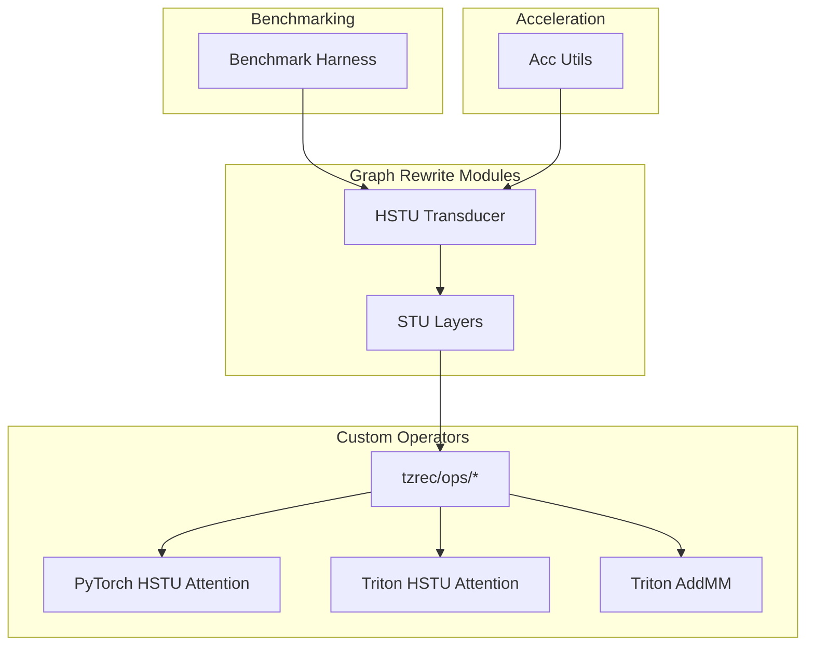
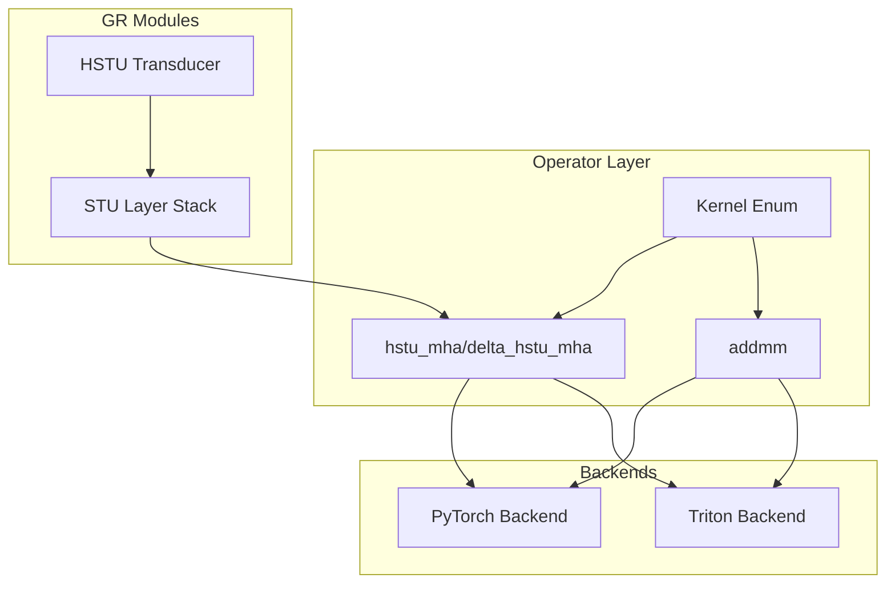
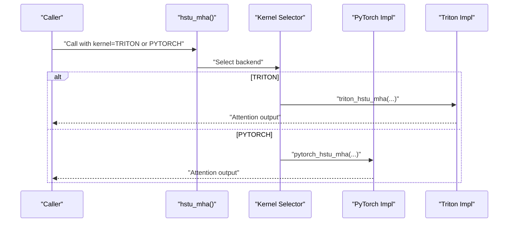
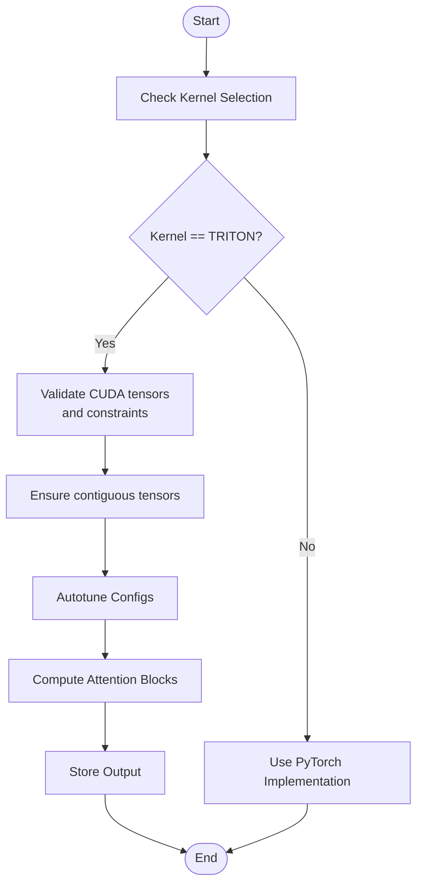
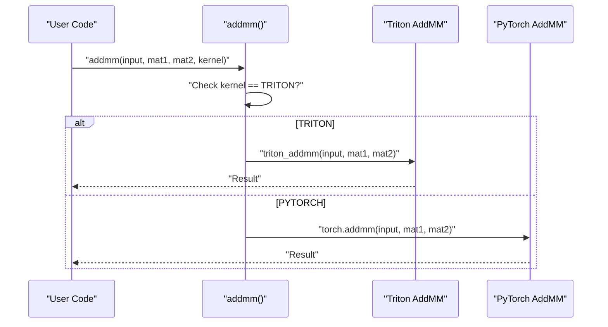
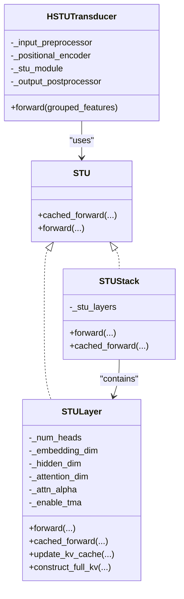
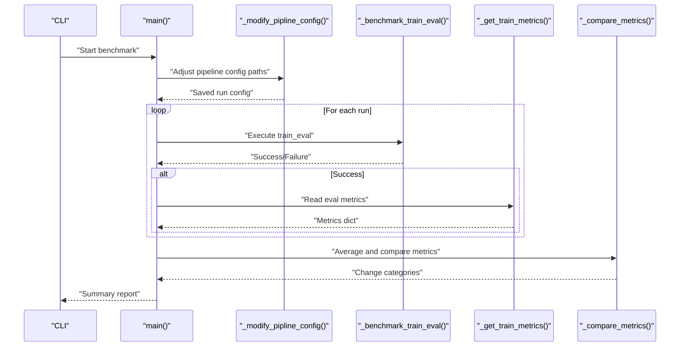
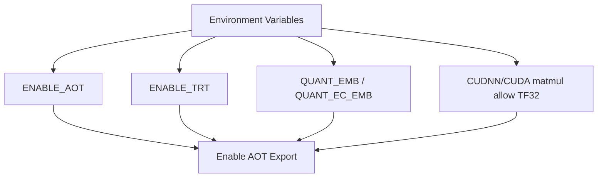
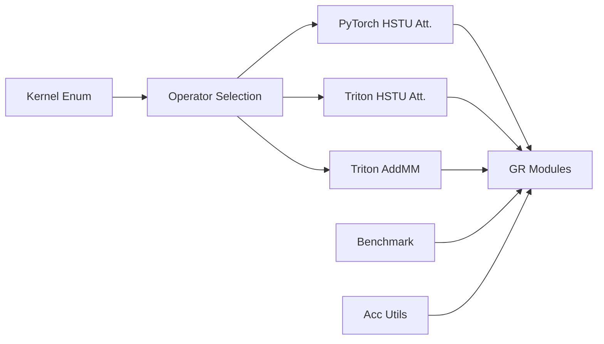

# Advanced Topics and Performance Optimization

<cite>
**Referenced Files in This Document**
- [tzrec/ops/__init__.py](file://tzrec/ops/__init__.py)
- [tzrec/ops/hstu_attention.py](file://tzrec/ops/hstu_attention.py)
- [tzrec/ops/_pytorch/pt_hstu_attention.py](file://tzrec/ops/_pytorch/pt_hstu_attention.py)
- [tzrec/ops/_triton/triton_hstu_attention.py](file://tzrec/ops/_triton/triton_hstu_attention.py)
- [tzrec/ops/mm.py](file://tzrec/ops/mm.py)
- [tzrec/ops/_triton/triton_addmm.py](file://tzrec/ops/_triton/triton_addmm.py)
- [tzrec/ops/utils.py](file://tzrec/ops/utils.py)
- [tzrec/modules/gr/stu.py](file://tzrec/modules/gr/stu.py)
- [tzrec/modules/gr/hstu_transducer.py](file://tzrec/modules/gr/hstu_transducer.py)
- [tzrec/benchmark/benchmark.py](file://tzrec/benchmark/benchmark.py)
- [tzrec/acc/utils.py](file://tzrec/acc/utils.py)
</cite>

## Table of Contents

1. [Introduction](#introduction)
1. [Project Structure](#project-structure)
1. [Core Components](#core-components)
1. [Architecture Overview](#architecture-overview)
1. [Detailed Component Analysis](#detailed-component-analysis)
1. [Dependency Analysis](#dependency-analysis)
1. [Performance Considerations](#performance-considerations)
1. [Troubleshooting Guide](#troubleshooting-guide)
1. [Conclusion](#conclusion)
1. [Appendices](#appendices)

## Introduction

This document focuses on TorchEasyRec’s advanced topics and performance optimization capabilities. It explains custom operator implementations (HSTU attention and matrix multiplication), the Graph Rewrite (GR) module system, benchmarking infrastructure, and acceleration utilities. It also covers specialized kernels, Triton integration, hardware-specific optimizations, advanced distributed training techniques, memory optimization strategies, and scaling considerations for large-scale deployments. Practical examples show how to leverage custom operators, optimize model performance, and utilize hardware acceleration effectively.

## Project Structure

TorchEasyRec organizes performance-critical components under:

- ops: Custom operators and kernels (PyTorch fallback and Triton implementations)
- modules/gr: Graph rewrite modules implementing HSTU transducer and STU layers
- benchmark: Automated benchmarking harness for training/evaluation comparisons
- acc: Acceleration utilities for TensorRT/AOT/quantization and environment toggles

**Diagram sources**

- \[tzrec/ops/hstu_attention.py\](file://tzrec/ops/hstu_attention.py#L29-L170)
- \[tzrec/ops/\_pytorch/pt_hstu_attention.py\](file://tzrec/ops/\_pytorch/pt_hstu_attention.py#L119-L226)
- \[tzrec/ops/\_triton/triton_hstu_attention.py\](file://tzrec/ops/\_triton/triton_hstu_attention.py#L588-L685)
- \[tzrec/ops/mm.py\](file://tzrec/ops/mm.py#L21-L33)
- \[tzrec/ops/\_triton/triton_addmm.py\](file://tzrec/ops/\_triton/triton_addmm.py#L160-L326)
- \[tzrec/modules/gr/stu.py\](file://tzrec/modules/gr/stu.py#L172-L578)
- \[tzrec/modules/gr/hstu_transducer.py\](file://tzrec/modules/gr/hstu_transducer.py#L35-L282)
- \[tzrec/benchmark/benchmark.py\](file://tzrec/benchmark/benchmark.py#L255-L338)
- \[tzrec/acc/utils.py\](file://tzrec/acc/utils.py#L190-L228)

**Section sources**

- \[tzrec/ops/__init__.py\](file://tzrec/ops/__init__.py#L15-L22)
- \[tzrec/ops/hstu_attention.py\](file://tzrec/ops/hstu_attention.py#L29-L170)
- \[tzrec/ops/\_pytorch/pt_hstu_attention.py\](file://tzrec/ops/\_pytorch/pt_hstu_attention.py#L119-L226)
- \[tzrec/ops/\_triton/triton_hstu_attention.py\](file://tzrec/ops/\_triton/triton_hstu_attention.py#L588-L685)
- \[tzrec/ops/mm.py\](file://tzrec/ops/mm.py#L21-L33)
- \[tzrec/ops/\_triton/triton_addmm.py\](file://tzrec/ops/\_triton/triton_addmm.py#L160-L326)
- \[tzrec/modules/gr/stu.py\](file://tzrec/modules/gr/stu.py#L172-L578)
- \[tzrec/modules/gr/hstu_transducer.py\](file://tzrec/modules/gr/hstu_transducer.py#L35-L282)
- \[tzrec/benchmark/benchmark.py\](file://tzrec/benchmark/benchmark.py#L255-L338)
- \[tzrec/acc/utils.py\](file://tzrec/acc/utils.py#L190-L228)

## Core Components

- Kernel selection: An enum defines kernel backends (TRITON, PYTORCH, CUDA) enabling runtime switching for operators.
- HSTU attention: Provides both PyTorch and Triton implementations for masked, causal attention over jagged sequences with optional cached keys/values.
- Matrix multiplication: Triton-backed addmm operator with autotuning and fused broadcasting.
- GR modules: STU layer stack and HSTU transducer orchestrate preprocessing, positional encoding, attention, and postprocessing.
- Benchmarking: Automated training/evaluation runs with metric comparison against baselines.
- Acceleration utilities: Environment-driven toggles for TensorRT, AOT, quantization, and TF32.

**Section sources**

- \[tzrec/ops/__init__.py\](file://tzrec/ops/__init__.py#L15-L22)
- \[tzrec/ops/hstu_attention.py\](file://tzrec/ops/hstu_attention.py#L29-L170)
- \[tzrec/ops/\_pytorch/pt_hstu_attention.py\](file://tzrec/ops/\_pytorch/pt_hstu_attention.py#L119-L226)
- \[tzrec/ops/\_triton/triton_hstu_attention.py\](file://tzrec/ops/\_triton/triton_hstu_attention.py#L588-L685)
- \[tzrec/ops/mm.py\](file://tzrec/ops/mm.py#L21-L33)
- \[tzrec/ops/\_triton/triton_addmm.py\](file://tzrec/ops/\_triton/triton_addmm.py#L160-L326)
- \[tzrec/modules/gr/stu.py\](file://tzrec/modules/gr/stu.py#L172-L578)
- \[tzrec/modules/gr/hstu_transducer.py\](file://tzrec/modules/gr/hstu_transducer.py#L35-L282)
- \[tzrec/benchmark/benchmark.py\](file://tzrec/benchmark/benchmark.py#L255-L338)
- \[tzrec/acc/utils.py\](file://tzrec/acc/utils.py#L190-L228)

## Architecture Overview

The system integrates custom operators with GR modules to deliver high-performance, scalable recommendation models. Operators are selected via a Kernel enum and can be switched per operation. Triton kernels provide autotuned configurations and advanced features like TMA (Tensor Memory Access) when enabled.

**Diagram sources**

- \[tzrec/ops/__init__.py\](file://tzrec/ops/__init__.py#L15-L22)
- \[tzrec/ops/hstu_attention.py\](file://tzrec/ops/hstu_attention.py#L29-L170)
- \[tzrec/ops/mm.py\](file://tzrec/ops/mm.py#L21-L33)
- \[tzrec/ops/\_pytorch/pt_hstu_attention.py\](file://tzrec/ops/\_pytorch/pt_hstu_attention.py#L119-L226)
- \[tzrec/ops/\_triton/triton_hstu_attention.py\](file://tzrec/ops/\_triton/triton_hstu_attention.py#L588-L685)
- \[tzrec/ops/\_triton/triton_addmm.py\](file://tzrec/ops/\_triton/triton_addmm.py#L160-L326)
- \[tzrec/modules/gr/stu.py\](file://tzrec/modules/gr/stu.py#L172-L578)
- \[tzrec/modules/gr/hstu_transducer.py\](file://tzrec/modules/gr/hstu_transducer.py#L35-L282)

## Detailed Component Analysis

### HSTU Attention Mechanisms

HSTU attention supports both PyTorch and Triton backends, with contiguous memory layout enforcement and optional TMA usage. It provides masked, causal attention over jagged sequences and cached delta updates for efficient incremental inference.

Key capabilities:

- Contiguous tensor checks and conversions for Triton kernels
- Autotuning configurations for GPU architectures
- Support for contextual sequence length, multiple targets, and attention window limits
- Cached forward pass for incremental decoding

**Diagram sources**

- \[tzrec/ops/hstu_attention.py\](file://tzrec/ops/hstu_attention.py#L29-L105)
- \[tzrec/ops/\_pytorch/pt_hstu_attention.py\](file://tzrec/ops/\_pytorch/pt_hstu_attention.py#L119-L162)
- \[tzrec/ops/\_triton/triton_hstu_attention.py\](file://tzrec/ops/\_triton/triton_hstu_attention.py#L588-L685)

**Section sources**

- \[tzrec/ops/hstu_attention.py\](file://tzrec/ops/hstu_attention.py#L29-L170)
- \[tzrec/ops/\_pytorch/pt_hstu_attention.py\](file://tzrec/ops/\_pytorch/pt_hstu_attention.py#L119-L226)
- \[tzrec/ops/\_triton/triton_hstu_attention.py\](file://tzrec/ops/\_triton/triton_hstu_attention.py#L588-L685)
- \[tzrec/ops/utils.py\](file://tzrec/ops/utils.py#L18-L35)

### Triton HSTU Attention Implementation

The Triton implementation includes:

- Autotune configurations for NVIDIA and ROCm/HIP backends
- Block-wise computation with causal masking, optional multiple targets, and contextual sequence handling
- Optional TMA usage for improved memory access patterns
- Forward and backward passes with atomic accumulation when needed

**Diagram sources**

- \[tzrec/ops/hstu_attention.py\](file://tzrec/ops/hstu_attention.py#L57-L104)
- \[tzrec/ops/\_triton/triton_hstu_attention.py\](file://tzrec/ops/\_triton/triton_hstu_attention.py#L46-L244)
- \[tzrec/ops/\_triton/triton_hstu_attention.py\](file://tzrec/ops/\_triton/triton_hstu_attention.py#L588-L685)

**Section sources**

- \[tzrec/ops/\_triton/triton_hstu_attention.py\](file://tzrec/ops/\_triton/triton_hstu_attention.py#L46-L244)
- \[tzrec/ops/\_triton/triton_hstu_attention.py\](file://tzrec/ops/\_triton/triton_hstu_attention.py#L588-L685)

### Matrix Multiplication Optimizations

The addmm operator provides a Triton-accelerated path with autotuning and broadcasting support. It wraps a custom autograd function to preserve gradients and integrates seamlessly with the Kernel enum.

**Diagram sources**

- \[tzrec/ops/mm.py\](file://tzrec/ops/mm.py#L21-L33)
- \[tzrec/ops/\_triton/triton_addmm.py\](file://tzrec/ops/\_triton/triton_addmm.py#L160-L326)

**Section sources**

- \[tzrec/ops/mm.py\](file://tzrec/ops/mm.py#L21-L33)
- \[tzrec/ops/\_triton/triton_addmm.py\](file://tzrec/ops/\_triton/triton_addmm.py#L160-L326)

### Graph Rewrite (GR) Module System

The GR modules implement the HSTU transducer with:

- Input preprocessing and optional positional encoding
- STU layer stacks supporting cached forward for incremental decoding
- Output postprocessing and candidate extraction
- Integration with fbgemm jagged utilities for variable-length sequences

**Diagram sources**

- \[tzrec/modules/gr/stu.py\](file://tzrec/modules/gr/stu.py#L34-L578)
- \[tzrec/modules/gr/hstu_transducer.py\](file://tzrec/modules/gr/hstu_transducer.py#L35-L282)

**Section sources**

- \[tzrec/modules/gr/stu.py\](file://tzrec/modules/gr/stu.py#L172-L578)
- \[tzrec/modules/gr/hstu_transducer.py\](file://tzrec/modules/gr/hstu_transducer.py#L35-L282)

### Benchmarking Infrastructure

The benchmark harness automates training/evaluation runs, modifies pipeline configs for environments, and compares metrics against baseline thresholds. It prints categorized results and aggregates statistics.

**Diagram sources**

- \[tzrec/benchmark/benchmark.py\](file://tzrec/benchmark/benchmark.py#L255-L338)

**Section sources**

- \[tzrec/benchmark/benchmark.py\](file://tzrec/benchmark/benchmark.py#L255-L338)

### Acceleration Utilities

Environment-driven toggles enable acceleration features:

- TensorRT and AOT enablement
- Quantization settings for embeddings
- TF32 allowance for cuDNN and CUDA matmul

**Diagram sources**

- \[tzrec/acc/utils.py\](file://tzrec/acc/utils.py#L51-L228)

**Section sources**

- \[tzrec/acc/utils.py\](file://tzrec/acc/utils.py#L51-L228)

## Dependency Analysis

Operators depend on the Kernel enum and backend-specific implementations. GR modules depend on operators and fbgemm utilities for jagged tensors. Benchmarking depends on pipeline configuration and environment variables. Acceleration utilities depend on environment variables and training config.

**Diagram sources**

- \[tzrec/ops/__init__.py\](file://tzrec/ops/__init__.py#L15-L22)
- \[tzrec/ops/hstu_attention.py\](file://tzrec/ops/hstu_attention.py#L29-L170)
- \[tzrec/ops/mm.py\](file://tzrec/ops/mm.py#L21-L33)
- \[tzrec/modules/gr/stu.py\](file://tzrec/modules/gr/stu.py#L172-L578)
- \[tzrec/modules/gr/hstu_transducer.py\](file://tzrec/modules/gr/hstu_transducer.py#L35-L282)
- \[tzrec/benchmark/benchmark.py\](file://tzrec/benchmark/benchmark.py#L255-L338)
- \[tzrec/acc/utils.py\](file://tzrec/acc/utils.py#L190-L228)

**Section sources**

- \[tzrec/ops/__init__.py\](file://tzrec/ops/__init__.py#L15-L22)
- \[tzrec/ops/hstu_attention.py\](file://tzrec/ops/hstu_attention.py#L29-L170)
- \[tzrec/ops/mm.py\](file://tzrec/ops/mm.py#L21-L33)
- \[tzrec/modules/gr/stu.py\](file://tzrec/modules/gr/stu.py#L172-L578)
- \[tzrec/modules/gr/hstu_transducer.py\](file://tzrec/modules/gr/hstu_transducer.py#L35-L282)
- \[tzrec/benchmark/benchmark.py\](file://tzrec/benchmark/benchmark.py#L255-L338)
- \[tzrec/acc/utils.py\](file://tzrec/acc/utils.py#L190-L228)

## Performance Considerations

- Kernel selection: Prefer TRITON for compute-heavy operators (attention, addmm) on supported GPUs; fall back to PYTORCH for compatibility.
- Contiguous tensors: Ensure inputs are contiguous before invoking Triton kernels to avoid overhead.
- Autotuning: Allow Triton autotune to select optimal configs per problem size and architecture.
- TMA: Enable when supported by hardware/backends to improve memory throughput.
- TF32: Enable TF32 for matmul/cuDNN when precision allows to gain speed.
- Quantization: Use quantized embeddings for reduced memory bandwidth and latency.
- Caching: Use STU cached forward for incremental decoding to avoid recomputing KV pairs.
- Distributed training: Combine GR modules with distributed strategies; monitor communication overhead and gradient synchronization costs.
- Memory optimization: Use jagged tensors and targeted masking to minimize padding and redundant computations.

[No sources needed since this section provides general guidance]

## Troubleshooting Guide

Common issues and resolutions:

- Triton assertion failures: Verify inputs are CUDA tensors and meet operator constraints (e.g., dropout disabled in Triton path).
- Contiguity errors: Call the contiguous conversion utility before Triton kernels.
- Autotune mismatches: Ensure static max sequence lengths are configured or runtime mode is enabled.
- Environment toggles: Confirm environment variables for TRT/AOT/quantization are set correctly.
- Benchmark failures: Check pipeline config paths and quotas; ensure ODPS project and quota names are present.

**Section sources**

- \[tzrec/ops/hstu_attention.py\](file://tzrec/ops/hstu_attention.py#L57-L104)
- \[tzrec/ops/utils.py\](file://tzrec/ops/utils.py#L18-L35)
- \[tzrec/acc/utils.py\](file://tzrec/acc/utils.py#L51-L118)
- \[tzrec/benchmark/benchmark.py\](file://tzrec/benchmark/benchmark.py#L60-L124)

## Conclusion

TorchEasyRec’s advanced performance features combine custom operator implementations (HSTU attention and addmm), Triton autotuning, and the GR module system to achieve high throughput and scalability. By leveraging kernel selection, TMA, TF32, quantization, and caching, practitioners can optimize both training and inference. The benchmarking and acceleration utilities further streamline deployment and experimentation across diverse hardware environments.

[No sources needed since this section summarizes without analyzing specific files]

## Appendices

- Practical examples:
  - Select TRITON kernel for HSTU attention and addmm to accelerate training/inference.
  - Enable TMA via environment utilities when supported by the backend.
  - Use cached STU forward for incremental decoding in retrieval scenarios.
  - Configure autotune max sequence lengths for stable performance tuning.
  - Toggle TRT/AOT/quantization via environment variables for production exports.

[No sources needed since this section provides general guidance]
