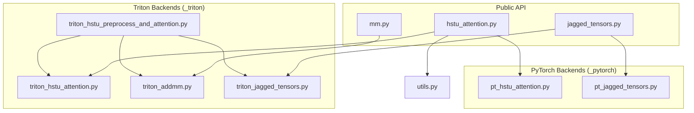
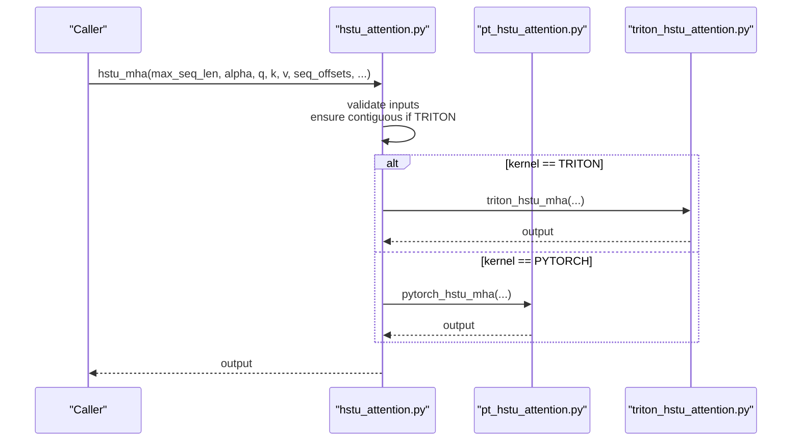
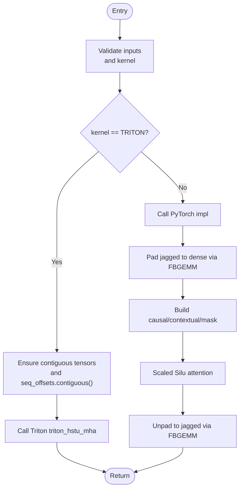
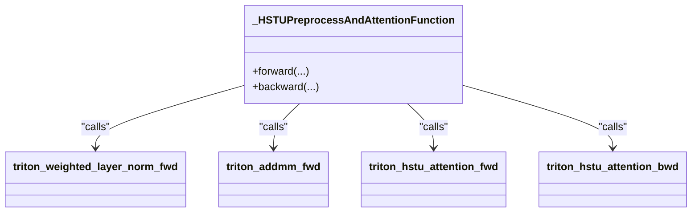
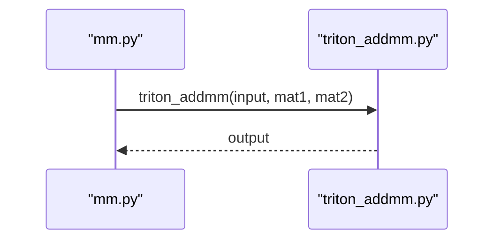
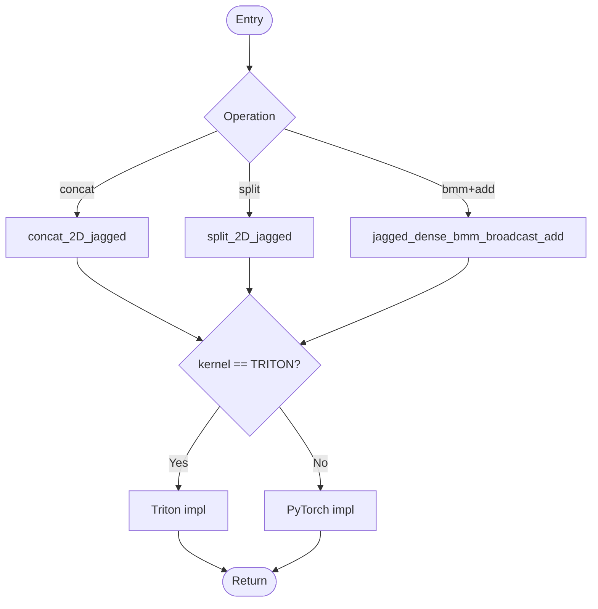
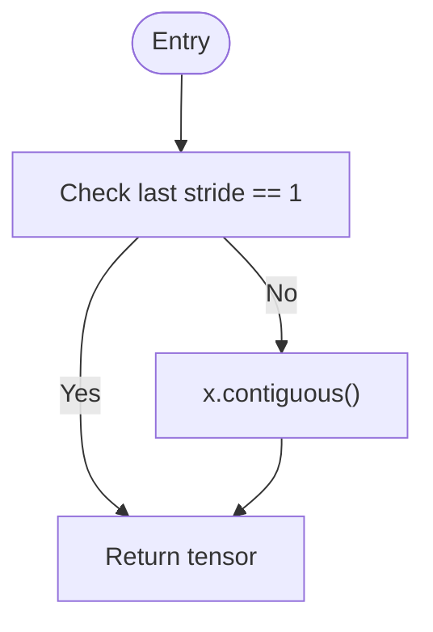
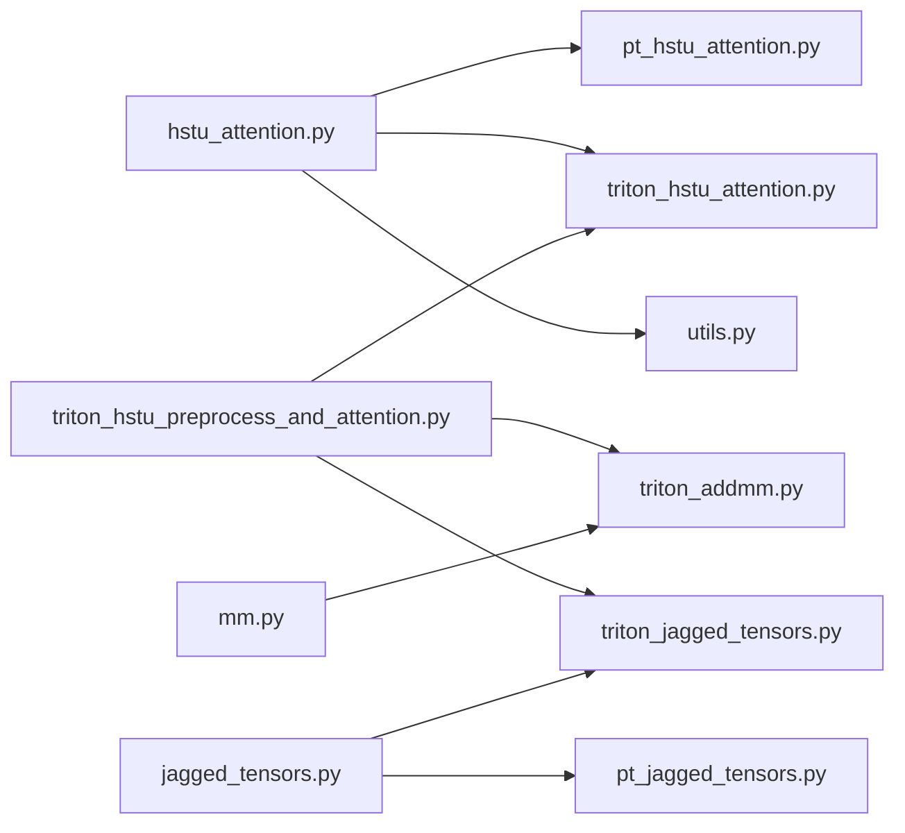

# Custom Operators and Low-Level Optimizations

<cite>
**Referenced Files in This Document**
- [ops/__init__.py](file://tzrec/ops/__init__.py)
- [ops/hstu_attention.py](file://tzrec/ops/hstu_attention.py)
- [ops/_pytorch/pt_hstu_attention.py](file://tzrec/ops/_pytorch/pt_hstu_attention.py)
- [ops/_triton/triton_hstu_attention.py](file://tzrec/ops/_triton/triton_hstu_attention.py)
- [ops/_triton/triton_hstu_preprocess_and_attention.py](file://tzrec/ops/_triton/triton_hstu_preprocess_and_attention.py)
- [ops/mm.py](file://tzrec/ops/mm.py)
- [ops/_triton/triton_addmm.py](file://tzrec/ops/_triton/triton_addmm.py)
- [ops/jagged_tensors.py](file://tzrec/ops/jagged_tensors.py)
- [ops/_pytorch/pt_jagged_tensors.py](file://tzrec/ops/_pytorch/pt_jagged_tensors.py)
- [ops/_triton/triton_jagged_tensors.py](file://tzrec/ops/_triton/triton_jagged_tensors.py)
- [ops/utils.py](file://tzrec/ops/utils.py)
- [ops/benchmarks/hstu_attention_bench.py](file://tzrec/ops/benchmarks/hstu_attention_bench.py)
</cite>

## Table of Contents

1. [Introduction](#introduction)
1. [Project Structure](#project-structure)
1. [Core Components](#core-components)
1. [Architecture Overview](#architecture-overview)
1. [Detailed Component Analysis](#detailed-component-analysis)
1. [Dependency Analysis](#dependency-analysis)
1. [Performance Considerations](#performance-considerations)
1. [Troubleshooting Guide](#troubleshooting-guide)
1. [Conclusion](#conclusion)
1. [Appendices](#appendices)

## Introduction

This document explains TorchEasyRec’s custom operators and low-level optimizations, focusing on the HSTU attention mechanism and related primitives. It covers both PyTorch and Triton implementations, their differences, kernel selection strategies, hardware-aware autotuning, memory layout requirements, and integration within the broader TorchEasyRec ecosystem. Practical guidance is provided for choosing Triton versus PyTorch kernels, configuring operator variants, and profiling performance.

## Project Structure

The custom operators live under the ops package, organized by backend:

- Public API and kernel selection: hstu_attention.py, mm.py, jagged_tensors.py
- PyTorch implementations: \_pytorch/\*
- Triton implementations: \_triton/\*
- Utilities: utils.py
- Benchmarks: benchmarks/hstu_attention_bench.py

**Diagram sources**

- \[ops/hstu_attention.py\](file://tzrec/ops/hstu_attention.py#L29-L170)
- \[ops/mm.py\](file://tzrec/ops/mm.py#L21-L33)
- \[ops/jagged_tensors.py\](file://tzrec/ops/jagged_tensors.py#L29-L167)
- \[ops/\_pytorch/pt_hstu_attention.py\](file://tzrec/ops/\_pytorch/pt_hstu_attention.py#L119-L226)
- \[ops/\_triton/triton_hstu_attention.py\](file://tzrec/ops/\_triton/triton_hstu_attention.py#L588-L685)
- \[ops/\_triton/triton_hstu_preprocess_and_attention.py\](file://tzrec/ops/\_triton/triton_hstu_preprocess_and_attention.py#L37-L347)
- \[ops/\_triton/triton_addmm.py\](file://tzrec/ops/\_triton/triton_addmm.py#L28-L158)
- \[ops/\_triton/triton_jagged_tensors.py\](file://tzrec/ops/\_triton/triton_jagged_tensors.py)
- \[ops/\_pytorch/pt_jagged_tensors.py\](file://tzrec/ops/\_pytorch/pt_jagged_tensors.py)
- \[ops/utils.py\](file://tzrec/ops/utils.py#L18-L79)

**Section sources**

- \[ops/__init__.py\](file://tzrec/ops/__init__.py#L15-L22)
- \[ops/hstu_attention.py\](file://tzrec/ops/hstu_attention.py#L29-L170)
- \[ops/mm.py\](file://tzrec/ops/mm.py#L21-L33)
- \[ops/jagged_tensors.py\](file://tzrec/ops/jagged_tensors.py#L29-L167)

## Core Components

- HSTU Multihead Attention: supports full and incremental (cached) attention over jagged sequences with configurable masking and targets.
- Matrix Multiply (Addmm): fused dense linear-like operation optimized via Triton.
- Jagged Tensor Ops: concatenation, splitting, and batched matmul with broadcasting over ragged shapes.
- Utilities: contiguous tensor promotion, autotuning helpers, and static/range-based max sequence length selection.

Key capabilities:

- Kernel selection via a unified enum.
- Hardware-aware Triton autotuning with separate configs for CUDA and ROCm/HIP.
- Memory layout checks and contiguity enforcement for Triton paths.
- FBGEMM-backed padding/unpadding for PyTorch paths.

**Section sources**

- \[ops/__init__.py\](file://tzrec/ops/__init__.py#L15-L22)
- \[ops/hstu_attention.py\](file://tzrec/ops/hstu_attention.py#L29-L170)
- \[ops/mm.py\](file://tzrec/ops/mm.py#L21-L33)
- \[ops/jagged_tensors.py\](file://tzrec/ops/jagged_tensors.py#L29-L167)
- \[ops/utils.py\](file://tzrec/ops/utils.py#L18-L79)

## Architecture Overview

The public API routes to PyTorch or Triton backends depending on the selected kernel. Triton implementations use autotuned configs and optional TMA (Tensor Memory Access) for GPU architectures that support it. PyTorch paths rely on FBGEMM for efficient padding/unpadding of jagged tensors.

**Diagram sources**

- \[ops/hstu_attention.py\](file://tzrec/ops/hstu_attention.py#L46-L104)
- \[ops/\_pytorch/pt_hstu_attention.py\](file://tzrec/ops/\_pytorch/pt_hstu_attention.py#L119-L162)
- \[ops/\_triton/triton_hstu_attention.py\](file://tzrec/ops/\_triton/triton_hstu_attention.py#L588-L685)

## Detailed Component Analysis

### HSTU Attention Mechanism

- Full attention: pads jagged sequences to dense, computes scaled silu attention, applies causal and optional contextual/target masks, then unpad to jagged.
- Incremental/cached attention: operates on a sliding window delta query against full keys/values.
- Triton path: autotuned kernels with block sizes and stages tuned per device; optional TMA for supported GPUs; supports multiple target lengths and contextual sequence windows.

**Diagram sources**

- \[ops/hstu_attention.py\](file://tzrec/ops/hstu_attention.py#L46-L104)
- \[ops/\_pytorch/pt_hstu_attention.py\](file://tzrec/ops/\_pytorch/pt_hstu_attention.py#L77-L162)
- \[ops/\_triton/triton_hstu_attention.py\](file://tzrec/ops/\_triton/triton_hstu_attention.py#L588-L685)

**Section sources**

- \[ops/hstu_attention.py\](file://tzrec/ops/hstu_attention.py#L29-L170)
- \[ops/\_pytorch/pt_hstu_attention.py\](file://tzrec/ops/\_pytorch/pt_hstu_attention.py#L119-L226)
- \[ops/\_triton/triton_hstu_attention.py\](file://tzrec/ops/\_triton/triton_hstu_attention.py#L247-L685)

### Triton HSTU Preprocess-and-Attention Function

A fused autograd function that:

- Normalizes input with weighted layer norm.
- Computes UVQK projection via Triton addmm.
- Splits into U, V, Q, K and runs Triton attention with optional sorting by length and TMA.

**Diagram sources**

- \[ops/\_triton/triton_hstu_preprocess_and_attention.py\](file://tzrec/ops/\_triton/triton_hstu_preprocess_and_attention.py#L37-L347)
- \[ops/\_triton/triton_addmm.py\](file://tzrec/ops/\_triton/triton_addmm.py#L236-L279)
- \[ops/\_triton/triton_hstu_attention.py\](file://tzrec/ops/\_triton/triton_hstu_attention.py#L588-L685)

**Section sources**

- \[ops/\_triton/triton_hstu_preprocess_and_attention.py\](file://tzrec/ops/\_triton/triton_hstu_preprocess_and_attention.py#L37-L347)

### Matrix Multiplication Optimizations (Addmm)

- PyTorch path: standard torch.addmm.
- Triton path: autotuned tile sizes and stages; supports 1D broadcast of y; TF32 allowance follows backend settings.

**Diagram sources**

- \[ops/mm.py\](file://tzrec/ops/mm.py#L21-L33)
- \[ops/\_triton/triton_addmm.py\](file://tzrec/ops/\_triton/triton_addmm.py#L320-L326)

**Section sources**

- \[ops/mm.py\](file://tzrec/ops/mm.py#L21-L33)
- \[ops/\_triton/triton_addmm.py\](file://tzrec/ops/\_triton/triton_addmm.py#L28-L158)
- \[ops/\_triton/triton_addmm.py\](file://tzrec/ops/\_triton/triton_addmm.py#L236-L279)

### Jagged Tensor Operations

- Concatenation/Splitting: supports offsets or explicit max lengths; PyTorch uses FBGEMM conversions.
- Ragged-dense batched matmul with broadcast bias: PyTorch path leverages FBGEMM; Triton path provides an optimized kernel.

**Diagram sources**

- \[ops/jagged_tensors.py\](file://tzrec/ops/jagged_tensors.py#L29-L167)
- \[ops/\_pytorch/pt_jagged_tensors.py\](file://tzrec/ops/\_pytorch/pt_jagged_tensors.py)
- \[ops/\_triton/triton_jagged_tensors.py\](file://tzrec/ops/\_triton/triton_jagged_tensors.py)

**Section sources**

- \[ops/jagged_tensors.py\](file://tzrec/ops/jagged_tensors.py#L29-L167)

### Utilities and Autotuning

- Contiguous promotion: ensures last dimension stride is 1 for Triton kernels.
- Power-of-two autotuning: quantizes max sequence length for Triton configs.
- Static/runtime tuning: allows fixed lists of max lengths or runtime selection.

**Diagram sources**

- \[ops/utils.py\](file://tzrec/ops/utils.py#L18-L35)

**Section sources**

- \[ops/utils.py\](file://tzrec/ops/utils.py#L18-L79)

## Dependency Analysis

- Public API depends on kernel selection and delegates to backend modules.
- Triton attention depends on autotuning configs and optional TMA support.
- PyTorch attention depends on FBGEMM for jagged-to-padded and dense-to-jagged conversions.
- Preprocess-and-attention function composes layer norm, addmm, and attention kernels.

**Diagram sources**

- \[ops/hstu_attention.py\](file://tzrec/ops/hstu_attention.py#L21-L26)
- \[ops/\_triton/triton_hstu_preprocess_and_attention.py\](file://tzrec/ops/\_triton/triton_hstu_preprocess_and_attention.py#L22-L34)
- \[ops/jagged_tensors.py\](file://tzrec/ops/jagged_tensors.py#L21-L26)
- \[ops/mm.py\](file://tzrec/ops/mm.py#L18-L25)

**Section sources**

- \[ops/hstu_attention.py\](file://tzrec/ops/hstu_attention.py#L21-L26)
- \[ops/\_triton/triton_hstu_preprocess_and_attention.py\](file://tzrec/ops/\_triton/triton_hstu_preprocess_and_attention.py#L22-L34)
- \[ops/jagged_tensors.py\](file://tzrec/ops/jagged_tensors.py#L21-L26)
- \[ops/mm.py\](file://tzrec/ops/mm.py#L18-L25)

## Performance Considerations

- Triton vs PyTorch:
  - Triton: highly autotuned tiles, optional TMA, lower overhead for small to medium sequences, strong on modern GPUs with TMA support.
  - PyTorch: simpler, broadly compatible, relies on FBGEMM for efficient padding/unpadding.
- Kernel selection strategy:
  - Use TRITON for latency-sensitive paths and when tensors are contiguous; PyTorch for portability or when contiguity is not guaranteed.
  - Enable TMA when available and beneficial for the workload.
- Hardware-specific optimizations:
  - Separate Triton configs for CUDA and ROCm/HIP; autotuning keys include sequence length quantization and head counts.
- Memory layout:
  - Ensure tensors are contiguous along innermost dimension for Triton; the utils module enforces this automatically.
- Profiling:
  - Use the provided benchmark script to compare Triton and PyTorch across sequence lengths, data types, and modes (forward/backward).

Practical guidance:

- Choose TRITON when:
  - Inputs are contiguous and on CUDA/ROCm with TMA-friendly kernels.
  - Targeting latency reduction for typical recommendation workloads.
- Choose PYTORCH when:
  - Rapid prototyping, mixed contiguity, or environments without Triton availability.

**Section sources**

- \[ops/hstu_attention.py\](file://tzrec/ops/hstu_attention.py#L57-L104)
- \[ops/\_triton/triton_hstu_attention.py\](file://tzrec/ops/\_triton/triton_hstu_attention.py#L46-L244)
- \[ops/utils.py\](file://tzrec/ops/utils.py#L18-L35)
- \[ops/benchmarks/hstu_attention_bench.py\](file://tzrec/ops/benchmarks/hstu_attention_bench.py#L101-L312)

## Troubleshooting Guide

Common issues and resolutions:

- Triton assertions:
  - Ensure tensors are CUDA for TRITON path; contiguous tensors are enforced for TRITON.
  - Dropout is not implemented in the TRITON path; set dropout_pr to zero.
  - min_full_attn_seq_len is not implemented in TRITON path.
- Contiguity errors:
  - Use the provided contiguous enforcement utility to avoid stride-related failures.
- Shape mismatches:
  - Validate that jagged and offsets align with batch size and sequence lengths.
- Autotuning failures:
  - Confirm max sequence length quantization and static lists are configured appropriately.

**Section sources**

- \[ops/hstu_attention.py\](file://tzrec/ops/hstu_attention.py#L57-L104)
- \[ops/utils.py\](file://tzrec/ops/utils.py#L18-L35)

## Conclusion

TorchEasyRec’s custom operators deliver high-performance, production-ready kernels for recommendation workloads. The HSTU attention mechanism is available in both PyTorch and Triton variants, with Triton offering significant speedups through autotuning and optional TMA. The public API centralizes kernel selection and integrates seamlessly with FBGEMM-based jagged tensor handling in PyTorch. By following the configuration and profiling guidance, users can select the optimal kernel for their hardware and workload.

## Appendices

### Practical Configuration Examples

- Selecting kernels:
  - Use the Kernel enum to pick TRITON or PYTORCH.
- Enabling TMA:
  - Pass enable_tma=True when invoking Triton attention functions.
- Contiguity:
  - The API automatically ensures contiguous tensors for Triton; ensure inputs meet this requirement before calling.

**Section sources**

- \[ops/__init__.py\](file://tzrec/ops/__init__.py#L15-L22)
- \[ops/hstu_attention.py\](file://tzrec/ops/hstu_attention.py#L44-L88)
- \[ops/utils.py\](file://tzrec/ops/utils.py#L18-L35)

### Benchmarking Workflow

- Run the benchmark script to compare Triton and PyTorch across sequence lengths, data types, and modes.
- Use the generated plots and CSV outputs to guide kernel selection and tuning.

**Section sources**

- \[ops/benchmarks/hstu_attention_bench.py\](file://tzrec/ops/benchmarks/hstu_attention_bench.py#L101-L312)
