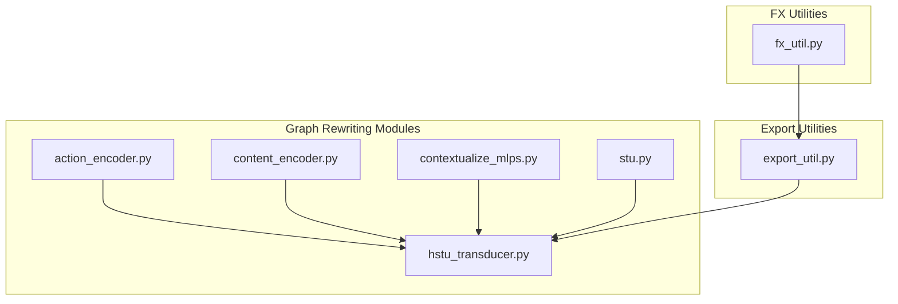
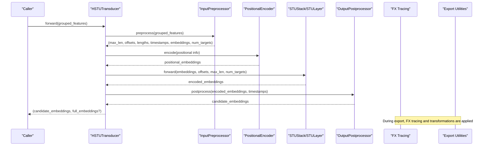
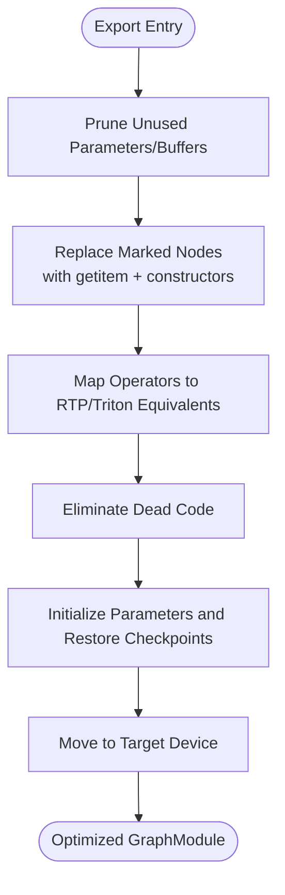
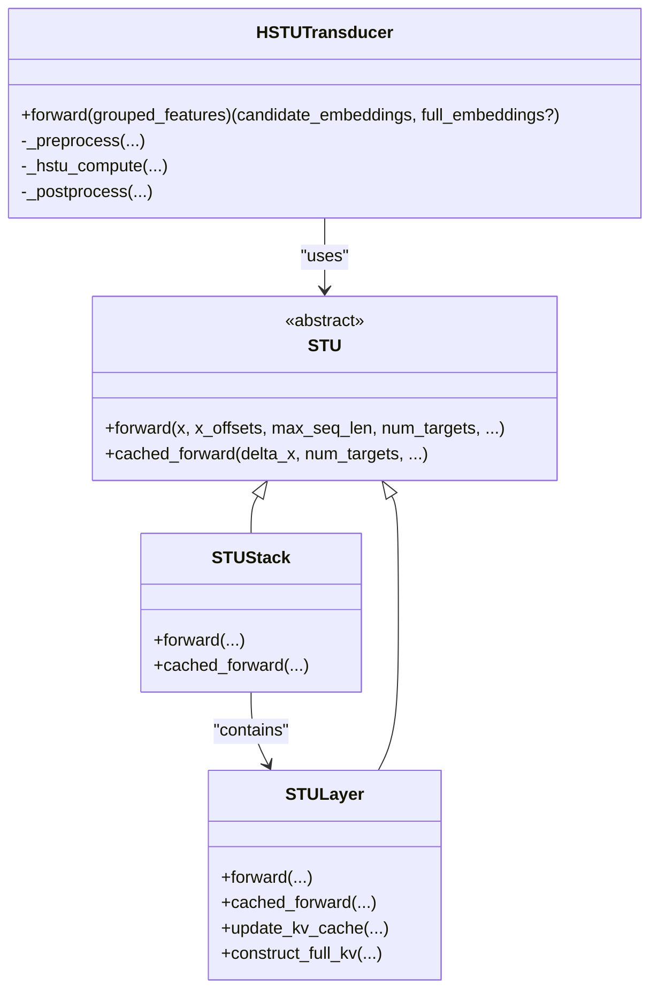
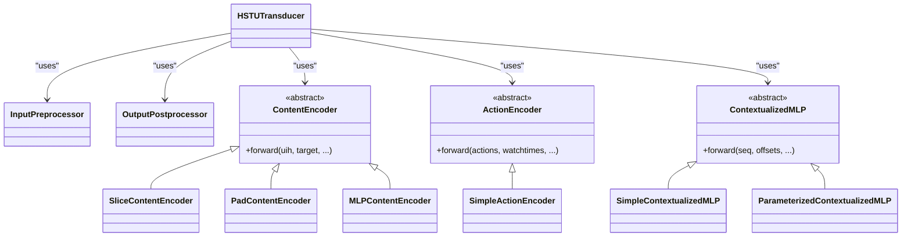
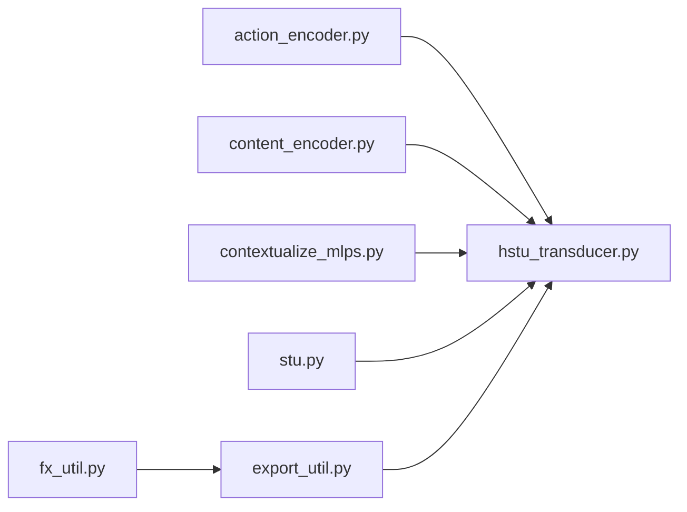

# Graph Rewriting and Model Optimization

<cite>
**Referenced Files in This Document**
- [fx_util.py](file://tzrec/utils/fx_util.py)
- [export_util.py](file://tzrec/utils/export_util.py)
- [action_encoder.py](file://tzrec/modules/gr/action_encoder.py)
- [content_encoder.py](file://tzrec/modules/gr/content_encoder.py)
- [contextualize_mlps.py](file://tzrec/modules/gr/contextualize_mlps.py)
- [hstu_transducer.py](file://tzrec/modules/gr/hstu_transducer.py)
- [stu.py](file://tzrec/modules/gr/stu.py)
</cite>

## Table of Contents

1. [Introduction](#introduction)
1. [Project Structure](#project-structure)
1. [Core Components](#core-components)
1. [Architecture Overview](#architecture-overview)
1. [Detailed Component Analysis](#detailed-component-analysis)
1. [Dependency Analysis](#dependency-analysis)
1. [Performance Considerations](#performance-considerations)
1. [Troubleshooting Guide](#troubleshooting-guide)
1. [Conclusion](#conclusion)
1. [Appendices](#appendices)

## Introduction

This document explains TorchEasyRec’s graph rewriting (GR) system and model optimization capabilities with a focus on FX tracing integration, custom graph transformations, and automatic optimization passes during model compilation. It details how graph rewrite rules are applied, how pattern matching enables optimization opportunities, and how the system integrates with TorchScript compilation. The document also covers the relationship between graph rewriting and performance gains, including when specific optimizations are applied and their impact on model execution. Practical guidance is provided for implementing custom graph rewrites, debugging transformations, and deploying optimized models in production, while maintaining correctness and balancing optimization aggressiveness.

## Project Structure

The GR system resides primarily under the modules/gr package and integrates with utilities for FX tracing and export-time transformations. The key areas are:

- FX tracing utilities for symbolic tracing and trace-time wrappers
- Export utilities that apply graph transformations and optimize exports
- GR modules for preprocessing, content encoding, action encoding, and sequential transduction (STU)
- HSTU transducer that orchestrates preprocessing, positional encoding, STU layers, and postprocessing

**Diagram sources**

- \[fx_util.py\](file://tzrec/utils/fx_util.py#L19-L46)
- \[export_util.py\](file://tzrec/utils/export_util.py#L108-L200)
- \[action_encoder.py\](file://tzrec/modules/gr/action_encoder.py#L27-L67)
- \[content_encoder.py\](file://tzrec/modules/gr/content_encoder.py#L28-L63)
- \[contextualize_mlps.py\](file://tzrec/modules/gr/contextualize_mlps.py#L28-L50)
- \[hstu_transducer.py\](file://tzrec/modules/gr/hstu_transducer.py#L35-L98)
- \[stu.py\](file://tzrec/modules/gr/stu.py#L34-L80)

**Section sources**

- \[fx_util.py\](file://tzrec/utils/fx_util.py#L19-L46)
- \[export_util.py\](file://tzrec/utils/export_util.py#L108-L200)
- \[action_encoder.py\](file://tzrec/modules/gr/action_encoder.py#L27-L67)
- \[content_encoder.py\](file://tzrec/modules/gr/content_encoder.py#L28-L63)
- \[contextualize_mlps.py\](file://tzrec/modules/gr/contextualize_mlps.py#L28-L50)
- \[hstu_transducer.py\](file://tzrec/modules/gr/hstu_transducer.py#L35-L98)
- \[stu.py\](file://tzrec/modules/gr/stu.py#L34-L80)

## Core Components

- FX tracing integration: Provides a symbolic tracing API and trace-time wrappers for safe graph construction and export-time marking.
- Export-time graph transformations: Applies pruning, marking, and operator mapping to prepare models for TorchScript/Triton/AOT compilation.
- GR modules: Preprocessors, content encoders, action encoders, and contextualized MLPs that shape input sequences and contextual features.
- HSTU transducer: Orchestrates the full pipeline from grouped features to candidate embeddings via preprocessing, positional encoding, STU layers, and postprocessing.
- STU layers: Jagged sequential transduction units with attention and KV caching for efficient incremental inference.

Key responsibilities:

- FX tracing: Ensures modules like ComputeJTDictToKJT are excluded from tracing and wraps helper functions for trace compatibility.
- Export-time transformations: Prunes unused parameters, marks tensors for sparse/dense separation, maps operators for RTP/Triton, and eliminates dead code.
- GR pipeline: Aligns user history and candidate sequences, applies positional encoding, runs STU layers, and splits outputs for scoring.

**Section sources**

- \[fx_util.py\](file://tzrec/utils/fx_util.py#L19-L46)
- \[export_util.py\](file://tzrec/utils/export_util.py#L326-L339)
- \[export_util.py\](file://tzrec/utils/export_util.py#L827-L894)
- \[hstu_transducer.py\](file://tzrec/modules/gr/hstu_transducer.py#L99-L151)
- \[hstu_transducer.py\](file://tzrec/modules/gr/hstu_transducer.py#L153-L169)
- \[hstu_transducer.py\](file://tzrec/modules/gr/hstu_transducer.py#L171-L228)
- \[stu.py\](file://tzrec/modules/gr/stu.py#L172-L237)

## Architecture Overview

The GR system integrates FX tracing and export-time transformations to produce optimized, TorchScript-compatible models. The flow below shows how the HSTU transducer coordinates preprocessing, positional encoding, STU layers, and postprocessing, while export utilities transform the graph for deployment.

**Diagram sources**

- \[hstu_transducer.py\](file://tzrec/modules/gr/hstu_transducer.py#L230-L281)
- \[hstu_transducer.py\](file://tzrec/modules/gr/hstu_transducer.py#L99-L151)
- \[hstu_transducer.py\](file://tzrec/modules/gr/hstu_transducer.py#L153-L169)
- \[hstu_transducer.py\](file://tzrec/modules/gr/hstu_transducer.py#L171-L228)
- \[fx_util.py\](file://tzrec/utils/fx_util.py#L19-L46)
- \[export_util.py\](file://tzrec/utils/export_util.py#L326-L339)

## Detailed Component Analysis

### FX Tracing Integration

- Symbolic tracing API: Wraps torchrec.fx symbolic_trace with a leaf module exclusion list to avoid tracing unsupported modules.
- Trace-time wrappers: Provide wrappers for arange, optional tensor unwrapping, int conversion, numel, and marking functions for KeyedTensor and regular tensors to aid export-time graph surgery.

Implementation highlights:

- Excludes specific modules from tracing to prevent tracing failures.
- Adds wrappers for operations that must remain as callable nodes in the FX graph for later transformations.

**Section sources**

- \[fx_util.py\](file://tzrec/utils/fx_util.py#L19-L46)
- \[fx_util.py\](file://tzrec/utils/fx_util.py#L49-L124)

### Export-Time Graph Transformations

- Unused parameter pruning: Builds a new root module containing only referenced submodules and attributes to reduce model footprint.
- Tensor marking and reconstruction: Replaces marked nodes with proper getitem and constructor calls to separate sparse and dense parts for export.
- Operator mapping for RTP/Triton: Maps specific operators to their RTP equivalents and enforces constraints (e.g., batch size).
- Dead code elimination and cleanup: Eliminates unreachable nodes and prunes unused parameters/buffers.

**Diagram sources**

- \[export_util.py\](file://tzrec/utils/export_util.py#L326-L339)
- \[export_util.py\](file://tzrec/utils/export_util.py#L827-L894)

**Section sources**

- \[export_util.py\](file://tzrec/utils/export_util.py#L326-L339)
- \[export_util.py\](file://tzrec/utils/export_util.py#L827-L894)

### HSTU Transducer and GR Pipeline

- Preprocessing: Converts grouped features into jagged sequences with offsets, lengths, and timestamps; optionally interleaves targets.
- Positional encoding: Applies positional encoding to sequence embeddings when configured.
- STU layers: Runs stacked STU layers with attention, optional KV caching, and incremental forward for efficient inference.
- Postprocessing: Splits the full sequence into user history and candidate segments, applies output postprocessing, and returns candidate embeddings.

**Diagram sources**

- \[hstu_transducer.py\](file://tzrec/modules/gr/hstu_transducer.py#L35-L98)
- \[hstu_transducer.py\](file://tzrec/modules/gr/hstu_transducer.py#L230-L281)
- \[stu.py\](file://tzrec/modules/gr/stu.py#L34-L80)
- \[stu.py\](file://tzrec/modules/gr/stu.py#L172-L237)
- \[stu.py\](file://tzrec/modules/gr/stu.py#L503-L578)

**Section sources**

- \[hstu_transducer.py\](file://tzrec/modules/gr/hstu_transducer.py#L99-L151)
- \[hstu_transducer.py\](file://tzrec/modules/gr/hstu_transducer.py#L153-L169)
- \[hstu_transducer.py\](file://tzrec/modules/gr/hstu_transducer.py#L171-L228)
- \[hstu_transducer.py\](file://tzrec/modules/gr/hstu_transducer.py#L230-L281)
- \[stu.py\](file://tzrec/modules/gr/stu.py#L172-L237)
- \[stu.py\](file://tzrec/modules/gr/stu.py#L348-L500)
- \[stu.py\](file://tzrec/modules/gr/stu.py#L503-L578)

### Preprocessors, Content Encoders, and Action Encoders

- Input preprocessor: Produces jagged sequences and offsets from grouped features; supports contextual features and target interleaving.
- Content encoders: Provide strategies to align user history and candidate embeddings (slice, pad, MLP-based).
- Action encoders: Combine action and optional watchtime signals into embeddings for temporal modeling.
- Contextualized MLPs: Apply contextual features to sequence embeddings via attention or simple MLPs.

**Diagram sources**

- \[hstu_transducer.py\](file://tzrec/modules/gr/hstu_transducer.py#L73-L87)
- \[content_encoder.py\](file://tzrec/modules/gr/content_encoder.py#L28-L63)
- \[content_encoder.py\](file://tzrec/modules/gr/content_encoder.py#L66-L130)
- \[content_encoder.py\](file://tzrec/modules/gr/content_encoder.py#L133-L206)
- \[content_encoder.py\](file://tzrec/modules/gr/content_encoder.py#L209-L280)
- \[action_encoder.py\](file://tzrec/modules/gr/action_encoder.py#L27-L67)
- \[action_encoder.py\](file://tzrec/modules/gr/action_encoder.py#L70-L186)
- \[contextualize_mlps.py\](file://tzrec/modules/gr/contextualize_mlps.py#L28-L50)
- \[contextualize_mlps.py\](file://tzrec/modules/gr/contextualize_mlps.py#L53-L103)
- \[contextualize_mlps.py\](file://tzrec/modules/gr/contextualize_mlps.py#L106-L198)

**Section sources**

- \[hstu_transducer.py\](file://tzrec/modules/gr/hstu_transducer.py#L73-L87)
- \[content_encoder.py\](file://tzrec/modules/gr/content_encoder.py#L66-L130)
- \[content_encoder.py\](file://tzrec/modules/gr/content_encoder.py#L133-L206)
- \[content_encoder.py\](file://tzrec/modules/gr/content_encoder.py#L209-L280)
- \[action_encoder.py\](file://tzrec/modules/gr/action_encoder.py#L70-L186)
- \[contextualize_mlps.py\](file://tzrec/modules/gr/contextualize_mlps.py#L53-L103)
- \[contextualize_mlps.py\](file://tzrec/modules/gr/contextualize_mlps.py#L106-L198)

### Pattern Matching and Optimization Opportunities

- Pattern-driven transformations: Export utilities replace marked nodes with structured getitem and constructor calls, enabling sparse/dense separation and clean graph boundaries.
- Operator mapping: Specific operators are mapped to RTP/Triton equivalents, ensuring compatibility and performance on target hardware.
- Dead code elimination: Removes unused nodes and parameters to reduce memory and improve compilation speed.
- Correctness-preserving: Transformations maintain semantic equivalence by reconstructing the original computation graph with explicit node replacements.

**Section sources**

- \[export_util.py\](file://tzrec/utils/export_util.py#L827-L894)
- \[export_util.py\](file://tzrec/utils/export_util.py#L326-L339)

### Integration with TorchScript Compilation

- FX tracing ensures that traced graphs remain compatible with downstream compilation steps.
- Export utilities integrate with TorchScript/Triton/AOT paths by preparing the graph and applying targeted transformations.
- KV caching in STU layers supports incremental compilation and inference, reducing repeated computations.

**Section sources**

- \[fx_util.py\](file://tzrec/utils/fx_util.py#L19-L46)
- \[export_util.py\](file://tzrec/utils/export_util.py#L108-L200)
- \[stu.py\](file://tzrec/modules/gr/stu.py#L287-L346)

## Dependency Analysis

The GR system exhibits strong cohesion within the gr package and clear integration points with export utilities and FX tracing.

**Diagram sources**

- \[fx_util.py\](file://tzrec/utils/fx_util.py#L19-L46)
- \[export_util.py\](file://tzrec/utils/export_util.py#L108-L200)
- \[action_encoder.py\](file://tzrec/modules/gr/action_encoder.py#L27-L67)
- \[content_encoder.py\](file://tzrec/modules/gr/content_encoder.py#L28-L63)
- \[contextualize_mlps.py\](file://tzrec/modules/gr/contextualize_mlps.py#L28-L50)
- \[hstu_transducer.py\](file://tzrec/modules/gr/hstu_transducer.py#L35-L98)
- \[stu.py\](file://tzrec/modules/gr/stu.py#L34-L80)

**Section sources**

- \[fx_util.py\](file://tzrec/utils/fx_util.py#L19-L46)
- \[export_util.py\](file://tzrec/utils/export_util.py#L108-L200)
- \[hstu_transducer.py\](file://tzrec/modules/gr/hstu_transducer.py#L35-L98)

## Performance Considerations

- Graph simplification: Pruning unused parameters/buffers and eliminating dead code reduces memory overhead and accelerates compilation.
- Sparse/dense separation: Proper marking and reconstruction enable efficient export paths and hardware-specific optimizations.
- Attention and KV caching: STU layers support incremental inference, reducing latency for streaming or autoregressive scenarios.
- Operator mapping: Using RTP/Triton equivalents can significantly improve throughput on supported hardware.
- Aggressiveness vs. correctness: Transformation order and selective mapping preserve semantics while unlocking performance gains.

[No sources needed since this section provides general guidance]

## Troubleshooting Guide

Common issues and remedies:

- Tracing failures with specific modules: Ensure excluded modules are properly whitelisted in the tracing API.
- Missing or mismatched shapes after transformations: Verify that marked nodes are reconstructed correctly and offsets/lengths remain consistent.
- Export-time errors for unsupported operators: Confirm operator mappings and constraints (e.g., batch size limits).
- KV cache inconsistencies: Validate cache updates and offset calculations in STU layers.

**Section sources**

- \[fx_util.py\](file://tzrec/utils/fx_util.py#L42-L46)
- \[export_util.py\](file://tzrec/utils/export_util.py#L881-L893)
- \[export_util.py\](file://tzrec/utils/export_util.py#L827-L894)
- \[stu.py\](file://tzrec/modules/gr/stu.py#L83-L130)
- \[stu.py\](file://tzrec/modules/gr/stu.py#L321-L346)

## Conclusion

TorchEasyRec’s GR system combines FX tracing, export-time graph transformations, and modular GR components to deliver optimized, production-ready models. By structuring preprocessing, content/action encoders, and STU layers around a cohesive pipeline and applying targeted transformations during export, the system achieves significant performance improvements while preserving correctness. The documented patterns and integration points enable developers to implement custom graph rewrites, debug transformations effectively, and deploy optimized models confidently.

[No sources needed since this section summarizes without analyzing specific files]

## Appendices

- Example custom rewrite steps:
  - Add a new marking function for a custom tensor type and insert reconstruction logic in the export utility.
  - Extend content/action encoders with new strategies and wire them into the HSTU transducer.
  - Introduce a new STU variant with additional attention mechanisms and integrate it into the STU stack.
- Debugging tips:
  - Inspect the FX graph before and after transformations to validate node replacements.
  - Use small batch sizes and controlled inputs to reproduce export-time issues.
  - Leverage profiling regions around preprocessing, STU layers, and postprocessing to identify bottlenecks.

[No sources needed since this section provides general guidance]
