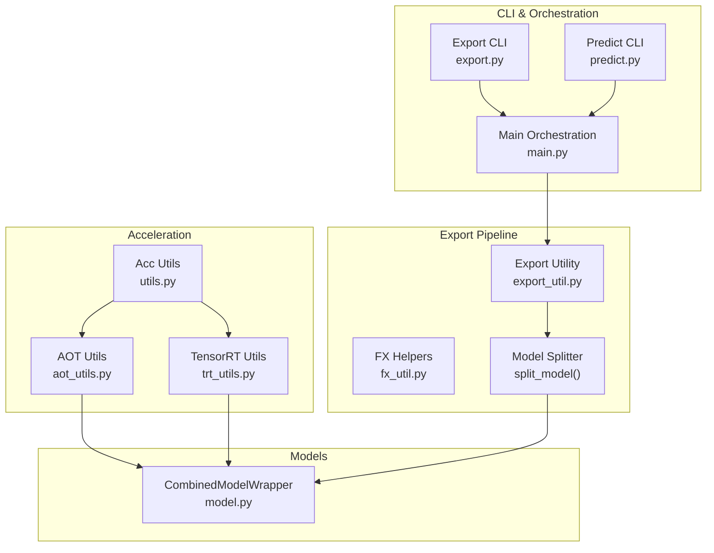
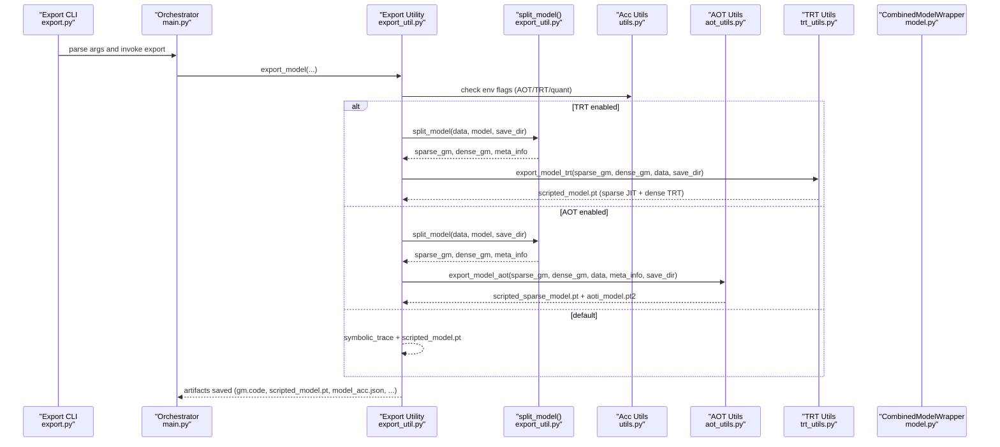
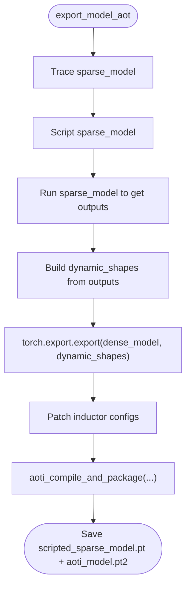
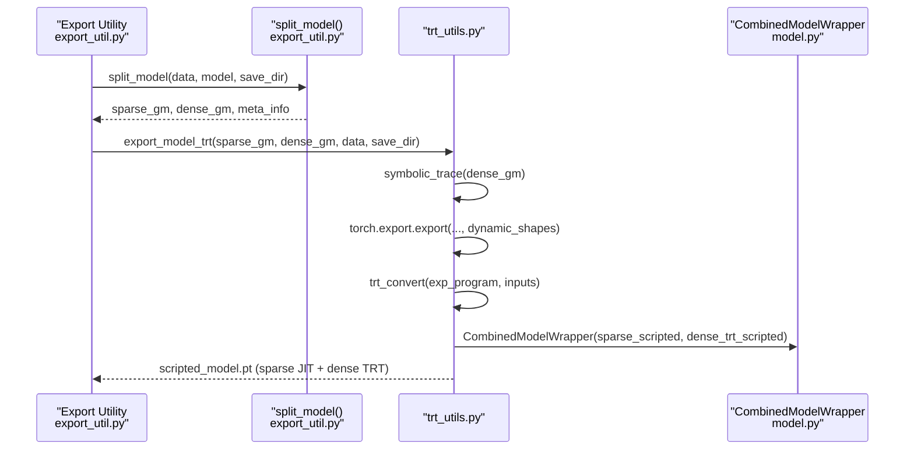
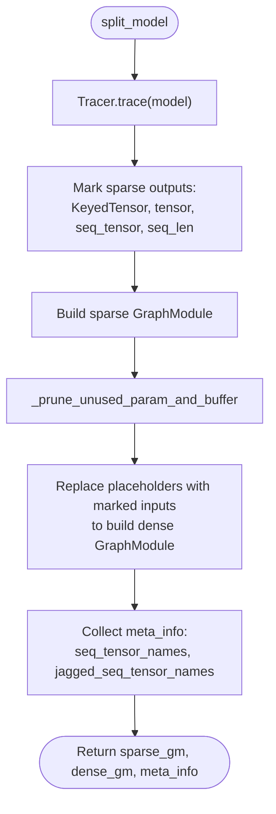
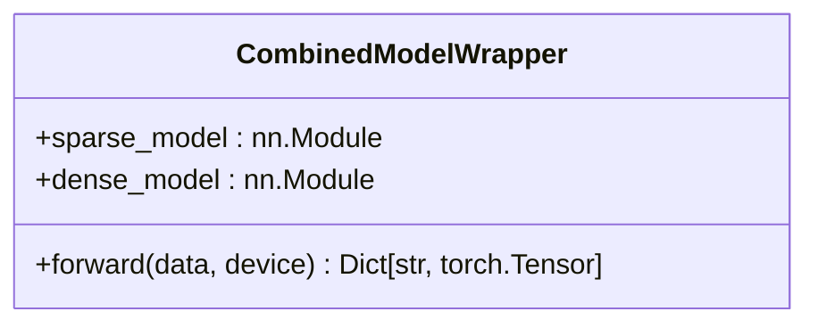
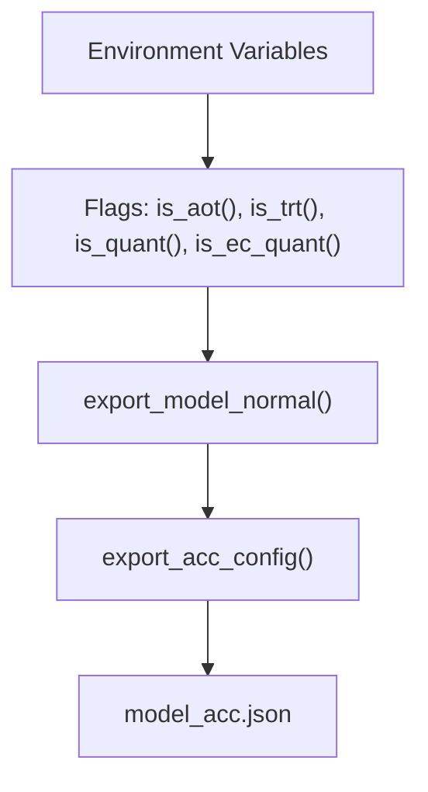
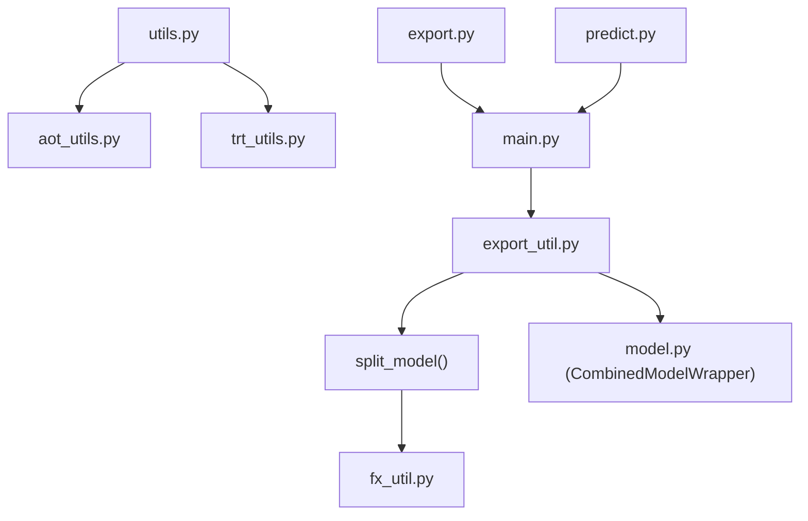

# Model Acceleration and Deployment Utilities

<cite>
**Referenced Files in This Document**
- [aot_utils.py](file://tzrec/acc/aot_utils.py)
- [trt_utils.py](file://tzrec/acc/trt_utils.py)
- [utils.py](file://tzrec/acc/utils.py)
- [export_util.py](file://tzrec/utils/export_util.py)
- [fx_util.py](file://tzrec/utils/fx_util.py)
- [model.py](file://tzrec/models/model.py)
- [export.py](file://tzrec/export.py)
- [main.py](file://tzrec/main.py)
- [predict.py](file://tzrec/predict.py)
- [export.md](file://docs/source/usage/export.md)
- [serving.md](file://docs/source/usage/serving.md)
</cite>

## Table of Contents

1. [Introduction](#introduction)
1. [Project Structure](#project-structure)
1. [Core Components](#core-components)
1. [Architecture Overview](#architecture-overview)
1. [Detailed Component Analysis](#detailed-component-analysis)
1. [Dependency Analysis](#dependency-analysis)
1. [Performance Considerations](#performance-considerations)
1. [Troubleshooting Guide](#troubleshooting-guide)
1. [Conclusion](#conclusion)
1. [Appendices](#appendices)

## Introduction

This document explains TorchEasyRec’s model acceleration and deployment utilities with a focus on:

- Ahead-of-Time (AOT) compilation for CPU/GPU acceleration
- TensorRT integration for GPU acceleration
- Production deployment optimization strategies
- The model export pipeline, TorchScript compilation options, and hardware-specific optimizations
- Practical examples for exporting optimized models, configuring acceleration settings, and deploying in production
- Trade-offs among model size, inference speed, and accuracy, with best practices

## Project Structure

The acceleration and deployment capabilities are implemented across several modules:

- Acceleration utilities: AOT and TensorRT helpers, environment-aware toggles, and quantization controls
- Export pipeline: Model splitting, tracing, scripting, and packaging for deployment
- Model wrappers: Combined model composition for sparse/dense parts
- CLI and orchestration: Export and prediction entry points

**Diagram sources**

- \[aot_utils.py\](file://tzrec/acc/aot_utils.py#L1-L108)
- \[trt_utils.py\](file://tzrec/acc/trt_utils.py#L1-L218)
- \[utils.py\](file://tzrec/acc/utils.py#L1-L228)
- \[export_util.py\](file://tzrec/utils/export_util.py#L934-L1070)
- \[fx_util.py\](file://tzrec/utils/fx_util.py#L1-L125)
- \[model.py\](file://tzrec/models/model.py#L392-L422)
- \[main.py\](file://tzrec/main.py#L1-L200)
- \[export.py\](file://tzrec/export.py#L1-L51)
- \[predict.py\](file://tzrec/predict.py#L1-L144)

**Section sources**

- \[aot_utils.py\](file://tzrec/acc/aot_utils.py#L1-L108)
- \[trt_utils.py\](file://tzrec/acc/trt_utils.py#L1-L218)
- \[utils.py\](file://tzrec/acc/utils.py#L1-L228)
- \[export_util.py\](file://tzrec/utils/export_util.py#L934-L1070)
- \[fx_util.py\](file://tzrec/utils/fx_util.py#L1-L125)
- \[model.py\](file://tzrec/models/model.py#L392-L422)
- \[export.py\](file://tzrec/export.py#L1-L51)
- \[main.py\](file://tzrec/main.py#L1-L200)
- \[predict.py\](file://tzrec/predict.py#L1-L144)

## Core Components

- AOT compilation utilities:
  - Export and load AOT-inductor compiled dense models
  - Symbolic tracing, JIT scripting of sparse parts, and dynamic shape configuration
- TensorRT integration:
  - Convert exported programs to TensorRT engines
  - Dynamic shape support, workspace sizing, and precision control
- Environment-aware acceleration controls:
  - Enable/disable AOT/TRT, quantization, input tiling, and batch size limits
- Export pipeline:
  - Split models into sparse and dense parts
  - Trace, script, and package for deployment
- Combined model wrapper:
  - Compose sparse JIT model and dense AOT/TensorRT model for unified inference

**Section sources**

- \[aot_utils.py\](file://tzrec/acc/aot_utils.py#L24-L108)
- \[trt_utils.py\](file://tzrec/acc/trt_utils.py#L35-L218)
- \[utils.py\](file://tzrec/acc/utils.py#L51-L218)
- \[export_util.py\](file://tzrec/utils/export_util.py#L934-L1070)
- \[model.py\](file://tzrec/models/model.py#L392-L422)

## Architecture Overview

The export pipeline orchestrates model splitting, tracing, and packaging for deployment. Depending on environment flags, it exports either:

- Standard TorchScript model
- TensorRT-optimized model (sparse JIT + dense TensorRT)
- AOT-compiled model (sparse JIT + dense AOT)

**Diagram sources**

- \[export.py\](file://tzrec/export.py#L16-L50)
- \[main.py\](file://tzrec/main.py#L1-L200)
- \[export_util.py\](file://tzrec/utils/export_util.py#L108-L238)
- \[utils.py\](file://tzrec/acc/utils.py#L190-L218)
- \[aot_utils.py\](file://tzrec/acc/aot_utils.py#L46-L108)
- \[trt_utils.py\](file://tzrec/acc/trt_utils.py#L102-L186)
- \[model.py\](file://tzrec/models/model.py#L392-L422)

## Detailed Component Analysis

### AOT Compilation Utilities

AOT compilation converts the dense part of the model into an AOT-inductor package for efficient CPU/GPU execution. It also JIT-scripts the sparse part for fast tracing.

Key capabilities:

- Load AOT-inductor packaged models and combine with sparse JIT model
- Export AOT models with dynamic shapes for variable-length sequences and jagged tensors
- Configure scalar assertions and Triton autotune compatibility flags during export

**Diagram sources**

- \[aot_utils.py\](file://tzrec/acc/aot_utils.py#L46-L108)

**Section sources**

- \[aot_utils.py\](file://tzrec/acc/aot_utils.py#L24-L108)

### TensorRT Integration

TensorRT integration compiles the dense part into optimized CUDA engines. It supports dynamic shapes, configurable workspace sizes, and precision selection.

Highlights:

- Convert ExportedProgram to TensorRT engine via Dynamo compiler
- Dynamic shape support for batch and sequence dimensions
- Optional debug profiling for pre/post TensorRT inference
- Combine sparse JIT and dense TRT into a single scripted model

**Diagram sources**

- \[export_util.py\](file://tzrec/utils/export_util.py#L192-L219)
- \[trt_utils.py\](file://tzrec/acc/trt_utils.py#L102-L186)
- \[model.py\](file://tzrec/models/model.py#L392-L422)

**Section sources**

- \[trt_utils.py\](file://tzrec/acc/trt_utils.py#L35-L218)

### Export Pipeline and Model Splitting

The export pipeline splits a full model into sparse and dense parts using FX tracing and custom markers. It then packages the appropriate accelerations.

Key steps:

- Trace full model and mark sparse outputs (KeyedTensor values, tensors, sequence tensors, sequence lengths)
- Build sparse GraphModule and extract dense GraphModule by replacing placeholders with marked inputs
- Save graphs and scripted models for inspection and deployment
- Emit metadata for dynamic shapes (sequence names, jagged sequence names)

**Diagram sources**

- \[export_util.py\](file://tzrec/utils/export_util.py#L934-L1070)
- \[fx_util.py\](file://tzrec/utils/fx_util.py#L84-L124)

**Section sources**

- \[export_util.py\](file://tzrec/utils/export_util.py#L934-L1070)
- \[fx_util.py\](file://tzrec/utils/fx_util.py#L19-L125)

### Combined Model Wrapper

The wrapper composes a sparse JIT model and a dense AOT/TensorRT model to provide unified inference. It forwards the original input through the sparse part, then feeds the sparse outputs into the dense part.

**Diagram sources**

- \[model.py\](file://tzrec/models/model.py#L392-L422)

**Section sources**

- \[model.py\](file://tzrec/models/model.py#L392-L422)

### Environment-Aware Acceleration Controls

Environment variables control acceleration features and quantization:

- ENABLE_AOT, ENABLE_TRT: toggle AOT/TRT export
- QUANT_EMB, QUANT_EC_EMB: quantization dtype selection for embeddings
- INPUT_TILE: enable input tiling for user-side feature reuse
- MAX_EXPORT_BATCH_SIZE or TRT_MAX_BATCH_SIZE: cap export-time batch size
- DEBUG_TRT: enable profiling and verbose logs for TensorRT conversion

**Diagram sources**

- \[utils.py\](file://tzrec/acc/utils.py#L51-L218)

**Section sources**

- \[utils.py\](file://tzrec/acc/utils.py#L51-L218)

## Dependency Analysis

The acceleration utilities depend on environment flags and model splitting. The export pipeline depends on FX tracing and model wrappers.

**Diagram sources**

- \[utils.py\](file://tzrec/acc/utils.py#L1-L228)
- \[aot_utils.py\](file://tzrec/acc/aot_utils.py#L1-L108)
- \[trt_utils.py\](file://tzrec/acc/trt_utils.py#L1-L218)
- \[export_util.py\](file://tzrec/utils/export_util.py#L934-L1070)
- \[fx_util.py\](file://tzrec/utils/fx_util.py#L1-L125)
- \[model.py\](file://tzrec/models/model.py#L392-L422)
- \[main.py\](file://tzrec/main.py#L1-L200)
- \[export.py\](file://tzrec/export.py#L1-L51)
- \[predict.py\](file://tzrec/predict.py#L1-L144)

**Section sources**

- \[utils.py\](file://tzrec/acc/utils.py#L1-L228)
- \[aot_utils.py\](file://tzrec/acc/aot_utils.py#L1-L108)
- \[trt_utils.py\](file://tzrec/acc/trt_utils.py#L1-L218)
- \[export_util.py\](file://tzrec/utils/export_util.py#L934-L1070)
- \[fx_util.py\](file://tzrec/utils/fx_util.py#L1-L125)
- \[model.py\](file://tzrec/models/model.py#L392-L422)
- \[main.py\](file://tzrec/main.py#L1-L200)
- \[export.py\](file://tzrec/export.py#L1-L51)
- \[predict.py\](file://tzrec/predict.py#L1-L144)

## Performance Considerations

- Batch size limits during export:
  - Use MAX_EXPORT_BATCH_SIZE or legacy TRT_MAX_BATCH_SIZE to avoid out-of-memory errors during compilation
- Dynamic shapes:
  - AOT and TRT support dynamic batch and sequence dimensions; configure sequence length caps appropriately
- Quantization:
  - INT8 quantization for embeddings generally yields minimal accuracy loss and significant speedup
  - Separate controls for regular EmbeddingBagCollection and EmbeddingCollection (sequences)
- TensorRT workspace and block size:
  - Workspace size and min_block_size influence engine fusion and memory footprint
- TF32 allowances:
  - Allow TF32 for cuDNN and CUDA matmul to improve training performance when acceptable

[No sources needed since this section provides general guidance]

## Troubleshooting Guide

Common issues and remedies:

- TensorRT not installed:
  - TorchTensorRT availability is checked at import; if unavailable, TRT export is skipped
- Debugging TensorRT:
  - Set DEBUG_TRT=1 to enable profiling and verbose logs for TRT conversion and inference
- Export-time OOM:
  - Reduce MAX_EXPORT_BATCH_SIZE to fit compilation memory
- Mixed precision and numerical stability:
  - If encountering numerical issues, temporarily disable quantization or adjust precision settings

**Section sources**

- \[trt_utils.py\](file://tzrec/acc/trt_utils.py#L25-L33)
- \[utils.py\](file://tzrec/acc/utils.py#L93-L101)
- \[utils.py\](file://tzrec/acc/utils.py#L207-L218)

## Conclusion

TorchEasyRec provides robust, production-ready acceleration utilities:

- AOT compilation for efficient dense execution with dynamic shapes
- TensorRT integration for GPU acceleration with dynamic shape support
- A streamlined export pipeline that splits models and packages artifacts for deployment
- Environment-driven controls for quantization, batching, and feature tiling

By combining these tools and following the best practices outlined, teams can achieve significant inference speedups while maintaining accuracy and operational simplicity.

[No sources needed since this section summarizes without analyzing specific files]

## Appendices

### Practical Examples

- Export an AOT-optimized model:

  - Set environment variables to enable AOT and quantization
  - Run the export CLI with a pipeline config and checkpoint path
  - Verify artifacts: scripted sparse model, AOT package, and model metadata

- Export a TensorRT-optimized model:

  - Enable TRT and optionally set sequence length and batch size caps
  - Run export; the pipeline produces a combined scripted model with sparse JIT and dense TRT

- Deploy in production:

  - Use the exported scripted model with TorchEasyRec Processor
  - Configure service parameters such as FG mode, feature store settings, and input tiling
  - Monitor performance and adjust environment variables for optimal throughput

**Section sources**

- \[export.md\](file://docs/source/usage/export.md#L18-L46)
- \[serving.md\](file://docs/source/usage/serving.md#L1-L97)
- \[export.py\](file://tzrec/export.py#L16-L50)
- \[main.py\](file://tzrec/main.py#L1-L200)
