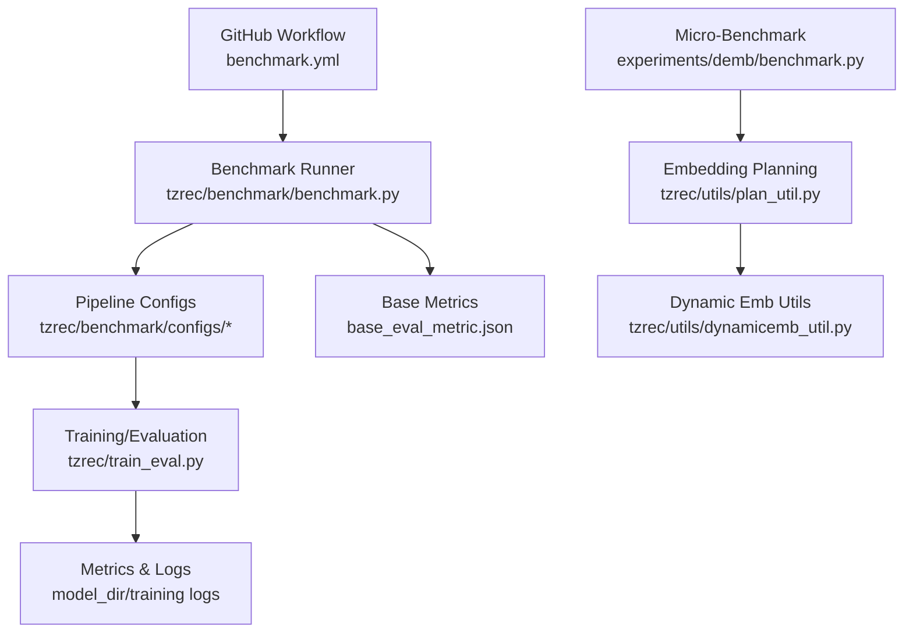
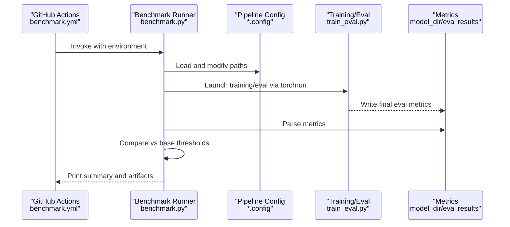
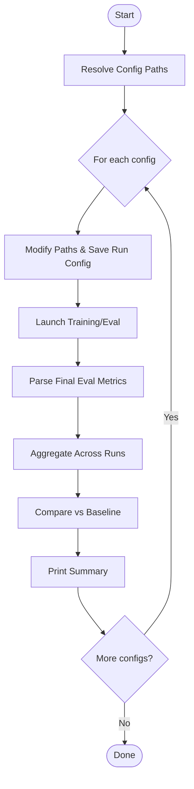
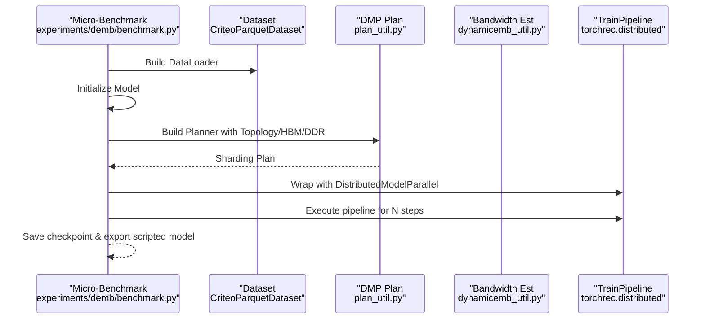
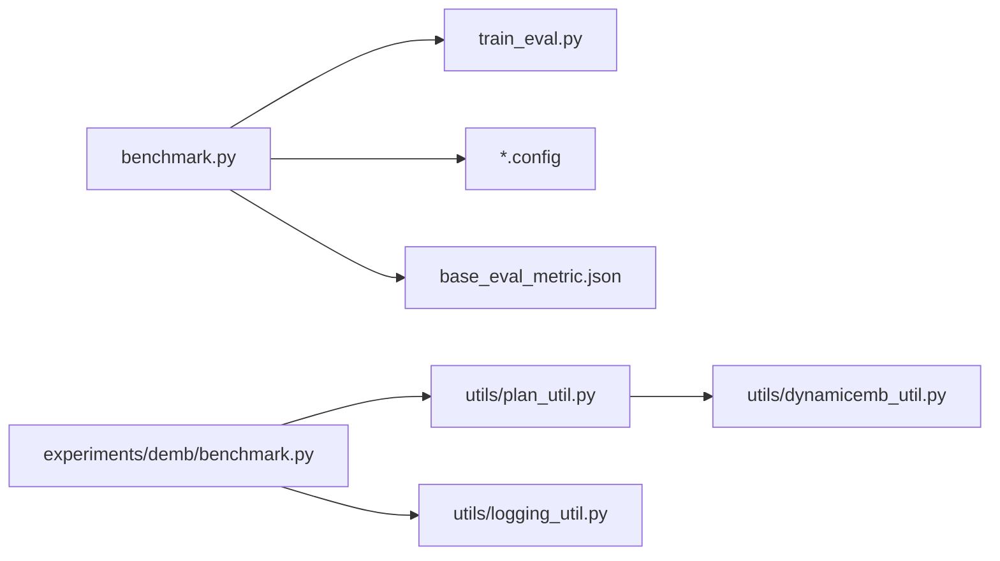

# Performance Benchmarking and Profiling

<cite>
**Referenced Files in This Document**
- [benchmark.py](file://tzrec/benchmark/benchmark.py)
- [base_eval_metric.json](file://tzrec/benchmark/configs/base_eval_metric.json)
- [deepfm.config](file://tzrec/benchmark/configs/criteo/deepfm.config)
- [dbmtl.config](file://tzrec/benchmark/configs/taobao/dbmtl.config)
- [benchmark.yml](file://.github/workflows/benchmark.yml)
- [train_eval.py](file://tzrec/train_eval.py)
- [logging_util.py](file://tzrec/utils/logging_util.py)
- [benchmark.py (demb)](file://experiments/demb/benchmark.py)
- [dynamicemb_util.py](file://tzrec/utils/dynamicemb_util.py)
- [plan_util.py](file://tzrec/utils/plan_util.py)
</cite>

## Table of Contents

1. [Introduction](#introduction)
1. [Project Structure](#project-structure)
1. [Core Components](#core-components)
1. [Architecture Overview](#architecture-overview)
1. [Detailed Component Analysis](#detailed-component-analysis)
1. [Dependency Analysis](#dependency-analysis)
1. [Performance Considerations](#performance-considerations)
1. [Troubleshooting Guide](#troubleshooting-guide)
1. [Conclusion](#conclusion)
1. [Appendices](#appendices)

## Introduction

This document describes TorchEasyRec’s performance benchmarking and profiling infrastructure. It explains the benchmarking framework, standardized evaluation procedures, and measurement methodologies used to assess training throughput, memory usage, and real-world performance characteristics. It also covers how to run benchmarks, compare model configurations, interpret results, detect regressions, and optimize based on feedback. Practical examples and integration with hardware environments are included, along with guidance for continuous performance monitoring.

## Project Structure

TorchEasyRec organizes benchmarking around:

- A benchmark runner that executes training/evaluation pipelines against predefined configurations
- A set of pipeline configurations for representative datasets and models
- A base evaluation metric specification that defines baseline targets and thresholds
- A GitHub Actions workflow that schedules periodic benchmarking on GPU runners
- Additional micro-benchmarks for embedding sharding planning and memory bandwidth estimation

**Diagram sources**

- \[benchmark.yml\](file://.github/workflows/benchmark.yml#L1-L32)
- \[benchmark.py\](file://tzrec/benchmark/benchmark.py#L255-L338)
- \[base_eval_metric.json\](file://tzrec/benchmark/configs/base_eval_metric.json#L1-L156)
- \[train_eval.py\](file://tzrec/train_eval.py#L16-L73)
- \[benchmark.py (demb)\](file://experiments/demb/benchmark.py#L568-L610)
- \[plan_util.py\](file://tzrec/utils/plan_util.py#L327-L413)
- \[dynamicemb_util.py\](file://tzrec/utils/dynamicemb_util.py#L401-L440)

**Section sources**

- \[benchmark.py\](file://tzrec/benchmark/benchmark.py#L255-L338)
- \[benchmark.yml\](file://.github/workflows/benchmark.yml#L1-L32)

## Core Components

- Benchmark Runner: Orchestrates repeated runs of training/evaluation for each pipeline configuration, collects metrics, compares against baselines, and prints comparative results.
- Pipeline Configurations: Define datasets, model architectures, optimizers, and evaluation settings for standardized comparisons.
- Base Evaluation Metrics: Specify baseline targets and thresholds per configuration to detect meaningful improvements or regressions.
- GitHub Workflow: Schedules automated benchmark runs on GPU-enabled runners and passes environment variables for data access.
- Micro-Benchmark Utilities: Provide embedding planning, memory bandwidth estimation, and throughput-focused training loops for deeper performance insights.

**Section sources**

- \[benchmark.py\](file://tzrec/benchmark/benchmark.py#L126-L138)
- \[base_eval_metric.json\](file://tzrec/benchmark/configs/base_eval_metric.json#L1-L156)
- \[benchmark.yml\](file://.github/workflows/benchmark.yml#L1-L32)
- \[benchmark.py (demb)\](file://experiments/demb/benchmark.py#L426-L521)

## Architecture Overview

The benchmarking pipeline integrates configuration-driven training with standardized evaluation and comparison logic.

**Diagram sources**

- \[benchmark.yml\](file://.github/workflows/benchmark.yml#L21-L31)
- \[benchmark.py\](file://tzrec/benchmark/benchmark.py#L126-L138)
- \[train_eval.py\](file://tzrec/train_eval.py#L63-L72)
- \[base_eval_metric.json\](file://tzrec/benchmark/configs/base_eval_metric.json#L1-L156)

## Detailed Component Analysis

### Benchmark Runner

The runner:

- Accepts a single config file or a directory of configs
- Modifies pipeline paths for ODPS projects and quotas
- Executes training/evaluation with a fixed torchrun command
- Parses the final evaluation result file and computes averages across runs
- Compares averages to baseline targets with configurable thresholds
- Prints color-coded summaries indicating improvement, degradation, or balance

**Diagram sources**

- \[benchmark.py\](file://tzrec/benchmark/benchmark.py#L140-L152)
- \[benchmark.py\](file://tzrec/benchmark/benchmark.py#L72-L124)
- \[benchmark.py\](file://tzrec/benchmark/benchmark.py#L126-L138)
- \[benchmark.py\](file://tzrec/benchmark/benchmark.py#L162-L173)
- \[benchmark.py\](file://tzrec/benchmark/benchmark.py#L176-L206)
- \[benchmark.py\](file://tzrec/benchmark/benchmark.py#L209-L253)

**Section sources**

- \[benchmark.py\](file://tzrec/benchmark/benchmark.py#L255-L338)

### Pipeline Configurations and Datasets

Standardized configs define:

- Data sources (ODPS tables) with project substitution
- Batch sizes, workers, and data quota names
- Feature groups and model architectures
- Metrics and losses used for evaluation

Examples:

- Criteo DeepFM configuration demonstrates large-scale sparse features and batch sizing suitable for throughput testing.
- Taobao DBMTL configuration showcases multi-task learning with grouped AUC metrics.

These configs serve as the canonical inputs for reproducible benchmarking across environments.

**Section sources**

- \[deepfm.config\](file://tzrec/benchmark/configs/criteo/deepfm.config#L1-L396)
- \[dbmtl.config\](file://tzrec/benchmark/configs/taobao/dbmtl.config#L1-L213)

### Base Evaluation Metrics and Thresholds

Baseline targets and thresholds are defined per configuration to:

- Establish expected performance ranges
- Control sensitivity for detecting improvements or regressions
- Support statistical averaging across runs

Thresholds can be per-metric or shared, depending on the configuration.

**Section sources**

- \[base_eval_metric.json\](file://tzrec/benchmark/configs/base_eval_metric.json#L1-L156)

### GitHub Actions Workflow

The workflow:

- Schedules periodic runs (e.g., midweek evenings UTC)
- Uses a GPU-enabled container with host IPC
- Installs dependencies, generates protocol bindings, and runs the benchmark script
- Passes environment variables for ODPS project, endpoint, and credentials

This ensures repeatable, environment-consistent benchmarking.

**Section sources**

- \[benchmark.yml\](file://.github/workflows/benchmark.yml#L1-L32)

### Micro-Benchmarking for Embedding Planning and Memory Bandwidth

The micro-benchmark focuses on:

- Constructing datasets and models with large sparse feature vocabularies
- Using embedding collection APIs and managed collision modules
- Planning sharding with constraints informed by device HBM and system DDR capacity
- Estimating kernel bandwidth and storage costs for dynamic embeddings
- Measuring training throughput and saving checkpoints and exported models

**Diagram sources**

- \[benchmark.py (demb)\](file://experiments/demb/benchmark.py#L568-L610)
- \[benchmark.py (demb)\](file://experiments/demb/benchmark.py#L426-L521)
- \[plan_util.py\](file://tzrec/utils/plan_util.py#L327-L413)
- \[dynamicemb_util.py\](file://tzrec/utils/dynamicemb_util.py#L401-L440)

**Section sources**

- \[benchmark.py (demb)\](file://experiments/demb/benchmark.py#L426-L521)
- \[benchmark.py (demb)\](file://experiments/demb/benchmark.py#L568-L610)
- \[plan_util.py\](file://tzrec/utils/plan_util.py#L327-L413)
- \[dynamicemb_util.py\](file://tzrec/utils/dynamicemb_util.py#L401-L440)

## Dependency Analysis

The benchmarking stack depends on:

- Configuration parsing and message serialization utilities
- TorchEasyRec training/evaluation entry point
- Logging utilities for throughput reporting
- TorchRec distributed training and embedding planning
- Dynamic embedding utilities for bandwidth and storage cost modeling

**Diagram sources**

- \[benchmark.py\](file://tzrec/benchmark/benchmark.py#L18-L20)
- \[train_eval.py\](file://tzrec/train_eval.py#L14-L14)
- \[logging_util.py\](file://tzrec/utils/logging_util.py#L20-L46)
- \[benchmark.py (demb)\](file://experiments/demb/benchmark.py#L426-L521)
- \[plan_util.py\](file://tzrec/utils/plan_util.py#L327-L413)
- \[dynamicemb_util.py\](file://tzrec/utils/dynamicemb_util.py#L401-L440)

**Section sources**

- \[benchmark.py\](file://tzrec/benchmark/benchmark.py#L18-L20)
- \[train_eval.py\](file://tzrec/train_eval.py#L14-L14)
- \[logging_util.py\](file://tzrec/utils/logging_util.py#L20-L46)
- \[benchmark.py (demb)\](file://experiments/demb/benchmark.py#L426-L521)

## Performance Considerations

- Throughput measurement

  - Use iterative progress logging to estimate iterations per second during training.
  - Ensure consistent batch sizes and dataset sharding across runs.
  - Minimize overhead from data loading and preprocessing.

- Memory usage tracking

  - Embedding planning considers device HBM and system DDR capacity; adjust batch size and sharding strategy accordingly.
  - Dynamic embedding utilities estimate kernel bandwidth and storage costs to guide capacity planning.

- Hardware integration

  - GPU-enabled runners with host IPC are configured in the workflow.
  - Environment variables supply ODPS project and endpoint for data access.

- Real-world performance characteristics

  - Micro-benchmarks emulate production-like workloads with large sparse feature sets.
  - Planned sharding and managed collision modules reflect production embedding behavior.

**Section sources**

- \[logging_util.py\](file://tzrec/utils/logging_util.py#L20-L46)
- \[benchmark.py (demb)\](file://experiments/demb/benchmark.py#L426-L521)
- \[plan_util.py\](file://tzrec/utils/plan_util.py#L327-L413)
- \[dynamicemb_util.py\](file://tzrec/utils/dynamicemb_util.py#L401-L440)
- \[benchmark.yml\](file://.github/workflows/benchmark.yml#L10-L14)

## Troubleshooting Guide

- No valid config path

  - The runner raises an exception if the provided path is neither a file nor a directory. Verify the path and ensure it points to a single config or a directory of configs.

- Unsuccessful runs

  - The runner records failures and still computes averages from successful runs. Investigate logs under the generated experiment directory for errors.

- Metric comparison anomalies

  - If the number of failures exceeds half the runs, the runner flags the configuration as unreliable and prints the computed average metrics.

- ODPS project resolution

  - The runner substitutes placeholders in input paths using the CI project name or the project from the ODPS config file. Ensure environment variables are set correctly.

- Logging throughput

  - Use the progress logger to monitor iteration throughput during training and export phases.

**Section sources**

- \[benchmark.py\](file://tzrec/benchmark/benchmark.py#L150-L152)
- \[benchmark.py\](file://tzrec/benchmark/benchmark.py#L222-L224)
- \[benchmark.py\](file://tzrec/benchmark/benchmark.py#L60-L69)
- \[logging_util.py\](file://tzrec/utils/logging_util.py#L20-L46)

## Conclusion

TorchEasyRec’s benchmarking infrastructure provides a repeatable, standardized way to measure training performance, evaluate model quality, and track regressions across configurations. By combining configuration-driven training, baseline thresholds, and micro-benchmarks for embedding planning and memory bandwidth, teams can continuously monitor performance, identify bottlenecks, and optimize models and infrastructure effectively.

## Appendices

### How to Run Benchmarks

- Local execution
  - Prepare environment, install dependencies, and run the benchmark script with a config path or directory and an experiment output path.
- CI execution
  - The workflow automatically installs requirements, generates protocol bindings, and runs the benchmark inside a GPU-enabled container with environment variables for ODPS access.

**Section sources**

- \[benchmark.py\](file://tzrec/benchmark/benchmark.py#L319-L338)
- \[benchmark.yml\](file://.github/workflows/benchmark.yml#L28-L31)

### Interpreting Benchmark Results

- Color-coded messages indicate whether metrics improved, degraded, or remained balanced compared to baselines.
- The runner prints run counts, failure counts, and averaged metrics for each configuration.
- Use the aggregated results to compare different model configurations and select optimal setups.

**Section sources**

- \[benchmark.py\](file://tzrec/benchmark/benchmark.py#L209-L253)
- \[benchmark.py\](file://tzrec/benchmark/benchmark.py#L307-L316)

### Comparing Model Configurations

- Adjust run counts and thresholds in the base metrics file to emphasize or relax sensitivity.
- Use different pipeline configs to compare architectures, datasets, and feature groups.
- Track trends across multiple runs to identify stable winners.

**Section sources**

- \[base_eval_metric.json\](file://tzrec/benchmark/configs/base_eval_metric.json#L1-L156)

### Continuous Performance Monitoring and Regression Detection

- Schedule periodic runs via the workflow to maintain historical baselines.
- Monitor color-coded summaries and investigate flagged configurations with excessive failures.
- Integrate micro-benchmarks to detect embedding planning or memory bandwidth regressions early.

**Section sources**

- \[benchmark.yml\](file://.github/workflows/benchmark.yml#L3-L6)
- \[benchmark.py\](file://tzrec/benchmark/benchmark.py#L222-L224)

### Relationship Between Micro-Benchmarks and Real-World Performance

- Micro-benchmarks emulate production-scale sparse features and embedding collections, enabling accurate throughput and memory usage estimates.
- Embedding planning and bandwidth utilities inform sharding decisions aligned with real-world hardware constraints.

**Section sources**

- \[benchmark.py (demb)\](file://experiments/demb/benchmark.py#L568-L610)
- \[plan_util.py\](file://tzrec/utils/plan_util.py#L327-L413)
- \[dynamicemb_util.py\](file://tzrec/utils/dynamicemb_util.py#L401-L440)
