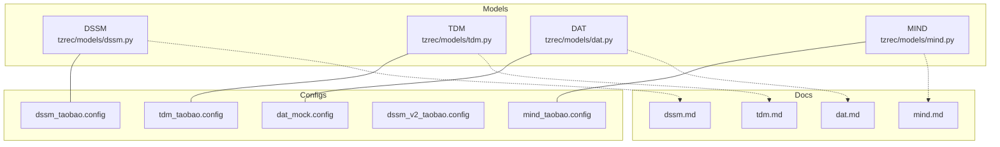
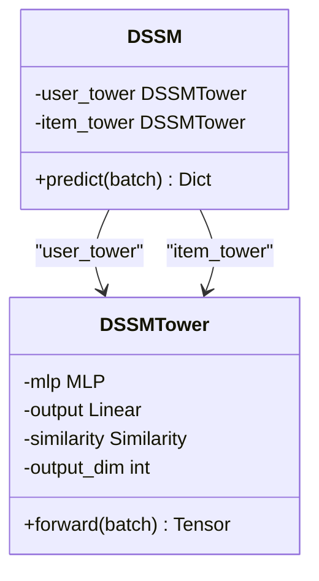
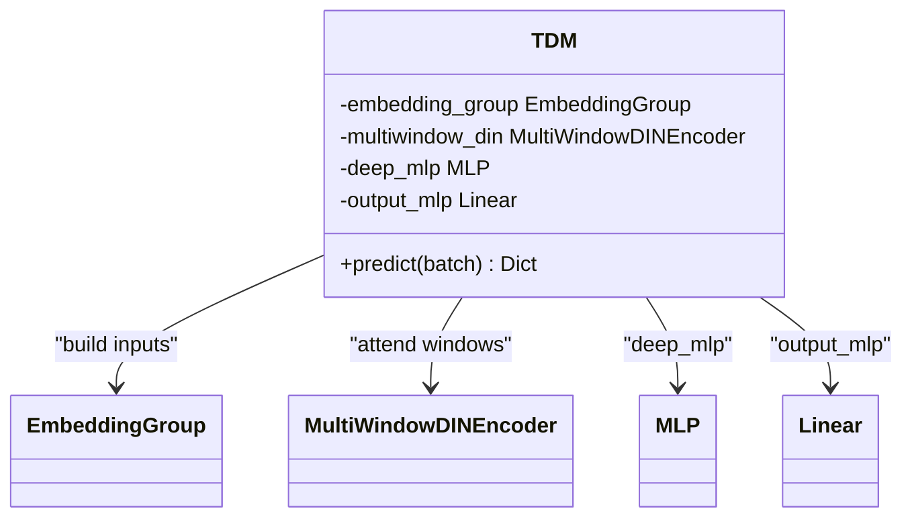
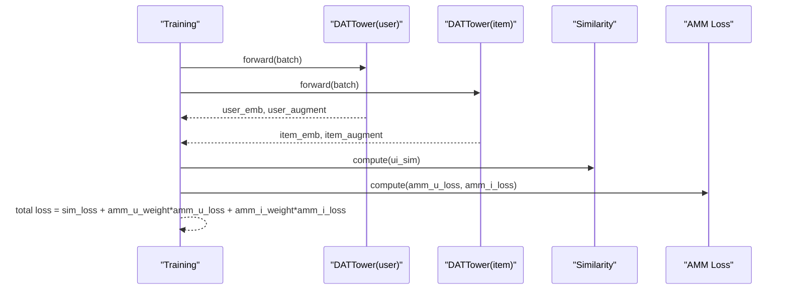
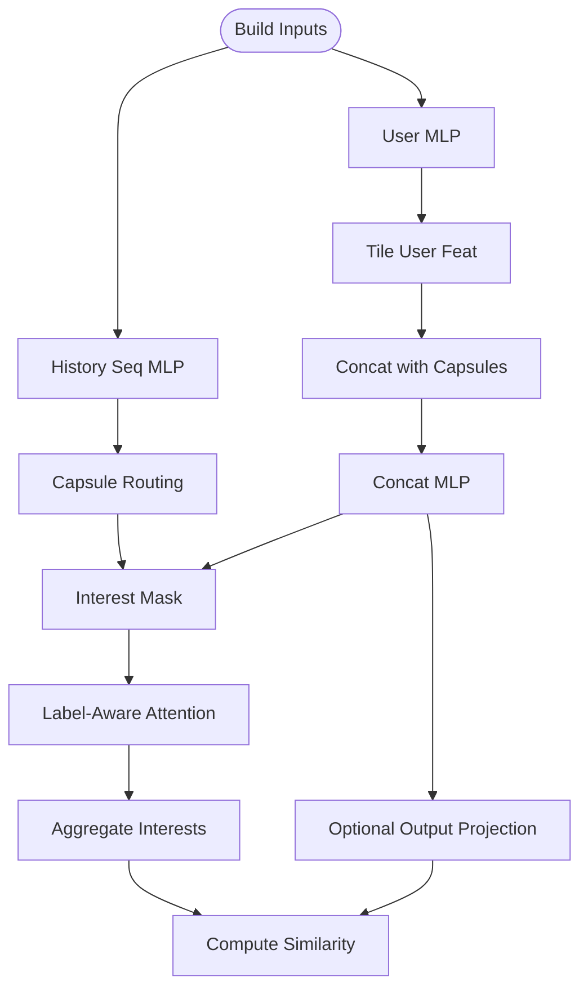
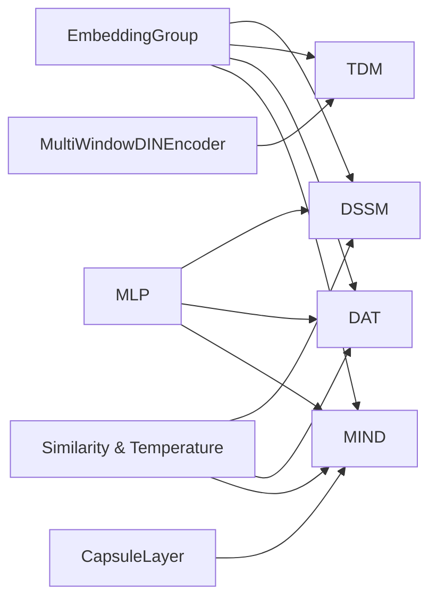

# Candidate Generation Models

<cite>
**Referenced Files in This Document**
- [dssm.py](file://tzrec/models/dssm.py)
- [tdm.py](file://tzrec/models/tdm.py)
- [dat.py](file://tzrec/models/dat.py)
- [mind.py](file://tzrec/models/mind.py)
- [dssm.md](file://docs/source/models/dssm.md)
- [tdm.md](file://docs/source/models/tdm.md)
- [dat.md](file://docs/source/models/dat.md)
- [mind.md](file://docs/source/models/mind.md)
- [dssm_taobao.config](file://examples/dssm_taobao.config)
- [tdm_taobao.config](file://examples/tdm_taobao.config)
- [mind_taobao.config](file://examples/mind_taobao.config)
- [dssm_v2_taobao.config](file://examples/dssm_v2_taobao.config)
- [dat_mock.config](file://tzrec/tests/configs/dat_mock.config)
</cite>

## Table of Contents

1. [Introduction](#introduction)
1. [Project Structure](#project-structure)
1. [Core Components](#core-components)
1. [Architecture Overview](#architecture-overview)
1. [Detailed Component Analysis](#detailed-component-analysis)
1. [Dependency Analysis](#dependency-analysis)
1. [Performance Considerations](#performance-considerations)
1. [Troubleshooting Guide](#troubleshooting-guide)
1. [Conclusion](#conclusion)
1. [Appendices](#appendices)

## Introduction

This document provides a comprehensive guide to TorchEasyRec’s candidate generation models: DSSM (Deep Structured Semantic Model), TDM (Tree-based Deep Model), DAT (Deep Attention Tree Matching), and MIND (Multi-interest Network). It explains the mathematical foundations, network architectures, training objectives, implementation specifics, and practical configuration examples. It also covers training workflows, evaluation metrics, model selection criteria, performance characteristics, deployment considerations, and adaptation guidelines for different recommendation scenarios.

## Project Structure

The candidate generation models are implemented as PyTorch modules under the models package, with each model encapsulating user and item towers, embedding groups, optional sequence encoders, and attention mechanisms. Configuration examples and documentation reside under examples and docs/source/models respectively.

**Diagram sources**

- \[dssm.py\](file://tzrec/models/dssm.py#L86-L156)
- \[tdm.py\](file://tzrec/models/tdm.py#L28-L146)
- \[dat.py\](file://tzrec/models/dat.py#L109-L260)
- \[mind.py\](file://tzrec/models/mind.py#L255-L366)
- \[dssm_taobao.config\](file://examples/dssm_taobao.config#L1-L267)
- \[tdm_taobao.config\](file://examples/tdm_taobao.config#L1-L264)
- \[mind_taobao.config\](file://examples/mind_taobao.config#L1-L296)
- \[dssm_v2_taobao.config\](file://examples/dssm_v2_taobao.config#L1-L268)
- \[dat_mock.config\](file://tzrec/tests/configs/dat_mock.config#L1-L203)
- \[dssm.md\](file://docs/source/models/dssm.md#L1-L153)
- \[tdm.md\](file://docs/source/models/tdm.md#L1-L129)
- \[dat.md\](file://docs/source/models/dat.md#L1-L86)
- \[mind.md\](file://docs/source/models/mind.md#L1-L257)

**Section sources**

- \[dssm.py\](file://tzrec/models/dssm.py#L1-L156)
- \[tdm.py\](file://tzrec/models/tdm.py#L1-L146)
- \[dat.py\](file://tzrec/models/dat.py#L1-L260)
- \[mind.py\](file://tzrec/models/mind.py#L1-L366)
- \[dssm_taobao.config\](file://examples/dssm_taobao.config#L1-L267)
- \[tdm_taobao.config\](file://examples/tdm_taobao.config#L1-L264)
- \[mind_taobao.config\](file://examples/mind_taobao.config#L1-L296)
- \[dssm_v2_taobao.config\](file://examples/dssm_v2_taobao.config#L1-L268)
- \[dat_mock.config\](file://tzrec/tests/configs/dat_mock.config#L1-L203)
- \[dssm.md\](file://docs/source/models/dssm.md#L1-L153)
- \[tdm.md\](file://docs/source/models/tdm.md#L1-L129)
- \[dat.md\](file://docs/source/models/dat.md#L1-L86)
- \[mind.md\](file://docs/source/models/mind.md#L1-L257)

## Core Components

- DSSM: Two-tower semantic matching with optional cosine normalization and runtime negative sampling.
- TDM: Tree-based hierarchical retrieval with multi-window DIN and per-layer negative sampling.
- DAT: Dual augmented two-towers with an Adaptive-Mimic Mechanism (AMM) auxiliary loss for improved user-item alignment.
- MIND: Multi-interest network with capsule routing over user behavior sequences and label-aware attention.

Key implementation elements:

- Embedding groups assemble features per group.
- MLP towers transform embedded features into compact embeddings.
- Similarity computation uses cosine or inner product with optional temperature scaling.
- Losses include softmax cross entropy and AMM auxiliary loss for DAT.

**Section sources**

- \[dssm.py\](file://tzrec/models/dssm.py#L38-L84)
- \[tdm.py\](file://tzrec/models/tdm.py#L28-L99)
- \[dat.py\](file://tzrec/models/dat.py#L39-L107)
- \[mind.py\](file://tzrec/models/mind.py#L28-L195)

## Architecture Overview

The following diagram maps the high-level architecture of each model, highlighting towers, embeddings, sequence encoders (where applicable), and attention modules.

```mermaid
graph TB
subgraph "DSSM"
DSSM_User["User Tower<br/>MLP"]
DSSM_Item["Item Tower<br/>MLP"]
DSSM_Sim["Similarity & Temperature"]
end
subgraph "TDM"
TDM_Emb["EmbeddingGroup"]
TDM_MWDIN["MultiWindowDIN"]
TDM_Features["Concat Non-Seq Feat"]
TDM_Deep["Final MLP"]
TDM_Out["Logits"]
end
subgraph "DAT"
DAT_User["User Tower<br/>Augment Input"]
DAT_Item["Item Tower<br/>Augment Input"]
DAT_AMM["Adaptive-Mimic Mechanism Loss"]
DAT_Sim["Similarity & Temperature"]
end
subgraph "MIND"
MIND_UserEmb["User MLP"]
MIND_HistSeq["Hist Seq MLP"]
MIND_Capsule["Capsule Layer"]
MIND_Attention["Label-Aware Attention"]
MIND_ItemEmb["Item MLP"]
MIND_Sim["Similarity & Temperature"]
end
DSSM_User --> DSSM_Sim
DSSM_Item --> DSSM_Sim
TDM_Emb --> TDM_MWDIN --> TDM_Features --> TDM_Deep --> TDM_Out
DAT_User --> DAT_Sim
DAT_Item --> DAT_Sim
DAT_User --> DAT_AMM
DAT_Item --> DAT_AMM
MIND_UserEmb --> MIND_Capsule --> MIND_Attention --> MIND_Sim
MIND_ItemEmb --> MIND_Sim
```

**Diagram sources**

- \[dssm.py\](file://tzrec/models/dssm.py#L86-L156)
- \[tdm.py\](file://tzrec/models/tdm.py#L28-L99)
- \[dat.py\](file://tzrec/models/dat.py#L109-L260)
- \[mind.py\](file://tzrec/models/mind.py#L255-L366)

## Detailed Component Analysis

### DSSM (Deep Structured Semantic Model)

- Mathematical foundation: Two-tower neural networks embed user and item features via shared or separate MLPs, producing embeddings that are compared using cosine or inner-product similarity with temperature scaling.
- Architecture:
  - User and item towers share the same MLP structure; optional linear projection to output_dim.
  - Cosine normalization applied when similarity type is cosine.
- Training objective: Softmax cross entropy against in-batch or sampled negatives with temperature-scaled logits.
- Implementation specifics:
  - EmbeddingGroup aggregates feature group embeddings.
  - MLP transforms concatenated features; optional output projection.
  - Similarity computation supports cosine normalization and temperature scaling.
- Practical configuration:
  - Feature groups: user and item.
  - Tower MLP hidden units configurable.
  - output_dim controls embedding dimensionality.
  - similarity and temperature configurable.
  - Negative sampling supported via data_config.negative_sampler.
- Evaluation metrics: recall@k supported.
- Example config: \[dssm_taobao.config\](file://examples/dssm_taobao.config#L201-L267)

**Diagram sources**

- \[dssm.py\](file://tzrec/models/dssm.py#L38-L84)
- \[dssm.py\](file://tzrec/models/dssm.py#L86-L156)

**Section sources**

- \[dssm.py\](file://tzrec/models/dssm.py#L38-L156)
- \[dssm.md\](file://docs/source/models/dssm.md#L1-L153)
- \[dssm_taobao.config\](file://examples/dssm_taobao.config#L201-L267)

### TDM (Tree-based Deep Model)

- Mathematical foundation: Hierarchical classification on a tree built from item attributes. Per-layer negative sampling is performed along ancestors for positive nodes and random negatives for other nodes.
- Architecture:
  - MultiWindowDIN applies attention across multiple temporal windows over user sequences.
  - Concatenates window-level representations with non-sequence features.
  - Final MLP produces per-layer logits for binary classification.
- Training objective: Softmax cross entropy with per-layer sampling controlled by layer_num_sample.
- Implementation specifics:
  - EmbeddingGroup handles sequence and non-sequence feature groups.
  - MultiWindowDINEncoder computes attention-aware representations.
  - Final MLP and output layer produce classification logits.
- Practical configuration:
  - Feature groups: SEQUENCE group for user history and optional DEEP groups for user/item.
  - multiwindow_din windows_len and attn_mlp hidden_units.
  - final MLP hidden_units and use_bn.
  - tdm_sampler with item_input_path, edge_input_path, predict_edge_input_path, layer_num_sample.
- Evaluation metrics: AUC supported.
- Example config: \[tdm_taobao.config\](file://examples/tdm_taobao.config#L210-L264)

**Diagram sources**

- \[tdm.py\](file://tzrec/models/tdm.py#L28-L99)

**Section sources**

- \[tdm.py\](file://tzrec/models/tdm.py#L28-L146)
- \[tdm.md\](file://docs/source/models/tdm.md#L1-L129)
- \[tdm_taobao.config\](file://examples/tdm_taobao.config#L210-L264)

### DAT (Deep Attention Tree Matching)

- Mathematical foundation: Dual augmented two-towers with auxiliary vectors that mimic the opposite tower’s embedding to improve alignment. AMM loss encourages augment embeddings to align with target embeddings.
- Architecture:
  - Each tower takes an input group and an augment group; concatenates their features before MLP.
  - Training returns both base similarity and auxiliary vectors for AMM loss; inference returns only similarity.
- Training objective:
  - Base contrastive-style loss (softmax cross entropy) with temperature scaling.
  - AMM auxiliary loss: squared L2 distance between normalized augment vectors and target tower embeddings.
- Implementation specifics:
  - DATTower builds input and augment embeddings, concatenates, passes through MLP, optionally projects to output_dim.
  - DAT.loss computes AMM terms weighted by amm_u_weight and amm_i_weight.
- Practical configuration:
  - Feature groups: user, item, user_augment, item_augment.
  - output_dim must match augment embedding dimensions for AMM compatibility.
  - amm_u_weight, amm_i_weight, temperature, similarity configurable.
- Evaluation metrics: recall@k supported.
- Example config: \[dat_mock.config\](file://tzrec/tests/configs/dat_mock.config#L135-L203)

**Diagram sources**

- \[dat.py\](file://tzrec/models/dat.py#L168-L260)

**Section sources**

- \[dat.py\](file://tzrec/models/dat.py#L39-L260)
- \[dat.md\](file://docs/source/models/dat.md#L1-L86)
- \[dat_mock.config\](file://tzrec/tests/configs/dat_mock.config#L135-L203)

### MIND (Multi-interest Network)

- Mathematical foundation: Captures diverse user interests by routing historical interactions through a capsule layer into variable numbers of interest capsules. Label-aware attention aggregates interests into a user representation for matching.
- Architecture:
  - User tower: user MLP → history sequence MLP → capsule routing → interest capsules → concat MLP → optional output projection.
  - Item tower: item MLP → optional output projection.
  - Label-aware attention computes interest weights using item embedding and interest similarities, then aggregates interests.
- Training objective: Softmax cross entropy with temperature-scaled similarity.
- Implementation specifics:
  - MINDUserTower builds user interests and interest masks during training; inference returns user interests.
  - CapsuleLayer performs dynamic routing with configurable max_k, num_iters, routing logits scale/stddev.
  - Label-aware attention uses simi_pow to sharpen interest differences and masking to handle padded sequences.
- Practical configuration:
  - Feature groups: user, item, hist (sequence).
  - user_mlp, hist_seq_mlp, capsule_config, concat_mlp hidden_units and dropout.
  - simi_pow, temperature, similarity, output_dim configurable.
- Evaluation metrics: recall@k supported.
- Example config: \[mind_taobao.config\](file://examples/mind_taobao.config#L206-L296)

**Diagram sources**

- \[mind.py\](file://tzrec/models/mind.py#L28-L195)
- \[mind.py\](file://tzrec/models/mind.py#L303-L366)

**Section sources**

- \[mind.py\](file://tzrec/models/mind.py#L28-L366)
- \[mind.md\](file://docs/source/models/mind.md#L1-L257)
- \[mind_taobao.config\](file://examples/mind_taobao.config#L206-L296)

## Dependency Analysis

- Shared components:
  - EmbeddingGroup aggregates per-feature-group embeddings.
  - MLP modules transform embeddings to desired dimensions.
  - Similarity computation and temperature scaling unify across models.
- Model-specific dependencies:
  - DSSM: cosine normalization and runtime negative sampling.
  - TDM: MultiWindowDINEncoder and per-layer negative sampling.
  - DAT: AMM auxiliary loss computation.
  - MIND: CapsuleLayer and label-aware attention.

**Diagram sources**

- \[dssm.py\](file://tzrec/models/dssm.py#L63-L83)
- \[tdm.py\](file://tzrec/models/tdm.py#L47-L74)
- \[dat.py\](file://tzrec/models/dat.py#L75-L106)
- \[mind.py\](file://tzrec/models/mind.py#L128-L141)

**Section sources**

- \[dssm.py\](file://tzrec/models/dssm.py#L63-L83)
- \[tdm.py\](file://tzrec/models/tdm.py#L47-L74)
- \[dat.py\](file://tzrec/models/dat.py#L75-L106)
- \[mind.py\](file://tzrec/models/mind.py#L128-L141)

## Performance Considerations

- DSSM:
  - Large-scale negative sampling reduces offline storage but increases compute; tune num_sample and batch_size accordingly.
  - Lower temperature improves separation between positive and negative pairs.
- TDM:
  - MultiWindowDIN adds computational overhead; adjust windows_len and attn_mlp sizes for latency budgets.
  - Per-layer sampling balances positive/negative distribution across tree depth.
- DAT:
  - AMM loss adds auxiliary computation; tune amm_u_weight and amm_i_weight to balance alignment gains vs. training cost.
  - Ensure output_dim matches augment embedding dimensions to avoid misalignment.
- MIND:
  - Capsule routing and label-aware attention increase memory and compute; reduce max_k and high_dim for constrained environments.
  - Use cosine similarity with small temperature to sharpen interest discrimination.

[No sources needed since this section provides general guidance]

## Troubleshooting Guide

- DSSM negative sampling:
  - Ensure negative_sampler is configured and item_id_field matches schema; check attr_delimiter and attr_fields order.
  - Verify Mini-Batch exclusions and hard negative edges if used.
- TDM tree sampling:
  - Confirm tdm_sampler paths and layer_num_sample correspond to tree depth; mismatch leads to poor coverage.
  - Adjust probability_type and remain_ratio to prevent overfitting.
- DAT AMM loss:
  - Verify augment feature groups exist and output_dim equals augment embedding dimensions.
  - If AMM loss is unstable, reduce amm_u_weight and amm_i_weight.
- MIND interest aggregation:
  - Check max_k and high_dim; ensure concat_mlp input dimensions match user_mlp output plus capsule high_dim.
  - Use interest masking to handle padded sequences.

**Section sources**

- \[dssm.md\](file://docs/source/models/dssm.md#L109-L145)
- \[tdm.md\](file://docs/source/models/tdm.md#L104-L121)
- \[dat.md\](file://docs/source/models/dat.md#L11-L13)
- \[mind.md\](file://docs/source/models/mind.md#L137-L164)

## Conclusion

DSSM, TDM, DAT, and MIND offer complementary strengths for candidate generation: semantic matching (DSSM), hierarchical retrieval (TDM), dual augmentation with auxiliary alignment (DAT), and multi-interest modeling (MIND). Choose models based on data characteristics, computational budget, and recall quality targets. Proper configuration of feature groups, towers, attention mechanisms, and sampling strategies is essential for robust training and strong downstream performance.

[No sources needed since this section summarizes without analyzing specific files]

## Appendices

### Practical Training Workflows

- DSSM:
  - Prepare click-only samples; configure negative_sampler; set batch_size and num_epochs; monitor recall@k.
  - Reference: \[dssm_taobao.config\](file://examples/dssm_taobao.config#L1-L267)
- TDM:
  - Build tree indices; configure tdm_sampler with layer_num_sample; set num_class=2; monitor AUC.
  - Reference: \[tdm_taobao.config\](file://examples/tdm_taobao.config#L1-L264)
- DAT:
  - Add user_augment and item_augment groups; set amm_u_weight and amm_i_weight; adjust temperature.
  - Reference: \[dat_mock.config\](file://tzrec/tests/configs/dat_mock.config#L135-L203)
- MIND:
  - Define user, item, hist groups; configure capsule_config and concat_mlp; tune simi_pow and temperature.
  - Reference: \[mind_taobao.config\](file://examples/mind_taobao.config#L206-L296)

### Evaluation Metrics

- DSSM/MIND: recall@k (commonly top_k=1 and top_k=5).
- TDM: AUC.
- MIND: Hit rate evaluation with num_interests and top_k support.

**Section sources**

- \[dssm.md\](file://docs/source/models/dssm.md#L75-L107)
- \[tdm.md\](file://docs/source/models/tdm.md#L83-L102)
- \[mind.md\](file://docs/source/models/mind.md#L119-L132)
