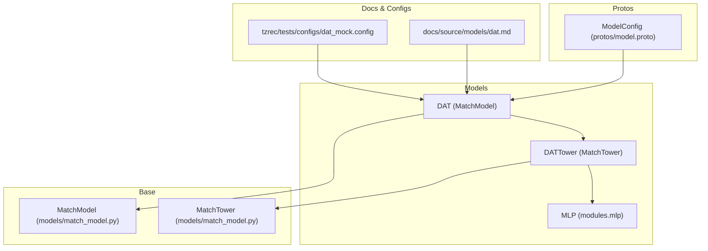
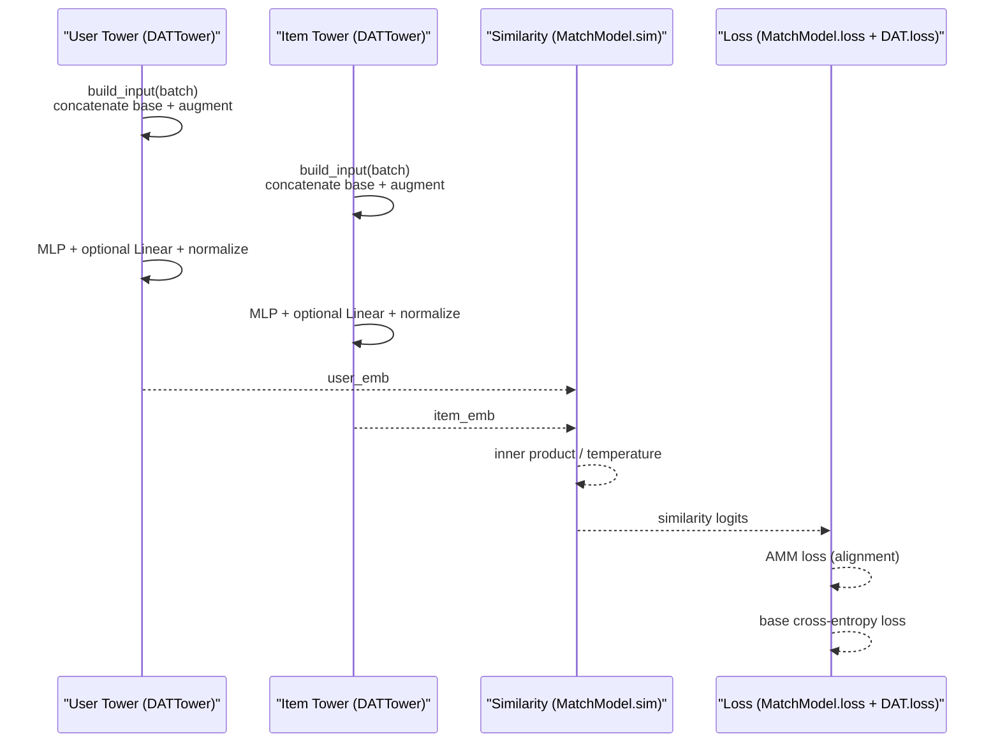
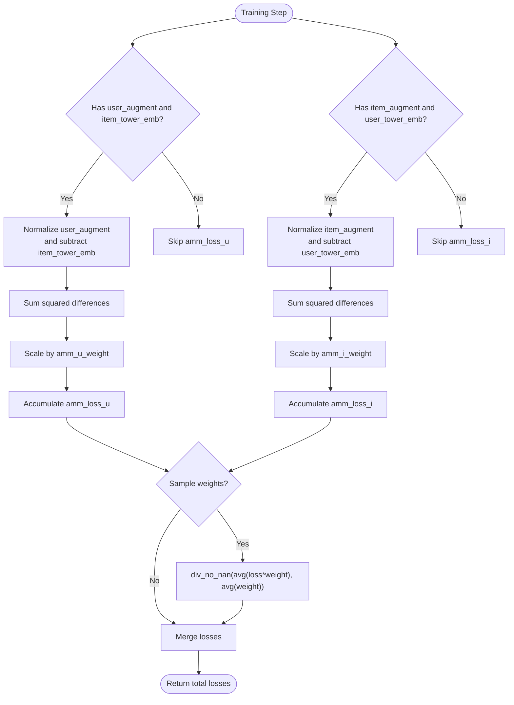
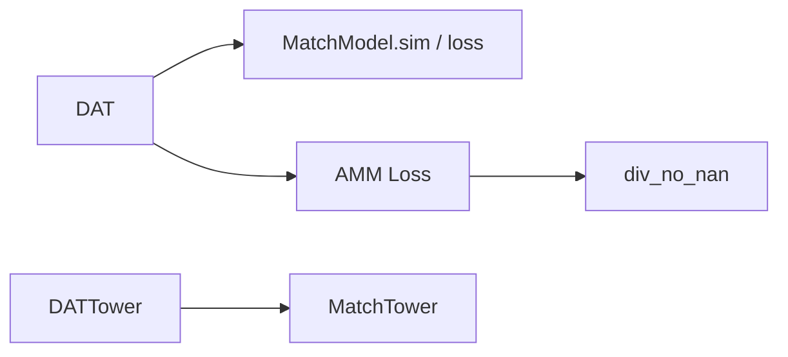

# DAT Model

<cite>
**Referenced Files in This Document**
- [dat.py](file://tzrec/models/dat.py)
- [dat.md](file://docs/source/models/dat.md)
- [dat_mock.config](file://tzrec/tests/configs/dat_mock.config)
- [match_model.py](file://tzrec/models/match_model.py)
- [model.proto](file://tzrec/protos/model.proto)
- [utils.py](file://tzrec/modules/utils.py)
</cite>

## Table of Contents

1. [Introduction](#introduction)
1. [Project Structure](#project-structure)
1. [Core Components](#core-components)
1. [Architecture Overview](#architecture-overview)
1. [Detailed Component Analysis](#detailed-component-analysis)
1. [Dependency Analysis](#dependency-analysis)
1. [Performance Considerations](#performance-considerations)
1. [Troubleshooting Guide](#troubleshooting-guide)
1. [Conclusion](#conclusion)
1. [Appendices](#appendices)

## Introduction

This document explains the DAT (Deep Attention Tree Matching) model implementation in TorchEasyRec. It focuses on the dual-tower architecture with auxiliary augmentation vectors, the attention-free tree-matching design, and the Adaptive-Mimic Mechanism (AMM) loss that aligns tower embeddings with auxiliary embeddings. The content covers model components, configuration, training dynamics, evaluation metrics, and practical guidance for attention visualization, tree depth optimization, and computational efficiency.

## Project Structure

The DAT model is implemented as a two-tower matching model with auxiliary augmentation inputs per tower. The primary implementation resides in the models package, with configuration examples and documentation in the docs and tests directories.

**Diagram sources**

- \[dat.py\](file://tzrec/models/dat.py#L108-L165)
- \[match_model.py\](file://tzrec/models/match_model.py#L224-L280)
- \[model.proto\](file://tzrec/protos/model.proto#L40-L72)
- \[dat.md\](file://docs/source/models/dat.md#L1-L86)
- \[dat_mock.config\](file://tzrec/tests/configs/dat_mock.config#L135-L188)

**Section sources**

- \[dat.py\](file://tzrec/models/dat.py#L108-L165)
- \[match_model.py\](file://tzrec/models/match_model.py#L224-L280)
- \[model.proto\](file://tzrec/protos/model.proto#L40-L72)
- \[dat.md\](file://docs/source/models/dat.md#L1-L86)
- \[dat_mock.config\](file://tzrec/tests/configs/dat_mock.config#L135-L188)

## Core Components

- DAT (MatchModel): Implements the dual-tower matching pipeline, computes cosine-scaled similarity, and aggregates AMM losses during training.
- DATTower (MatchTower): Builds concatenated embeddings from base and auxiliary feature groups, applies an MLP, and optionally normalizes for cosine similarity.
- AMM Loss: Aligns auxiliary embeddings with tower embeddings via squared distances, weighted by amm_u_weight and amm_i_weight.
- Similarity Computation: Uses inner product similarity with temperature scaling; supports hard negatives via sampler.

Key implementation references:

- DAT.__init__, DAT.predict, DAT.loss
- DATTower.__init__, DATTower.forward
- MatchModel.sim, MatchModel.loss
- AMM loss computation and normalization

**Section sources**

- \[dat.py\](file://tzrec/models/dat.py#L108-L259)
- \[match_model.py\](file://tzrec/models/match_model.py#L252-L328)
- \[utils.py\](file://tzrec/modules/utils.py#L94-L126)

## Architecture Overview

The DAT model follows a dual-tower design:

- Each tower ingests a base feature group and an auxiliary feature group.
- The auxiliary group mirrors the base group’s identity feature(s) to produce an auxiliary embedding vector.
- After the towers transform inputs via MLPs, cosine similarity is computed and scaled by temperature.
- During training, AMM losses enforce alignment between auxiliary and tower embeddings.

**Diagram sources**

- \[dat.py\](file://tzrec/models/dat.py#L167-L259)
- \[match_model.py\](file://tzrec/models/match_model.py#L252-L328)

## Detailed Component Analysis

### DAT (MatchModel)

- Dual-tower initialization: constructs user and item DATTowers using separate base and auxiliary feature groups.
- Training forward: returns similarity logits and auxiliary embeddings for computing AMM loss.
- Evaluation forward: returns similarity logits only.
- Loss aggregation: merges base cross-entropy loss with AMM losses keyed by amm_loss_u and amm_loss_i.

Training dynamics:

- AMM loss is computed only when auxiliary embeddings and corresponding tower embeddings are present.
- Sample weights are supported via div_no_nan normalization.

**Section sources**

- \[dat.py\](file://tzrec/models/dat.py#L108-L259)
- \[match_model.py\](file://tzrec/models/match_model.py#L252-L328)
- \[utils.py\](file://tzrec/modules/utils.py#L94-L126)

### DATTower (MatchTower)

- Input composition: concatenates base and auxiliary embeddings after building grouped features.
- Transformation: passes concatenated features through an MLP; optionally projects to output_dim and normalizes for cosine similarity.
- Forward behavior: returns both embedding and auxiliary embedding during training; returns embedding only during evaluation.

**Section sources**

- \[dat.py\](file://tzrec/models/dat.py#L39-L105)

### Attention-Free Tree Matching Design

- The DAT implementation does not include explicit attention over tree nodes or hierarchical attention layers.
- Instead, it relies on:
  - Auxiliary embeddings derived from identity features to guide matching.
  - Cosine similarity with temperature scaling.
  - AMM alignment to improve matching quality without attention computation.

Practical implication: this simplifies deployment and reduces compute overhead compared to attention-heavy architectures.

**Section sources**

- \[dat.py\](file://tzrec/models/dat.py#L108-L259)

### AMM Loss Details

- Alignment terms:
  - User-side: amm_u_weight × E[||normalize(augment_user) − tower_item||^2]
  - Item-side: amm_i_weight × E[||normalize(augment_item) − tower_user||^2]
- Normalization: auxiliary embeddings are L2-normalized before subtraction.
- Weighting: optional sample-weight-aware averaging via div_no_nan.

**Diagram sources**

- \[dat.py\](file://tzrec/models/dat.py#L212-L259)
- \[utils.py\](file://tzrec/modules/utils.py#L94-L126)

**Section sources**

- \[dat.py\](file://tzrec/models/dat.py#L212-L259)
- \[utils.py\](file://tzrec/modules/utils.py#L94-L126)

### Similarity and Temperature Scaling

- Similarity is computed as the inner product between normalized user and item embeddings, divided by temperature.
- Temperature controls the sharpness of the similarity distribution; smaller values increase discrimination.

**Section sources**

- \[dat.py\](file://tzrec/models/dat.py#L191-L198)
- \[match_model.py\](file://tzrec/models/match_model.py#L252-L262)

## Dependency Analysis

- DAT depends on MatchModel for similarity computation and base loss handling.
- DATTower depends on MatchTower for input building and embedding group integration.
- AMM loss depends on div_no_nan for numerically stable averaging under sample weights.

**Diagram sources**

- \[dat.py\](file://tzrec/models/dat.py#L108-L259)
- \[match_model.py\](file://tzrec/models/match_model.py#L252-L328)
- \[utils.py\](file://tzrec/modules/utils.py#L94-L126)

**Section sources**

- \[dat.py\](file://tzrec/models/dat.py#L108-L259)
- \[match_model.py\](file://tzrec/models/match_model.py#L252-L328)
- \[utils.py\](file://tzrec/modules/utils.py#L94-L126)

## Performance Considerations

- Computational efficiency:
  - No attention computations: lower memory and compute overhead compared to attention-based models.
  - MLP-only transformation: efficient on modern hardware; consider output_dim tuning to balance representational capacity and speed.
- Normalization cost:
  - Optional L2 normalization adds minimal overhead; can be omitted if similarity type is inner product without cosine normalization.
- AMM loss:
  - Auxiliary normalization and squared differences are lightweight; ensure auxiliary embeddings are reasonably sized to avoid unnecessary memory pressure.
- Temperature scaling:
  - Small temperature increases gradient variance; tune to stabilize training.

[No sources needed since this section provides general guidance]

## Troubleshooting Guide

Common issues and resolutions:

- Shape mismatch between auxiliary and tower embeddings:
  - Ensure output_dim equals the auxiliary embedding dimension so AMM loss can be computed.
- Low alignment between auxiliary and tower embeddings:
  - Increase amm_u_weight and/or amm_i_weight to strengthen the auxiliary regularization signal.
- Unstable gradients or poor convergence:
  - Adjust temperature to control similarity spread; reduce learning rate if divergence occurs.
- Numerical instability with sample weights:
  - The implementation uses div_no_nan to handle zero weights; verify sample weights are properly provided.

**Section sources**

- \[dat.py\](file://tzrec/models/dat.py#L164-L167)
- \[dat.py\](file://tzrec/models/dat.py#L212-L259)
- \[utils.py\](file://tzrec/modules/utils.py#L94-L126)

## Conclusion

DAT in TorchEasyRec implements a dual-tower matching architecture with auxiliary augmentation vectors and AMM alignment. While it does not employ attention over tree nodes, it achieves strong matching performance through careful embedding design, cosine similarity with temperature scaling, and auxiliary regularization. The model is computationally efficient and straightforward to configure, making it suitable for large-scale retrieval tasks.

[No sources needed since this section summarizes without analyzing specific files]

## Appendices

### Configuration Examples

- Model configuration structure for DAT:
  - Feature groups: base user and item groups plus auxiliary user_augment and item_augment.
  - Tower MLP units and output_dim must match auxiliary embedding dimensions.
  - amm_u_weight and amm_i_weight control auxiliary alignment strength.
  - temperature scales similarity logits.
- Example configuration reference:
  - See the DAT configuration block and feature groups in the mock config file.

**Section sources**

- \[dat.md\](file://docs/source/models/dat.md#L9-L73)
- \[dat_mock.config\](file://tzrec/tests/configs/dat_mock.config#L135-L188)

### Training and Evaluation Metrics

- Supported metrics:
  - Recall@K (top_k configurable).
- Loss:
  - Softmax cross entropy with optional in-batch negatives or sampler-based hard negatives.
- Sample weights:
  - Optional weighting supported in both base loss and AMM loss via div_no_nan.

**Section sources**

- \[dat_mock.config\](file://tzrec/tests/configs/dat_mock.config#L189-L202)
- \[match_model.py\](file://tzrec/models/match_model.py#L330-L410)
- \[match_model.py\](file://tzrec/models/match_model.py#L273-L328)

### Practical Guidance

- Attention visualization:
  - Not applicable in DAT; focus on auxiliary embedding norms and AMM loss curves to monitor alignment.
- Tree depth optimization:
  - DAT does not use tree structures; consider increasing tower MLP depths or output_dim for richer representations if needed.
- Computational efficiency:
  - Keep auxiliary embeddings small; avoid overly large MLP layers; adjust temperature and learning rate to maintain stability.

[No sources needed since this section provides general guidance]
