# DSSM Model

<cite>
**Referenced Files in This Document**
- [dssm.py](file://tzrec/models/dssm.py)
- [dssm_v2.py](file://tzrec/models/dssm_v2.py)
- [match_model.py](file://tzrec/models/match_model.py)
- [mlp.py](file://tzrec/modules/mlp.py)
- [embedding.py](file://tzrec/modules/embedding.py)
- [dssm.md](file://docs/source/models/dssm.md)
- [dssm_taobao.config](file://examples/dssm_taobao.config)
- [dssm_v2_taobao.config](file://examples/dssm_v2_taobao.config)
- [recall_at_k.py](file://tzrec/metrics/recall_at_k.py)
- [match_model.proto](file://tzrec/protos/models/match_model.proto)
- [dssm_test.py](file://tzrec/models/dssm_test.py)
- [dssm_v2_test.py](file://tzrec/models/dssm_v2_test.py)
</cite>

## Table of Contents

1. [Introduction](#introduction)
1. [Project Structure](#project-structure)
1. [Core Components](#core-components)
1. [Architecture Overview](#architecture-overview)
1. [Detailed Component Analysis](#detailed-component-analysis)
1. [Dependency Analysis](#dependency-analysis)
1. [Performance Considerations](#performance-considerations)
1. [Troubleshooting Guide](#troubleshooting-guide)
1. [Conclusion](#conclusion)
1. [Appendices](#appendices)

## Introduction

This document explains the DSSM (Deep Structured Semantic Model) implementation in TorchEasyRec. DSSM learns semantic representations for users and items via two identical towers sharing the same MLP architecture. The model supports runtime negative sampling and computes a similarity score between user and item embeddings, optionally normalized by cosine similarity and scaled by a temperature parameter. It uses a contrastive softmax cross-entropy loss with in-batch or external negatives and supports recall@K evaluation.

## Project Structure

The DSSM implementation spans several modules:

- Model definitions: DSSM and DSSM v2 variants
- Matching infrastructure: base match model, towers, and similarity computation
- MLP module for shared tower layers
- Embedding collection for efficient feature aggregation
- Protobuf definitions for configuration
- Example configs and documentation

**Diagram sources**

- \[dssm.py\](file://tzrec/models/dssm.py#L86-L155)
- \[dssm_v2.py\](file://tzrec/models/dssm_v2.py#L113-L197)
- \[match_model.py\](file://tzrec/models/match_model.py#L225-L451)
- \[mlp.py\](file://tzrec/modules/mlp.py#L86-L178)
- \[embedding.py\](file://tzrec/modules/embedding.py#L139-L200)
- \[match_model.proto\](file://tzrec/protos/models/match_model.proto#L9-L45)
- \[dssm.md\](file://docs/source/models/dssm.md#L1-L153)
- \[dssm_taobao.config\](file://examples/dssm_taobao.config#L201-L267)
- \[dssm_v2_taobao.config\](file://examples/dssm_v2_taobao.config#L202-L268)

**Section sources**

- \[dssm.py\](file://tzrec/models/dssm.py#L1-L156)
- \[dssm_v2.py\](file://tzrec/models/dssm_v2.py#L1-L198)
- \[match_model.py\](file://tzrec/models/match_model.py#L1-L500)
- \[mlp.py\](file://tzrec/modules/mlp.py#L1-L178)
- \[embedding.py\](file://tzrec/modules/embedding.py#L1-L200)
- \[match_model.proto\](file://tzrec/protos/models/match_model.proto#L1-L45)
- \[dssm.md\](file://docs/source/models/dssm.md#L1-L153)
- \[dssm_taobao.config\](file://examples/dssm_taobao.config#L1-L267)
- \[dssm_v2_taobao.config\](file://examples/dssm_v2_taobao.config#L1-L268)

## Core Components

- DSSMTower (DSSM v1): Builds a user or item tower with an MLP and optional output projection. Applies cosine normalization when similarity is set to cosine. Integrates embedding group and optional variational dropout losses.
- DSSMTower (DSSM v2): Similar to v1 but works without embedding group internally; relies on a shared EmbeddingGroup at the model level. Supports per-feature-group variational dropout and per-group loss accumulation.
- DSSM/DSSMV2: Compose two towers (user and item) and compute similarity scores. Supports in-batch negatives and external negatives (including hard negatives). Applies temperature scaling to similarity.

Key configuration knobs:

- Feature groups for user and item
- MLP hidden units per tower
- Output embedding dimension
- Similarity type (inner product or cosine)
- Temperature scaling
- Loss: softmax cross-entropy
- Metrics: recall@K

**Section sources**

- \[dssm.py\](file://tzrec/models/dssm.py#L38-L84)
- \[dssm_v2.py\](file://tzrec/models/dssm_v2.py#L30-L111)
- \[match_model.py\](file://tzrec/models/match_model.py#L110-L191)
- \[match_model.proto\](file://tzrec/protos/models/match_model.proto#L9-L45)
- \[dssm.md\](file://docs/source/models/dssm.md#L17-L107)

## Architecture Overview

The DSSM architecture consists of:

- Two identical towers (user and item) with shared MLP layers
- Embedding aggregation per feature group
- Optional output projection to a fixed embedding dimension
- Cosine normalization when similarity is cosine
- Contrastive softmax cross-entropy loss with negatives sampled at runtime
- Temperature-scaled similarity for improved training dynamics

```mermaid
graph TB
U["User Features<br/>Feature Groups"] --> UEmb["EmbeddingGroup"]
I["Item Features<br/>Feature Groups"] --> IEmb["EmbeddingGroup"]
UEmb --> UT["DSSMTower (User)"]
IEmb --> IT["DSSMTower (Item)"]
UT --> MLPU["MLP"]
IT --> MLPI["MLP"]
MLPU --> ZU["Output Layer (optional)"]
MLPI --> ZI["Output Layer (optional)"]
ZU --> NormU{"Cosine Norm?"}
ZI --> NormI{"Cosine Norm?"}
NormU --> Sim["Similarity Function"]
NormI --> Sim
Sim --> Temp["Temperature Scaling"]
Temp --> Loss["Softmax Cross-Entropy Loss"]
```

**Diagram sources**

- \[dssm.py\](file://tzrec/models/dssm.py#L86-L155)
- \[dssm_v2.py\](file://tzrec/models/dssm_v2.py#L113-L197)
- \[match_model.py\](file://tzrec/models/match_model.py#L253-L264)
- \[mlp.py\](file://tzrec/modules/mlp.py#L86-L178)
- \[embedding.py\](file://tzrec/modules/embedding.py#L139-L200)

## Detailed Component Analysis

### DSSMTower (DSSM v1)

- Responsibilities:
  - Initialize embedding group for the feature group
  - Build an MLP from the total dimension of embedded features in the group
  - Optionally add a final linear layer to set output_dim
  - Normalize output to unit L2 norm when similarity is cosine
- Forward pass:
  - Build input from embedding group
  - Pass through MLP
  - Apply optional output projection
  - Apply cosine normalization if configured
- Variational dropout:
  - Optional per-feature-group variational dropout is integrated and loss collected

**Diagram sources**

- \[dssm.py\](file://tzrec/models/dssm.py#L38-L84)
- \[mlp.py\](file://tzrec/modules/mlp.py#L86-L178)

**Section sources**

- \[dssm.py\](file://tzrec/models/dssm.py#L38-L84)
- \[match_model.py\](file://tzrec/models/match_model.py#L110-L191)
- \[mlp.py\](file://tzrec/modules/mlp.py#L86-L178)

### DSSMTower (DSSM v2)

- Responsibilities:
  - Work with pre-built EmbeddingGroup at model level
  - Accept per-feature-group dimensions
  - Support per-feature-group variational dropout and loss accumulation
  - Forward pass applies variational dropout, MLP, optional output projection, and cosine normalization
- Forward pass:
  - Run variational dropout on the concatenated feature tensor
  - Pass through MLP
  - Optional output projection
  - Optional cosine normalization

**Diagram sources**

- \[dssm_v2.py\](file://tzrec/models/dssm_v2.py#L30-L111)
- \[mlp.py\](file://tzrec/modules/mlp.py#L86-L178)

**Section sources**

- \[dssm_v2.py\](file://tzrec/models/dssm_v2.py#L30-L111)
- \[match_model.py\](file://tzrec/models/match_model.py#L193-L224)
- \[mlp.py\](file://tzrec/modules/mlp.py#L86-L178)

### DSSM and DSSMV2 Models

- DSSM:
  - Creates user and item towers using DSSMTower
  - Calls predict to compute user and item embeddings, then similarity and temperature scaling
- DSSMV2:
  - Builds a shared EmbeddingGroup
  - Creates user and item towers using DSSMTower v2
  - Computes similarity and temperature scaling

**Diagram sources**

- \[dssm.py\](file://tzrec/models/dssm.py#L129-L155)
- \[dssm_v2.py\](file://tzrec/models/dssm_v2.py#L167-L197)
- \[match_model.py\](file://tzrec/models/match_model.py#L253-L329)

**Section sources**

- \[dssm.py\](file://tzrec/models/dssm.py#L86-L155)
- \[dssm_v2.py\](file://tzrec/models/dssm_v2.py#L113-L197)
- \[match_model.py\](file://tzrec/models/match_model.py#L225-L329)

### Similarity and Training Objective

- Similarity computation:
  - Inner product or cosine depending on configuration
  - Supports in-batch negatives or external negatives (including hard negatives)
- Training objective:
  - Softmax cross-entropy loss against the positive sample
  - Labels are 0-indexed for positives (or auto-generated for in-batch)
- Metrics:
  - Recall@K computed over the similarity matrix

**Diagram sources**

- \[match_model.py\](file://tzrec/models/match_model.py#L50-L108)
- \[match_model.py\](file://tzrec/models/match_model.py#L253-L329)
- \[recall_at_k.py\](file://tzrec/metrics/recall_at_k.py#L19-L55)

**Section sources**

- \[match_model.py\](file://tzrec/models/match_model.py#L50-L108)
- \[match_model.py\](file://tzrec/models/match_model.py#L253-L329)
- \[recall_at_k.py\](file://tzrec/metrics/recall_at_k.py#L19-L55)

### Configuration Examples

- Feature groups:
  - Define separate groups for user and item features
  - Sequence groups and encoders supported for user features
- Tower configuration:
  - Specify input feature group and MLP hidden units
- Model-level settings:
  - output_dim, similarity type, temperature
- Loss and metrics:
  - softmax_cross_entropy loss
  - recall@K metrics
- Example configs:
  - dssm_taobao.config and dssm_v2_taobao.config demonstrate end-to-end setups

Practical tips:

- Use cosine similarity with temperature scaling for better separation
- Increase negative sampling count for large vocabularies
- Adjust output_dim to balance representational capacity and memory

**Section sources**

- \[dssm.md\](file://docs/source/models/dssm.md#L17-L107)
- \[dssm_taobao.config\](file://examples/dssm_taobao.config#L201-L267)
- \[dssm_v2_taobao.config\](file://examples/dssm_v2_taobao.config#L202-L268)

### Practical Workflows and Evaluation

- Training workflow:
  - Prepare configs with feature groups, towers, loss, and metrics
  - Configure negative sampler in data_config
  - Run training via CLI entry point
- Evaluation workflow:
  - Compute recall@K on held-out sets
  - Use exported models for online inference

Validation references:

- Unit tests demonstrate expected shapes and behavior for both DSSM and DSSMV2 variants

**Section sources**

- \[dssm_test.py\](file://tzrec/models/dssm_test.py#L64-L230)
- \[dssm_v2_test.py\](file://tzrec/models/dssm_v2_test.py#L58-L114)
- \[dssm.md\](file://docs/source/models/dssm.md#L146-L153)

## Dependency Analysis

- DSSM/DSSMV2 depend on:
  - MatchModel base for loss, metrics, and similarity computation
  - MLP for shared tower layers
  - EmbeddingGroup for efficient feature embedding and concatenation
- Protobuf definitions:
  - DSSM/DSSMV2 messages define configuration fields including output_dim, similarity, temperature, and in-batch negative flag

**Diagram sources**

- \[dssm.py\](file://tzrec/models/dssm.py#L86-L155)
- \[dssm_v2.py\](file://tzrec/models/dssm_v2.py#L113-L197)
- \[match_model.py\](file://tzrec/models/match_model.py#L225-L451)
- \[mlp.py\](file://tzrec/modules/mlp.py#L86-L178)
- \[embedding.py\](file://tzrec/modules/embedding.py#L139-L200)
- \[match_model.proto\](file://tzrec/protos/models/match_model.proto#L9-L45)

**Section sources**

- \[dssm.py\](file://tzrec/models/dssm.py#L86-L155)
- \[dssm_v2.py\](file://tzrec/models/dssm_v2.py#L113-L197)
- \[match_model.py\](file://tzrec/models/match_model.py#L225-L451)
- \[mlp.py\](file://tzrec/modules/mlp.py#L86-L178)
- \[embedding.py\](file://tzrec/modules/embedding.py#L139-L200)
- \[match_model.proto\](file://tzrec/protos/models/match_model.proto#L9-L45)

## Performance Considerations

- Memory management:
  - Use cosine normalization to constrain embedding norms and reduce downstream scaling overhead
  - Prefer smaller output_dim for resource-constrained environments
  - Enable variational dropout to regularize and potentially reduce overfitting
- Speed:
  - Shared MLP layers across user and item towers reduce parameter count and improve throughput
  - Efficient embedding aggregation via EmbeddingGroup minimizes concatenation overhead
- Negative sampling:
  - Runtime negative sampling reduces offline storage needs
  - Tune num_sample to balance quality and speed

[No sources needed since this section provides general guidance]

## Troubleshooting Guide

- Shape mismatches:
  - Ensure feature groups align with feature_configs and sequence encoders
  - Verify output_dim matches expectations for downstream tasks
- Negative sampling issues:
  - Confirm negative_sampler configuration and data availability
  - For hard negatives, ensure HARD_NEG_INDICES are present in batch additional_infos
- Metrics not reported:
  - Ensure recall@K metrics are configured in model_config
- Loss not decreasing:
  - Adjust temperature and similarity type
  - Increase negative sampling count or use hard negatives

**Section sources**

- \[dssm_test.py\](file://tzrec/models/dssm_test.py#L181-L230)
- \[dssm_v2_test.py\](file://tzrec/models/dssm_v2_test.py#L87-L114)
- \[match_model.py\](file://tzrec/models/match_model.py#L331-L411)

## Conclusion

DSSM in TorchEasyRec provides a scalable, configurable architecture for semantic matching with shared MLP towers, runtime negative sampling, and robust similarity computation. By tuning feature groups, MLP depths, output dimensions, similarity type, and temperature, practitioners can achieve strong recall performance while managing memory and compute costs effectively.

[No sources needed since this section summarizes without analyzing specific files]

## Appendices

### Configuration Reference

- Model-level fields:
  - user_tower, item_tower: specify input feature group and MLP hidden_units
  - output_dim: embedding dimension for user and item outputs
  - similarity: inner product or cosine
  - temperature: similarity scaling factor
  - in_batch_negative: whether to use in-batch items as negatives
- Loss and metrics:
  - softmax_cross_entropy loss
  - recall@K metrics

**Section sources**

- \[match_model.proto\](file://tzrec/protos/models/match_model.proto#L9-L45)
- \[dssm.md\](file://docs/source/models/dssm.md#L17-L107)
