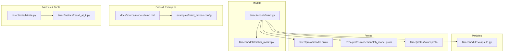
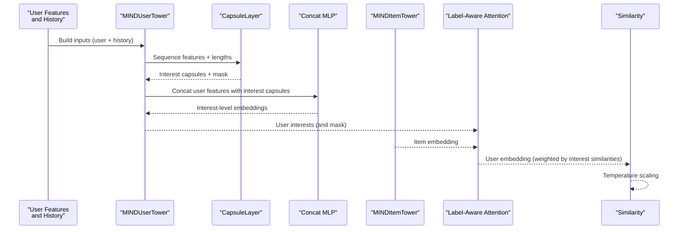
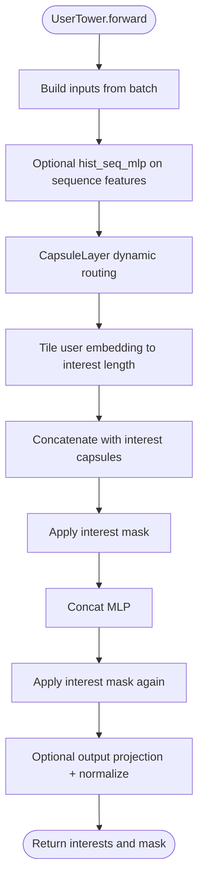
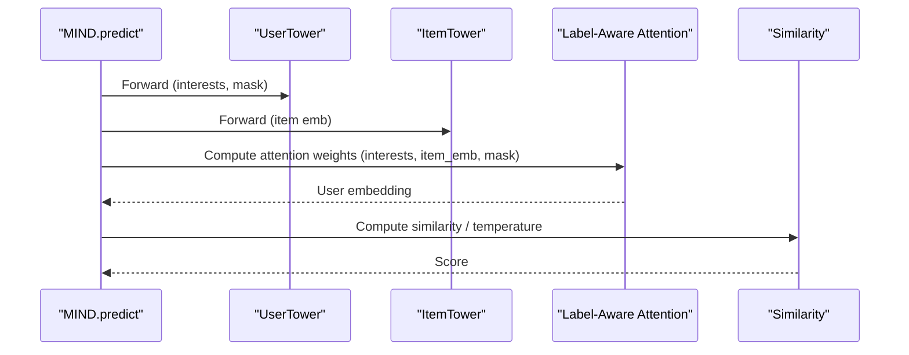
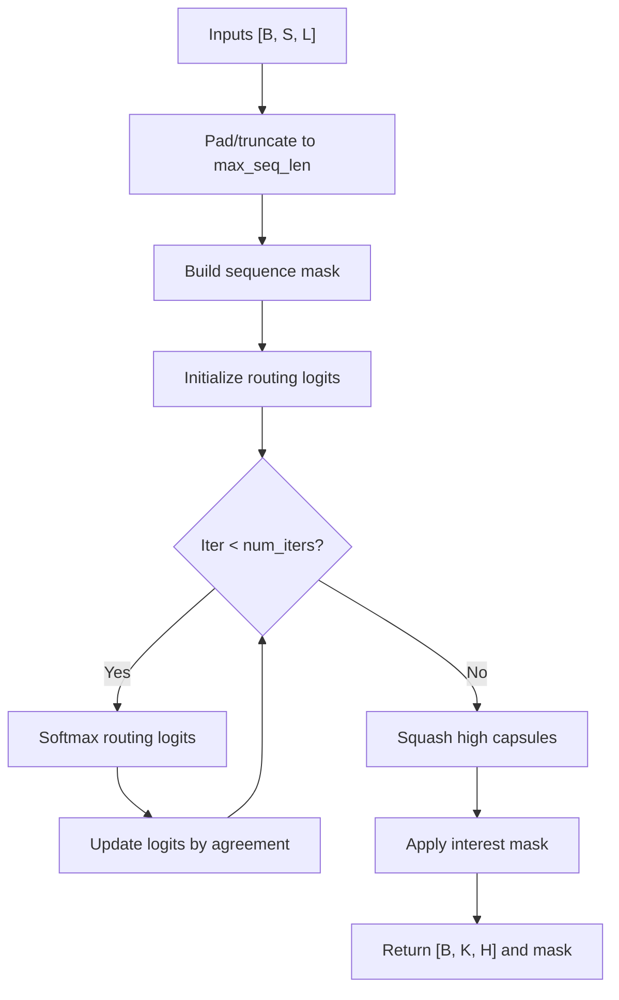
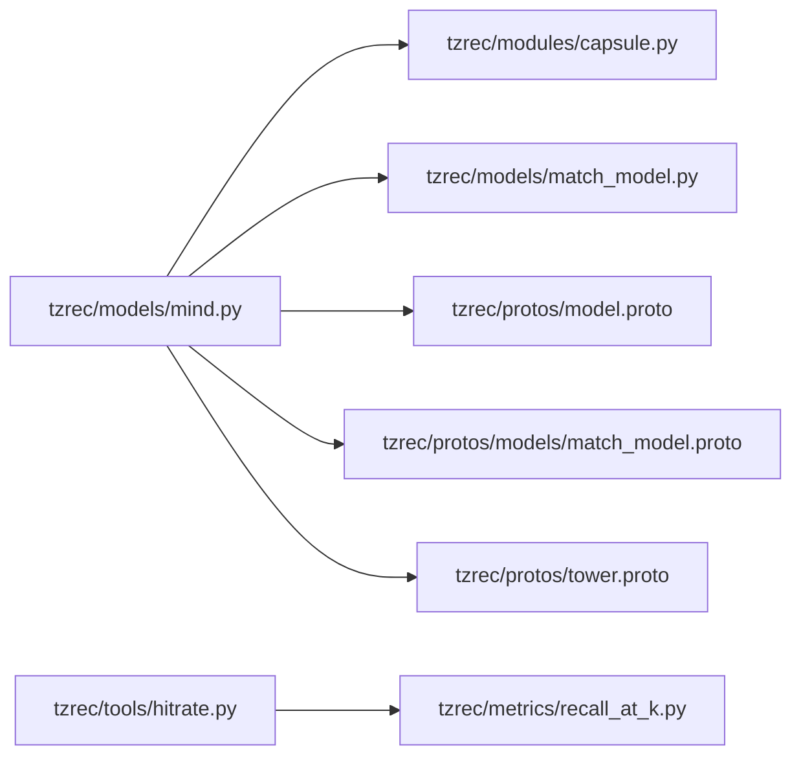

# MIND Model

<cite>
**Referenced Files in This Document**
- [mind.py](file://tzrec/models/mind.py)
- [mind.md](file://docs/source/models/mind.md)
- [mind_taobao.config](file://examples/mind_taobao.config)
- [capsule.py](file://tzrec/modules/capsule.py)
- [match_model.py](file://tzrec/models/match_model.py)
- [recall_at_k.py](file://tzrec/metrics/recall_at_k.py)
- [hitrate.py](file://tzrec/tools/hitrate.py)
- [model.proto](file://tzrec/protos/model.proto)
- [match_model.proto](file://tzrec/protos/models/match_model.proto)
- [tower.proto](file://tzrec/protos/tower.proto)
</cite>

## Table of Contents

1. [Introduction](#introduction)
1. [Project Structure](#project-structure)
1. [Core Components](#core-components)
1. [Architecture Overview](#architecture-overview)
1. [Detailed Component Analysis](#detailed-component-analysis)
1. [Dependency Analysis](#dependency-analysis)
1. [Performance Considerations](#performance-considerations)
1. [Troubleshooting Guide](#troubleshooting-guide)
1. [Conclusion](#conclusion)
1. [Appendices](#appendices)

## Introduction

MIND (Multi-interest Neural Degrading) is a matching model that extends traditional deep matching approaches by explicitly extracting multiple user interests from historical behavior sequences and applying interest-aware attention to produce a user representation for ranking. It leverages a capsule routing mechanism to cluster heterogeneous historical interactions into distinct interests, followed by label-aware attention to select representative interests conditioned on the item being scored. The model supports configurable interest head counts, attention scaling, and similarity computation, and integrates with standard training and evaluation pipelines for retrieval tasks.

## Project Structure

This section highlights the files implementing MIND and related configurations and utilities.

**Diagram sources**

- \[mind.py\](file://tzrec/models/mind.py#L28-L366)
- \[capsule.py\](file://tzrec/modules/capsule.py#L65-L232)
- \[match_model.py\](file://tzrec/models/match_model.py#L265-L329)
- \[model.proto\](file://tzrec/protos/model.proto#L40-L90)
- \[match_model.proto\](file://tzrec/protos/models/match_model.proto#L72-L80)
- \[tower.proto\](file://tzrec/protos/tower.proto#L171-L197)
- \[mind.md\](file://docs/source/models/mind.md#L1-L257)
- \[mind_taobao.config\](file://examples/mind_taobao.config#L206-L296)
- \[recall_at_k.py\](file://tzrec/metrics/recall_at_k.py#L19-L55)
- \[hitrate.py\](file://tzrec/tools/hitrate.py#L47-L420)

**Section sources**

- \[mind.py\](file://tzrec/models/mind.py#L28-L366)
- \[mind.md\](file://docs/source/models/mind.md#L1-L257)
- \[mind_taobao.config\](file://examples/mind_taobao.config#L206-L296)

## Core Components

- MINDUserTower: Extracts user interests from user features and history sequences via an MLP, optional sequence MLP, a capsule routing layer, concatenation with user features, and a final MLP. Outputs interest-level vectors and a mask for valid interests.
- MINDItemTower: Embeds item features via an MLP and optionally projects to a specified output dimension.
- MIND (MatchModel): Orchestrates user and item towers, computes label-aware attention over user interests conditioned on the positive item, and produces a similarity score with optional temperature scaling and hard negatives.

Key configuration knobs:

- Interest extraction: user_mlp, hist_seq_mlp, capsule_config (max_k, high_dim, num_iters, squash_pow, routing logits scale/stddev).
- Interest aggregation: concat_mlp, output_dim, similarity, temperature.
- Attention: simi_pow scales differences among interest similarities.
- Training: softmax cross entropy loss, optional in-batch negatives.

**Section sources**

- \[mind.py\](file://tzrec/models/mind.py#L28-L366)
- \[mind.md\](file://docs/source/models/mind.md#L75-L132)
- \[mind_taobao.config\](file://examples/mind_taobao.config#L238-L281)

## Architecture Overview

High-level flow of MIND during inference and training:

**Diagram sources**

- \[mind.py\](file://tzrec/models/mind.py#L143-L194)
- \[mind.py\](file://tzrec/models/mind.py#L197-L252)
- \[mind.py\](file://tzrec/models/mind.py#L303-L365)
- \[capsule.py\](file://tzrec/modules/capsule.py#L184-L231)

## Detailed Component Analysis

### MINDUserTower: Interest Extraction and Aggregation

- Input handling: builds user and history sequence features from configured groups.
- User MLP: transforms user features to a latent space.
- Optional history sequence MLP: processes sequence features with optional linear projection.
- CapsuleLayer: performs dynamic routing to extract up to max_k interest capsules per user, with sequence masking and optional constant interest count.
- Interest aggregation: tiles user embedding to interest length, concatenates with high-level capsules, applies concat MLP, and optionally projects to output_dim; normalization under cosine similarity.
- Output: interest-level embeddings and a validity mask for downstream attention.

**Diagram sources**

- \[mind.py\](file://tzrec/models/mind.py#L143-L194)
- \[capsule.py\](file://tzrec/modules/capsule.py#L184-L231)

**Section sources**

- \[mind.py\](file://tzrec/models/mind.py#L28-L194)
- \[capsule.py\](file://tzrec/modules/capsule.py#L65-L232)

### MINDItemTower: Item Embedding

- Embeds item features via an MLP and optionally projects to output_dim.
- Applies normalization under cosine similarity.

**Section sources**

- \[mind.py\](file://tzrec/models/mind.py#L197-L252)

### MIND (MatchModel): Label-Aware Attention and Ranking

- Predict: runs user tower (interest extraction), item tower (item embedding), then computes label-aware attention over interests using item embedding similarities, scaled by simi_pow and softmaxed by interest mask; aggregates to a user embedding; computes similarity against item embeddings with temperature scaling.
- Loss: softmax cross entropy with optional in-batch negatives.

**Diagram sources**

- \[mind.py\](file://tzrec/models/mind.py#L335-L365)
- \[match_model.py\](file://tzrec/models/match_model.py#L265-L329)

**Section sources**

- \[mind.py\](file://tzrec/models/mind.py#L255-L365)
- \[match_model.py\](file://tzrec/models/match_model.py#L265-L329)

### CapsuleLayer: Dynamic Routing and Interest Clustering

- Initializes routing logits, bilinear projection from low-level to high-level capsules, and squash with configurable power.
- Performs iterative routing with sequence masks and interest masks; caps the logits to respect mask thresholds; squashes final high-level capsules.
- Supports constant or logarithmic interest count depending on sequence length.

**Diagram sources**

- \[capsule.py\](file://tzrec/modules/capsule.py#L125-L182)
- \[capsule.py\](file://tzrec/modules/capsule.py#L184-L231)

**Section sources**

- \[capsule.py\](file://tzrec/modules/capsule.py#L65-L232)

### Configuration and Protobuf Definitions

- Model registration and configuration: MIND is defined as a model variant and composed of user and item towers plus global settings (similarity, temperature, output_dim, simi_pow, in-batch negatives).
- Tower configurations: MINDUserTower and MINDItemTower define MLP stacks and capsule routing parameters.
- Example configuration: A complete Taobao-style pipeline demonstrates feature groups, sequence features, and MIND model settings.

**Section sources**

- \[model.proto\](file://tzrec/protos/model.proto#L40-L90)
- \[match_model.proto\](file://tzrec/protos/models/match_model.proto#L72-L80)
- \[tower.proto\](file://tzrec/protos/tower.proto#L171-L197)
- \[mind.md\](file://docs/source/models/mind.md#L43-L132)
- \[mind_taobao.config\](file://examples/mind_taobao.config#L206-L296)

### Training and Evaluation

- Training: softmax cross entropy loss for matching; optional in-batch negatives; sample weights supported.
- Evaluation: recall@K metrics; hitrate tool supports interest-aware merging and top-K aggregation across or per interest.

**Section sources**

- \[match_model.py\](file://tzrec/models/match_model.py#L265-L329)
- \[recall_at_k.py\](file://tzrec/metrics/recall_at_k.py#L19-L55)
- \[hitrate.py\](file://tzrec/tools/hitrate.py#L47-L420)
- \[mind.md\](file://docs/source/models/mind.md#L207-L252)

## Dependency Analysis

- MIND depends on:
  - MatchTower base for shared matching infrastructure.
  - CapsuleLayer for interest clustering.
  - Protobuf definitions for configuration composition.
  - Metrics and tools for evaluation.

**Diagram sources**

- \[mind.py\](file://tzrec/models/mind.py#L28-L366)
- \[capsule.py\](file://tzrec/modules/capsule.py#L65-L232)
- \[match_model.py\](file://tzrec/models/match_model.py#L265-L329)
- \[model.proto\](file://tzrec/protos/model.proto#L40-L90)
- \[match_model.proto\](file://tzrec/protos/models/match_model.proto#L72-L80)
- \[tower.proto\](file://tzrec/protos/tower.proto#L171-L197)
- \[hitrate.py\](file://tzrec/tools/hitrate.py#L47-L420)
- \[recall_at_k.py\](file://tzrec/metrics/recall_at_k.py#L19-L55)

**Section sources**

- \[mind.py\](file://tzrec/models/mind.py#L28-L366)
- \[capsule.py\](file://tzrec/modules/capsule.py#L65-L232)
- \[match_model.py\](file://tzrec/models/match_model.py#L265-L329)
- \[model.proto\](file://tzrec/protos/model.proto#L40-L90)
- \[match_model.proto\](file://tzrec/protos/models/match_model.proto#L72-L80)
- \[tower.proto\](file://tzrec/protos/tower.proto#L171-L197)
- \[hitrate.py\](file://tzrec/tools/hitrate.py#L47-L420)
- \[recall_at_k.py\](file://tzrec/metrics/recall_at_k.py#L19-L55)

## Performance Considerations

- Interest head count: max_k controls the number of extracted interests; higher values increase memory and compute for routing and attention.
- Sequence length: max_seq_len affects capsule input size; longer histories increase routing cost.
- Attention scaling: simi_pow amplifies differences among interest similarities; choose based on data distribution to avoid numerical saturation.
- Normalization: cosine similarity normalization improves stability; temperature scaling helps separate positive/negative scores.
- Computation efficiency: consider reducing concat_mlp and output_dim when memory is constrained; disable unnecessary dropout in production inference.

[No sources needed since this section provides general guidance]

## Troubleshooting Guide

- Low recall across interests: verify num_interests and topk_across_interests settings; check that interest mask is not overly restrictive.
- Over-smoothed interests: adjust squash_pow and routing logits scale/stddev; inspect routing logits initialization.
- Poor separation between positive and negative items: reduce temperature or increase simi_pow; ensure in-batch negatives are enabled when appropriate.
- Evaluation mismatch: confirm that hitrate tool receives properly shaped user embeddings with interest dimensionality and that num_interests matches training configuration.

**Section sources**

- \[mind.md\](file://docs/source/models/mind.md#L207-L252)
- \[hitrate.py\](file://tzrec/tools/hitrate.py#L354-L420)
- \[capsule.py\](file://tzrec/modules/capsule.py#L143-L182)

## Conclusion

MIND introduces explicit multi-interest modeling to matching by clustering historical behavior into interest capsules and selecting representative interests via label-aware attention. Its modular design enables flexible configuration of interest extraction, aggregation, and attention mechanisms, while integrating seamlessly with standard training and evaluation tooling for retrieval tasks.

[No sources needed since this section summarizes without analyzing specific files]

## Appendices

### Configuration Reference

- Model-level settings: output_dim, similarity, temperature, simi_pow, in_batch_negative.
- User tower: user_mlp, hist_seq_mlp, capsule_config (max_k, high_dim, num_iters, squash_pow, routing logits scale/stddev), concat_mlp.
- Item tower: mlp.

**Section sources**

- \[mind.md\](file://docs/source/models/mind.md#L139-L163)
- \[mind_taobao.config\](file://examples/mind_taobao.config#L238-L281)

### Practical Examples

- Multi-interest extraction: run user tower inference to obtain interest-level embeddings.
- Interest-based ranking: compute label-aware attention weights and similarity scores for candidate items.
- Evaluation: use hitrate tool with num_interests and topk_across_interests to assess multi-interest matching effectiveness.

**Section sources**

- \[mind.md\](file://docs/source/models/mind.md#L169-L252)
- \[mind_taobao.config\](file://examples/mind_taobao.config#L1-L42)
