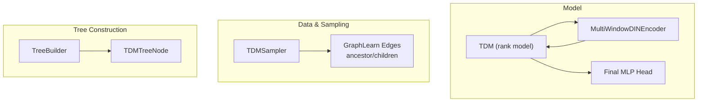
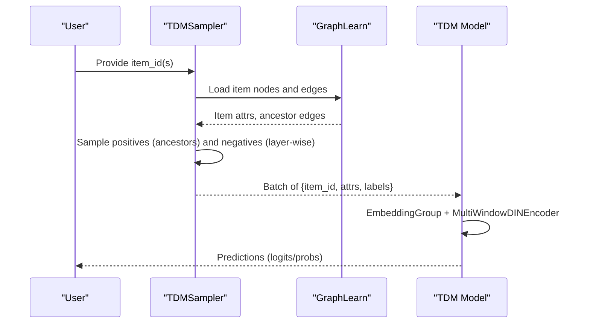
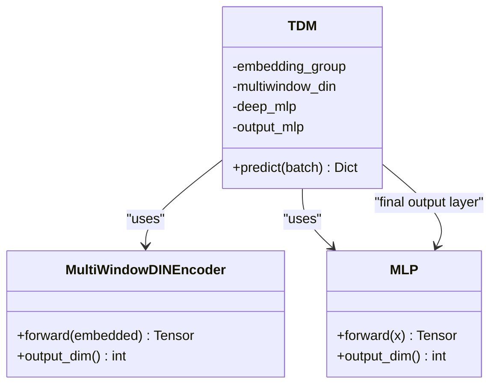
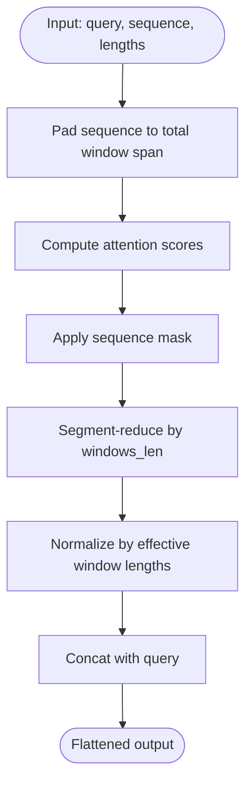
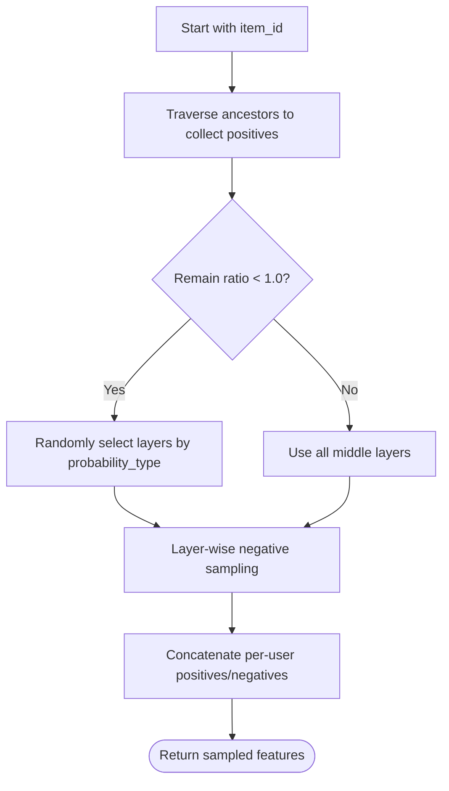
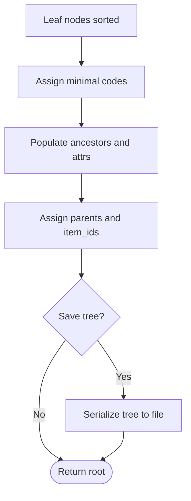
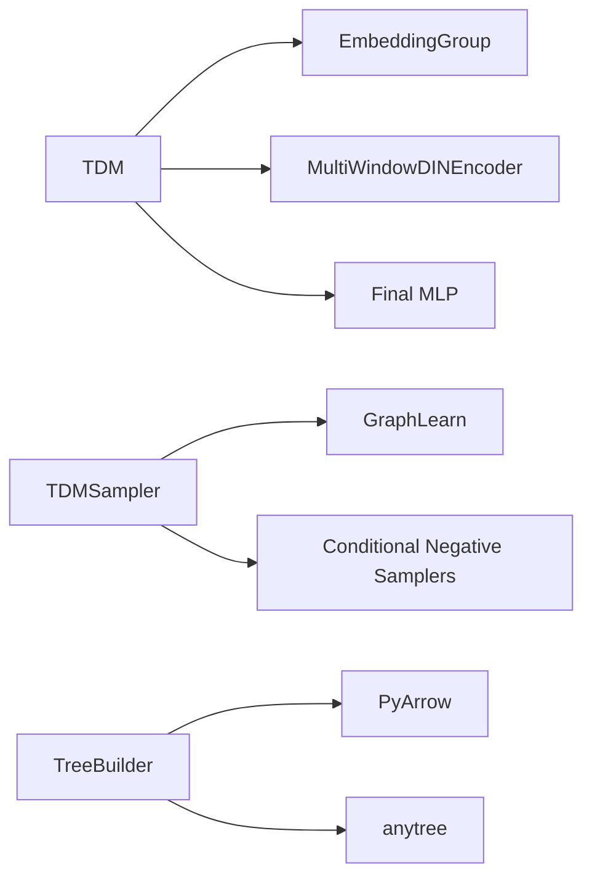

# TDM Model

<cite>
**Referenced Files in This Document**
- [tdm.py](file://tzrec/models/tdm.py)
- [sequence.py](file://tzrec/modules/sequence.py)
- [sampler.py](file://tzrec/datasets/sampler.py)
- [tree_builder.py](file://tzrec/tools/tdm/gen_tree/tree_builder.py)
- [tdm.md](file://docs/source/models/tdm.md)
- [tdm_taobao.config](file://examples/tdm_taobao.config)
- [tdm_taobao_local.config](file://experiments/taobao/tdm_taobao_local.config)
- [recall_at_k.py](file://tzrec/metrics/recall_at_k.py)
</cite>

## Table of Contents

1. [Introduction](#introduction)
1. [Project Structure](#project-structure)
1. [Core Components](#core-components)
1. [Architecture Overview](#architecture-overview)
1. [Detailed Component Analysis](#detailed-component-analysis)
1. [Dependency Analysis](#dependency-analysis)
1. [Performance Considerations](#performance-considerations)
1. [Troubleshooting Guide](#troubleshooting-guide)
1. [Conclusion](#conclusion)
1. [Appendices](#appendices)

## Introduction

This document explains the Tree-based Deep Model (TDM) implementation in TorchEasyRec. TDM leverages a hierarchical product tree to accelerate candidate generation and enable early feature crossing via a multi-window DIEN-style sequence encoder. It supports hierarchical softmax-style sampling and training on tree-structured negatives, with configurable tree construction parameters, node embedding dimensions, and hierarchical weights. Practical guidance is provided for building trees from product catalogs, configuring training and prediction workflows, and evaluating hierarchical retrieval performance.

## Project Structure

The TDM implementation spans model definition, sequence encoding, sampling, and tree construction utilities:

- Model definition: TDM rank model with embedding groups, multi-window DIEN encoder, and a final MLP head.
- Sequence encoding: MultiWindowDINEncoder aggregates attended representations across multiple time windows.
- Sampling: TDMSampler builds a graph from tree edges and performs layer-wise positive/negative sampling.
- Tree construction: TreeBuilder constructs a balanced n-ary tree with deterministic codes and ancestor propagation.

**Diagram sources**

- \[tdm.py\](file://tzrec/models/tdm.py#L28-L98)
- \[sequence.py\](file://tzrec/modules/sequence.py#L293-L373)
- \[sampler.py\](file://tzrec/datasets/sampler.py#L768-L967)
- \[tree_builder.py\](file://tzrec/tools/tdm/gen_tree/tree_builder.py#L69-L147)

**Section sources**

- \[tdm.py\](file://tzrec/models/tdm.py#L28-L98)
- \[sequence.py\](file://tzrec/modules/sequence.py#L293-L373)
- \[sampler.py\](file://tzrec/datasets/sampler.py#L768-L967)
- \[tree_builder.py\](file://tzrec/tools/tdm/gen_tree/tree_builder.py#L69-L147)

## Core Components

- TDM: A rank model that embeds features via an embedding group, applies a multi-window DIEN encoder on sequence features, concatenates non-sequence features, and passes the fused representation through a final MLP to produce logits.
- MultiWindowDINEncoder: Aggregates attended sequence representations across multiple time windows and appends a query-aware representation, producing a flattened feature vector for downstream classification.
- TDMSampler: Loads items and edges, builds a GraphLearn graph, and performs hierarchical sampling by traversing ancestors for positives and sampling negatives layer-by-layer according to configured counts.
- TreeBuilder: Constructs a balanced n-ary tree from leaf nodes, assigns deterministic tree codes, propagates ancestor attributes, and writes out the tree structure.

Key configuration highlights:

- Feature groups: One SEQUENCE group (required) and optional DEEP groups.
- TDM config: multiwindow_din windows_len and attention MLP params; final MLP hidden units and BN.
- TDMSampler config: item_input_path, edge_input_path, predict_edge_input_path, attr_fields, item_id_field, layer_num_sample, attr_delimiter, remain_ratio, probability_type.

**Section sources**

- \[tdm.py\](file://tzrec/models/tdm.py#L28-L98)
- \[sequence.py\](file://tzrec/modules/sequence.py#L293-L373)
- \[sampler.py\](file://tzrec/datasets/sampler.py#L768-L967)
- \[tree_builder.py\](file://tzrec/tools/tdm/gen_tree/tree_builder.py#L69-L147)
- \[tdm.md\](file://docs/source/models/tdm.md#L15-L129)
- \[tdm_taobao.config\](file://examples/tdm_taobao.config#L25-L90)
- \[tdm_taobao_local.config\](file://experiments/taobao/tdm_taobao_local.config#L25-L90)

## Architecture Overview

The TDM architecture integrates feature embedding, hierarchical attention over user sequences, and a tree-aware sampling strategy for training.

**Diagram sources**

- \[sampler.py\](file://tzrec/datasets/sampler.py#L768-L967)
- \[tdm.py\](file://tzrec/models/tdm.py#L79-L98)

## Detailed Component Analysis

### TDM Model

- Purpose: End-to-end ranking model for hierarchical candidate generation.
- Inputs: SEQUENCE group (query and sequence embeddings) and optional DEEP groups (static item/user features).
- Processing:
  - EmbeddingGroup computes per-feature embeddings and aggregates by group.
  - MultiWindowDINEncoder produces a windowed attended representation plus a query-aware vector.
  - Final MLP head maps to binary logits.
- Outputs: Predictions dictionary containing logits and probabilities.

**Diagram sources**

- \[tdm.py\](file://tzrec/models/tdm.py#L28-L98)
- \[sequence.py\](file://tzrec/modules/sequence.py#L293-L373)

**Section sources**

- \[tdm.py\](file://tzrec/models/tdm.py#L28-L98)

### MultiWindowDINEncoder

- Purpose: Hierarchical attention over variable-length sequences with multiple time windows.
- Mechanism:
  - Builds attention scores between query and sequence items.
  - Segments sequence into windows defined by windows_len and sums attended vectors.
  - Normalizes by effective window lengths and concatenates with query representation.
- Output dimension: (number of windows + 1) × sequence_dim.

**Diagram sources**

- \[sequence.py\](file://tzrec/modules/sequence.py#L335-L372)

**Section sources**

- \[sequence.py\](file://tzrec/modules/sequence.py#L293-L373)

### TDMSampler (Training)

- Purpose: Hierarchical sampling for training TDM with tree-structured negatives.
- Data ingestion:
  - Items: node table with attributes and item_id.
  - Edges: ancestor edges for hierarchical sampling.
- Sampling strategy:
  - Positive sampling: traverse ancestors up to the leaf; collect non-leaf ancestors plus the leaf.
  - Negative sampling: for each retained layer, sample layer_num_sample[i] items conditioned on the current ancestor.
  - Layer retention: optionally retain a random subset of middle layers with configurable probability distribution.
- Output: concatenated positive and negative features aligned per-user.

**Diagram sources**

- \[sampler.py\](file://tzrec/datasets/sampler.py#L864-L958)

**Section sources**

- \[sampler.py\](file://tzrec/datasets/sampler.py#L768-L967)

### TDMSampler (Prediction)

- Purpose: Efficient retrieval using children edges for beam search-like traversal.
- Data ingestion:
  - Items: node table with attributes and item_id.
  - Edges: children edges for retrieval expansion.
- Initialization:
  - Build neighbor sampler for children edges with expand_factor.
- Prediction:
  - Expand from provided item_id(s) using children edges to retrieve candidates.

**Section sources**

- \[sampler.py\](file://tzrec/datasets/sampler.py#L979-L1021)

### TreeBuilder (Tree Construction)

- Purpose: Construct a balanced n-ary tree from leaf nodes and assign deterministic tree codes.
- Steps:
  - Sort leaf nodes and assign minimal code to align leaves at the deepest level.
  - Build ancestor lists for each leaf and populate ancestor nodes with aggregated attributes.
  - Assign parents and item_ids; persist tree structure if requested.
- Output: Root node of the constructed tree.

**Diagram sources**

- \[tree_builder.py\](file://tzrec/tools/tdm/gen_tree/tree_builder.py#L81-L147)

**Section sources**

- \[tree_builder.py\](file://tzrec/tools/tdm/gen_tree/tree_builder.py#L69-L147)

## Dependency Analysis

- TDM depends on:
  - EmbeddingGroup for feature embeddings.
  - MultiWindowDINEncoder for sequence modeling.
  - MLP for final transformation.
- TDMSampler depends on:
  - GraphLearn graph for loading nodes and edges.
  - Conditional negative sampling per layer.
- TreeBuilder depends on:
  - PyArrow for attribute aggregation.
  - anytree for tree node hierarchy.

**Diagram sources**

- \[tdm.py\](file://tzrec/models/tdm.py#L47-L77)
- \[sequence.py\](file://tzrec/modules/sequence.py#L293-L373)
- \[sampler.py\](file://tzrec/datasets/sampler.py#L788-L852)
- \[tree_builder.py\](file://tzrec/tools/tdm/gen_tree/tree_builder.py#L12-L24)

**Section sources**

- \[tdm.py\](file://tzrec/models/tdm.py#L47-L77)
- \[sequence.py\](file://tzrec/modules/sequence.py#L293-L373)
- \[sampler.py\](file://tzrec/datasets/sampler.py#L788-L852)
- \[tree_builder.py\](file://tzrec/tools/tdm/gen_tree/tree_builder.py#L12-L24)

## Performance Considerations

- Memory optimization for large trees:
  - Use fixed-length hashed node IDs to ensure sortable IDs and efficient graph operations.
  - Persist tree structure to disk and load on demand.
- Training efficiency:
  - Adjust remain_ratio to train only a subset of middle layers, reducing compute.
  - Tune probability_type to focus sampling on deeper layers if needed.
- Inference speed:
  - MultiWindowDINEncoder’s segment_reduce operation scales with total window span; choose windows_len carefully.
  - Use JIT scripting or FX tracing for model deployment to improve runtime performance.
- Evaluation:
  - Use Recall@K metric to assess hierarchical retrieval quality at various cutoffs.

[No sources needed since this section provides general guidance]

## Troubleshooting Guide

- Symptom: Training loss unstable or slow convergence.
  - Verify layer_num_sample starts with zero for the root and increases with depth.
  - Confirm attr_fields include tree_level and item_id_field in the correct order.
- Symptom: GraphLearn timeouts or missing nodes.
  - Ensure item_input_path and edge_input_path are valid and accessible.
  - Align attr_delimiter with the data format.
- Symptom: Incorrect tree traversal during prediction.
  - Use predict_edge_input_path with children edges for retrieval.
  - Validate that item_id_field matches the node table schema.
- Symptom: Large memory footprint during training.
  - Reduce remain_ratio to train fewer layers.
  - Lower layer_num_sample for deeper layers.

**Section sources**

- \[sampler.py\](file://tzrec/datasets/sampler.py#L776-L808)
- \[tdm.md\](file://docs/source/models/tdm.md#L104-L121)

## Conclusion

TDM in TorchEasyRec combines a hierarchical product tree with a multi-window DIEN encoder to enable efficient, early-crossing candidate generation and training with hierarchical sampling. The modular design separates tree construction, sampling, and model training, enabling scalable deployment and tuning. Proper configuration of tree parameters, sampling strategies, and model hyperparameters is essential for achieving strong retrieval performance.

[No sources needed since this section summarizes without analyzing specific files]

## Appendices

### Configuration Examples

- Example training configuration with TDMSampler and TDM model:
  - data_config: tdm_sampler with item_input_path, edge_input_path, predict_edge_input_path, attr_fields, item_id_field, layer_num_sample, attr_delimiter.
  - model_config: feature_groups (SEQUENCE required), tdm multiwindow_din and final MLP, num_class, metrics, losses.
- Example experiment configuration:
  - Similar structure to the training example with dataset paths and feature embeddings.

**Section sources**

- \[tdm.md\](file://docs/source/models/tdm.md#L15-L129)
- \[tdm_taobao.config\](file://examples/tdm_taobao.config#L25-L90)
- \[tdm_taobao_local.config\](file://experiments/taobao/tdm_taobao_local.config#L25-L90)

### Practical Workflows

- Building a tree from product catalogs:
  - Prepare leaf nodes with attributes; assign deterministic tree codes; propagate ancestor attributes; persist tree structure.
- Training workflow:
  - Prepare item and edge tables; configure TDMSampler; initialize TDMSampler; run training loop with hierarchical sampling.
- Evaluation metrics:
  - Use AUC and Recall@K to evaluate ranking performance.

**Section sources**

- \[tree_builder.py\](file://tzrec/tools/tdm/gen_tree/tree_builder.py#L81-L147)
- \[sampler.py\](file://tzrec/datasets/sampler.py#L831-L863)
- \[recall_at_k.py\](file://tzrec/metrics/recall_at_k.py#L19-L54)
