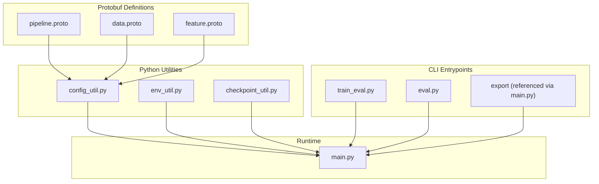
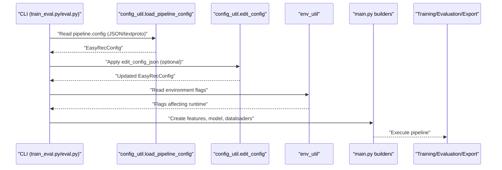
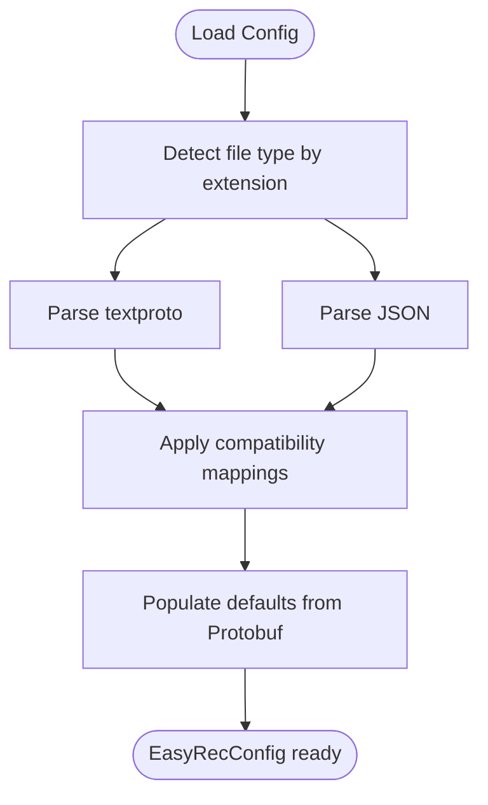
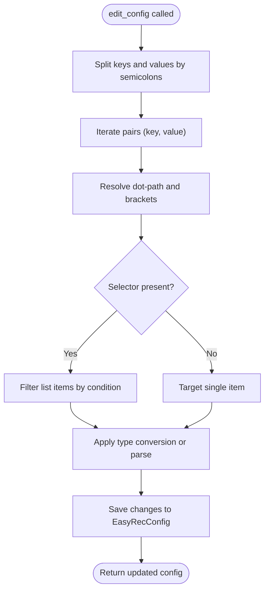
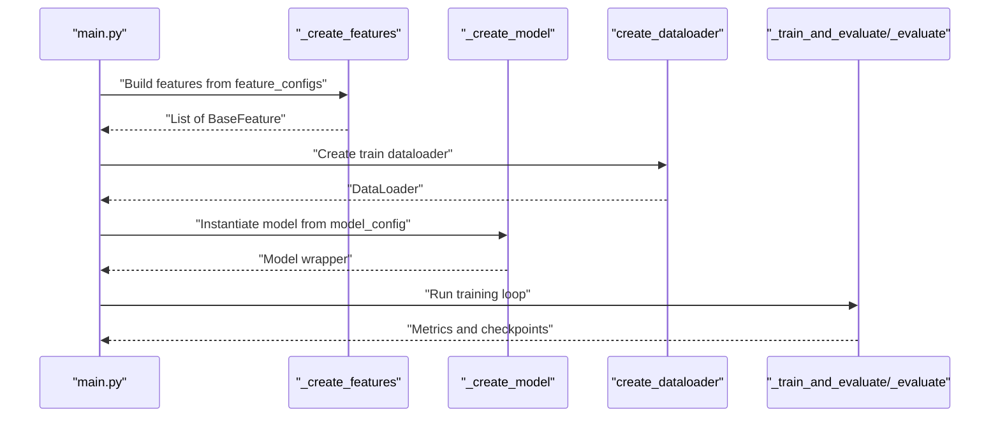
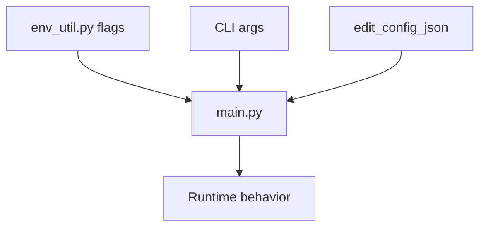
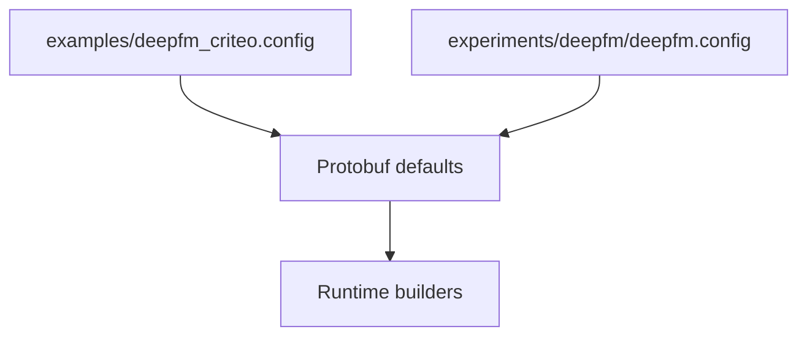
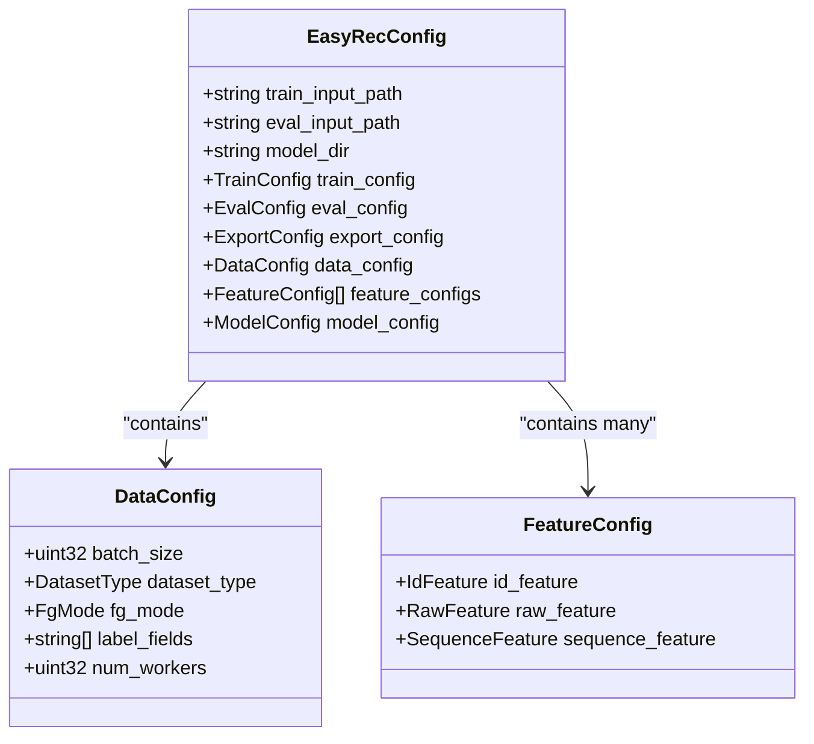
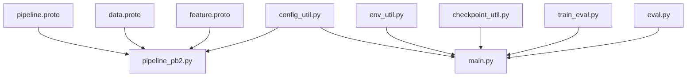

# Configuration Processing and Validation

<cite>
**Referenced Files in This Document**
- [config_util.py](file://tzrec/utils/config_util.py)
- [main.py](file://tzrec/main.py)
- [train_eval.py](file://tzrec/train_eval.py)
- [eval.py](file://tzrec/eval.py)
- [pipeline.proto](file://tzrec/protos/pipeline.proto)
- [pipeline_pb2.py](file://tzrec/protos/pipeline_pb2.py)
- [data.proto](file://tzrec/protos/data.proto)
- [feature.proto](file://tzrec/protos/feature.proto)
- [env_util.py](file://tzrec/utils/env_util.py)
- [checkpoint_util.py](file://tzrec/utils/checkpoint_util.py)
- [add_feature_info_to_config.py](file://tzrec/tools/add_feature_info_to_config.py)
- [deepfm_criteo.config](file://examples/deepfm_criteo.config)
- [deepfm.config](file://experiments/deepfm/deepfm.config)
</cite>

## Table of Contents

1. [Introduction](#introduction)
1. [Project Structure](#project-structure)
1. [Core Components](#core-components)
1. [Architecture Overview](#architecture-overview)
1. [Detailed Component Analysis](#detailed-component-analysis)
1. [Dependency Analysis](#dependency-analysis)
1. [Performance Considerations](#performance-considerations)
1. [Troubleshooting Guide](#troubleshooting-guide)
1. [Conclusion](#conclusion)
1. [Appendices](#appendices)

## Introduction

This document explains TorchEasyRec’s configuration processing and validation system. It covers how configuration files are loaded, parsed, validated, and transformed into internal runtime structures. It also documents configuration editing, environment-specific behavior, defaults, and how configurations integrate with the training, evaluation, and export pipelines. Guidance is included for debugging, maintaining consistency across environments, and understanding performance implications.

## Project Structure

TorchEasyRec organizes configuration around Protocol Buffers (Protobuf) definitions and Python utilities:

- Protobuf schemas define the canonical configuration structure (e.g., EasyRecConfig, DataConfig, FeatureConfig).
- Python utilities parse configuration files, convert them to internal structures, and support runtime editing.
- CLI entry points orchestrate training, evaluation, and export using the processed configuration.

**Diagram sources**

- \[pipeline.proto\](file://tzrec/protos/pipeline.proto#L11-L29)
- \[data.proto\](file://tzrec/protos/data.proto#L43-L137)
- \[feature.proto\](file://tzrec/protos/feature.proto#L112-L180)
- \[config_util.py\](file://tzrec/utils/config_util.py#L25-L48)
- \[env_util.py\](file://tzrec/utils/env_util.py#L19-L57)
- \[checkpoint_util.py\](file://tzrec/utils/checkpoint_util.py#L147-L173)
- \[train_eval.py\](file://tzrec/train_eval.py#L16-L72)
- \[eval.py\](file://tzrec/eval.py#L16-L50)
- \[main.py\](file://tzrec/main.py#L527-L736)

**Section sources**

- \[pipeline.proto\](file://tzrec/protos/pipeline.proto#L11-L29)
- \[data.proto\](file://tzrec/protos/data.proto#L43-L137)
- \[feature.proto\](file://tzrec/protos/feature.proto#L112-L180)
- \[config_util.py\](file://tzrec/utils/config_util.py#L25-L48)
- \[env_util.py\](file://tzrec/utils/env_util.py#L19-L57)
- \[checkpoint_util.py\](file://tzrec/utils/checkpoint_util.py#L147-L173)
- \[train_eval.py\](file://tzrec/train_eval.py#L16-L72)
- \[eval.py\](file://tzrec/eval.py#L16-L50)
- \[main.py\](file://tzrec/main.py#L527-L736)

## Core Components

- Configuration loader: Reads JSON or textproto files and produces a strongly-typed EasyRecConfig object.
- Configuration editor: Applies targeted updates to nested fields, lists, and oneof groups using dot-path expressions and selectors.
- Runtime builders: Convert configuration into feature sets, models, and data loaders.
- Environment utilities: Provide environment-driven toggles influencing runtime behavior.
- Checkpoint utilities: Manage model checkpoints and best-checkpoint selection.

Key responsibilities:

- Parsing and validation via Protobuf.
- Default resolution and compatibility handling.
- Editing and selective overrides for automation and experimentation.
- Integration with training, evaluation, and export pipelines.

**Section sources**

- \[config_util.py\](file://tzrec/utils/config_util.py#L25-L48)
- \[config_util.py\](file://tzrec/utils/config_util.py#L144-L299)
- \[main.py\](file://tzrec/main.py#L527-L736)
- \[env_util.py\](file://tzrec/utils/env_util.py#L19-L57)
- \[checkpoint_util.py\](file://tzrec/utils/checkpoint_util.py#L147-L173)

## Architecture Overview

The configuration pipeline connects CLI entry points to runtime builders and datasets/models.

**Diagram sources**

- \[train_eval.py\](file://tzrec/train_eval.py#L63-L72)
- \[eval.py\](file://tzrec/eval.py#L45-L50)
- \[config_util.py\](file://tzrec/utils/config_util.py#L25-L48)
- \[config_util.py\](file://tzrec/utils/config_util.py#L144-L299)
- \[env_util.py\](file://tzrec/utils/env_util.py#L19-L57)
- \[main.py\](file://tzrec/main.py#L527-L736)

## Detailed Component Analysis

### Configuration Loading and Defaults

- File formats: JSON and textproto are supported. The loader selects the appropriate parser based on extension and preserves unknown fields when explicitly allowed.
- Compatibility: Certain legacy fields are mapped to modern equivalents during load to maintain backward compatibility.
- Defaults: Protobuf fields define defaults; these are reflected in the generated Python bindings and used when absent in the config.

**Diagram sources**

- \[config_util.py\](file://tzrec/utils/config_util.py#L25-L48)
- \[config_util.py\](file://tzrec/utils/config_util.py#L78-L92)
- \[pipeline.proto\](file://tzrec/protos/pipeline.proto#L11-L29)
- \[data.proto\](file://tzrec/protos/data.proto#L43-L107)

**Section sources**

- \[config_util.py\](file://tzrec/utils/config_util.py#L25-L48)
- \[config_util.py\](file://tzrec/utils/config_util.py#L78-L92)
- \[pipeline.proto\](file://tzrec/protos/pipeline.proto#L11-L29)
- \[data.proto\](file://tzrec/protos/data.proto#L43-L107)

### Configuration Editing and Overrides

- Dot-path navigation supports nested fields, list indexing, slicing, and selector-based filtering within lists.
- Type conversion ensures edits match the target field types; otherwise, values are parsed into the target field type or cleared and re-parsed.
- Supports updating oneof groups safely by clearing the previous variant and setting the new one.

**Diagram sources**

- \[config_util.py\](file://tzrec/utils/config_util.py#L144-L299)

**Section sources**

- \[config_util.py\](file://tzrec/utils/config_util.py#L144-L299)

### Runtime Processing Pipeline

- Training/Evaluation: The main entry validates mutually exclusive training controls, builds features and model, creates data loaders, and executes training loops with optional periodic evaluation.
- Evaluation: Loads a checkpoint (latest or specified), rebuilds the model, and runs evaluation with optional overrides.
- Export: Triggered via the main module; integrates with model creation and checkpoint utilities.

**Diagram sources**

- \[main.py\](file://tzrec/main.py#L527-L736)
- \[main.py\](file://tzrec/main.py#L93-L158)
- \[main.py\](file://tzrec/main.py#L161-L225)

**Section sources**

- \[main.py\](file://tzrec/main.py#L527-L736)
- \[main.py\](file://tzrec/main.py#L93-L158)
- \[main.py\](file://tzrec/main.py#L161-L225)

### Environment-Specific Behavior and Overrides

- Environment flags influence runtime behavior (e.g., enabling special kernels or forcing plan loading).
- CLI flags can override paths and fine-tune checkpoints, while edit_config_json enables programmatic overrides.

**Diagram sources**

- \[env_util.py\](file://tzrec/utils/env_util.py#L19-L57)
- \[train_eval.py\](file://tzrec/train_eval.py#L48-L54)
- \[eval.py\](file://tzrec/eval.py#L24-L42)
- \[main.py\](file://tzrec/main.py#L527-L564)

**Section sources**

- \[env_util.py\](file://tzrec/utils/env_util.py#L19-L57)
- \[train_eval.py\](file://tzrec/train_eval.py#L48-L54)
- \[eval.py\](file://tzrec/eval.py#L24-L42)
- \[main.py\](file://tzrec/main.py#L527-L564)

### Configuration Examples and Defaults

- Example configurations demonstrate typical setups for training, evaluation, and feature definitions.
- Protobuf defaults ensure missing fields are populated consistently.

**Diagram sources**

- \[deepfm_criteo.config\](file://examples/deepfm_criteo.config#L1-L397)
- \[deepfm.config\](file://experiments/deepfm/deepfm.config#L1-L142)
- \[data.proto\](file://tzrec/protos/data.proto#L43-L107)

**Section sources**

- \[deepfm_criteo.config\](file://examples/deepfm_criteo.config#L1-L397)
- \[deepfm.config\](file://experiments/deepfm/deepfm.config#L1-L142)
- \[data.proto\](file://tzrec/protos/data.proto#L43-L107)

### Relationship Between Configuration and Pipelines

- EasyRecConfig anchors the entire pipeline: it defines input paths, model directory, training/evaluation/export configs, data configuration, feature configurations, and model configuration.
- The main module reads EasyRecConfig, constructs features and model, and orchestrates training/evaluation/export.

**Diagram sources**

- \[pipeline.proto\](file://tzrec/protos/pipeline.proto#L11-L29)
- \[data.proto\](file://tzrec/protos/data.proto#L43-L137)
- \[feature.proto\](file://tzrec/protos/feature.proto#L112-L180)

**Section sources**

- \[pipeline.proto\](file://tzrec/protos/pipeline.proto#L11-L29)
- \[data.proto\](file://tzrec/protos/data.proto#L43-L137)
- \[feature.proto\](file://tzrec/protos/feature.proto#L112-L180)

### Configuration Caching and Hot-Reloading

- Checkpoint utilities manage saving/loading model checkpoints and selecting the best checkpoint based on evaluation logs.
- There is no built-in hot-reload mechanism for configuration files; edits are applied via edit_config_json or by replacing the configuration file and restarting the process.

**Section sources**

- \[checkpoint_util.py\](file://tzrec/utils/checkpoint_util.py#L147-L173)
- \[checkpoint_util.py\](file://tzrec/utils/checkpoint_util.py#L176-L200)

## Dependency Analysis

Configuration dependencies span Protobuf definitions, utilities, and runtime builders.

**Diagram sources**

- \[pipeline.proto\](file://tzrec/protos/pipeline.proto#L1-L30)
- \[pipeline_pb2.py\](file://tzrec/protos/pipeline_pb2.py#L15-L21)
- \[data.proto\](file://tzrec/protos/data.proto#L1-L138)
- \[feature.proto\](file://tzrec/protos/feature.proto#L1-L200)
- \[config_util.py\](file://tzrec/utils/config_util.py#L25-L48)
- \[main.py\](file://tzrec/main.py#L527-L736)
- \[env_util.py\](file://tzrec/utils/env_util.py#L19-L57)
- \[checkpoint_util.py\](file://tzrec/utils/checkpoint_util.py#L147-L173)
- \[train_eval.py\](file://tzrec/train_eval.py#L16-L72)
- \[eval.py\](file://tzrec/eval.py#L16-L50)

**Section sources**

- \[pipeline_pb2.py\](file://tzrec/protos/pipeline_pb2.py#L15-L21)
- \[config_util.py\](file://tzrec/utils/config_util.py#L25-L48)
- \[main.py\](file://tzrec/main.py#L527-L736)

## Performance Considerations

- Protobuf parsing is efficient and deterministic; prefer textproto for readability and JSON for interoperability.
- Defaults minimize explicit configuration overhead; ensure only necessary overrides are provided to reduce diffs.
- Feature generation mode (FgMode) affects preprocessing performance; choose FG_NONE for preprocessed data or FG_DAG for DAG-based generation.
- Environment flags can enable specialized kernels; verify hardware and Triton versions when enabling advanced features.

[No sources needed since this section provides general guidance]

## Troubleshooting Guide

Common configuration issues and resolutions:

- Unknown fields in JSON/textproto: Allow unknown fields only temporarily for migration; otherwise, remove or map to known fields.
- Type mismatches during editing: Ensure edited values match the target field types; the editor attempts conversions and falls back to parsing.
- Selector syntax errors: Verify bracket notation and operators; incorrect conditions cause assertion failures.
- Deprecated fields: Legacy fields are remapped automatically; update to new fields to avoid warnings.
- Environment flags: Some flags require additional environment variables; ensure prerequisites are met.

Operational tips:

- Use edit_config_json to apply safe, targeted overrides without manual file edits.
- Validate feature groups and sequences after automated updates.
- Confirm dataset type and delimiter settings align with input data formats.

**Section sources**

- \[config_util.py\](file://tzrec/utils/config_util.py#L25-L48)
- \[config_util.py\](file://tzrec/utils/config_util.py#L144-L299)
- \[env_util.py\](file://tzrec/utils/env_util.py#L24-L32)

## Conclusion

TorchEasyRec’s configuration system centers on Protobuf-defined schemas, robust parsing, and flexible editing. It integrates tightly with the training, evaluation, and export pipelines, while environment utilities and checkpoint utilities support production-grade workflows. By leveraging defaults, structured editing, and careful validation, teams can maintain consistency and reliability across diverse environments.

[No sources needed since this section summarizes without analyzing specific files]

## Appendices

### Appendix A: Configuration Editing Syntax Highlights

- Dot paths navigate nested fields.
- Bracket notation supports:
  - Indexing: feature_configs[0]
  - Slicing: feature_configs[1:3]
  - Filtering by condition: feature_configs[id_feature.feature_name=age_level]
- Oneof groups are updated by clearing the previous variant and setting the new one.

**Section sources**

- \[config_util.py\](file://tzrec/utils/config_util.py#L144-L299)

### Appendix B: Automated Feature Info Injection Tool

- Loads feature metadata and updates embedding dimensions and bucket sizes in feature configs.
- Drops features marked for removal and prunes empty sequence groups.

**Section sources**

- \[add_feature_info_to_config.py\](file://tzrec/tools/add_feature_info_to_config.py#L204-L213)
