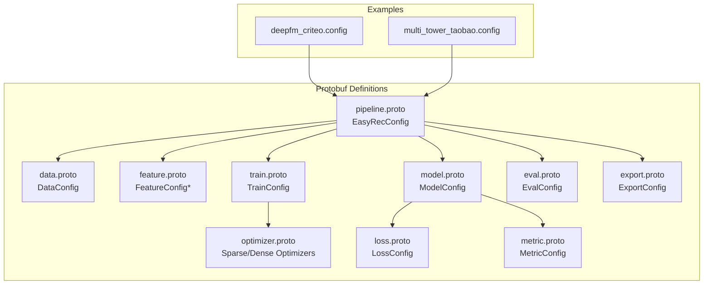
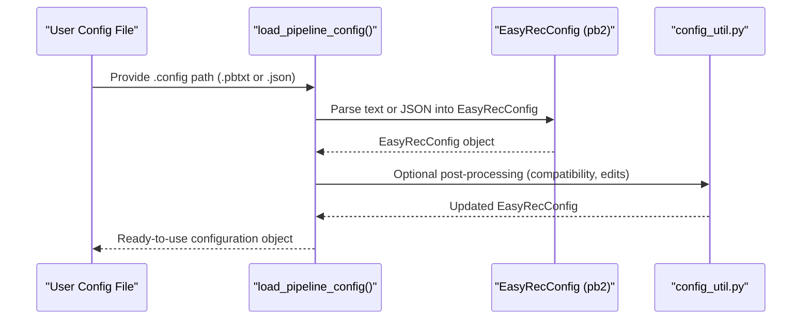
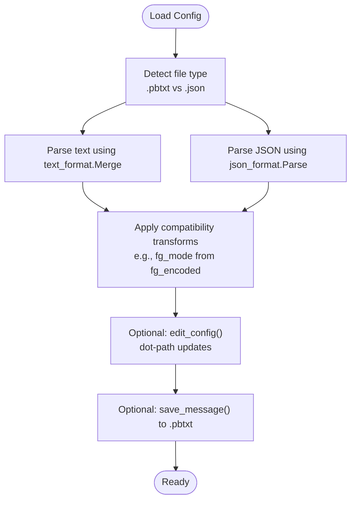
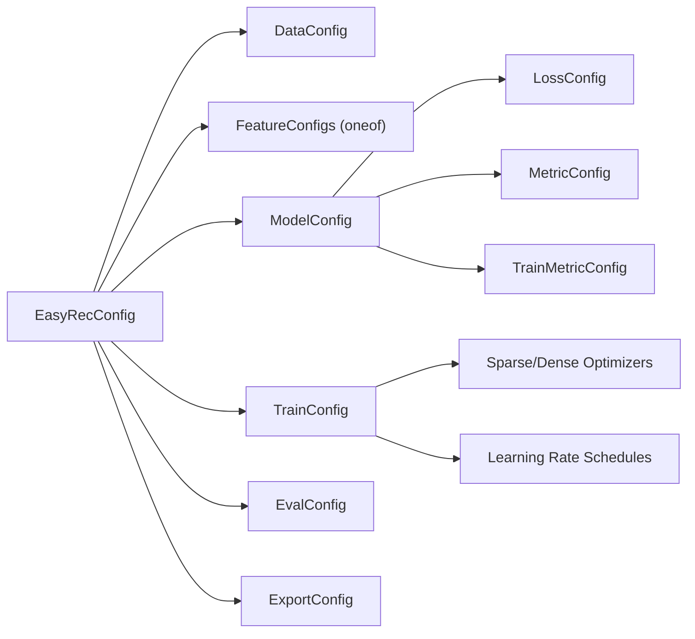

# Configuration System and Protocol Buffers

<cite>
**Referenced Files in This Document**
- [pipeline.proto](file://tzrec/protos/pipeline.proto)
- [data.proto](file://tzrec/protos/data.proto)
- [feature.proto](file://tzrec/protos/feature.proto)
- [model.proto](file://tzrec/protos/model.proto)
- [train.proto](file://tzrec/protos/train.proto)
- [eval.proto](file://tzrec/protos/eval.proto)
- [export.proto](file://tzrec/protos/export.proto)
- [optimizer.proto](file://tzrec/protos/optimizer.proto)
- [loss.proto](file://tzrec/protos/loss.proto)
- [metric.proto](file://tzrec/protos/metric.proto)
- [config_util.py](file://tzrec/utils/config_util.py)
- [deepfm_criteo.config](file://examples/deepfm_criteo.config)
- [multi_tower_taobao.config](file://examples/multi_tower_taobao.config)
</cite>

## Table of Contents

1. [Introduction](#introduction)
1. [Project Structure](#project-structure)
1. [Core Components](#core-components)
1. [Architecture Overview](#architecture-overview)
1. [Detailed Component Analysis](#detailed-component-analysis)
1. [Dependency Analysis](#dependency-analysis)
1. [Performance Considerations](#performance-considerations)
1. [Troubleshooting Guide](#troubleshooting-guide)
1. [Conclusion](#conclusion)
1. [Appendices](#appendices)

## Introduction

This document explains TorchEasyRec’s configuration system based on Protocol Buffers. It covers the complete configuration schema including data configuration, feature configuration, model configuration, training configuration, and pipeline configuration. It also documents the Protocol Buffers implementation, configuration validation, runtime processing, file structure, defaults, and practical examples. Guidance is provided for configuration inheritance, environment overrides, versioning, best practices, and maintaining consistency across environments. Finally, it connects configuration files to the underlying Python implementation.

## Project Structure

TorchEasyRec organizes configuration definitions in Protocol Buffer files under the protos package and exposes a single pipeline-level message that aggregates all configuration pieces. Example configuration files demonstrate real-world usage patterns.

**Diagram sources**

- \[pipeline.proto\](file://tzrec/protos/pipeline.proto#L11-L29)
- \[data.proto\](file://tzrec/protos/data.proto#L43-L137)
- \[feature.proto\](file://tzrec/protos/feature.proto#L112-L800)
- \[model.proto\](file://tzrec/protos/model.proto#L40-L89)
- \[train.proto\](file://tzrec/protos/train.proto#L21-L61)
- \[eval.proto\](file://tzrec/protos/eval.proto#L4-L9)
- \[export.proto\](file://tzrec/protos/export.proto#L4-L13)
- \[optimizer.proto\](file://tzrec/protos/optimizer.proto#L4-L191)
- \[loss.proto\](file://tzrec/protos/loss.proto#L4-L32)
- \[metric.proto\](file://tzrec/protos/metric.proto#L48-L76)
- \[deepfm_criteo.config\](file://examples/deepfm_criteo.config#L1-L397)
- \[multi_tower_taobao.config\](file://examples/multi_tower_taobao.config#L1-L207)

**Section sources**

- \[pipeline.proto\](file://tzrec/protos/pipeline.proto#L11-L29)
- \[data.proto\](file://tzrec/protos/data.proto#L43-L137)
- \[feature.proto\](file://tzrec/protos/feature.proto#L112-L800)
- \[model.proto\](file://tzrec/protos/model.proto#L40-L89)
- \[train.proto\](file://tzrec/protos/train.proto#L21-L61)
- \[eval.proto\](file://tzrec/protos/eval.proto#L4-L9)
- \[export.proto\](file://tzrec/protos/export.proto#L4-L13)
- \[optimizer.proto\](file://tzrec/protos/optimizer.proto#L4-L191)
- \[loss.proto\](file://tzrec/protos/loss.proto#L4-L32)
- \[metric.proto\](file://tzrec/protos/metric.proto#L48-L76)
- \[deepfm_criteo.config\](file://examples/deepfm_criteo.config#L1-L397)
- \[multi_tower_taobao.config\](file://examples/multi_tower_taobao.config#L1-L207)

## Core Components

- Pipeline configuration: The top-level container aggregating all configuration segments.
- Data configuration: Dataset selection, batching, feature generation modes, and sampling.
- Feature configuration: Feature definitions (ID/raw/combo/lookup/match/tokenize/etc.) and their encodings.
- Model configuration: Feature groups, model choice, losses, metrics, and optional kernels.
- Training configuration: Optimizers, learning rate schedules, mixed precision, profiling, and checkpointing.
- Evaluation and export configuration: Evaluation steps, logging cadence, and export policies.

Key defaults and enums are defined in the protobuf files; defaults are explicitly annotated in the messages.

**Section sources**

- \[pipeline.proto\](file://tzrec/protos/pipeline.proto#L11-L29)
- \[data.proto\](file://tzrec/protos/data.proto#L43-L137)
- \[feature.proto\](file://tzrec/protos/feature.proto#L112-L800)
- \[model.proto\](file://tzrec/protos/model.proto#L40-L89)
- \[train.proto\](file://tzrec/protos/train.proto#L21-L61)
- \[eval.proto\](file://tzrec/protos/eval.proto#L4-L9)
- \[export.proto\](file://tzrec/protos/export.proto#L4-L13)

## Architecture Overview

The configuration system centers on a single EasyRecConfig message that composes DataConfig, FeatureConfig entries, ModelConfig, TrainConfig, EvalConfig, and ExportConfig. Python utilities load, validate, and transform configurations for runtime use.

**Diagram sources**

- \[config_util.py\](file://tzrec/utils/config_util.py#L25-L48)
- \[pipeline.proto\](file://tzrec/protos/pipeline.proto#L11-L29)

**Section sources**

- \[config_util.py\](file://tzrec/utils/config_util.py#L25-L48)
- \[pipeline.proto\](file://tzrec/protos/pipeline.proto#L11-L29)

## Detailed Component Analysis

### Pipeline Configuration (EasyRecConfig)

- Purpose: Top-level container for training, evaluation, export, data, features, and model.
- Required fields: train_input_path, eval_input_path, model_dir.
- Optional fields: train_config, eval_config, export_config, data_config, feature_configs, model_config.
- Composition: Aggregates all other configuration messages.

Practical example references:

- \[deepfm_criteo.config\](file://examples/deepfm_criteo.config#L1-L30)
- \[multi_tower_taobao.config\](file://examples/multi_tower_taobao.config#L1-L30)

**Section sources**

- \[pipeline.proto\](file://tzrec/protos/pipeline.proto#L11-L29)
- \[deepfm_criteo.config\](file://examples/deepfm_criteo.config#L1-L30)
- \[multi_tower_taobao.config\](file://examples/multi_tower_taobao.config#L1-L30)

### Data Configuration (DataConfig)

- Dataset types: OdpsDataset, ParquetDataset, CsvDataset, OdpsDatasetV1.
- Feature generation modes: FG_NONE, FG_NORMAL, FG_DAG, FG_BUCKETIZE.
- Batch sizes: batch_size (training), eval_batch_size (optional).
- Workers and memory: num_workers, pin_memory.
- CSV specifics: input_fields, delimiter, with_header.
- Sampling: sample_mask_prob, negative_sample_mask_prob, sample_weight_fields.
- FG controls: fg_encoded (deprecated), fg_encoded_multival_sep, fg_threads, fg_mode.
- HSTU and shuffling: enable_hstu, shuffle, shuffle_buffer_size.
- ODPS storage: odps_data_quota_name, odps_data_compression.
- Cost controls: sample_cost_field, batch_cost_size.
- Samplers: NegativeSampler, NegativeSamplerV2, HardNegativeSampler, HardNegativeSamplerV2, TDMSampler.

Defaults and enums are defined in the protobuf file.

Practical example references:

- \[deepfm_criteo.config\](file://examples/deepfm_criteo.config#L24-L30)
- \[multi_tower_taobao.config\](file://examples/multi_tower_taobao.config#L23-L29)

**Section sources**

- \[data.proto\](file://tzrec/protos/data.proto#L43-L137)
- \[deepfm_criteo.config\](file://examples/deepfm_criteo.config#L24-L30)
- \[multi_tower_taobao.config\](file://examples/multi_tower_taobao.config#L23-L29)

### Feature Configuration (FeatureConfig variants)

FeatureConfig is a oneof that selects among multiple feature types. Each type defines how to encode raw inputs into embeddings or dense vectors.

Representative feature types:

- IdFeature: Hash buckets or enumerations, vocab lists/dicts, pooling, default values, separators, weighted multi-values, dynamic embedding, ZCH, trainable flag, data type, constraints, sequence support.
- RawFeature: Boundaries for bucketization, normalization expressions, pooling, default values, separators, dense embedding options (AutoDis, MLP), trainable flag, sequence support.
- ComboFeature: Cross combinations of inputs, hashing/vocabulary, pooling, default values, separators, dynamic embedding, ZCH, trainable flag, sequence support.
- LookupFeature: KV lookups, combiners, boundaries, hashing/vocabulary, numeric or discrete, normalizers, sparse/numeric flags, separators, dense embedding options, trainable flag, sequence support.
- MatchFeature: Nested map lookups with primary/secondary keys, boundaries, hashing/vocabulary, discrete flags, prefix flags, normalizers, dense embedding options, trainable flag, sequence support.
- ExprFeature: Expression-based features, variable sets, boundaries, fill missing, pooling, default values, dense embedding options, trainable flag, sequence support.
- OverlapFeature: Overlap metrics between sequences, boundaries, normalizers, pooling, default values, separators, dense embedding options, trainable flag, sequence support.
- TokenizeFeature: Tokenization via vocab files, text normalization, pooling, default values, tokenizer types, dense embedding options, trainable flag, sequence support.
- KvDotProduct: KV dot product features, query/document expressions, boundaries, separators, normalizers, pooling, default values, dense embedding options, trainable flag, sequence support.
- CustomFeature: Custom operator hooks, parameters, thread safety, hashing/vocabulary, boundaries, normalizers, dense embedding options, trainable flag, sequence support.

Defaults and constraints are defined per-feature message.

Practical example references:

- \[deepfm_criteo.config\](file://examples/deepfm_criteo.config#L31-L277)
- \[multi_tower_taobao.config\](file://examples/multi_tower_taobao.config#L30-L157)

**Section sources**

- \[feature.proto\](file://tzrec/protos/feature.proto#L112-L800)
- \[deepfm_criteo.config\](file://examples/deepfm_criteo.config#L31-L277)
- \[multi_tower_taobao.config\](file://examples/multi_tower_taobao.config#L30-L157)

### Model Configuration (ModelConfig)

- Feature groups: group_name, feature_names, group_type (DEEP, WIDE, SEQUENCE, JAGGED_SEQUENCE), sequence_groups, sequence_encoders.
- Model selection: oneof covering DLRM, DeepFM, MultiTower, MultiTowerDIN, MaskNet, WideAndDeep, DCNV1, DCNV2, xDeepFM, WuKong, SimpleMultiTask, MMoE, DBMTL, PLE, DC2VR, DlrmHSTU, DSSM, DSSMV2, DAT, HSTUMatch, MIND, TDM, RocketLaunching.
- Task settings: num_class, losses, metrics, train_metrics.
- Optional extras: VariationalDropout, kernel selection, Pareto loss weighting.

Defaults and enums are defined in the protobuf file.

Practical example references:

- \[deepfm_criteo.config\](file://examples/deepfm_criteo.config#L278-L396)
- \[multi_tower_taobao.config\](file://examples/multi_tower_taobao.config#L158-L206)

**Section sources**

- \[model.proto\](file://tzrec/protos/model.proto#L40-L89)
- \[deepfm_criteo.config\](file://examples/deepfm_criteo.config#L278-L396)
- \[multi_tower_taobao.config\](file://examples/multi_tower_taobao.config#L158-L206)

### Training Configuration (TrainConfig)

- Optimizers: SparseOptimizer (fused variants) and DenseOptimizer (non-fused variants), with LR schedules (ConstantLR, ExponentialDecayLR, ManualStepLR).
- Learning rate scheduling: Warmup, staircase decay, min learning rate, schedule by step or epoch.
- Training control: num_steps, num_epochs, save_checkpoints_steps/epochs, fine-tune checkpoint and mapping.
- Logging and profiling: log_step_count_steps, is_profiling, use_tensorboard, tensorboard_summaries.
- Hardware and precision: cudnn_allow_tf32, cuda_matmul_allow_tf32, mixed_precision, grad_scaler, gradient_accumulation_steps.
- Global constraints: global_embedding_constraints.

Defaults and optimizer variants are defined in the protobuf file.

Practical example references:

- \[deepfm_criteo.config\](file://examples/deepfm_criteo.config#L4-L20)
- \[multi_tower_taobao.config\](file://examples/multi_tower_taobao.config#L4-L20)

**Section sources**

- \[train.proto\](file://tzrec/protos/train.proto#L21-L61)
- \[optimizer.proto\](file://tzrec/protos/optimizer.proto#L4-L191)
- \[deepfm_criteo.config\](file://examples/deepfm_criteo.config#L4-L20)
- \[multi_tower_taobao.config\](file://examples/multi_tower_taobao.config#L4-L20)

### Evaluation and Export Configuration

- EvalConfig: num_steps, log_step_count_steps.
- ExportConfig: exporter_type ('latest' or 'best'), best_exporter_metric, metric_larger_is_better.

Defaults are defined in the protobuf file.

Practical example references:

- \[deepfm_criteo.config\](file://examples/deepfm_criteo.config#L21-L23)
- \[multi_tower_taobao.config\](file://examples/multi_tower_taobao.config#L21-L22)

**Section sources**

- \[eval.proto\](file://tzrec/protos/eval.proto#L4-L9)
- \[export.proto\](file://tzrec/protos/export.proto#L4-L13)
- \[deepfm_criteo.config\](file://examples/deepfm_criteo.config#L21-L23)
- \[multi_tower_taobao.config\](file://examples/multi_tower_taobao.config#L21-L22)

### Losses and Metrics

- LossConfig: BinaryCrossEntropy, SoftmaxCrossEntropy (with label_smoothing), L2Loss, JRCLoss (session_name, alpha), BinaryFocalLoss (gamma, alpha).
- MetricConfig: AUC, MulticlassAUC (average), RecallAtK, MeanAbsoluteError, MeanSquaredError, Accuracy (threshold, top_k), GroupedAUC, XAUC, GroupedXAUC.
- TrainMetricConfig: Additional training-side metrics with decay_rate and decay_step.

Defaults are defined in the protobuf file.

**Section sources**

- \[loss.proto\](file://tzrec/protos/loss.proto#L4-L32)
- \[metric.proto\](file://tzrec/protos/metric.proto#L48-L76)

### Runtime Configuration Processing

Python utilities provide:

- Loading configurations from .pbtxt or .json.
- Saving proto messages to .pbtxt.
- Converting proto messages to dicts (including defaults and preserving proto field names).
- Determining which oneof message is active in a group.
- Compatibility handling for deprecated fields (e.g., fg_encoded).
- Editing configurations via dot-path expressions with bracket selectors and conditionals.

**Diagram sources**

- \[config_util.py\](file://tzrec/utils/config_util.py#L25-L48)
- \[config_util.py\](file://tzrec/utils/config_util.py#L144-L299)

**Section sources**

- \[config_util.py\](file://tzrec/utils/config_util.py#L25-L48)
- \[config_util.py\](file://tzrec/utils/config_util.py#L144-L299)

## Dependency Analysis

The pipeline composes all other configuration messages. Optimizers depend on learning rate schedules. ModelConfig depends on losses and metrics. FeatureConfig variants define how inputs are transformed into tensors consumed by models.

**Diagram sources**

- \[pipeline.proto\](file://tzrec/protos/pipeline.proto#L11-L29)
- \[train.proto\](file://tzrec/protos/train.proto#L21-L61)
- \[optimizer.proto\](file://tzrec/protos/optimizer.proto#L4-L191)
- \[model.proto\](file://tzrec/protos/model.proto#L40-L89)
- \[loss.proto\](file://tzrec/protos/loss.proto#L4-L32)
- \[metric.proto\](file://tzrec/protos/metric.proto#L48-L76)

**Section sources**

- \[pipeline.proto\](file://tzrec/protos/pipeline.proto#L11-L29)
- \[train.proto\](file://tzrec/protos/train.proto#L21-L61)
- \[optimizer.proto\](file://tzrec/protos/optimizer.proto#L4-L191)
- \[model.proto\](file://tzrec/protos/model.proto#L40-L89)
- \[loss.proto\](file://tzrec/protos/loss.proto#L4-L32)
- \[metric.proto\](file://tzrec/protos/metric.proto#L48-L76)

## Performance Considerations

- Choose appropriate dataset types and FG modes to balance preprocessing latency and throughput.
- Tune batch_size and eval_batch_size for memory bandwidth and GPU utilization.
- Enable pin_memory for faster host-to-device transfers when using CPU workers.
- Use mixed precision (mixed_precision) and grad_scaler for improved throughput and reduced memory usage.
- Configure gradient_accumulation_steps to simulate larger effective batch sizes.
- Adjust shuffle_buffer_size and enable shuffle for better model convergence.
- Select suitable optimizers and learning rate schedules for your problem scale.
- Use tensorboard_summaries judiciously to avoid overhead.

[No sources needed since this section provides general guidance]

## Troubleshooting Guide

Common issues and resolutions:

- Unknown fields: Use allow_unknown_field when loading to skip unknown fields temporarily; avoid long-term reliance on this.
- Deprecated fields: Replace fg_encoded with fg_mode; the loader warns and maps legacy values.
- Type mismatches during edits: edit_config attempts automatic type conversion; ensure values match expected types or reference existing fields by name.
- Bracket selectors and conditions: Use dot-path notation with [index], [:], or [key=value] selectors to target nested lists and maps.
- Saving configurations: Use save_message to persist updated configs as .pbtxt for reproducibility.

**Section sources**

- \[config_util.py\](file://tzrec/utils/config_util.py#L25-L48)
- \[config_util.py\](file://tzrec/utils/config_util.py#L144-L299)

## Conclusion

TorchEasyRec’s configuration system leverages Protocol Buffers to define a comprehensive, extensible schema for data, features, models, training, evaluation, and export. Python utilities provide robust loading, editing, and saving capabilities, ensuring reliable runtime configuration processing. By adhering to defaults, using oneof selections appropriately, and leveraging the provided utilities, practitioners can maintain consistency and reproducibility across environments while optimizing performance.

[No sources needed since this section summarizes without analyzing specific files]

## Appendices

### Practical Examples and How-Tos

- Writing a minimal configuration:

  - Define EasyRecConfig with required paths and model_dir.
  - Add DataConfig with dataset_type, batch_size, and fg_mode.
  - Add FeatureConfigs for each input feature (IdFeature/RawFeature/etc.).
  - Add ModelConfig with feature_groups and selected model.
  - Add TrainConfig with optimizers and learning rate schedules.
  - Optionally add EvalConfig and ExportConfig.

- Validating configurations:

  - Load with load_pipeline_config; parse .pbtxt or .json.
  - Optionally convert to dict with config_to_kwargs for inspection.

- Editing configurations:

  - Use edit_config with dot-path expressions to update nested fields.
  - Supports indexing, slicing, and conditional selection within lists/maps.

- Environment-specific overrides:

  - Keep a base .config and apply targeted edits via edit_config for dev/stage/prod differences.

- Configuration inheritance and composition:

  - EasyRecConfig composes all sub-configurations; reuse feature groups across tasks by sharing FeatureGroupConfig definitions.

- Configuration versioning:

  - Pin protobuf versions and keep .pbtxt/.json files under version control.
  - Use comments sparingly in .pbtxt; prefer structured fields for traceability.

- Best practices:

  - Prefer explicit defaults over implicit ones by including optional fields.
  - Use feature normalization consistently (normalizer) for numerical features.
  - Align batch_size with hardware constraints and dataset characteristics.
  - Monitor training logs and adjust logging cadence (log_step_count_steps) for observability.

**Section sources**

- \[deepfm_criteo.config\](file://examples/deepfm_criteo.config#L1-L397)
- \[multi_tower_taobao.config\](file://examples/multi_tower_taobao.config#L1-L207)
- \[config_util.py\](file://tzrec/utils/config_util.py#L66-L70)
- \[config_util.py\](file://tzrec/utils/config_util.py#L144-L299)
