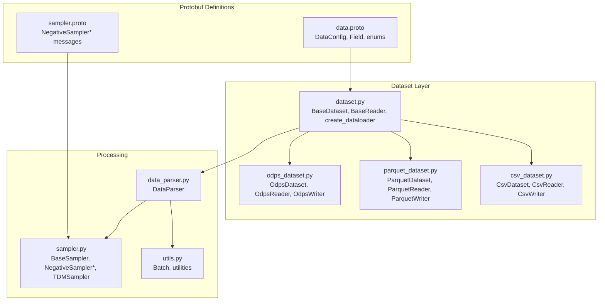
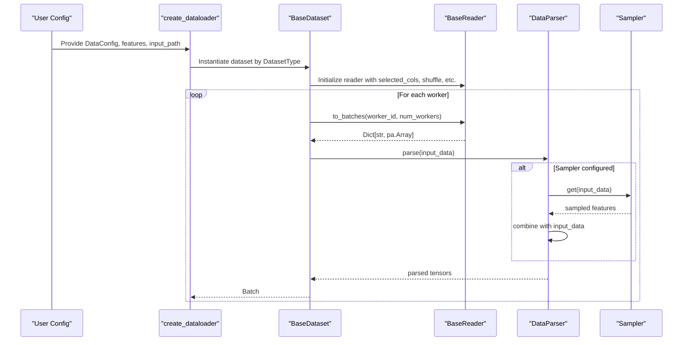
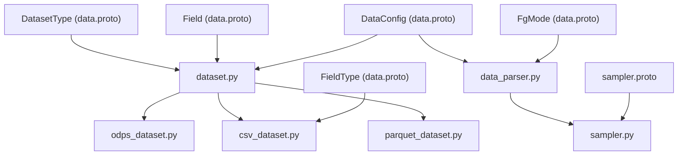

# Data Configuration Schema

<cite>
**Referenced Files in This Document**
- [data.proto](file://tzrec/protos/data.proto)
- [dataset.py](file://tzrec/datasets/dataset.py)
- [odps_dataset.py](file://tzrec/datasets/odps_dataset.py)
- [parquet_dataset.py](file://tzrec/datasets/parquet_dataset.py)
- [csv_dataset.py](file://tzrec/datasets/csv_dataset.py)
- [data_parser.py](file://tzrec/datasets/data_parser.py)
- [sampler.proto](file://tzrec/protos/sampler.proto)
- [sampler.py](file://tzrec/datasets/sampler.py)
- [utils.py](file://tzrec/datasets/utils.py)
- [deepfm_criteo.config](file://examples/deepfm_criteo.config)
- [mmoe_taobao.config](file://examples/mmoe_taobao.config)
- [dssm_taobao_bz2048.config](file://experiments/taobao/dssm_taobao_bz2048.config)
- [criteo_multi_tower.config](file://experiments/criteo/criteo_multi_tower.config)
</cite>

## Table of Contents

1. [Introduction](#introduction)
1. [Project Structure](#project-structure)
1. [Core Components](#core-components)
1. [Architecture Overview](#architecture-overview)
1. [Detailed Component Analysis](#detailed-component-analysis)
1. [Dependency Analysis](#dependency-analysis)
1. [Performance Considerations](#performance-considerations)
1. [Troubleshooting Guide](#troubleshooting-guide)
1. [Conclusion](#conclusion)
1. [Appendices](#appendices)

## Introduction

This document provides comprehensive documentation for TorchEasyRec's data configuration schema. It explains the DataConfig message structure, supported dataset types, field configuration, and advanced features such as negative sampling, shuffling, compression, and performance tuning. It also covers data pipeline configuration, worker management, and memory optimization settings, with practical configuration examples and troubleshooting guidance.

## Project Structure

The data configuration schema is defined in protocol buffers and implemented across dataset readers, parsers, and samplers. The key components include:

- Protocol buffer definitions for DataConfig and Field types
- Dataset implementations for OdpsDataset, ParquetDataset, and CsvDataset
- Data parsing and batching pipeline
- Negative sampling and advanced sampling strategies
- Utility functions for performance tuning and memory optimization

**Diagram sources**

- \[data.proto\](file://tzrec/protos/data.proto#L43-L137)
- \[sampler.proto\](file://tzrec/protos/sampler.proto#L1-L142)
- \[dataset.py\](file://tzrec/datasets/dataset.py#L149-L732)
- \[odps_dataset.py\](file://tzrec/datasets/odps_dataset.py#L302-L661)
- \[parquet_dataset.py\](file://tzrec/datasets/parquet_dataset.py#L98-L304)
- \[csv_dataset.py\](file://tzrec/datasets/csv_dataset.py#L31-L207)
- \[data_parser.py\](file://tzrec/datasets/data_parser.py#L56-L953)
- \[sampler.py\](file://tzrec/datasets/sampler.py#L219-L1055)
- \[utils.py\](file://tzrec/datasets/utils.py#L43-L517)

**Section sources**

- \[data.proto\](file://tzrec/protos/data.proto#L1-L138)
- \[dataset.py\](file://tzrec/datasets/dataset.py#L1-L733)

## Core Components

This section documents the DataConfig message and related enumerations and messages.

- DataConfig fields:

  - batch_size: Mini-batch size for training and evaluation
  - dataset_type: Enum indicating the dataset implementation to use
  - fg_encoded: Deprecated; use fg_mode instead
  - fg_encoded_multival_sep: Multi-value separator for pre-encoded features
  - label_fields: Names of label columns
  - num_workers: Number of worker processes for parallel data loading
  - pin_memory: Enable CUDA pinned memory for faster transfers
  - input_fields: Field definitions for CSV or explicit schema
  - delimiter: CSV delimiter
  - with_header: Whether CSV files include a header row
  - eval_batch_size: Separate batch size for evaluation
  - drop_remainder: Drop the last incomplete batch
  - fg_threads: Number of threads for feature generation
  - is_orderby_partition: Read Odps data ordered by partitions
  - odps_data_quota_name: Storage API quota name for Odps
  - sample_mask_prob: Probability to mask samples during training
  - negative_sample_mask_prob: Probability to mask negative samples
  - force_base_data_group: Force consistent batch grouping
  - sample_weight_fields: Names of sample weight columns
  - fg_mode: Feature generation mode (FG_NONE, FG_NORMAL, FG_DAG, FG_BUCKETIZE)
  - enable_hstu: Enable HSTU-specific processing
  - shuffle: Enable shuffling for CSV and Parquet
  - shuffle_buffer_size: Size of shuffle buffer
  - odps_data_compression: Compression type for Odps storage API
  - sample_cost_field: Column used to compute batch cost
  - batch_cost_size: Maximum batch cost per shard
  - sampler: Oneof for negative sampling configurations

- Enums:

  - DatasetType: OdpsDataset, ParquetDataset, CsvDataset, OdpsDatasetV1
  - FieldType: INT32, INT64, STRING, FLOAT, DOUBLE
  - FgMode: FG_NONE, FG_NORMAL, FG_DAG, FG_BUCKETIZE

- Field message:

  - input_name: Column name
  - input_type: FieldType for CSV when inference fails

**Section sources**

- \[data.proto\](file://tzrec/protos/data.proto#L6-L137)
- \[utils.py\](file://tzrec/datasets/utils.py#L34-L40)

## Architecture Overview

The data pipeline transforms raw data into batches suitable for model training or evaluation. The flow includes dataset selection, reading, batching, optional shuffling, feature generation, sampling, and tensor conversion.

**Diagram sources**

- \[dataset.py\](file://tzrec/datasets/dataset.py#L645-L732)
- \[dataset.py\](file://tzrec/datasets/dataset.py#L149-L428)
- \[data_parser.py\](file://tzrec/datasets/data_parser.py#L178-L260)
- \[sampler.py\](file://tzrec/datasets/sampler.py#L219-L395)

## Detailed Component Analysis

### DataConfig Message Structure

- Purpose: Central configuration for data loading, preprocessing, and batching
- Key behaviors:
  - Controls batch sizing, shuffling, and memory optimization
  - Selects dataset implementation via dataset_type
  - Enables feature generation modes via fg_mode
  - Integrates negative sampling and advanced sampling strategies
  - Supports cost-aware batching and compression for cloud storage

**Section sources**

- \[data.proto\](file://tzrec/protos/data.proto#L43-L137)

### Supported Dataset Types

- OdpsDataset
  - Reads from MaxCompute tables using Storage API
  - Supports compression, partition ordering, and quota configuration
  - Uses BaseReader with arrow iterators and session management
- ParquetDataset
  - Reads Parquet files with optional shuffling and cost-aware batching
  - Supports rebalancing rows across workers
- CsvDataset
  - Reads CSV files with optional header and delimiter
  - Requires explicit FieldType for ambiguous columns

Implementation highlights:

- Reader initialization selects appropriate dataset class based on input_path or extension
- Schema inference validates supported PyArrow types
- Batch iteration handles buffering, shuffling, and slicing

**Section sources**

- \[odps_dataset.py\](file://tzrec/datasets/odps_dataset.py#L302-L496)
- \[parquet_dataset.py\](file://tzrec/datasets/parquet_dataset.py#L98-L251)
- \[csv_dataset.py\](file://tzrec/datasets/csv_dataset.py#L31-L162)
- \[dataset.py\](file://tzrec/datasets/dataset.py#L581-L642)

### Field Configuration and FieldType Enumeration

- Field message:
  - input_name: Required column identifier
  - input_type: Optional FieldType override for CSV when inference is not possible
- FieldType supports integer, floating-point, and string types
- CsvReader enforces column_types mapping when provided

Best practices:

- Specify input_type for CSV when all values in a column are null
- Keep input_fields aligned with CSV order when with_header is false

**Section sources**

- \[data.proto\](file://tzrec/protos/data.proto#L36-L41)
- \[data.proto\](file://tzrec/protos/data.proto#L13-L19)
- \[csv_dataset.py\](file://tzrec/datasets/csv_dataset.py#L48-L60)
- \[utils.py\](file://tzrec/datasets/utils.py#L34-L40)

### Advanced Features

#### Negative Sampling

- Oneof sampler supports:
  - NegativeSampler: Weighted random sampling of items not in batch
  - NegativeSamplerV2: Conditional sampling based on user-item edges
  - HardNegativeSampler: Combines negative and hard negative edges
  - HardNegativeSamplerV2: Conditional sampling with hard edges
  - TDMSampler: Tree-based sampling for hierarchical retrieval
- Sampler configuration includes:
  - num_sample and num_eval_sample
  - attr_fields and item_id_field
  - attr_delimiter and item_id_delim
  - field_delimiter for input parsing

Integration:

- Samplers are launched as GraphLearn servers and clients
- Sampled features are concatenated with input features
- Masking probabilities can be applied to training samples

**Section sources**

- \[data.proto\](file://tzrec/protos/data.proto#L129-L136)
- \[sampler.proto\](file://tzrec/protos/sampler.proto#L1-L142)
- \[sampler.py\](file://tzrec/datasets/sampler.py#L219-L395)
- \[dataset.py\](file://tzrec/datasets/dataset.py#L317-L397)

#### Shuffling and Cost-Aware Batching

- Shuffle controls:
  - shuffle: Enable shuffling for CSV and Parquet
  - shuffle_buffer_size: Buffer size for random shuffling
- Cost-aware batching:
  - sample_cost_field: Column used to compute cumulative cost
  - batch_cost_size: Maximum batch cost per shard
  - Ensures batches respect resource limits

**Section sources**

- \[data.proto\](file://tzrec/protos/data.proto#L112-L127)
- \[dataset.py\](file://tzrec/datasets/dataset.py#L430-L550)
- \[parquet_dataset.py\](file://tzrec/datasets/parquet_dataset.py#L130-L170)
- \[csv_dataset.py\](file://tzrec/datasets/csv_dataset.py#L78-L110)

#### Compression Settings

- OdpsDataset supports LZ4_FRAME, ZSTD, UNCOMPRESSED
- Compression type is validated against available enum values

**Section sources**

- \[data.proto\](file://tzrec/protos/data.proto#L120-L121)
- \[odps_dataset.py\](file://tzrec/datasets/odps_dataset.py#L89-L96)

#### Performance Tuning Parameters

- batch_size and eval_batch_size
- num_workers and pin_memory
- fg_threads and fg_mode
- force_base_data_group
- enable_hstu

Recommendations:

- Increase num_workers up to number of files for file-based datasets
- Enable pin_memory for GPU training to reduce transfer overhead
- Adjust fg_threads for feature generation DAGs

**Section sources**

- \[data.proto\](file://tzrec/protos/data.proto#L45-L107)
- \[dataset.py\](file://tzrec/datasets/dataset.py#L645-L732)

### Data Pipeline Configuration and Worker Management

- create_dataloader constructs dataset instances based on DataConfig.dataset_type
- Worker management:
  - Validates number of files vs world size
  - Distributes work across workers and ranks
- Persistent workers enabled for improved throughput

**Section sources**

- \[dataset.py\](file://tzrec/datasets/dataset.py#L645-L732)

### Memory Optimization Settings

- pin_memory: Pinned memory for faster CPU-to-GPU transfers
- Batch.to() and Batch.pin_memory(): Device transfer and pinned memory copies
- Batch.to_dict(): Converts to tensor dictionary for downstream use

**Section sources**

- \[data.proto\](file://tzrec/protos/data.proto#L65-L66)
- \[utils.py\](file://tzrec/datasets/utils.py#L216-L267)

### Examples of Configuration Files

#### OdpsDataset with FG_NONE

- Typical for pre-encoded features
- Large batch sizes for throughput

**Section sources**

- \[deepfm_criteo.config\](file://examples/deepfm_criteo.config#L24-L30)

#### OdpsDataset with FG_DAG

- Enables feature generation DAG
- Multiple labels supported

**Section sources**

- \[mmoe_taobao.config\](file://examples/mmoe_taobao.config#L23-L30)

#### ParquetDataset with Negative Sampling

- Local Parquet files
- NegativeSampler configuration with item attributes

**Section sources**

- \[dssm_taobao_bz2048.config\](file://experiments/taobao/dssm_taobao_bz2048.config#L23-L41)

#### OdpsDataset with Feature Normalization

- Feature expressions and normalization
- Quota name customization

**Section sources**

- \[criteo_multi_tower.config\](file://experiments/criteo/criteo_multi_tower.config#L23-L30)

## Dependency Analysis

The following diagram shows key dependencies among data configuration components:

**Diagram sources**

- \[data.proto\](file://tzrec/protos/data.proto#L6-L137)
- \[data_parser.py\](file://tzrec/datasets/data_parser.py#L56-L953)
- \[dataset.py\](file://tzrec/datasets/dataset.py#L149-L732)
- \[odps_dataset.py\](file://tzrec/datasets/odps_dataset.py#L302-L661)
- \[parquet_dataset.py\](file://tzrec/datasets/parquet_dataset.py#L98-L304)
- \[csv_dataset.py\](file://tzrec/datasets/csv_dataset.py#L31-L207)
- \[sampler.py\](file://tzrec/datasets/sampler.py#L219-L1055)
- \[sampler.proto\](file://tzrec/protos/sampler.proto#L1-L142)

**Section sources**

- \[data.proto\](file://tzrec/protos/data.proto#L1-L138)
- \[dataset.py\](file://tzrec/datasets/dataset.py#L1-L733)

## Performance Considerations

- Batch sizing:
  - Larger batch_size improves throughput but increases memory usage
  - eval_batch_size can be smaller for evaluation
- Worker scaling:
  - num_workers should align with available files and hardware resources
  - persistent_workers improve throughput in multi-phase training
- Memory optimization:
  - pin_memory reduces CPU-to-GPU transfer latency
  - Batch.pin_memory() enables pinned memory for tensors
- Shuffling:
  - shuffle_buffer_size balances randomness and memory footprint
- Compression:
  - Choose appropriate compression for cloud storage to balance I/O and CPU costs
- Cost-aware batching:
  - sample_cost_field and batch_cost_size help distribute workload evenly

[No sources needed since this section provides general guidance]

## Troubleshooting Guide

Common issues and resolutions:

- Unsupported column types

  - Symptom: Error indicating unsupported dtype
  - Resolution: Ensure schema uses supported PyArrow types; validate with reader schema
  - Reference: \[odps_dataset.py\](file://tzrec/datasets/odps_dataset.py#L400-L404), \[parquet_dataset.py\](file://tzrec/datasets/parquet_dataset.py#L182-L194), \[csv_dataset.py\](file://tzrec/datasets/csv_dataset.py#L131-L143)

- No CSV files found

  - Symptom: RuntimeError about missing CSV files
  - Resolution: Verify input_path glob patterns and file existence
  - Reference: \[csv_dataset.py\](file://tzrec/datasets/csv_dataset.py#L129-L130)

- Insufficient number of files for workers

  - Symptom: ValueError about number of files vs world size
  - Resolution: Reduce num_workers or increase dataset files
  - Reference: \[dataset.py\](file://tzrec/datasets/dataset.py#L686-L701)

- Unknown compression type for Odps

  - Symptom: ValueError for unknown compression
  - Resolution: Use supported enum values (e.g., LZ4_FRAME, ZSTD)
  - Reference: \[odps_dataset.py\](file://tzrec/datasets/odps_dataset.py#L89-L96)

- Negative sampling hangs or timeouts

  - Symptom: Hangs or timeouts during sampler initialization
  - Resolution: Ensure proper cluster setup and adjust sleep delays; verify graphlearn server startup
  - Reference: \[sampler.py\](file://tzrec/datasets/sampler.py#L523-L529)

- Incompatible CSV types

  - Symptom: Type casting errors for CSV columns
  - Resolution: Explicitly set FieldType for problematic columns
  - Reference: \[csv_dataset.py\](file://tzrec/datasets/csv_dataset.py#L52-L60)

**Section sources**

- \[odps_dataset.py\](file://tzrec/datasets/odps_dataset.py#L89-L96)
- \[csv_dataset.py\](file://tzrec/datasets/csv_dataset.py#L52-L60)
- \[dataset.py\](file://tzrec/datasets/dataset.py#L686-L701)
- \[sampler.py\](file://tzrec/datasets/sampler.py#L523-L529)

## Conclusion

TorchEasyRec’s data configuration schema provides a flexible and powerful framework for loading, transforming, and batching data across diverse sources. By leveraging DataConfig, dataset implementations, and advanced sampling strategies, users can optimize throughput, memory usage, and training quality. Proper configuration of workers, compression, and cost-aware batching ensures efficient operation in distributed environments.

[No sources needed since this section summarizes without analyzing specific files]

## Appendices

### Configuration Reference Summary

- DataConfig

  - batch_size, eval_batch_size, num_workers, pin_memory
  - dataset_type, fg_mode, fg_threads, fg_encoded_multival_sep
  - label_fields, sample_weight_fields, sample_cost_field, batch_cost_size
  - input_fields, delimiter, with_header, shuffle, shuffle_buffer_size
  - is_orderby_partition, odps_data_quota_name, odps_data_compression
  - sample_mask_prob, negative_sample_mask_prob, force_base_data_group, enable_hstu
  - sampler (oneof): NegativeSampler, NegativeSamplerV2, HardNegativeSampler, HardNegativeSamplerV2, TDMSampler

- Field

  - input_name, input_type (optional)

- Enums

  - DatasetType: OdpsDataset, ParquetDataset, CsvDataset, OdpsDatasetV1
  - FieldType: INT32, INT64, STRING, FLOAT, DOUBLE
  - FgMode: FG_NONE, FG_NORMAL, FG_DAG, FG_BUCKETIZE

**Section sources**

- \[data.proto\](file://tzrec/protos/data.proto#L6-L137)
- \[sampler.proto\](file://tzrec/protos/sampler.proto#L1-L142)
