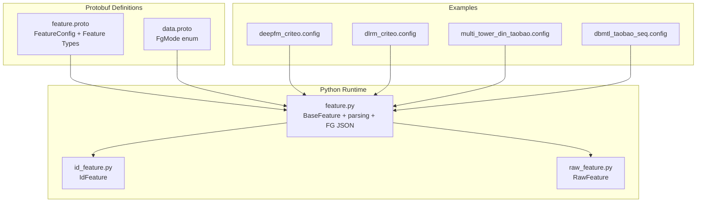
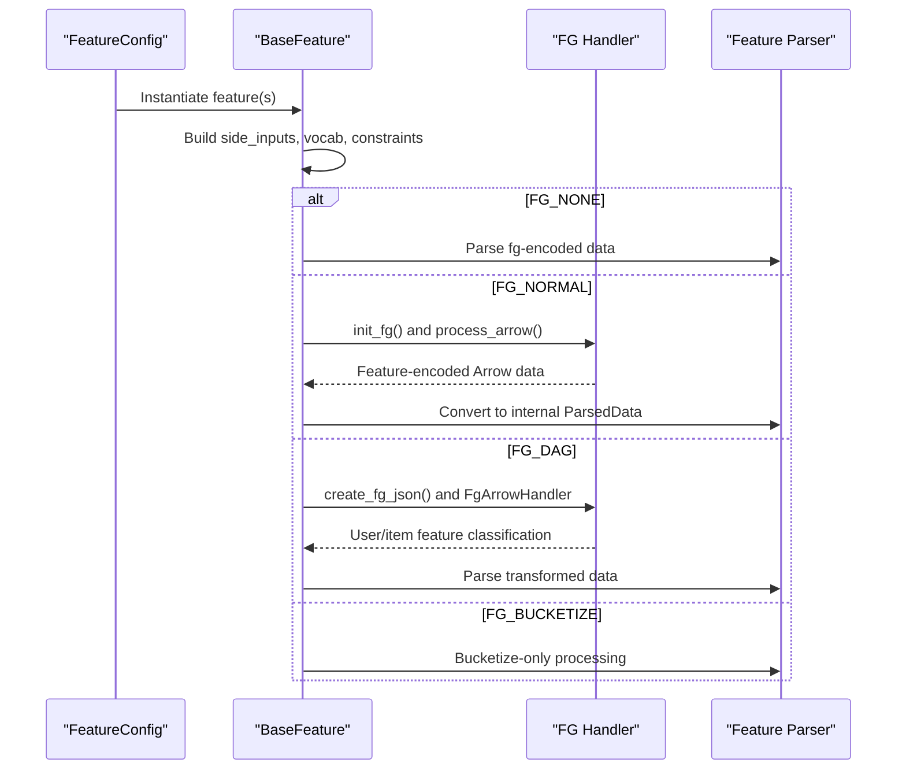
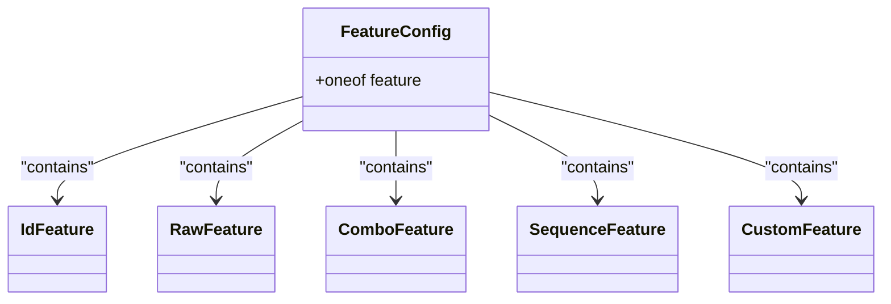
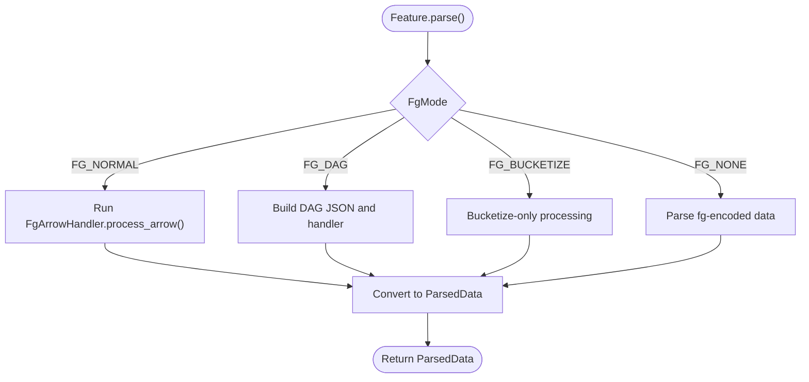
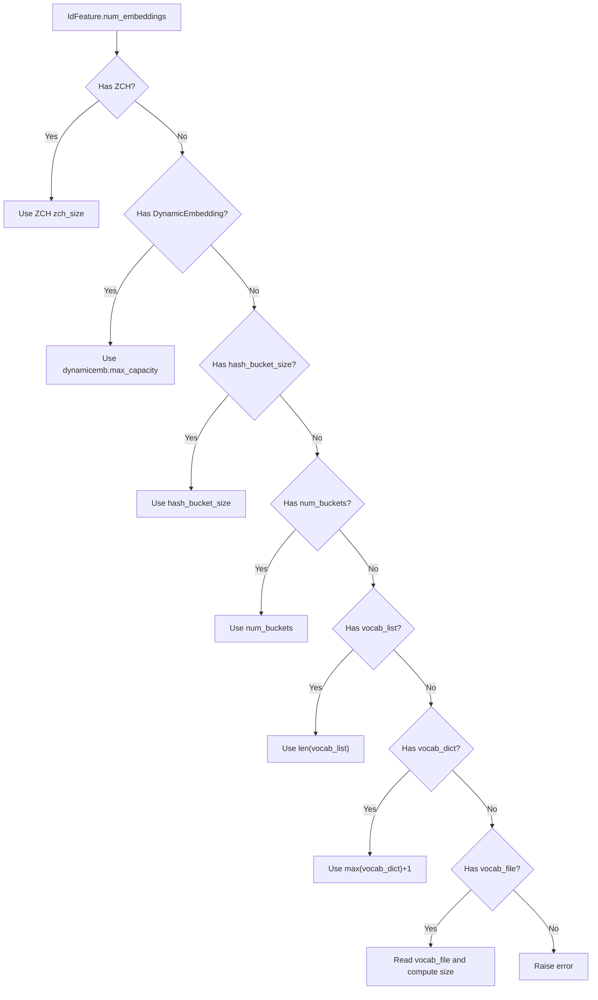
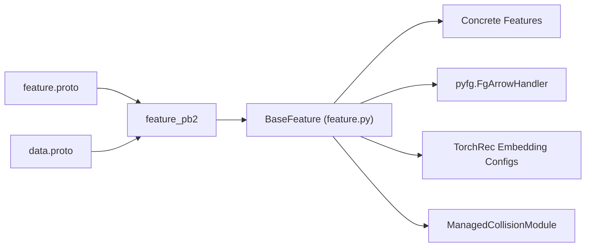

# Feature Configuration Schema

<cite>
**Referenced Files in This Document**
- [feature.proto](file://tzrec/protos/feature.proto)
- [data.proto](file://tzrec/protos/data.proto)
- [feature.py](file://tzrec/features/feature.py)
- [id_feature.py](file://tzrec/features/id_feature.py)
- [raw_feature.py](file://tzrec/features/raw_feature.py)
- [deepfm_criteo.config](file://examples/deepfm_criteo.config)
- [dlrm_criteo.config](file://examples/dlrm_criteo.config)
- [multi_tower_din_taobao.config](file://examples/multi_tower_din_taobao.config)
- [dbmtl_taobao_seq.config](file://examples/dbmtl_taobao_seq.config)
</cite>

## Table of Contents

1. [Introduction](#introduction)
1. [Project Structure](#project-structure)
1. [Core Components](#core-components)
1. [Architecture Overview](#architecture-overview)
1. [Detailed Component Analysis](#detailed-component-analysis)
1. [Dependency Analysis](#dependency-analysis)
1. [Performance Considerations](#performance-considerations)
1. [Troubleshooting Guide](#troubleshooting-guide)
1. [Conclusion](#conclusion)
1. [Appendices](#appendices)

## Introduction

This document describes TorchEasyRec’s feature configuration schema, focusing on the FeatureConfig message and its constituent feature types. It explains how to configure IdFeature, RawFeature, ComboFeature, SequenceFeature, and custom feature configurations; how feature grouping and embedding configurations work; and how feature transformation parameters operate. It also documents the feature processing pipeline, the four feature generation modes (FG_NONE, FG_NORMAL, FG_DAG, FG_BUCKETIZE), and provides guidance on validation, dimension calculation, memory optimization, best practices, and troubleshooting.

## Project Structure

The feature configuration schema is defined in protocol buffers and consumed by Python feature implementations. The key elements are:

- Protobuf schema defining FeatureConfig and feature messages
- Python feature base class and concrete feature implementations
- Example configuration files demonstrating usage patterns

**Diagram sources**

- \[feature.proto\](file://tzrec/protos/feature.proto#L912-L957)
- \[data.proto\](file://tzrec/protos/data.proto#L21-L34)
- \[feature.py\](file://tzrec/features/feature.py#L375-L1268)
- \[id_feature.py\](file://tzrec/features/id_feature.py#L22-L141)
- \[raw_feature.py\](file://tzrec/features/raw_feature.py#L20-L100)
- \[deepfm_criteo.config\](file://examples/deepfm_criteo.config#L31-L397)
- \[dlrm_criteo.config\](file://examples/dlrm_criteo.config#L24-L398)
- \[multi_tower_din_taobao.config\](file://examples/multi_tower_din_taobao.config#L159-L188)
- \[dbmtl_taobao_seq.config\](file://examples/dbmtl_taobao_seq.config#L144-L170)

**Section sources**

- \[feature.proto\](file://tzrec/protos/feature.proto#L1-L957)
- \[data.proto\](file://tzrec/protos/data.proto#L1-L138)
- \[feature.py\](file://tzrec/features/feature.py#L375-L1268)
- \[id_feature.py\](file://tzrec/features/id_feature.py#L22-L141)
- \[raw_feature.py\](file://tzrec/features/raw_feature.py#L20-L100)

## Core Components

- FeatureConfig: A oneof container that selects a specific feature type (IdFeature, RawFeature, ComboFeature, LookupFeature, MatchFeature, SequenceFeature, ExprFeature, OverlapFeature, TokenizeFeature, CustomFeature, KvDotProduct, BoolMaskFeature, and their sequence variants).
- Feature type messages define feature metadata, transformations, bucketization/vocabulary, embeddings, pooling, and optional sequence configuration.
- BaseFeature: The Python base class implementing parsing, FG JSON generation, vocab handling, and embedding configuration building.
- Concrete feature classes (IdFeature, RawFeature) implement value_dim, output_dim, num_embeddings, and FG JSON generation specifics.

Key schema highlights:

- FeatureConfig.oneof covers all feature types, including sequence variants for each type.
- SequenceFeature groups multiple sub-feature configs with sequence metadata (length, delimiter, primary key).
- Feature types support:
  - Vocabulary-based bucketization via vocab_list, vocab_dict, vocab_file, default_bucketize_value
  - Hash-based bucketization via hash_bucket_size, num_buckets
  - Boundaries-based bucketization for numeric features (RawFeature)
  - Optional managed collision hashing (ZeroCollisionHash)
  - Optional dynamic embedding (DynamicEmbedding)
  - Optional dense embedding alternatives (AutoDisEmbedding, MLPEmbedding)
  - Pooling selection (sum | mean)
  - Data type selection (FP32 | FP16)
  - Trainability flag and parameter constraints

**Section sources**

- \[feature.proto\](file://tzrec/protos/feature.proto#L912-L957)
- \[feature.py\](file://tzrec/features/feature.py#L375-L822)
- \[id_feature.py\](file://tzrec/features/id_feature.py#L22-L141)
- \[raw_feature.py\](file://tzrec/features/raw_feature.py#L20-L100)

## Architecture Overview

The feature configuration schema drives a two-stage processing pipeline:

- Feature generation (FG) pipeline: transforms raw inputs into feature-encoded tensors according to FgMode.
- Embedding and aggregation: converts feature-encoded tensors into embeddings and aggregates them based on pooling and model needs.

**Diagram sources**

- \[feature.py\](file://tzrec/features/feature.py#L833-L898)
- \[feature.py\](file://tzrec/features/feature.py#L900-L938)
- \[feature.py\](file://tzrec/features/feature.py#L1208-L1241)
- \[data.proto\](file://tzrec/protos/data.proto#L21-L34)

## Detailed Component Analysis

### FeatureConfig and Feature Types

FeatureConfig is a oneof container selecting a specific feature type. Each feature type defines:

- Feature identity and expression mapping
- Bucketization/vocabulary configuration
- Optional managed collision hashing and dynamic embedding
- Optional dense embedding alternatives
- Pooling and data type settings
- Sequence-specific fields for grouped sequences

**Diagram sources**

- \[feature.proto\](file://tzrec/protos/feature.proto#L912-L957)

**Section sources**

- \[feature.proto\](file://tzrec/protos/feature.proto#L112-L180)
- \[feature.proto\](file://tzrec/protos/feature.proto#L182-L239)
- \[feature.proto\](file://tzrec/protos/feature.proto#L241-L301)
- \[feature.proto\](file://tzrec/protos/feature.proto#L898-L957)

### BaseFeature: Parsing and FG Pipeline

BaseFeature orchestrates:

- Side-input resolution and grouped sequence prefixing
- FG initialization and JSON generation
- FG_NONE parsing of pre-encoded data
- FG_NORMAL parsing via pyfg.FgArrowHandler
- FG_DAG parsing with DAG-driven feature graph
- FG_BUCKETIZE bucketization-only mode
- Vocab list/dict/file handling and default bucketize value
- Embedding bag/config construction and parameter constraints

**Diagram sources**

- \[feature.py\](file://tzrec/features/feature.py#L833-L898)
- \[feature.py\](file://tzrec/features/feature.py#L900-L938)
- \[feature.py\](file://tzrec/features/feature.py#L1208-L1241)

**Section sources**

- \[feature.py\](file://tzrec/features/feature.py#L375-L822)
- \[feature.py\](file://tzrec/features/feature.py#L833-L898)
- \[feature.py\](file://tzrec/features/feature.py#L900-L938)
- \[feature.py\](file://tzrec/features/feature.py#L1208-L1241)

### IdFeature

- Determines value_dim (single vs multi-value) and output embedding dimension.
- Computes num_embeddings from:
  - Zero-Collision Hash (ZCH) size
  - Dynamic embedding capacity
  - Hash bucket size
  - Number of buckets
  - Vocabulary list/dict/file size
- Generates FG JSON with appropriate bucketizer and weighted support.

**Diagram sources**

- \[id_feature.py\](file://tzrec/features/id_feature.py#L65-L87)

**Section sources**

- \[id_feature.py\](file://tzrec/features/id_feature.py#L22-L141)

### RawFeature

- Supports multi-dimensional raw features via value_dim.
- Uses boundaries for bucketization; otherwise dense output equals value_dim.
- Supports dense embedding alternatives (AutoDis/MLP) for non-sequence features.

**Section sources**

- \[raw_feature.py\](file://tzrec/features/raw_feature.py#L20-L100)

### SequenceFeature and Grouped Sequences

- SequenceFeature encapsulates a sequence name, length, delimiter, and primary key for serving.
- Sub-features can be sparse or dense; BaseFeature handles grouped sequence prefixing and sequence-specific defaults.

**Section sources**

- \[feature.proto\](file://tzrec/protos/feature.proto#L898-L910)
- \[feature.py\](file://tzrec/features/feature.py#L425-L438)
- \[feature.py\](file://tzrec/features/feature.py#L707-L721)

### CustomFeature

- Allows pluggable operators with custom parameters and optional vocab/dynamic embedding.
- Supports sparse and dense modes with bucketization and normalization.

**Section sources**

- \[feature.proto\](file://tzrec/protos/feature.proto#L744-L828)

## Dependency Analysis

- FeatureConfig depends on feature.proto definitions for feature types.
- BaseFeature depends on:
  - Protobuf feature_pb2 for configuration
  - pyfg.FgArrowHandler for FG processing
  - TorchRec embedding configs for embedding bags/configs
  - ManagedCollisionModule for ZCH
- Concrete features depend on BaseFeature and protobuf feature messages.

**Diagram sources**

- \[feature.proto\](file://tzrec/protos/feature.proto#L1-L957)
- \[data.proto\](file://tzrec/protos/data.proto#L1-L138)
- \[feature.py\](file://tzrec/features/feature.py#L20-L65)

**Section sources**

- \[feature.py\](file://tzrec/features/feature.py#L20-L65)

## Performance Considerations

- Embedding dimension and num_embeddings directly impact memory footprint; choose embedding_dim and vocabulary/hash sizes carefully.
- Use boundary-based bucketization for RawFeature to reduce embedding cardinality.
- Prefer managed collision hashing (ZCH) or dynamic embedding for large vocabularies to cap memory usage.
- Sequence features require additional memory for jagged tensors; tune sequence_length and delimiter appropriately.
- FP16 embeddings can halve memory usage compared to FP32 when supported by hardware and training stability allows.

[No sources needed since this section provides general guidance]

## Troubleshooting Guide

Common issues and resolutions:

- Missing bucketizer configuration in IdFeature: Ensure one of hash_bucket_size, num_buckets, vocab_list, vocab_dict, vocab_file, or ZCH is set.
- Empty default value for sequence features: The system resets default_value to zero for sequence features when not provided.
- Mask requirement without fg_encoded_default_value: When use_mask is enabled, fg_encoded_default_value must be set for FG_NONE mode.
- Invalid side inputs: side_inputs must be in the form "side:name" and recognized by the FG handler; otherwise an error is raised.
- Dense embedding on sequence: Sequence features do not support dense embedding alternatives.

**Section sources**

- \[id_feature.py\](file://tzrec/features/id_feature.py#L83-L87)
- \[feature.py\](file://tzrec/features/feature.py#L928-L937)
- \[feature.py\](file://tzrec/features/feature.py#L454-L457)
- \[feature.py\](file://tzrec/features/feature.py#L728-L741)
- \[raw_feature.py\](file://tzrec/features/raw_feature.py#L63-L69)

## Conclusion

TorchEasyRec’s feature configuration schema provides a flexible, extensible framework for defining features, bucketization, embeddings, and transformations. By leveraging the four FG modes and grouped sequences, practitioners can optimize data ingestion, memory usage, and model performance. Following the validation rules, dimension calculation guidelines, and best practices outlined here ensures robust and efficient feature pipelines.

[No sources needed since this section summarizes without analyzing specific files]

## Appendices

### Feature Generation Modes (FG_MODE)

- FG_NONE: Pre-encoded feature data is parsed directly; requires fg_encoded_default_value when masking is used.
- FG_NORMAL: Python-based feature generation on raw inputs.
- FG_DAG: DAG-driven feature generation via FgArrowHandler; enables user/item feature classification and grouped sequences.
- FG_BUCKETIZE: Bucketization-only processing for pre-transformed but unbucketized features.

**Section sources**

- \[data.proto\](file://tzrec/protos/data.proto#L21-L34)
- \[feature.py\](file://tzrec/features/feature.py#L833-L898)
- \[feature.py\](file://tzrec/features/feature.py#L900-L938)

### Example Configurations and Patterns

- DeepFM on Criteo: Sparse categorical features with num_buckets and dense continuous features; FG_NONE mode.
- DLRM on Criteo: Continuous features normalized via expressions and categorical features with expressions; FG_DAG mode.
- Multi-tower DIN on Taobao: Sparse categorical features plus a grouped sequence of item features; FG_DAG mode.
- DBMTL with sequences on Taobao: Sparse features plus a grouped sequence; FG_NONE mode.

**Section sources**

- \[deepfm_criteo.config\](file://examples/deepfm_criteo.config#L24-L397)
- \[dlrm_criteo.config\](file://examples/dlrm_criteo.config#L24-L398)
- \[multi_tower_din_taobao.config\](file://examples/multi_tower_din_taobao.config#L159-L188)
- \[dbmtl_taobao_seq.config\](file://examples/dbmtl_taobao_seq.config#L144-L170)
