# Model Configuration Schema

<cite>
**Referenced Files in This Document**
- [model.proto](file://tzrec/protos/model.proto)
- [tower.proto](file://tzrec/protos/tower.proto)
- [module.proto](file://tzrec/protos/module.proto)
- [rank_model.proto](file://tzrec/protos/models/rank_model.proto)
- [multi_task_rank.proto](file://tzrec/protos/models/multi_task_rank.proto)
- [match_model.proto](file://tzrec/protos/models/match_model.proto)
- [general_rank_model.proto](file://tzrec/protos/models/general_rank_model.proto)
- [config_util.py](file://tzrec/utils/config_util.py)
- [dssm_taobao.config](file://examples/dssm_taobao.config)
- [deepfm_criteo.config](file://examples/deepfm_criteo.config)
- [multi_tower_taobao.config](file://examples/multi_tower_taobao.config)
- [dbmtl_taobao.config](file://examples/dbmtl_taobao.config)
</cite>

## Table of Contents

1. [Introduction](#introduction)
1. [Project Structure](#project-structure)
1. [Core Components](#core-components)
1. [Architecture Overview](#architecture-overview)
1. [Detailed Component Analysis](#detailed-component-analysis)
1. [Dependency Analysis](#dependency-analysis)
1. [Performance Considerations](#performance-considerations)
1. [Troubleshooting Guide](#troubleshooting-guide)
1. [Conclusion](#conclusion)
1. [Appendices](#appendices)

## Introduction

This document describes TorchEasyRec’s model configuration schema. It explains how to define models via the ModelConfig message, including model type selection, feature groups, towers, and task-specific parameters. It also documents the base model architecture configuration, module definitions, layer specifications, and the configuration framework used to parse and edit configurations. Practical examples illustrate DSSM, DeepFM, MultiTower, and DBMTL configurations. Guidance is provided for validation, initialization, and checkpoint loading, along with best practices and troubleshooting tips.

## Project Structure

TorchEasyRec organizes model configuration definitions in Protocol Buffers (.proto) files under tzrec/protos and model-specific subdirectories. Example configurations live under examples/. The configuration loader resides in tzrec/utils/config_util.py.

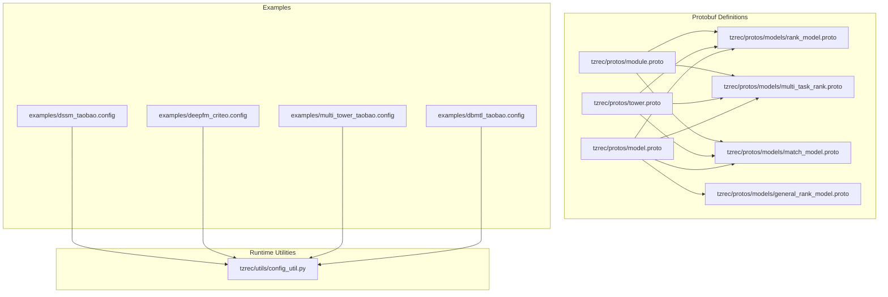

**Diagram sources**

- \[model.proto\](file://tzrec/protos/model.proto#L1-L90)
- \[tower.proto\](file://tzrec/protos/tower.proto#L1-L198)
- \[module.proto\](file://tzrec/protos/module.proto#L1-L287)
- \[rank_model.proto\](file://tzrec/protos/models/rank_model.proto#L1-L80)
- \[multi_task_rank.proto\](file://tzrec/protos/models/multi_task_rank.proto#L1-L75)
- \[match_model.proto\](file://tzrec/protos/models/match_model.proto#L1-L81)
- \[general_rank_model.proto\](file://tzrec/protos/models/general_rank_model.proto#L1-L16)
- \[dssm_taobao.config\](file://examples/dssm_taobao.config#L1-L267)
- \[deepfm_criteo.config\](file://examples/deepfm_criteo.config#L1-L397)
- \[multi_tower_taobao.config\](file://examples/multi_tower_taobao.config#L1-L207)
- \[dbmtl_taobao.config\](file://examples/dbmtl_taobao.config#L1-L224)
- \[config_util.py\](file://tzrec/utils/config_util.py#L1-L299)

**Section sources**

- \[model.proto\](file://tzrec/protos/model.proto#L1-L90)
- \[config_util.py\](file://tzrec/utils/config_util.py#L1-L299)

## Core Components

This section outlines the primary configuration constructs used to define models and tasks.

- ModelConfig

  - Defines feature_groups, oneof model selection, number of classes, losses, metrics, training metrics, variational dropout, kernel selection, and Pareto loss weighting flag.
  - Model selection supports many architectures (DLRM, DeepFM, MultiTower, MultiTowerDIN, MaskNet, WideAndDeep, DCN variants, xDeepFM, WuKong, SimpleMultiTask, MMoE, DBMTL, PLE, DC2VR, DlrmHSTU, DSSM/DSSMV2/HSTUMatch/MIND/TDM/RocketLaunching).

- FeatureGroupConfig and FeatureGroupType

  - Groups features by semantic roles: DEEP, WIDE, SEQUENCE, JAGGED_SEQUENCE.
  - Supports nested sequence_groups and sequence_encoders.

- Tower and TaskTower

  - Tower: input feature group and an MLP for single-tower models.
  - TaskTower: per-task configuration with label_name, metrics, losses, optional MLP, class count, weights, and task-space indicators.

- Module definitions (MLP, Cross/CrossV2, CIN, MaskNetModule, B2ICapsule, STU/HSTU, etc.)

  - MLP: hidden_units, dropout_ratio per layer, activation, batch/layer norm toggles, bias, and LN.
  - Cross/CrossV2: cross network depth.
  - CIN: Compose-Input-Noise network sizes.
  - MaskNetModule: number of blocks, block specs, top MLP, and parallel vs serial mode.
  - B2ICapsule: capsule routing parameters.
  - STU/HSTU: attention and normalization options for sequence modeling.

- Match and Multi-Task models

  - DSSM/DSSMV2/HSTUMatch/MIND/TDM: similarity, temperature, in-batch negatives, and output dimensions.
  - DBMTL/MMoE/PLE/DC2VR: shared bottlenecks, expert/gate modules, task towers, and relations.

**Section sources**

- \[model.proto\](file://tzrec/protos/model.proto#L13-L89)
- \[tower.proto\](file://tzrec/protos/tower.proto#L8-L198)
- \[module.proto\](file://tzrec/protos/module.proto#L4-L287)
- \[rank_model.proto\](file://tzrec/protos/models/rank_model.proto#L8-L80)
- \[multi_task_rank.proto\](file://tzrec/protos/models/multi_task_rank.proto#L7-L75)
- \[match_model.proto\](file://tzrec/protos/models/match_model.proto#L9-L81)
- \[general_rank_model.proto\](file://tzrec/protos/models/general_rank_model.proto#L8-L16)

## Architecture Overview

The configuration schema composes feature groups, model-specific blocks, and task towers into a unified ModelConfig. The runtime loads configurations from text or JSON, validates fields, and constructs model graphs accordingly.

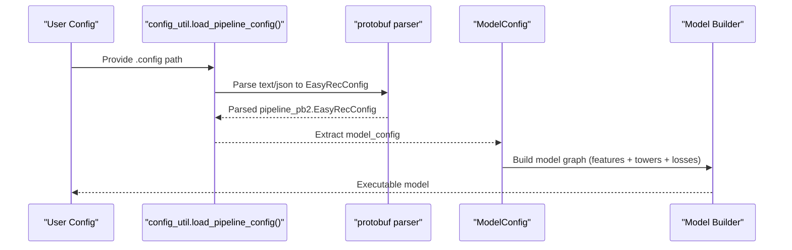

**Diagram sources**

- \[config_util.py\](file://tzrec/utils/config_util.py#L25-L48)
- \[model.proto\](file://tzrec/protos/model.proto#L40-L89)

## Detailed Component Analysis

### ModelConfig and Oneof Model Selection

ModelConfig aggregates feature groups and selects one of many supported models via a oneof. Each model variant defines its own parameters (e.g., MLP stacks, cross layers, towers, task towers).

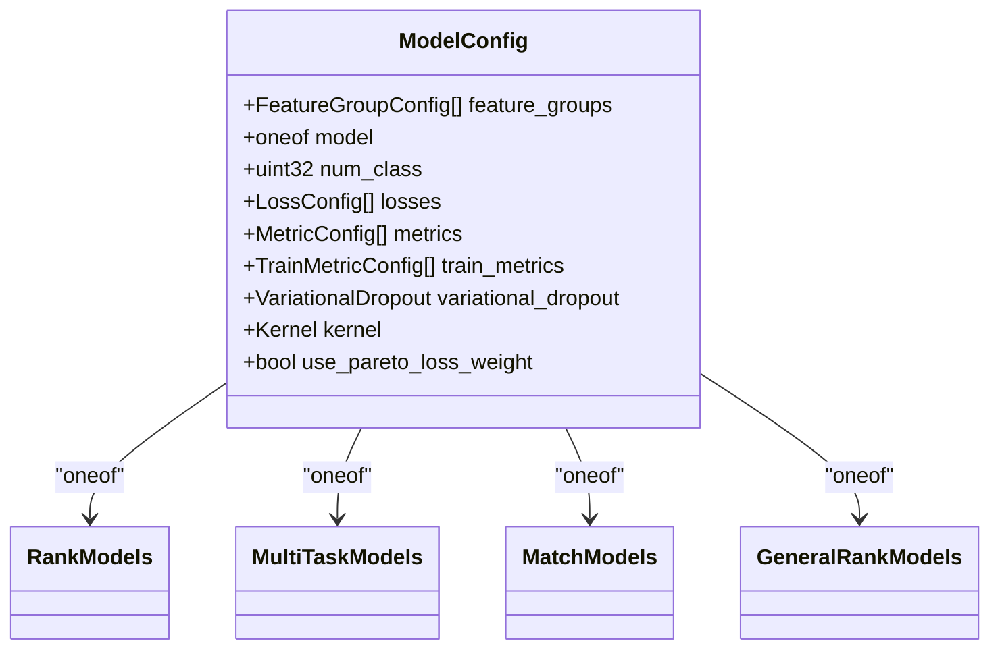

**Diagram sources**

- \[model.proto\](file://tzrec/protos/model.proto#L40-L89)
- \[rank_model.proto\](file://tzrec/protos/models/rank_model.proto#L1-L80)
- \[multi_task_rank.proto\](file://tzrec/protos/models/multi_task_rank.proto#L1-L75)
- \[match_model.proto\](file://tzrec/protos/models/match_model.proto#L1-L81)
- \[general_rank_model.proto\](file://tzrec/protos/models/general_rank_model.proto#L1-L16)

**Section sources**

- \[model.proto\](file://tzrec/protos/model.proto#L40-L89)

### Feature Groups and Sequence Encoders

FeatureGroupConfig binds feature names to semantic groups and optionally applies sequence encoders. FeatureGroupType distinguishes DEEP/WIDE/SEQUENCE/JAGGED_SEQUENCE.

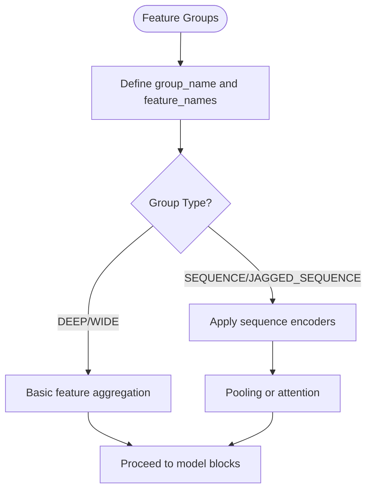

**Diagram sources**

- \[model.proto\](file://tzrec/protos/model.proto#L26-L32)

**Section sources**

- \[model.proto\](file://tzrec/protos/model.proto#L13-L32)

### Tower and Task Tower Specifications

Towers feed feature groups into MLPs; TaskTower adds per-task supervision and optional MLPs.

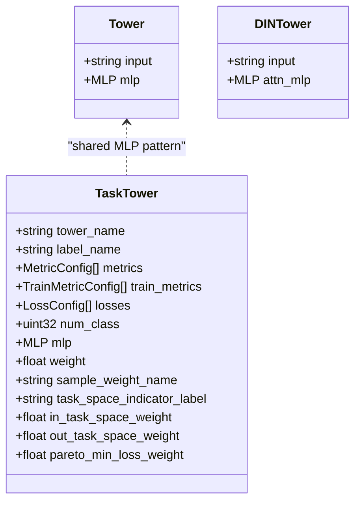

**Diagram sources**

- \[tower.proto\](file://tzrec/protos/tower.proto#L8-L56)

**Section sources**

- \[tower.proto\](file://tzrec/protos/tower.proto#L8-L56)

### Base Model Architectures and Modules

Common building blocks are defined in module.proto and consumed by model-specific messages.

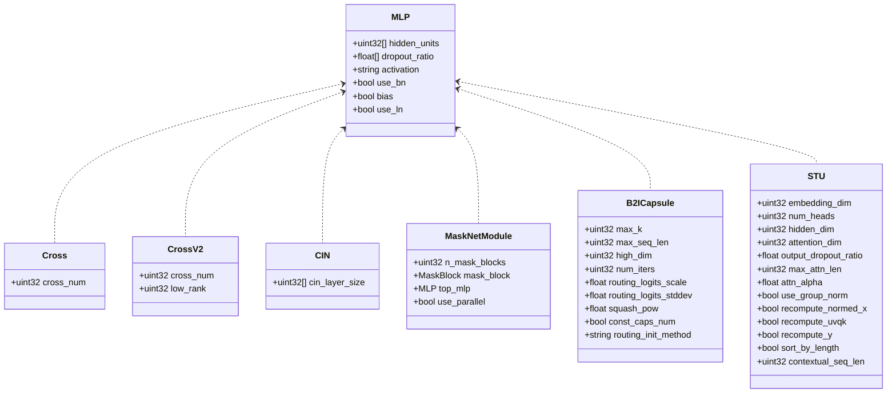

**Diagram sources**

- \[module.proto\](file://tzrec/protos/module.proto#L4-L287)

**Section sources**

- \[module.proto\](file://tzrec/protos/module.proto#L4-L287)

### Rank Models (Wide & Deep, DeepFM, DLRM, DCN, xDeepFM, WuKong)

These models define how features are transformed and combined.

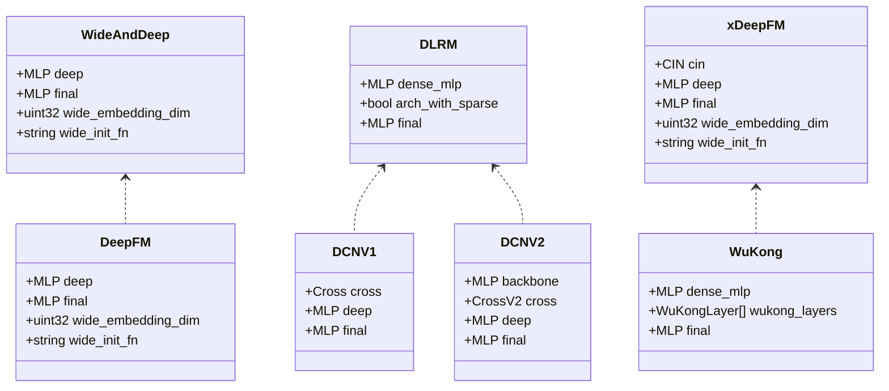

**Diagram sources**

- \[rank_model.proto\](file://tzrec/protos/models/rank_model.proto#L8-L80)

**Section sources**

- \[rank_model.proto\](file://tzrec/protos/models/rank_model.proto#L8-L80)

### Multi-Task Models (SimpleMultiTask, MMoE, DBMTL, PLE, DC2VR, DlrmHSTU)

These models introduce task towers and expert/gate mechanisms.

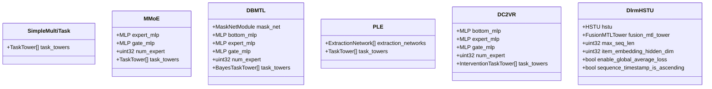

**Diagram sources**

- \[multi_task_rank.proto\](file://tzrec/protos/models/multi_task_rank.proto#L7-L75)

**Section sources**

- \[multi_task_rank.proto\](file://tzrec/protos/models/multi_task_rank.proto#L7-L75)

### Matching and Ranking Models (DSSM, DSSMV2, HSTUMatch, MIND, TDM)

These models define user/item towers, similarity, and optional in-batch negatives.

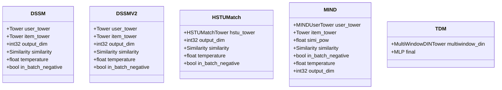

**Diagram sources**

- \[match_model.proto\](file://tzrec/protos/models/match_model.proto#L9-L81)

**Section sources**

- \[match_model.proto\](file://tzrec/protos/models/match_model.proto#L9-L81)

### General-Ranking Model (RocketLaunching)

A specialized model combining shared and boosting components.

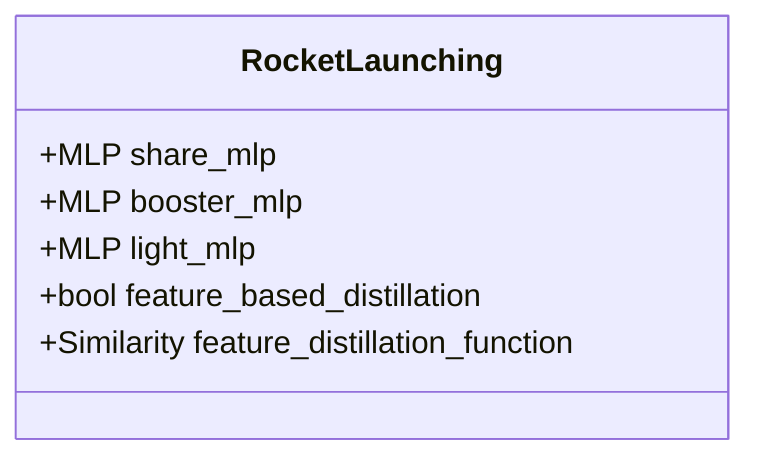

**Diagram sources**

- \[general_rank_model.proto\](file://tzrec/protos/models/general_rank_model.proto#L8-L16)

**Section sources**

- \[general_rank_model.proto\](file://tzrec/protos/models/general_rank_model.proto#L8-L16)

### Example Configurations

#### DSSM Example

- Feature groups: user and item feature sets plus a sequence group with a pooling encoder.
- Model: DSSM with user and item towers and an output dimension.
- Metrics and losses: recall@K and softmax cross entropy.

**Section sources**

- \[dssm_taobao.config\](file://examples/dssm_taobao.config#L201-L266)

#### DeepFM Example

- Feature groups: separate WIDE and DEEP groups, plus a DEEP numeric group.
- Model: DeepFM with deep and final MLPs.
- Metrics and losses: AUC and binary cross entropy.

**Section sources**

- \[deepfm_criteo.config\](file://examples/deepfm_criteo.config#L278-L396)

#### MultiTower Example

- Feature groups: user and item groups.
- Model: MultiTower with two towers and a final MLP.
- Metrics and losses: AUC and binary cross entropy.

**Section sources**

- \[multi_tower_taobao.config\](file://examples/multi_tower_taobao.config#L158-L206)

#### DBMTL Example

- Single feature group aggregating all features.
- Model: DBMTL with a shared bottom MLP, optional expert/gate modules, and two task towers (CTR and CVR) with relations.

**Section sources**

- \[dbmtl_taobao.config\](file://examples/dbmtl_taobao.config#L159-L223)

## Dependency Analysis

ModelConfig depends on model-specific protobuf definitions. Feature groups depend on module definitions for MLPs and sequence encoders. Task towers depend on loss and metric configurations.

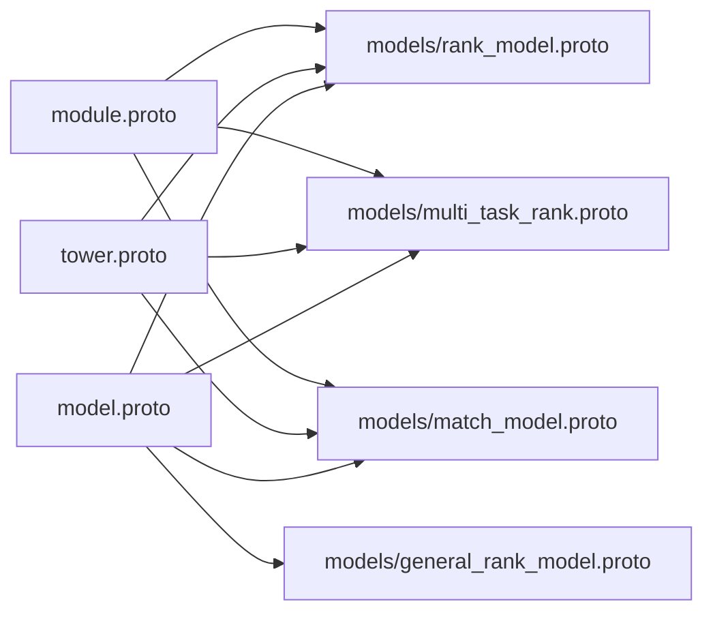

**Diagram sources**

- \[model.proto\](file://tzrec/protos/model.proto#L1-L12)
- \[rank_model.proto\](file://tzrec/protos/models/rank_model.proto#L1-L80)
- \[multi_task_rank.proto\](file://tzrec/protos/models/multi_task_rank.proto#L1-L75)
- \[match_model.proto\](file://tzrec/protos/models/match_model.proto#L1-L81)
- \[general_rank_model.proto\](file://tzrec/protos/models/general_rank_model.proto#L1-L16)
- \[tower.proto\](file://tzrec/protos/tower.proto#L1-L198)
- \[module.proto\](file://tzrec/protos/module.proto#L1-L287)

**Section sources**

- \[model.proto\](file://tzrec/protos/model.proto#L1-L12)

## Performance Considerations

- Kernel selection: choose PyTorch or CUDA kernels depending on hardware availability.
- Variational dropout: regularizes embeddings to reduce overfitting.
- Batch size and workers: tune data_config.batch_size and num_workers for throughput.
- Sequence encoders: pooling vs attention impacts memory and compute trade-offs.
- MLP depth and width: larger networks increase capacity but require more resources.
- Optimizer settings: configure sparse and dense optimizers and learning rate schedules in train_config.

[No sources needed since this section provides general guidance]

## Troubleshooting Guide

- Unknown fields: load_pipeline_config supports skipping unknown fields when allow_unknown_field is enabled.
- Field type mismatches: config editing enforces type conversion and supports bracketed selectors for lists and dicts.
- Feature group mode compatibility: legacy fg_encoded is mapped to fg_mode automatically.
- Saving configs: use save_message to write proto messages to text format.

**Section sources**

- \[config_util.py\](file://tzrec/utils/config_util.py#L25-L48)
- \[config_util.py\](file://tzrec/utils/config_util.py#L144-L299)
- \[config_util.py\](file://tzrec/utils/config_util.py#L78-L92)
- \[config_util.py\](file://tzrec/utils/config_util.py#L51-L64)

## Conclusion

TorchEasyRec’s configuration schema offers a structured way to define models, feature groups, towers, and tasks. Protobuf-based definitions ensure strong typing and extensibility. Examples demonstrate practical configurations for popular architectures. Use the provided utilities to load, edit, and validate configurations, and follow best practices for performance and reliability.

[No sources needed since this section summarizes without analyzing specific files]

## Appendices

### Model Registration and Extension

- New models are integrated by adding entries to the ModelConfig.oneof and defining the corresponding message in a dedicated .proto under models/.
- Feature groups and sequence encoders remain consistent across models via shared definitions in model.proto and module.proto.

**Section sources**

- \[model.proto\](file://tzrec/protos/model.proto#L44-L72)

### Validation and Initialization Checklist

- Verify feature_groups bind existing feature names.
- Confirm model oneof matches the intended architecture.
- Ensure MLP hidden_units and dropout_ratio lengths align with expectations.
- Set num_class appropriately for multi-class tasks.
- Configure losses and metrics consistently with label semantics.
- Initialize embeddings and modules via model-specific parameters (e.g., wide_init_fn).

**Section sources**

- \[rank_model.proto\](file://tzrec/protos/models/rank_model.proto#L8-L80)
- \[match_model.proto\](file://tzrec/protos/models/match_model.proto#L9-L81)
- \[multi_task_rank.proto\](file://tzrec/protos/models/multi_task_rank.proto#L7-L75)

### Hyperparameters and Optimization Settings

- Learning rates and optimizers are configured outside ModelConfig (e.g., in train_config.sparse_optimizer/dense_optimizer).
- Tune batch size, epochs, and data workers for convergence and throughput.
- Use Pareto loss weighting and variational dropout judiciously for robustness.

**Section sources**

- \[dssm_taobao.config\](file://examples/dssm_taobao.config#L4-L20)
- \[deepfm_criteo.config\](file://examples/deepfm_criteo.config#L4-L23)
- \[multi_tower_taobao.config\](file://examples/multi_tower_taobao.config#L4-L22)
- \[dbmtl_taobao.config\](file://examples/dbmtl_taobao.config#L4-L22)

### Checkpoint Loading and Export

- Use export utilities to serialize trained models for serving.
- Ensure feature group and model signatures remain consistent across training and inference.

[No sources needed since this section provides general guidance]
