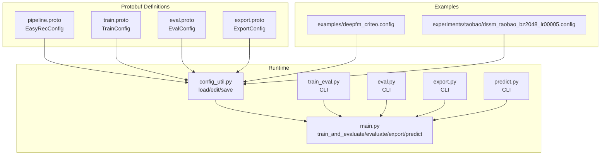
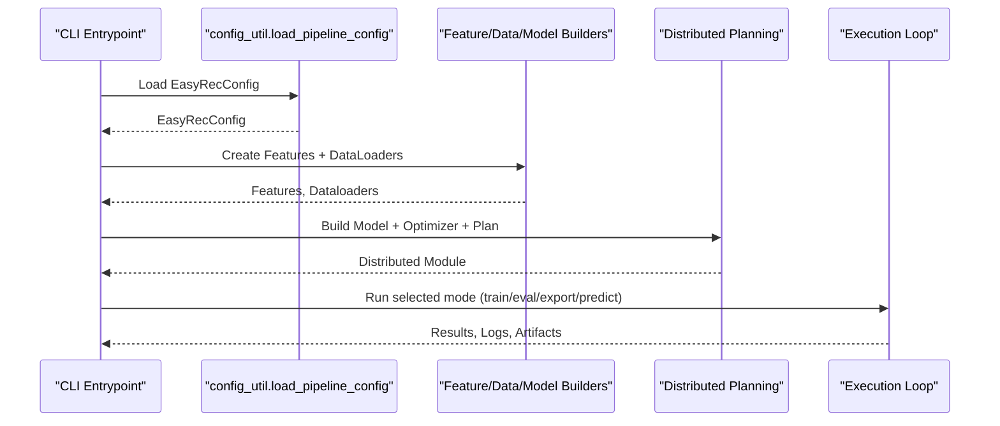
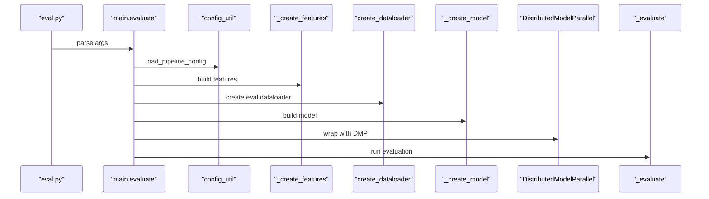
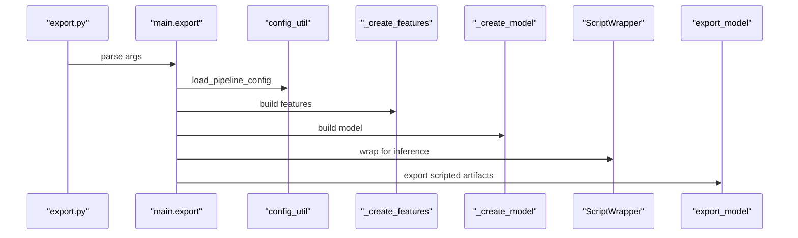
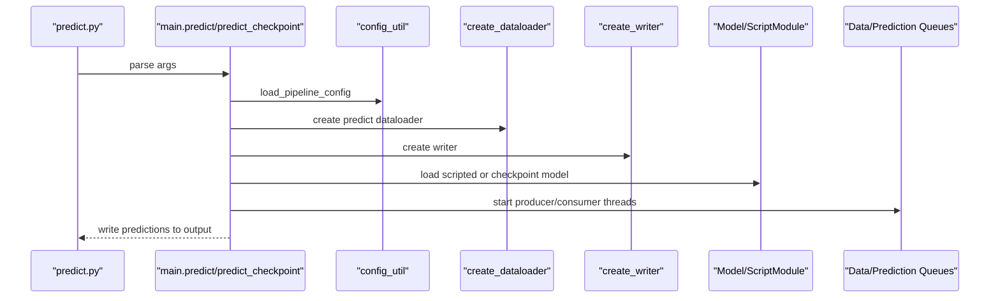
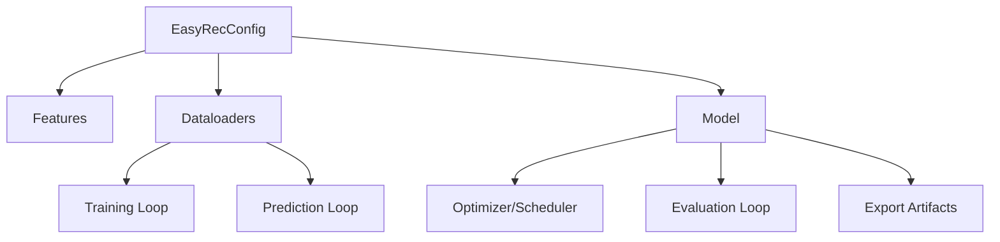
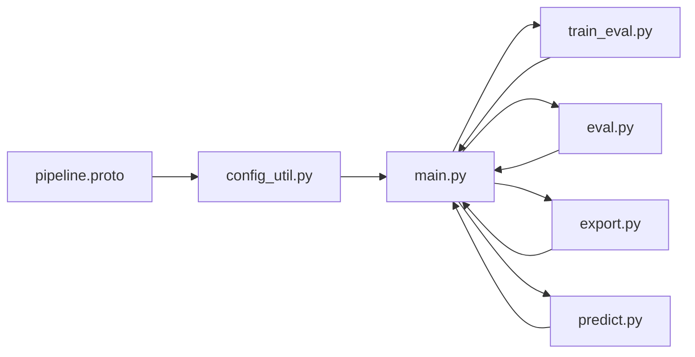

# Pipeline Configuration Schema

<cite>
**Referenced Files in This Document**
- [pipeline.proto](file://tzrec/protos/pipeline.proto)
- [config_util.py](file://tzrec/utils/config_util.py)
- [main.py](file://tzrec/main.py)
- [train_eval.py](file://tzrec/train_eval.py)
- [eval.py](file://tzrec/eval.py)
- [export.py](file://tzrec/export.py)
- [predict.py](file://tzrec/predict.py)
- [train.proto](file://tzrec/protos/train.proto)
- [eval.proto](file://tzrec/protos/eval.proto)
- [export.proto](file://tzrec/protos/export.proto)
- [constant.py](file://tzrec/constant.py)
- [deepfm_criteo.config](file://examples/deepfm_criteo.config)
- [dssm_taobao_bz2048_lr00005.config](file://experiments/taobao/dssm_taobao_bz2048_lr00005.config)
</cite>

## Table of Contents

1. [Introduction](#introduction)
1. [Project Structure](#project-structure)
1. [Core Components](#core-components)
1. [Architecture Overview](#architecture-overview)
1. [Detailed Component Analysis](#detailed-component-analysis)
1. [Dependency Analysis](#dependency-analysis)
1. [Performance Considerations](#performance-considerations)
1. [Troubleshooting Guide](#troubleshooting-guide)
1. [Conclusion](#conclusion)
1. [Appendices](#appendices)

## Introduction

This document describes TorchEasyRec’s pipeline configuration schema and execution model. It focuses on the EasyRecConfig message structure, execution modes (train, eval, export, predict), component orchestration, and workflow definitions. It also covers configuration for different execution modes, resource allocation, environment setup, validation, error handling, monitoring/logging, performance tracking, and customization/integration guidance.

## Project Structure

The pipeline configuration is defined via Protocol Buffers and consumed by the main execution entry points. The key files are:

- Protobuf schema for pipeline and sub-configurations
- Utilities for loading, editing, and saving configs
- Main execution functions for train/eval/export/predict
- Example configs for training and evaluation



**Diagram sources**

- \[pipeline.proto\](file://tzrec/protos/pipeline.proto#L11-L29)
- \[train.proto\](file://tzrec/protos/train.proto#L21-L61)
- \[eval.proto\](file://tzrec/protos/eval.proto#L4-L9)
- \[export.proto\](file://tzrec/protos/export.proto#L4-L13)
- \[config_util.py\](file://tzrec/utils/config_util.py#L25-L48)
- \[main.py\](file://tzrec/main.py#L527-L734)
- \[train_eval.py\](file://tzrec/train_eval.py#L16-L72)
- \[eval.py\](file://tzrec/eval.py#L16-L50)
- \[export.py\](file://tzrec/export.py#L16-L50)
- \[predict.py\](file://tzrec/predict.py#L16-L143)
- \[deepfm_criteo.config\](file://examples/deepfm_criteo.config#L1-L397)
- \[dssm_taobao_bz2048_lr00005.config\](file://experiments/taobao/dssm_taobao_bz2048_lr00005.config#L1-L224)

**Section sources**

- \[pipeline.proto\](file://tzrec/protos/pipeline.proto#L11-L29)
- \[config_util.py\](file://tzrec/utils/config_util.py#L25-L48)
- \[main.py\](file://tzrec/main.py#L527-L734)
- \[train_eval.py\](file://tzrec/train_eval.py#L16-L72)
- \[eval.py\](file://tzrec/eval.py#L16-L50)
- \[export.py\](file://tzrec/export.py#L16-L50)
- \[predict.py\](file://tzrec/predict.py#L16-L143)

## Core Components

- EasyRecConfig: Top-level configuration containing:
  - Training and evaluation data paths
  - Model directory
  - Optional sub-configs: TrainConfig, EvalConfig, ExportConfig
  - DataConfig and FeatureConfigs
  - ModelConfig
- TrainConfig: Execution controls for training (steps/epochs, checkpoints, logging, profiling, tensorboard, optimizers, mixed precision, grad scaler, gradient accumulation)
- EvalConfig: Evaluation controls (steps, logging frequency)
- ExportConfig: Export policy (latest vs best checkpoint selection, metric criteria)
- DataConfig and FeatureConfigs: Data ingestion, feature engineering, and sampling configuration
- ModelConfig: Model definition and metrics/losses

Key behaviors:

- Config loading supports both text and JSON formats
- Compatibility handling for legacy fields (e.g., fg_encoded)
- Editable via dot-path expressions for targeted updates
- Validation enforced by mutual exclusivity of steps vs epochs in training

**Section sources**

- \[pipeline.proto\](file://tzrec/protos/pipeline.proto#L11-L29)
- \[train.proto\](file://tzrec/protos/train.proto#L21-L61)
- \[eval.proto\](file://tzrec/protos/eval.proto#L4-L9)
- \[export.proto\](file://tzrec/protos/export.proto#L4-L13)
- \[config_util.py\](file://tzrec/utils/config_util.py#L25-L48)
- \[config_util.py\](file://tzrec/utils/config_util.py#L144-L298)

## Architecture Overview

The pipeline orchestrates four primary execution modes, each driven by EasyRecConfig and its sub-configs. The runtime builds features, data loaders, models, optimizers, and distributed plans, then executes the chosen workflow.



**Diagram sources**

- \[config_util.py\](file://tzrec/utils/config_util.py#L25-L48)
- \[main.py\](file://tzrec/main.py#L527-L734)
- \[main.py\](file://tzrec/main.py#L739-L837)
- \[main.py\](file://tzrec/main.py#L840-L937)
- \[main.py\](file://tzrec/main.py#L977-L1196)
- \[main.py\](file://tzrec/main.py#L1199-L1388)

## Detailed Component Analysis

### EasyRecConfig Message Structure

- Required fields:
  - train_input_path
  - eval_input_path
  - model_dir
- Optional sub-configs:
  - train_config
  - eval_config
  - export_config
  - data_config
  - feature_configs (repeated)
  - model_config

Compatibility note:

- Legacy fg_encoded is mapped to fg_mode automatically

Validation:

- Mutual exclusivity enforced for training steps vs epochs

**Section sources**

- \[pipeline.proto\](file://tzrec/protos/pipeline.proto#L11-L29)
- \[config_util.py\](file://tzrec/utils/config_util.py#L78-L92)
- \[main.py\](file://tzrec/main.py#L331-L334)

### Execution Modes and Workflows

#### Train and Evaluate Mode

- Entrypoint: train_and_evaluate
- Steps:
  - Load EasyRecConfig and optional overrides/edit
  - Initialize distributed environment
  - Build features and dataloaders (train/eval)
  - Restore from checkpoint if requested
  - Build model, optimizer, schedulers, and distributed plan
  - Train loop with logging, checkpoints, and periodic evaluation
  - TensorBoard summaries and profiling support

```mermaid
sequenceDiagram
participant CLI as "train_eval.py"
participant Main as "main.train_and_evaluate"
participant Cfg as "config_util"
participant Feat as "_create_features"
participant DL as "create_dataloader"
participant Mod as "_create_model"
participant Dist as "DistributedModelParallel"
participant Loop as "_train_and_evaluate"
CLI->>Main : parse args
Main->>Cfg : load_pipeline_config
Main->>Feat : build features
Main->>DL : create train dataloader
Main->>DL : create eval dataloader
Main->>Mod : build model
Main->>Dist : wrap with DMP
Main->>Loop : execute training + periodic eval
```

**Diagram sources**

- \[train_eval.py\](file://tzrec/train_eval.py#L16-L72)
- \[main.py\](file://tzrec/main.py#L527-L734)
- \[main.py\](file://tzrec/main.py#L310-L525)

**Section sources**

- \[train_eval.py\](file://tzrec/train_eval.py#L16-L72)
- \[main.py\](file://tzrec/main.py#L527-L734)
- \[main.py\](file://tzrec/main.py#L310-L525)

#### Evaluate Mode

- Entrypoint: evaluate
- Steps:
  - Load EasyRecConfig
  - Initialize distributed environment
  - Build features and dataloader
  - Build model and optionally restore checkpoint
  - Distributed planning and evaluation loop
  - Metrics logging and optional TensorBoard



**Diagram sources**

- \[eval.py\](file://tzrec/eval.py#L16-L50)
- \[main.py\](file://tzrec/main.py#L739-L837)
- \[main.py\](file://tzrec/main.py#L161-L225)

**Section sources**

- \[eval.py\](file://tzrec/eval.py#L16-L50)
- \[main.py\](file://tzrec/main.py#L739-L837)
- \[main.py\](file://tzrec/main.py#L161-L225)

#### Export Mode

- Entrypoint: export
- Steps:
  - Load EasyRecConfig
  - Build features and model (inference wrapper)
  - Select checkpoint (latest or best)
  - Export model artifacts and assets per model type (match towers, TDM embeddings, or generic model)



**Diagram sources**

- \[export.py\](file://tzrec/export.py#L16-L50)
- \[main.py\](file://tzrec/main.py#L840-L937)

**Section sources**

- \[export.py\](file://tzrec/export.py#L16-L50)
- \[main.py\](file://tzrec/main.py#L840-L937)

#### Predict Mode

Two variants:

- Predict from exported scripted model (predict)
- Predict from checkpoint (predict_checkpoint)

Highlights:

- Scripted model path loads pipeline.config and adapts batch size for acceleration backends
- Checkpoint predict builds model, restores checkpoint, and runs prediction with distributed pipeline
- Parallel data queue and prediction queue for throughput
- Optional profiling and TensorBoard tracing



**Diagram sources**

- \[predict.py\](file://tzrec/predict.py#L16-L143)
- \[main.py\](file://tzrec/main.py#L977-L1196)
- \[main.py\](file://tzrec/main.py#L1199-L1388)

**Section sources**

- \[predict.py\](file://tzrec/predict.py#L16-L143)
- \[main.py\](file://tzrec/main.py#L977-L1196)
- \[main.py\](file://tzrec/main.py#L1199-L1388)

### Configuration for Different Execution Modes

- Training

  - Set train_input_path, eval_input_path, model_dir
  - Configure TrainConfig: optimizers, num_steps vs num_epochs, checkpoints, logging, profiling, tensorboard, mixed precision, grad scaler, gradient accumulation
  - Configure DataConfig: dataset_type, batch_size, fg_mode, label_fields, num_workers, negative sampling
  - Define FeatureConfigs and ModelConfig (metrics/losses)
  - Example: \[deepfm_criteo.config\](file://examples/deepfm_criteo.config#L1-L397)

- Evaluation

  - Provide eval_input_path and optionally override checkpoint path
  - Configure EvalConfig: num_steps, log_step_count_steps
  - Example: \[dssm_taobao_bz2048_lr00005.config\](file://experiments/taobao/dssm_taobao_bz2048_lr00005.config#L21-L22)

- Export

  - Configure ExportConfig: exporter_type, best_exporter_metric, metric_larger_is_better
  - Export artifacts to export_dir using latest or best checkpoint

- Predict

  - Either scripted model path (predict) or checkpoint path (predict_checkpoint)
  - Override dataset_type, batch_size, writer_type, reserved/output columns, predict_steps
  - Profiling support and optional edits via edit_config_json

**Section sources**

- \[train.proto\](file://tzrec/protos/train.proto#L21-L61)
- \[eval.proto\](file://tzrec/protos/eval.proto#L4-L9)
- \[export.proto\](file://tzrec/protos/export.proto#L4-L13)
- \[deepfm_criteo.config\](file://examples/deepfm_criteo.config#L1-L397)
- \[dssm_taobao_bz2048_lr00005.config\](file://experiments/taobao/dssm_taobao_bz2048_lr00005.config#L21-L224)
- \[main.py\](file://tzrec/main.py#L977-L1196)
- \[main.py\](file://tzrec/main.py#L1199-L1388)

### Resource Allocation and Environment Setup

- Distributed initialization and process groups
- Mixed precision and TF32 toggles
- Gradient scaler configuration
- Global embedding constraints
- Optimizer selection and schedulers
- Logging and TensorBoard summaries
- Profiling traces for training and prediction

**Section sources**

- \[main.py\](file://tzrec/main.py#L566-L734)
- \[main.py\](file://tzrec/main.py#L739-L837)
- \[main.py\](file://tzrec/main.py#L840-L937)
- \[main.py\](file://tzrec/main.py#L977-L1196)
- \[main.py\](file://tzrec/main.py#L1199-L1388)
- \[constant.py\](file://tzrec/constant.py#L16-L41)
- \[train.proto\](file://tzrec/protos/train.proto#L48-L61)

### Data Flow Between Stages

- Features: created from FeatureConfigs with fg_mode and optional negative fields
- Dataloaders: created per mode (TRAIN/EVAL/PREDICT) with dataset_type and batch_size
- Model: built from ModelConfig and wrapped for training/inference
- Optimizer/Scheduler: constructed from TrainConfig and applied to parameters
- Evaluation: metrics computed and optionally logged to TensorBoard
- Export: scripted artifacts generated for serving



**Diagram sources**

- \[pipeline.proto\](file://tzrec/protos/pipeline.proto#L11-L29)
- \[main.py\](file://tzrec/main.py#L93-L111)
- \[main.py\](file://tzrec/main.py#L575-L589)
- \[main.py\](file://tzrec/main.py#L621-L628)
- \[main.py\](file://tzrec/main.py#L633-L705)
- \[main.py\](file://tzrec/main.py#L161-L225)
- \[main.py\](file://tzrec/main.py#L840-L937)
- \[main.py\](file://tzrec/main.py#L977-L1196)

## Dependency Analysis

- EasyRecConfig aggregates TrainConfig, EvalConfig, ExportConfig, DataConfig, FeatureConfigs, and ModelConfig
- Runtime depends on config_util for loading/editing/saving
- Execution functions depend on builders for features, dataloaders, writers, models, and distributed planning
- CLI wrappers delegate to main functions



**Diagram sources**

- \[pipeline.proto\](file://tzrec/protos/pipeline.proto#L11-L29)
- \[config_util.py\](file://tzrec/utils/config_util.py#L25-L48)
- \[main.py\](file://tzrec/main.py#L527-L734)
- \[train_eval.py\](file://tzrec/train_eval.py#L16-L72)
- \[eval.py\](file://tzrec/eval.py#L16-L50)
- \[export.py\](file://tzrec/export.py#L16-L50)
- \[predict.py\](file://tzrec/predict.py#L16-L143)

**Section sources**

- \[pipeline.proto\](file://tzrec/protos/pipeline.proto#L11-L29)
- \[config_util.py\](file://tzrec/utils/config_util.py#L25-L48)
- \[main.py\](file://tzrec/main.py#L527-L734)

## Performance Considerations

- Mixed precision and TF32 toggles for speed/memory
- Gradient scaler for stability
- Gradient accumulation for effective batch scaling
- TensorBoard summaries for loss, learning rate, and gradients
- Profiling traces for training and prediction
- Parallel prediction queues and configurable predict_threads
- Distributed model parallelism and collective planning

[No sources needed since this section provides general guidance]

## Troubleshooting Guide

Common issues and remedies:

- Invalid EasyRecConfig format: ensure .pbtxt or .json extension and correct syntax
- Unknown fields: use allow_unknown_field sparingly; prefer updating schema
- Conflicting training settings: num_steps XOR num_epochs must be set
- Missing checkpoint path: specify checkpoint_path or rely on latest/best selection
- Export directory exists: remove or change export_dir
- Predict threads timeouts: adjust PREDICT_QUEUE_TIMEOUT environment variable
- fg_mode compatibility: legacy fg_encoded is auto-mapped to fg_mode

**Section sources**

- \[config_util.py\](file://tzrec/utils/config_util.py#L25-L48)
- \[config_util.py\](file://tzrec/utils/config_util.py#L78-L92)
- \[main.py\](file://tzrec/main.py#L331-L334)
- \[main.py\](file://tzrec/main.py#L594-L602)
- \[main.py\](file://tzrec/main.py#L861-L862)
- \[constant.py\](file://tzrec/constant.py#L28-L41)

## Conclusion

TorchEasyRec’s pipeline configuration schema centers on EasyRecConfig and its sub-configurations to orchestrate training, evaluation, export, and prediction. The runtime provides robust builders, distributed execution, and observability via logging and TensorBoard. Examples demonstrate practical configurations for training and evaluation. The system supports customization via editable configs, component replacement, and integration with external systems through CLI and exported artifacts.

[No sources needed since this section summarizes without analyzing specific files]

## Appendices

### Appendix A: Example Configurations

- Training example: \[deepfm_criteo.config\](file://examples/deepfm_criteo.config#L1-L397)
- Evaluation example: \[dssm_taobao_bz2048_lr00005.config\](file://experiments/taobao/dssm_taobao_bz2048_lr00005.config#L1-L224)

### Appendix B: CLI Reference

- Train/Eval: \[train_eval.py\](file://tzrec/train_eval.py#L16-L72)
- Evaluate: \[eval.py\](file://tzrec/eval.py#L16-L50)
- Export: \[export.py\](file://tzrec/export.py#L16-L50)
- Predict: \[predict.py\](file://tzrec/predict.py#L16-L143)
