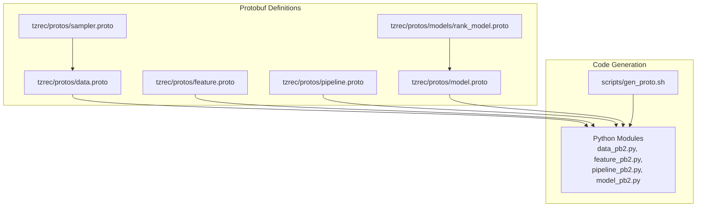
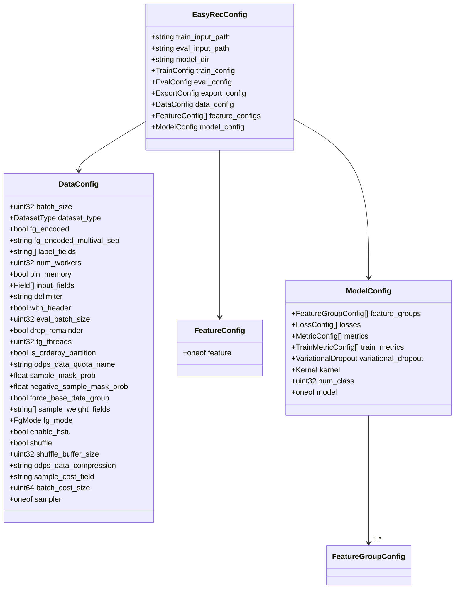
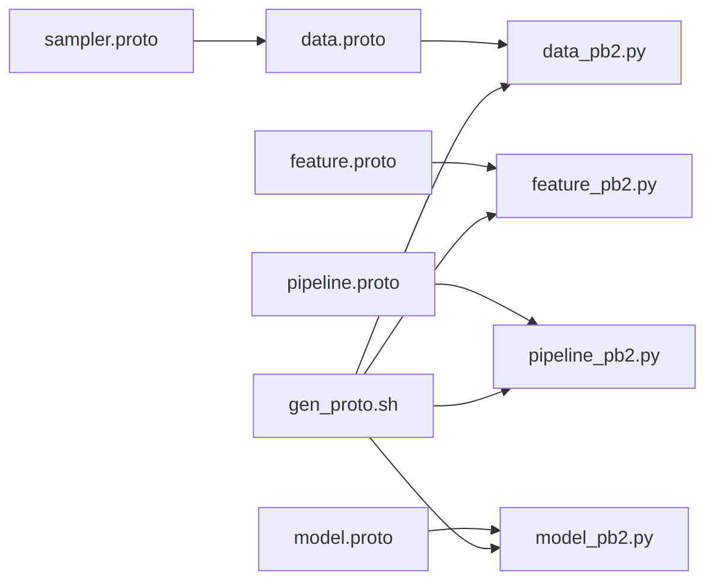
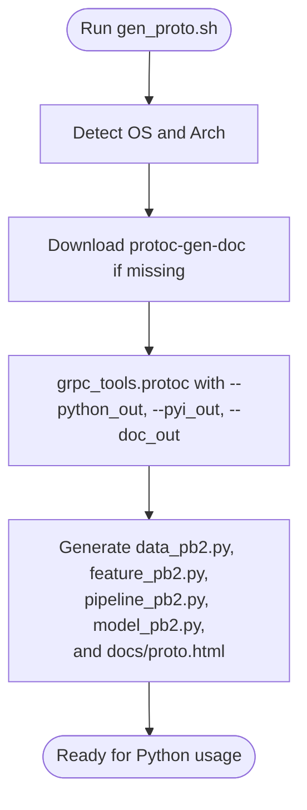
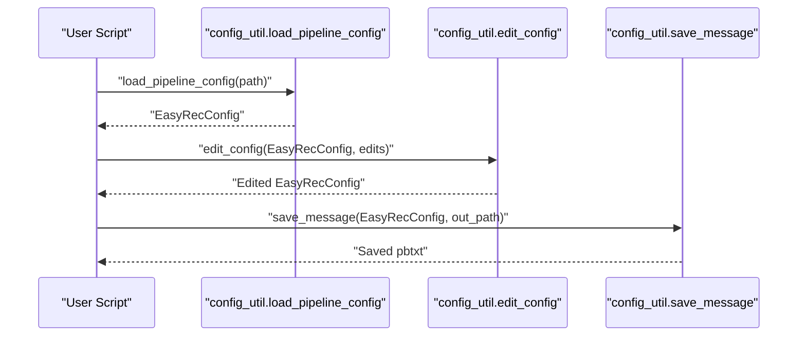

# Protocol Buffers Schema Definition

<cite>
**Referenced Files in This Document**
- [data.proto](file://tzrec/protos/data.proto)
- [feature.proto](file://tzrec/protos/feature.proto)
- [pipeline.proto](file://tzrec/protos/pipeline.proto)
- [model.proto](file://tzrec/protos/model.proto)
- [rank_model.proto](file://tzrec/protos/models/rank_model.proto)
- [sampler.proto](file://tzrec/protos/sampler.proto)
- [gen_proto.sh](file://scripts/gen_proto.sh)
- [config_util.py](file://tzrec/utils/config_util.py)
- [data_pb2.py](file://tzrec/protos/data_pb2.py)
- [deepfm_criteo.config](file://examples/deepfm_criteo.config)
- [dssm_taobao_adam.config](file://experiments/taobao/dssm_taobao_adam.config)
</cite>

## Table of Contents

1. [Introduction](#introduction)
1. [Project Structure](#project-structure)
1. [Core Components](#core-components)
1. [Architecture Overview](#architecture-overview)
1. [Detailed Component Analysis](#detailed-component-analysis)
1. [Dependency Analysis](#dependency-analysis)
1. [Performance Considerations](#performance-considerations)
1. [Troubleshooting Guide](#troubleshooting-guide)
1. [Conclusion](#conclusion)
1. [Appendices](#appendices)

## Introduction

This document describes TorchEasyRec’s Protocol Buffers schema used to define runtime configuration for data ingestion, feature engineering, model architecture, training, evaluation, and export. It covers:

- Enumerations (DatasetType, FieldType, FgMode)
- Messages (Field, DataConfig, FeatureConfig, ModelConfig, TrainConfig, PipelineConfig)
- Relationships among messages and model-specific configurations
- Schema evolution, backward compatibility, and versioning strategy
- Field types, defaults, and validation rules
- Python code generation and usage patterns
- Integration with the Python framework and runtime configuration processing

## Project Structure

The protobuf definitions live under tzrec/protos and are compiled into Python modules via a shell script. Example configuration files demonstrate usage in practice.

**Diagram sources**

- \[data.proto\](file://tzrec/protos/data.proto#L1-L138)
- \[feature.proto\](file://tzrec/protos/feature.proto#L1-L957)
- \[pipeline.proto\](file://tzrec/protos/pipeline.proto#L1-L30)
- \[model.proto\](file://tzrec/protos/model.proto#L1-L90)
- \[sampler.proto\](file://tzrec/protos/sampler.proto#L1-L142)
- \[rank_model.proto\](file://tzrec/protos/models/rank_model.proto#L1-L80)
- \[gen_proto.sh\](file://scripts/gen_proto.sh#L1-L24)

**Section sources**

- \[gen_proto.sh\](file://scripts/gen_proto.sh#L1-L24)
- \[data.proto\](file://tzrec/protos/data.proto#L1-L138)
- \[feature.proto\](file://tzrec/protos/feature.proto#L1-L957)
- \[pipeline.proto\](file://tzrec/protos/pipeline.proto#L1-L30)
- \[model.proto\](file://tzrec/protos/model.proto#L1-L90)
- \[sampler.proto\](file://tzrec/protos/sampler.proto#L1-L142)
- \[rank_model.proto\](file://tzrec/protos/models/rank_model.proto#L1-L80)

## Core Components

- Enums
  - DatasetType: OdpsDataset, ParquetDataset, CsvDataset, OdpsDatasetV1
  - FieldType: INT32, INT64, STRING, FLOAT, DOUBLE
  - FgMode: FG_NONE, FG_NORMAL, FG_DAG, FG_BUCKETIZE
- Messages
  - Field: input_name, optional input_type
  - DataConfig: dataset configuration including batch sizes, workers, memory, CSV delimiters, labels, sampling, FG mode, and sampler oneof
  - FeatureConfig: oneof of feature types (IdFeature, RawFeature, ComboFeature, LookupFeature, MatchFeature, SequenceFeature, ExprFeature, OverlapFeature, TokenizeFeature, CustomFeature, KvDotProduct, BoolMaskFeature)
  - ModelConfig: feature groups, losses, metrics, train metrics, variational dropout, kernel, and oneof model variants (DLRM, DeepFM, MultiTower, MultiTowerDIN, MaskNet, WideAndDeep, DCNV1, DCNV2, xDeepFM, WuKong, SimpleMultiTask, MMoE, DBMTL, PLE, DC2VR, DlrmHSTU, DSSM, DSSMV2, DAT, HSTUMatch, MIND, TDM, RocketLaunching)
  - TrainConfig: optimizers, training steps/epochs, checkpoints, logging, profiling, tensorboard, mixed precision, gradient scaler, gradient accumulation
  - PipelineConfig (EasyRecConfig): top-level container for training/evaluation/export/input paths, DataConfig, FeatureConfig list, ModelConfig

**Section sources**

- \[data.proto\](file://tzrec/protos/data.proto#L6-L34)
- \[data.proto\](file://tzrec/protos/data.proto#L36-L137)
- \[feature.proto\](file://tzrec/protos/feature.proto#L912-L939)
- \[model.proto\](file://tzrec/protos/model.proto#L40-L89)
- \[train.proto\](file://tzrec/protos/train.proto#L21-L61)
- \[pipeline.proto\](file://tzrec/protos/pipeline.proto#L11-L29)

## Architecture Overview

The configuration schema composes layered components: pipeline orchestrates training/evaluation/export, pulls DataConfig and FeatureConfig lists, selects a ModelConfig variant, and optionally uses TrainConfig.

**Diagram sources**

- \[pipeline.proto\](file://tzrec/protos/pipeline.proto#L11-L29)
- \[data.proto\](file://tzrec/protos/data.proto#L43-L137)
- \[feature.proto\](file://tzrec/protos/feature.proto#L912-L939)
- \[model.proto\](file://tzrec/protos/model.proto#L26-L89)

## Detailed Component Analysis

### Enums and Their Semantics

- DatasetType: selects the underlying dataset backend (Odps, Parquet, CSV, legacy Odps)
- FieldType: declares explicit input types for CSV fields when inference fails
- FgMode: controls feature generation pipeline behavior (no FG, Python FG, DAG FG, bucketize-only)

**Section sources**

- \[data.proto\](file://tzrec/protos/data.proto#L6-L34)

### DataConfig: Data Ingestion and Preprocessing

Key fields and defaults:

- batch_size: default 1024
- dataset_type: required, default OdpsDataset
- fg_encoded: deprecated flag; superseded by fg_mode
- fg_encoded_multival_sep: default delimiter for multi-value encoded features
- label_fields: repeated
- num_workers: default 8
- pin_memory: default true
- input_fields: Field entries; Field.input_type optional when FieldType can be inferred
- delimiter: default ","
- with_header: default false
- eval_batch_size: optional
- drop_remainder: default false
- fg_threads: default 1; 0 disables DAG handler
- is_orderby_partition: default false
- odps_data_quota_name: default "pay-as-you-go"
- sample_mask_prob: default 0.0
- negative_sample_mask_prob: default 0.0
- force_base_data_group: default false
- sample_weight_fields: repeated
- fg_mode: default FG_NONE
- enable_hstu: default false
- shuffle: default false
- shuffle_buffer_size: default 32
- odps_data_compression: default "LZ4_FRAME"
- sample_cost_field: optional
- batch_cost_size: optional
- sampler: oneof supporting NegativeSampler, NegativeSamplerV2, HardNegativeSampler, HardNegativeSamplerV2, TDMSampler

Validation and compatibility:

- Deprecated fg_encoded is auto-migrated to fg_mode via runtime config loader
- fg_threads=0 implies FG_NORMAL fallback when fg_encoded=false

**Section sources**

- \[data.proto\](file://tzrec/protos/data.proto#L43-L137)
- \[config_util.py\](file://tzrec/utils/config_util.py#L78-L92)

### FeatureConfig and Feature Types

FeatureConfig is a oneof over multiple feature types:

- IdFeature, RawFeature, ComboFeature, LookupFeature, MatchFeature, SequenceFeature, ExprFeature, OverlapFeature, TokenizeFeature, CustomFeature, KvDotProduct, BoolMaskFeature
- SequenceFeature wraps a list of SeqFeatureConfig entries

Each feature type defines:

- feature_name and expression (or equivalent)
- embedding_name, embedding_dim, pooling
- boundaries, vocab_list/vocab_dict, hash_bucket_size, num_buckets
- value_dim, default values, separators, weighted flags
- optional normalizer expressions
- optional dynamic embedding, zero collision hash, and constraints
- optional sequence\_\* fields for sequence modeling

Defaults and behaviors:

- Many fields carry explicit defaults (e.g., pooling sum, default_value "0"/"", separators)
- fg_mode influences default values and bucketization behavior
- sequence\_\* fields enable temporal modeling

**Section sources**

- \[feature.proto\](file://tzrec/protos/feature.proto#L112-L180)
- \[feature.proto\](file://tzrec/protos/feature.proto#L182-L239)
- \[feature.proto\](file://tzrec/protos/feature.proto#L241-L301)
- \[feature.proto\](file://tzrec/protos/feature.proto#L303-L396)
- \[feature.proto\](file://tzrec/protos/feature.proto#L398-L490)
- \[feature.proto\](file://tzrec/protos/feature.proto#L492-L546)
- \[feature.proto\](file://tzrec/protos/feature.proto#L548-L606)
- \[feature.proto\](file://tzrec/protos/feature.proto#L635-L681)
- \[feature.proto\](file://tzrec/protos/feature.proto#L744-L828)
- \[feature.proto\](file://tzrec/protos/feature.proto#L830-L896)
- \[feature.proto\](file://tzrec/protos/feature.proto#L912-L957)

### ModelConfig and Model Variants

ModelConfig aggregates:

- FeatureGroupConfig list (group_name, feature_names, group_type, sequence_groups, sequence_encoders)
- Losses, metrics, train_metrics
- VariationalDropout, kernel selection
- num_class default 1
- Oneof model variants including DLRM, DeepFM, MultiTower, MultiTowerDIN, MaskNet, WideAndDeep, DCNV1, DCNV2, xDeepFM, WuKong, SimpleMultiTask, MMoE, DBMTL, PLE, DC2VR, DlrmHSTU, DSSM, DSSMV2, DAT, HSTUMatch, MIND, TDM, RocketLaunching

Rank model variants are defined in rank_model.proto and embedded via imports.

**Section sources**

- \[model.proto\](file://tzrec/protos/model.proto#L26-L89)
- \[rank_model.proto\](file://tzrec/protos/models/rank_model.proto#L8-L79)

### TrainConfig: Training Execution

Fields include:

- sparse_optimizer and dense_optimizer (required)
- num_steps and num_epochs
- save_checkpoints_steps and save_checkpoints_epochs
- fine_tune_checkpoint and fine_tune_ckpt_param_map
- log_step_count_steps
- is_profiling and use_tensorboard
- tensorboard_summaries
- cudnn_allow_tf32 and cuda_matmul_allow_tf32
- global_embedding_constraints
- mixed_precision
- grad_scaler
- gradient_accumulation_steps

**Section sources**

- \[train.proto\](file://tzrec/protos/train.proto#L21-L61)

### Sampler Oneof: Negative Sampling and Retrieval

DataConfig.sampler supports:

- NegativeSampler, NegativeSamplerV2, HardNegativeSampler, HardNegativeSamplerV2, TDMSampler
  Each defines input paths, sampling counts, attribute fields, and delimiters

**Section sources**

- \[sampler.proto\](file://tzrec/protos/sampler.proto#L4-L23)
- \[sampler.proto\](file://tzrec/protos/sampler.proto#L26-L51)
- \[sampler.proto\](file://tzrec/protos/sampler.proto#L53-L80)
- \[sampler.proto\](file://tzrec/protos/sampler.proto#L82-L112)
- \[sampler.proto\](file://tzrec/protos/sampler.proto#L114-L141)
- \[data.proto\](file://tzrec/protos/data.proto#L129-L136)

### PipelineConfig (EasyRecConfig)

Top-level orchestrator:

- train_input_path, eval_input_path, model_dir
- Optional TrainConfig, EvalConfig, ExportConfig
- DataConfig, repeated FeatureConfig, ModelConfig

**Section sources**

- \[pipeline.proto\](file://tzrec/protos/pipeline.proto#L11-L29)

## Dependency Analysis

- data.proto imports sampler.proto
- model.proto imports model variants and other modules
- pipeline.proto imports train, eval, export, data, feature, model
- Python code generation is driven by gen_proto.sh
- Runtime config loading uses data_pb2 and pipeline_pb2

**Diagram sources**

- \[data.proto\](file://tzrec/protos/data.proto#L4-L4)
- \[sampler.proto\](file://tzrec/protos/sampler.proto#L1-L3)
- \[model.proto\](file://tzrec/protos/model.proto#L4-L11)
- \[pipeline.proto\](file://tzrec/protos/pipeline.proto#L4-L9)
- \[gen_proto.sh\](file://scripts/gen_proto.sh#L23-L23)

**Section sources**

- \[data.proto\](file://tzrec/protos/data.proto#L4-L4)
- \[sampler.proto\](file://tzrec/protos/sampler.proto#L1-L3)
- \[model.proto\](file://tzrec/protos/model.proto#L4-L11)
- \[pipeline.proto\](file://tzrec/protos/pipeline.proto#L4-L9)
- \[gen_proto.sh\](file://scripts/gen_proto.sh#L23-L23)

## Performance Considerations

- DataConfig
  - pin_memory improves GPU transfer performance
  - shuffle_buffer_size balances memory vs. randomness
  - odps_data_compression affects throughput
  - fg_threads controls parallelism of feature generation
- FeatureConfig
  - embedding_dim and hash_bucket_size impact memory footprint
  - sequence_length and sequence_delim influence sequence modeling overhead
- ModelConfig
  - num_class affects output head sizes
  - kernel selection impacts execution backend
- TrainConfig
  - gradient_accumulation_steps increases effective batch size
  - mixed_precision reduces memory and accelerates training

[No sources needed since this section provides general guidance]

## Troubleshooting Guide

Common issues and mitigations:

- Deprecated fg_encoded migration
  - The runtime loader warns and maps fg_encoded to fg_mode automatically
- Unknown fields in JSON/text configs
  - Use allow_unknown_field to skip unknown fields during parsing
- Type mismatches when editing configs
  - The config editor enforces type conversion and supports bracketed selectors for lists/maps

**Section sources**

- \[config_util.py\](file://tzrec/utils/config_util.py#L25-L48)
- \[config_util.py\](file://tzrec/utils/config_util.py#L78-L92)
- \[config_util.py\](file://tzrec/utils/config_util.py#L144-L298)

## Conclusion

TorchEasyRec’s protobuf schema provides a robust, extensible configuration system spanning data ingestion, feature engineering, model architecture, and training execution. Enums and oneofs ensure type safety and clear intent. Backward compatibility is maintained via deprecation handling and automatic migrations. The schema integrates tightly with Python code generation and runtime utilities for seamless end-to-end workflows.

[No sources needed since this section summarizes without analyzing specific files]

## Appendices

### A. Protobuf Compilation and Code Generation Workflow

- Toolchain: grpc_tools.protoc
- Inputs: tzrec/protos/*.proto and tzrec/protos/models/*.proto
- Outputs: Python modules (.py and .pyi), HTML documentation
- Script: scripts/gen_proto.sh

**Diagram sources**

- \[gen_proto.sh\](file://scripts/gen_proto.sh#L1-L24)

**Section sources**

- \[gen_proto.sh\](file://scripts/gen_proto.sh#L1-L24)

### B. Python Generated Classes and Usage Patterns

- Generated modules expose enums and messages for programmatic manipulation
- Typical usage:
  - Load EasyRecConfig from text or JSON
  - Convert to kwargs for inspection or editing
  - Edit parameters via config_util.edit_config
  - Save back to text format

**Diagram sources**

- \[config_util.py\](file://tzrec/utils/config_util.py#L25-L48)
- \[config_util.py\](file://tzrec/utils/config_util.py#L144-L298)
- \[config_util.py\](file://tzrec/utils/config_util.py#L51-L63)

**Section sources**

- \[config_util.py\](file://tzrec/utils/config_util.py#L25-L48)
- \[config_util.py\](file://tzrec/utils/config_util.py#L51-L63)
- \[config_util.py\](file://tzrec/utils/config_util.py#L144-L298)

### C. Examples of Config Usage

- Example 1: DeepFM on Criteo with FG_NONE and CSV-like fields
- Example 2: DSSM on Taobao with FG_DAG and negative sampling

These examples illustrate:

- EasyRecConfig fields (paths, train/eval/export configs)
- DataConfig with dataset_type, fg_mode, label_fields, sampler
- FeatureConfig entries for id/raw features
- ModelConfig with feature_groups and model variant

**Section sources**

- \[deepfm_criteo.config\](file://examples/deepfm_criteo.config#L1-L397)
- \[dssm_taobao_adam.config\](file://experiments/taobao/dssm_taobao_adam.config#L1-L224)

### D. Schema Evolution, Backward Compatibility, and Versioning

- Deprecation handling
  - fg_encoded is deprecated; mapped to fg_mode via \_get_compatible_fg_mode
- Default values
  - Many fields specify defaults in proto; generated Python modules reflect these defaults
- Extensibility
  - oneof fields allow adding new variants without breaking existing configs
  - New enums and messages can be introduced while maintaining backward compatibility

**Section sources**

- \[data.proto\](file://tzrec/protos/data.proto#L50-L54)
- \[data_pb2.py\](file://tzrec/protos/data_pb2.py#L17-L35)
- \[config_util.py\](file://tzrec/utils/config_util.py#L78-L92)
