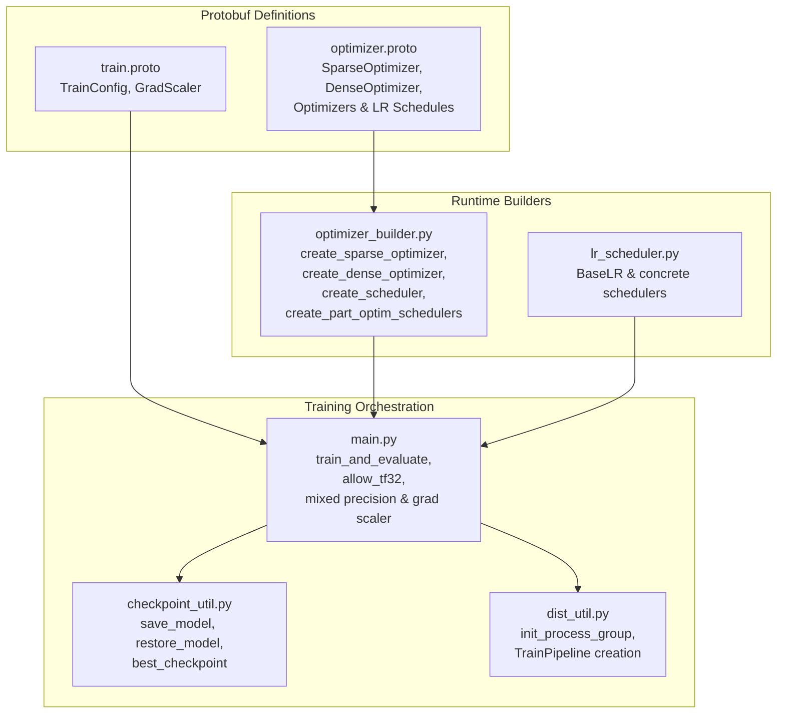
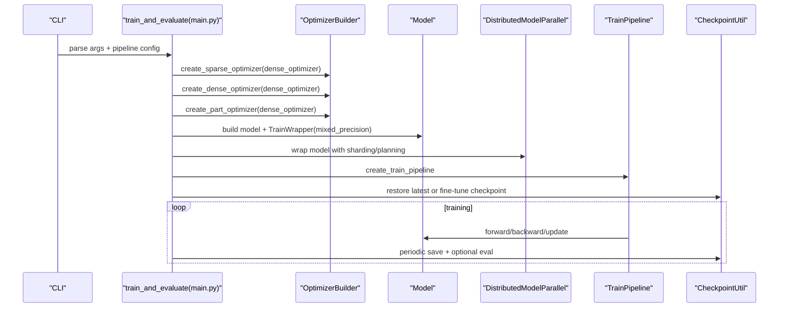
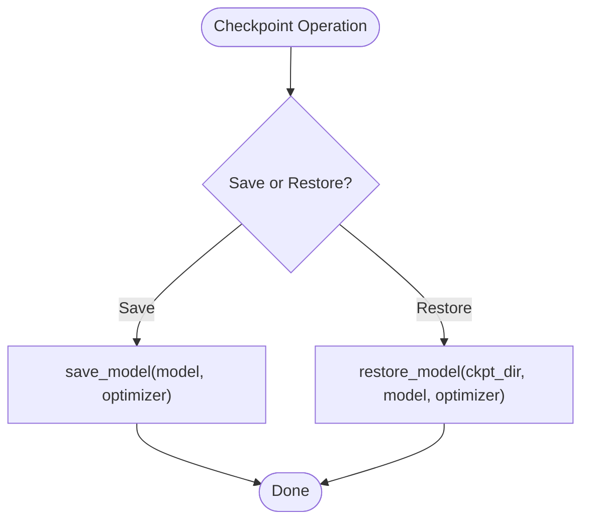
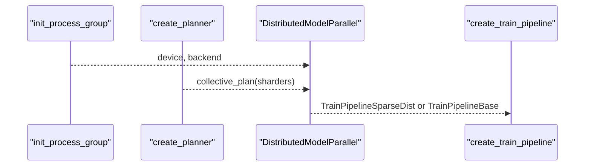
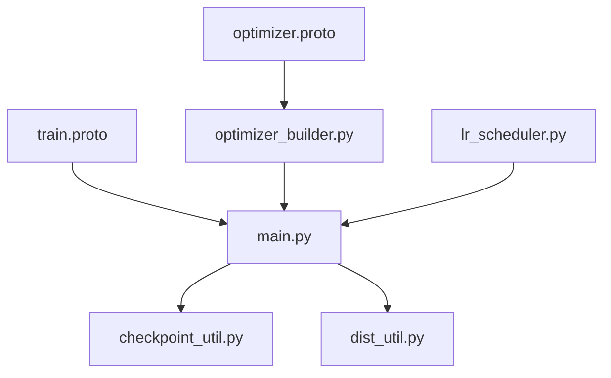

# Training Configuration Schema

<cite>
**Referenced Files in This Document**
- [train.proto](file://tzrec/protos/train.proto)
- [optimizer.proto](file://tzrec/protos/optimizer.proto)
- [optimizer_builder.py](file://tzrec/optim/optimizer_builder.py)
- [lr_scheduler.py](file://tzrec/optim/lr_scheduler.py)
- [checkpoint_util.py](file://tzrec/utils/checkpoint_util.py)
- [main.py](file://tzrec/main.py)
- [train_eval.py](file://tzrec/train_eval.py)
- [deepfm_criteo.config](file://examples/deepfm_criteo.config)
- [mmoe_taobao.config](file://examples/mmoe_taobao.config)
- [dlrm_criteo.config](file://examples/dlrm_criteo.config)
- [dssm_taobao.config](file://examples/dssm_taobao.config)
- [train.md](file://docs/source/usage/train.md)
- [dist_util.py](file://tzrec/utils/dist_util.py)
</cite>

## Table of Contents

1. [Introduction](#introduction)
1. [Project Structure](#project-structure)
1. [Core Components](#core-components)
1. [Architecture Overview](#architecture-overview)
1. [Detailed Component Analysis](#detailed-component-analysis)
1. [Dependency Analysis](#dependency-analysis)
1. [Performance Considerations](#performance-considerations)
1. [Troubleshooting Guide](#troubleshooting-guide)
1. [Conclusion](#conclusion)
1. [Appendices](#appendices)

## Introduction

This document provides a comprehensive guide to TorchEasyRec’s training configuration schema. It focuses on the TrainConfig message and related optimizer, learning rate scheduling, gradient clipping, mixed precision, and distributed training settings. It also covers checkpoint management, evaluation intervals, and practical guidance for single GPU, multi-GPU, and distributed training scenarios.

## Project Structure

The training configuration schema is defined via Protocol Buffers and consumed by the training pipeline. Key elements:

- Protobuf definitions for training and optimizer settings
- Builder utilities to construct optimizers and schedulers
- Training loop orchestrator that applies TF32 toggles, mixed precision, gradient accumulation, and checkpointing
- Example configuration files demonstrating typical setups

**Diagram sources**

- \[train.proto\](file://tzrec/protos/train.proto#L21-L61)
- \[optimizer.proto\](file://tzrec/protos/optimizer.proto#L4-L191)
- \[optimizer_builder.py\](file://tzrec/optim/optimizer_builder.py#L30-L189)
- \[lr_scheduler.py\](file://tzrec/optim/lr_scheduler.py#L26-L160)
- \[main.py\](file://tzrec/main.py#L527-L737)
- \[checkpoint_util.py\](file://tzrec/utils/checkpoint_util.py#L323-L389)
- \[dist_util.py\](file://tzrec/utils/dist_util.py#L53-L71)

**Section sources**

- \[train.proto\](file://tzrec/protos/train.proto#L1-L62)
- \[optimizer.proto\](file://tzrec/protos/optimizer.proto#L1-L191)
- \[optimizer_builder.py\](file://tzrec/optim/optimizer_builder.py#L1-L234)
- \[lr_scheduler.py\](file://tzrec/optim/lr_scheduler.py#L1-L160)
- \[main.py\](file://tzrec/main.py#L527-L737)
- \[checkpoint_util.py\](file://tzrec/utils/checkpoint_util.py#L1-L389)
- \[dist_util.py\](file://tzrec/utils/dist_util.py#L53-L71)

## Core Components

- TrainConfig: Top-level training configuration including optimizer settings, training limits, checkpointing, logging, profiling, tensorboard, TF32 toggles, mixed precision, gradient scaling, and gradient accumulation.
- Optimizer Protobufs: Define sparse and dense optimizer choices, per-parameter partitioning, and learning rate schedules.
- Optimizer Builder: Converts protobuf configs into PyTorch/TorchRec optimizer instances and schedulers.
- LR Schedulers: Base and concrete implementations for constant, exponential decay, and manual step schedules.
- Checkpoint Utilities: Save/load model and optimizer states, support partial restoration and best-checkpoint selection.
- Training Orchestrator: Applies TF32 toggles, mixed precision, gradient scaler, gradient accumulation, and manages evaluation and checkpointing.

**Section sources**

- \[train.proto\](file://tzrec/protos/train.proto#L21-L61)
- \[optimizer.proto\](file://tzrec/protos/optimizer.proto#L4-L191)
- \[optimizer_builder.py\](file://tzrec/optim/optimizer_builder.py#L30-L189)
- \[lr_scheduler.py\](file://tzrec/optim/lr_scheduler.py#L26-L160)
- \[checkpoint_util.py\](file://tzrec/utils/checkpoint_util.py#L323-L389)
- \[main.py\](file://tzrec/main.py#L527-L737)

## Architecture Overview

The training pipeline consumes TrainConfig and optimizer configs to build the model, optimizer, and schedulers. It supports:

- Sparse optimizer for embedding parameters (fused kernels)
- Dense optimizer for non-embedding parameters
- Optional per-parameter partitioning with separate optimizers and schedulers
- Mixed precision and dynamic gradient scaling
- TF32 toggles for cudnn and matmul
- Distributed training with NCCL/Gloo and sharded embeddings
- Periodic evaluation and checkpointing

**Diagram sources**

- \[main.py\](file://tzrec/main.py#L527-L737)
- \[optimizer_builder.py\](file://tzrec/optim/optimizer_builder.py#L30-L189)
- \[checkpoint_util.py\](file://tzrec/utils/checkpoint_util.py#L242-L321)

**Section sources**

- \[main.py\](file://tzrec/main.py#L527-L737)
- \[optimizer_builder.py\](file://tzrec/optim/optimizer_builder.py#L30-L189)
- \[checkpoint_util.py\](file://tzrec/utils/checkpoint_util.py#L242-L321)

## Detailed Component Analysis

### TrainConfig Message Structure

TrainConfig defines the end-to-end training behavior:

- sparse_optimizer: Required SparseOptimizer for embedding parameters
- dense_optimizer: Required DenseOptimizer for dense parameters
- num_steps / num_epochs: Exactly one must be set; controls training duration
- save_checkpoints_steps / save_checkpoints_epochs: Mutually exclusive checkpoint intervals
- fine_tune_checkpoint: Resume from checkpoint directory or path
- fine_tune_ckpt_param_map: Parameter name mapping for partial restoration
- log_step_count_steps: Logging and summary cadence
- is_profiling: Enable profiling with TensorBoard handler
- use_tensorboard / tensorboard_summaries: TensorBoard toggles and logged items
- cudnn_allow_tf32 / cuda_matmul_allow_tf32: Enable TF32 for performance
- global_embedding_constraints: Global constraints for embedding sharding
- mixed_precision: Enable BF16 or FP16 mixed precision
- grad_scaler: Dynamic gradient scaling for AMP
- gradient_accumulation_steps: Accumulate gradients across N steps

Key constraints and defaults are enforced in the training loop and builder utilities.

**Section sources**

- \[train.proto\](file://tzrec/protos/train.proto#L21-L61)
- \[main.py\](file://tzrec/main.py#L331-L334)
- \[main.py\](file://tzrec/main.py#L686-L696)
- \[train.md\](file://docs/source/usage/train.md#L62-L108)

### Optimizer Settings (Sparse and Dense)

- SparseOptimizer: Optimizers for embedding parameters with fused kernels and optional gradient clipping.
  - Supported: SGD, Adagrad, Adam, LARS SGD, LAMB, Partial Row-wise LAMB/Adam, Row-wise Adagrad
  - Gradient clipping supported in fused variants
- DenseOptimizer: Optimizers for dense parameters.
  - Supported: SGD, Adagrad, Adam, AdamW
  - Supports per-parameter partitioning via PartOptimizer with regex patterns
  - Learning rate schedules: Constant, ExponentialDecay, ManualStep
- Weight decay modes: Enum includes NONE, L2, DECOUPLE

Builder behavior:

- create_sparse_optimizer and create_dense_optimizer translate protobuf to actual optimizer classes
- create_scheduler builds LR schedulers from optimizer configs
- create_part_optim_schedulers supports per-partition schedulers

**Section sources**

- \[optimizer.proto\](file://tzrec/protos/optimizer.proto#L4-L191)
- \[optimizer_builder.py\](file://tzrec/optim/optimizer_builder.py#L30-L124)
- \[optimizer_builder.py\](file://tzrec/optim/optimizer_builder.py#L127-L189)
- \[lr_scheduler.py\](file://tzrec/optim/lr_scheduler.py#L26-L160)

### Learning Rate Scheduling

Supported schedulers:

- ConstantLR: No decay
- ExponentialDecayLR: Supports decay_size, decay_factor, staircase, warmup, min_learning_rate, by_epoch
- ManualStepLR: Piecewise schedule with schedule_sizes and learning_rates, optional warmup, by_epoch

Schedulers are attached to:

- Sparse optimizer (fused)
- Dense optimizer (non-fused)
- Per-partition optimizers (optional per-partition LR)

Scheduling by epoch vs step is configurable.

**Section sources**

- \[lr_scheduler.py\](file://tzrec/optim/lr_scheduler.py#L53-L160)
- \[optimizer_builder.py\](file://tzrec/optim/optimizer_builder.py#L127-L189)

### Gradient Clipping and Mixed Precision

- Gradient clipping: Available in fused sparse optimizers (max_gradient threshold)
- Mixed precision: Controlled by TrainConfig.mixed_precision (BF16 or FP16)
- Dynamic gradient scaling: TrainConfig.grad_scaler enables GradScaler with init_scale, growth_factor, backoff_factor, growth_interval
- TF32 toggles: cudnn_allow_tf32 and cuda_matmul_allow_tf32 enable performance optimizations

These are applied in the training wrapper and optimizer construction.

**Section sources**

- \[optimizer.proto\](file://tzrec/protos/optimizer.proto#L58-L121)
- \[main.py\](file://tzrec/main.py#L629-L631)
- \[main.py\](file://tzrec/main.py#L686-L696)
- \[main.py\](file://tzrec/main.py#L221-L227)
- \[train.md\](file://docs/source/usage/train.md#L93-L108)

### Gradient Accumulation

TrainConfig.gradient_accumulation_steps allows accumulating gradients across multiple steps before updating parameters. This is integrated into the optimizer wrapper to simulate larger effective batch sizes.

**Section sources**

- \[train.proto\](file://tzrec/protos/train.proto#L59-L59)
- \[main.py\](file://tzrec/main.py#L695-L695)

### Checkpoint Management

- Save checkpoints at step or epoch intervals
- Restore model and optimizer states; optional ignore of optimizer state
- Partial restoration via parameter mapping file
- Best checkpoint selection based on evaluation metrics

**Diagram sources**

- \[checkpoint_util.py\](file://tzrec/utils/checkpoint_util.py#L323-L389)
- \[checkpoint_util.py\](file://tzrec/utils/checkpoint_util.py#L242-L321)

**Section sources**

- \[checkpoint_util.py\](file://tzrec/utils/checkpoint_util.py#L323-L389)
- \[checkpoint_util.py\](file://tzrec/utils/checkpoint_util.py#L176-L240)
- \[main.py\](file://tzrec/main.py#L443-L485)

### Evaluation Intervals

- Evaluation runs after each checkpoint save when eval_dataloader is configured
- Metrics are logged and optionally written to TensorBoard
- Evaluation cadence controlled by checkpoint intervals

**Section sources**

- \[main.py\](file://tzrec/main.py#L451-L462)
- \[main.py\](file://tzrec/main.py#L474-L485)

### Early Stopping Criteria

Early stopping is not directly configured in TrainConfig. Instead, best checkpoint selection is supported via evaluation metrics and ExportConfig. Users can leverage best_checkpoint selection to emulate early stopping behavior by monitoring external metrics.

**Section sources**

- \[checkpoint_util.py\](file://tzrec/utils/checkpoint_util.py#L176-L240)

### Distributed Training and Multi-GPU

- Process group initialization with NCCL (GPU) or Gloo (CPU)
- Train pipeline selection based on presence of sparse modules
- TF32 toggles applied depending on backend
- Sharding and planning for embedding collections

**Diagram sources**

- \[dist_util.py\](file://tzrec/utils/dist_util.py#L53-L71)
- \[main.py\](file://tzrec/main.py#L642-L663)
- \[main.py\](file://tzrec/main.py#L338-L345)

**Section sources**

- \[dist_util.py\](file://tzrec/utils/dist_util.py#L53-L71)
- \[main.py\](file://tzrec/main.py#L642-L663)
- \[main.py\](file://tzrec/main.py#L338-L345)

### Examples of Training Configurations

Below are representative configurations from example files demonstrating typical setups.

- Single-task model with constant learning rate:

  - See \[deepfm_criteo.config\](file://examples/deepfm_criteo.config#L4-L20)

- Multi-task model with constant learning rate:

  - See \[mmoe_taobao.config\](file://examples/mmoe_taobao.config#L4-L20)

- DLRM model with constant learning rate:

  - See \[dlrm_criteo.config\](file://examples/dlrm_criteo.config#L4-L20)

- DSSM model with epoch-based training:

  - See \[dssm_taobao.config\](file://examples/dssm_taobao.config#L4-L20)

These examples show sparse and dense optimizer configurations, batch sizes, and data settings commonly paired with training configs.

**Section sources**

- \[deepfm_criteo.config\](file://examples/deepfm_criteo.config#L4-L20)
- \[mmoe_taobao.config\](file://examples/mmoe_taobao.config#L4-L20)
- \[dlrm_criteo.config\](file://examples/dlrm_criteo.config#L4-L20)
- \[dssm_taobao.config\](file://examples/dssm_taobao.config#L4-L20)

## Dependency Analysis

The training configuration schema depends on:

- Protobuf messages for TrainConfig and optimizer definitions
- Builder utilities to instantiate optimizers and schedulers
- Runtime utilities for TF32 toggles, mixed precision, and checkpointing
- Distributed utilities for process group and pipeline creation

**Diagram sources**

- \[train.proto\](file://tzrec/protos/train.proto#L21-L61)
- \[optimizer.proto\](file://tzrec/protos/optimizer.proto#L4-L191)
- \[optimizer_builder.py\](file://tzrec/optim/optimizer_builder.py#L30-L189)
- \[lr_scheduler.py\](file://tzrec/optim/lr_scheduler.py#L26-L160)
- \[main.py\](file://tzrec/main.py#L527-L737)
- \[checkpoint_util.py\](file://tzrec/utils/checkpoint_util.py#L323-L389)
- \[dist_util.py\](file://tzrec/utils/dist_util.py#L53-L71)

**Section sources**

- \[train.proto\](file://tzrec/protos/train.proto#L21-L61)
- \[optimizer.proto\](file://tzrec/protos/optimizer.proto#L4-L191)
- \[optimizer_builder.py\](file://tzrec/optim/optimizer_builder.py#L30-L189)
- \[lr_scheduler.py\](file://tzrec/optim/lr_scheduler.py#L26-L160)
- \[main.py\](file://tzrec/main.py#L527-L737)
- \[checkpoint_util.py\](file://tzrec/utils/checkpoint_util.py#L323-L389)
- \[dist_util.py\](file://tzrec/utils/dist_util.py#L53-L71)

## Performance Considerations

- Mixed precision: Enable BF16 or FP16 via TrainConfig.mixed_precision for speed/memory gains
- Dynamic gradient scaling: Configure grad_scaler for FP16 to maintain stability
- TF32 toggles: cudnn_allow_tf32 and cuda_matmul_allow_tf32 can improve throughput on supported hardware
- Gradient accumulation: Increase effective batch size without memory pressure
- Logging overhead: Limit tensorboard_summaries to reduce I/O overhead in large-scale runs
- Distributed efficiency: Ensure proper sharding/planning minimizes communication and maximizes compute locality

[No sources needed since this section provides general guidance]

## Troubleshooting Guide

Common issues and resolutions:

- Conflicting training limits: num_steps XOR num_epochs must be set; ensure only one is configured
- Checkpoint restore errors: Verify fine_tune_checkpoint path exists; use fine_tune_ckpt_param_map for parameter name mismatches
- Missing optimizer state: Use ignore_restore_optimizer to skip loading optimizer state when resuming
- TF32-related numerical differences: Disable TF32 toggles if reproducibility is required
- Mixed precision instability: Adjust grad_scaler parameters or disable mixed precision
- Distributed hangs: Confirm process group initialization and backend selection

**Section sources**

- \[main.py\](file://tzrec/main.py#L331-L334)
- \[main.py\](file://tzrec/main.py#L594-L602)
- \[main.py\](file://tzrec/main.py#L603-L617)
- \[train_eval.py\](file://tzrec/train_eval.py#L37-L60)
- \[train.md\](file://docs/source/usage/train.md#L93-L108)

## Conclusion

TorchEasyRec’s training configuration schema provides a robust, flexible framework for configuring optimizers, learning rate schedules, gradient clipping, mixed precision, and distributed training. By leveraging the protobuf definitions, builder utilities, and runtime orchestration, users can tailor training to diverse hardware and model architectures while maintaining strong performance and reliability.

[No sources needed since this section summarizes without analyzing specific files]

## Appendices

### Appendix A: Training Command and Environment

- Use torchrun to launch distributed training with appropriate nnodes and nproc-per-node settings
- Set environment variables for MaxCompute access when using ODPS datasets
- Use CLI flags to override pipeline config values at runtime

**Section sources**

- \[train.md\](file://docs/source/usage/train.md#L5-L28)
- \[train_eval.py\](file://tzrec/train_eval.py#L16-L72)
