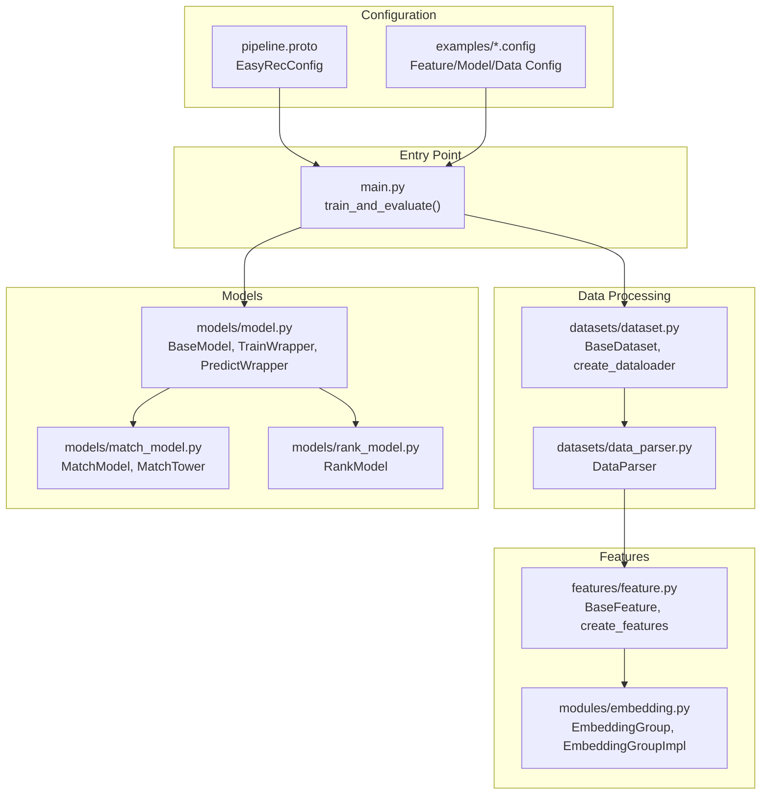
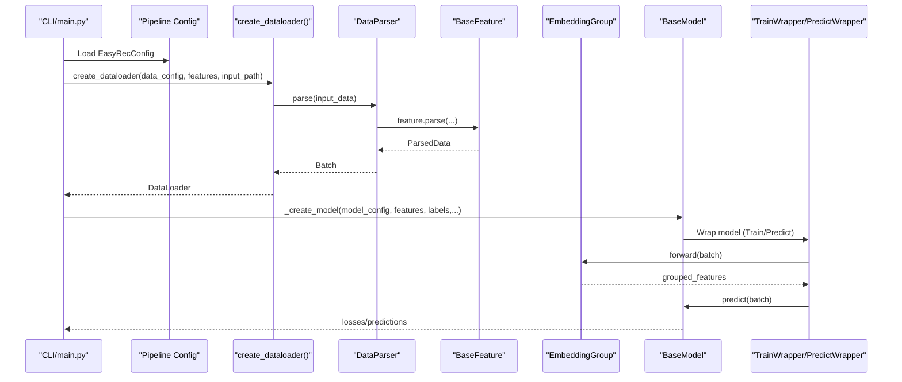
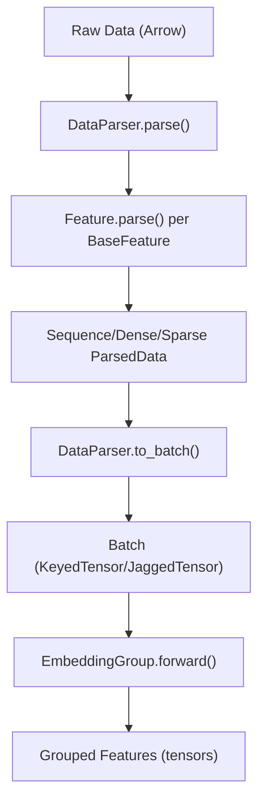
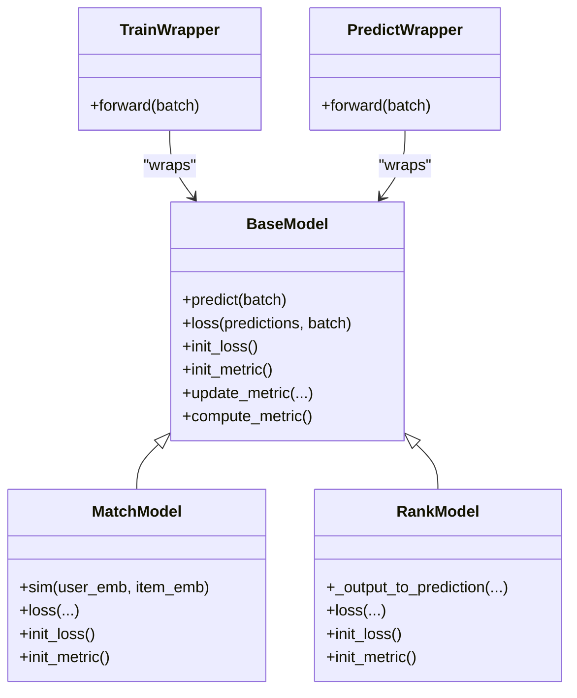
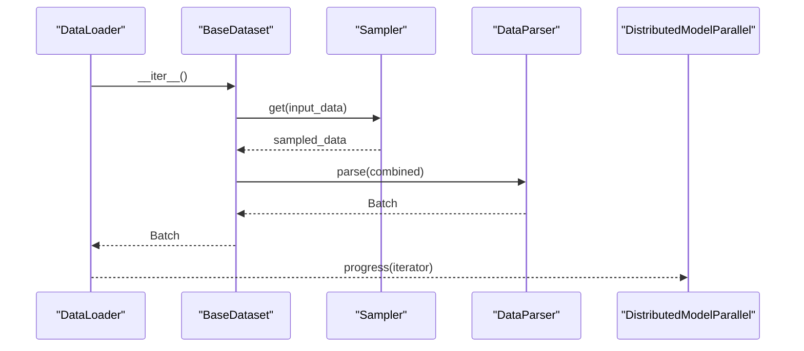
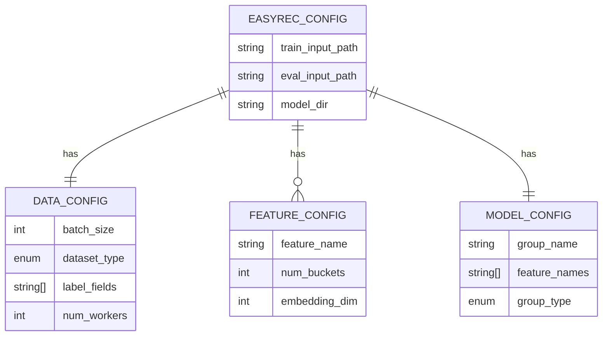
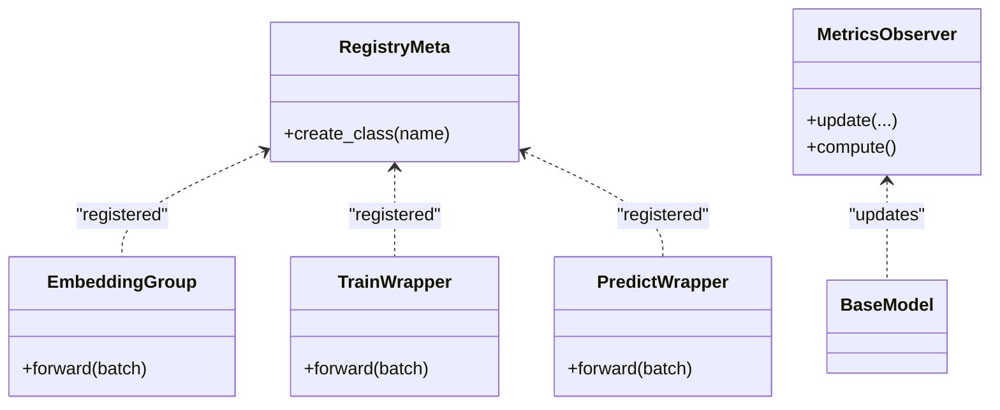
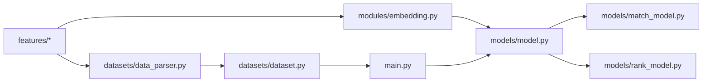

# Core Concepts and Architecture

<cite>
**Referenced Files in This Document**
- [README.md](file://README.md)
- [main.py](file://tzrec/main.py)
- [constant.py](file://tzrec/constant.py)
- [load_class.py](file://tzrec/utils/load_class.py)
- [feature.py](file://tzrec/features/feature.py)
- [model.py](file://tzrec/models/model.py)
- [match_model.py](file://tzrec/models/match_model.py)
- [rank_model.py](file://tzrec/models/rank_model.py)
- [dataset.py](file://tzrec/datasets/dataset.py)
- [data_parser.py](file://tzrec/datasets/data_parser.py)
- [embedding.py](file://tzrec/modules/embedding.py)
- [pipeline.proto](file://tzrec/protos/pipeline.proto)
- [deepfm_criteo.config](file://examples/deepfm_criteo.config)
</cite>

## Table of Contents

1. [Introduction](#introduction)
1. [Project Structure](#project-structure)
1. [Core Components](#core-components)
1. [Architecture Overview](#architecture-overview)
1. [Detailed Component Analysis](#detailed-component-analysis)
1. [Dependency Analysis](#dependency-analysis)
1. [Performance Considerations](#performance-considerations)
1. [Troubleshooting Guide](#troubleshooting-guide)
1. [Conclusion](#conclusion)

## Introduction

This document explains TorchEasyRec’s core concepts and architecture with a focus on:

- Distinction between candidate generation (matching) and scoring (ranking) tasks
- Modular architecture separating feature engineering, model implementation, data processing, and training infrastructure
- Factory pattern for model registration
- Feature processing pipeline and Protocol Buffers configuration system
- Architectural patterns: strategy for embedding approaches, wrapper for execution modes, observer for metrics
- Data flow from raw data to model training and inference
- Distributed training, memory management, and performance optimization strategies

## Project Structure

TorchEasyRec organizes functionality into cohesive modules:

- Features: feature definition, parsing, and embedding construction
- Models: model base classes, wrappers, and concrete model implementations
- Datasets: dataset abstractions, readers/writers, samplers, and batching
- Modules: embedding collections, sequence encoders, and auxiliary modules
- Protos: configuration schema for pipeline, data, features, models, and metrics
- Utils: class registration, configuration utilities, distributed training helpers

**Diagram sources**

- \[pipeline.proto\](file://tzrec/protos/pipeline.proto#L11-L29)
- \[main.py\](file://tzrec/main.py#L527-L734)
- \[dataset.py\](file://tzrec/datasets/dataset.py#L645-L732)
- \[data_parser.py\](file://tzrec/datasets/data_parser.py#L56-L177)
- \[feature.py\](file://tzrec/features/feature.py#L375-L800)
- \[embedding.py\](file://tzrec/modules/embedding.py#L139-L510)
- \[model.py\](file://tzrec/models/model.py#L39-L218)
- \[match_model.py\](file://tzrec/models/match_model.py#L225-L451)
- \[rank_model.py\](file://tzrec/models/rank_model.py#L56-L180)

**Section sources**

- \[README.md\](file://README.md#L1-L83)
- \[pipeline.proto\](file://tzrec/protos/pipeline.proto#L11-L29)
- \[main.py\](file://tzrec/main.py#L527-L734)

## Core Components

- Candidate generation (matching) vs scoring (ranking)
  - Matching focuses on efficient retrieval of candidate items via embeddings and similarity computation
  - Ranking focuses on precise score prediction and calibrated probabilities for downstream ranking
- Factory pattern for model registration
  - Classes register themselves via a registry metaclass; creation uses a factory method resolved by configuration
- Feature processing pipeline
  - From raw Arrow data to PyTorch tensors, with optional feature graph DAG execution
- Protocol Buffers configuration
  - Centralized schema for pipeline, data, features, models, and metrics

**Section sources**

- \[README.md\](file://README.md#L7-L10)
- \[load_class.py\](file://tzrec/utils/load_class.py#L117-L145)
- \[data_parser.py\](file://tzrec/datasets/data_parser.py#L56-L177)
- \[pipeline.proto\](file://tzrec/protos/pipeline.proto#L11-L29)

## Architecture Overview

The training/inference pipeline orchestrates configuration-driven data ingestion, feature transformation, model execution, and distributed training.

**Diagram sources**

- \[main.py\](file://tzrec/main.py#L527-L734)
- \[dataset.py\](file://tzrec/datasets/dataset.py#L645-L732)
- \[data_parser.py\](file://tzrec/datasets/data_parser.py#L178-L260)
- \[feature.py\](file://tzrec/features/feature.py#L788-L800)
- \[embedding.py\](file://tzrec/modules/embedding.py#L407-L496)
- \[model.py\](file://tzrec/models/model.py#L222-L346)

## Detailed Component Analysis

### Feature Engineering Pipeline

- Feature abstraction and parsing
  - BaseFeature defines feature interfaces, parsing logic, and embedding configurations
  - Supports sparse, dense, sequence, weighted, and grouped sequence features
- Data parsing and batching
  - DataParser converts Arrow inputs to PyTorch tensors and builds batches
  - Handles feature graph DAG execution, input tiling, and multi-value sequences
- Embedding groups
  - EmbeddingGroup composes per-feature embeddings into feature groups
  - Supports shared embeddings, managed collision modules, dense embeddings, and sequence encoders

**Diagram sources**

- \[data_parser.py\](file://tzrec/datasets/data_parser.py#L178-L260)
- \[feature.py\](file://tzrec/features/feature.py#L788-L800)
- \[embedding.py\](file://tzrec/modules/embedding.py#L407-L496)

**Section sources**

- \[feature.py\](file://tzrec/features/feature.py#L375-L800)
- \[data_parser.py\](file://tzrec/datasets/data_parser.py#L56-L177)
- \[embedding.py\](file://tzrec/modules/embedding.py#L139-L510)

### Model Implementation and Wrappers

- BaseModel and wrappers
  - BaseModel defines predict/loss/init_metric/update_metric contracts
  - TrainWrapper and PredictWrapper encapsulate mixed precision and forward passes
- Matching and ranking models
  - MatchModel implements similarity computation and recall metrics for retrieval
  - RankModel implements classification/regression losses and metrics for scoring

**Diagram sources**

- \[model.py\](file://tzrec/models/model.py#L39-L218)
- \[match_model.py\](file://tzrec/models/match_model.py#L225-L451)
- \[rank_model.py\](file://tzrec/models/rank_model.py#L56-L180)

**Section sources**

- \[model.py\](file://tzrec/models/model.py#L39-L218)
- \[match_model.py\](file://tzrec/models/match_model.py#L225-L451)
- \[rank_model.py\](file://tzrec/models/rank_model.py#L56-L180)

### Data Processing and Distributed Training

- Dataset and DataLoader
  - BaseDataset reads, optionally samples, parses, and yields batches
  - create_dataloader constructs dataset, launches samplers, and returns DataLoader
- Distributed training
  - Process groups initialization, distributed model parallel, optimizer wrappers, and pipeline progress orchestration

**Diagram sources**

- \[dataset.py\](file://tzrec/datasets/dataset.py#L309-L419)
- \[data_parser.py\](file://tzrec/datasets/data_parser.py#L385-L475)
- \[main.py\](file://tzrec/main.py#L390-L420)

**Section sources**

- \[dataset.py\](file://tzrec/datasets/dataset.py#L149-L419)
- \[main.py\](file://tzrec/main.py#L310-L525)

### Configuration System (Protocol Buffers)

- Schema-driven configuration
  - EasyRecConfig aggregates train/eval/export/data/feature/model configs
- Example configuration
  - Feature definitions, model groups, and training hyperparameters are specified declaratively

**Diagram sources**

- \[pipeline.proto\](file://tzrec/protos/pipeline.proto#L11-L29)
- \[deepfm_criteo.config\](file://examples/deepfm_criteo.config#L1-L397)

**Section sources**

- \[pipeline.proto\](file://tzrec/protos/pipeline.proto#L11-L29)
- \[deepfm_criteo.config\](file://examples/deepfm_criteo.config#L1-L397)

### Architectural Patterns

- Factory pattern for model registration
  - Registry metaclass registers subclasses; factory resolves class by name from configuration
- Strategy pattern for embedding approaches
  - EmbeddingGroup composes EmbeddingBagCollection, ManagedCollision modules, DenseEmbeddingCollection, and sequence encoders
- Wrapper pattern for execution modes
  - TrainWrapper/PredictWrapper encapsulate forward passes, mixed precision, and device placement
- Observer pattern for metrics
  - Metrics initialized per model; update/compute methods act as observers of predictions and labels

**Diagram sources**

- \[load_class.py\](file://tzrec/utils/load_class.py#L117-L145)
- \[embedding.py\](file://tzrec/modules/embedding.py#L139-L510)
- \[model.py\](file://tzrec/models/model.py#L222-L346)

**Section sources**

- \[load_class.py\](file://tzrec/utils/load_class.py#L117-L145)
- \[embedding.py\](file://tzrec/modules/embedding.py#L139-L510)
- \[model.py\](file://tzrec/models/model.py#L102-L138)

## Dependency Analysis

- Module coupling and cohesion
  - Features depend on Protobuf feature configs; DataParser depends on BaseFeature implementations
  - EmbeddingGroup depends on feature embedding configs; models depend on grouped features
  - Training pipeline depends on dataset, parser, features, models, and distributed utilities
- External dependencies
  - PyArrow for data I/O, TorchRec for embedding collections, TorchMetrics for metrics

**Diagram sources**

- \[feature.py\](file://tzrec/features/feature.py#L375-L800)
- \[data_parser.py\](file://tzrec/datasets/data_parser.py#L56-L177)
- \[dataset.py\](file://tzrec/datasets/dataset.py#L149-L419)
- \[embedding.py\](file://tzrec/modules/embedding.py#L139-L510)
- \[model.py\](file://tzrec/models/model.py#L39-L218)
- \[match_model.py\](file://tzrec/models/match_model.py#L225-L451)
- \[rank_model.py\](file://tzrec/models/rank_model.py#L56-L180)
- \[main.py\](file://tzrec/main.py#L527-L734)

**Section sources**

- \[main.py\](file://tzrec/main.py#L527-L734)
- \[dataset.py\](file://tzrec/datasets/dataset.py#L645-L732)
- \[model.py\](file://tzrec/models/model.py#L39-L218)

## Performance Considerations

- Mixed precision and autocast
  - TrainWrapper/PredictWrapper enable FP16/BF16 training/inference for speed/memory
- Distributed training
  - DistributedModelParallel, sharded optimizers, and pipeline progress reduce memory footprint and improve throughput
- Memory management
  - Embedding collections, managed collision modules, and input tiling strategies optimize memory usage
- Data pipeline
  - Arrow-based readers, batching, and sampler clusters minimize CPU/GPU idle time

[No sources needed since this section provides general guidance]

## Troubleshooting Guide

- Logging and environment
  - Environment variables control logging verbosity, OMP threads, determinism, and device selection
- Checkpointing and resuming
  - Latest checkpoint detection and restoration during training/inference
- Distributed synchronization
  - Barriers and rank checks ensure consistent model directory creation and worker synchronization

**Section sources**

- \[constant.py\](file://tzrec/constant.py#L16-L41)
- \[main.py\](file://tzrec/main.py#L592-L617)
- \[main.py\](file://tzrec/main.py#L707-L710)

## Conclusion

TorchEasyRec’s architecture cleanly separates concerns across feature engineering, model implementation, data processing, and training infrastructure. Its configuration-driven design, factory-based model registration, and modular embedding composition enable flexible, scalable recommendation systems. The pipeline integrates distributed training, memory-conscious embedding strategies, and comprehensive metrics collection to support both matching and ranking tasks efficiently.
