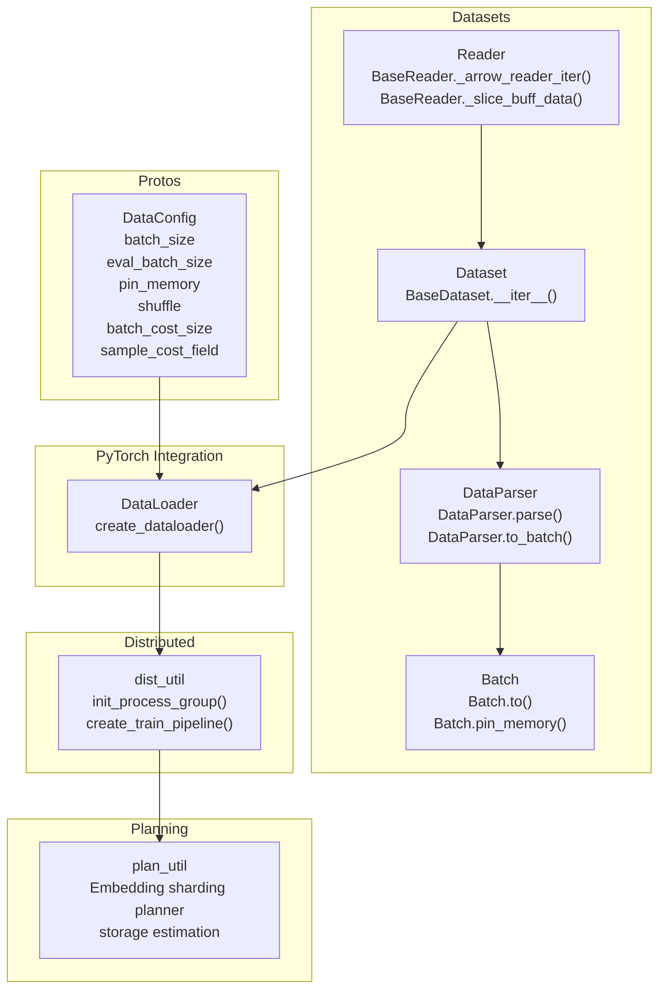
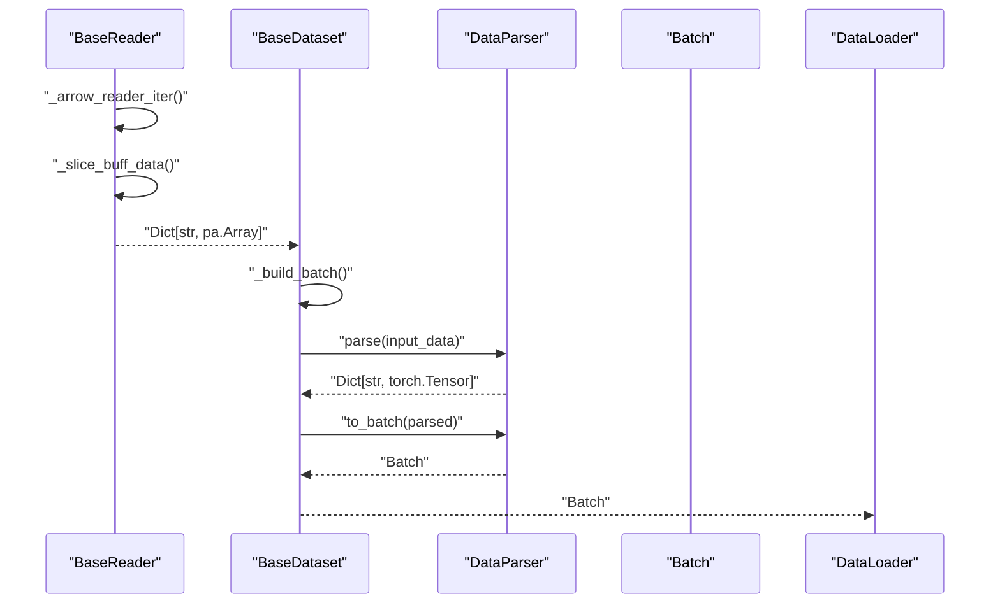
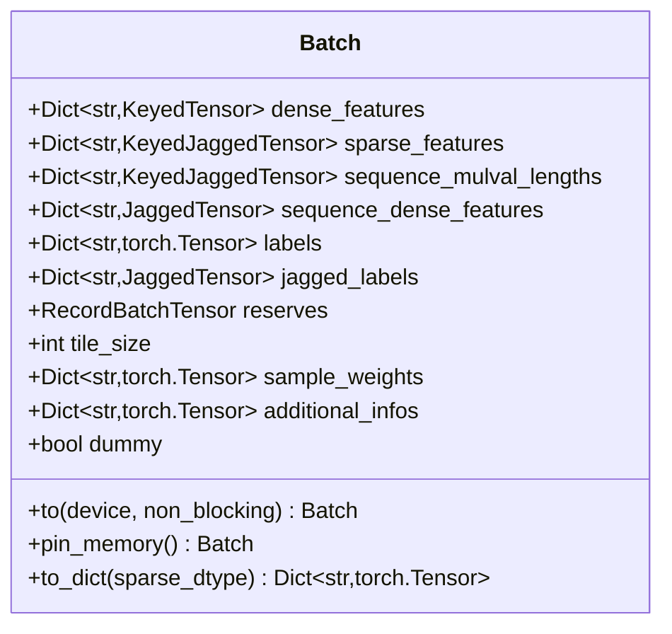
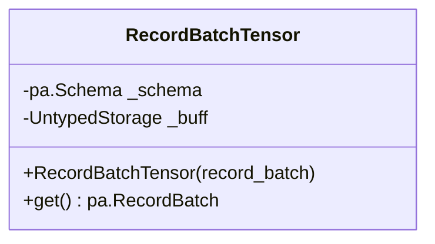
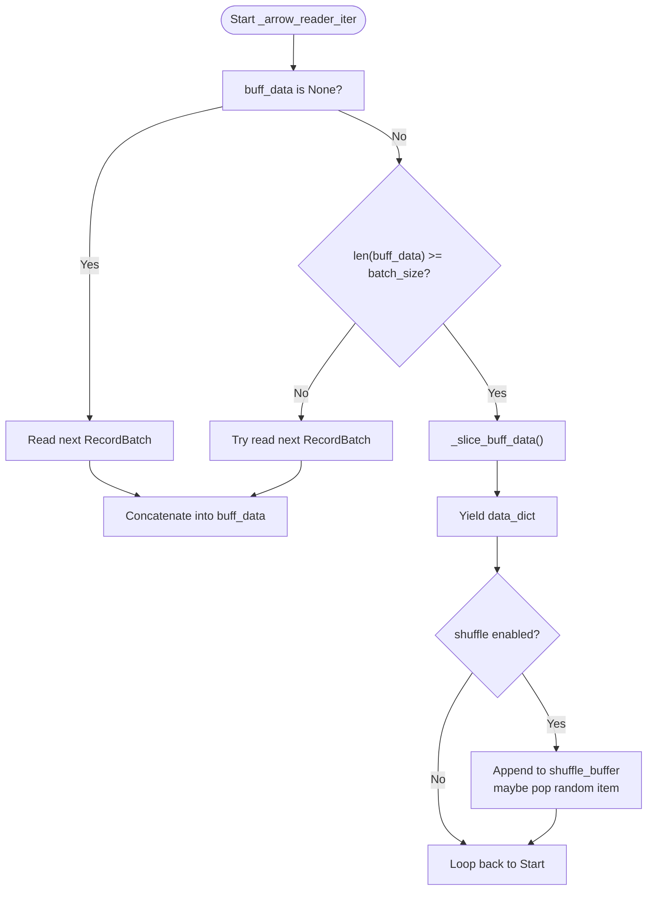
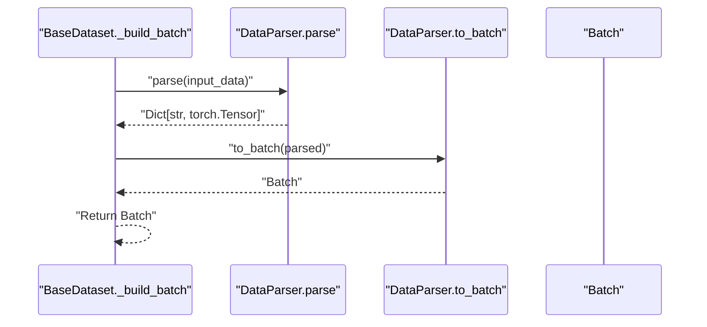
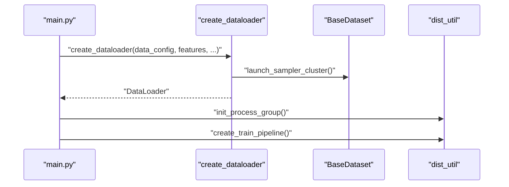
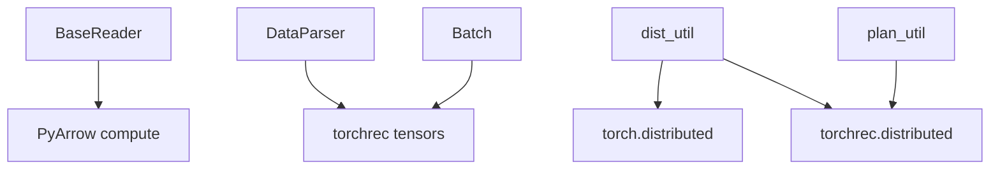

# Batch Processing and Memory Management

<cite>
**Referenced Files in This Document**
- [utils.py](file://tzrec/datasets/utils.py)
- [dataset.py](file://tzrec/datasets/dataset.py)
- [data_parser.py](file://tzrec/datasets/data_parser.py)
- [data.proto](file://tzrec/protos/data.proto)
- [dist_util.py](file://tzrec/utils/dist_util.py)
- [plan_util.py](file://tzrec/utils/plan_util.py)
- [logging_util.py](file://tzrec/utils/logging_util.py)
- [main.py](file://tzrec/main.py)
- [train_eval.py](file://tzrec/train_eval.py)
</cite>

## Table of Contents

1. [Introduction](#introduction)
1. [Project Structure](#project-structure)
1. [Core Components](#core-components)
1. [Architecture Overview](#architecture-overview)
1. [Detailed Component Analysis](#detailed-component-analysis)
1. [Dependency Analysis](#dependency-analysis)
1. [Performance Considerations](#performance-considerations)
1. [Troubleshooting Guide](#troubleshooting-guide)
1. [Conclusion](#conclusion)
1. [Appendices](#appendices)

## Introduction

This document explains TorchEasyRec’s batch processing and memory management system. It covers the Batch data structure, RecordBatchTensor, and the end-to-end pipeline from raw data to PyTorch tensors. It details batch construction, data aggregation strategies, memory-efficient handling of large datasets, different batch sizes for training, evaluation, and prediction, batch cost limiting via sample cost, and integration with PyTorch’s DataLoader and distributed training. Practical guidance is included for configuring batch processing, handling memory constraints, optimizing data loading performance, and troubleshooting memory-related issues.

## Project Structure

The batch processing and memory management system spans several modules:

- Datasets: data ingestion, batching, and conversion to Batch tensors
- Data parsing: feature parsing and aggregation into structured tensors
- Protos: configuration for batch sizes, pinning, shuffling, and cost-based batching
- Distributed utilities: process group initialization and training pipeline integration
- Planning utilities: memory-aware sharding and storage planning for large embeddings

**Diagram sources**

- \[dataset.py\](file://tzrec/datasets/dataset.py#L430-L550)
- \[data_parser.py\](file://tzrec/datasets/data_parser.py#L56-L260)
- \[utils.py\](file://tzrec/datasets/utils.py#L83-L267)
- \[data.proto\](file://tzrec/protos/data.proto#L43-L137)
- \[dist_util.py\](file://tzrec/utils/dist_util.py#L53-L71)
- \[plan_util.py\](file://tzrec/utils/plan_util.py#L770-L801)

**Section sources**

- \[dataset.py\](file://tzrec/datasets/dataset.py#L430-L550)
- \[data_parser.py\](file://tzrec/datasets/data_parser.py#L56-L260)
- \[utils.py\](file://tzrec/datasets/utils.py#L83-L267)
- \[data.proto\](file://tzrec/protos/data.proto#L43-L137)
- \[dist_util.py\](file://tzrec/utils/dist_util.py#L53-L71)
- \[plan_util.py\](file://tzrec/utils/plan_util.py#L770-L801)

## Core Components

- Batch: The primary in-memory representation of a training/evaluation/prediction batch. It groups dense, sparse, sequence-dense, labels, and auxiliary fields into PyTorch-compatible structures and supports device transfers and pinned memory.
- RecordBatchTensor: A wrapper around PyArrow RecordBatch serialized into a shared memory buffer, enabling efficient inter-process transfer.
- BaseReader: Implements buffered reading, optional shuffling, and cost-based slicing of batches using a sample cost field.
- DataParser: Converts parsed Arrow arrays into PyTorch tensors and aggregates them into Batch instances, supporting input tiling modes and weighted features.

Key capabilities:

- Device transfer and pinned memory for GPU throughput
- Aggregation of multi-value sequences and weighted sparse features
- Cost-aware batching to bound per-batch compute/memory costs
- Prediction-mode handling with reserved columns and optional debug dumps

**Section sources**

- \[utils.py\](file://tzrec/datasets/utils.py#L83-L267)
- \[dataset.py\](file://tzrec/datasets/dataset.py#L430-L550)
- \[data_parser.py\](file://tzrec/datasets/data_parser.py#L56-L260)

## Architecture Overview

The pipeline transforms raw data into a Batch tensor through a series of stages:

1. Reader reads Arrow RecordBatches, buffers and optionally shuffles them, slices by fixed batch size or cost.
1. Dataset builds batches by applying samplers (optional), then parsing features into tensors.
1. DataParser aggregates tensors into Batch with proper grouping and optional tiling for input tiling modes.
1. DataLoader yields Batch objects to the training loop; distributed utilities coordinate process groups and pipelines.

**Diagram sources**

- \[dataset.py\](file://tzrec/datasets/dataset.py#L502-L550)
- \[dataset.py\](file://tzrec/datasets/dataset.py#L482-L500)
- \[data_parser.py\](file://tzrec/datasets/data_parser.py#L178-L260)
- \[data_parser.py\](file://tzrec/datasets/data_parser.py#L385-L475)

## Detailed Component Analysis

### Batch Data Structure

Batch encapsulates all model inputs and labels:

- dense_features: KeyedTensor per data group
- sparse_features: KeyedJaggedTensor per data group
- sequence_mulval_lengths: KeyedJaggedTensor for multi-value sequence metadata
- sequence_dense_features: JaggedTensor for sequence dense features
- labels and jagged_labels: scalar or ragged labels
- reserves: RecordBatchTensor for reserved columns in prediction
- tile_size: optional tiling indicator for input tiling modes
- sample_weights and additional_infos: optional fields

Operations:

- to(device, non_blocking): move all tensors to a target device
- pin_memory(): pin underlying tensors for faster CPU-to-GPU transfers
- to_dict(): flatten to a dictionary of tensors for model consumption

**Diagram sources**

- \[utils.py\](file://tzrec/datasets/utils.py#L110-L316)

**Section sources**

- \[utils.py\](file://tzrec/datasets/utils.py#L110-L316)

### RecordBatchTensor

RecordBatchTensor serializes a PyArrow RecordBatch into a shared-memory buffer and reconstructs it on demand. This enables efficient inter-process transfer (e.g., via mp.Queue) without copying large payloads.

Key points:

- Serialization uses a shared UntypedStorage
- Reconstruction uses PyArrow IPC with a foreign buffer pointer
- Supports None for empty payloads

**Diagram sources**

- \[utils.py\](file://tzrec/datasets/utils.py#L83-L107)

**Section sources**

- \[utils.py\](file://tzrec/datasets/utils.py#L83-L107)

### BaseReader: Buffered Reading, Shuffling, and Cost-Based Batching

BaseReader manages:

- Buffered concatenation of incoming RecordBatches
- Optional in-memory shuffling with a buffer
- Slicing by fixed batch_size or cumulative sample cost

Cost-based batching:

- Requires sample_cost_field and batch_cost_size
- Computes cumulative sum of sample costs and slices up to the limit
- Falls back to fixed batch_size when disabled

**Diagram sources**

- \[dataset.py\](file://tzrec/datasets/dataset.py#L502-L550)
- \[dataset.py\](file://tzrec/datasets/dataset.py#L482-L500)

**Section sources**

- \[dataset.py\](file://tzrec/datasets/dataset.py#L430-L550)

### DataParser: Feature Parsing and Batch Construction

DataParser converts parsed Arrow arrays into PyTorch tensors and aggregates them into Batch:

- Normal vs DAG/Bucketize FG modes
- Label and sample weight parsing
- Aggregation into dense/sparse/sequence features
- Tiling logic for input tiling modes (INPUT_TILE=2/3)
- Weighted sparse features and multi-value sequence handling

**Diagram sources**

- \[data_parser.py\](file://tzrec/datasets/data_parser.py#L178-L260)
- \[data_parser.py\](file://tzrec/datasets/data_parser.py#L385-L475)

**Section sources**

- \[data_parser.py\](file://tzrec/datasets/data_parser.py#L56-L260)
- \[data_parser.py\](file://tzrec/datasets/data_parser.py#L385-L475)

### DataLoader Integration and Distributed Training

- create_dataloader constructs a DataLoader with dataset-specific workers and persistent workers
- Pinning is enabled for training and evaluation; disabled for prediction
- Sampler clusters are launched differently for training vs evaluation
- Distributed utilities initialize process groups and provide custom training pipelines

**Diagram sources**

- \[dataset.py\](file://tzrec/datasets/dataset.py#L645-L732)
- \[dist_util.py\](file://tzrec/utils/dist_util.py#L53-L71)
- \[dist_util.py\](file://tzrec/utils/dist_util.py#L304-L345)
- \[main.py\](file://tzrec/main.py#L619-L705)

**Section sources**

- \[dataset.py\](file://tzrec/datasets/dataset.py#L645-L732)
- \[dist_util.py\](file://tzrec/utils/dist_util.py#L53-L71)
- \[dist_util.py\](file://tzrec/utils/dist_util.py#L304-L345)
- \[main.py\](file://tzrec/main.py#L619-L705)

## Dependency Analysis

- BaseReader depends on PyArrow compute for cumulative sums and slicing
- DataParser depends on torchrec tensors (KeyedTensor, KeyedJaggedTensor, JaggedTensor)
- Batch depends on torchrec streamable Pipelineable interface
- Distributed utilities depend on torch.distributed and torchrec distributed modules
- Planning utilities depend on embedding sharding planner and storage estimators

**Diagram sources**

- \[dataset.py\](file://tzrec/datasets/dataset.py#L482-L500)
- \[data_parser.py\](file://tzrec/datasets/data_parser.py#L20-L35)
- \[utils.py\](file://tzrec/datasets/utils.py#L20-L21)
- \[dist_util.py\](file://tzrec/utils/dist_util.py#L18-L49)
- \[plan_util.py\](file://tzrec/utils/plan_util.py#L770-L801)

**Section sources**

- \[dataset.py\](file://tzrec/datasets/dataset.py#L482-L500)
- \[data_parser.py\](file://tzrec/datasets/data_parser.py#L20-L35)
- \[utils.py\](file://tzrec/datasets/utils.py#L20-L21)
- \[dist_util.py\](file://tzrec/utils/dist_util.py#L18-L49)
- \[plan_util.py\](file://tzrec/utils/plan_util.py#L770-L801)

## Performance Considerations

- Fixed vs cost-based batching:
  - Use batch_cost_size with sample_cost_field to cap per-batch compute/memory
  - Ensure sample_cost_field is present and numeric
- Pinning:
  - Enable pin_memory for training and evaluation to accelerate GPU transfers
  - Disable for prediction to reduce host memory pressure
- Shuffling:
  - Set shuffle_buffer_size to improve randomness at the cost of memory
- Worker sizing:
  - num_workers is bounded by number of files and WORLD_SIZE
  - Persistent workers reduce overhead across epochs
- Input tiling:
  - INPUT_TILE=2/3 affects how user/item features are tiled; impacts memory and compute
- Mixed precision and optimizer integration:
  - Mixed precision and gradient scaler are configured during training setup

[No sources needed since this section provides general guidance]

## Troubleshooting Guide

Common issues and remedies:

- CUDA out-of-memory during training:
  - Reduce batch_size or enable cost-based batching with sample_cost_field
  - Disable pin_memory for prediction or reduce num_workers
  - Verify sampler configuration does not inflate effective batch size
- Hangs in distributed training:
  - Ensure all workers have consistent data availability; the pipeline handles dummy batches when needed
  - Check WORLD_SIZE and file counts for validity
- Excessive host memory usage:
  - Disable pin_memory for prediction
  - Reduce shuffle_buffer_size
  - Use cost-based batching to lower peak memory
- Uneven batches causing hangs:
  - Drop remainder batches when appropriate
  - Consider input tiling modes to normalize shapes

**Section sources**

- \[dataset.py\](file://tzrec/datasets/dataset.py#L686-L701)
- \[dist_util.py\](file://tzrec/utils/dist_util.py#L243-L301)
- \[logging_util.py\](file://tzrec/utils/logging_util.py#L20-L46)

## Conclusion

TorchEasyRec’s batch processing system combines efficient Arrow-based buffering, cost-aware batching, and PyTorch-friendly tensor aggregation into a robust pipeline. Batch, RecordBatchTensor, and DataParser work together to minimize memory overhead and maximize throughput. DataLoader integration and distributed utilities enable scalable training and evaluation. By tuning batch size, cost limits, pinning, and workers, practitioners can achieve reliable performance on large datasets.

[No sources needed since this section summarizes without analyzing specific files]

## Appendices

### Configuration Reference: DataConfig

- batch_size: Mini batch size for training
- eval_batch_size: Mini batch size for evaluation
- pin_memory: Enable pinned memory for faster GPU transfers
- shuffle and shuffle_buffer_size: Enable and size in-memory shuffling
- sample_cost_field and batch_cost_size: Enable cost-based batching
- num_workers: Number of DataLoader workers
- drop_remainder: Drop last partial batches

**Section sources**

- \[data.proto\](file://tzrec/protos/data.proto#L43-L137)

### Practical Examples

- Configure cost-based batching:

  - Set sample_cost_field and batch_cost_size in DataConfig
  - Ensure the dataset includes a numeric sample cost column
  - Use BaseReader’s cumulative sum slicing to bound per-batch cost

- Handle memory constraints in prediction:

  - Disable pin_memory for prediction
  - Reduce num_workers or use smaller eval_batch_size
  - Optionally drop remainder batches

- Optimize data loading performance:

  - Increase num_workers up to the number of files divided by WORLD_SIZE
  - Enable shuffle with moderate shuffle_buffer_size
  - Use persistent workers to reduce epoch overhead

- Distributed training considerations:

  - Initialize process groups and create a training pipeline
  - Launch sampler clusters separately for training and evaluation
  - Monitor worker data availability to avoid hangs

**Section sources**

- \[dataset.py\](file://tzrec/datasets/dataset.py#L645-L732)
- \[dist_util.py\](file://tzrec/utils/dist_util.py#L53-L71)
- \[dist_util.py\](file://tzrec/utils/dist_util.py#L304-L345)
- \[main.py\](file://tzrec/main.py#L619-L705)
