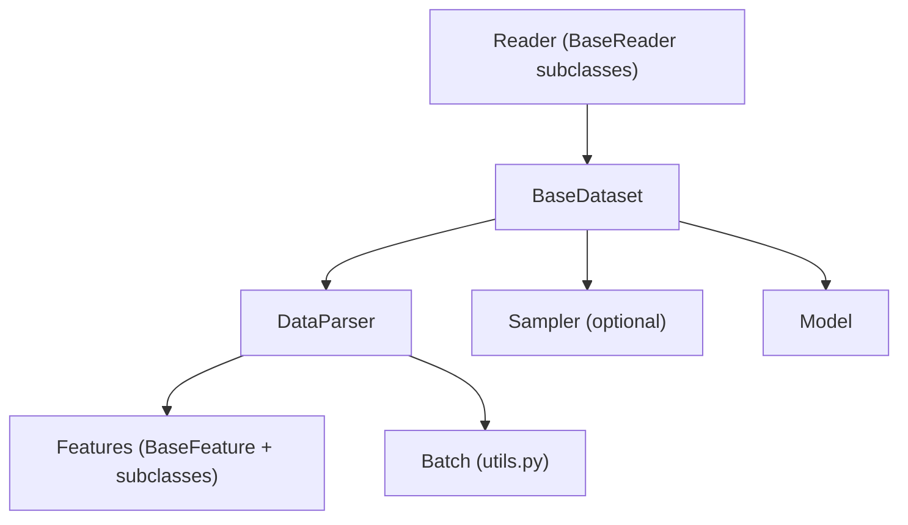
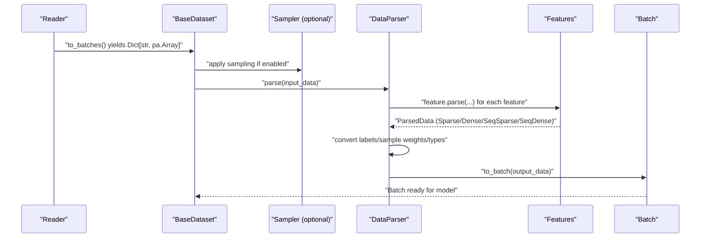
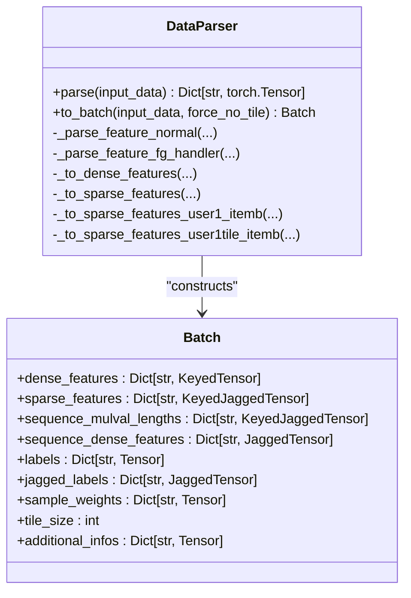
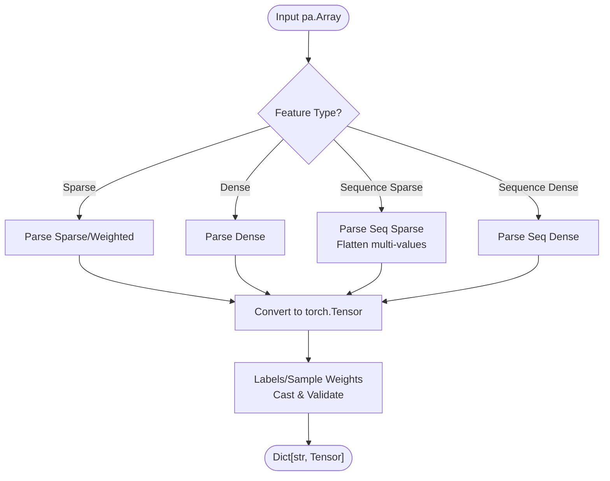
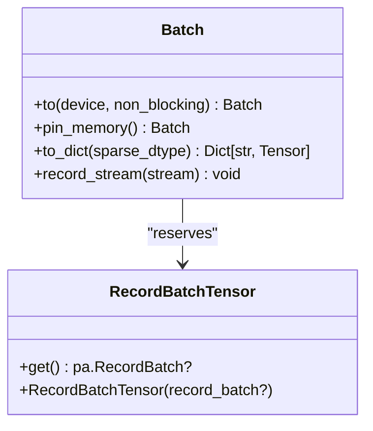
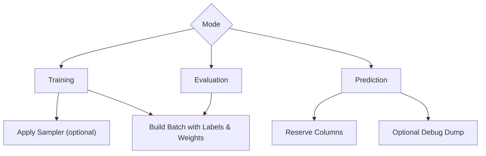
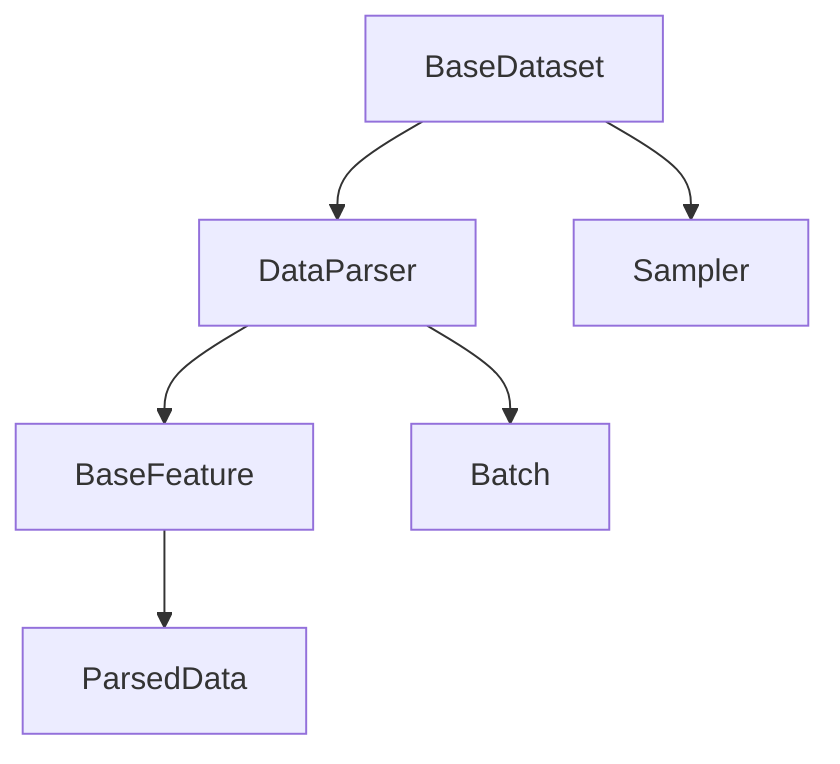

# Data Parsing and Transformation

<cite>
**Referenced Files in This Document**
- [data_parser.py](file://tzrec/datasets/data_parser.py)
- [utils.py](file://tzrec/datasets/utils.py)
- [dataset.py](file://tzrec/datasets/dataset.py)
- [feature.py](file://tzrec/features/feature.py)
- [id_feature.py](file://tzrec/features/id_feature.py)
- [raw_feature.py](file://tzrec/features/raw_feature.py)
- [data_parser_test.py](file://tzrec/datasets/data_parser_test.py)
- [deepfm_criteo.config](file://examples/deepfm_criteo.config)
- [faq.md](file://docs/source/faq.md)
</cite>

## Table of Contents

1. [Introduction](#introduction)
1. [Project Structure](#project-structure)
1. [Core Components](#core-components)
1. [Architecture Overview](#architecture-overview)
1. [Detailed Component Analysis](#detailed-component-analysis)
1. [Dependency Analysis](#dependency-analysis)
1. [Performance Considerations](#performance-considerations)
1. [Troubleshooting Guide](#troubleshooting-guide)
1. [Conclusion](#conclusion)
1. [Appendices](#appendices)

## Introduction

This document explains TorchEasyRec’s data parsing and transformation system with a focus on the DataParser class. It covers how raw data is ingested, transformed into PyArrow arrays, parsed into feature tensors, and assembled into model-ready batches. It also documents parsing modes (training, evaluation, prediction), feature encoding strategies (sparse, dense, sequence, weighted), data type conversions, and utility functions for batch processing and record batch handling. Practical examples demonstrate configuration, custom parsing logic, and performance optimization.

## Project Structure

The data parsing pipeline spans several modules:

- Dataset layer: BaseDataset orchestrates reading, optional sampling, and invokes DataParser.
- DataParser: Converts PyArrow arrays to tensors and builds Batch objects.
- Feature layer: BaseFeature and concrete features (IdFeature, RawFeature) define parsing logic for different feature types.
- Utilities: ParsedData containers, Batch, and helper functions for record batch serialization and slicing.

**Diagram sources**

- \[dataset.py\](file://tzrec/datasets/dataset.py#L149-L419)
- \[data_parser.py\](file://tzrec/datasets/data_parser.py#L56-L260)
- \[utils.py\](file://tzrec/datasets/utils.py#L110-L190)
- \[feature.py\](file://tzrec/features/feature.py#L375-L800)

**Section sources**

- \[dataset.py\](file://tzrec/datasets/dataset.py#L149-L419)
- \[data_parser.py\](file://tzrec/datasets/data_parser.py#L56-L260)
- \[utils.py\](file://tzrec/datasets/utils.py#L110-L190)
- \[feature.py\](file://tzrec/features/feature.py#L375-L800)

## Core Components

- DataParser: Central transformer that parses PyArrow arrays into tensors and constructs Batch objects. Supports normal feature parsing and PyArrow Graph (FG) DAG/bucketize modes via pyfg.
- ParsedData containers: SparseData, DenseData, SequenceSparseData, SequenceDenseData encapsulate parsed feature shapes and metadata.
- Batch: Unified container holding KeyedTensor dense features, KeyedJaggedTensor sparse features, JaggedTensor sequence dense features, labels, sample weights, and additional info.
- BaseFeature and subclasses: Define how features are parsed depending on fg_mode and feature type (sparse/dense, sequence, weighted).

Key responsibilities:

- Parse labels and sample weights with strict dtype checks.
- Convert sparse sequences with multi-value flattening and key-level lengths.
- Support input tiling for serving (INPUT_TILE modes) and user/item batch size separation.
- Build model-ready tensors for dense, sparse, and sequence features.

**Section sources**

- \[data_parser.py\](file://tzrec/datasets/data_parser.py#L56-L260)
- \[utils.py\](file://tzrec/datasets/utils.py#L43-L112)
- \[utils.py\](file://tzrec/datasets/utils.py#L110-L190)
- \[feature.py\](file://tzrec/features/feature.py#L788-L800)

## Architecture Overview

End-to-end flow from raw data to model-ready batch:

**Diagram sources**

- \[dataset.py\](file://tzrec/datasets/dataset.py#L309-L419)
- \[data_parser.py\](file://tzrec/datasets/data_parser.py#L178-L260)
- \[feature.py\](file://tzrec/features/feature.py#L788-L800)
- \[utils.py\](file://tzrec/datasets/utils.py#L110-L190)

## Detailed Component Analysis

### DataParser: Core Transformer

Responsibilities:

- Initialize feature groups (dense, sparse, sequence dense, multi-value sparse).
- Select input names for FG DAG/bucketize vs normal parsing.
- Parse labels and sample weights with explicit dtype casting.
- Build tensors for sparse sequences with flattened values and accumulated lengths.
- Support input tiling and user/item batch size separation for serving.

Parsing modes:

- Normal mode: Uses BaseFeature.parse to produce ParsedData, then converts to tensors.
- FG DAG/Bucketize mode: Uses pyfg.FgArrowHandler to transform inputs and outputs, then converts to tensors.

Batch construction:

- Dense: Concatenates per-key values into KeyedTensor.
- Sparse: Concatenates values/lengths/weights into KeyedJaggedTensor; supports multi-value sequence key-lengths.
- Sequence dense: Builds JaggedTensor from values and lengths.
- Labels and sample weights: Direct tensor conversion with dtype checks.

**Diagram sources**

- \[data_parser.py\](file://tzrec/datasets/data_parser.py#L56-L260)
- \[utils.py\](file://tzrec/datasets/utils.py#L110-L190)

**Section sources**

- \[data_parser.py\](file://tzrec/datasets/data_parser.py#L56-L260)
- \[data_parser.py\](file://tzrec/datasets/data_parser.py#L385-L475)
- \[utils.py\](file://tzrec/datasets/utils.py#L110-L190)

### Feature Encoding Strategies and Data Type Conversions

Feature parsing depends on fg_mode and feature type:

- FG_NONE: Encoded strings/lists/maps are decoded into arrays and lengths; supports weighted sparse features.
- FG_NORMAL/FG_DAG: Uses pyfg for transformations; DataParser maps inputs/outputs accordingly.
- Weighted sparse: Values and weights are separated during parsing.
- Sequence features: Multi-value sequences are flattened; key-level lengths are accumulated to per-sequence lengths.

Data type conversions:

- Labels: int/float or list<int>/list<float> with offsets; cast to float32/int64 as appropriate.
- Sample weights: float32 required.
- Dense features: float32; integer scalars promoted to vectors.
- Sparse features: int64 for ids; lengths computed from offsets.

**Diagram sources**

- \[data_parser.py\](file://tzrec/datasets/data_parser.py#L178-L260)
- \[feature.py\](file://tzrec/features/feature.py#L75-L162)
- \[feature.py\](file://tzrec/features/feature.py#L164-L210)
- \[feature.py\](file://tzrec/features/feature.py#L212-L274)
- \[feature.py\](file://tzrec/features/feature.py#L276-L339)

**Section sources**

- \[feature.py\](file://tzrec/features/feature.py#L75-L162)
- \[feature.py\](file://tzrec/features/feature.py#L164-L210)
- \[feature.py\](file://tzrec/features/feature.py#L212-L274)
- \[feature.py\](file://tzrec/features/feature.py#L276-L339)
- \[data_parser.py\](file://tzrec/datasets/data_parser.py#L209-L255)

### Utility Functions for Batch Processing and Record Batch Handling

- Batch: Container with to(), pin_memory(), to_dict(), and stream recording for GPU transfers.
- RecordBatchTensor: Efficient IPC transport of PyArrow RecordBatch using torch.UntypedStorage.
- Helper functions: process_hstu_seq_data, process_hstu_neg_sample, calc_slice_position, remove_nullable.

**Diagram sources**

- \[utils.py\](file://tzrec/datasets/utils.py#L110-L190)
- \[utils.py\](file://tzrec/datasets/utils.py#L83-L108)

**Section sources**

- \[utils.py\](file://tzrec/datasets/utils.py#L110-L190)
- \[utils.py\](file://tzrec/datasets/utils.py#L83-L108)
- \[utils.py\](file://tzrec/datasets/utils.py#L319-L394)
- \[utils.py\](file://tzrec/datasets/utils.py#L444-L501)
- \[utils.py\](file://tzrec/datasets/utils.py#L503-L517)

### Implementation of Different Parsing Modes

- Training: Enables negative sampling masks, applies sampler, and builds batches with labels and sample weights.
- Evaluation: Similar to training but without negative sampling masks; labels required.
- Prediction: No labels or sample weights; preserves reserved columns; supports debug dumping.

**Diagram sources**

- \[dataset.py\](file://tzrec/datasets/dataset.py#L317-L419)

**Section sources**

- \[dataset.py\](file://tzrec/datasets/dataset.py#L317-L419)

### Practical Examples

#### Configuring Data Parsers

- Configure fg_mode, batch_size, label_fields, sample_weight_fields, and num_workers in data_config.
- Example configuration demonstrates raw and id features with categorical buckets and embeddings.

**Section sources**

- \[deepfm_criteo.config\](file://examples/deepfm_criteo.config#L24-L30)
- \[deepfm_criteo.config\](file://examples/deepfm_criteo.config#L31-L278)

#### Handling Different Data Types

- Sparse weighted ids: map\<int,float> or "k:v sep" strings; weights extracted and validated.
- Dense sequences: list<float> or list\<list<float>> flattened and shaped.
- Labels: int32/int64 or list<int>/list<float> with offsets.

**Section sources**

- \[data_parser_test.py\](file://tzrec/datasets/data_parser_test.py#L36-L124)
- \[data_parser_test.py\](file://tzrec/datasets/data_parser_test.py#L156-L291)
- \[data_parser_test.py\](file://tzrec/datasets/data_parser_test.py#L463-L596)

#### Implementing Custom Parsing Logic

- Extend BaseFeature and override parse to implement custom decoding for new feature types.
- For FG_NONE, use helper functions to decode strings/lists/maps into arrays and lengths.

**Section sources**

- \[feature.py\](file://tzrec/features/feature.py#L777-L800)
- \[feature.py\](file://tzrec/features/feature.py#L75-L162)
- \[feature.py\](file://tzrec/features/feature.py#L164-L210)
- \[feature.py\](file://tzrec/features/feature.py#L212-L274)
- \[feature.py\](file://tzrec/features/feature.py#L276-L339)

#### Optimizing Parsing Performance

- Use FG_DAG for graph-based transformations to reduce Python overhead.
- Enable batching and pin_memory for training; disable for prediction.
- Control num_workers and batch_size to balance throughput and memory.
- Use force_base_data_group to pad batches for consistent shapes when needed.

**Section sources**

- \[dataset.py\](file://tzrec/datasets/dataset.py#L645-L732)
- \[dataset.py\](file://tzrec/datasets/dataset.py#L231-L234)
- \[data_parser.py\](file://tzrec/datasets/data_parser.py#L267-L270)

## Dependency Analysis

Key dependencies and relationships:

- DataParser depends on BaseFeature implementations and pyfg for FG modes.
- BaseDataset composes DataParser and optional Sampler; integrates with Readers.
- Batch aggregates tensors from DataParser outputs.

**Diagram sources**

- \[dataset.py\](file://tzrec/datasets/dataset.py#L149-L419)
- \[data_parser.py\](file://tzrec/datasets/data_parser.py#L56-L260)
- \[utils.py\](file://tzrec/datasets/utils.py#L43-L112)
- \[feature.py\](file://tzrec/features/feature.py#L375-L800)

**Section sources**

- \[dataset.py\](file://tzrec/datasets/dataset.py#L149-L419)
- \[data_parser.py\](file://tzrec/datasets/data_parser.py#L56-L260)
- \[utils.py\](file://tzrec/datasets/utils.py#L43-L112)
- \[feature.py\](file://tzrec/features/feature.py#L375-L800)

## Performance Considerations

- FG_DAG mode reduces Python-side parsing overhead by leveraging compiled graph transformations.
- Pinning memory for batches can accelerate GPU transfers during training.
- Proper batching and worker configuration improve throughput; ensure dataset files exceed world size for multi-GPU runs.
- For sequence features, multi-value flattening and segment reductions are performed efficiently using torch.segment_reduce.

[No sources needed since this section provides general guidance]

## Troubleshooting Guide

Common issues and resolutions:

- ArrowInvalid parsing errors when casting strings to numeric types; ensure data is clean and defaults are applied where needed.
- Unsupported dtype errors: verify input schema matches supported PyArrow types and feature configurations.
- Memory and device placement: use Batch.to() and pin_memory() appropriately for training vs prediction.

**Section sources**

- \[faq.md\](file://docs/source/faq.md#L201-L230)
- \[dataset.py\](file://tzrec/datasets/dataset.py#L270-L282)

## Conclusion

The DataParser is the backbone of TorchEasyRec’s data transformation pipeline. It seamlessly handles diverse feature encodings, labels, and sample weights, and produces model-ready batches optimized for dense, sparse, and sequence features. By leveraging FG modes, batching strategies, and careful dtype handling, it enables scalable and robust training and inference workflows.

[No sources needed since this section summarizes without analyzing specific files]

## Appendices

### Appendix A: Feature Classes Overview

- IdFeature: Sparse id feature with optional weighting and hashing/vocabulary-backed embedding sizes.
- RawFeature: Dense feature supporting bucketization boundaries and optional dense embeddings.

**Section sources**

- \[id_feature.py\](file://tzrec/features/id_feature.py#L22-L87)
- \[raw_feature.py\](file://tzrec/features/raw_feature.py#L20-L60)
