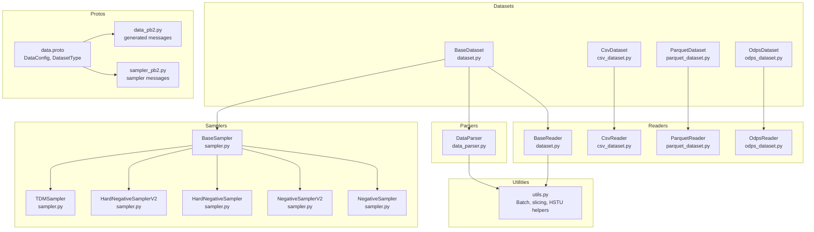
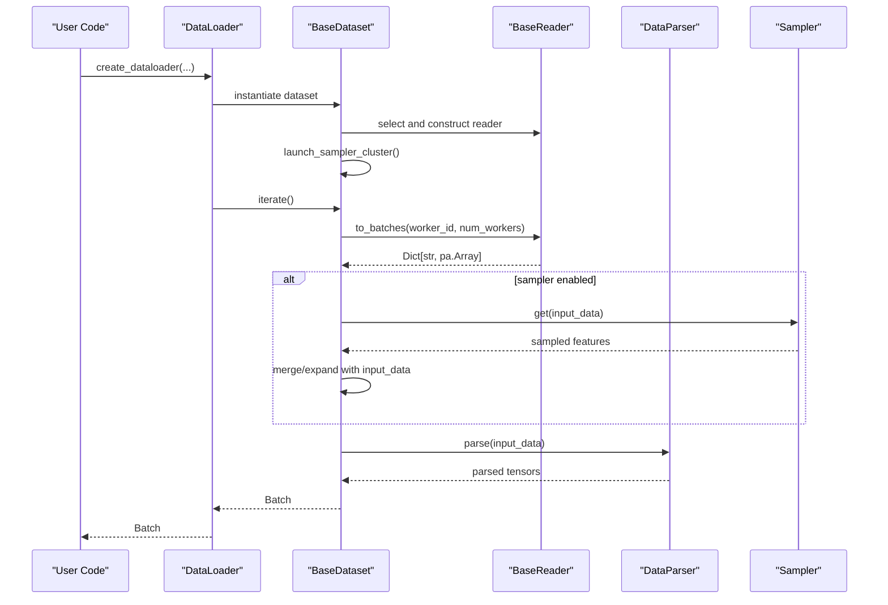
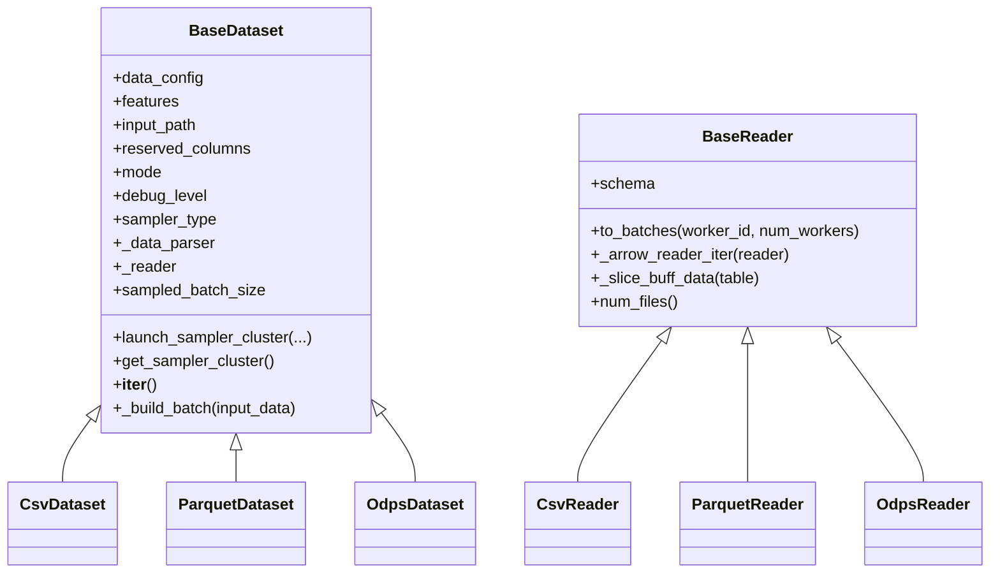
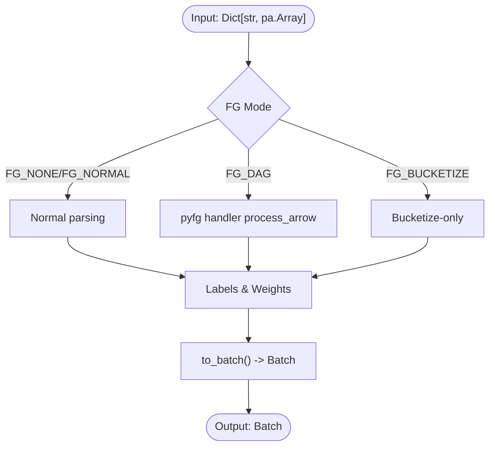
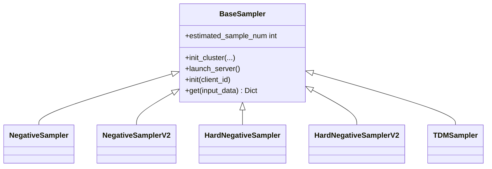
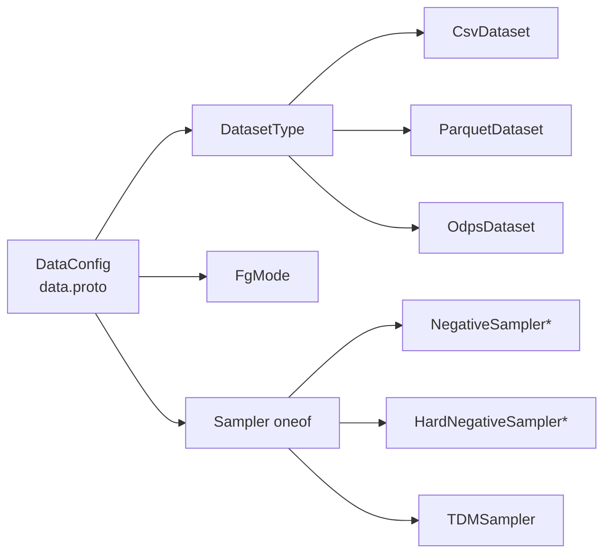

# Data Processing System

<cite>
**Referenced Files in This Document**
- [dataset.py](file://tzrec/datasets/dataset.py)
- [csv_dataset.py](file://tzrec/datasets/csv_dataset.py)
- [parquet_dataset.py](file://tzrec/datasets/parquet_dataset.py)
- [odps_dataset.py](file://tzrec/datasets/odps_dataset.py)
- [data_parser.py](file://tzrec/datasets/data_parser.py)
- [sampler.py](file://tzrec/datasets/sampler.py)
- [utils.py](file://tzrec/datasets/utils.py)
- [data.proto](file://tzrec/protos/data.proto)
- [data_pb2.py](file://tzrec/protos/data_pb2.py)
- [sampler_pb2.py](file://tzrec/protos/sampler_pb2.py)
- [dataset_test.py](file://tzrec/datasets/dataset_test.py)
</cite>

## Table of Contents

1. [Introduction](#introduction)
1. [Project Structure](#project-structure)
1. [Core Components](#core-components)
1. [Architecture Overview](#architecture-overview)
1. [Detailed Component Analysis](#detailed-component-analysis)
1. [Dependency Analysis](#dependency-analysis)
1. [Performance Considerations](#performance-considerations)
1. [Troubleshooting Guide](#troubleshooting-guide)
1. [Conclusion](#conclusion)
1. [Appendices](#appendices)

## Introduction

This document describes TorchEasyRec’s data processing system, focusing on the end-to-end pipeline from raw data sources to batches suitable for training and evaluation. It covers:

- Dataset readers for CSV, Parquet, and MaxCompute (ODPS)
- Data parsing and transformation utilities
- Sampling strategies for training and evaluation
- Data loading architecture, batch processing, and memory optimization
- Implementation of dataset types, configuration options, and integration with the training pipeline
- Practical examples for configuring data sources, handling different formats, implementing custom samplers, and optimizing performance
- Preprocessing workflows, feature encoding strategies, and handling large-scale datasets
- Guidance on data validation, quality checks, and troubleshooting common pipeline issues

## Project Structure

The data processing system is organized around a shared dataset abstraction with specialized readers for each data source, a unified data parser, and a suite of samplers. Supporting utilities provide batching, memory optimization, and HSTU-specific transformations.

**Diagram sources**

- \[dataset.py\](file://tzrec/datasets/dataset.py#L149-L428)
- \[csv_dataset.py\](file://tzrec/datasets/csv_dataset.py#L31-L166)
- \[parquet_dataset.py\](file://tzrec/datasets/parquet_dataset.py#L98-L261)
- \[odps_dataset.py\](file://tzrec/datasets/odps_dataset.py#L302-L496)
- \[data_parser.py\](file://tzrec/datasets/data_parser.py#L56-L260)
- \[sampler.py\](file://tzrec/datasets/sampler.py#L219-L394)
- \[utils.py\](file://tzrec/datasets/utils.py#L110-L316)
- \[data.proto\](file://tzrec/protos/data.proto#L6-L137)
- \[data_pb2.py\](file://tzrec/protos/data_pb2.py)
- \[sampler_pb2.py\](file://tzrec/protos/sampler_pb2.py)

**Section sources**

- \[dataset.py\](file://tzrec/datasets/dataset.py#L149-L428)
- \[csv_dataset.py\](file://tzrec/datasets/csv_dataset.py#L31-L166)
- \[parquet_dataset.py\](file://tzrec/datasets/parquet_dataset.py#L98-L261)
- \[odps_dataset.py\](file://tzrec/datasets/odps_dataset.py#L302-L496)
- \[data_parser.py\](file://tzrec/datasets/data_parser.py#L56-L260)
- \[sampler.py\](file://tzrec/datasets/sampler.py#L219-L394)
- \[utils.py\](file://tzrec/datasets/utils.py#L110-L316)
- \[data.proto\](file://tzrec/protos/data.proto#L6-L137)

## Core Components

- BaseDataset: Orchestrates reading, sampling, and parsing into a unified Batch structure. Handles worker distribution, sampler lifecycle, and batch sizing.
- BaseReader: Provides a common interface for reading batches, including shuffling, cost-aware batching, and worker slicing.
- DataParser: Converts PyArrow arrays into PyTorch tensors and Keyed/Jagged tensors, supporting dense, sparse, sequence dense, and sequence multi-value sparse features.
- Samplers: Implement negative sampling, hard negative sampling, and TDM hierarchical sampling using GraphLearn clusters.
- Utilities: Define Batch, RecordBatchTensor, HSTU sequence processing helpers, and row-slice calculation for balanced distribution.

Key responsibilities:

- Reader selection and instantiation based on input path or explicit type
- Feature generation modes (FG_NONE, FG_NORMAL, FG_DAG, FG_BUCKETIZE)
- Sample masking and cost-aware batching
- Distributed worker assignment and sampler cluster bootstrap

**Section sources**

- \[dataset.py\](file://tzrec/datasets/dataset.py#L149-L428)
- \[data_parser.py\](file://tzrec/datasets/data_parser.py#L56-L260)
- \[sampler.py\](file://tzrec/datasets/sampler.py#L219-L394)
- \[utils.py\](file://tzrec/datasets/utils.py#L110-L316)

## Architecture Overview

The data pipeline follows a layered design:

- Dataset layer selects the appropriate Reader based on input path and configuration.
- Reader reads raw batches, optionally shuffles and slices by cost or row ranges.
- Sampler enriches batches with negative or hard negative samples or expands for TDM.
- DataParser transforms PyArrow arrays into tensors and keyed structures.
- DataLoader yields Batch objects to the training loop.

**Diagram sources**

- \[dataset.py\](file://tzrec/datasets/dataset.py#L645-L732)
- \[dataset.py\](file://tzrec/datasets/dataset.py#L309-L419)
- \[data_parser.py\](file://tzrec/datasets/data_parser.py#L178-L260)
- \[sampler.py\](file://tzrec/datasets/sampler.py#L302-L324)

## Detailed Component Analysis

### Dataset Layer and Reader Selection

- BaseDataset initializes DataParser, selects input fields, sets batch sizes, and manages sampler lifecycle.
- create_reader infers reader type from input path (CSV, Parquet, ODPS) or via explicit type.
- create_dataloader constructs dataset, launches sampler cluster, and returns a DataLoader configured for workers and pinning.

**Diagram sources**

- \[dataset.py\](file://tzrec/datasets/dataset.py#L149-L428)
- \[csv_dataset.py\](file://tzrec/datasets/csv_dataset.py#L31-L166)
- \[parquet_dataset.py\](file://tzrec/datasets/parquet_dataset.py#L98-L261)
- \[odps_dataset.py\](file://tzrec/datasets/odps_dataset.py#L302-L496)

**Section sources**

- \[dataset.py\](file://tzrec/datasets/dataset.py#L581-L642)
- \[dataset.py\](file://tzrec/datasets/dataset.py#L645-L732)
- \[csv_dataset.py\](file://tzrec/datasets/csv_dataset.py#L31-L166)
- \[parquet_dataset.py\](file://tzrec/datasets/parquet_dataset.py#L98-L261)
- \[odps_dataset.py\](file://tzrec/datasets/odps_dataset.py#L302-L496)

### CSV Reader

- Supports CSV with optional header, custom delimiter, and explicit column types.
- Uses PyArrow Dataset CSV format, supports sharding per worker and block size tuning.
- Selects ordered columns if provided; validates schema against supported types.

Practical tips:

- Set with_header=false and input_fields with explicit FieldType for null-only columns.
- Use delimiter and column_types to align with schema.

**Section sources**

- \[csv_dataset.py\](file://tzrec/datasets/csv_dataset.py#L78-L166)

### Parquet Reader

- Reads Parquet files with optional rebalancing across workers to avoid skew.
- Calculates slice positions to distribute rows evenly; can drop redundant single-row batches to prevent deadlocks.
- Supports column selection and preserves schema.

Practical tips:

- Enable rebalance for large skewed datasets.
- Use batch_cost_size with sample_cost_field for throughput-driven batching.

**Section sources**

- \[parquet_dataset.py\](file://tzrec/datasets/parquet_dataset.py#L130-L261)
- \[utils.py\](file://tzrec/datasets/utils.py#L444-L500)

### ODPS (MaxCompute) Reader

- Connects to MaxCompute via Storage API Arrow client.
- Parses table path, initializes sessions per partition, and refreshes sessions periodically.
- Supports compression, ordering by partition, and quota names.

Practical tips:

- Configure ODPS credentials via environment or config file.
- Use is_orderby_partition for predictable scans; adjust compression for bandwidth vs CPU trade-offs.

**Section sources**

- \[odps_dataset.py\](file://tzrec/datasets/odps_dataset.py#L335-L496)
- \[odps_dataset.py\](file://tzrec/datasets/odps_dataset.py#L114-L178)

### Data Parsing and Transformation

- DataParser builds dense, sparse, sequence dense, and sequence multi-value sparse features.
- Supports FG modes: FG_NONE (no FG), FG_NORMAL (Python), FG_DAG (pyfg), FG_BUCKETIZE (bucketize-only).
- Converts labels and sample weights; handles ragged labels and hard negative indices.

**Diagram sources**

- \[data_parser.py\](file://tzrec/datasets/data_parser.py#L178-L260)
- \[data_parser.py\](file://tzrec/datasets/data_parser.py#L385-L475)

**Section sources**

- \[data_parser.py\](file://tzrec/datasets/data_parser.py#L56-L260)
- \[data_parser.py\](file://tzrec/datasets/data_parser.py#L385-L475)

### Sampling Strategies

- NegativeSampler/NegativeSamplerV2: weighted negative sampling from item/user graphs.
- HardNegativeSampler/HardNegativeSamplerV2: combines random negatives with hard negatives from edges.
- TDMSampler: hierarchical sampling along tree levels for training with TDM.

**Diagram sources**

- \[sampler.py\](file://tzrec/datasets/sampler.py#L219-L394)
- \[sampler.py\](file://tzrec/datasets/sampler.py#L397-L553)
- \[sampler.py\](file://tzrec/datasets/sampler.py#L555-L751)
- \[sampler.py\](file://tzrec/datasets/sampler.py#L753-L860)

**Section sources**

- \[sampler.py\](file://tzrec/datasets/sampler.py#L219-L394)
- \[sampler.py\](file://tzrec/datasets/sampler.py#L397-L553)
- \[sampler.py\](file://tzrec/datasets/sampler.py#L555-L751)
- \[sampler.py\](file://tzrec/datasets/sampler.py#L753-L860)

### Batch Processing and Memory Optimization

- Batch: Unified container holding dense, sparse, sequence features, labels, sample weights, and additional info.
- RecordBatchTensor: Efficient IPC-compatible serialization for inter-process transfers.
- Pinning and device movement: Batch supports pin_memory and to(device) for GPU transfer.
- Cost-aware batching: BaseReader slices by cost or fixed batch size to balance throughput and latency.

**Section sources**

- \[utils.py\](file://tzrec/datasets/utils.py#L110-L316)
- \[utils.py\](file://tzrec/datasets/utils.py#L83-L108)
- \[dataset.py\](file://tzrec/datasets/dataset.py#L476-L550)

### HSTU-Specific Processing

- process_hstu_seq_data: Splits sequences, extracts targets for autoregressive training, and reconstructs training sequences.
- process_hstu_neg_sample: Concatenates negative samples with training sequences for HSTU models.

**Section sources**

- \[utils.py\](file://tzrec/datasets/utils.py#L319-L442)

## Dependency Analysis

- DatasetType in protos defines supported dataset implementations.
- DataConfig drives reader selection, feature generation mode, shuffling, masking, and sampler configuration.
- Sampler configuration is embedded in DataConfig via oneof fields.

**Diagram sources**

- \[data.proto\](file://tzrec/protos/data.proto#L6-L137)
- \[data_pb2.py\](file://tzrec/protos/data_pb2.py)
- \[sampler_pb2.py\](file://tzrec/protos/sampler_pb2.py)

**Section sources**

- \[data.proto\](file://tzrec/protos/data.proto#L6-L137)

## Performance Considerations

- Worker distribution: DataLoader num_workers is validated against available files/partitions to avoid oversubscription.
- Shuffle buffers: Configurable buffer size improves randomness; consider pre-shuffling large datasets.
- Cost-aware batching: Use sample_cost_field and batch_cost_size to balance throughput across heterogeneous rows.
- Rebalancing: ParquetReader can rebalance rows across workers to mitigate skew.
- Pinning: pin_memory reduces CPU-to-GPU copy overhead during training.
- FG modes: Choose FG_DAG for high-throughput feature generation; tune fg_threads accordingly.
- Compression: ODPS supports LZ4_FRAME/ZSTD; choose based on CPU vs network constraints.

[No sources needed since this section provides general guidance]

## Troubleshooting Guide

Common issues and resolutions:

- Unsupported column types: Ensure schema matches supported PyArrow types; BaseDataset validates types against AVAILABLE_PA_TYPES.
- No CSV files found: Verify glob expansion of input_path; CsvReader raises runtime error if no files match.
- ODPS credentials missing: Provide ODPS_CONFIG_FILE_PATH or environment variables; \_create_odps_account parses config or uses credentials provider.
- Session expiration: OdpsReader spawns a daemon to refresh sessions; ensure rank 0 availability.
- Deadlocks on single-row batches: ParquetReader can drop redundant bs==1 batches to prevent hangs.
- Sampler initialization: Ensure sampler cluster is launched before iteration; BaseDataset handles this automatically.

**Section sources**

- \[dataset.py\](file://tzrec/datasets/dataset.py#L270-L282)
- \[csv_dataset.py\](file://tzrec/datasets/csv_dataset.py#L126-L131)
- \[odps_dataset.py\](file://tzrec/datasets/odps_dataset.py#L138-L178)
- \[parquet_dataset.py\](file://tzrec/datasets/parquet_dataset.py#L240-L251)

## Conclusion

TorchEasyRec’s data processing system provides a robust, scalable pipeline for training and evaluation across CSV, Parquet, and MaxCompute sources. Its modular design enables flexible feature generation, efficient batching, and powerful sampling strategies. By leveraging cost-aware batching, worker rebalancing, and optimized parsers, it supports large-scale training with strong performance characteristics.

[No sources needed since this section summarizes without analyzing specific files]

## Appendices

### Practical Configuration Examples

- CSV dataset with explicit types and header handling:
  - Set dataset_type=CsvDataset, with_header=false, input_fields with FieldType entries, delimiter, and column_types.
- Parquet dataset with rebalancing and cost-aware batching:
  - Enable rebalance, set sample_cost_field and batch_cost_size; optionally drop_redundant_bs_eq_one.
- ODPS dataset with compression and partition ordering:
  - Set is_orderby_partition=true, odps_data_compression, and quota name; ensure credentials are configured.
- Feature generation modes:
  - FG_NONE for pre-encoded features; FG_NORMAL for Python-based FG; FG_DAG/pyfg for high-performance DAG; FG_BUCKETIZE for bucketization-only.
- Sampling configuration:
  - Choose NegativeSampler/NegativeSamplerV2/HardNegativeSampler/HardNegativeSamplerV2/ TDMSampler via DataConfig sampler oneof.

Validation and testing:

- Use dataset_test patterns to validate batch shapes and feature groups.

**Section sources**

- \[data.proto\](file://tzrec/protos/data.proto#L43-L137)
- \[csv_dataset.py\](file://tzrec/datasets/csv_dataset.py#L40-L75)
- \[parquet_dataset.py\](file://tzrec/datasets/parquet_dataset.py#L147-L160)
- \[odps_dataset.py\](file://tzrec/datasets/odps_dataset.py#L354-L369)
- \[dataset_test.py\](file://tzrec/datasets/dataset_test.py#L154-L200)
