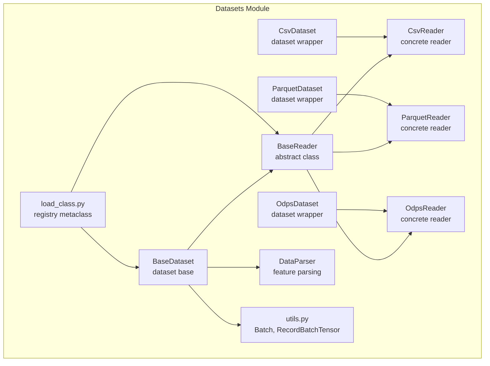
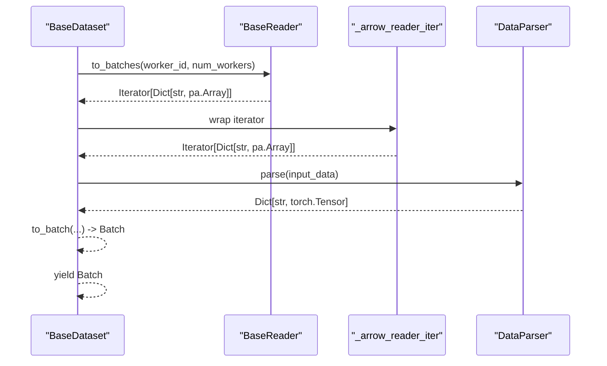
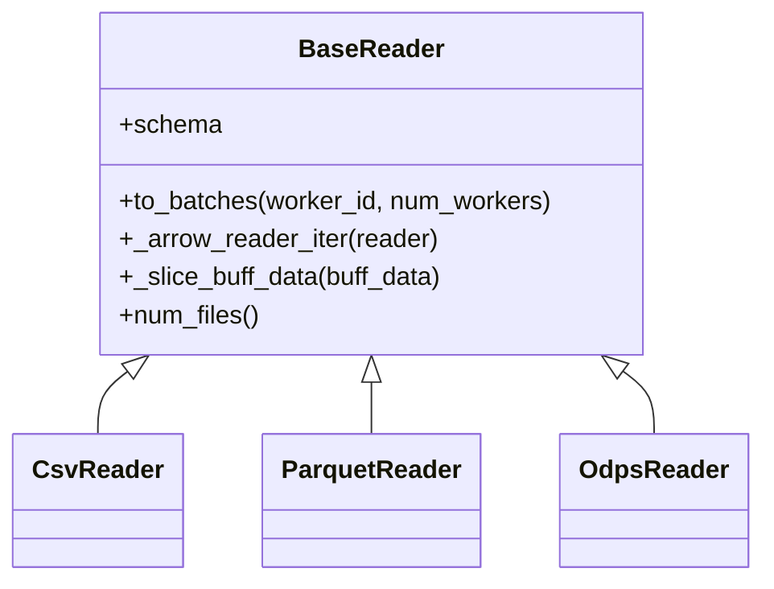
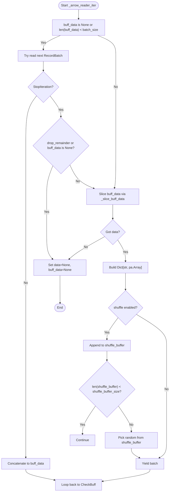
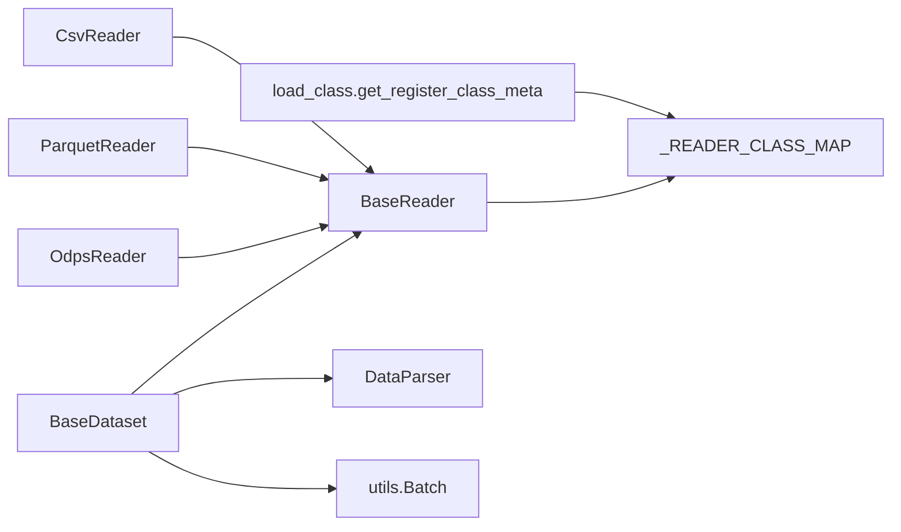

# Base Reader Architecture

<cite>
**Referenced Files in This Document**
- [dataset.py](file://tzrec/datasets/dataset.py)
- [csv_dataset.py](file://tzrec/datasets/csv_dataset.py)
- [parquet_dataset.py](file://tzrec/datasets/parquet_dataset.py)
- [odps_dataset.py](file://tzrec/datasets/odps_dataset.py)
- [load_class.py](file://tzrec/utils/load_class.py)
- [utils.py](file://tzrec/datasets/utils.py)
- [data_parser.py](file://tzrec/datasets/data_parser.py)
</cite>

## Table of Contents

1. [Introduction](#introduction)
1. [Project Structure](#project-structure)
1. [Core Components](#core-components)
1. [Architecture Overview](#architecture-overview)
1. [Detailed Component Analysis](#detailed-component-analysis)
1. [Dependency Analysis](#dependency-analysis)
1. [Performance Considerations](#performance-considerations)
1. [Troubleshooting Guide](#troubleshooting-guide)
1. [Conclusion](#conclusion)

## Introduction

This document explains the BaseReader abstract class architecture in TorchEasyRec. It covers the abstract interface definition, core properties (schema, batch_size, selected_cols), essential methods (to_batches, \_arrow_reader_iter), the reader registration system using the metaclass \_reader_meta_cls, and the batch processing pipeline including data buffering, shuffling mechanisms, and cost-based batching with sample_cost_field. Practical examples show how to implement custom readers, configure batch processing parameters, and handle different data formats. Error handling patterns, performance considerations, and integration with the broader dataset system are also addressed.

## Project Structure

The BaseReader architecture resides in the datasets module and integrates with dataset construction, data parsing, and writer utilities. The reader registration system leverages a metaclass that automatically registers subclasses into a global registry map.

**Diagram sources**

- \[dataset.py\](file://tzrec/datasets/dataset.py#L430-L554)
- \[csv_dataset.py\](file://tzrec/datasets/csv_dataset.py#L78-L167)
- \[parquet_dataset.py\](file://tzrec/datasets/parquet_dataset.py#L130-L262)
- \[odps_dataset.py\](file://tzrec/datasets/odps_dataset.py#L335-L496)
- \[load_class.py\](file://tzrec/utils/load_class.py#L117-L145)
- \[utils.py\](file://tzrec/datasets/utils.py#L110-L267)
- \[data_parser.py\](file://tzrec/datasets/data_parser.py#L56-L126)

**Section sources**

- \[dataset.py\](file://tzrec/datasets/dataset.py#L40-L45)
- \[load_class.py\](file://tzrec/utils/load_class.py#L117-L145)

## Core Components

- BaseReader: Abstract base class defining the reader contract, properties, and batch processing pipeline.
- Concrete Readers: CsvReader, ParquetReader, and OdpsReader implement to_batches and schema.
- Registration System: \_reader_meta_cls registers subclasses into \_READER_CLASS_MAP via get_register_class_meta.
- Batch Processing Utilities: \_arrow_reader_iter handles buffering, slicing, optional shuffling, and cost-based batching.

Key responsibilities:

- Expose schema for validation and downstream parsing.
- Yield batches as dictionaries of PyArrow arrays.
- Support cost-based batching via sample_cost_field and batch_cost_size.
- Provide optional in-memory shuffling with a configurable buffer.

**Section sources**

- \[dataset.py\](file://tzrec/datasets/dataset.py#L430-L554)
- \[csv_dataset.py\](file://tzrec/datasets/csv_dataset.py#L78-L167)
- \[parquet_dataset.py\](file://tzrec/datasets/parquet_dataset.py#L130-L262)
- \[odps_dataset.py\](file://tzrec/datasets/odps_dataset.py#L335-L496)
- \[load_class.py\](file://tzrec/utils/load_class.py#L117-L145)

## Architecture Overview

The BaseReader defines the interface and shared pipeline. Concrete readers implement to_batches to produce PyArrow RecordBatch iterators, which BaseReader converts into per-batch dictionaries. The BaseDataset composes a BaseReader and orchestrates sampler integration and feature parsing.

**Diagram sources**

- \[dataset.py\](file://tzrec/datasets/dataset.py#L309-L419)
- \[dataset.py\](file://tzrec/datasets/dataset.py#L502-L549)
- \[data_parser.py\](file://tzrec/datasets/data_parser.py#L178-L200)

## Detailed Component Analysis

### BaseReader Abstract Interface

- Properties:

  - schema: PyArrow Schema of the dataset.

- Methods:

  - to_batches(worker_id, num_workers): Iterator over batches as Dict[str, pa.Array].
  - \_arrow_reader_iter(reader): Internal iterator that buffers, slices, optionally shuffles, and yields batches.
  - \_slice_buff_data(buff_data): Slices buffered data either by fixed batch_size or by cumulative sample_cost up to batch_cost_size.
  - num_files(): Optional file count for file-based readers.

- Constructor parameters:

  - input_path, batch_size, selected_cols, drop_remainder, shuffle, shuffle_buffer_size, sample_cost_field, batch_cost_size.

- Cost-based batching:

  - When batch_cost_size is set, BaseReader asserts that sample_cost_field is provided.
  - \_slice_buff_data computes cumulative cost and slices to stay within batch_cost_size.

- Shuffling:

  - \_arrow_reader_iter maintains a shuffle_buffer and randomly yields batches once the buffer is filled.

- Buffering:

  - \_arrow_reader_iter concatenates incoming RecordBatch into a Table and slices off the next batch.

- Partial batch handling:

  - drop_remainder controls whether to emit a final partial batch when exiting iteration.

**Section sources**

- \[dataset.py\](file://tzrec/datasets/dataset.py#L430-L554)
- \[dataset.py\](file://tzrec/datasets/dataset.py#L482-L500)
- \[dataset.py\](file://tzrec/datasets/dataset.py#L502-L549)

### Reader Registration System

- Metaclass: \_reader_meta_cls is created via get_register_class_meta(\_READER_CLASS_MAP).
- Registration: Subclasses of BaseReader are automatically registered into \_READER_CLASS_MAP upon class definition.
- Lookup: BaseReader.create_class(name) retrieves a registered reader class by name.

**Diagram sources**

- \[dataset.py\](file://tzrec/datasets/dataset.py#L430-L554)
- \[csv_dataset.py\](file://tzrec/datasets/csv_dataset.py#L78-L167)
- \[parquet_dataset.py\](file://tzrec/datasets/parquet_dataset.py#L130-L262)
- \[odps_dataset.py\](file://tzrec/datasets/odps_dataset.py#L335-L496)
- \[load_class.py\](file://tzrec/utils/load_class.py#L117-L145)

**Section sources**

- \[dataset.py\](file://tzrec/datasets/dataset.py#L40-L45)
- \[load_class.py\](file://tzrec/utils/load_class.py#L117-L145)

### Concrete Readers

#### CsvReader

- Implements to_batches using PyArrow Dataset CSV format.
- Supports column selection, delimiter, and column types.
- Uses BaseReader.\_arrow_reader_iter to produce batches.

Key constructor parameters:

- column_names, delimiter, column_types, sample_cost_field, batch_cost_size.

**Section sources**

- \[csv_dataset.py\](file://tzrec/datasets/csv_dataset.py#L78-L167)

#### ParquetReader

- Implements to_batches using PyArrow Parquet format.
- Supports rebalancing rows across workers and dropping redundant single-row batches to avoid deadlocks.
- Uses BaseReader.\_arrow_reader_iter to produce batches.

Key constructor parameters:

- drop_redundant_bs_eq_one, rebalance, sample_cost_field, batch_cost_size.

**Section sources**

- \[parquet_dataset.py\](file://tzrec/datasets/parquet_dataset.py#L130-L262)

#### OdpsReader

- Implements to_batches using MaxCompute Storage API Arrow client.
- Manages sessions, partitions, and retries for robust remote reads.
- Uses BaseReader.\_arrow_reader_iter to produce batches.

Key constructor parameters:

- is_orderby_partition, quota_name, drop_redundant_bs_eq_one, compression, sample_cost_field, batch_cost_size.

**Section sources**

- \[odps_dataset.py\](file://tzrec/datasets/odps_dataset.py#L335-L496)

### Batch Processing Pipeline

The pipeline centers around \_arrow_reader_iter, which:

- Accumulates incoming RecordBatch into a Table (buff_data).
- Slices data using \_slice_buff_data (fixed size or cost-based).
- Optionally shuffles batches using a shuffle_buffer.
- Yields processed batches as Dict[str, pa.Array].

**Diagram sources**

- \[dataset.py\](file://tzrec/datasets/dataset.py#L502-L549)
- \[dataset.py\](file://tzrec/datasets/dataset.py#L482-L500)

**Section sources**

- \[dataset.py\](file://tzrec/datasets/dataset.py#L502-L549)
- \[dataset.py\](file://tzrec/datasets/dataset.py#L482-L500)

### Cost-Based Batching with sample_cost_field

- Enablement: Set batch_cost_size > 0 and provide sample_cost_field.
- Validation: BaseReader asserts that sample_cost_field is provided when batch_cost_size is configured.
- Slicing: \_slice_buff_data computes cumulative cost along the sample_cost_field and slices to stay within batch_cost_size.

Practical guidance:

- Choose sample_cost_field to reflect compute or memory cost per sample.
- Tune batch_cost_size to balance throughput and resource limits.

**Section sources**

- \[dataset.py\](file://tzrec/datasets/dataset.py#L464-L470)
- \[dataset.py\](file://tzrec/datasets/dataset.py#L482-L500)

### Memory Management and Partial Batches

- Buffers: buff_data holds concatenated RecordBatch until sliced.
- Chunk normalization: Columns are combined into chunks before yielding to ensure contiguous arrays.
- Partial batches: When drop_remainder is False and StopIteration occurs, the remainder is sliced and emitted if present.

**Section sources**

- \[dataset.py\](file://tzrec/datasets/dataset.py#L502-L549)

### Practical Examples

#### Implementing a Custom Reader

Steps:

1. Subclass BaseReader and define schema and to_batches.
1. Use BaseReader.\_arrow_reader_iter to convert your RecordBatch iterator into batch dictionaries.
1. Ensure the reader is imported so that the metaclass registers it automatically.

Example references:

- CsvReader implementation pattern: \[csv_dataset.py\](file://tzrec/datasets/csv_dataset.py#L78-L167)
- ParquetReader implementation pattern: \[parquet_dataset.py\](file://tzrec/datasets/parquet_dataset.py#L130-L262)
- OdpsReader implementation pattern: \[odps_dataset.py\](file://tzrec/datasets/odps_dataset.py#L335-L496)

#### Configuring Batch Processing Parameters

- Fixed-size batching: Provide batch_size; leave batch_cost_size unset.
- Cost-based batching: Provide batch_size, batch_cost_size, and sample_cost_field.
- Shuffling: Enable shuffle and tune shuffle_buffer_size.
- Partial batches: Control drop_remainder to drop or emit remainder.

References:

- BaseReader constructor: \[dataset.py\](file://tzrec/datasets/dataset.py#L444-L470)
- \_arrow_reader_iter behavior: \[dataset.py\](file://tzrec/datasets/dataset.py#L502-L549)

#### Handling Different Data Formats

- CSV: Use CsvReader with delimiter and column_types.
- Parquet: Use ParquetReader with optional rebalancing and redundant batch dropping.
- MaxCompute: Use OdpsReader with session management and compression.

References:

- CsvReader: \[csv_dataset.py\](file://tzrec/datasets/csv_dataset.py#L78-L167)
- ParquetReader: \[parquet_dataset.py\](file://tzrec/datasets/parquet_dataset.py#L130-L262)
- OdpsReader: \[odps_dataset.py\](file://tzrec/datasets/odps_dataset.py#L335-L496)

## Dependency Analysis

- BaseReader depends on PyArrow for schema and array operations.
- Concrete readers depend on their respective IO libraries (PyArrow Dataset/Parquet, MaxCompute Storage API).
- BaseDataset composes BaseReader and DataParser to produce Batch objects.
- Registration system ensures readers are discoverable by name.

**Diagram sources**

- \[load_class.py\](file://tzrec/utils/load_class.py#L117-L145)
- \[dataset.py\](file://tzrec/datasets/dataset.py#L40-L45)
- \[dataset.py\](file://tzrec/datasets/dataset.py#L149-L428)
- \[utils.py\](file://tzrec/datasets/utils.py#L110-L267)

**Section sources**

- \[load_class.py\](file://tzrec/utils/load_class.py#L117-L145)
- \[dataset.py\](file://tzrec/datasets/dataset.py#L40-L45)
- \[utils.py\](file://tzrec/datasets/utils.py#L110-L267)

## Performance Considerations

- Cost-based batching: Use sample_cost_field and batch_cost_size to cap per-batch resource usage; ensure the chosen field correlates with actual cost.
- Shuffle buffer: Larger shuffle_buffer_size increases randomness but memory usage; tune based on available memory and desired mixing.
- Partial batches: drop_remainder=True avoids tail effects but may reduce throughput slightly.
- Worker distribution: For file-based readers, BaseDataset checks num_files vs WORLD_SIZE to adjust num_workers and avoid under-utilization.
- I/O efficiency: Prefer columnar formats (Parquet) and select only needed columns (selected_cols) to reduce bandwidth and parsing overhead.

[No sources needed since this section provides general guidance]

## Troubleshooting Guide

Common issues and resolutions:

- Reader not found: Ensure your custom reader is imported so that the metaclass registers it. Use BaseReader.create_class(name) to verify availability.
- No data or empty batches: Verify selected_cols and schema compatibility; confirm input_path correctness and file existence for file-based readers.
- Cost-based batching errors: When batch_cost_size is set, sample_cost_field must be provided; otherwise, assertion fails.
- Partial batch handling: If drop_remainder is False, expect a final partial batch; if True, remainder is dropped.
- Remote reads (MaxCompute): Network errors and session expiration are handled with retries and periodic session refresh; check quotas and credentials.

**Section sources**

- \[dataset.py\](file://tzrec/datasets/dataset.py#L464-L470)
- \[dataset.py\](file://tzrec/datasets/dataset.py#L518-L522)
- \[odps_dataset.py\](file://tzrec/datasets/odps_dataset.py#L291-L300)

## Conclusion

BaseReader provides a unified abstraction for reading tabular data across formats, with a robust buffering and batching pipeline supporting both fixed-size and cost-based batching. The registration system enables extensibility, while integration with BaseDataset and DataParser delivers a cohesive data ingestion and preprocessing workflow. Proper configuration of batch parameters and awareness of memory and I/O characteristics are key to achieving reliable and efficient training pipelines.
