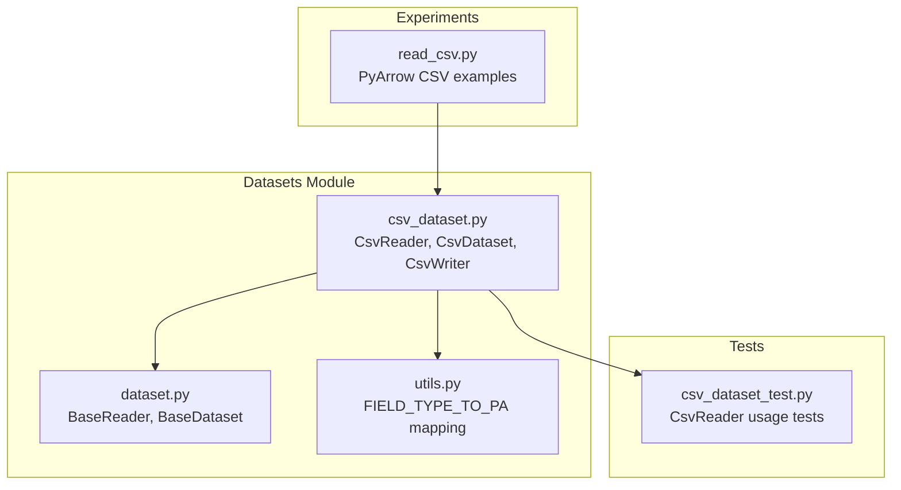
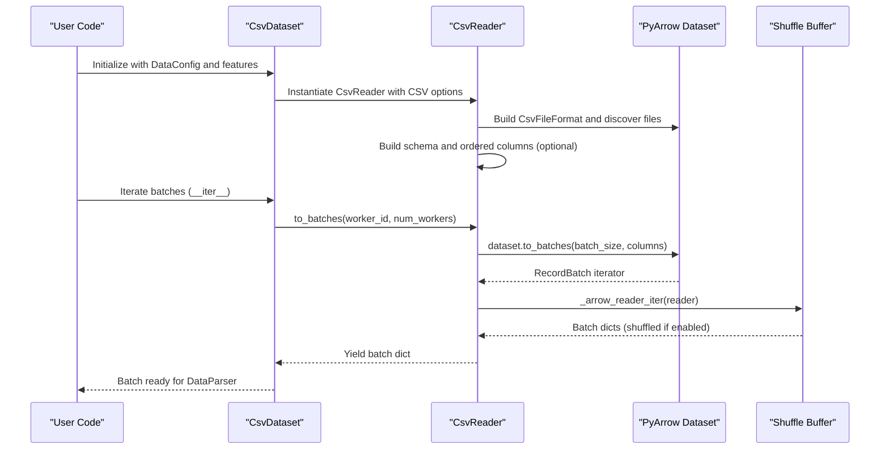
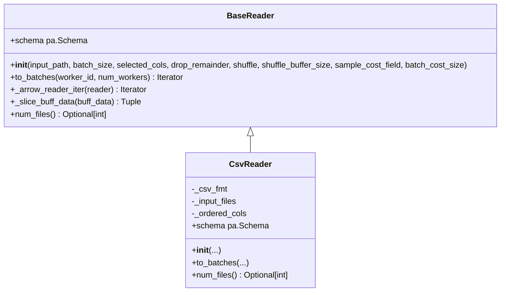
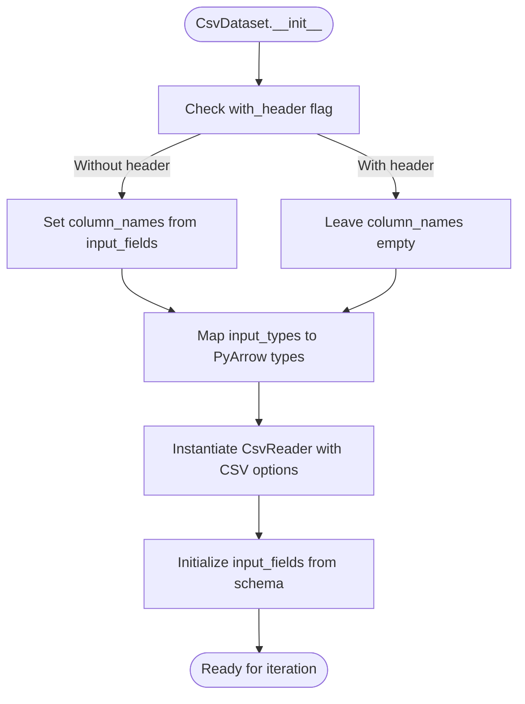
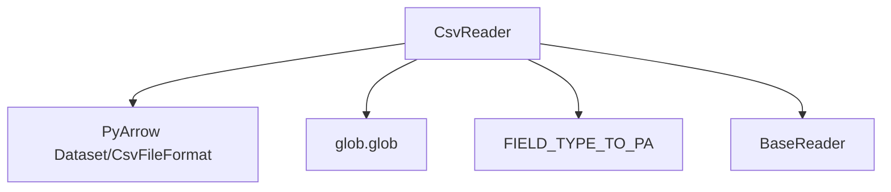

# CSV Reader Implementation

<cite>
**Referenced Files in This Document**
- [csv_dataset.py](file://tzrec/datasets/csv_dataset.py)
- [dataset.py](file://tzrec/datasets/dataset.py)
- [utils.py](file://tzrec/datasets/utils.py)
- [csv_dataset_test.py](file://tzrec/datasets/csv_dataset_test.py)
- [read_csv.py](file://experiments/read_csv.py)
</cite>

## Table of Contents

1. [Introduction](#introduction)
1. [Project Structure](#project-structure)
1. [Core Components](#core-components)
1. [Architecture Overview](#architecture-overview)
1. [Detailed Component Analysis](#detailed-component-analysis)
1. [Dependency Analysis](#dependency-analysis)
1. [Performance Considerations](#performance-considerations)
1. [Troubleshooting Guide](#troubleshooting-guide)
1. [Conclusion](#conclusion)

## Introduction

This document provides a comprehensive guide to the CsvReader implementation in TorchEasyRec. CsvReader is a specialized data reader that inherits from BaseReader and leverages Apache Arrow’s PyArrow library to stream CSV data efficiently. It supports flexible column selection, configurable delimiters, explicit column naming for headerless CSVs, and integrates with TorchEasyRec’s dataset pipeline for training and evaluation.

Key capabilities include:

- Streaming CSV data via PyArrow’s dataset API
- Column selection and schema-aware reading
- Configurable delimiter and header handling
- Optional shuffle buffering and batch cost-aware batching
- Integration with PyArrow’s CSV conversion options for type inference and casting

## Project Structure

The CSV reader implementation resides in the datasets module and integrates with the broader dataset infrastructure:

- CsvReader is defined alongside CsvDataset and CsvWriter in the CSV dataset module
- CsvReader inherits from BaseReader and participates in the BaseDataset pipeline
- Utility mappings define supported field-to-PyArrow type conversions
- Tests demonstrate usage patterns and edge cases

**Diagram sources**

- \[csv_dataset.py\](file://tzrec/datasets/csv_dataset.py#L78-L167)
- \[dataset.py\](file://tzrec/datasets/dataset.py#L430-L554)
- \[utils.py\](file://tzrec/datasets/utils.py#L34-L40)
- \[csv_dataset_test.py\](file://tzrec/datasets/csv_dataset_test.py#L30-L248)
- \[read_csv.py\](file://experiments/read_csv.py#L1-L16)

**Section sources**

- \[csv_dataset.py\](file://tzrec/datasets/csv_dataset.py#L1-L207)
- \[dataset.py\](file://tzrec/datasets/dataset.py#L1-L733)
- \[utils.py\](file://tzrec/datasets/utils.py#L1-L517)
- \[csv_dataset_test.py\](file://tzrec/datasets/csv_dataset_test.py#L1-L249)
- \[read_csv.py\](file://experiments/read_csv.py#L1-L16)

## Core Components

- CsvReader: Inherits from BaseReader and implements CSV-specific reading logic using PyArrow’s dataset API. It constructs a CsvFileFormat with parse, convert, and read options, discovers input files, builds a schema, and streams batches.
- CsvDataset: Wraps CsvReader and integrates with BaseDataset to select input fields, infer types, and expose the reader to the training pipeline.
- CsvWriter: Writes batches to CSV files using PyArrow’s CSV writer, with multi-process/partition support.

Key responsibilities:

- Constructor: Initializes CSV format options, discovers input files, validates presence, and builds schema (optionally ordered by selected columns).
- to_batches: Streams batches across worker partitions, applies shuffling and buffering, and yields dictionaries of PyArrow arrays.

**Section sources**

- \[csv_dataset.py\](file://tzrec/datasets/csv_dataset.py#L78-L167)
- \[dataset.py\](file://tzrec/datasets/dataset.py#L430-L554)

## Architecture Overview

The CsvReader architecture integrates with the BaseDataset pipeline and PyArrow’s dataset API:

**Diagram sources**

- \[csv_dataset.py\](file://tzrec/datasets/csv_dataset.py#L40-L75)
- \[csv_dataset.py\](file://tzrec/datasets/csv_dataset.py#L150-L162)
- \[dataset.py\](file://tzrec/datasets/dataset.py#L309-L316)
- \[dataset.py\](file://tzrec/datasets/dataset.py#L502-L549)

## Detailed Component Analysis

### CsvReader Class

CsvReader inherits from BaseReader and encapsulates CSV-specific configuration and streaming logic.

Constructor parameters:

- input_path: Comma-separated file patterns or directories
- batch_size: Desired batch size for streaming
- selected_cols: Optional list of column names to select
- drop_remainder: Whether to drop the last partial batch
- shuffle: Enable shuffling across batches
- shuffle_buffer_size: Size of the shuffle buffer
- column_names: Optional list for headerless CSVs
- delimiter: CSV delimiter character
- column_types: Optional mapping of column names to PyArrow data types
- sample_cost_field: Optional field used for cost-aware batching
- batch_cost_size: Optional maximum cost per batch when using sample_cost_field

Initialization steps:

- Constructs a CsvFileFormat with ParseOptions (delimiter), ConvertOptions (column_types), and ReadOptions (column_names and block_size)
- Expands input_path patterns using glob and validates file existence
- Builds schema from the first dataset; if selected_cols is provided, reorders and filters fields accordingly

to_batches method:

- Partitions input files across workers
- Optionally shuffles file order
- Creates a dataset from partitioned files and streams batches
- Uses \_arrow_reader_iter to manage buffering, shuffling, and cost-aware slicing

Schema property:

- Exposes the constructed PyArrow schema for downstream processing

num_files method:

- Returns the number of discovered CSV files

**Diagram sources**

- \[dataset.py\](file://tzrec/datasets/dataset.py#L430-L554)
- \[csv_dataset.py\](file://tzrec/datasets/csv_dataset.py#L78-L167)

**Section sources**

- \[csv_dataset.py\](file://tzrec/datasets/csv_dataset.py#L78-L167)
- \[dataset.py\](file://tzrec/datasets/dataset.py#L430-L554)

### CsvDataset Integration

CsvDataset configures CsvReader based on DataConfig:

- Determines whether to use headers or explicit column names
- Maps field types to PyArrow types via FIELD_TYPE_TO_PA
- Passes CSV-specific options (delimiter, column_types, shuffle, batch cost) to CsvReader
- Initializes input fields from the reader’s schema

**Diagram sources**

- \[csv_dataset.py\](file://tzrec/datasets/csv_dataset.py#L40-L75)
- \[utils.py\](file://tzrec/datasets/utils.py#L34-L40)

**Section sources**

- \[csv_dataset.py\](file://tzrec/datasets/csv_dataset.py#L40-L75)
- \[utils.py\](file://tzrec/datasets/utils.py#L34-L40)

### Data Type Inference and Conversion

CsvReader relies on PyArrow’s CSV conversion options to infer and cast types:

- column_types mapping passed to ConvertOptions enables explicit type casting
- FIELD_TYPE_TO_PA maps TorchEasyRec field types to PyArrow types during CsvDataset construction
- Tests demonstrate reading CSVs with mixed types and null values

Practical implications:

- Explicitly specifying column_types improves performance and correctness
- For headerless CSVs, column_names must be provided to align columns correctly

**Section sources**

- \[csv_dataset.py\](file://tzrec/datasets/csv_dataset.py#L119-L125)
- \[utils.py\](file://tzrec/datasets/utils.py#L34-L40)
- \[csv_dataset_test.py\](file://tzrec/datasets/csv_dataset_test.py#L114-L204)

### CSV Parsing Logic and Options

- Delimiter handling: Controlled via ParseOptions.delimiter
- Header processing: If with_header is true, PyArrow infers column names; otherwise, column_names must be provided
- Block size: ReadOptions.block_size controls internal buffering for large files
- Column selection: selected_cols restricts schema and batch columns

Null value management:

- Tests show reading CSVs with null values; PyArrow preserves nulls as expected
- Downstream processing should account for nulls in features

**Section sources**

- \[csv_dataset.py\](file://tzrec/datasets/csv_dataset.py#L119-L125)
- \[csv_dataset_test.py\](file://tzrec/datasets/csv_dataset_test.py#L114-L204)

### Streaming Batching and Shuffling

CsvReader’s to_batches method streams batches using PyArrow’s dataset.to_batches:

- Supports worker partitioning via worker_id and num_workers
- Applies optional shuffling using a buffer and random sampling
- Uses \_arrow_reader_iter to combine chunks, manage remainder, and enforce drop_remainder or cost-aware slicing

Cost-aware batching:

- When batch_cost_size is set, CsvReader slices batches based on cumulative cost along sample_cost_field
- This enables throughput control for heterogeneous samples

**Section sources**

- \[csv_dataset.py\](file://tzrec/datasets/csv_dataset.py#L150-L162)
- \[dataset.py\](file://tzrec/datasets/dataset.py#L502-L549)

### Writer Integration

CsvWriter demonstrates PyArrow CSV writing:

- Multi-process/partitioned output with rank-based file naming
- Lazy initialization of CSV writer with inferred schema
- Efficient record batch writing using PyArrow

**Section sources**

- \[csv_dataset.py\](file://tzrec/datasets/csv_dataset.py#L169-L206)

## Dependency Analysis

CsvReader depends on:

- PyArrow dataset API for CSV reading and batching
- Glob expansion for file discovery
- FIELD_TYPE_TO_PA for type mapping
- BaseReader for shared batching and shuffling logic

**Diagram sources**

- \[csv_dataset.py\](file://tzrec/datasets/csv_dataset.py#L119-L125)
- \[csv_dataset.py\](file://tzrec/datasets/csv_dataset.py#L126-L130)
- \[utils.py\](file://tzrec/datasets/utils.py#L34-L40)
- \[dataset.py\](file://tzrec/datasets/dataset.py#L430-L554)

**Section sources**

- \[csv_dataset.py\](file://tzrec/datasets/csv_dataset.py#L119-L130)
- \[utils.py\](file://tzrec/datasets/utils.py#L34-L40)
- \[dataset.py\](file://tzrec/datasets/dataset.py#L430-L554)

## Performance Considerations

- Chunked reading: ReadOptions.block_size is configured to a large value to reduce IO overhead for large files
- Column selection: Limiting columns reduces memory footprint and speeds up parsing
- Shuffle buffering: Controlled via shuffle_buffer_size; larger buffers improve randomness but increase memory usage
- Cost-aware batching: batch_cost_size and sample_cost_field enable throughput control for heterogeneous samples
- Worker partitioning: to_batches distributes files across workers to utilize multiple cores and disks

[No sources needed since this section provides general guidance]

## Troubleshooting Guide

Common issues and resolutions:

- No CSV files found: Ensure input_path expands to existing files; CsvReader raises a runtime error if no files are found
- Incorrect column order in headerless CSVs: Provide column_names to align columns correctly
- Type mismatches: Specify column_types to ensure correct casting; rely on FIELD_TYPE_TO_PA for TorchEasyRec field types
- Memory pressure: Reduce batch_size or enable column selection; consider cost-aware batching
- Null values: Confirm downstream features handle nulls appropriately

Validation via tests:

- Headerless CSVs with explicit column names
- Mixed types and null values
- Multi-partition CSV writing with multiple ranks

**Section sources**

- \[csv_dataset.py\](file://tzrec/datasets/csv_dataset.py#L129-L130)
- \[csv_dataset_test.py\](file://tzrec/datasets/csv_dataset_test.py#L30-L248)

## Practical Examples

### Configure CsvReader for Different CSV Formats

- Headered CSV: Leave with_header true; let PyArrow infer column names
- Headerless CSV: Set with_header false and provide input_fields with explicit column names
- Custom delimiter: Set delimiter to the desired character
- Mixed types: Provide column_types mapping for precise casting

**Section sources**

- \[csv_dataset.py\](file://tzrec/datasets/csv_dataset.py#L48-L74)
- \[csv_dataset.py\](file://tzrec/datasets/csv_dataset.py#L119-L125)

### Handle Large CSV Files Efficiently

- Use column selection to reduce memory usage
- Increase block_size via ReadOptions (already set to a large value) for fewer IO operations
- Enable worker partitioning to distribute load across files and cores

**Section sources**

- \[csv_dataset.py\](file://tzrec/datasets/csv_dataset.py#L122-L124)
- \[csv_dataset.py\](file://tzrec/datasets/csv_dataset.py#L154-L158)

### Implement Custom CSV Parsers

- Extend CsvReader to customize parsing options or post-processing
- Use PyArrow’s CSV options for advanced parsing (e.g., skip rows, null handling)
- Integrate with DataParser for downstream feature transformations

**Section sources**

- \[csv_dataset.py\](file://tzrec/datasets/csv_dataset.py#L119-L125)
- \[dataset.py\](file://tzrec/datasets/dataset.py#L317-L419)

### Troubleshoot Common CSV Reading Issues

- Verify input_path patterns resolve to files
- Confirm column_names and column_types align with actual CSV content
- Check for null values and ensure downstream features support them
- Adjust shuffle_buffer_size and batch_size for memory constraints

**Section sources**

- \[csv_dataset.py\](file://tzrec/datasets/csv_dataset.py#L126-L130)
- \[csv_dataset_test.py\](file://tzrec/datasets/csv_dataset_test.py#L114-L204)

## Encoding Handling, Compression Support, and PyArrow Integration

- Encoding: PyArrow CSV reader supports UTF-8 by default; ensure CSV files are encoded properly
- Compression: PyArrow supports gzip, bz2, and lz4 compressed CSVs; pass compressed file paths directly to CsvReader
- PyArrow integration: CsvReader uses CsvFileFormat with ParseOptions, ConvertOptions, and ReadOptions to leverage PyArrow’s optimized CSV parsing and batching

[No sources needed since this section provides general guidance]

## Conclusion

CsvReader provides a robust, efficient mechanism for streaming CSV data in TorchEasyRec. By leveraging PyArrow’s dataset API, it offers flexible column selection, type conversion, and batching strategies. Proper configuration of delimiter, column names, and types ensures reliable parsing, while worker partitioning and cost-aware batching optimize performance for large-scale training.
