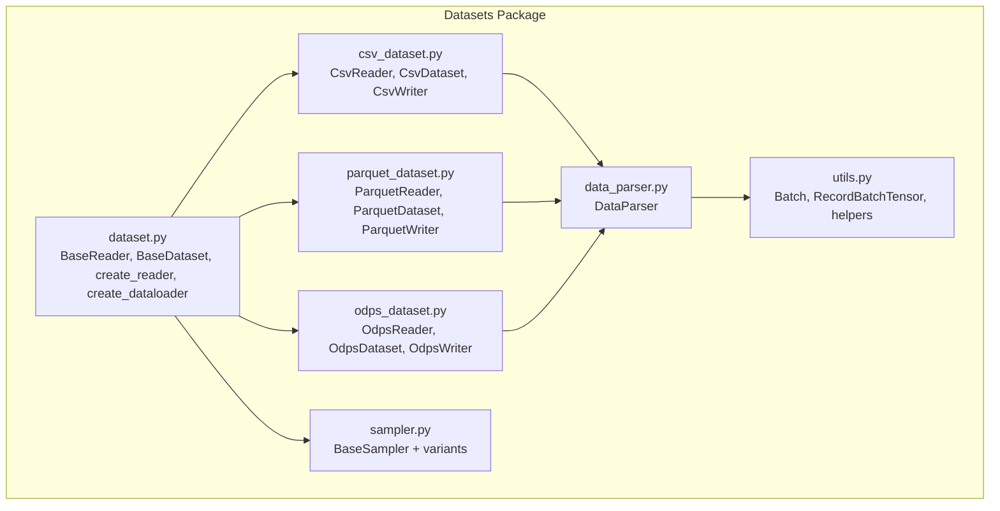
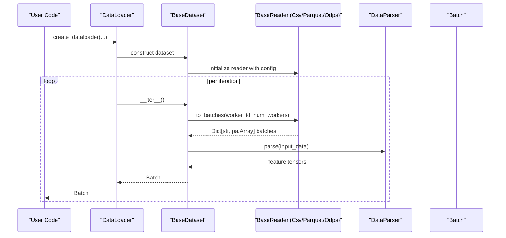
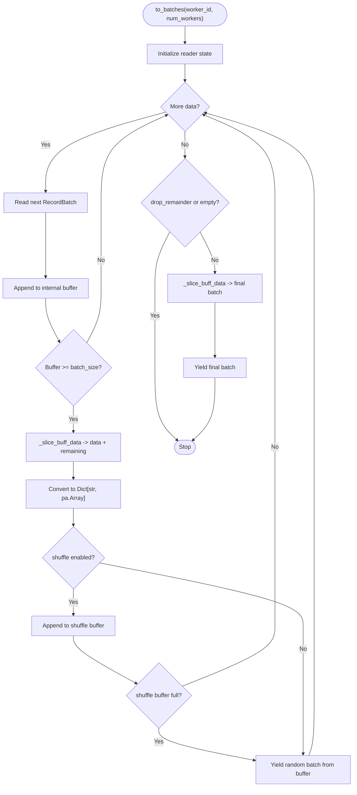
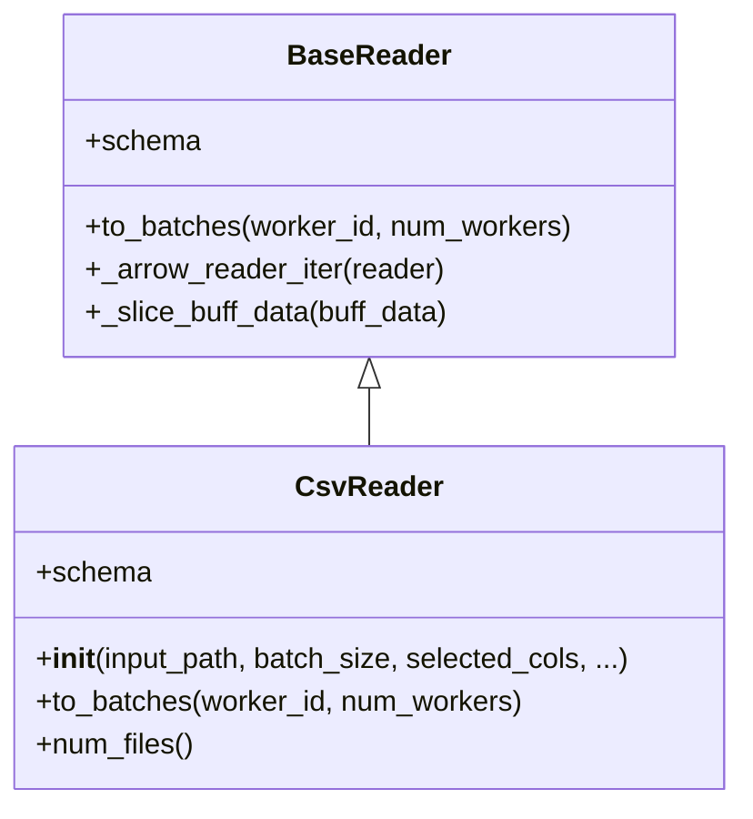
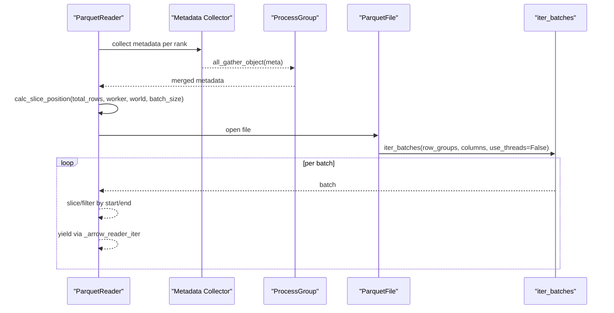
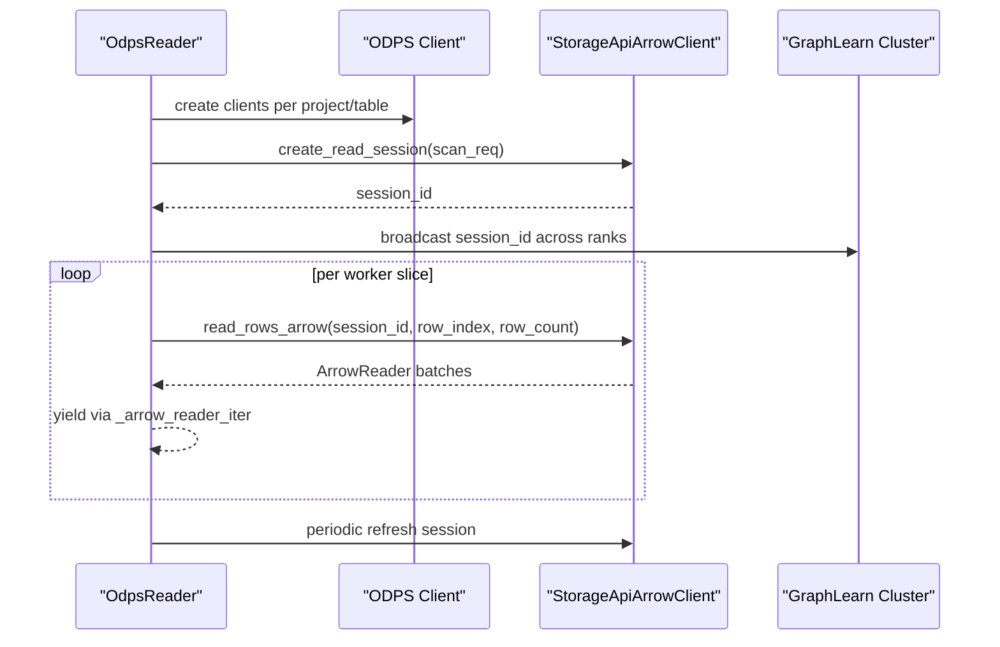
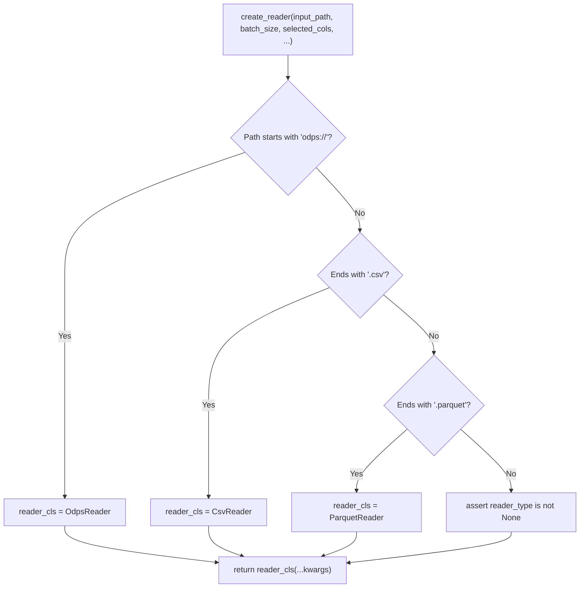
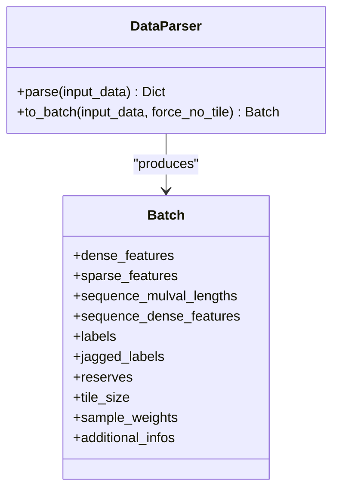
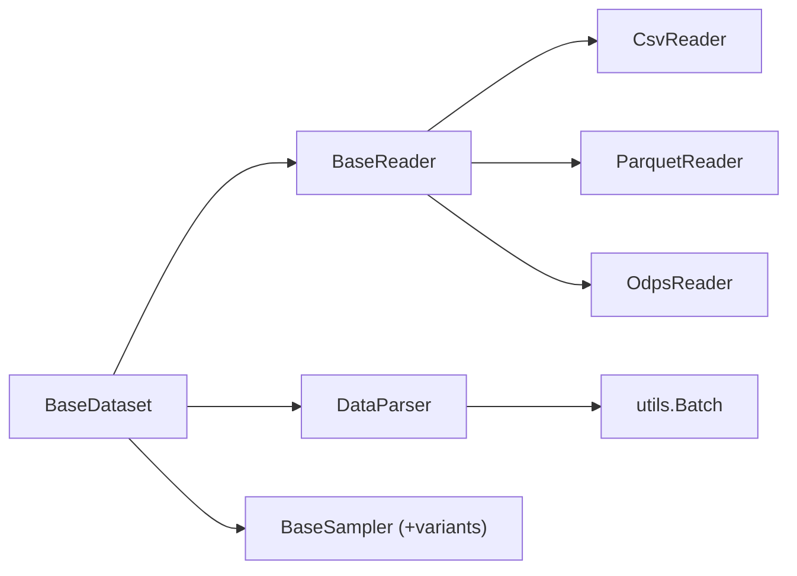

# Dataset Readers

<cite>
**Referenced Files in This Document**
- [dataset.py](file://tzrec/datasets/dataset.py)
- [csv_dataset.py](file://tzrec/datasets/csv_dataset.py)
- [parquet_dataset.py](file://tzrec/datasets/parquet_dataset.py)
- [odps_dataset.py](file://tzrec/datasets/odps_dataset.py)
- [utils.py](file://tzrec/datasets/utils.py)
- [data_parser.py](file://tzrec/datasets/data_parser.py)
- [sampler.py](file://tzrec/datasets/sampler.py)
- [csv_dataset_test.py](file://tzrec/datasets/csv_dataset_test.py)
- [parquet_dataset_test.py](file://tzrec/datasets/parquet_dataset_test.py)
- [odps_dataset_test.py](file://tzrec/datasets/odps_dataset_test.py)
</cite>

## Table of Contents

1. [Introduction](#introduction)
1. [Project Structure](#project-structure)
1. [Core Components](#core-components)
1. [Architecture Overview](#architecture-overview)
1. [Detailed Component Analysis](#detailed-component-analysis)
1. [Dependency Analysis](#dependency-analysis)
1. [Performance Considerations](#performance-considerations)
1. [Troubleshooting Guide](#troubleshooting-guide)
1. [Conclusion](#conclusion)
1. [Appendices](#appendices)

## Introduction

This document explains the dataset reader system in TorchEasyRec. It focuses on the BaseReader abstract class and its concrete implementations for CSV, Parquet, and MaxCompute (ODPS). You will learn how readers are initialized, how schemas are handled, how batches are produced, and how the reader factory function creates the appropriate reader based on input paths. Practical configuration examples, performance tips, and troubleshooting guidance are included.

## Project Structure

The dataset reader system resides primarily under the datasets package:

- Base abstractions and factories: dataset.py
- Reader implementations: csv_dataset.py, parquet_dataset.py, odps_dataset.py
- Utilities and shared data structures: utils.py
- Feature parsing pipeline: data_parser.py
- Sampling integration: sampler.py
- Tests demonstrating usage and behavior: csv_dataset_test.py, parquet_dataset_test.py, odps_dataset_test.py

**Diagram sources**

- \[dataset.py\](file://tzrec/datasets/dataset.py#L430-L642)
- \[csv_dataset.py\](file://tzrec/datasets/csv_dataset.py#L78-L167)
- \[parquet_dataset.py\](file://tzrec/datasets/parquet_dataset.py#L130-L262)
- \[odps_dataset.py\](file://tzrec/datasets/odps_dataset.py#L335-L496)
- \[utils.py\](file://tzrec/datasets/utils.py#L83-L149)
- \[data_parser.py\](file://tzrec/datasets/data_parser.py#L56-L126)
- \[sampler.py\](file://tzrec/datasets/sampler.py#L219-L330)

**Section sources**

- \[dataset.py\](file://tzrec/datasets/dataset.py#L1-L120)

## Core Components

- BaseReader: Abstract base for all readers. Provides schema property, batch iteration via to_batches, and a generic buffering/shuffling pipeline via \_arrow_reader_iter. Supports optional per-batch cost slicing via sample_cost_field and batch_cost_size.
- CsvReader: Reads CSV files using PyArrow Dataset CSV format. Supports header/no-header modes, custom delimiters, explicit column types, and sharded reading across workers.
- ParquetReader: Reads Parquet files with intelligent row-group-aware slicing and optional rebalancing across workers. Uses metadata to compute per-worker slices and supports dropping redundant batches of size 1 to avoid hangs.
- OdpsReader: Reads MaxCompute tables via Storage API Arrow client. Handles session creation, partition splitting, compression, and periodic session refresh. Supports ordered-by-partition reads and schema/project scoping.
- DataParser: Converts raw PyArrow arrays into feature tensors and Batch objects, handling dense, sparse, sequence, and label fields.
- Sampler integration: BaseDataset integrates BaseSampler subclasses to augment batches with negative or hard negatives during training.

Key initialization parameters and behaviors are covered in the detailed component analysis below.

**Section sources**

- \[dataset.py\](file://tzrec/datasets/dataset.py#L430-L642)
- \[csv_dataset.py\](file://tzrec/datasets/csv_dataset.py#L78-L167)
- \[parquet_dataset.py\](file://tzrec/datasets/parquet_dataset.py#L130-L262)
- \[odps_dataset.py\](file://tzrec/datasets/odps_dataset.py#L335-L496)
- \[data_parser.py\](file://tzrec/datasets/data_parser.py#L56-L126)
- \[sampler.py\](file://tzrec/datasets/sampler.py#L219-L330)

## Architecture Overview

The reader architecture follows a layered design:

- BaseDataset orchestrates feature parsing and batching, delegating raw data ingestion to a BaseReader instance.
- BaseReader defines the interface and common buffering/shuffling logic.
- Concrete readers implement to_batches and expose schema for validation.
- DataParser transforms PyArrow arrays into Batch objects consumed by training loops.
- Samplers can augment batches before parsing.

**Diagram sources**

- \[dataset.py\](file://tzrec/datasets/dataset.py#L309-L419)
- \[data_parser.py\](file://tzrec/datasets/data_parser.py#L178-L260)

**Section sources**

- \[dataset.py\](file://tzrec/datasets/dataset.py#L309-L419)
- \[data_parser.py\](file://tzrec/datasets/data_parser.py#L178-L260)

## Detailed Component Analysis

### BaseReader: Abstract Base and Shared Logic

- Purpose: Define schema and to_batches interface, and provide a robust buffering/shuffling pipeline that yields dictionaries of PyArrow arrays.
- Initialization parameters:
  - input_path, batch_size, selected_cols, drop_remainder
  - shuffle and shuffle_buffer_size for intra-batch shuffling
  - sample_cost_field and batch_cost_size to slice batches by logical cost rather than row count
- Schema handling: schema property must be implemented by subclasses; BaseReader validates supported PyArrow types against AVAILABLE_PA_TYPES.
- Batch iteration:
  - \_arrow_reader_iter buffers PyArrow RecordBatches, slices them into desired batch sizes, optionally shuffles, and yields dicts of arrays.
  - \_slice_buff_data slices by fixed batch_size or by cumulative cost when sample_cost_field is set.
- Worker distribution: to_batches(worker_id, num_workers) is called by BaseDataset to distribute work across workers.

**Diagram sources**

- \[dataset.py\](file://tzrec/datasets/dataset.py#L476-L550)

**Section sources**

- \[dataset.py\](file://tzrec/datasets/dataset.py#L430-L550)

### CsvReader: CSV Reader Implementation

- Initialization parameters:
  - column_names (optional, for no-header CSV)
  - delimiter (default comma)
  - column_types (mapping of column name to PyArrow DataType)
  - shuffle and shuffle_buffer_size
  - sample_cost_field and batch_cost_size
- Schema handling:
  - Builds dataset schema from the first matched file; if selected_cols is set, constructs a filtered schema preserving order.
- Reading logic:
  - Expands input_path globs into a list of files.
  - For training mode, shuffles files per worker; otherwise preserves order.
  - Uses PyArrow Dataset CSV format with block_size tuned for IO.
  - Yields batches via \_arrow_reader_iter.
- num_files: Returns number of discovered CSV files for worker scheduling.

**Diagram sources**

- \[dataset.py\](file://tzrec/datasets/dataset.py#L430-L550)
- \[csv_dataset.py\](file://tzrec/datasets/csv_dataset.py#L78-L167)

**Section sources**

- \[csv_dataset.py\](file://tzrec/datasets/csv_dataset.py#L78-L167)

### ParquetReader: Parquet Reader Implementation

- Initialization parameters:
  - drop_redundant_bs_eq_one (avoids batches of size 1 at shard ends to prevent hangs)
  - rebalance (enables metadata-based row-group-aware slicing across workers)
  - shuffle and shuffle_buffer_size
  - sample_cost_field and batch_cost_size
- Schema handling:
  - Builds schema from the first file; filters to selected_cols if provided.
- Reading logic:
  - Discovers files via glob expansion.
  - Optionally computes metadata per file and broadcasts across ranks for balanced slicing.
  - Computes per-worker start/end row positions using calc_slice_position.
  - Iterates over Parquet files using ParquetFile.iter_batches with row_groups and columns.
  - Yields batches via \_arrow_reader_iter.
- num_files: Returns None when rebalancing is enabled (no strict file count), otherwise returns the number of files.

**Diagram sources**

- \[parquet_dataset.py\](file://tzrec/datasets/parquet_dataset.py#L130-L262)
- \[utils.py\](file://tzrec/datasets/utils.py#L444-L501)

**Section sources**

- \[parquet_dataset.py\](file://tzrec/datasets/parquet_dataset.py#L130-L262)
- \[utils.py\](file://tzrec/datasets/utils.py#L444-L501)

### OdpsReader: MaxCompute (ODPS) Reader Implementation

- Initialization parameters:
  - is_orderby_partition (controls whether partitions are split individually)
  - quota_name (storage API quota)
  - compression (compression type for Arrow transport)
  - drop_redundant_bs_eq_one
  - shuffle and shuffle_buffer_size
  - sample_cost_field and batch_cost_size
- Schema handling:
  - Parses table schema from MaxCompute and maps types to PyArrow types; enforces supported types.
- Reading logic:
  - Creates ODPS clients per project/table; initializes Storage API Arrow clients.
  - Creates read sessions per table/partition; broadcasts session IDs across ranks.
  - Periodically refreshes sessions to keep them alive.
  - Slices rows per worker using calc_slice_position and reads via read_rows_arrow with retries.
  - Yields batches via \_arrow_reader_iter.
- num_files: Not applicable; ODPS uses sessions and partitions.

**Diagram sources**

- \[odps_dataset.py\](file://tzrec/datasets/odps_dataset.py#L335-L496)
- \[utils.py\](file://tzrec/datasets/utils.py#L444-L501)

**Section sources**

- \[odps_dataset.py\](file://tzrec/datasets/odps_dataset.py#L335-L496)
- \[utils.py\](file://tzrec/datasets/utils.py#L444-L501)

### Reader Factory: create_reader()

- Purpose: Automatically select the appropriate reader class based on input_path:
  - odps:// → OdpsReader
  - .csv → CsvReader
  - .parquet → ParquetReader
  - Otherwise, reader_type must be provided
- Behavior: Instantiates the chosen reader with provided kwargs (e.g., batch_size, selected_cols, shuffle, etc.).

**Diagram sources**

- \[dataset.py\](file://tzrec/datasets/dataset.py#L581-L618)

**Section sources**

- \[dataset.py\](file://tzrec/datasets/dataset.py#L581-L618)

### Data Parsing and Batching

- DataParser converts PyArrow arrays into feature tensors and Batch objects:
  - Supports dense, sparse, sequence sparse/dense, labels, and sample weights.
  - Handles FG modes (normal/DAG/bucketize) and input tiling for serving.
  - Produces Batch with keyed tensors and jagged tensors for sequences.
- BaseDataset integrates DataParser and optional samplers:
  - Applies negative/hard-negative sampling when configured.
  - Supports HSTU-specific sequence processing and TDM expansion.
  - Exposes sampled_batch_size for accurate progress reporting.

**Diagram sources**

- \[data_parser.py\](file://tzrec/datasets/data_parser.py#L178-L475)
- \[utils.py\](file://tzrec/datasets/utils.py#L111-L191)

**Section sources**

- \[data_parser.py\](file://tzrec/datasets/data_parser.py#L178-L475)
- \[utils.py\](file://tzrec/datasets/utils.py#L111-L191)

## Dependency Analysis

- Reader-to-pipeline dependencies:
  - CsvReader/ParquetReader/OdpsReader all inherit from BaseReader and implement schema and to_batches.
  - BaseDataset holds a reader instance and delegates iteration to it.
  - DataParser consumes the dicts yielded by readers and produces Batch objects.
  - Samplers (BaseSampler subclasses) can augment batches before parsing.
- External dependencies:
  - PyArrow (Arrow, Dataset, Parquet)
  - MaxCompute SDK (ODPS, Storage API Arrow client)
  - GraphLearn (negative/hard negative sampling)
  - Distributed utilities for process groups and broadcasting

**Diagram sources**

- \[dataset.py\](file://tzrec/datasets/dataset.py#L430-L642)
- \[csv_dataset.py\](file://tzrec/datasets/csv_dataset.py#L78-L167)
- \[parquet_dataset.py\](file://tzrec/datasets/parquet_dataset.py#L130-L262)
- \[odps_dataset.py\](file://tzrec/datasets/odps_dataset.py#L335-L496)
- \[data_parser.py\](file://tzrec/datasets/data_parser.py#L178-L475)
- \[utils.py\](file://tzrec/datasets/utils.py#L111-L191)
- \[sampler.py\](file://tzrec/datasets/sampler.py#L219-L330)

**Section sources**

- \[dataset.py\](file://tzrec/datasets/dataset.py#L430-L642)
- \[data_parser.py\](file://tzrec/datasets/data_parser.py#L178-L475)
- \[sampler.py\](file://tzrec/datasets/sampler.py#L219-L330)

## Performance Considerations

- CSV
  - Tune block_size in CSV format to balance IO throughput and memory usage.
  - Use selected_cols to reduce I/O and parsing overhead.
  - Enable shuffle only in training; tune shuffle_buffer_size appropriately.
- Parquet
  - Enable rebalance to avoid skew across workers; it computes balanced slices using metadata.
  - Drop redundant batches of size 1 to prevent deadlocks in mixed-size shards.
  - Use row_groups and columns to minimize deserialization overhead.
- ODPS
  - Choose appropriate compression (e.g., LZ4_FRAME) to trade off CPU vs bandwidth.
  - Order-by-partition can improve locality; however, increases session count.
  - Sessions are refreshed periodically; ensure network stability and quotas.
- General
  - Use sample_cost_field and batch_cost_size to cap logical cost per batch rather than fixed row counts.
  - Pin memory in DataLoader for non-predict modes to speed GPU transfers.
  - Ensure num_workers aligns with dataset characteristics (files for file-based readers).

[No sources needed since this section provides general guidance]

## Troubleshooting Guide

- No files found
  - CSV: Ensure input_path glob expands to existing files; otherwise raises runtime error.
  - Parquet: Same; also verify file permissions and paths.
- Unsupported data types
  - BaseReader validates schema types against supported PyArrow types; adjust schema or data types accordingly.
- ODPS credential/session errors
  - Verify ODPS config environment variables or config file presence.
  - Ensure quota_name and endpoint are set; sessions are refreshed periodically.
  - Network interruptions may cause read failures; the reader retries read requests.
- Deadlocks or hangs
  - Parquet: Enable drop_redundant_bs_eq_one to avoid single-row batches at shard ends.
  - ODPS: Ensure sessions are created and refreshed; verify partition specs.
- Sharding and ordering
  - CSV: Training mode shuffles files per worker; disable shuffle for deterministic order.
  - ODPS: is_orderby_partition controls whether partitions are split individually.
- Memory and CPU spikes
  - Reduce shuffle_buffer_size or disable shuffle for CSV.
  - Increase block_size or tune compression for ODPS.

**Section sources**

- \[csv_dataset.py\](file://tzrec/datasets/csv_dataset.py#L126-L131)
- \[parquet_dataset.py\](file://tzrec/datasets/parquet_dataset.py#L176-L181)
- \[odps_dataset.py\](file://tzrec/datasets/odps_dataset.py#L114-L178)
- \[dataset.py\](file://tzrec/datasets/dataset.py#L471-L474)

## Conclusion

The TorchEasyRec dataset reader system provides a flexible, extensible framework for ingesting structured data from CSV, Parquet, and MaxCompute. BaseReader encapsulates common buffering and shuffling logic, while concrete readers tailor IO and schema handling to their respective formats. The integration with DataParser and Samplers enables efficient feature construction and augmentation for training and evaluation.

[No sources needed since this section summarizes without analyzing specific files]

## Appendices

### Practical Configuration Examples

- CSV
  - Headerless CSV with explicit column types and custom delimiter.
  - Selected columns and sharded reading across workers.
  - Reference: \[csv_dataset_test.py\](file://tzrec/datasets/csv_dataset_test.py#L30-L113)
- Parquet
  - Balanced sharding across multiple files and workers.
  - Row-group aware reading and optional rebalancing.
  - Reference: \[parquet_dataset_test.py\](file://tzrec/datasets/parquet_dataset_test.py#L32-L103)
- ODPS
  - Reading multiple partitions with ordered-by-partition option.
  - Negative sampling integration and session management.
  - Reference: \[odps_dataset_test.py\](file://tzrec/datasets/odps_dataset_test.py#L131-L198)

### Custom Reader Implementation Checklist

- Subclass BaseReader and implement:
  - schema property returning a PyArrow Schema
  - to_batches(worker_id, num_workers) yielding Dict[str, pa.Array]
- Handle:
  - File discovery/globbing or remote session management
  - Per-worker slicing and sharding
  - Optional cost-based batching via sample_cost_field
- Integrate with:
  - BaseDataset by instantiating your reader in the dataset class
  - create_reader() by adding a path-type branch if needed

**Section sources**

- \[dataset.py\](file://tzrec/datasets/dataset.py#L581-L618)
- \[csv_dataset.py\](file://tzrec/datasets/csv_dataset.py#L78-L167)
- \[parquet_dataset.py\](file://tzrec/datasets/parquet_dataset.py#L130-L262)
- \[odps_dataset.py\](file://tzrec/datasets/odps_dataset.py#L335-L496)
