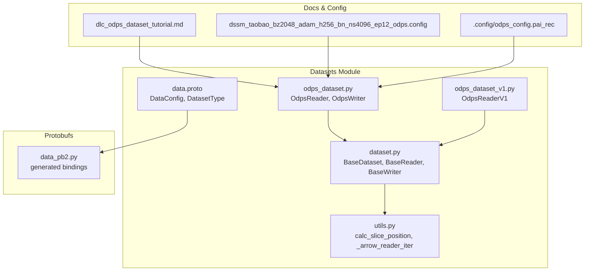
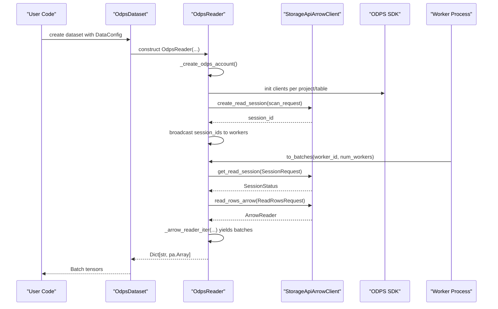
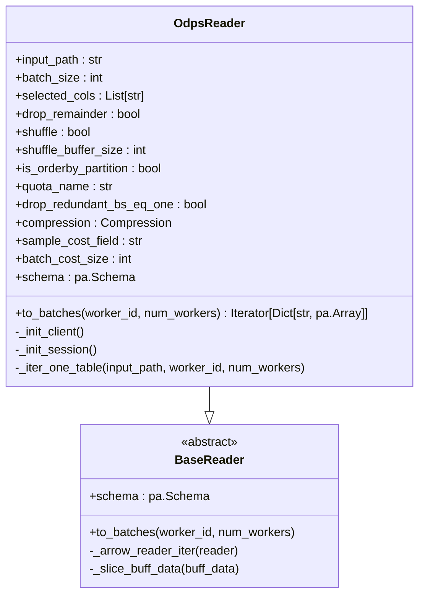
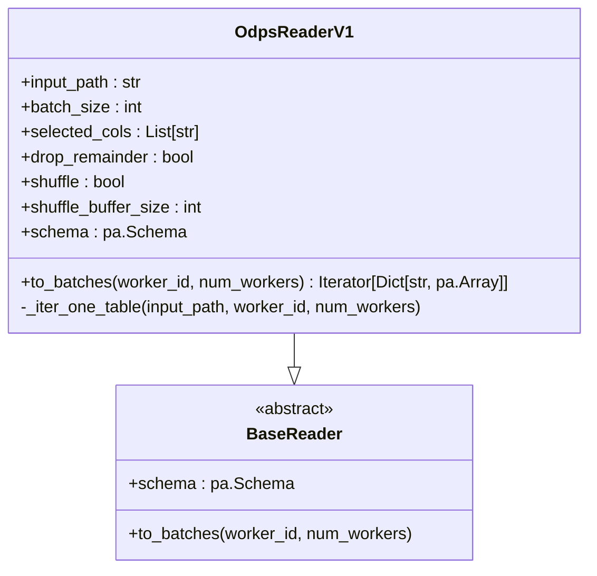
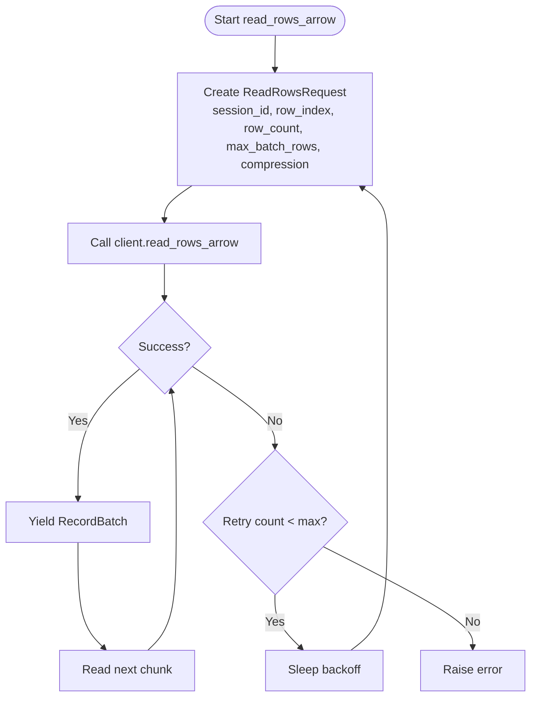
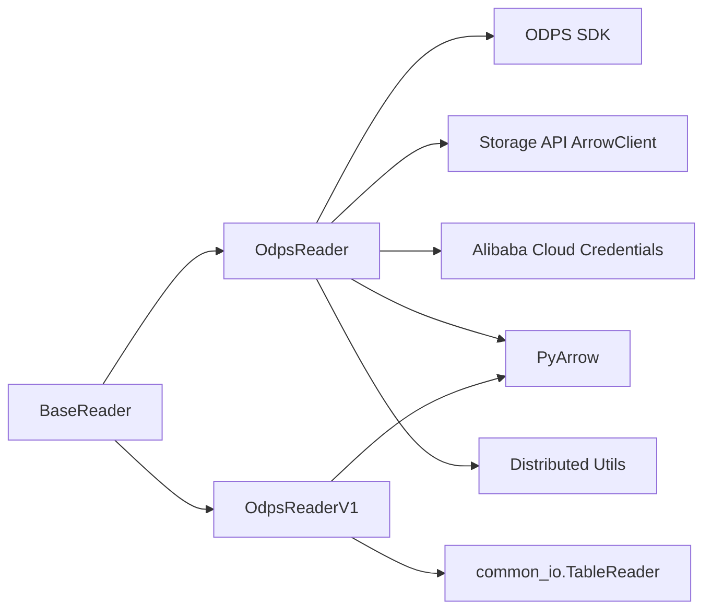

# ODPS Reader Implementation

<cite>
**Referenced Files in This Document**
- [odps_dataset.py](file://tzrec/datasets/odps_dataset.py)
- [odps_dataset_v1.py](file://tzrec/datasets/odps_dataset_v1.py)
- [dataset.py](file://tzrec/datasets/dataset.py)
- [utils.py](file://tzrec/datasets/utils.py)
- [data.proto](file://tzrec/protos/data.proto)
- [dlc_odps_dataset_tutorial.md](file://docs/source/quick_start/dlc_odps_dataset_tutorial.md)
- [odps_dataset_test.py](file://tzrec/datasets/odps_dataset_test.py)
- [odps_dataset_v1_test.py](file://tzrec/datasets/odps_dataset_v1_test.py)
- [dssm_taobao_bz2048_adam_h256_bn_ns4096_ep12_odps.config](file://experiments/taobao/dssm_taobao_bz2048_adam_h256_bn_ns4096_ep12_odps.config)
- [odps_config.pai_rec](file://.config/odps_config.pai_rec)
</cite>

## Table of Contents

1. [Introduction](#introduction)
1. [Project Structure](#project-structure)
1. [Core Components](#core-components)
1. [Architecture Overview](#architecture-overview)
1. [Detailed Component Analysis](#detailed-component-analysis)
1. [Dependency Analysis](#dependency-analysis)
1. [Performance Considerations](#performance-considerations)
1. [Troubleshooting Guide](#troubleshooting-guide)
1. [Conclusion](#conclusion)
1. [Appendices](#appendices)

## Introduction

This document explains the ODPS (MaxCompute) reader implementations in TorchEasyRec, focusing on the modern OdpsReader and its predecessor OdpsReaderV1. It covers constructor parameters, authentication mechanisms, ODPS-specific configuration options, streaming data processing via Storage API, pagination and batching, and performance optimizations for cloud-based data processing. Practical examples demonstrate configuring readers for different table schemas, handling large-scale queries, and integrating with Alibaba Cloud services.

## Project Structure

The ODPS reader implementations reside in the datasets module alongside base dataset abstractions and utilities. The key files are:

- Modern reader: OdpsReader in odps_dataset.py
- Legacy reader: OdpsReaderV1 in odps_dataset_v1.py
- Base dataset and reader abstractions in dataset.py
- Utility functions for batching and slicing in utils.py
- Protocol buffers defining configuration in data.proto
- Tutorials and examples in docs and experiments

**Diagram sources**

- \[odps_dataset.py\](file://tzrec/datasets/odps_dataset.py#L302-L661)
- \[odps_dataset_v1.py\](file://tzrec/datasets/odps_dataset_v1.py#L110-L185)
- \[dataset.py\](file://tzrec/datasets/dataset.py#L149-L733)
- \[utils.py\](file://tzrec/datasets/utils.py#L444-L517)
- \[data.proto\](file://tzrec/protos/data.proto#L43-L137)
- \[dlc_odps_dataset_tutorial.md\](file://docs/source/quick_start/dlc_odps_dataset_tutorial.md#L1-L138)
- \[dssm_taobao_bz2048_adam_h256_bn_ns4096_ep12_odps.config\](file://experiments/taobao/dssm_taobao_bz2048_adam_h256_bn_ns4096_ep12_odps.config#L1-L227)
- \[odps_config.pai_rec\](file://.config/odps_config.pai_rec#L1-L5)

**Section sources**

- \[odps_dataset.py\](file://tzrec/datasets/odps_dataset.py#L1-L661)
- \[odps_dataset_v1.py\](file://tzrec/datasets/odps_dataset_v1.py#L1-L185)
- \[dataset.py\](file://tzrec/datasets/dataset.py#L1-L733)
- \[utils.py\](file://tzrec/datasets/utils.py#L1-L517)
- \[data.proto\](file://tzrec/protos/data.proto#L1-L138)

## Core Components

- OdpsReader: Modern reader leveraging MaxCompute Storage API for high-throughput, compressed Arrow streaming. Supports partition-aware scanning, session lifecycle management, and distributed worker coordination.
- OdpsReaderV1: Legacy reader using common_io.TableReader for tunnel-based reads. Simpler but lacks advanced compression and session features.
- BaseDataset and BaseReader: Shared abstractions for dataset construction, schema inference, and batch building.
- Utilities: Slice calculation, Arrow batch iteration, and distributed process group helpers.

Key configuration options exposed via DataConfig:

- is_orderby_partition: Controls partition scanning order.
- odps_data_quota_name: Storage API/Tunnel quota name.
- odps_data_compression: Compression type for Storage API.
- sample_cost_field and batch_cost_size: Cost-aware batching.

**Section sources**

- \[odps_dataset.py\](file://tzrec/datasets/odps_dataset.py#L335-L496)
- \[odps_dataset_v1.py\](file://tzrec/datasets/odps_dataset_v1.py#L110-L185)
- \[dataset.py\](file://tzrec/datasets/dataset.py#L430-L550)
- \[data.proto\](file://tzrec/protos/data.proto#L88-L127)

## Architecture Overview

The modern ODPS reader uses MaxCompute Storage API with Arrow transport. It creates read sessions per partition, distributes session IDs across workers, and streams batches with retry logic and compression.

**Diagram sources**

- \[odps_dataset.py\](file://tzrec/datasets/odps_dataset.py#L335-L496)
- \[odps_dataset.py\](file://tzrec/datasets/odps_dataset.py#L417-L471)
- \[odps_dataset.py\](file://tzrec/datasets/odps_dataset.py#L224-L289)

## Detailed Component Analysis

### OdpsReader (Modern)

- Constructor parameters:
  - input_path: comma-separated ODPS table URIs (supports multiple tables and partitions).
  - batch_size: target batch size.
  - selected_cols: subset of columns to read.
  - drop_remainder: drop last partial batch.
  - shuffle and shuffle_buffer_size: optional in-memory shuffle.
  - is_orderby_partition: read partitions in order for deterministic scans.
  - quota_name: Storage API quota name.
  - drop_redundant_bs_eq_one: drop batch-size-1 to avoid hangs in distributed training.
  - compression: LZ4_FRAME, ZSTD, UNCOMPRESSED.
  - sample_cost_field and batch_cost_size: cost-aware batching.
- Authentication:
  - Supports ODPS_CONFIG_FILE_PATH, Alibaba Cloud credentials provider, or ~/.odps_config.ini fallback.
  - Sets environment variables for downstream compatibility.
- Schema inference:
  - Builds PyArrow schema from table schema, validating supported types.
- Session management:
  - Creates read sessions per partition; broadcasts session IDs to workers.
  - Starts a background thread to refresh sessions periodically.
- Streaming and batching:
  - Uses Storage API ArrowReader with retries and compression.
  - Applies \_arrow_reader_iter for buffering, slicing, optional shuffle, and cost-aware batching.

**Diagram sources**

- \[odps_dataset.py\](file://tzrec/datasets/odps_dataset.py#L335-L496)
- \[dataset.py\](file://tzrec/datasets/dataset.py#L430-L550)

**Section sources**

- \[odps_dataset.py\](file://tzrec/datasets/odps_dataset.py#L335-L496)
- \[odps_dataset.py\](file://tzrec/datasets/odps_dataset.py#L138-L178)
- \[odps_dataset.py\](file://tzrec/datasets/odps_dataset.py#L417-L471)
- \[odps_dataset.py\](file://tzrec/datasets/odps_dataset.py#L224-L289)
- \[data.proto\](file://tzrec/protos/data.proto#L88-L127)

### OdpsReaderV1 (Legacy)

- Constructor parameters:
  - input_path: single ODPS table URI.
  - batch_size: target batch size.
  - selected_cols: subset of columns to read.
  - drop_remainder: drop last partial batch.
  - shuffle and shuffle_buffer_size: optional shuffle.
- Authentication:
  - Uses common_io.TableReader with environment-driven configuration.
- Schema inference:
  - Reads schema from TableReader and builds a limited PyArrow schema mapping.
- Streaming and batching:
  - Reads records in chunks and yields dictionaries of pa.Array.

**Diagram sources**

- \[odps_dataset_v1.py\](file://tzrec/datasets/odps_dataset_v1.py#L110-L185)
- \[dataset.py\](file://tzrec/datasets/dataset.py#L430-L550)

**Section sources**

- \[odps_dataset_v1.py\](file://tzrec/datasets/odps_dataset_v1.py#L110-L185)

### Data Transfer Mechanisms and Pagination

- Storage API ArrowReader:
  - Uses ReadRowsRequest with row_index, row_count, and max_batch_rows.
  - Supports compression and retry on HTTP errors and ArrowInvalid.
- Session lifecycle:
  - Sessions created per partition; session IDs broadcast to workers.
  - Background refresh thread renews sessions before expiration.
- Slicing and batching:
  - calc_slice_position computes per-worker row ranges and handles remainder batches.
  - \_arrow_reader_iter buffers Arrow batches, slices to batch_size, and optionally shuffles.

**Diagram sources**

- \[odps_dataset.py\](file://tzrec/datasets/odps_dataset.py#L205-L221)
- \[odps_dataset.py\](file://tzrec/datasets/odps_dataset.py#L256-L288)

**Section sources**

- \[odps_dataset.py\](file://tzrec/datasets/odps_dataset.py#L205-L289)
- \[utils.py\](file://tzrec/datasets/utils.py#L444-L501)

### Authentication and Security

- Credential sources (in order):
  - ODPS_CONFIG_FILE_PATH: parses access_id, access_key, end_point.
  - Alibaba Cloud credentials provider: supports ECS metadata, credentials file, STS token, and URI.
  - ~/.odps_config.ini fallback if neither of the above is present.
- Environment propagation:
  - Sets ACCESS_ID, ACCESS_KEY, END_POINT, and optionally STS_TOKEN for downstream compatibility.
- Security considerations:
  - Prefer Alibaba Cloud credentials provider with STS tokens for ephemeral credentials.
  - Ensure ODPS_ENDPOINT is set when using credentials provider.
  - Limit table access via project-level quotas and partition filters.

**Section sources**

- \[odps_dataset.py\](file://tzrec/datasets/odps_dataset.py#L138-L178)
- \[odps_dataset.py\](file://tzrec/datasets/odps_dataset.py#L114-L135)

### Practical Configuration Examples

- Basic ODPS reader configuration:
  - Set dataset_type to OdpsDataset.
  - Configure batch_size, num_workers, drop_remainder, shuffle, and shuffle_buffer_size.
  - Use odps_data_quota_name and odps_data_compression for Storage API tuning.
  - Enable is_orderby_partition for deterministic partition scans.
- Multi-table and partition usage:
  - Comma-separate multiple tables and use & to combine partitions for a single table.
- Example configuration file:
  - See experiments/taobao/dssm_taobao_bz2048_adam_h256_bn_ns4096_ep12_odps.config for typical usage.

**Section sources**

- \[data.proto\](file://tzrec/protos/data.proto#L43-L137)
- \[dssm_taobao_bz2048_adam_h256_bn_ns4096_ep12_odps.config\](file://experiments/taobao/dssm_taobao_bz2048_adam_h256_bn_ns4096_ep12_odps.config#L1-L227)
- \[dlc_odps_dataset_tutorial.md\](file://docs/source/quick_start/dlc_odps_dataset_tutorial.md#L70-L72)

## Dependency Analysis

- OdpsReader depends on:
  - MaxCompute SDK (ODPS), Storage API Arrow client, and credentials client.
  - PyArrow for schema and batch handling.
  - Distributed utilities for process groups and broadcasting session IDs.
- OdpsReaderV1 depends on:
  - common_io.TableReader for tunnel-based reads.
- Both readers depend on BaseReader for shared batching logic and schema handling.

**Diagram sources**

- \[odps_dataset.py\](file://tzrec/datasets/odps_dataset.py#L20-L51)
- \[odps_dataset_v1.py\](file://tzrec/datasets/odps_dataset_v1.py#L16-L23)
- \[dataset.py\](file://tzrec/datasets/dataset.py#L430-L550)

**Section sources**

- \[odps_dataset.py\](file://tzrec/datasets/odps_dataset.py#L20-L51)
- \[odps_dataset_v1.py\](file://tzrec/datasets/odps_dataset_v1.py#L16-L23)
- \[dataset.py\](file://tzrec/datasets/dataset.py#L430-L550)

## Performance Considerations

- Compression:
  - LZ4_FRAME is default; adjust odps_data_compression to balance throughput and CPU usage.
- Batch sizing:
  - Use batch_cost_size with sample_cost_field for cost-aware batching to balance compute budgets.
- Partition scanning:
  - is_orderby_partition ensures deterministic order; consider enabling for reproducibility.
- Shuffle:
  - Enable shuffle_buffer_size for better data mixing; note it increases memory usage.
- Parallelism:
  - Increase num_workers and tune batch_size for throughput; ensure sufficient cores and network bandwidth.
- Session refresh:
  - Background refresh prevents session expiration during long scans.

[No sources needed since this section provides general guidance]

## Troubleshooting Guide

Common issues and resolutions:

- Authentication failures:
  - Verify ODPS_CONFIG_FILE_PATH or Alibaba Cloud credentials provider configuration.
  - Ensure ODPS_ENDPOINT is set when using credentials provider.
- Session expiration:
  - Confirm STORAGE_API_QUOTA_NAME and that refresh thread is running.
- Unsupported data types:
  - Check that table schema types are supported; unsupported types raise errors during schema inference.
- Hanging in distributed training:
  - Enable drop_redundant_bs_eq_one to avoid batch-size-1 edge cases.
- Large-scale queries:
  - Use partition filters and is_orderby_partition to reduce scan scope.
- Cost-aware batching:
  - Ensure sample_cost_field is set when using batch_cost_size.

**Section sources**

- \[odps_dataset.py\](file://tzrec/datasets/odps_dataset.py#L138-L178)
- \[odps_dataset.py\](file://tzrec/datasets/odps_dataset.py#L417-L471)
- \[odps_dataset.py\](file://tzrec/datasets/odps_dataset.py#L444-L456)
- \[data.proto\](file://tzrec/protos/data.proto#L120-L127)

## Conclusion

OdpsReader provides a robust, high-performance path for reading MaxCompute tables using Storage API with Arrow transport, compression, and session lifecycle management. OdpsReaderV1 remains useful for simpler scenarios relying on tunnel-based reads. Choose OdpsReader for production workloads requiring scalability and cost-aware batching; use OdpsReaderV1 for quick prototypes or environments without Storage API access.

[No sources needed since this section summarizes without analyzing specific files]

## Appendices

### API and Configuration Reference

- DataConfig fields relevant to ODPS:
  - is_orderby_partition, odps_data_quota_name, odps_data_compression, sample_cost_field, batch_cost_size.

**Section sources**

- \[data.proto\](file://tzrec/protos/data.proto#L88-L127)

### Example Workflows

- Training with ODPS tables:
  - Configure ODPS_ENDPOINT and dataset_type OdpsDataset.
  - Use multi-table and partition syntax in input paths.
- Writing to ODPS:
  - Use OdpsWriter to create tables and partitions automatically and commit sessions.

**Section sources**

- \[dlc_odps_dataset_tutorial.md\](file://docs/source/quick_start/dlc_odps_dataset_tutorial.md#L49-L64)
- \[odps_dataset.py\](file://tzrec/datasets/odps_dataset.py#L498-L661)
