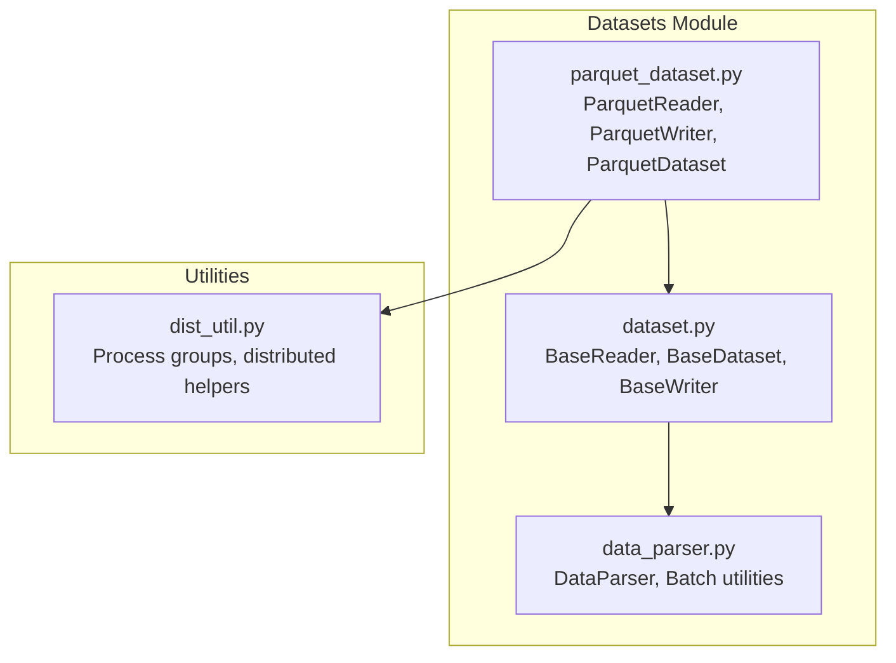
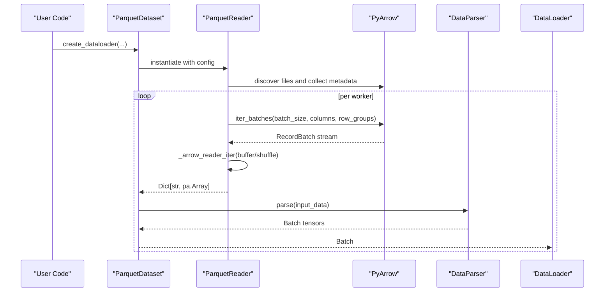
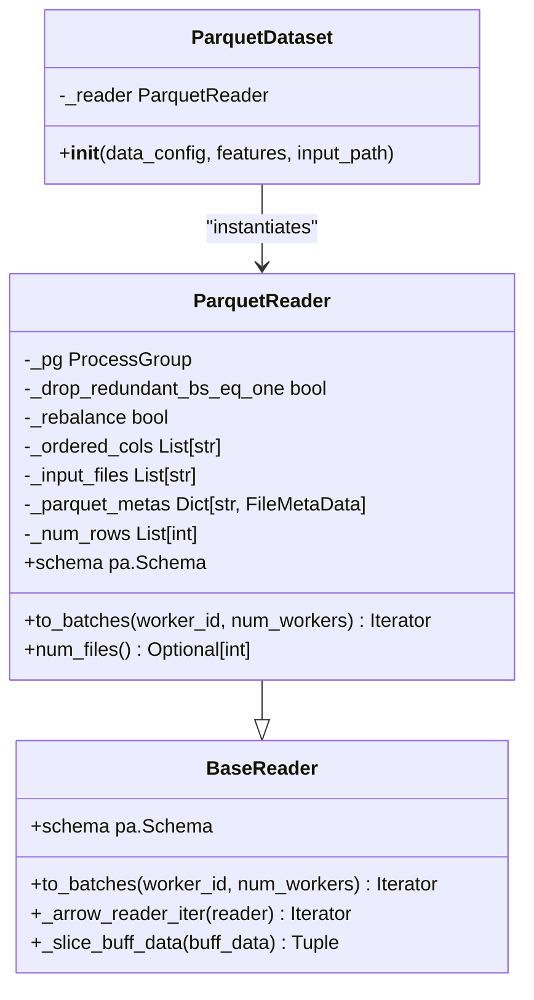
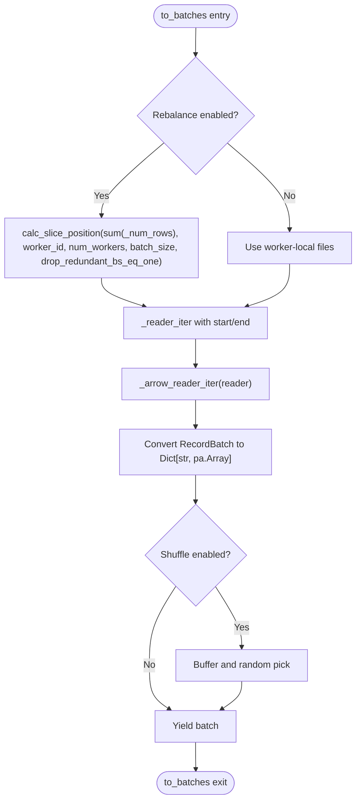
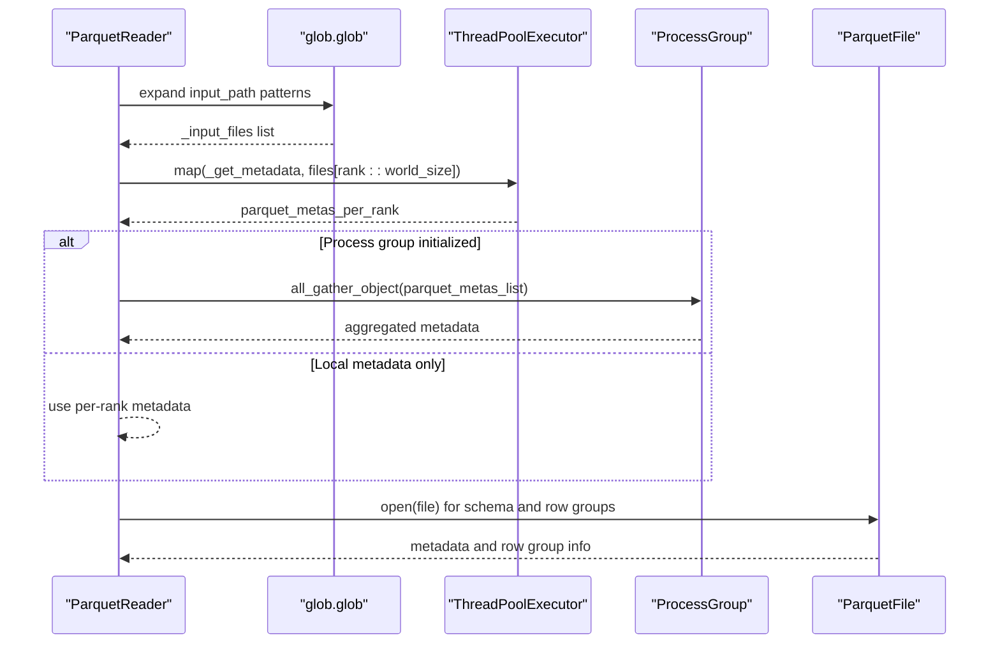
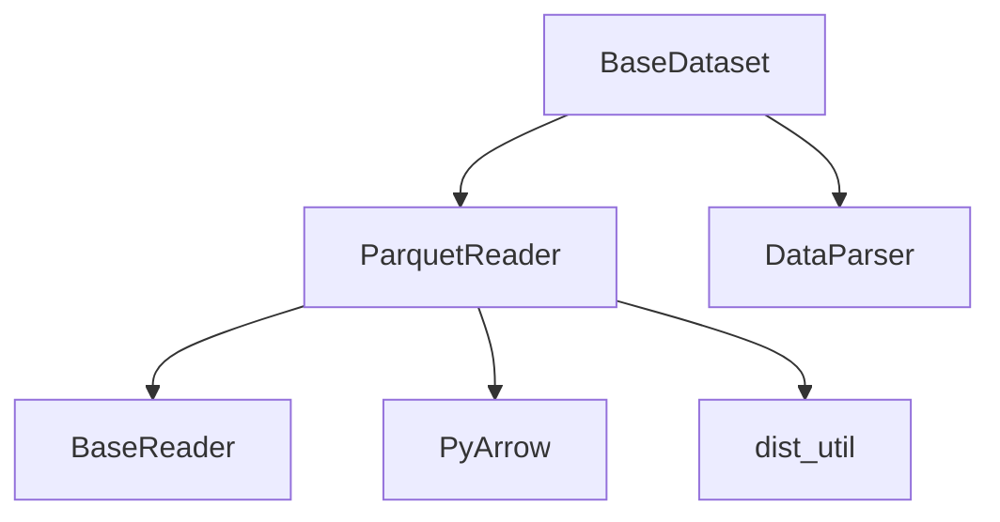

# Parquet Reader Implementation

<cite>
**Referenced Files in This Document**
- [parquet_dataset.py](file://tzrec/datasets/parquet_dataset.py)
- [dataset.py](file://tzrec/datasets/dataset.py)
- [parquet_dataset_test.py](file://tzrec/datasets/parquet_dataset_test.py)
- [dist_util.py](file://tzrec/utils/dist_util.py)
- [data_parser.py](file://tzrec/datasets/data_parser.py)
</cite>

## Table of Contents

1. [Introduction](#introduction)
1. [Project Structure](#project-structure)
1. [Core Components](#core-components)
1. [Architecture Overview](#architecture-overview)
1. [Detailed Component Analysis](#detailed-component-analysis)
1. [Dependency Analysis](#dependency-analysis)
1. [Performance Considerations](#performance-considerations)
1. [Troubleshooting Guide](#troubleshooting-guide)
1. [Conclusion](#conclusion)

## Introduction

This document provides a comprehensive analysis of the ParquetReader implementation in TorchEasyRec. It focuses on the ParquetReader class that inherits from BaseReader, covering constructor parameters, Parquet-specific configuration options, file format handling, streaming data processing, column projection, data type preservation, PyArrow integration, partition discovery, metadata handling, and performance optimizations. Practical examples demonstrate configuration for different schemas, handling nested data types, implementing custom processors, and optimizing performance for large datasets. The document also addresses compression handling, statistics utilization, and integration with distributed storage systems.

## Project Structure

The ParquetReader implementation resides within the datasets module alongside related readers and writers. The key files include:

- Parquet-specific reader and writer implementations
- Base dataset and reader abstractions
- Distributed utilities for process groups
- Data parsing and batching utilities

**Diagram sources**

- \[parquet_dataset.py\](file://tzrec/datasets/parquet_dataset.py#L98-L304)
- \[dataset.py\](file://tzrec/datasets/dataset.py#L430-L733)
- \[data_parser.py\](file://tzrec/datasets/data_parser.py#L56-L200)
- \[dist_util.py\](file://tzrec/utils/dist_util.py#L74-L84)

**Section sources**

- \[parquet_dataset.py\](file://tzrec/datasets/parquet_dataset.py#L1-L304)
- \[dataset.py\](file://tzrec/datasets/dataset.py#L1-L733)

## Core Components

The ParquetReader class extends BaseReader and provides Parquet-specific functionality for streaming data. Key responsibilities include:

- Schema inference and column projection
- File discovery and metadata collection
- Distributed row-group slicing and batch iteration
- Integration with PyArrow for efficient reading
- Support for shuffling, batching, and cost-aware sampling

Key constructor parameters:

- input_path: Glob pattern for Parquet files
- batch_size: Target batch size for streaming
- selected_cols: Optional column projection list
- drop_remainder: Drop incomplete batches
- shuffle: Enable in-memory shuffling
- shuffle_buffer_size: Buffer size for shuffling
- drop_redundant_bs_eq_one: Drop final batch with size 1
- rebalance: Distribute rows across workers
- sample_cost_field: Field used for cost-aware batching
- batch_cost_size: Maximum cost per batch

**Section sources**

- \[parquet_dataset.py\](file://tzrec/datasets/parquet_dataset.py#L130-L174)
- \[dataset.py\](file://tzrec/datasets/dataset.py#L430-L475)

## Architecture Overview

The ParquetReader integrates with the broader TorchEasyRec data pipeline:

- BaseDataset orchestrates feature creation and reader instantiation
- ParquetReader handles file discovery, metadata collection, and streaming
- BaseReader provides shared batching and shuffling logic
- DataParser converts Arrow arrays to tensors and builds batches
- Distributed utilities coordinate multi-process reading

**Diagram sources**

- \[parquet_dataset.py\](file://tzrec/datasets/parquet_dataset.py#L98-L128)
- \[parquet_dataset.py\](file://tzrec/datasets/parquet_dataset.py#L225-L251)
- \[dataset.py\](file://tzrec/datasets/dataset.py#L309-L419)

## Detailed Component Analysis

### ParquetReader Class

The ParquetReader class encapsulates Parquet-specific reading logic:

- Constructor initializes distributed process group, column ordering, and schema
- File discovery uses glob patterns to locate Parquet files
- Metadata collection enables row-group-aware slicing for distributed reading
- Streaming iteration yields Arrow RecordBatches converted to dictionaries

**Diagram sources**

- \[parquet_dataset.py\](file://tzrec/datasets/parquet_dataset.py#L130-L262)
- \[dataset.py\](file://tzrec/datasets/dataset.py#L430-L554)

**Section sources**

- \[parquet_dataset.py\](file://tzrec/datasets/parquet_dataset.py#L130-L262)

### Constructor and Initialization

The constructor performs several initialization steps:

- Sets up distributed process group for metadata exchange
- Resolves input files via glob expansion
- Infers schema and applies column projection if specified
- Collects Parquet metadata for row-group-aware distribution

Key behaviors:

- Column projection preserves order of selected columns
- Schema validation ensures supported PyArrow types
- Metadata collection uses multi-threading and optional process group gathering

**Section sources**

- \[parquet_dataset.py\](file://tzrec/datasets/parquet_dataset.py#L147-L194)
- \[parquet_dataset.py\](file://tzrec/datasets/parquet_dataset.py#L200-L219)

### to_batches Method Implementation

The to_batches method streams data with the following logic:

- Calculates start/end row indices for distributed workers
- Uses a helper iterator to read batches with row-group filtering
- Converts Arrow RecordBatches to dictionaries of arrays
- Applies buffering, shuffling, and batching via BaseReader logic

**Diagram sources**

- \[parquet_dataset.py\](file://tzrec/datasets/parquet_dataset.py#L225-L251)
- \[dataset.py\](file://tzrec/datasets/dataset.py#L502-L550)

**Section sources**

- \[parquet_dataset.py\](file://tzrec/datasets/parquet_dataset.py#L225-L251)
- \[dataset.py\](file://tzrec/datasets/dataset.py#L502-L550)

### File Discovery and Metadata Handling

File discovery uses glob patterns to expand input paths. Metadata handling includes:

- Per-file metadata collection for row counts and row-group sizes
- Optional cross-rank gathering of metadata for balanced distribution
- Row-group filtering to skip irrelevant portions during streaming

**Diagram sources**

- \[parquet_dataset.py\](file://tzrec/datasets/parquet_dataset.py#L177-L179)
- \[parquet_dataset.py\](file://tzrec/datasets/parquet_dataset.py#L204-L215)
- \[parquet_dataset.py\](file://tzrec/datasets/parquet_dataset.py#L91-L95)

**Section sources**

- \[parquet_dataset.py\](file://tzrec/datasets/parquet_dataset.py#L177-L179)
- \[parquet_dataset.py\](file://tzrec/datasets/parquet_dataset.py#L204-L215)
- \[parquet_dataset.py\](file://tzrec/datasets/parquet_dataset.py#L91-L95)

### Column Projection and Data Type Preservation

Column projection is handled during schema inference:

- If selected_cols is provided, only matching fields are included
- Column order is preserved according to the selected list
- Schema validation ensures supported PyArrow types are maintained

Supported types include primitive types and nested containers (lists, maps) as defined in the dataset module.

**Section sources**

- \[parquet_dataset.py\](file://tzrec/datasets/parquet_dataset.py#L183-L194)
- \[dataset.py\](file://tzrec/datasets/dataset.py#L47-L78)

### PyArrow Integration and Streaming Logic

The streaming logic uses PyArrow’s ParquetFile.iter_batches with:

- batch_size for chunking
- row_groups for targeted reading
- columns for projection
- use_threads=False to avoid thread overhead in distributed contexts

A helper iterator manages row-group skipping and partial batch yielding.

**Section sources**

- \[parquet_dataset.py\](file://tzrec/datasets/parquet_dataset.py#L34-L89)
- \[parquet_dataset.py\](file://tzrec/datasets/parquet_dataset.py#L66-L68)

### Distributed Storage Integration

The reader integrates with distributed environments:

- Process group creation for metadata exchange
- Rank-based file assignment for balanced distribution
- Optional cross-process metadata gathering

This enables seamless operation across multiple workers and ranks.

**Section sources**

- \[parquet_dataset.py\](file://tzrec/datasets/parquet_dataset.py#L171-L173)
- \[parquet_dataset.py\](file://tzrec/datasets/parquet_dataset.py#L209-L215)
- \[dist_util.py\](file://tzrec/utils/dist_util.py#L74-L84)

### Practical Configuration Examples

#### Example 1: Basic ParquetReader Configuration

Configure ParquetReader for a simple schema with column projection:

- Set input_path to a glob pattern matching Parquet files
- Specify selected_cols to limit read columns
- Adjust batch_size for throughput tuning

Validation is performed by ParquetDataset which instantiates ParquetReader internally.

**Section sources**

- \[parquet_dataset.py\](file://tzrec/datasets/parquet_dataset.py#L116-L126)
- \[parquet_dataset_test.py\](file://tzrec/datasets/parquet_dataset_test.py#L32-L104)

#### Example 2: Handling Complex Nested Data Types

ParquetReader supports nested types through PyArrow schema:

- Lists and maps are preserved in the schema
- DataParser converts Arrow arrays to tensors for training
- Ensure feature configurations align with nested shapes

**Section sources**

- \[dataset.py\](file://tzrec/datasets/dataset.py#L47-L78)
- \[data_parser.py\](file://tzrec/datasets/data_parser.py#L178-L200)

#### Example 3: Implementing Custom Parquet Processors

While ParquetReader focuses on reading, custom processors can be integrated:

- Use BaseReader’s buffering and shuffling capabilities
- Extend \_arrow_reader_iter for custom transformations
- Apply cost-aware batching via sample_cost_field and batch_cost_size

**Section sources**

- \[dataset.py\](file://tzrec/datasets/dataset.py#L482-L550)

#### Example 4: Optimizing Performance for Large Datasets

Optimization strategies include:

- Enabling rebalance to distribute rows across workers
- Using selected_cols to reduce I/O and memory
- Leveraging row-groups for targeted scanning
- Configuring shuffle_buffer_size for throughput vs. randomness trade-offs

**Section sources**

- \[parquet_dataset.py\](file://tzrec/datasets/parquet_dataset.py#L156-L158)
- \[parquet_dataset.py\](file://tzrec/datasets/parquet_dataset.py#L230-L237)
- \[dataset.py\](file://tzrec/datasets/dataset.py#L482-L500)

## Dependency Analysis

The ParquetReader depends on:

- PyArrow for file discovery, schema inference, and batch iteration
- Distributed utilities for process group coordination
- BaseReader for shared batching and shuffling logic
- DataParser for converting Arrow arrays to tensors

**Diagram sources**

- \[parquet_dataset.py\](file://tzrec/datasets/parquet_dataset.py#L130-L262)
- \[dataset.py\](file://tzrec/datasets/dataset.py#L430-L554)
- \[data_parser.py\](file://tzrec/datasets/data_parser.py#L56-L200)
- \[dist_util.py\](file://tzrec/utils/dist_util.py#L74-L84)

**Section sources**

- \[parquet_dataset.py\](file://tzrec/datasets/parquet_dataset.py#L1-L32)
- \[dataset.py\](file://tzrec/datasets/dataset.py#L1-L39)

## Performance Considerations

- Predicate pushdown: While explicit predicate pushdown is not implemented, row-group filtering and column projection reduce I/O.
- Column pruning: Use selected_cols to minimize data transfer and memory usage.
- Row group filtering: The reader targets specific row groups based on calculated start/end positions.
- Compression handling: PyArrow reads compressed files transparently; ensure Parquet files are compressed appropriately for storage efficiency.
- Statistics utilization: Metadata collection enables intelligent slicing; leverage this for balanced distribution.
- Distributed storage: Use process groups and rank-based file assignment for scalable multi-worker reading.

[No sources needed since this section provides general guidance]

## Troubleshooting Guide

Common issues and resolutions:

- No Parquet files found: Verify input_path glob patterns and file existence.
- Unsupported data types: Ensure columns use supported PyArrow types as defined in AVAILABLE_PA_TYPES.
- Memory pressure: Reduce batch_size or enable column projection.
- Imbalanced workloads: Enable rebalance to distribute rows across workers.
- Cost-aware batching: Configure sample_cost_field and batch_cost_size for resource-constrained scenarios.

**Section sources**

- \[parquet_dataset.py\](file://tzrec/datasets/parquet_dataset.py#L179-L180)
- \[dataset.py\](file://tzrec/datasets/dataset.py#L47-L78)
- \[dataset.py\](file://tzrec/datasets/dataset.py#L465-L469)

## Conclusion

The ParquetReader implementation in TorchEasyRec provides a robust, distributed, and efficient mechanism for streaming Parquet data. It leverages PyArrow for schema inference and batch iteration, integrates with distributed environments for balanced workloads, and offers flexible configuration for column projection, shuffling, and cost-aware batching. By combining these features, users can achieve high-performance data ingestion for large-scale machine learning pipelines while maintaining compatibility with complex nested schemas and distributed storage systems.
