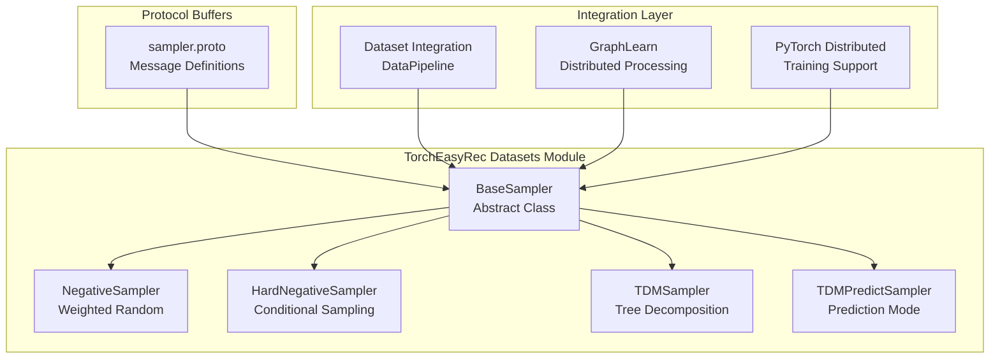
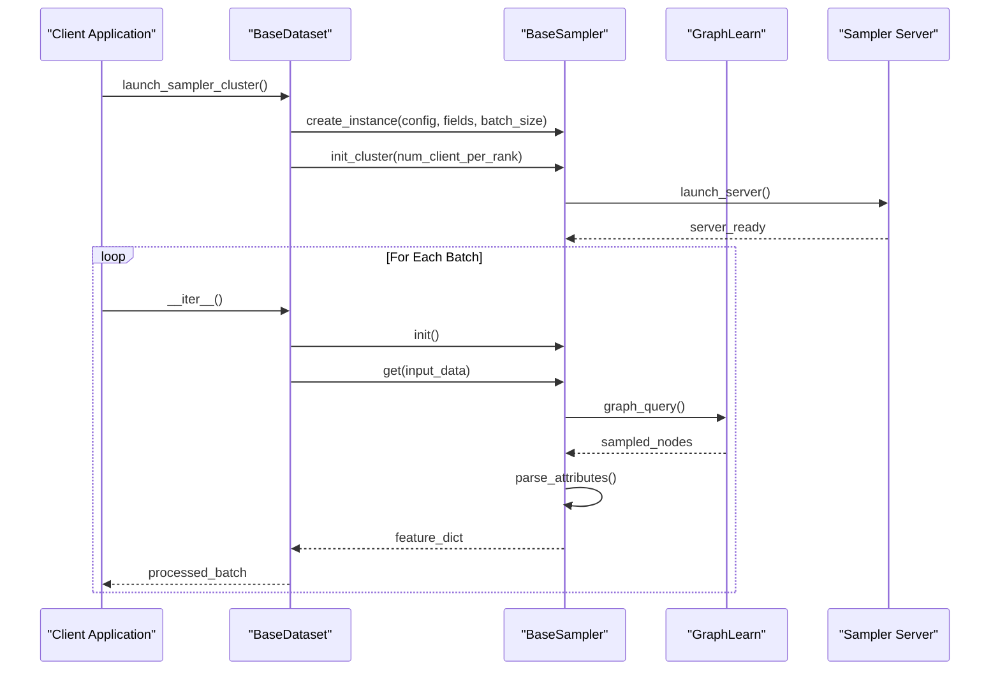
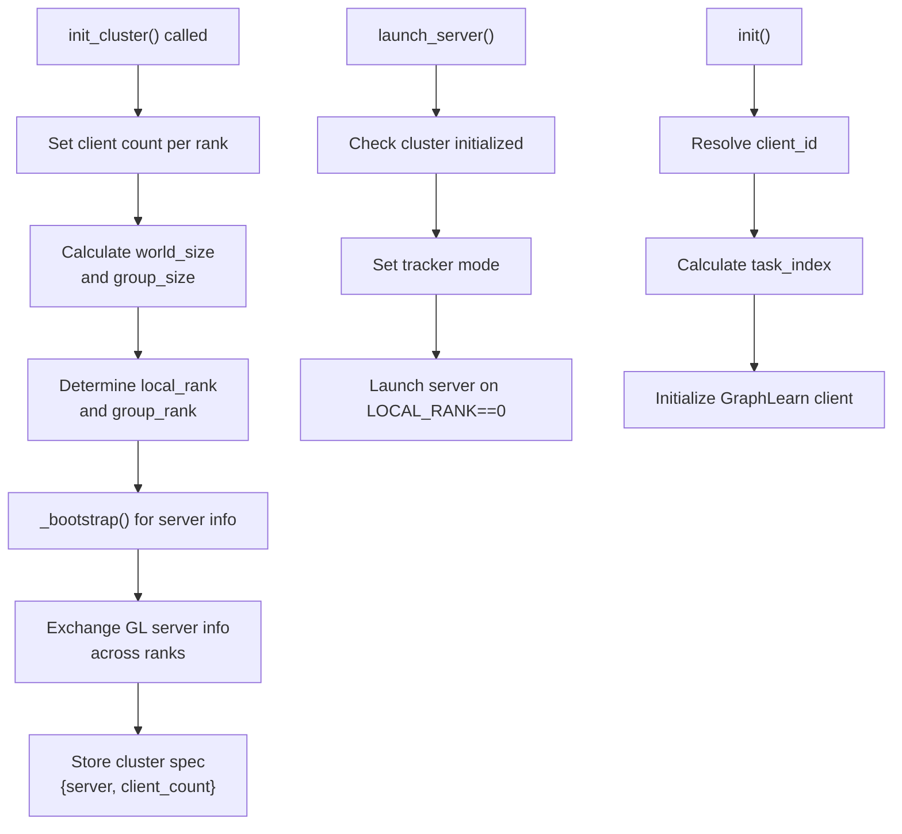
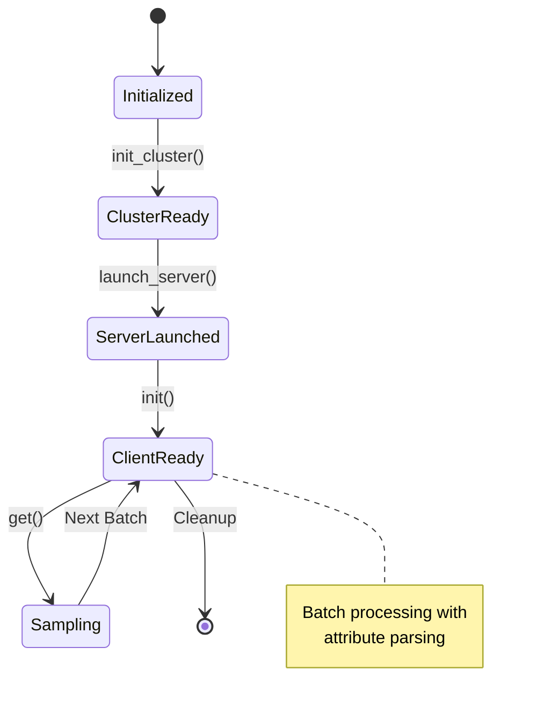
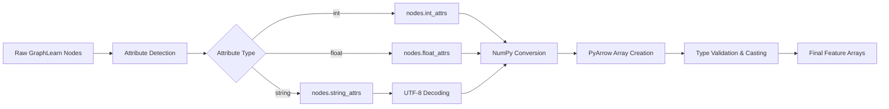
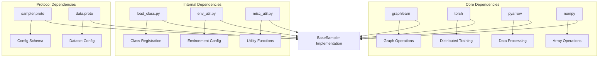

# BaseSampler Abstract Class

<cite>
**Referenced Files in This Document**
- [sampler.py](file://tzrec/datasets/sampler.py)
- [sampler.proto](file://tzrec/protos/sampler.proto)
- [dataset.py](file://tzrec/datasets/dataset.py)
- [sampler_test.py](file://tzrec/datasets/sampler_test.py)
- [load_class.py](file://tzrec/utils/load_class.py)
- [env_util.py](file://tzrec/utils/env_util.py)
- [misc_util.py](file://tzrec/utils/misc_util.py)
</cite>

## Table of Contents

1. [Introduction](#introduction)
1. [Project Structure](#project-structure)
1. [Core Components](#core-components)
1. [Architecture Overview](#architecture-overview)
1. [Detailed Component Analysis](#detailed-component-analysis)
1. [Dependency Analysis](#dependency-analysis)
1. [Performance Considerations](#performance-considerations)
1. [Troubleshooting Guide](#troubleshooting-guide)
1. [Conclusion](#conclusion)

## Introduction

The BaseSampler abstract class serves as the foundational interface for all sampling strategies in TorchEasyRec's graph learning pipeline. It provides a unified abstraction for negative sampling, hard negative sampling, and Tree-Structured Decomposition (TDM) sampling, enabling flexible and efficient data preparation for recommendation systems and graph neural networks.

BaseSampler integrates seamlessly with GraphLearn for distributed graph processing and PyTorch's distributed training capabilities. The class handles complex scenarios including multi-value attribute parsing, sparse feature handling, and sophisticated sampling strategies with configurable expansion factors and probability distributions.

## Project Structure

The BaseSampler implementation is organized within the datasets module, alongside protocol buffer definitions and integration utilities:

**Diagram sources**

- \[sampler.py\](file://tzrec/datasets/sampler.py#L219-L395)
- \[sampler.proto\](file://tzrec/protos/sampler.proto#L1-L142)

**Section sources**

- \[sampler.py\](file://tzrec/datasets/sampler.py#L1-L1055)
- \[sampler.proto\](file://tzrec/protos/sampler.proto#L1-L142)

## Core Components

### BaseSampler Abstract Interface

The BaseSampler class defines the fundamental contract for all sampling implementations:

**Initialization Parameters:**

- `config`: SAMPLER_CFG_TYPES - Protocol buffer configuration containing sampling parameters
- `fields`: List[pa.Field] - Arrow field definitions for input data schema
- `batch_size`: int - Mini-batch size for training/inference
- `is_training`: bool - Training vs evaluation mode flag
- `multival_sep`: str - Multi-value separator character (default: chr(29))
- `typed_fields`: Optional\[List[pa.Field]\] - Typed field definitions for structured parsing

**Key Attributes:**

- `_batch_size`: Configured batch size for sampling operations
- `_multival_sep`: Multi-value separator for parsing composite features
- `_num_sample`: Maximum number of samples per batch
- `_cluster`: Cluster specification for distributed processing
- `_attr_names`: Names of parsed attributes
- `_attr_types`: PyArrow types for each attribute
- `_attr_gl_types`: GraphLearn compatible types
- `_attr_np_types`: NumPy types for conversion

**Section sources**

- \[sampler.py\](file://tzrec/datasets/sampler.py#L219-L286)

### Attribute Handling System

BaseSampler implements sophisticated attribute parsing with support for:

- Mixed data types (int, float, string)
- Structured parsing for lists and maps
- Multi-value field separation
- Type casting and validation
- Ignored attribute handling

The attribute system automatically detects and converts between PyArrow, NumPy, and GraphLearn type systems, ensuring seamless integration across the data pipeline.

**Section sources**

- \[sampler.py\](file://tzrec/datasets/sampler.py#L244-L277)
- \[sampler.py\](file://tzrec/datasets/sampler.py#L330-L390)

## Architecture Overview

The BaseSampler architecture follows a layered approach combining GraphLearn integration, distributed computing, and PyTorch compatibility:

**Diagram sources**

- \[dataset.py\](file://tzrec/datasets/dataset.py#L241-L315)
- \[sampler.py\](file://tzrec/datasets/sampler.py#L287-L324)

## Detailed Component Analysis

### Cluster Initialization System

BaseSampler implements a robust cluster initialization system for distributed graph processing:

**Diagram sources**

- \[sampler.py\](file://tzrec/datasets/sampler.py#L81-L126)
- \[sampler.py\](file://tzrec/datasets/sampler.py#L287-L324)

The cluster system supports:

- Multi-node distributed training
- Client-per-rank scaling
- Automatic port allocation
- Cross-process communication coordination

**Section sources**

- \[sampler.py\](file://tzrec/datasets/sampler.py#L81-L126)
- \[sampler.py\](file://tzrec/datasets/sampler.py#L287-L324)

### Distributed Training Support

BaseSampler integrates with PyTorch's distributed training framework:

**Environment Variables:**

- `WORLD_SIZE`: Total number of processes
- `LOCAL_WORLD_SIZE`: Processes per node
- `LOCAL_RANK`: Local rank within node
- `GROUP_RANK`: Node group identifier
- `RANK`: Global process rank

**Process Coordination:**

- Automatic client ID assignment
- Task index calculation for GraphLearn
- Worker-aware initialization
- Graceful timeout handling

**Section sources**

- \[sampler.py\](file://tzrec/datasets/sampler.py#L119-L126)
- \[sampler.py\](file://tzrec/datasets/sampler.py#L309-L324)

### GraphLearn Integration Patterns

BaseSampler leverages GraphLearn for efficient graph operations:

**Core Integration Points:**

- Graph construction from file paths
- Decoder configuration for attribute parsing
- Sampler creation for different strategies
- Distributed graph loading

**Supported Strategies:**

- Weighted random sampling
- Conditional sampling based on relationships
- Hierarchical tree traversal
- Sparse neighbor sampling

**Section sources**

- \[sampler.py\](file://tzrec/datasets/sampler.py#L421-L440)
- \[sampler.py\](file://tzrec/datasets/sampler.py#L517-L520)

### Sampling Lifecycle Management

The complete sampling lifecycle follows a structured progression:

**Section sources**

- \[sampler.py\](file://tzrec/datasets/sampler.py#L309-L324)
- \[sampler.py\](file://tzrec/datasets/sampler.py#L330-L356)

### Concrete Sampler Implementations

#### NegativeSampler

Implements weighted random sampling of items not present in the current batch:

**Key Features:**

- Single graph node sampling
- Weighted selection based on node weights
- Configurable attribute fields
- Batch padding for uniform processing

**Section sources**

- \[sampler.py\](file://tzrec/datasets/sampler.py#L397-L462)

#### HardNegativeSampler

Extends negative sampling with hard negative examples:

**Enhanced Capabilities:**

- Dual sampling strategy (negative + hard negatives)
- Sparse neighbor sampling for hard negatives
- Index tracking for hard negative identification
- Combined feature concatenation

**Section sources**

- \[sampler.py\](file://tzrec/datasets/sampler.py#L555-L649)

#### TDMSampler

Implements Tree-Structured Decomposition sampling:

**Advanced Features:**

- Hierarchical tree traversal
- Layer-wise sampling with configurable expansion
- Probability-based layer retention
- Training and prediction modes

**Section sources**

- \[sampler.py\](file://tzrec/datasets/sampler.py#L753-L966)

### Attribute Parsing System

BaseSampler implements sophisticated attribute parsing with type safety:

**Diagram sources**

- \[sampler.py\](file://tzrec/datasets/sampler.py#L330-L356)

**Section sources**

- \[sampler.py\](file://tzrec/datasets/sampler.py#L330-L390)

## Dependency Analysis

BaseSampler has strategic dependencies that enable its comprehensive functionality:

**Diagram sources**

- \[sampler.py\](file://tzrec/datasets/sampler.py#L12-L35)
- \[load_class.py\](file://tzrec/utils/load_class.py#L117-L145)

**Section sources**

- \[sampler.py\](file://tzrec/datasets/sampler.py#L12-L35)
- \[load_class.py\](file://tzrec/utils/load_class.py#L117-L145)

## Performance Considerations

### Memory Management

BaseSampler implements several memory optimization strategies:

**Efficient Data Structures:**

- Resizable arrays for dynamic sampling results
- Batch-aware padding to minimize reallocation
- Lazy evaluation of expensive operations
- Proper cleanup in destructor

**Memory Optimization Techniques:**

- Reshape operations to avoid copies
- Type-specific conversions to reduce overhead
- Sparse matrix handling for neighbor sampling
- Controlled batch size management

### Performance Characteristics

**Time Complexity:**

- Sampling operations: O(k × log n) where k is sample count and n is graph size
- Attribute parsing: O(m × n) where m is attribute count and n is sample size
- Multi-value parsing: O(p × n) where p is average values per sample

**Space Complexity:**

- Sample storage: O(k × f) where f is average feature size
- Intermediate buffers: O(k × g) where g is graph connectivity
- Attribute arrays: O(n × t) where t is type size

### Scalability Features

**Horizontal Scaling:**

- Client-per-rank distribution
- Automatic load balancing
- Graceful degradation on failures
- Configurable expansion factors

**Vertical Scaling:**

- Adjustable batch sizes
- Configurable sample counts
- Optimized data types
- Efficient memory pooling

## Troubleshooting Guide

### Common Initialization Issues

**Cluster Initialization Failures:**

- Verify environment variables are set correctly
- Check network connectivity between nodes
- Ensure port availability for server binding
- Validate distributed backend initialization

**Memory Allocation Problems:**

- Monitor GPU/CPU memory usage during sampling
- Adjust batch sizes for memory-constrained environments
- Enable proper cleanup in destructors
- Use appropriate data types to reduce memory footprint

**Section sources**

- \[sampler.py\](file://tzrec/datasets/sampler.py#L326-L328)
- \[misc_util.py\](file://tzrec/utils/misc_util.py#L65-L72)

### Configuration Validation

**Protocol Buffer Validation:**

- Ensure all required fields are present
- Validate data types match field definitions
- Check attribute field names exist in schema
- Verify sampling parameters are within bounds

**Environment Configuration:**

- Confirm USE_HASH_NODE_ID setting matches graph data
- Verify distributed training environment variables
- Check GraphLearn configuration compatibility
- Validate multi-value separator consistency

**Section sources**

- \[sampler.proto\](file://tzrec/protos/sampler.proto#L1-L142)
- \[env_util.py\](file://tzrec/utils/env_util.py#L19-L22)

### Debugging Techniques

**Logging and Monitoring:**

- Enable detailed logging for sampling operations
- Monitor GraphLearn server status
- Track memory usage patterns
- Profile sampling performance bottlenecks

**Testing Strategies:**

- Unit testing with small datasets
- Distributed testing with multiple processes
- Performance benchmarking with synthetic data
- Integration testing with full pipeline

**Section sources**

- \[sampler_test.py\](file://tzrec/datasets/sampler_test.py#L1-L686)

## Conclusion

BaseSampler provides a comprehensive and extensible foundation for sampling strategies in TorchEasyRec. Its design balances flexibility with performance, supporting complex graph learning scenarios while maintaining ease of use for developers extending the framework.

The class successfully integrates multiple technologies including GraphLearn for distributed graph processing, PyTorch for machine learning workflows, and sophisticated data parsing systems. Its modular architecture enables easy extension for custom sampling strategies while maintaining compatibility with existing implementations.

Key strengths include robust distributed training support, efficient memory management, comprehensive type system integration, and extensive testing coverage. These features make BaseSampler an ideal foundation for production-scale recommendation systems and graph neural network applications.

Future enhancements could include additional sampling strategies, improved performance monitoring, and expanded integration with emerging distributed computing frameworks.
