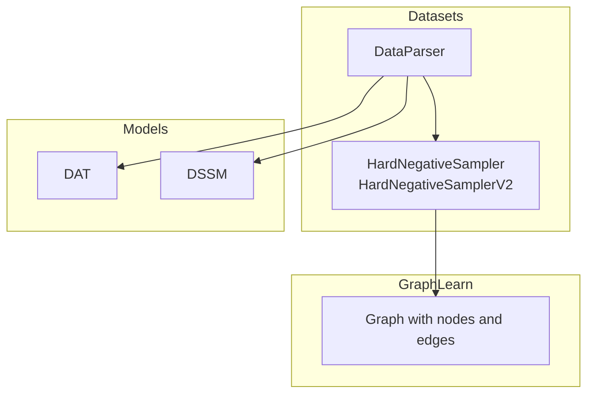
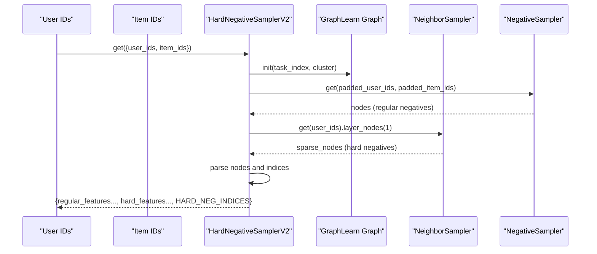
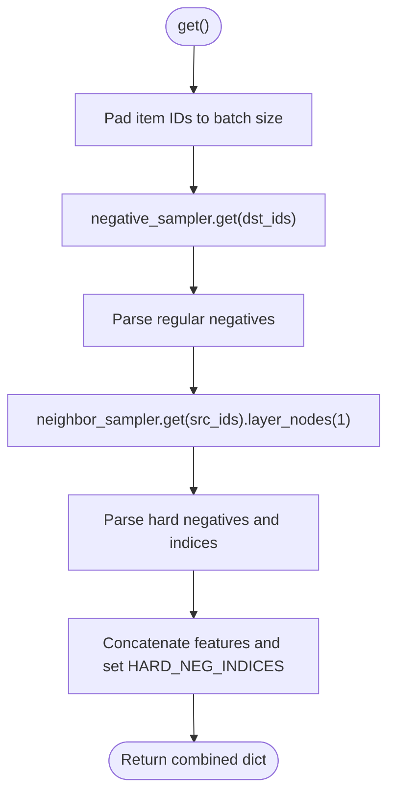
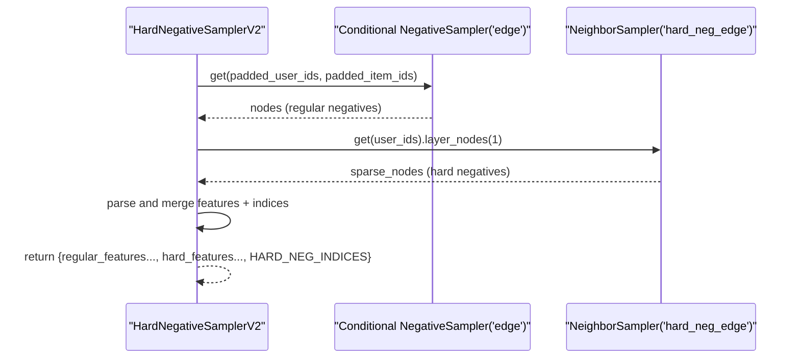
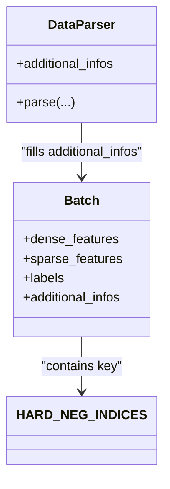
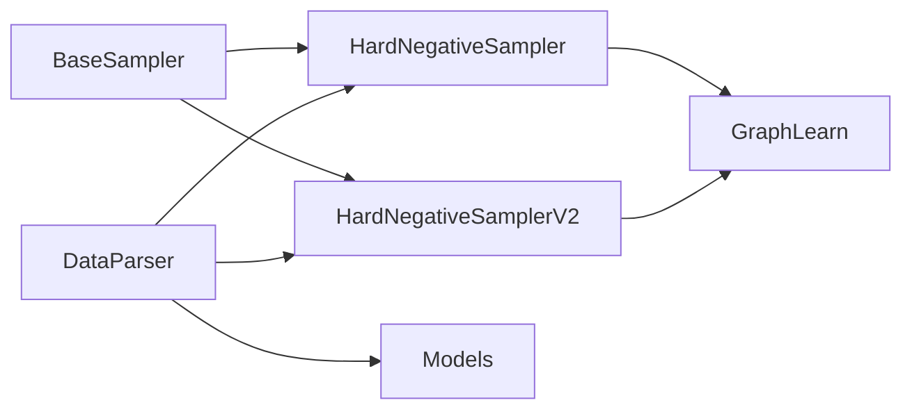

# Hard Negative Sampling

<cite>
**Referenced Files in This Document**
- [sampler.py](file://tzrec/datasets/sampler.py)
- [sampler_test.py](file://tzrec/datasets/sampler_test.py)
- [sampler_pb2.pyi](file://tzrec/protos/sampler_pb2.pyi)
- [utils.py](file://tzrec/datasets/utils.py)
- [data_parser.py](file://tzrec/datasets/data_parser.py)
- [dat_test.py](file://tzrec/models/dat_test.py)
- [dssm_test.py](file://tzrec/models/dssm_test.py)
</cite>

## Table of Contents

1. [Introduction](#introduction)
1. [Project Structure](#project-structure)
1. [Core Components](#core-components)
1. [Architecture Overview](#architecture-overview)
1. [Detailed Component Analysis](#detailed-component-analysis)
1. [Dependency Analysis](#dependency-analysis)
1. [Performance Considerations](#performance-considerations)
1. [Troubleshooting Guide](#troubleshooting-guide)
1. [Conclusion](#conclusion)
1. [Appendices](#appendices)

## Introduction

This document explains TorchEasyRec’s hard negative sampling implementations, focusing on HardNegativeSampler and HardNegativeSamplerV2. These samplers combine standard negative sampling with hard negative examples extracted from predefined hard_neg_edge relationships. They integrate with GraphLearn’s neighbor sampling to produce combined sampling results, expose HARD_NEG_INDICES to downstream models, and support configurable ratios between regular and hard negatives. We also cover configuration requirements, performance optimization, memory considerations, and best practices for incorporating hard negatives into recommendation systems.

## Project Structure

Hard negative sampling is implemented in the datasets module and integrated with the data parsing pipeline and models:

- HardNegativeSampler and HardNegativeSamplerV2 live in the sampler module and construct GraphLearn graphs with user/item nodes and hard_neg_edge edges.
- The data parser reads sampler outputs and forwards HARD_NEG_INDICES to models.
- Models (e.g., DAT, DSSM) consume HARD_NEG_INDICES to incorporate hard negatives into training dynamics.

**Diagram sources**

- \[sampler.py\](file://tzrec/datasets/sampler.py#L555-L750)
- \[data_parser.py\](file://tzrec/datasets/data_parser.py#L456-L461)

**Section sources**

- \[sampler.py\](file://tzrec/datasets/sampler.py#L555-L750)
- \[data_parser.py\](file://tzrec/datasets/data_parser.py#L456-L461)

## Core Components

- HardNegativeSampler: Builds a GraphLearn graph with user and item nodes plus a hard_neg_edge relation. It initializes a negative sampler and a neighbor sampler over hard_neg_edge, then merges results with HARD_NEG_INDICES.
- HardNegativeSamplerV2: Extends the approach by adding a pos_edge_input_path to conditionally sample negatives and still sample hard negatives via neighbor sampling over hard_neg_edge.
- HARD_NEG_INDICES: A string key indicating indices of hard negative items appended after regular negatives.

Key behaviors:

- Sampling ratio: num_sample controls regular negatives; num_hard_sample controls hard negatives per user.
- Combined results: Regular negatives are followed by hard negatives; HARD_NEG_INDICES marks where hard negatives start.
- Estimation: estimated_sample_num accounts for both regular and hard negatives.

**Section sources**

- \[sampler.py\](file://tzrec/datasets/sampler.py#L555-L750)
- \[utils.py\](file://tzrec/datasets/utils.py#L32-L32)

## Architecture Overview

The hard negative sampling pipeline integrates GraphLearn’s graph primitives with TorchEasyRec’s data pipeline and models.

**Diagram sources**

- \[sampler.py\](file://tzrec/datasets/sampler.py#L709-L745)

## Detailed Component Analysis

### HardNegativeSampler

- Graph construction: Adds user and item nodes and a hard_neg_edge edge.
- Initialization: Creates a negative sampler over item nodes and a neighbor sampler over hard_neg_edge.
- Sampling: Pads item IDs to batch size, samples negatives, then samples neighbors from hard_neg_edge; concatenates features and sets HARD_NEG_INDICES when present.

**Diagram sources**

- \[sampler.py\](file://tzrec/datasets/sampler.py#L619-L643)

**Section sources**

- \[sampler.py\](file://tzrec/datasets/sampler.py#L555-L649)

### HardNegativeSamplerV2

- Graph construction: Adds user, item nodes, a pos_edge relation, and a hard_neg_edge relation.
- Initialization: Creates a conditional negative sampler over the pos_edge relation and a neighbor sampler over hard_neg_edge.
- Sampling: Pads both user and item IDs to batch size, samples negatives conditioned on positive edges, then samples hard negatives; concatenates features and sets HARD_NEG_INDICES.

**Diagram sources**

- \[sampler.py\](file://tzrec/datasets/sampler.py#L709-L745)

**Section sources**

- \[sampler.py\](file://tzrec/datasets/sampler.py#L651-L750)

### Configuration Requirements

- HardNegativeSampler:
  - user_input_path, item_input_path, hard_neg_edge_input_path
  - num_sample, num_hard_sample, attr_fields, item_id_field, user_id_field, attr_delimiter
- HardNegativeSamplerV2:
  - user_input_path, item_input_path, pos_edge_input_path, hard_neg_edge_input_path
  - num_sample, num_hard_sample, attr_fields, item_id_field, user_id_field, attr_delimiter

These fields are defined in the protobuf descriptors.

**Section sources**

- \[sampler_pb2.pyi\](file://tzrec/protos/sampler_pb2.pyi#L52-L104)

### Integration with Data Parsing and Models

- DataParser: Detects sampler_type and forwards HARD_NEG_INDICES to the model batch.
- Models: Use HARD_NEG_INDICES to split features into base and negative groups and to compute losses that leverage hard negatives.

**Diagram sources**

- \[data_parser.py\](file://tzrec/datasets/data_parser.py#L456-L461)
- \[utils.py\](file://tzrec/datasets/utils.py#L32-L32)

**Section sources**

- \[data_parser.py\](file://tzrec/datasets/data_parser.py#L456-L461)
- \[utils.py\](file://tzrec/datasets/utils.py#L32-L32)
- \[dat_test.py\](file://tzrec/models/dat_test.py#L234-L247)
- \[dssm_test.py\](file://tzrec/models/dssm_test.py#L208-L221)

## Dependency Analysis

- HardNegativeSampler/HardNegativeSamplerV2 depend on GraphLearn for graph construction and sampling.
- Both samplers inherit from BaseSampler, which manages cluster initialization, server launching, and attribute parsing.
- DataParser depends on sampler_type to route HARD_NEG_INDICES to models.

**Diagram sources**

- \[sampler.py\](file://tzrec/datasets/sampler.py#L219-L395)
- \[sampler.py\](file://tzrec/datasets/sampler.py#L555-L750)
- \[data_parser.py\](file://tzrec/datasets/data_parser.py#L456-L461)

**Section sources**

- \[sampler.py\](file://tzrec/datasets/sampler.py#L219-L395)
- \[sampler.py\](file://tzrec/datasets/sampler.py#L555-L750)
- \[data_parser.py\](file://tzrec/datasets/data_parser.py#L456-L461)

## Performance Considerations

- Expand factor: num_sample is divided by batch_size to compute an integer expand_factor for negative sampling; ensure num_sample aligns with batch_size to avoid unnecessary padding overhead.
- Estimated sample size: estimated_sample_num adds a term proportional to min(num_hard_sample, 8) * batch_size, which impacts memory footprint during parsing and model forward passes.
- Neighbor sampling: neighbor_sampler with strategy "full" retrieves up to num_hard_sample per user; tune num_hard_sample to balance signal vs. compute.
- Conditional negative sampling (V2): negative_sampler with strategy "random" and conditional=True reduces sampling to non-positive edges, potentially lowering contention and improving relevance.

[No sources needed since this section provides general guidance]

## Troubleshooting Guide

Common issues and resolutions:

- Empty hard_neg_edge input:
  - Symptom: No hard negatives appended; HARD_NEG_INDICES missing or empty.
  - Behavior verified by tests that assert smaller output sizes when edges are empty.
- Incorrect ID types:
  - Symptom: Hashed node IDs mismatch or casting errors.
  - Resolution: Enable USE_HASH_NODE_ID environment variable when using hashed IDs; BaseSampler respects hash mode via environment.
- Cluster initialization failures:
  - Symptom: launch_server/init asserts fail due to uninitialized cluster.
  - Resolution: Call init_cluster and launch_server before init.
- Attribute parsing mismatches:
  - Symptom: Unknown attr type or shape errors.
  - Resolution: Ensure attr_fields match declared node attributes and types.

**Section sources**

- \[sampler_test.py\](file://tzrec/datasets/sampler_test.py#L421-L482)
- \[sampler_test.py\](file://tzrec/datasets/sampler_test.py#L483-L543)
- \[sampler.py\](file://tzrec/datasets/sampler.py#L287-L325)
- \[sampler.py\](file://tzrec/datasets/sampler.py#L330-L389)

## Conclusion

HardNegativeSampler and HardNegativeSamplerV2 provide a robust dual-sampling mechanism that blends standard negatives with hard negatives derived from dedicated relations. Their integration with GraphLearn enables scalable neighbor sampling, while HARD_NEG_INDICES allows models to treat hard negatives distinctly. Proper configuration, tuning of sampling ratios, and awareness of memory and performance trade-offs are essential for effective deployment in recommendation systems.

## Appendices

### Configuration Examples and Best Practices

- Build hard_neg_edge from observed negative interactions (e.g., non-clicks) to capture challenging negatives.
- Prefer HardNegativeSamplerV2 when you want to exclude positive edges from regular negatives (conditional sampling).
- Tune num_sample and num_hard_sample to maintain a balanced training signal; monitor estimated_sample_num to manage memory.
- Use attribute fields consistently across user/item nodes and edges to avoid ignored attributes warnings.

[No sources needed since this section provides general guidance]
