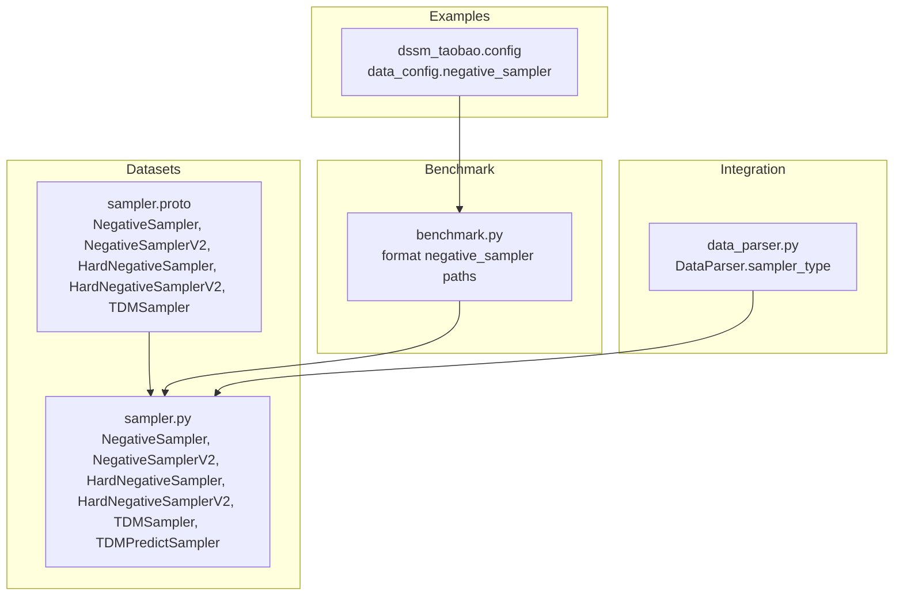
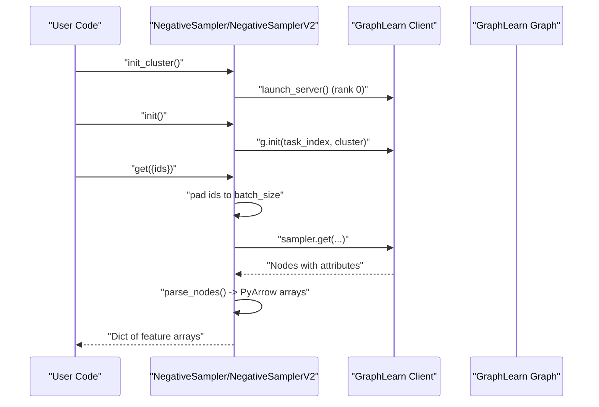
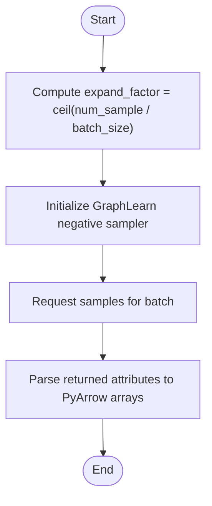
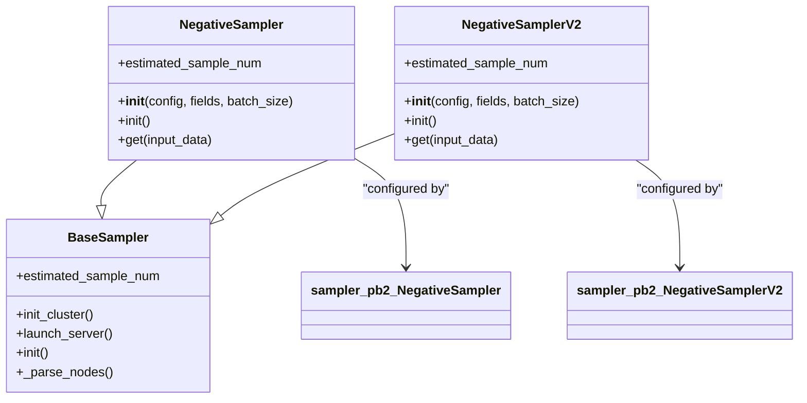

# Negative Sampling Strategies

<cite>
**Referenced Files in This Document**
- [sampler.py](file://tzrec/datasets/sampler.py)
- [sampler.proto](file://tzrec/protos/sampler.proto)
- [sampler_test.py](file://tzrec/datasets/sampler_test.py)
- [dssm_taobao.config](file://examples/dssm_taobao.config)
- [benchmark.py](file://tzrec/benchmark/benchmark.py)
- [data_parser.py](file://tzrec/datasets/data_parser.py)
</cite>

## Table of Contents

1. [Introduction](#introduction)
1. [Project Structure](#project-structure)
1. [Core Components](#core-components)
1. [Architecture Overview](#architecture-overview)
1. [Detailed Component Analysis](#detailed-component-analysis)
1. [Dependency Analysis](#dependency-analysis)
1. [Performance Considerations](#performance-considerations)
1. [Troubleshooting Guide](#troubleshooting-guide)
1. [Conclusion](#conclusion)

## Introduction

This document explains TorchEasyRec’s negative sampling implementations with a focus on NegativeSampler and NegativeSamplerV2. It details the weighted random sampling approach for generating negative items that are not present in the current batch, clarifies the differences between the two versions, and documents configuration options and use cases. It also covers GraphLearn integration for efficient sampling, the sampling expansion factor calculation, and conditional sampling based on user-item relationships. Practical examples show how to configure negative sampling for different recommendation scenarios, how to optimize performance, and how to mitigate sampling bias and troubleshoot quality issues.

## Project Structure

The negative sampling logic is implemented in the datasets module and configured via protocol buffers. Tests demonstrate usage patterns and integration with training pipelines.

**Diagram sources**

- \[sampler.py\](file://tzrec/datasets/sampler.py#L397-L553)
- \[sampler.proto\](file://tzrec/protos/sampler.proto#L4-L51)
- \[dssm_taobao.config\](file://examples/dssm_taobao.config#L29-L41)
- \[benchmark.py\](file://tzrec/benchmark/benchmark.py#L89-L110)
- \[data_parser.py\](file://tzrec/datasets/data_parser.py#L70-L102)

**Section sources**

- \[sampler.py\](file://tzrec/datasets/sampler.py#L1-L120)
- \[sampler.proto\](file://tzrec/protos/sampler.proto#L1-L142)
- \[dssm_taobao.config\](file://examples/dssm_taobao.config#L29-L41)
- \[benchmark.py\](file://tzrec/benchmark/benchmark.py#L89-L110)
- \[data_parser.py\](file://tzrec/datasets/data_parser.py#L70-L102)

## Core Components

- NegativeSampler: Weighted random sampling of items not present in the current batch. Uses GraphLearn node-weighted sampling.
- NegativeSamplerV2: Conditional weighted random sampling of items that do not share a positive edge with the user. Uses GraphLearn edge-based negative sampling with conditional strategy.

Key shared capabilities:

- GraphLearn-backed sampling with configurable attributes and field delimiters.
- Cluster initialization and server launching for distributed sampling.
- Attribute parsing and conversion to PyArrow arrays.
- Estimated sample count reporting for planning and monitoring.

**Section sources**

- \[sampler.py\](file://tzrec/datasets/sampler.py#L397-L462)
- \[sampler.py\](file://tzrec/datasets/sampler.py#L464-L553)

## Architecture Overview

Both samplers build a GraphLearn graph and initialize a client-side sampler. They pad input IDs to the batch size, request negative samples, and parse returned attributes into PyArrow arrays.

**Diagram sources**

- \[sampler.py\](file://tzrec/datasets/sampler.py#L287-L325)
- \[sampler.py\](file://tzrec/datasets/sampler.py#L434-L456)
- \[sampler.py\](file://tzrec/datasets/sampler.py#L514-L547)

## Detailed Component Analysis

### NegativeSampler

Purpose:

- Sample negative items whose IDs are not present in the current batch.
- Uses GraphLearn node-weighted sampling.

Key behaviors:

- Builds a GraphLearn graph with an item node table and decoders supporting weighted attributes.
- Initializes a node-weighted negative sampler with an expansion factor computed from num_sample and batch_size.
- Parses returned node attributes into PyArrow arrays according to configured attr_fields.

Configuration options (from proto):

- input_path: Path to item node table with id, weight, attrs.
- num_sample: Number of negative samples per batch.
- attr_fields: Names of attributes to fetch.
- item_id_field: Name of the item ID column.
- attr_delimiter: Delimiter for attributes string.
- num_eval_sample: Overrides num_sample during evaluation.
- field_delimiter: Global field delimiter for input.

Expansion factor:

- expand_factor = ceil(num_sample / batch_size)

Usage example (training config):

- Configure data_config.negative_sampler in the pipeline config with input_path, num_sample, attr_fields, item_id_field, and attr_delimiter.

**Section sources**

- \[sampler.py\](file://tzrec/datasets/sampler.py#L397-L462)
- \[sampler.proto\](file://tzrec/protos/sampler.proto#L4-L23)
- \[dssm_taobao.config\](file://examples/dssm_taobao.config#L29-L41)

### NegativeSamplerV2

Purpose:

- Sample negative items that do not share a positive edge with the user.
- Conditional sampling ensures the negative item is not connected to the user via the positive edge set.

Key behaviors:

- Builds a GraphLearn graph with user and item nodes and a positive edge table.
- Initializes an edge-based negative sampler with strategy "random" and conditional=True.
- Expansion factor computed similarly to NegativeSampler.
- Includes a warm-up call to avoid GL timeouts.

Configuration options (from proto):

- user_input_path: User node table with id, weight.
- item_input_path: Item node table with id, weight, attrs.
- pos_edge_input_path: Positive edge table with user, item, weight.
- num_sample: Number of negative samples per batch.
- attr_fields: Attributes to fetch.
- item_id_field, user_id_field: Field names for IDs.
- attr_delimiter, num_eval_sample, field_delimiter.

Expansion factor:

- expand_factor = ceil(num_sample / batch_size)

Conditional sampling:

- strategy="random" combined with conditional=True ensures the returned item is not linked to the user by a positive edge.

**Section sources**

- \[sampler.py\](file://tzrec/datasets/sampler.py#L464-L553)
- \[sampler.proto\](file://tzrec/protos/sampler.proto#L26-L51)

### Differences Between NegativeSampler and NegativeSamplerV2

- Scope:
  - NegativeSampler: Items not present in the batch.
  - NegativeSamplerV2: Items not connected to the user by a positive edge.
- Graph structure:
  - NegativeSampler: Single item node table.
  - NegativeSamplerV2: User and item nodes plus a positive edge table.
- Strategy:
  - NegativeSampler: node_weight.
  - NegativeSamplerV2: random with conditional=True.

Use cases:

- NegativeSampler: General negative sampling when batch exclusion is sufficient.
- NegativeSamplerV2: Pairwise models or ranking models where edges indicate positive interactions and must be avoided in negatives.

**Section sources**

- \[sampler.py\](file://tzrec/datasets/sampler.py#L434-L462)
- \[sampler.py\](file://tzrec/datasets/sampler.py#L514-L553)

### GraphLearn Integration and Cluster Setup

- Cluster bootstrap:
  - \_bootstrap computes a server address string across ranks and clients.
  - \_get_cluster_spec derives WORLD_SIZE, LOCAL_WORLD_SIZE, GROUP_RANK, and constructs server/client spec.
- Server lifecycle:
  - launch_server invoked by rank 0 worker to start the GraphLearn server.
  - init initializes the client with task_index derived from RANK, client_id, and client_id_bias.
- Timeout mitigation:
  - NegativeSamplerV2 adds a randomized sleep and a warm-up get call to reduce GL timeouts.

**Section sources**

- \[sampler.py\](file://tzrec/datasets/sampler.py#L81-L126)
- \[sampler.py\](file://tzrec/datasets/sampler.py#L302-L325)
- \[sampler.py\](file://tzrec/datasets/sampler.py#L522-L529)

### Sampling Expansion Factor Calculation

- Both samplers compute expand_factor = ceil(num_sample / batch_size).
- This controls how many samples GraphLearn attempts per request to meet the target num_sample.

**Diagram sources**

- \[sampler.py\](file://tzrec/datasets/sampler.py#L437-L440)
- \[sampler.py\](file://tzrec/datasets/sampler.py#L517-L520)

**Section sources**

- \[sampler.py\](file://tzrec/datasets/sampler.py#L437-L440)
- \[sampler.py\](file://tzrec/datasets/sampler.py#L517-L520)

### Conditional Sampling Based on User-Item Relationships

- NegativeSamplerV2 uses conditional=True to ensure the sampled item does not share a positive edge with the user.
- The get method pads both user and item IDs to the batch size and passes them to the conditional sampler.

**Section sources**

- \[sampler.py\](file://tzrec/datasets/sampler.py#L518-L520)
- \[sampler.py\](file://tzrec/datasets/sampler.py#L540-L547)

### Practical Configuration Examples

- Basic negative sampling (example config):
  - data_config.negative_sampler with input_path, num_sample, attr_fields, item_id_field, attr_delimiter.
- Training pipeline integration:
  - benchmark.py formats ODPS table paths in negative_sampler and related configs.

**Section sources**

- \[dssm_taobao.config\](file://examples/dssm_taobao.config#L29-L41)
- \[benchmark.py\](file://tzrec/benchmark/benchmark.py#L89-L110)

### Testing and Validation

- Unit tests demonstrate:
  - Correct estimated_sample_num.
  - Cluster initialization, server launch, and sampler initialization.
  - get returns arrays of length equal to num_sample.
- Tests cover both int64 and string node IDs, including hash node ID mode.

**Section sources**

- \[sampler_test.py\](file://tzrec/datasets/sampler_test.py#L163-L200)
- \[sampler_test.py\](file://tzrec/datasets/sampler_test.py#L374-L408)

## Dependency Analysis

- NegativeSampler depends on:
  - GraphLearn Graph with item node table and weighted attributes.
  - BaseSampler for cluster setup, parsing, and PyArrow conversions.
- NegativeSamplerV2 depends on:
  - GraphLearn Graph with user and item nodes and a positive edge table.
  - BaseSampler for cluster setup and parsing.
- Protocol buffer messages define the configuration schema for both samplers.

**Diagram sources**

- \[sampler.py\](file://tzrec/datasets/sampler.py#L219-L395)
- \[sampler.py\](file://tzrec/datasets/sampler.py#L397-L553)
- \[sampler.proto\](file://tzrec/protos/sampler.proto#L4-L51)

**Section sources**

- \[sampler.py\](file://tzrec/datasets/sampler.py#L219-L395)
- \[sampler.py\](file://tzrec/datasets/sampler.py#L397-L553)
- \[sampler.proto\](file://tzrec/protos/sampler.proto#L4-L51)

## Performance Considerations

- Expansion factor tuning:
  - Increase num_sample to improve diversity; ensure batch_size accommodates the desired number of negatives.
  - expand_factor = ceil(num_sample / batch_size) affects GraphLearn sampling throughput.
- Distributed setup:
  - Use init_cluster with appropriate num_client_per_rank and client_id_bias to balance load across workers.
  - Warm-up calls in NegativeSamplerV2 reduce GL timeouts in multi-worker environments.
- Attribute parsing:
  - Limit attr_fields to necessary features to reduce overhead.
  - Ensure attr_delimiter and field_delimiter match data formats to avoid parsing errors.
- Evaluation sampling:
  - Use num_eval_sample to reduce cost during evaluation while maintaining representative negatives.

[No sources needed since this section provides general guidance]

## Troubleshooting Guide

Common issues and resolutions:

- GL timeout or connection failures:
  - Ensure launch_server runs on rank 0 and init is called after cluster setup.
  - NegativeSamplerV2 includes a warm-up get call; verify it executes in multi-worker setups.
- Incorrect attribute types or missing fields:
  - Verify attr_fields exist in the node table or typed_fields; otherwise, attributes are ignored with warnings.
  - Confirm attr_delimiter and field_delimiter align with the data schema.
- Hash node IDs:
  - When USE_HASH_NODE_ID is enabled, GraphLearn uses hashed IDs; ensure item_id_field and user_id_field reflect the correct schema.
- Evaluation performance:
  - Reduce num_eval_sample to lower sampling cost during evaluation.
- Bias mitigation:
  - Prefer NegativeSamplerV2 for pairwise models to avoid sampling items already positively associated with the user.
  - Adjust num_sample and attr_fields to include diverse item features.

**Section sources**

- \[sampler.py\](file://tzrec/datasets/sampler.py#L287-L325)
- \[sampler.py\](file://tzrec/datasets/sampler.py#L522-L529)
- \[sampler_test.py\](file://tzrec/datasets/sampler_test.py#L163-L200)

## Conclusion

NegativeSampler and NegativeSamplerV2 provide robust, GraphLearn-backed negative sampling for recommendation systems. NegativeSampler focuses on excluding items present in the batch, while NegativeSamplerV2 enforces conditional exclusion based on user-item edges. Proper configuration of expansion factors, cluster setup, and attribute fields enables efficient and high-quality negative sampling tailored to different model architectures and evaluation needs.
