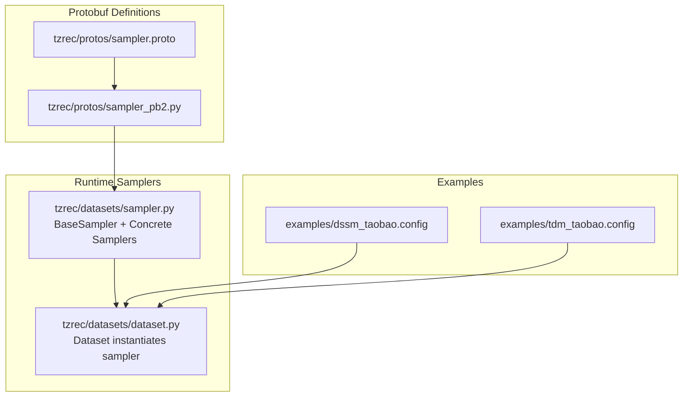
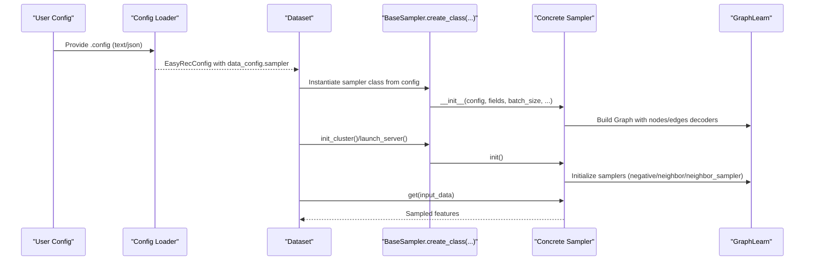
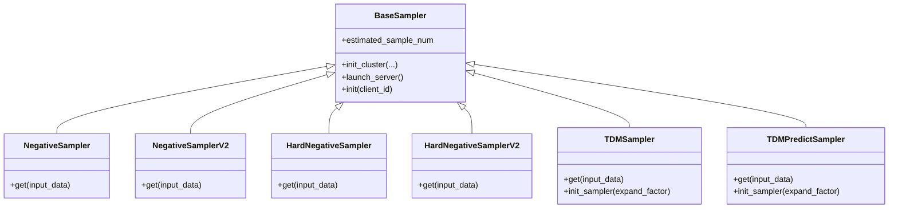
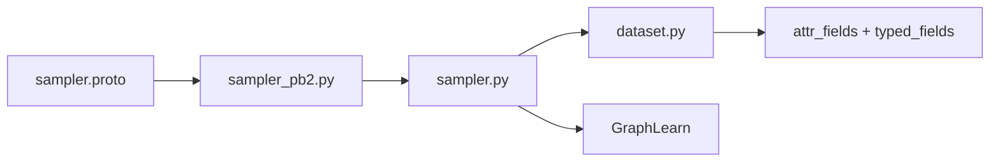
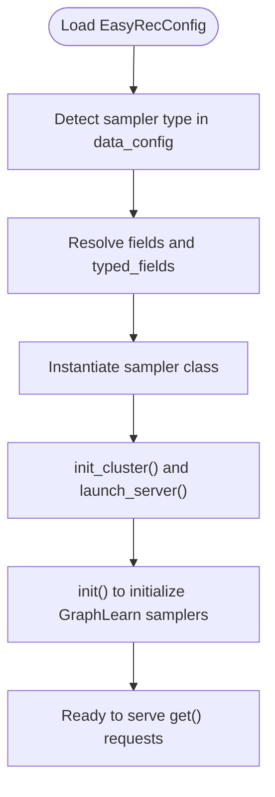

# Sampling Configuration and Protocols

<cite>
**Referenced Files in This Document**
- [sampler.proto](file://tzrec/protos/sampler.proto)
- [sampler_pb2.py](file://tzrec/protos/sampler_pb2.py)
- [sampler.py](file://tzrec/datasets/sampler.py)
- [dataset.py](file://tzrec/datasets/dataset.py)
- [dssm_taobao.config](file://examples/dssm_taobao.config)
- [tdm_taobao.config](file://examples/tdm_taobao.config)
- [config_util.py](file://tzrec/utils/config_util.py)
- [odps_dataset.py](file://tzrec/datasets/odps_dataset.py)
</cite>

## Table of Contents

1. [Introduction](#introduction)
1. [Project Structure](#project-structure)
1. [Core Components](#core-components)
1. [Architecture Overview](#architecture-overview)
1. [Detailed Component Analysis](#detailed-component-analysis)
1. [Dependency Analysis](#dependency-analysis)
1. [Performance Considerations](#performance-considerations)
1. [Troubleshooting Guide](#troubleshooting-guide)
1. [Conclusion](#conclusion)
1. [Appendices](#appendices)

## Introduction

This document explains how to configure sampling strategies in TorchEasyRec using Protocol Buffer definitions. It focuses on the sampler message types NegativeSampler, NegativeSamplerV2, HardNegativeSampler, HardNegativeSamplerV2, and TDMSampler. You will learn the configuration parameters, field requirements, validation rules, and how these configurations integrate with runtime sampler instantiation. It also covers the roles of attr_fields and typed_fields, the relationship between sampling configuration and data schema, practical configuration examples, parameter tuning guidelines, troubleshooting, configuration inheritance, environment-specific settings, and best practices for cross-environment deployments.

## Project Structure

The sampling configuration is defined in Protocol Buffers and compiled into Python classes. Runtime samplers are implemented in Python and instantiated from configuration messages during dataset initialization.

**Diagram sources**

- \[sampler.proto\](file://tzrec/protos/sampler.proto#L1-L142)
- \[sampler_pb2.py\](file://tzrec/protos/sampler_pb2.py#L1-L35)
- \[sampler.py\](file://tzrec/datasets/sampler.py#L129-L139)
- \[dataset.py\](file://tzrec/datasets/dataset.py#L241-L263)
- \[dssm_taobao.config\](file://examples/dssm_taobao.config#L29-L41)
- \[tdm_taobao.config\](file://examples/tdm_taobao.config#L31-L44)

**Section sources**

- \[sampler.proto\](file://tzrec/protos/sampler.proto#L1-L142)
- \[sampler_pb2.py\](file://tzrec/protos/sampler_pb2.py#L1-L35)
- \[sampler.py\](file://tzrec/datasets/sampler.py#L129-L139)
- \[dataset.py\](file://tzrec/datasets/dataset.py#L241-L263)
- \[dssm_taobao.config\](file://examples/dssm_taobao.config#L29-L41)
- \[tdm_taobao.config\](file://examples/tdm_taobao.config#L31-L44)

## Core Components

- Protocol Buffer message definitions for samplers:
  - NegativeSampler: batch-level negative sampling from item data with attributes.
  - NegativeSamplerV2: user/item-level negative sampling conditioned on positive edges.
  - HardNegativeSampler: combines batch negatives with hard negative edges.
  - HardNegativeSamplerV2: user/item-level variant with hard negative edges.
  - TDMSampler: tree-based layered negative sampling for Tree-Structured Deep Matching.
- Runtime sampler classes:
  - BaseSampler: common logic for attribute field resolution, typed fields, and GraphLearn integration.
  - Concrete samplers: NegativeSampler, NegativeSamplerV2, HardNegativeSampler, HardNegativeSamplerV2, TDMSampler.

Key runtime behaviors:

- attr_fields and typed_fields define which input fields are parsed as node attributes and how they are cast.
- Evaluation sampling supports separate num_eval_sample overrides.
- Field delimiters and attribute delimiters are configurable.
- TDMSampler enforces structural constraints (e.g., root layer count) and supports probabilistic retained layers.

**Section sources**

- \[sampler.proto\](file://tzrec/protos/sampler.proto#L4-L23)
- \[sampler.proto\](file://tzrec/protos/sampler.proto#L26-L51)
- \[sampler.proto\](file://tzrec/protos/sampler.proto#L53-L80)
- \[sampler.proto\](file://tzrec/protos/sampler.proto#L82-L112)
- \[sampler.proto\](file://tzrec/protos/sampler.proto#L114-L141)
- \[sampler.py\](file://tzrec/datasets/sampler.py#L219-L286)
- \[sampler.py\](file://tzrec/datasets/sampler.py#L397-L462)
- \[sampler.py\](file://tzrec/datasets/sampler.py#L464-L553)
- \[sampler.py\](file://tzrec/datasets/sampler.py#L555-L650)
- \[sampler.py\](file://tzrec/datasets/sampler.py#L651-L751)
- \[sampler.py\](file://tzrec/datasets/sampler.py#L753-L966)
- \[sampler.py\](file://tzrec/datasets/sampler.py#L968-L1055)

## Architecture Overview

The configuration-to-runtime flow:

**Diagram sources**

- \[config_util.py\](file://tzrec/utils/config_util.py#L25-L48)
- \[dataset.py\](file://tzrec/datasets/dataset.py#L241-L263)
- \[sampler.py\](file://tzrec/datasets/sampler.py#L129-L139)
- \[sampler.py\](file://tzrec/datasets/sampler.py#L287-L325)
- \[sampler.py\](file://tzrec/datasets/sampler.py#L434-L441)
- \[sampler.py\](file://tzrec/datasets/sampler.py#L514-L521)
- \[sampler.py\](file://tzrec/datasets/sampler.py#L608-L618)
- \[sampler.py\](file://tzrec/datasets/sampler.py#L709-L719)
- \[sampler.py\](file://tzrec/datasets/sampler.py#L831-L852)

## Detailed Component Analysis

### NegativeSampler

Purpose:

- Weighted random sampling of items not present in the current batch.

Configuration parameters:

- input_path: Required. Path to item data with schema id:int64 | weight:float | attrs:string.
- num_sample: Required. Number of negative samples per batch.
- attr_fields: Required. Names of attributes to parse from attrs string.
- item_id_field: Required. Field name for item id in input data.
- attr_delimiter: Optional. Delimiter for attributes within attrs string (default ":").
- num_eval_sample: Optional. Separate number of samples during evaluation (default 0).
- field_delimiter: Optional. Delimiter for input records.
- item_id_delim: Optional. Delimiter for item ids within records (default ";").

Validation and behavior:

- attr_fields are resolved against input fields and typed_fields; missing fields are ignored with a warning.
- Evaluation mode overrides num_sample with num_eval_sample if present.
- GraphLearn decoder uses weighted=True and parses attributes with attr_delimiter.

Integration:

- Instantiated via BaseSampler.create_class(...) and initialized with GraphLearn nodes and negative sampler.

**Section sources**

- \[sampler.proto\](file://tzrec/protos/sampler.proto#L4-L23)
- \[sampler.py\](file://tzrec/datasets/sampler.py#L219-L286)
- \[sampler.py\](file://tzrec/datasets/sampler.py#L410-L462)

### NegativeSamplerV2

Purpose:

- Weighted random sampling of items that do not share a positive edge with the user.

Configuration parameters:

- user_input_path: Required. User data schema => userid:int64 | weight:float.
- item_input_path: Required. Item data schema => itemid:int64 | weight:float | attrs:string.
- pos_edge_input_path: Required. Positive edge schema => userid:int64 | itemid:int64 | weight:float.
- num_sample: Required. Number of negative samples per batch.
- attr_fields: Required. Attribute names to parse.
- item_id_field: Required. Item id field name.
- user_id_field: Required. User id field name.
- attr_delimiter: Optional. Default ":".
- num_eval_sample: Optional. Default 0.
- field_delimiter: Optional.

Validation and behavior:

- Builds a graph with user, item nodes and positive edges; uses conditional negative sampling on edges.
- Initialization includes a small warm-up get() call to prevent timeouts.

**Section sources**

- \[sampler.proto\](file://tzrec/protos/sampler.proto#L26-L51)
- \[sampler.py\](file://tzrec/datasets/sampler.py#L464-L553)

### HardNegativeSampler

Purpose:

- Combine batch negatives with hard negative edges sourced from a dedicated hard_neg_edge dataset.

Configuration parameters:

- user_input_path: Required.
- item_input_path: Required.
- hard_neg_edge_input_path: Required. Schema => userid:int64 | itemid:int64 | weight:float.
- num_sample: Required.
- num_hard_sample: Required. Maximum number of hard negatives to collect.
- attr_fields: Required.
- item_id_field: Required.
- user_id_field: Required.
- attr_delimiter: Optional. Default ":".
- num_eval_sample: Optional. Default 0.
- field_delimiter: Optional.

Validation and behavior:

- Initializes both a negative sampler (per item) and a neighbor sampler on hard_neg_edge.
- Returns concatenated features: first batch_size are negatives, followed by hard negatives.
- Estimated sample number accounts for both negative and hard negative counts.

**Section sources**

- \[sampler.proto\](file://tzrec/protos/sampler.proto#L53-L80)
- \[sampler.py\](file://tzrec/datasets/sampler.py#L555-L650)

### HardNegativeSamplerV2

Purpose:

- User/item-level variant combining negative sampling conditioned on positive edges with hard negatives.

Configuration parameters:

- user_input_path: Required.
- item_input_path: Required.
- pos_edge_input_path: Required.
- hard_neg_edge_input_path: Required.
- num_sample: Required.
- num_hard_sample: Required.
- attr_fields: Required.
- item_id_field: Required.
- user_id_field: Required.
- attr_delimiter: Optional. Default ":".
- num_eval_sample: Optional. Default 0.
- field_delimiter: Optional.

Validation and behavior:

- Uses conditional negative sampling on edges and neighbor sampling on hard_neg_edge.
- Same concatenation semantics as HardNegativeSampler.

**Section sources**

- \[sampler.proto\](file://tzrec/protos/sampler.proto#L82-L112)
- \[sampler.py\](file://tzrec/datasets/sampler.py#L651-L751)

### TDMSampler

Purpose:

- Tree-structured layered negative sampling for Tree-Structured Deep Matching.

Configuration parameters:

- item_input_path: Required. Item data with attrs.
- edge_input_path: Required. Ancestor edges for training.
- predict_edge_input_path: Required. Children edges for prediction.
- attr_fields: Required. Attributes to parse; TDMSampler ensures "tree_level" and item_id_field are included.
- item_id_field: Required.
- layer_num_sample: Required. Non-decreasing list specifying number of negatives per layer.
- attr_delimiter: Optional. Default ":".
- num_eval_sample: Optional. Default 0.
- field_delimiter: Optional.
- remain_ratio: Optional. Proportion of middle layers to retain during training (default 1.0).
- probability_type: Optional. "UNIFORM", "ARITHMETIC", or "RECIPROCAL" for retained layer selection (default "UNIFORM").

Validation and behavior:

- Enforces that layer_num_sample[0] == 0 (root layer must have zero samples).
- Supports probabilistic retained layers when remain_ratio < 1.0.
- During training, collects positive ancestors and negative samples layer-by-layer; concatenates per-user adjacent negatives.
- During prediction, uses children edges to expand recall candidates.

**Section sources**

- \[sampler.proto\](file://tzrec/protos/sampler.proto#L114-L141)
- \[sampler.py\](file://tzrec/datasets/sampler.py#L753-L966)
- \[sampler.py\](file://tzrec/datasets/sampler.py#L968-L1055)

### Class Relationships

**Diagram sources**

- \[sampler.py\](file://tzrec/datasets/sampler.py#L219-L286)
- \[sampler.py\](file://tzrec/datasets/sampler.py#L397-L462)
- \[sampler.py\](file://tzrec/datasets/sampler.py#L464-L553)
- \[sampler.py\](file://tzrec/datasets/sampler.py#L555-L650)
- \[sampler.py\](file://tzrec/datasets/sampler.py#L651-L751)
- \[sampler.py\](file://tzrec/datasets/sampler.py#L753-L966)
- \[sampler.py\](file://tzrec/datasets/sampler.py#L968-L1055)

## Dependency Analysis

- Protobuf definitions are compiled into Python descriptors and message classes.
- Runtime samplers depend on GraphLearn for graph construction and sampling.
- Dataset initialization detects the sampler type via data_config.oneof and instantiates the corresponding class.
- attr_fields and typed_fields bridge configuration to schema-aware attribute parsing.

**Diagram sources**

- \[sampler.proto\](file://tzrec/protos/sampler.proto#L1-L142)
- \[sampler_pb2.py\](file://tzrec/protos/sampler_pb2.py#L1-L35)
- \[sampler.py\](file://tzrec/datasets/sampler.py#L219-L286)
- \[dataset.py\](file://tzrec/datasets/dataset.py#L241-L263)

**Section sources**

- \[sampler_pb2.py\](file://tzrec/protos/sampler_pb2.py#L1-L35)
- \[sampler.py\](file://tzrec/datasets/sampler.py#L219-L286)
- \[dataset.py\](file://tzrec/datasets/dataset.py#L241-L263)

## Performance Considerations

- num_sample and layer_num_sample directly impact memory and compute; tune based on hardware capacity.
- TDMSampler retain_ratio and probability_type trade-off training coverage vs. speed.
- Using weighted sampling improves representation quality but may increase IO overhead.
- GraphLearn clustering and client distribution affect latency; ensure proper cluster setup.

[No sources needed since this section provides general guidance]

## Troubleshooting Guide

Common issues and resolutions:

- Unknown attribute names in attr_fields:
  - Symptom: Warning about ignored features.
  - Cause: attr_fields names not found in input fields or typed_fields.
  - Resolution: Verify field names match schema; ensure typed_fields are provided when needed.
- Evaluation sample mismatch:
  - Symptom: Unexpected sample counts during eval.
  - Cause: num_eval_sample not set or misconfigured.
  - Resolution: Set num_eval_sample in data_config.sampler for evaluation mode.
- TDMSampler root layer constraint:
  - Symptom: Assertion failure for layer_num_sample[0] != 0.
  - Cause: Root layer sample count not zero.
  - Resolution: Ensure layer_num_sample starts with 0.
- Retained layer probability type:
  - Symptom: ValueError for unsupported probability_type.
  - Cause: Invalid value provided.
  - Resolution: Use "UNIFORM", "ARITHMETIC", or "RECIPROCAL".
- GraphLearn initialization timeouts:
  - Symptom: Timeout during sampler init.
  - Cause: Heavy graph loading or network issues.
  - Resolution: Add small warm-up get() call and ensure cluster setup is correct.

**Section sources**

- \[sampler.py\](file://tzrec/datasets/sampler.py#L272-L277)
- \[sampler.py\](file://tzrec/datasets/sampler.py#L239-L240)
- \[sampler.py\](file://tzrec/datasets/sampler.py#L808-L808)
- \[sampler.py\](file://tzrec/datasets/sampler.py#L824-L828)
- \[sampler.py\](file://tzrec/datasets/sampler.py#L527-L529)
- \[sampler.py\](file://tzrec/datasets/sampler.py#L858-L862)

## Conclusion

TorchEasyRec’s sampling system is driven by Protocol Buffer configurations and implemented via GraphLearn-backed Python samplers. Properly setting attr_fields and typed_fields aligns configuration with schema, while num_sample and layer_num_sample govern performance and accuracy. TDMSampler introduces structured tree sampling with retention controls. Following the guidelines and examples here will help you configure robust, maintainable sampling strategies across environments.

[No sources needed since this section summarizes without analyzing specific files]

## Appendices

### Practical Configuration Examples

- Negative sampling for DSSM:

  - Demonstrates negative_sampler with input_path, num_sample, attr_fields, item_id_field, and attr_delimiter.
  - Example path: \[dssm_taobao.config\](file://examples/dssm_taobao.config#L29-L41)

- TDM sampling for Tree-Structured Deep Matching:

  - Demonstrates tdm_sampler with item_input_path, edge_input_path, predict_edge_input_path, attr_fields, item_id_field, layer_num_sample, and attr_delimiter.
  - Example path: \[tdm_taobao.config\](file://examples/tdm_taobao.config#L31-L44)

**Section sources**

- \[dssm_taobao.config\](file://examples/dssm_taobao.config#L29-L41)
- \[tdm_taobao.config\](file://examples/tdm_taobao.config#L31-L44)

### Parameter Tuning Guidelines

- num_sample:
  - Start moderate; increase gradually while monitoring throughput and GPU utilization.
- num_hard_sample:
  - Keep proportional to num_sample; hard negatives improve discrimination but add compute.
- layer_num_sample (TDMSampler):
  - Begin with small counts per layer; increase from root outward.
- remain_ratio and probability_type (TDMSampler):
  - Use UNIFORM for balanced layers; ARITHMETIC/RECIPROCAL for emphasis on deeper layers.
- attr_delimiter and field_delimiter:
  - Match your data encoding; default values are provided but should reflect actual separators.

[No sources needed since this section provides general guidance]

### Configuration Inheritance and Environment-Specific Settings

- Configuration loading:
  - Pipeline configs support JSON or text formats; unknown fields can be allowed for compatibility.
  - Example path: \[config_util.py\](file://tzrec/utils/config_util.py#L25-L48)
- Environment variables:
  - ODPS-related variables may be required for MaxCompute datasets.
  - Example path: \[odps_dataset.py\](file://tzrec/datasets/odps_dataset.py#L55-L86)
- Data schema mapping:
  - Ensure attr_fields and typed_fields align with the dataset’s Arrow schema and feature groups.

**Section sources**

- \[config_util.py\](file://tzrec/utils/config_util.py#L25-L48)
- \[odps_dataset.py\](file://tzrec/datasets/odps_dataset.py#L55-L86)

### Relationship Between Sampling Configuration and Data Schema

- attr_fields:
  - Names of fields to parse as attributes; resolved against input fields and typed_fields.
- typed_fields:
  - Explicitly typed fields (e.g., tree_level) enable correct casting and decoding.
- item_id_field and user_id_field:
  - Must match schema; used as keys for sampling and graph edges.
- Field delimiters:
  - Control parsing of multi-valued attributes and record boundaries.

**Section sources**

- \[sampler.py\](file://tzrec/datasets/sampler.py#L244-L277)
- \[sampler.py\](file://tzrec/datasets/sampler.py#L776-L787)
- \[sampler.py\](file://tzrec/datasets/sampler.py#L986-L998)

### Runtime Instantiation Flow

**Diagram sources**

- \[dataset.py\](file://tzrec/datasets/dataset.py#L241-L263)
- \[sampler.py\](file://tzrec/datasets/sampler.py#L287-L325)
- \[sampler.py\](file://tzrec/datasets/sampler.py#L434-L441)
- \[sampler.py\](file://tzrec/datasets/sampler.py#L514-L521)
- \[sampler.py\](file://tzrec/datasets/sampler.py#L608-L618)
- \[sampler.py\](file://tzrec/datasets/sampler.py#L709-L719)
- \[sampler.py\](file://tzrec/datasets/sampler.py#L831-L852)
