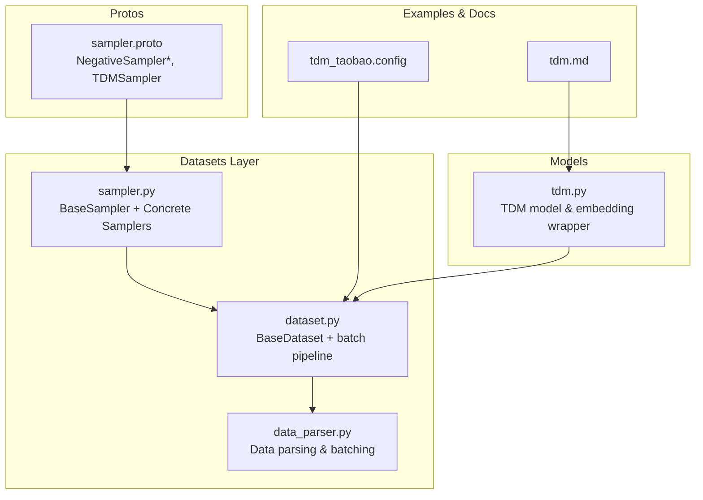
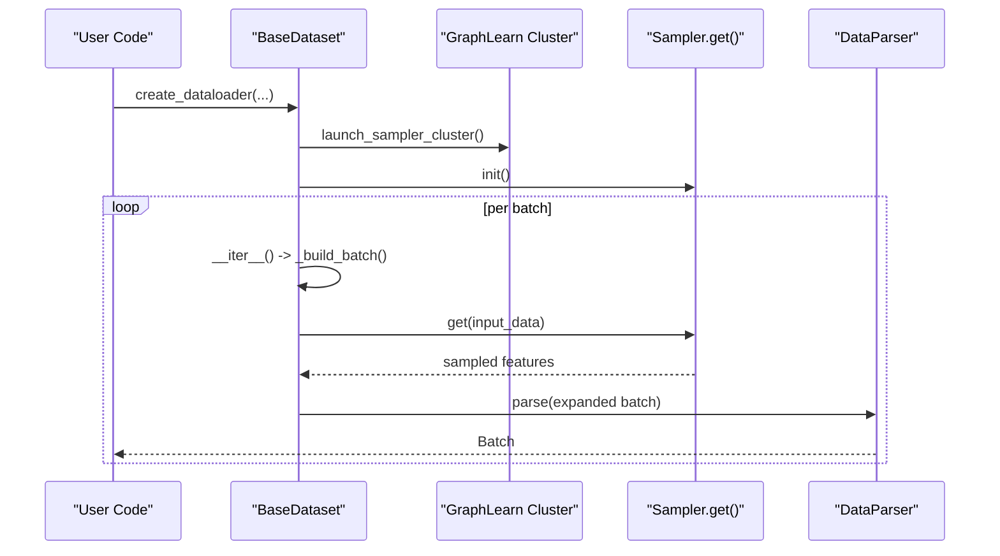
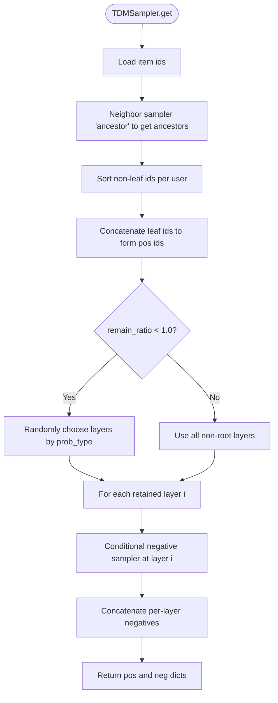
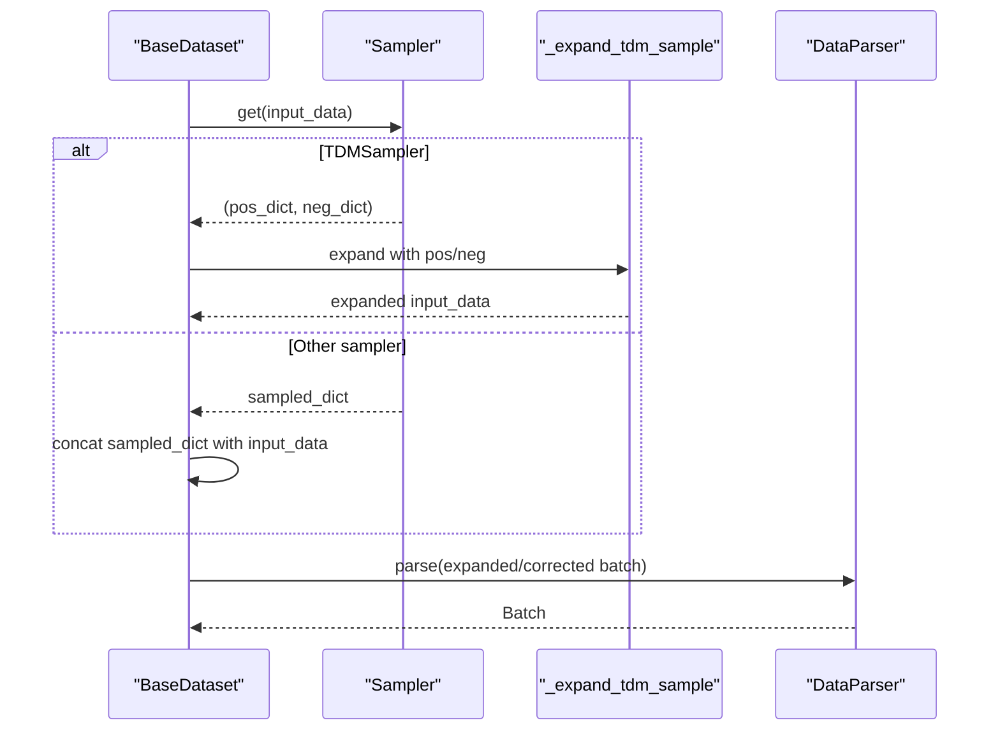
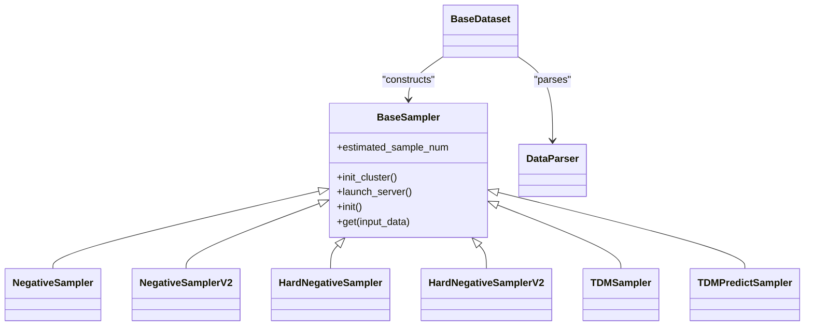

# Sampling Strategies

<cite>
**Referenced Files in This Document**
- [sampler.py](file://tzrec/datasets/sampler.py)
- [sampler.proto](file://tzrec/protos/sampler.proto)
- [dataset.py](file://tzrec/datasets/dataset.py)
- [data_parser.py](file://tzrec/datasets/data_parser.py)
- [tdm.py](file://tzrec/models/tdm.py)
- [tdm_taobao.config](file://examples/tdm_taobao.config)
- [tdm.md](file://docs/source/models/tdm.md)
- [sampler_test.py](file://tzrec/datasets/sampler_test.py)
- [retrieval.py](file://tzrec/tools/tdm/retrieval.py)
</cite>

## Table of Contents

1. [Introduction](#introduction)
1. [Project Structure](#project-structure)
1. [Core Components](#core-components)
1. [Architecture Overview](#architecture-overview)
1. [Detailed Component Analysis](#detailed-component-analysis)
1. [Dependency Analysis](#dependency-analysis)
1. [Performance Considerations](#performance-considerations)
1. [Troubleshooting Guide](#troubleshooting-guide)
1. [Conclusion](#conclusion)
1. [Appendices](#appendices)

## Introduction

This document explains TorchEasyRec’s sampling strategies and negative sampling mechanisms. It focuses on the BaseSampler abstract class and its concrete implementations, including NegativeSampler, NegativeSamplerV2, HardNegativeSampler, HardNegativeSamplerV2, TDMSampler, and TDMPredictSampler. It covers the sampling architecture, configuration options, integration with the data pipeline, and special handling for Tree-based Deep Model (TDM) sampling. Practical guidance is provided for configuring samplers, implementing custom sampling logic, optimizing performance, mitigating sampling bias, and troubleshooting common issues.

## Project Structure

Sampling is implemented in the datasets layer and integrated with the data pipeline. The key files are:

- Sampling implementations and graph-learn integration: \[sampler.py\](file://tzrec/datasets/sampler.py)
- Protobuf definitions for sampler configurations: \[sampler.proto\](file://tzrec/protos/sampler.proto)
- Dataset integration and batch expansion for TDM: \[dataset.py\](file://tzrec/datasets/dataset.py)
- Data parsing and batching: \[data_parser.py\](file://tzrec/datasets/data_parser.py)
- TDM model and inference wrapper: \[tdm.py\](file://tzrec/models/tdm.py)
- Example TDM configuration: \[tdm_taobao.config\](file://examples/tdm_taobao.config)
- TDM documentation and configuration notes: \[tdm.md\](file://docs/source/models/tdm.md)
- Sampler tests validating behavior and estimations: \[sampler_test.py\](file://tzrec/datasets/sampler_test.py)
- TDM retrieval pipeline utilities: \[retrieval.py\](file://tzrec/tools/tdm/retrieval.py)

**Diagram sources**

- \[sampler.py\](file://tzrec/datasets/sampler.py#L219-L1055)
- \[dataset.py\](file://tzrec/datasets/dataset.py#L149-L429)
- \[data_parser.py\](file://tzrec/datasets/data_parser.py#L56-L475)
- \[sampler.proto\](file://tzrec/protos/sampler.proto#L4-L142)
- \[tdm.py\](file://tzrec/models/tdm.py#L28-L146)
- \[tdm_taobao.config\](file://examples/tdm_taobao.config#L31-L44)
- \[tdm.md\](file://docs/source/models/tdm.md#L15-L129)

**Section sources**

- \[sampler.py\](file://tzrec/datasets/sampler.py#L1-L1055)
- \[sampler.proto\](file://tzrec/protos/sampler.proto#L1-L142)
- \[dataset.py\](file://tzrec/datasets/dataset.py#L149-L429)
- \[data_parser.py\](file://tzrec/datasets/data_parser.py#L56-L475)
- \[tdm.py\](file://tzrec/models/tdm.py#L28-L146)
- \[tdm_taobao.config\](file://examples/tdm_taobao.config#L31-L44)
- \[tdm.md\](file://docs/source/models/tdm.md#L15-L129)

## Core Components

- BaseSampler: Abstract base class that initializes GraphLearn clients, manages cluster setup, parses node attributes, and defines the interface for sampling.
- NegativeSampler: Uniform weighted negative sampling from a global item graph; samples items not in the batch.
- NegativeSamplerV2: Conditional negative sampling respecting user-item edges; samples items not connected to the user in the positive graph.
- HardNegativeSampler: Combines standard negative sampling with hard negatives from a dedicated hard-edge graph.
- HardNegativeSamplerV2: Conditional variant of hard negative sampling using positive edges to define the conditional space.
- TDMSampler: Hierarchical sampling along a tree for TDM training; collects ancestors as positives and samples negatives layer-by-layer; supports random layer retention.
- TDMPredictSampler: Tree traversal sampler for retrieval/inference using children edges.

Key responsibilities:

- Cluster lifecycle: initialization, server launch, client registration.
- Attribute parsing: conversion from GraphLearn node attributes to PyArrow arrays and downstream tensors.
- Estimating sample sizes: exposed via estimated_sample_num for batch sizing.

**Section sources**

- \[sampler.py\](file://tzrec/datasets/sampler.py#L219-L395)
- \[sampler.py\](file://tzrec/datasets/sampler.py#L397-L462)
- \[sampler.py\](file://tzrec/datasets/sampler.py#L464-L553)
- \[sampler.py\](file://tzrec/datasets/sampler.py#L555-L650)
- \[sampler.py\](file://tzrec/datasets/sampler.py#L651-L751)
- \[sampler.py\](file://tzrec/datasets/sampler.py#L753-L966)
- \[sampler.py\](file://tzrec/datasets/sampler.py#L968-L1055)

## Architecture Overview

The sampling architecture integrates with the data pipeline as follows:

- BaseDataset constructs a sampler from the data config and launches a GraphLearn cluster.
- During iteration, BaseDataset reads batches, optionally applies sampler-specific transformations, concatenates sampled features with the original batch, and passes data to DataParser for tensorization.
- For TDM, BaseDataset expands the batch by concatenating positive and negative samples contiguously and duplicates user features accordingly.

**Diagram sources**

- \[dataset.py\](file://tzrec/datasets/dataset.py#L241-L264)
- \[dataset.py\](file://tzrec/datasets/dataset.py#L309-L316)
- \[dataset.py\](file://tzrec/datasets/dataset.py#L317-L419)
- \[data_parser.py\](file://tzrec/datasets/data_parser.py#L178-L260)

**Section sources**

- \[dataset.py\](file://tzrec/datasets/dataset.py#L241-L264)
- \[dataset.py\](file://tzrec/datasets/dataset.py#L309-L316)
- \[dataset.py\](file://tzrec/datasets/dataset.py#L317-L419)
- \[data_parser.py\](file://tzrec/datasets/data_parser.py#L178-L260)

## Detailed Component Analysis

### BaseSampler

- Initializes GraphLearn client and cluster, sets field delimiters and ID hashing mode.
- Parses node attributes into PyArrow arrays, handling int/float/string types and typed fields.
- Exposes estimated_sample_num for batch sizing.

Implementation highlights:

- Cluster bootstrap and NCCL-aware communication for multi-node/multi-process environments.
- Attribute parsing with UTF-8 decoding and type casting.
- Lifecycle: init_cluster -> launch_server -> init -> get.

**Section sources**

- \[sampler.py\](file://tzrec/datasets/sampler.py#L219-L395)

### NegativeSampler (Uniform Weighted)

- Builds a GraphLearn graph from item nodes with weights.
- Uses a negative sampler with strategy “node_weight”.
- Samples items not present in the current batch.

Configuration fields (from proto):

- input_path, num_sample, attr_fields, item_id_field, attr_delimiter, num_eval_sample, field_delimiter, item_id_delim.

Behavior:

- Pads input ids to batch size.
- Returns parsed attributes for negative items.

**Section sources**

- \[sampler.py\](file://tzrec/datasets/sampler.py#L397-L462)
- \[sampler.proto\](file://tzrec/protos/sampler.proto#L4-L23)

### NegativeSamplerV2 (Conditional Uniform)

- Builds user/item nodes and positive edges.
- Uses a conditional negative sampler on edges to avoid positive neighbors.
- Introduces a small sleep to mitigate GL timeouts during initialization.

Configuration fields:

- user_input_path, item_input_path, pos_edge_input_path, num_sample, attr_fields, item_id_field, user_id_field, attr_delimiter, num_eval_sample, field_delimiter.

**Section sources**

- \[sampler.py\](file://tzrec/datasets/sampler.py#L464-L553)
- \[sampler.proto\](file://tzrec/protos/sampler.proto#L26-L51)

### HardNegativeSampler

- Extends NegativeSampler with a hard negative edge graph.
- Returns standard negatives followed by hard negatives; attaches indices for hard negatives.

Configuration fields:

- user_input_path, item_input_path, hard_neg_edge_input_path, num_sample, num_hard_sample, attr_fields, item_id_field, user_id_field, attr_delimiter, num_eval_sample, field_delimiter.

**Section sources**

- \[sampler.py\](file://tzrec/datasets/sampler.py#L555-L650)
- \[sampler.proto\](file://tzrec/protos/sampler.proto#L53-L80)

### HardNegativeSamplerV2

- Conditional variant using positive edges to define the conditional space for negative sampling.
- Also supports hard negatives from a dedicated edge.

Configuration fields:

- user_input_path, item_input_path, pos_edge_input_path, hard_neg_edge_input_path, num_sample, num_hard_sample, attr_fields, item_id_field, user_id_field, attr_delimiter, num_eval_sample, field_delimiter.

**Section sources**

- \[sampler.py\](file://tzrec/datasets/sampler.py#L651-L751)
- \[sampler.proto\](file://tzrec/protos/sampler.proto#L82-L112)

### TDMSampler (Hierarchical Tree Sampling)

- Purpose: For TDM training, collect ancestors as positive samples and sample negatives layer-by-layer.
- Requires:
  - item nodes with attributes.
  - ancestor edges for upward traversal.
  - predict edges for retrieval.
- Special attribute handling: ensures “tree_level” and “item_id” are present in attr_fields.
- Layer-wise sampling:
  - Collects ancestors for each leaf item.
  - Optionally randomly retains a subset of non-root layers (remain_ratio and probability_type).
  - Samples negatives per retained layer with per-layer counts from layer_num_sample.
- Estimated sample size: sum(layer_num_sample) + (levels - 2) * batch_size.

Configuration fields:

- item_input_path, edge_input_path, predict_edge_input_path, attr_fields, item_id_field, layer_num_sample, attr_delimiter, num_eval_sample, field_delimiter, remain_ratio, probability_type.

Training-time layer retention:

- remain_ratio controls fraction of non-root layers to keep.
- probability_type supports UNIFORM, ARITHMETIC, RECIPROCAL.

**Diagram sources**

- \[sampler.py\](file://tzrec/datasets/sampler.py#L864-L958)

**Section sources**

- \[sampler.py\](file://tzrec/datasets/sampler.py#L753-L966)
- \[sampler.proto\](file://tzrec/protos/sampler.proto#L114-L141)

### TDMPredictSampler (Retrieval)

- Purpose: Retrieve children nodes for beam search-style retrieval.
- Uses children edges to traverse down the tree.
- Supports dynamic expand_factor for two-stage sampling.

Configuration fields:

- Same as TDMSampler excluding layer_num_sample; uses predict_edge_input_path.

**Section sources**

- \[sampler.py\](file://tzrec/datasets/sampler.py#L968-L1055)
- \[sampler.proto\](file://tzrec/protos/sampler.proto#L114-L141)

### Data Pipeline Integration

- BaseDataset:
  - Detects sampler type from data config and constructs the appropriate sampler.
  - Launches GraphLearn cluster and initializes sampler clients.
  - In training, for TDMSampler, expands the batch by concatenating positive and negative samples contiguously and duplicating user features to preserve user-item relationships.
  - For other samplers, concatenates sampled features with existing ones.
- DataParser:
  - Converts PyArrow arrays to tensors and builds Batch objects.
  - Handles hard negative indices when present.

**Diagram sources**

- \[dataset.py\](file://tzrec/datasets/dataset.py#L317-L419)
- \[dataset.py\](file://tzrec/datasets/dataset.py#L81-L146)

**Section sources**

- \[dataset.py\](file://tzrec/datasets/dataset.py#L149-L429)
- \[data_parser.py\](file://tzrec/datasets/data_parser.py#L178-L260)

## Dependency Analysis

- BaseSampler depends on GraphLearn for distributed sampling and PyTorch distributed for cluster coordination.
- Concrete samplers depend on BaseSampler and GraphLearn graph construction APIs.
- BaseDataset composes samplers and DataParser to produce Batch objects.
- TDMSampler relies on TDM model components for training and TDMPredictSampler for retrieval.

**Diagram sources**

- \[sampler.py\](file://tzrec/datasets/sampler.py#L219-L1055)
- \[dataset.py\](file://tzrec/datasets/dataset.py#L149-L429)
- \[data_parser.py\](file://tzrec/datasets/data_parser.py#L56-L475)

**Section sources**

- \[sampler.py\](file://tzrec/datasets/sampler.py#L219-L1055)
- \[dataset.py\](file://tzrec/datasets/dataset.py#L149-L429)
- \[data_parser.py\](file://tzrec/datasets/data_parser.py#L56-L475)

## Performance Considerations

- GraphLearn cluster sizing:
  - num_client_per_rank influences GraphLearn client count; BaseDataset sets this based on dataloader workers.
  - For training_and_eval, clients per rank are doubled to reuse the cluster.
- Distributed initialization:
  - BaseSampler uses WORLD_SIZE, LOCAL_WORLD_SIZE, GROUP_RANK, and LOCAL_RANK to bootstrap the cluster and exchange server info.
- Timeout mitigation:
  - NegativeSamplerV2/HardNegativeSamplerV2 introduce random sleeps to prevent GL timeouts during initial sampler creation.
- TDM sampling overhead:
  - TDMSampler performs ancestor walks and per-layer negative sampling; tune layer_num_sample to balance recall and speed.
  - remain_ratio and probability_type reduce effective layers to mitigate overfitting and improve throughput.
- Memory and batching:
  - BaseDataset exposes sampled_batch_size via estimated_sample_num to inform total batch size.
  - For very large negatives, consider reducing num_sample or using hierarchical strategies (e.g., TDM).

[No sources needed since this section provides general guidance]

## Troubleshooting Guide

Common issues and resolutions:

- GraphLearn timeout during sampler init:
  - Symptom: GL initialization stalls or fails early.
  - Resolution: Ensure proper WORLD_SIZE/LOCAL_WORLD_SIZE and allow the random sleep to mitigate race conditions.
- Wrong item_id type:
  - Symptom: Sampling errors or incorrect IDs.
  - Resolution: Set USE_HASH_NODE_ID appropriately; BaseSampler detects and converts hashed IDs internally.
- Missing attributes in attr_fields:
  - Symptom: Warnings about ignored features; unexpected shapes.
  - Resolution: Ensure attr_fields include required fields (e.g., “tree_level”, “item_id” for TDM).
- Large-scale negative sampling OOM:
  - Symptom: GPU memory spikes.
  - Resolution: Reduce num_sample or layer_num_sample; leverage remain_ratio in TDMSampler; consider weighted sampling to focus on informative negatives.
- Hard negative indices missing:
  - Symptom: Absence of hard negative indices in the batch.
  - Resolution: Verify hard_neg_edge_input_path and sampler configuration; DataParser warns when HARD_NEG_INDICES are absent.

**Section sources**

- \[sampler.py\](file://tzrec/datasets/sampler.py#L81-L127)
- \[sampler.py\](file://tzrec/datasets/sampler.py#L514-L530)
- \[data_parser.py\](file://tzrec/datasets/data_parser.py#L256-L259)

## Conclusion

TorchEasyRec’s sampling subsystem provides flexible, scalable negative sampling strategies integrated with GraphLearn and PyTorch. BaseSampler offers a robust foundation for distributed sampling, while specialized samplers address diverse scenarios: uniform weighted negatives, conditional negatives, hard negatives, and hierarchical TDM sampling. The data pipeline seamlessly integrates sampling into training and evaluation, enabling efficient large-scale negative sampling and retrieval. Proper configuration, awareness of performance trade-offs, and attention to distributed initialization are key to reliable operation.

[No sources needed since this section summarizes without analyzing specific files]

## Appendices

### Configuration Reference

- NegativeSampler

  - Fields: input_path, num_sample, attr_fields, item_id_field, attr_delimiter, num_eval_sample, field_delimiter, item_id_delim.
  - Typical use: global weighted negative sampling.

- NegativeSamplerV2

  - Fields: user_input_path, item_input_path, pos_edge_input_path, num_sample, attr_fields, item_id_field, user_id_field, attr_delimiter, num_eval_sample, field_delimiter.

- HardNegativeSampler

  - Fields: user_input_path, item_input_path, hard_neg_edge_input_path, num_sample, num_hard_sample, attr_fields, item_id_field, user_id_field, attr_delimiter, num_eval_sample, field_delimiter.

- HardNegativeSamplerV2

  - Fields: user_input_path, item_input_path, pos_edge_input_path, hard_neg_edge_input_path, num_sample, num_hard_sample, attr_fields, item_id_field, user_id_field, attr_delimiter, num_eval_sample, field_delimiter.

- TDMSampler

  - Fields: item_input_path, edge_input_path, predict_edge_input_path, attr_fields, item_id_field, layer_num_sample, attr_delimiter, num_eval_sample, field_delimiter, remain_ratio, probability_type.
  - Notes: attr_fields must include “tree_level” and “item_id”; layer_num_sample defines per-layer negative counts.

**Section sources**

- \[sampler.proto\](file://tzrec/protos/sampler.proto#L4-L142)
- \[tdm.md\](file://docs/source/models/tdm.md#L104-L121)

### Practical Examples

- Configuring TDMSampler in a pipeline:

  - Example config demonstrates tdm_sampler with item_input_path, edge_input_path, predict_edge_input_path, attr_fields, item_id_field, and layer_num_sample.
  - See \[tdm_taobao.config\](file://examples/tdm_taobao.config#L31-L44).

- Running training with sampling:

  - Use torchrun with train_eval entry point and pass pipeline config path and data paths.
  - See \[train.md\](file://docs/source/usage/train.md#L5-L13).

- Retrieval with TDMPredictSampler:

  - Utilities initialize sampler with expand_factor and traverse children edges for retrieval.
  - See \[retrieval.py\](file://tzrec/tools/tdm/retrieval.py#L72-L87).

**Section sources**

- \[tdm_taobao.config\](file://examples/tdm_taobao.config#L31-L44)
- \[train.md\](file://docs/source/usage/train.md#L5-L13)
- \[retrieval.py\](file://tzrec/tools/tdm/retrieval.py#L72-L87)

### Validation and Estimations

- Sampler tests validate:
  - NegativeSampler estimation matches configured num_sample.
  - TDMSampler estimation equals sum(layer_num_sample) plus levels contribution.
  - TDMPredictSampler estimation upper bound aligns with tree depth.
- See \[sampler_test.py\](file://tzrec/datasets/sampler_test.py#L169-L207) and \[sampler_test.py\](file://tzrec/datasets/sampler_test.py#L553-L681).

**Section sources**

- \[sampler_test.py\](file://tzrec/datasets/sampler_test.py#L169-L207)
- \[sampler_test.py\](file://tzrec/datasets/sampler_test.py#L553-L681)
