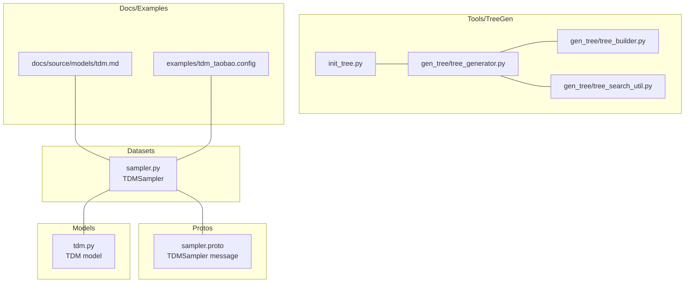
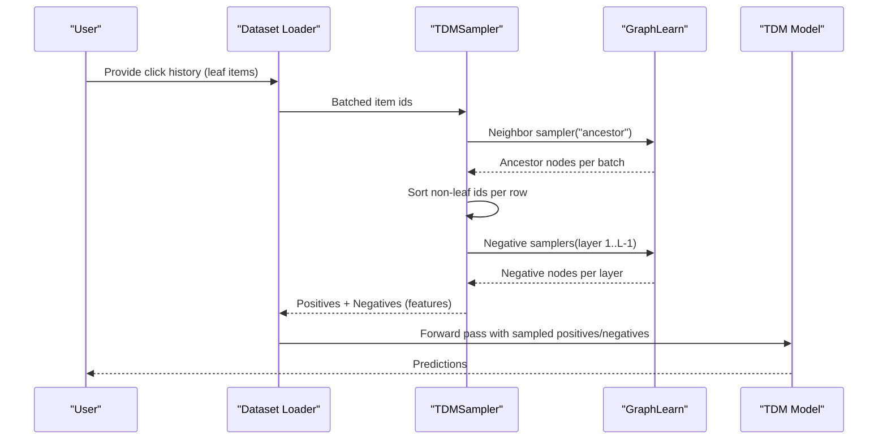
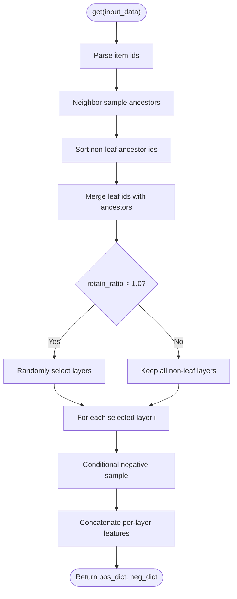
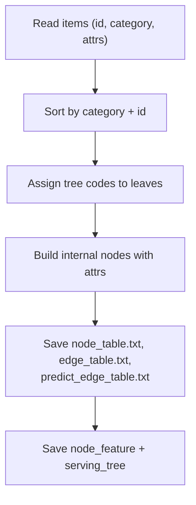
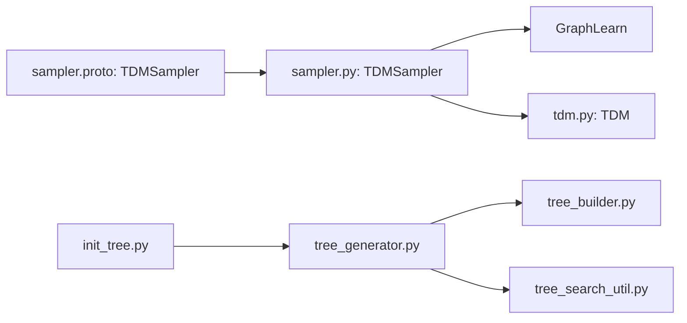

# Tree-based Deep Model Sampling

<cite>
**Referenced Files in This Document**
- [sampler.py](file://tzrec/datasets/sampler.py)
- [sampler.proto](file://tzrec/protos/sampler.proto)
- [tdm.py](file://tzrec/models/tdm.py)
- [tree_builder.py](file://tzrec/tools/tdm/gen_tree/tree_builder.py)
- [tree_generator.py](file://tzrec/tools/tdm/gen_tree/tree_generator.py)
- [tree_search_util.py](file://tzrec/tools/tdm/gen_tree/tree_search_util.py)
- [init_tree.py](file://tzrec/tools/tdm/init_tree.py)
- [tdm.md](file://docs/source/models/tdm.md)
- [tdm_taobao.config](file://examples/tdm_taobao.config)
</cite>

## Table of Contents

1. [Introduction](#introduction)
1. [Project Structure](#project-structure)
1. [Core Components](#core-components)
1. [Architecture Overview](#architecture-overview)
1. [Detailed Component Analysis](#detailed-component-analysis)
1. [Dependency Analysis](#dependency-analysis)
1. [Performance Considerations](#performance-considerations)
1. [Troubleshooting Guide](#troubleshooting-guide)
1. [Conclusion](#conclusion)
1. [Appendices](#appendices)

## Introduction

This document explains TorchEasyRec’s Tree-based Deep Model (TDM) sampling pipeline, focusing on the TDMSampler implementation for hierarchical training on taxonomy trees. It covers:

- Hierarchical positive sampling via ancestor traversal
- Layer-by-layer negative sampling with configurable per-layer sample counts
- Tree-level attribute handling and integration with hierarchical softmax training
- Configuration requirements for tree structures and sampling distributions
- Practical guidance for tree construction, performance optimization, and troubleshooting

## Project Structure

The TDMSampler lives in the datasets layer and integrates with GraphLearn for scalable graph sampling. Tree construction utilities are provided under tools/tdm/gen_tree. Documentation and example configurations demonstrate usage.

**Diagram sources**

- \[sampler.py\](file://tzrec/datasets/sampler.py#L753-L966)
- \[sampler.proto\](file://tzrec/protos/sampler.proto#L114-L141)
- \[tdm.py\](file://tzrec/models/tdm.py#L28-L99)
- \[tree_generator.py\](file://tzrec/tools/tdm/gen_tree/tree_generator.py#L21-L67)
- \[tree_builder.py\](file://tzrec/tools/tdm/gen_tree/tree_builder.py#L69-L147)
- \[tree_search_util.py\](file://tzrec/tools/tdm/gen_tree/tree_search_util.py#L57-L96)
- \[init_tree.py\](file://tzrec/tools/tdm/init_tree.py#L18-L106)
- \[tdm.md\](file://docs/source/models/tdm.md#L1-L129)
- \[tdm_taobao.config\](file://examples/tdm_taobao.config#L25-L44)

**Section sources**

- \[sampler.py\](file://tzrec/datasets/sampler.py#L753-L966)
- \[sampler.proto\](file://tzrec/protos/sampler.proto#L114-L141)
- \[tdm.py\](file://tzrec/models/tdm.py#L28-L99)
- \[tree_generator.py\](file://tzrec/tools/tdm/gen_tree/tree_generator.py#L21-L67)
- \[tree_builder.py\](file://tzrec/tools/tdm/gen_tree/tree_builder.py#L69-L147)
- \[tree_search_util.py\](file://tzrec/tools/tdm/gen_tree/tree_search_util.py#L57-L96)
- \[init_tree.py\](file://tzrec/tools/tdm/init_tree.py#L18-L106)
- \[tdm.md\](file://docs/source/models/tdm.md#L1-L129)
- \[tdm_taobao.config\](file://examples/tdm_taobao.config#L25-L44)

## Core Components

- TDMSampler: Implements hierarchical sampling for TDM training. It:
  - Samples all ancestors of clicked leaf items as positives
  - Performs layer-wise negative sampling controlled by per-layer counts
  - Supports random layer retention during training to reduce overfitting
- Protobuf message: Defines TDMSampler configuration including input paths, attribute fields, layer counts, and retention controls
- TDM model: Consumes sampled positives/negatives to train hierarchical classifiers per tree layer
- Tree generation tools: Build taxonomy trees, write node/edge tables, and prepare serving artifacts

Key responsibilities:

- Sampling orchestration and batching
- GraphLearn integration for neighbor and negative sampling
- Attribute parsing and feature concatenation for training

**Section sources**

- \[sampler.py\](file://tzrec/datasets/sampler.py#L753-L966)
- \[sampler.proto\](file://tzrec/protos/sampler.proto#L114-L141)
- \[tdm.py\](file://tzrec/models/tdm.py#L28-L99)
- \[tree_generator.py\](file://tzrec/tools/tdm/gen_tree/tree_generator.py#L21-L67)
- \[tree_search_util.py\](file://tzrec/tools/tdm/gen_tree/tree_search_util.py#L126-L190)

## Architecture Overview

The TDMSampler composes a graph with item nodes and ancestor edges. It uses neighbor sampling to collect ancestors as positives and negative sampling per layer to produce negatives. The TDM model consumes these samples to train a hierarchical softmax-like objective.

**Diagram sources**

- \[sampler.py\](file://tzrec/datasets/sampler.py#L831-L958)
- \[tdm.py\](file://tzrec/models/tdm.py#L79-L98)

## Detailed Component Analysis

### TDMSampler Implementation

- Initialization:
  - Ensures “tree_level” and “item_id” are present in attr_fields and typed as int64
  - Builds a graph with item nodes and ancestor edges
  - Validates layer_num_sample[0] == 0 (root layer has zero negatives)
- Positive sampling:
  - Uses a neighbor sampler along meta-path “ancestor” to fetch all ancestors for each leaf
  - Sorts non-leaf ancestor ids per row to ensure deterministic ordering
- Layer-wise negative sampling:
  - Constructs negative samplers per layer with conditional sampling
  - Retains only a random subset of non-leaf layers (controlled by remain_ratio and probability_type)
  - Concatenates features ensuring same-user negatives are contiguous
- Estimation:
  - Estimated sample count scales with sum(layer_num_sample) plus per-layer overhead

**Diagram sources**

- \[sampler.py\](file://tzrec/datasets/sampler.py#L864-L958)

**Section sources**

- \[sampler.py\](file://tzrec/datasets/sampler.py#L753-L966)

### Tree Construction and Preparation

- Tree generation:
  - Reads item features and sorts leaves by category and item id
  - Assigns tree codes to leaves and builds internal nodes with aggregated attributes
- Node/edge table generation:
  - Writes node_table.txt with id, weight, and delimited features including tree_level
  - Writes edge_table.txt with ancestor relationships
  - Writes predict_edge_table.txt for retrieval beam search
  - Saves node_feature for serving and a compact serving_tree for runtime
- Command-line entrypoint:
  - init_tree.py orchestrates generation, saving, and serving artifacts

**Diagram sources**

- \[tree_generator.py\](file://tzrec/tools/tdm/gen_tree/tree_generator.py#L63-L136)
- \[tree_builder.py\](file://tzrec/tools/tdm/gen_tree/tree_builder.py#L81-L147)
- \[tree_search_util.py\](file://tzrec/tools/tdm/gen_tree/tree_search_util.py#L126-L319)
- \[init_tree.py\](file://tzrec/tools/tdm/init_tree.py#L81-L106)

**Section sources**

- \[tree_generator.py\](file://tzrec/tools/tdm/gen_tree/tree_generator.py#L21-L136)
- \[tree_builder.py\](file://tzrec/tools/tdm/gen_tree/tree_builder.py#L69-L195)
- \[tree_search_util.py\](file://tzrec/tools/tdm/gen_tree/tree_search_util.py#L57-L319)
- \[init_tree.py\](file://tzrec/tools/tdm/init_tree.py#L18-L106)

### Configuration Requirements and Data Preparation

- TDMSampler configuration fields:
  - item_input_path, edge_input_path, predict_edge_input_path
  - attr_fields (must include “tree_level”, followed by item attributes)
  - item_id_field
  - layer_num_sample (per-layer negative counts; first element must be 0)
  - remain_ratio and probability_type (optional)
- Example configuration demonstrates typical feature groups and TDM model parameters
- Documentation outlines schema expectations and recommended attribute ordering

Practical tips:

- Ensure “tree_level” is the first attribute in attr_fields and typed as int64
- Align attr_fields order with saved node_table features
- Tune layer_num_sample to reflect branching and coverage needs

**Section sources**

- \[sampler.proto\](file://tzrec/protos/sampler.proto#L114-L141)
- \[tdm.md\](file://docs/source/models/tdm.md#L104-L121)
- \[tdm_taobao.config\](file://examples/tdm_taobao.config#L31-L43)

### Integration with Hierarchical Softmax Training

- Positive sampling collects all ancestors of clicked items, forming a path from leaf to root
- Negative sampling operates layer-by-layer; retained layers are determined by remain_ratio and probability_type
- The TDM model stacks embeddings and applies multi-window attention and MLP heads to produce per-layer logits suitable for hierarchical softmax-style training

**Section sources**

- \[sampler.py\](file://tzrec/datasets/sampler.py#L878-L958)
- \[tdm.py\](file://tzrec/models/tdm.py#L79-L98)
- \[tdm.md\](file://docs/source/models/tdm.md#L1-L14)

## Dependency Analysis

- TDMSampler depends on:
  - GraphLearn graph with item nodes and ancestor edges
  - Typed attribute fields including “tree_level”
  - Per-layer negative samplers configured via layer_num_sample
- Tree generation depends on:
  - Item feature reader
  - TreeBuilder for code assignment and node aggregation
  - TreeSearch for writing node/edge tables and serving artifacts

**Diagram sources**

- \[sampler.proto\](file://tzrec/protos/sampler.proto#L114-L141)
- \[sampler.py\](file://tzrec/datasets/sampler.py#L753-L966)
- \[tdm.py\](file://tzrec/models/tdm.py#L28-L99)
- \[tree_generator.py\](file://tzrec/tools/tdm/gen_tree/tree_generator.py#L21-L67)
- \[tree_builder.py\](file://tzrec/tools/tdm/gen_tree/tree_builder.py#L69-L147)
- \[tree_search_util.py\](file://tzrec/tools/tdm/gen_tree/tree_search_util.py#L57-L96)
- \[init_tree.py\](file://tzrec/tools/tdm/init_tree.py#L18-L106)

**Section sources**

- \[sampler.py\](file://tzrec/datasets/sampler.py#L753-L966)
- \[tree_generator.py\](file://tzrec/tools/tdm/gen_tree/tree_generator.py#L21-L67)
- \[tree_search_util.py\](file://tzrec/tools/tdm/gen_tree/tree_search_util.py#L57-L96)

## Performance Considerations

- Layer retention:
  - remain_ratio reduces compute by training only a subset of non-leaf layers per batch
  - probability_type controls selection distribution across layers
- Conditional negative sampling:
  - Reduces redundant sampling by conditioning on current layer’s parent ids
- Sorting and concatenation:
  - Sorting ancestor ids ensures deterministic ordering and efficient concatenation
- Memory management:
  - For large trees, consider:
    - Using hashed node ids to enable lexicographic sorting
    - Limiting max layers and per-layer negatives
    - Tuning batch size and num_workers to balance throughput and memory
- GraphLearn tuning:
  - Adjust client counts and thread settings for large-scale sampling

[No sources needed since this section provides general guidance]

## Troubleshooting Guide

Common issues and resolutions:

- Missing “tree_level” in attr_fields:
  - Ensure “tree_level” is included and typed as int64; TDMSampler inserts it automatically if missing
- Incorrect layer_num_sample\[0\]:
  - First element must be 0; otherwise initialization asserts
- Hashed vs numeric node ids:
  - When using hashed ids, ensure node ids are strings and attributes contain raw ids for reconstruction
- Attribute ordering mismatch:
  - attr_fields order must match saved node_table features; mismatches cause incorrect feature parsing
- Large tree memory pressure:
  - Reduce remain_ratio, limit layer_num_sample, or split training into smaller batches
- Retrieval edge mismatch:
  - Verify predict_edge_table.txt includes edges for beam search and root connectivity

**Section sources**

- \[sampler.py\](file://tzrec/datasets/sampler.py#L776-L787)
- \[sampler.py\](file://tzrec/datasets/sampler.py#L808-L809)
- \[sampler.py\](file://tzrec/datasets/sampler.py#L881-L892)
- \[tree_search_util.py\](file://tzrec/tools/tdm/gen_tree/tree_search_util.py#L126-L190)

## Conclusion

TDMSampler enables efficient hierarchical sampling over taxonomy trees, integrating ancestor-based positive sampling with layer-wise negative sampling guided by per-layer counts and retention controls. Combined with robust tree construction utilities and clear configuration requirements, it supports scalable training of hierarchical models aligned with GraphLearn infrastructure.

[No sources needed since this section summarizes without analyzing specific files]

## Appendices

### Best Practices

- Prepare node/edge tables with consistent attribute ordering and “tree_level” as the first attribute
- Tune layer_num_sample to reflect tree depth and branching; start small and scale gradually
- Use remain_ratio and probability_type to stabilize training on large hierarchies
- Validate retrieval edges for accurate beam search during inference

**Section sources**

- \[tdm.md\](file://docs/source/models/tdm.md#L104-L121)
- \[tree_search_util.py\](file://tzrec/tools/tdm/gen_tree/tree_search_util.py#L238-L272)
